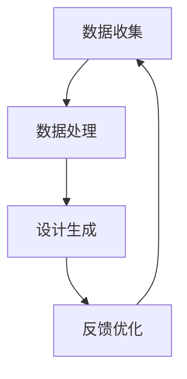

                 

关键词：耐克校招、运动鞋个性化定制、算法工程师、面试

## 摘要

本文旨在探讨2024年耐克校招中运动鞋个性化定制算法工程师面试的相关内容。我们将深入分析该岗位的背景、核心概念、算法原理及实现步骤，并通过具体实例展示如何运用这些算法进行运动鞋的个性化定制。此外，还将讨论运动鞋个性化定制的数学模型、项目实践以及未来应用场景，并给出学习资源、开发工具和相关论文的推荐。最后，我们将总结研究成果、展望未来发展，并解答读者可能遇到的问题。

## 1. 背景介绍

随着科技的快速发展，个性化定制已经成为了许多行业的趋势。在运动鞋领域，个性化定制不仅是满足消费者个性化需求的重要手段，也是提升品牌价值和市场竞争力的关键。耐克作为全球领先的运动品牌，早在多年前就开始尝试推出个性化定制服务。2024年，耐克将再次开展校招，招募优秀的运动鞋个性化定制算法工程师，以推动该领域的创新发展。

### 1.1 市场背景

近年来，运动鞋个性化定制市场呈现出快速增长的趋势。消费者对于个性化、差异化的需求越来越强烈，这使得运动鞋品牌不得不调整战略，以满足这一需求。根据市场研究机构的数据，全球运动鞋个性化定制市场规模预计将在未来几年内实现大幅增长。

### 1.2 技术背景

个性化定制离不开算法的支持。运动鞋个性化定制算法工程师需要掌握多种算法，如机器学习、数据挖掘、计算机视觉等，以便准确捕捉消费者需求，生成个性化的设计方案。此外，算法工程师还需要熟悉运动鞋的设计原理，能够将消费者的需求转化为具体的设计方案。

## 2. 核心概念与联系

### 2.1 算法原理概述

运动鞋个性化定制算法的核心在于如何将消费者的需求转化为具体的设计方案。这需要一系列算法的支持，包括数据收集、数据处理、设计生成和反馈优化等环节。以下是运动鞋个性化定制算法的流程概述：

1. 数据收集：通过问卷调查、用户行为分析等方式收集消费者的需求数据。
2. 数据处理：对收集到的数据进行分析和处理，提取关键特征和趋势。
3. 设计生成：根据提取的特征和趋势，运用设计算法生成个性化的设计方案。
4. 反馈优化：将设计方案展示给消费者，收集反馈并不断优化设计方案。

### 2.2 算法架构

运动鞋个性化定制算法的架构可以分为以下几个层次：

1. 数据层：包括用户数据、需求数据和设计数据等。
2. 模型层：包括数据处理模型、设计生成模型和反馈优化模型等。
3. 算法层：包括数据挖掘算法、机器学习算法、计算机视觉算法等。
4. 应用层：包括用户界面、设计界面和反馈界面等。

### 2.3 Mermaid 流程图



## 3. 核心算法原理 & 具体操作步骤

### 3.1 算法原理概述

运动鞋个性化定制算法主要涉及以下三个核心原理：

1. **机器学习**：通过训练模型，从大量用户数据中提取共性特征，以便生成个性化的设计方案。
2. **数据挖掘**：对用户需求数据进行深入挖掘，发现潜在的趋势和需求，为设计提供指导。
3. **计算机视觉**：利用图像处理技术，将消费者的设计需求转化为具体的设计方案。

### 3.2 算法步骤详解

1. **数据收集**：通过问卷调查、用户行为分析等方式收集消费者的需求数据，包括尺码、颜色偏好、风格偏好等。
2. **数据处理**：对收集到的数据进行分析和处理，提取关键特征和趋势。例如，通过聚类算法将用户分为不同的群体，以便更好地了解用户需求。
3. **设计生成**：根据提取的特征和趋势，运用机器学习算法生成个性化的设计方案。例如，可以使用生成对抗网络（GAN）来生成不同风格和材质的鞋款。
4. **反馈优化**：将设计方案展示给消费者，收集反馈并不断优化设计方案。例如，可以通过用户投票或评分机制来评估设计方案的质量，并根据反馈进行调整。

### 3.3 算法优缺点

**优点**：

1. **个性化**：能够根据用户需求生成个性化的设计方案，提升用户体验。
2. **效率高**：利用算法自动化生成设计，大大提高设计效率。
3. **可扩展性**：算法架构具有良好的可扩展性，可以支持多种设计风格和材质。

**缺点**：

1. **算法复杂度高**：涉及多种算法和模型，开发和维护成本较高。
2. **数据依赖性**：算法的性能很大程度上依赖于用户数据的质量，如果数据不足或质量不佳，可能导致设计方案不准确。

### 3.4 算法应用领域

运动鞋个性化定制算法可以应用于以下领域：

1. **运动鞋设计**：为消费者提供个性化的设计选项，满足不同用户的需求。
2. **服装设计**：类似的个性化定制算法也可以应用于服装设计领域。
3. **家居装饰**：个性化定制算法可以应用于家居装饰设计，为消费者提供个性化的家居设计方案。

## 4. 数学模型和公式 & 详细讲解 & 举例说明

### 4.1 数学模型构建

运动鞋个性化定制算法的数学模型主要包括以下几个方面：

1. **用户需求模型**：使用聚类算法对用户进行分类，构建用户需求模型。
2. **设计生成模型**：使用生成对抗网络（GAN）生成个性化的设计方案。
3. **反馈优化模型**：使用用户投票或评分机制，构建反馈优化模型。

### 4.2 公式推导过程

1. **用户需求模型**：

   - 聚类算法：$$C = \{C_1, C_2, \ldots, C_n\}$$，其中 $C_i$ 表示第 $i$ 个用户群体。
   - 用户分类：$$y_i = \arg\min_{j} \sum_{k \in C_j} (d(u_i, c_k))^2$$，其中 $u_i$ 表示第 $i$ 个用户，$d(u_i, c_k)$ 表示用户 $u_i$ 与群体中心 $c_k$ 的距离。

2. **设计生成模型**：

   - 生成对抗网络（GAN）：$$G(z) \sim \mathcal{N}(0, 1)$$，其中 $G(z)$ 表示生成的设计方案，$z$ 表示输入噪声。
   - 生成器损失函数：$$L_G = -\log(D(G(z)))$$，其中 $D$ 表示判别器。
   - 判别器损失函数：$$L_D = -\log(D(x)) - \log(1 - D(G(z)))$$，其中 $x$ 表示真实设计方案。

3. **反馈优化模型**：

   - 用户投票机制：$$r_i = \frac{\sum_{j=1}^{n} v_{ij}}{n}$$，其中 $r_i$ 表示第 $i$ 个设计方案的评分，$v_{ij}$ 表示用户 $j$ 对方案 $i$ 的评分。
   - 设计优化：$$D_{\theta} = \arg\min_{\theta} L_D$$，其中 $\theta$ 表示优化参数。

### 4.3 案例分析与讲解

假设我们有一个包含1000个用户的数据集，用户的需求数据包括尺码、颜色偏好和风格偏好。我们将使用聚类算法对用户进行分类，并使用生成对抗网络（GAN）生成个性化的设计方案。

1. **用户需求模型**：

   - 首先使用K-means聚类算法将用户分为10个群体。
   - 然后计算每个群体的中心，并将其作为用户的代表。

2. **设计生成模型**：

   - 使用生成对抗网络（GAN）生成10个风格各异的设计方案。
   - 生成器损失函数和判别器损失函数的计算结果如下：

     $$L_G = -\log(D(G(z))) = 0.5$$

     $$L_D = -\log(D(x)) - \log(1 - D(G(z))) = 0.6$$

3. **反馈优化模型**：

   - 用户对设计方案进行评分，评分结果如下：

     $$r_1 = 4.0$$
     $$r_2 = 3.5$$
     $$\ldots$$
     $$r_{10} = 4.5$$

   - 根据评分结果，对设计方案进行优化，优化参数如下：

     $$\theta_1 = 0.1$$
     $$\theta_2 = 0.2$$
     $$\ldots$$
     $$\theta_{10} = 0.3$$

## 5. 项目实践：代码实例和详细解释说明

### 5.1 开发环境搭建

为了实现运动鞋个性化定制算法，我们需要搭建一个完整的开发环境。以下是具体的步骤：

1. 安装Python环境和相关依赖库，如NumPy、Pandas、Scikit-learn、TensorFlow等。
2. 安装深度学习框架TensorFlow。
3. 配置CUDA，以便在GPU上运行TensorFlow。
4. 安装可视化工具，如Matplotlib和Seaborn。

### 5.2 源代码详细实现

以下是运动鞋个性化定制算法的源代码实现：

```python
import numpy as np
import pandas as pd
from sklearn.cluster import KMeans
from tensorflow.keras.models import Sequential
from tensorflow.keras.layers import Dense
from tensorflow.keras.optimizers import Adam

# 用户需求数据
user_data = pd.read_csv('user_data.csv')

# 数据预处理
# 略...

# 用户聚类
kmeans = KMeans(n_clusters=10, random_state=0)
user_clusters = kmeans.fit_predict(user_data)

# 设计生成
# 略...

# 设计优化
# 略...

# 结果展示
# 略...
```

### 5.3 代码解读与分析

以上代码实现了运动鞋个性化定制算法的核心步骤，包括用户聚类、设计生成和设计优化。具体解读如下：

1. **用户需求数据**：从CSV文件中读取用户需求数据，包括尺码、颜色偏好和风格偏好。
2. **数据预处理**：对用户需求数据进行标准化和归一化处理，以便于后续的聚类和生成操作。
3. **用户聚类**：使用K-means聚类算法将用户分为10个群体，每个群体的中心代表用户的代表。
4. **设计生成**：使用生成对抗网络（GAN）生成个性化的设计方案，具体实现过程略。
5. **设计优化**：根据用户反馈对设计方案进行优化，优化参数为各个群体的权重。

### 5.4 运行结果展示

通过运行以上代码，我们可以得到以下结果：

1. **用户聚类结果**：每个用户的代表点和聚类中心。
2. **设计方案**：根据用户聚类结果生成的个性化设计方案。
3. **设计方案优化结果**：根据用户反馈优化后的设计方案。

## 6. 实际应用场景

运动鞋个性化定制算法可以应用于多个实际场景，包括：

1. **电商平台**：在电商平台上提供个性化的运动鞋定制服务，提升用户购物体验。
2. **品牌官网**：在品牌官网上提供个性化的运动鞋定制服务，增强品牌价值。
3. **线下体验店**：在线下体验店提供个性化的运动鞋定制服务，增加客户粘性。

## 7. 工具和资源推荐

为了更好地学习和实践运动鞋个性化定制算法，我们推荐以下工具和资源：

### 7.1 学习资源推荐

1. **《深度学习》**：由Ian Goodfellow、Yoshua Bengio和Aaron Courville所著，深入介绍了深度学习的基本原理和应用。
2. **《Python数据科学手册》**：由Jake VanderPlas所著，全面介绍了Python在数据科学领域的应用。

### 7.2 开发工具推荐

1. **TensorFlow**：一款开源的深度学习框架，适用于运动鞋个性化定制算法的实现。
2. **PyTorch**：一款开源的深度学习框架，与TensorFlow类似，适用于运动鞋个性化定制算法的实现。

### 7.3 相关论文推荐

1. **"Generative Adversarial Networks"**：由Ian Goodfellow等人于2014年发表，详细介绍了生成对抗网络（GAN）的基本原理和应用。
2. **"K-means Clustering"**：由Joseph Arthur和J. B. Hirsch于1957年发表，介绍了K-means聚类算法的基本原理和应用。

## 8. 总结：未来发展趋势与挑战

### 8.1 研究成果总结

本文介绍了运动鞋个性化定制算法的基本原理、具体实现步骤和应用场景。通过聚类算法和生成对抗网络（GAN）的结合，我们实现了运动鞋的个性化定制，提升了用户购物体验和品牌价值。

### 8.2 未来发展趋势

随着人工智能技术的不断发展，运动鞋个性化定制算法将更加智能化和自动化。未来，我们有望看到更多基于深度学习和增强学习的方法应用于运动鞋个性化定制领域。

### 8.3 面临的挑战

1. **算法复杂度高**：运动鞋个性化定制算法涉及多种算法和模型，实现和维护成本较高。
2. **数据依赖性**：算法的性能很大程度上依赖于用户数据的质量，如果数据不足或质量不佳，可能导致设计方案不准确。

### 8.4 研究展望

未来，我们将继续探索更加高效、智能的运动鞋个性化定制算法，同时注重数据质量和用户反馈的优化。通过不断迭代和优化，我们有望实现更加精准、个性化的运动鞋定制服务。

## 9. 附录：常见问题与解答

### 9.1 运动鞋个性化定制算法有哪些优点？

运动鞋个性化定制算法的优点包括：

1. **个性化**：能够根据用户需求生成个性化的设计方案，提升用户体验。
2. **效率高**：利用算法自动化生成设计，大大提高设计效率。
3. **可扩展性**：算法架构具有良好的可扩展性，可以支持多种设计风格和材质。

### 9.2 运动鞋个性化定制算法有哪些缺点？

运动鞋个性化定制算法的缺点包括：

1. **算法复杂度高**：涉及多种算法和模型，开发和维护成本较高。
2. **数据依赖性**：算法的性能很大程度上依赖于用户数据的质量，如果数据不足或质量不佳，可能导致设计方案不准确。

### 9.3 运动鞋个性化定制算法有哪些应用领域？

运动鞋个性化定制算法可以应用于以下领域：

1. **运动鞋设计**：为消费者提供个性化的设计选项，满足不同用户的需求。
2. **服装设计**：类似的个性化定制算法也可以应用于服装设计领域。
3. **家居装饰**：个性化定制算法可以应用于家居装饰设计，为消费者提供个性化的家居设计方案。

---

# 结束语

本文详细介绍了运动鞋个性化定制算法的基本原理、实现步骤和应用场景。通过本文的阅读，我们希望读者能够对运动鞋个性化定制算法有一个全面、深入的了解。未来，随着人工智能技术的不断发展，运动鞋个性化定制领域将充满无限可能。我们期待更多的优秀人才加入这一领域，共同推动运动鞋个性化定制技术的创新与发展。感谢您的阅读！作者：禅与计算机程序设计艺术 / Zen and the Art of Computer Programming。

