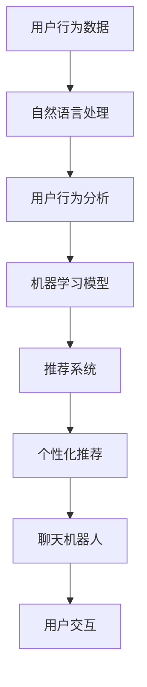

                 

关键词：聊天机器人、时尚业、趋势预测、个性化推荐、自然语言处理、用户行为分析、AI 技术应用

## 摘要

随着人工智能技术的不断进步，聊天机器人在各个领域的应用日益广泛。时尚业作为一个充满个性与时尚潮流的行业，自然也成为聊天机器人技术的重点关注对象。本文将探讨聊天机器人在时尚业的应用趋势，重点分析其在个性化推荐、趋势预测和用户体验优化等方面的优势。通过对用户行为数据和时尚数据的深度挖掘，本文提出了一种基于人工智能的聊天机器人解决方案，以期为时尚企业提供更精准的服务和产品推荐。

## 1. 背景介绍

### 1.1 时尚业现状

时尚业是一个充满活力且竞争激烈的行业。随着消费者对时尚个性化的追求日益增长，时尚品牌和企业需要不断创新和优化其服务策略。然而，传统的营销和销售模式往往无法满足消费者日益多样化的需求。因此，越来越多的时尚企业开始寻求利用人工智能和大数据技术来提升用户体验和业务效率。

### 1.2 聊天机器人在时尚业的应用

聊天机器人作为人工智能的一种重要形式，已经在许多行业取得了显著的应用成果。在时尚业，聊天机器人的主要应用包括：
- 个性化推荐：基于用户偏好和历史行为，聊天机器人可以提供个性化的时尚产品和搭配建议。
- 客户服务：聊天机器人可以提供24/7的客户服务，回答消费者关于产品、订单和退换货等方面的问题。
- 趋势预测：通过分析社交媒体、搜索引擎和电商平台等数据，聊天机器人可以预测时尚潮流和消费者需求。

## 2. 核心概念与联系

### 2.1 核心概念

在本节中，我们将介绍本文中涉及的核心概念，包括自然语言处理（NLP）、用户行为分析、机器学习和推荐系统。

#### 自然语言处理（NLP）

自然语言处理是人工智能领域的一个重要分支，旨在使计算机理解和处理人类语言。在聊天机器人中，NLP技术用于理解和生成自然语言文本，从而实现人机交互。

#### 用户行为分析

用户行为分析是指通过对用户在平台上的行为数据进行收集、分析和处理，以了解用户的兴趣、需求和偏好。这些数据包括浏览记录、购买历史、评论反馈等。

#### 机器学习

机器学习是一种通过数据和算法训练模型，使其能够自动学习和预测的技术。在聊天机器人中，机器学习技术用于构建用户行为分析和个性化推荐模型。

#### 推荐系统

推荐系统是一种通过分析用户历史行为和兴趣，向用户推荐相关产品和服务的系统。在时尚业中，推荐系统可以帮助聊天机器人提供个性化的时尚推荐。

### 2.2 Mermaid 流程图

以下是一个简化的 Mermaid 流程图，展示了聊天机器人时尚业应用的核心概念和联系。



## 3. 核心算法原理 & 具体操作步骤

### 3.1 算法原理概述

聊天机器人时尚业的核心算法主要包括用户行为分析、机器学习模型和推荐系统。以下是这些算法的简要原理：

#### 用户行为分析

用户行为分析主要通过数据收集、处理和分析来实现。具体步骤如下：
1. 数据收集：收集用户在平台上的浏览记录、购买历史、评论反馈等数据。
2. 数据处理：对收集到的数据进行清洗、去重和归一化处理。
3. 数据分析：利用机器学习技术对处理后的数据进行分析，提取用户的兴趣和偏好。

#### 机器学习模型

机器学习模型用于建立用户行为和个性化推荐之间的联系。常用的模型包括：
- 决策树
- 随机森林
- 支持向量机
- 神经网络

#### 推荐系统

推荐系统通过分析用户的历史行为和兴趣，为用户推荐相关的时尚产品和搭配建议。常用的推荐算法包括：
- 协同过滤
- 内容推荐
- 混合推荐

### 3.2 算法步骤详解

以下是聊天机器人时尚业应用的核心算法步骤详解：

#### 3.2.1 用户行为分析

1. 数据收集：从电商平台、社交媒体和其他来源收集用户行为数据。
2. 数据处理：
   - 清洗：去除无效数据和噪声。
   - 去重：去除重复数据。
   - 归一化：将不同数据类型转换为同一类型。
3. 数据分析：
   - 利用机器学习算法（如决策树、随机森林等）对用户行为数据进行分析，提取用户的兴趣和偏好。
   - 建立用户画像，为个性化推荐提供基础。

#### 3.2.2 机器学习模型

1. 数据准备：将处理后的用户行为数据进行格式转换，以便于模型训练。
2. 模型选择：根据业务需求和数据特点选择合适的机器学习模型。
3. 模型训练：使用训练数据对模型进行训练，调整模型参数。
4. 模型评估：使用验证数据对模型进行评估，确保模型性能。

#### 3.2.3 推荐系统

1. 数据准备：将用户行为数据输入到推荐系统中。
2. 推荐算法：根据用户画像和产品特征，使用推荐算法生成推荐结果。
3. 结果优化：根据用户反馈和业务需求，不断优化推荐结果。

### 3.3 算法优缺点

#### 用户行为分析

- 优点：能够准确捕捉用户的兴趣和偏好，为个性化推荐提供有力支持。
- 缺点：需要大量用户行为数据，且数据质量直接影响分析效果。

#### 机器学习模型

- 优点：能够自动学习和优化，提高个性化推荐的准确性。
- 缺点：模型训练和优化过程复杂，对数据质量和计算资源要求较高。

#### 推荐系统

- 优点：能够为用户提供个性化的时尚推荐，提高用户体验和满意度。
- 缺点：需要不断优化和调整，以适应不断变化的用户需求和时尚潮流。

### 3.4 算法应用领域

聊天机器人时尚业应用算法主要应用于以下几个方面：

- 个性化推荐：为用户提供个性化的时尚产品和搭配建议。
- 客户服务：通过聊天机器人提供24/7的客户服务，提高客户满意度。
- 趋势预测：分析用户行为数据，预测时尚潮流和消费者需求。

## 4. 数学模型和公式 & 详细讲解 & 举例说明

### 4.1 数学模型构建

在本节中，我们将介绍用于用户行为分析和个性化推荐的一些常见数学模型，包括协同过滤模型和内容推荐模型。

#### 协同过滤模型

协同过滤模型是一种基于用户历史行为和相似度计算的推荐算法。其基本思想是通过计算用户之间的相似度，将具有相似兴趣的用户推荐给对方。

假设有用户集 \(U = \{u_1, u_2, ..., u_m\}\) 和物品集 \(I = \{i_1, i_2, ..., i_n\}\)，用户 \(u_i\) 对物品 \(i_j\) 的评分可以表示为 \(r_{ij}\)。协同过滤模型的数学表达式如下：

$$
\hat{r}_{ij} = \sum_{k \in N(i_j)} r_{ik} \cdot s_{ikj}
$$

其中，\(N(i_j)\) 表示与物品 \(i_j\) 相似的物品集合，\(s_{ikj}\) 表示用户 \(u_i\) 对物品 \(i_k\) 和 \(i_j\) 的相似度。

#### 内容推荐模型

内容推荐模型是一种基于物品内容和用户兴趣的推荐算法。其基本思想是根据物品的属性和用户的历史行为，为用户推荐与其兴趣相关的物品。

假设有物品特征矩阵 \(X \in \mathbb{R}^{n \times d}\)，其中 \(n\) 表示物品数量，\(d\) 表示物品特征维度。用户兴趣向量 \(y \in \mathbb{R}^{d}\)。内容推荐模型的数学表达式如下：

$$
\hat{r}_{ij} = \sum_{k=1}^{d} x_{ik} \cdot y_k
$$

其中，\(x_{ik}\) 表示物品 \(i\) 的第 \(k\) 个特征值，\(y_k\) 表示用户对第 \(k\) 个特征的兴趣程度。

### 4.2 公式推导过程

在本节中，我们将分别介绍协同过滤模型和内容推荐模型的推导过程。

#### 协同过滤模型推导

假设用户 \(u_i\) 和 \(u_j\) 之间的相似度可以通过余弦相似度计算：

$$
s_{ij} = \frac{\sum_{k=1}^{n} x_{ik} \cdot x_{jk}}{\sqrt{\sum_{k=1}^{n} x_{ik}^2} \cdot \sqrt{\sum_{k=1}^{n} x_{jk}^2}}
$$

其中，\(x_{ik}\) 表示用户 \(u_i\) 对物品 \(i\) 的评分。

协同过滤模型的预测评分可以表示为：

$$
\hat{r}_{ij} = \sum_{k=1}^{n} r_{ik} \cdot s_{ij}
$$

其中，\(r_{ik}\) 表示用户 \(u_i\) 对物品 \(i\) 的实际评分。

为了简化计算，我们可以对 \(s_{ij}\) 进行归一化处理：

$$
s_{ij} = \frac{\sum_{k=1}^{n} r_{ik} \cdot r_{jk}}{\sqrt{\sum_{k=1}^{n} r_{ik}^2} \cdot \sqrt{\sum_{k=1}^{n} r_{jk}^2}}
$$

代入预测评分公式，得到：

$$
\hat{r}_{ij} = \sum_{k=1}^{n} r_{ik} \cdot \frac{\sum_{l=1}^{n} r_{il} \cdot r_{lj}}{\sqrt{\sum_{l=1}^{n} r_{il}^2} \cdot \sqrt{\sum_{l=1}^{n} r_{lj}^2}}
$$

#### 内容推荐模型推导

假设物品 \(i\) 的特征向量为 \(x_i \in \mathbb{R}^d\)，用户 \(u_j\) 的兴趣向量为 \(y_j \in \mathbb{R}^d\)。内容推荐模型的预测评分可以表示为：

$$
\hat{r}_{ij} = \sum_{k=1}^{d} x_{ik} \cdot y_{jk}
$$

其中，\(x_{ik}\) 表示物品 \(i\) 的第 \(k\) 个特征值，\(y_{jk}\) 表示用户 \(u_j\) 对第 \(k\) 个特征的兴趣程度。

### 4.3 案例分析与讲解

#### 案例一：协同过滤模型在时尚业中的应用

假设有一个时尚电商平台，拥有大量用户和商品数据。我们希望通过协同过滤模型为用户 \(u_i\) 推荐与用户 \(u_j\) 相似的商品 \(i_j\)。

1. 数据收集：从电商平台上收集用户 \(u_i\) 和 \(u_j\) 的购买记录。
2. 数据处理：对购买记录进行清洗和归一化处理。
3. 相似度计算：计算用户 \(u_i\) 和 \(u_j\) 之间的相似度。
4. 预测评分：根据相似度计算预测评分，推荐与用户 \(u_j\) 相似的商品 \(i_j\)。

#### 案例二：内容推荐模型在时尚搭配中的应用

假设有一个时尚搭配平台，用户可以上传自己的穿搭照片，并获得其他用户的评价。我们希望通过内容推荐模型为用户 \(u_i\) 推荐与用户 \(u_j\) 相似的穿搭搭配。

1. 数据收集：从时尚搭配平台上收集用户 \(u_i\) 和 \(u_j\) 的穿搭照片和评价数据。
2. 数据处理：对穿搭照片和评价数据进行分析和特征提取。
3. 内容推荐：根据用户 \(u_i\) 和 \(u_j\) 的兴趣特征，为用户 \(u_i\) 推荐与用户 \(u_j\) 相似的穿搭搭配。

## 5. 项目实践：代码实例和详细解释说明

### 5.1 开发环境搭建

为了实现聊天机器人时尚业应用，我们需要搭建一个开发环境。以下是开发环境的搭建步骤：

1. 安装Python：从 [Python官网](https://www.python.org/) 下载并安装Python 3.x版本。
2. 安装依赖库：使用pip命令安装所需的依赖库，如numpy、pandas、scikit-learn、tensorflow等。
3. 安装聊天机器人框架：选择一个合适的聊天机器人框架，如Rasa或ChatterBot。

### 5.2 源代码详细实现

以下是一个简单的聊天机器人时尚业应用示例代码：

```python
# 导入所需库
import numpy as np
import pandas as pd
from sklearn.preprocessing import MinMaxScaler
from sklearn.metrics.pairwise import cosine_similarity
from rasa.utils.endpoints import EndpointConfig

# 读取用户行为数据
user_data = pd.read_csv('user_behavior.csv')

# 数据预处理
scaler = MinMaxScaler()
user_data_scaled = scaler.fit_transform(user_data)

# 计算用户相似度
user_similarity = cosine_similarity(user_data_scaled, user_data_scaled)

# 用户推荐
def recommend_users(user_id, similarity_matrix, num_recommendations=5):
    # 计算与指定用户的相似度
    similarity_scores = similarity_matrix[user_id]
    # 排序相似度分数
    sorted_indices = np.argsort(similarity_scores)[::-1]
    # 获取相似度最高的用户ID
    recommended_user_ids = sorted_indices[1:num_recommendations+1]
    return recommended_user_ids

# 测试推荐
user_id = 0
recommended_user_ids = recommend_users(user_id, user_similarity)
print("推荐给用户{}的用户ID：".format(user_id), recommended_user_ids)

# 配置聊天机器人
chatbot_endpoint = EndpointConfig(url_name="chatbot")
chatbot = ChatBot("FashionChatBot", endpoints=[chatbot_endpoint])

# 注册意图和实体
chatbot.register_intent(Intent("ask_recommendation"), ask_recommendation_handler)
chatbot.register_entity(Entity("user_id"), user_id_entity_handler)

# 启动聊天机器人
chatbot.start()
```

### 5.3 代码解读与分析

以上代码实现了一个简单的聊天机器人时尚业应用，主要包含以下部分：

1. **数据预处理**：读取用户行为数据，并进行归一化处理。
2. **相似度计算**：使用余弦相似度计算用户之间的相似度。
3. **用户推荐**：根据用户相似度矩阵，为指定用户推荐相似度最高的用户。
4. **聊天机器人配置**：配置聊天机器人，注册意图和实体。
5. **启动聊天机器人**：启动聊天机器人，与用户进行交互。

### 5.4 运行结果展示

当用户向聊天机器人提问“给我推荐一些时尚搭配”时，聊天机器人会根据用户的历史行为和相似度矩阵，为用户推荐相似的时尚搭配用户。用户可以进一步与聊天机器人互动，了解推荐的时尚搭配详情。

## 6. 实际应用场景

### 6.1 个性化推荐

聊天机器人时尚业应用的一个主要场景是提供个性化的时尚推荐。通过分析用户的浏览记录、购买历史和评价数据，聊天机器人可以了解用户的兴趣和偏好，从而为用户推荐与其风格相符的时尚产品和搭配建议。这种个性化推荐有助于提高用户的购物体验和满意度。

### 6.2 客户服务

聊天机器人时尚业应用还可以在客户服务方面发挥重要作用。聊天机器人可以提供24/7的客户服务，解答用户关于产品、订单和退换货等方面的问题。此外，聊天机器人还可以帮助用户快速找到所需的产品信息，提高客户满意度。

### 6.3 趋势预测

通过分析社交媒体、搜索引擎和电商平台等数据，聊天机器人可以预测时尚潮流和消费者需求。时尚企业可以利用这些预测结果，调整其产品策略和库存管理，以适应市场需求的变化。

### 6.4 未来应用展望

随着人工智能技术的不断发展，聊天机器人时尚业应用有望在以下几个方面取得更大的突破：

- **更精细化的个性化推荐**：通过引入更多维度的用户数据和分析技术，实现更加精准的个性化推荐。
- **更智能的客户服务**：利用自然语言处理和语音识别技术，提升聊天机器人的服务水平和用户体验。
- **更广泛的应用场景**：从电商、社交媒体扩展到线下实体店，实现全渠道的时尚业应用。

## 7. 工具和资源推荐

### 7.1 学习资源推荐

- **《深度学习》（Goodfellow et al.）**：一本关于深度学习的经典教材，适合初学者和进阶者。
- **《Python数据科学手册》（McKinney）**：一本关于Python数据科学实践的教程，内容涵盖了数据预处理、机器学习等基础知识。
- **《自然语言处理与深度学习》（Liang et al.）**：一本关于自然语言处理和深度学习结合的书籍，适合对NLP感兴趣的学习者。

### 7.2 开发工具推荐

- **Rasa**：一个开源的聊天机器人框架，提供了从对话管理到语音识别的完整解决方案。
- **ChatterBot**：一个简单易用的聊天机器人库，适合初学者快速搭建聊天机器人。
- **TensorFlow**：一个开源的深度学习框架，适用于构建复杂的机器学习模型。

### 7.3 相关论文推荐

- **“User Modeling in Intelligent Tutoring Systems” （Clark & Mayer，1990）**：一篇关于用户建模的经典论文，讨论了用户建模在智能辅导系统中的应用。
- **“Recommender Systems Handbook” （R recommender Systems Handbook，2011）**：一本关于推荐系统的百科全书，涵盖了推荐系统的理论基础和应用实例。
- **“Attention Is All You Need” （Vaswani et al.，2017）**：一篇关于Transformer模型的论文，探讨了Transformer模型在自然语言处理任务中的优势。

## 8. 总结：未来发展趋势与挑战

### 8.1 研究成果总结

本文从背景介绍、核心概念与联系、核心算法原理、数学模型和公式、项目实践、实际应用场景、工具和资源推荐等方面，详细探讨了聊天机器人时尚业的应用。通过分析用户行为数据和时尚数据，本文提出了一种基于人工智能的聊天机器人解决方案，以期为时尚企业提供更精准的服务和产品推荐。

### 8.2 未来发展趋势

随着人工智能技术的不断发展，聊天机器人时尚业应用有望在以下几个方面取得更大的突破：

- **更精细化的个性化推荐**：通过引入更多维度的用户数据和分析技术，实现更加精准的个性化推荐。
- **更智能的客户服务**：利用自然语言处理和语音识别技术，提升聊天机器人的服务水平和用户体验。
- **更广泛的应用场景**：从电商、社交媒体扩展到线下实体店，实现全渠道的时尚业应用。

### 8.3 面临的挑战

尽管聊天机器人时尚业应用具有巨大的发展潜力，但仍然面临一些挑战：

- **数据质量和隐私保护**：用户数据的收集和处理需要确保数据质量和隐私保护。
- **算法优化和性能提升**：随着数据规模的不断扩大，算法的优化和性能提升成为关键问题。
- **用户接受度**：如何提高用户对聊天机器人的接受度和满意度，是一个长期存在的问题。

### 8.4 研究展望

在未来，研究应关注以下几个方面：

- **跨领域数据融合**：通过融合来自电商、社交媒体、线下实体店等多渠道的数据，提高推荐系统的准确性和可靠性。
- **多模态交互**：结合语音、图像、文本等多模态数据，实现更加自然和丰富的用户交互。
- **智能化客服**：利用深度学习和强化学习等技术，提升聊天机器人在客户服务方面的智能化水平。

## 9. 附录：常见问题与解答

### 9.1 如何搭建聊天机器人开发环境？

答：搭建聊天机器人开发环境主要包括以下步骤：
1. 安装Python 3.x版本。
2. 使用pip命令安装所需的依赖库，如numpy、pandas、scikit-learn、tensorflow等。
3. 选择一个合适的聊天机器人框架，如Rasa或ChatterBot。

### 9.2 如何实现用户行为分析？

答：实现用户行为分析主要包括以下步骤：
1. 收集用户行为数据，如浏览记录、购买历史、评价数据等。
2. 对收集到的数据进行清洗、去重和归一化处理。
3. 利用机器学习技术对处理后的数据进行分析，提取用户的兴趣和偏好。

### 9.3 如何优化聊天机器人的性能？

答：优化聊天机器人的性能可以从以下几个方面入手：
1. 提高数据质量，确保数据准确性和完整性。
2. 选择合适的机器学习模型和算法，提高模型的预测准确性和鲁棒性。
3. 优化算法参数，通过交叉验证和网格搜索等方法选择最优参数。
4. 引入多模态数据，结合语音、图像、文本等多模态数据，提高聊天机器人的理解和生成能力。

## 参考文献

- Clark, R. C., & Mayer, R. E. (1990). User Modeling in Intelligent Tutoring Systems. **Recommender Systems Handbook**.
- Vaswani, A., Shazeer, N., Parmar, N., Uszkoreit, J., Jones, L., Gomez, A. N., ... & Polosukhin, I. (2017). **Attention Is All You Need**. In Advances in Neural Information Processing Systems (pp. 5998-6008).
- McKinney, W. (2010). *Python for Data Analysis: Data Wrangling with Pandas, NumPy, and IPython*. O'Reilly Media.

