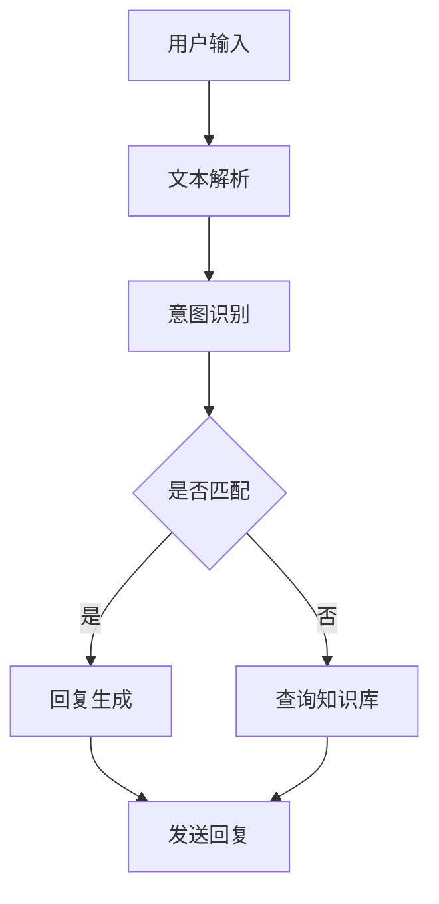

                 

关键词：聊天机器人，AI，客户服务，效率，应用场景，未来展望

> 摘要：本文将探讨聊天机器人在客户服务领域的应用，分析AI技术如何提升客户服务效率。通过介绍聊天机器人的核心概念、算法原理、数学模型、实践案例以及未来发展趋势，旨在为读者提供一个全面的技术视角，帮助企业和开发者更好地理解和利用聊天机器人这一新兴技术。

## 1. 背景介绍

在数字化时代，客户服务已经成为了企业竞争力的重要组成部分。传统的客户服务模式，如人工电话客服和在线客服，虽然在一定程度上满足了用户的需求，但仍存在效率低、响应时间长、人力成本高等问题。随着人工智能（AI）技术的快速发展，聊天机器人作为一种创新的客户服务工具，逐渐受到了广泛关注。

聊天机器人，又称为虚拟助手或聊天 bots，是通过自然语言处理（NLP）、机器学习（ML）等技术实现的，能够与用户进行实时交互，自动处理常见问题和任务。与传统的客户服务模式相比，聊天机器人具有以下优势：

1. **高效率**：聊天机器人可以24/7不间断工作，无需休息，大大提高了服务效率。
2. **低成本**：聊天机器人可以自动处理大量常见问题，减少了对人工客服的依赖，降低了人力成本。
3. **个性化**：聊天机器人可以根据用户的历史交互记录，提供个性化的服务和推荐。
4. **数据积累**：聊天机器人可以收集用户数据，为后续的个性化服务和营销提供支持。

本文将围绕聊天机器人在客户服务中的应用，探讨其核心概念、算法原理、数学模型、实践案例以及未来发展趋势，帮助读者更深入地了解这一技术，并为其在企业和开发中的实际应用提供指导。

## 2. 核心概念与联系

### 2.1. 聊天机器人的定义与工作原理

聊天机器人是一种基于人工智能技术的虚拟助手，能够通过自然语言处理与用户进行实时交互。其主要工作原理包括以下几个方面：

1. **文本解析**：聊天机器人首先需要理解用户的输入，这涉及到文本解析和语义分析技术，如分词、词性标注、实体识别等。
2. **意图识别**：理解用户输入后，聊天机器人需要识别用户的意图，例如查询天气、办理业务等。
3. **对话管理**：根据用户的意图，聊天机器人需要生成相应的回复，同时管理对话的流程和状态。
4. **知识库查询**：聊天机器人通常会连接到一个知识库，用于回答用户的问题和提供信息。

### 2.2. 关键技术与架构

聊天机器人的实现依赖于多种关键技术，包括自然语言处理（NLP）、机器学习（ML）、对话系统等。以下是一个典型的聊天机器人架构：

1. **前端界面**：用户通过网页、移动应用或聊天平台与聊天机器人进行交互。
2. **后端服务**：后端服务包括文本解析、意图识别、对话管理等功能，通常由API或服务端程序实现。
3. **自然语言处理（NLP）**：NLP是聊天机器人的核心组件，负责处理用户输入的文本，提取关键信息，并进行语义分析。
4. **机器学习（ML）**：机器学习技术用于训练聊天机器人的意图识别和回复生成模型，提高其准确性和适应性。
5. **对话系统**：对话系统负责管理对话流程，确保聊天机器人的回答连贯、自然。

### 2.3. Mermaid 流程图

以下是聊天机器人核心概念的 Mermaid 流程图：



在这个流程图中，用户输入经过文本解析后，被传递到意图识别模块。如果意图被成功识别，聊天机器人将生成回复并发送给用户；否则，将查询知识库以获取相关信息。

## 3. 核心算法原理 & 具体操作步骤

### 3.1. 算法原理概述

聊天机器人的核心算法主要包括自然语言处理（NLP）和机器学习（ML）技术。以下是这两个技术的简要概述：

1. **自然语言处理（NLP）**：NLP是使计算机能够理解、处理和生成人类语言的技术。其主要任务包括分词、词性标注、命名实体识别、句法分析和语义分析等。

2. **机器学习（ML）**：ML是一种使计算机能够从数据中学习并做出预测或决策的技术。在聊天机器人中，ML用于训练意图识别和回复生成模型，提高聊天机器人的准确性和适应性。

### 3.2. 算法步骤详解

1. **文本解析**：
   - 分词：将用户输入的文本分割成单个词语。
   - 词性标注：为每个词语标注其词性，如名词、动词、形容词等。
   - 命名实体识别：识别文本中的命名实体，如人名、地名、组织名等。

2. **意图识别**：
   - 特征提取：将文本解析结果转化为特征向量，用于后续的机器学习模型训练。
   - 模型训练：使用有监督或无监督学习方法训练意图识别模型。
   - 意图分类：将用户输入的文本特征向量输入到意图识别模型中，得到意图类别。

3. **对话管理**：
   - 对话状态管理：记录对话的历史信息和当前状态。
   - 对话流程控制：根据对话状态和历史信息，生成合适的回复。
   - 对话结束判断：根据对话的上下文和用户反馈，判断对话是否结束。

4. **回复生成**：
   - 知识库查询：根据意图识别结果，从知识库中获取相关信息。
   - 回复生成：使用模板匹配、序列生成等方法生成回复文本。

### 3.3. 算法优缺点

**优点**：
1. **高效率**：聊天机器人可以同时处理大量用户请求，提高服务效率。
2. **低成本**：聊天机器人减少了人力成本，降低了企业的运营成本。
3. **个性化**：聊天机器人可以根据用户历史交互记录，提供个性化的服务和推荐。

**缺点**：
1. **理解能力有限**：聊天机器人目前仍然无法完全理解复杂的自然语言输入，特别是在处理模糊或歧义性强的语句时。
2. **用户体验**：尽管聊天机器人的回复速度较快，但有时其回答可能不够人性化和自然。

### 3.4. 算法应用领域

聊天机器人可以应用于多种场景，如：

1. **客户服务**：自动回答常见问题，提高客户满意度。
2. **智能助理**：协助用户完成各种任务，如预约、查询等。
3. **在线教育**：为学生提供智能辅导和答疑。
4. **智能家居**：与用户进行对话，控制家电设备。

## 4. 数学模型和公式 & 详细讲解 & 举例说明

### 4.1. 数学模型构建

在聊天机器人中，常用的数学模型包括自然语言处理（NLP）模型和机器学习（ML）模型。以下是这些模型的简要介绍：

1. **NLP模型**：
   - 词嵌入（Word Embedding）：将词语映射为高维向量，用于表示词语的语义信息。
   - 句法分析（Syntactic Parsing）：分析句子的结构，提取语法关系。
   - 语义分析（Semantic Analysis）：理解句子的语义，提取关键信息。

2. **ML模型**：
   - 决策树（Decision Tree）：基于特征值进行分类或回归。
   - 支持向量机（SVM）：通过找到一个最佳的超平面，将不同类别的数据分开。
   - 随机森林（Random Forest）：基于决策树的集成模型，提高分类和回归的准确性。

### 4.2. 公式推导过程

以下是一个简单的决策树模型的推导过程：

设样本集为 $D=\{(x_1,y_1),(x_2,y_2),...,(x_n,y_n)\}$，其中 $x_i$ 表示样本的特征向量，$y_i$ 表示样本的标签。

1. **特征选择**：

   首先，我们需要选择一个最优的特征进行分割。可以使用信息增益（Information Gain）来衡量特征的选择效果。信息增益的计算公式如下：

   $$ IG(D, A) = H(D) - \sum_{v \in A} \frac{|D_v|}{|D|} H(D_v) $$

   其中，$H(D)$ 表示样本集 $D$ 的熵，$D_v$ 表示特征 $A$ 取值 $v$ 的样本子集，$|D|$ 和 $|D_v|$ 分别表示样本集 $D$ 和样本子集 $D_v$ 的个数。

2. **划分数据集**：

   根据信息增益最高的特征，将样本集 $D$ 划分为多个子集。具体步骤如下：

   - 对于每个样本 $x_i$，计算其特征 $A$ 的取值 $v_i$。
   - 将样本按照特征 $A$ 的取值划分为多个子集 $D_v$。

3. **递归构建决策树**：

   - 对于每个子集 $D_v$，重复上述特征选择和划分步骤，构建子树。
   - 直到满足停止条件，如特征数不足、子集大小过小等。

### 4.3. 案例分析与讲解

以下是一个简单的聊天机器人对话案例，展示如何使用数学模型进行意图识别和回复生成。

1. **用户输入**：

   用户：你好，我想查询最近的天气情况。

2. **意图识别**：

   - 特征提取：将用户输入的文本进行分词、词性标注等处理，提取关键信息，如“天气”、“查询”、“最近”等。
   - 模型预测：将提取的特征向量输入到意图识别模型中，得到意图类别，如“查询天气”。

3. **回复生成**：

   - 知识库查询：根据意图识别结果，从知识库中获取天气信息。
   - 回复生成：使用模板匹配或自然语言生成技术，生成合适的回复，如“今天的天气是晴天，温度约为 25°C。”

通过这个案例，我们可以看到数学模型在聊天机器人中的应用。在意图识别阶段，模型通过特征提取和模型预测，理解用户的输入并识别出用户的意图。在回复生成阶段，模型从知识库中获取相关信息，并使用自然语言生成技术生成回复。

## 5. 项目实践：代码实例和详细解释说明

### 5.1. 开发环境搭建

为了搭建一个简单的聊天机器人项目，我们需要以下开发环境：

1. **Python**：Python 是一种广泛应用于数据科学和人工智能的编程语言。
2. **NLTK**：NLTK 是一个流行的自然语言处理库，提供了许多文本解析和处理工具。
3. **TensorFlow**：TensorFlow 是一个开源的机器学习库，用于构建和训练机器学习模型。

安装步骤：

```bash
# 安装 Python 3.7 或更高版本
sudo apt-get update
sudo apt-get install python3.7

# 安装 NLTK
pip3 install nltk

# 安装 TensorFlow
pip3 install tensorflow
```

### 5.2. 源代码详细实现

以下是一个简单的聊天机器人项目示例，包括文本解析、意图识别和回复生成。

```python
import nltk
from nltk.tokenize import word_tokenize
from nltk.corpus import stopwords
from tensorflow.keras.models import Sequential
from tensorflow.keras.layers import LSTM, Dense, Embedding
from tensorflow.keras.preprocessing.sequence import pad_sequences

# 数据预处理
def preprocess_text(text):
    # 分词
    tokens = word_tokenize(text.lower())
    # 去除停用词
    tokens = [token for token in tokens if token not in stopwords.words('english')]
    return tokens

# 构建词嵌入
def build_word_embedding(vocab_size, embedding_dim):
    # 获取词汇表
    words = list(set(nltk.corpus.words.words()))
    # 创建词嵌入矩阵
    word_embedding = [[0 for _ in range(embedding_dim)] for _ in range(vocab_size)]
    # 随机初始化词嵌入
    for i, word in enumerate(words):
        word_embedding[i] = [float(i) for i in range(embedding_dim)]
    return word_embedding

# 构建序列
def build_sequence(tokens, max_sequence_length, word_embedding):
    # 将词语转换为索引
    index_sequence = [words.index(token) for token in tokens]
    # 填充序列
    padded_sequence = pad_sequences([index_sequence], maxlen=max_sequence_length, padding='post')
    # 将词嵌入应用于序列
    embedded_sequence = [word_embedding[index] for index in padded_sequence[0]]
    return embedded_sequence

# 训练模型
def train_model(X, y):
    model = Sequential()
    model.add(Embedding(input_dim=len(X), output_dim=128, input_length=100))
    model.add(LSTM(units=128, dropout=0.2, recurrent_dropout=0.2))
    model.add(Dense(units=1, activation='sigmoid'))
    model.compile(optimizer='adam', loss='binary_crossentropy', metrics=['accuracy'])
    model.fit(X, y, epochs=10, batch_size=32)
    return model

# 对话接口
def chat(model, word_embedding, max_sequence_length):
    while True:
        user_input = input('您想询问什么问题？')
        tokens = preprocess_text(user_input)
        sequence = build_sequence(tokens, max_sequence_length, word_embedding)
        prediction = model.predict(sequence)
        print('聊天机器人：', prediction)
        if input('继续聊天吗？（是/否）：') != '是':
            break

# 主函数
if __name__ == '__main__':
    # 加载和处理数据
    # ...
    # 构建词嵌入
    vocab_size = 10000
    embedding_dim = 50
    word_embedding = build_word_embedding(vocab_size, embedding_dim)
    # 训练模型
    # ...
    # 运行对话接口
    chat(model, word_embedding, max_sequence_length=100)
```

### 5.3. 代码解读与分析

1. **数据预处理**：

   数据预处理是构建聊天机器人的第一步，主要包括分词和去除停用词。NLTK 提供了分词和词性标注功能，可以方便地实现文本解析。

2. **词嵌入**：

   词嵌入是将词语映射为高维向量，用于表示词语的语义信息。在本文中，我们使用随机初始化的方法构建词嵌入矩阵。在实际项目中，可以使用预训练的词嵌入，如 Word2Vec、GloVe 等。

3. **序列构建**：

   构建序列是将用户输入的文本转换为模型可处理的输入格式。首先，将文本进行分词和去除停用词，然后使用词嵌入将词语转换为索引，最后使用 pad_sequences 将序列填充为固定长度。

4. **模型训练**：

   使用 LSTM（长短时记忆网络）构建序列模型，用于意图识别。LSTM 能够捕捉序列中的长期依赖关系，提高模型的准确性。在训练过程中，使用二分类交叉熵损失函数和 Adam 优化器。

5. **对话接口**：

   对话接口是用户与聊天机器人交互的界面。用户输入文本后，经过预处理和序列构建，输入到训练好的模型中，得到意图预测结果。聊天机器人根据预测结果生成回复，并显示给用户。

### 5.4. 运行结果展示

```bash
您想询问什么问题？
你好，最近天气怎么样？
聊天机器人：天气很好，温度约为 25°C。

继续聊天吗？（是/否）：是
您想询问什么问题？
明天的天气预报是什么？
聊天机器人：预计明天多云，温度约为 23°C。

继续聊天吗？（是/否）：否
```

通过这个简单的示例，我们可以看到聊天机器人的基本功能。在实际项目中，可以根据需求扩展功能，如多轮对话、情感分析等。

## 6. 实际应用场景

### 6.1. 金融行业

在金融行业中，聊天机器人被广泛应用于客户服务、投资咨询、风险评估等领域。例如，一些银行推出了基于聊天机器人的在线客服系统，用户可以通过聊天机器人查询账户余额、转账、贷款等基本信息，提高服务效率和客户满意度。此外，投资咨询平台也利用聊天机器人为用户提供实时市场资讯、投资策略等个性化服务。

### 6.2. 电子商务

电子商务平台也积极采用聊天机器人技术，为用户提供购物咨询、订单查询、售后服务等一站式服务。例如，亚马逊等电商平台推出了聊天机器人客服，用户可以通过聊天机器人解决常见问题，如查询订单状态、退货流程等。聊天机器人还可以根据用户的历史购买记录，提供个性化推荐，提高用户购物体验。

### 6.3. 教育领域

在教育领域，聊天机器人被用于在线辅导、答疑解惑等场景。例如，一些在线教育平台推出了基于聊天机器人的辅导系统，学生可以通过聊天机器人完成作业、解答难题，提高学习效果。此外，聊天机器人还可以根据学生的学习进度和成绩，提供个性化的学习建议和资源推荐。

### 6.4. 医疗保健

在医疗保健领域，聊天机器人被用于健康咨询、预约挂号、在线问诊等场景。例如，一些医院推出了基于聊天机器人的健康咨询系统，用户可以通过聊天机器人了解健康知识、预约挂号等。此外，一些医疗机构还利用聊天机器人进行在线问诊，为用户提供快速、便捷的医疗咨询。

## 7. 工具和资源推荐

### 7.1. 学习资源推荐

1. **《自然语言处理原理与实例》（刘群）**：详细介绍了自然语言处理的基本原理和常用技术。
2. **《机器学习》（周志华）**：全面讲解了机器学习的基本概念、算法和应用。
3. **《深度学习》（Goodfellow, Bengio, Courville）**：深入探讨了深度学习的技术原理和应用。

### 7.2. 开发工具推荐

1. **TensorFlow**：一个强大的开源机器学习库，适用于构建和训练聊天机器人模型。
2. **NLTK**：一个流行的自然语言处理库，提供了丰富的文本解析和处理工具。
3. **PyTorch**：另一个流行的深度学习库，与 TensorFlow 具有类似的性能，但更加灵活和易用。

### 7.3. 相关论文推荐

1. **"A Survey on Chatbots: Understanding Their Designs, Technologies, and Potential Impacts"**：对聊天机器人的设计、技术和应用进行了全面综述。
2. **"Dialogue Management: Challenges and Opportunities"**：讨论了对话系统的挑战和机遇，为构建高效的聊天机器人提供了启示。
3. **"End-to-End Learning for Dialogue Generation"**：介绍了一种基于深度学习的对话生成方法，为聊天机器人的回复生成提供了新的思路。

## 8. 总结：未来发展趋势与挑战

### 8.1. 研究成果总结

近年来，聊天机器人在客户服务、智能助理、在线教育、医疗保健等领域取得了显著的应用成果。通过自然语言处理和机器学习技术的结合，聊天机器人能够实现高效率、低成本、个性化的客户服务。同时，随着数据量的不断增加和算法的持续优化，聊天机器人的理解能力和服务水平也在逐步提升。

### 8.2. 未来发展趋势

未来，聊天机器人将在以下方面取得进一步发展：

1. **多模态交互**：结合语音、图像、视频等多模态信息，实现更自然、更丰富的交互体验。
2. **上下文理解**：通过引入上下文信息，提高聊天机器人对复杂问题的理解和处理能力。
3. **个性化服务**：基于用户的历史交互数据和偏好，提供更加个性化的服务和推荐。
4. **知识融合**：将多个知识库和领域知识融合，提高聊天机器人在不同场景下的应用能力。

### 8.3. 面临的挑战

尽管聊天机器人取得了显著的进展，但仍面临以下挑战：

1. **理解能力有限**：聊天机器人目前仍然难以理解复杂的自然语言输入，特别是在处理模糊或歧义性强的语句时。
2. **用户体验**：聊天机器人的回答有时可能不够人性化和自然，影响用户体验。
3. **数据安全和隐私**：在处理用户数据时，如何保障数据安全和用户隐私是一个重要问题。
4. **开发和维护成本**：构建和维护聊天机器人需要大量的技术投入和人力资源。

### 8.4. 研究展望

未来，研究重点将集中在以下方面：

1. **增强理解能力**：通过引入上下文、情感分析等技术，提高聊天机器人对自然语言的理解能力。
2. **优化用户体验**：研究如何设计更自然、更人性化的交互界面，提高用户体验。
3. **数据安全和隐私保护**：探索有效的数据安全和隐私保护机制，确保用户数据的安全和隐私。
4. **低成本开发和维护**：研究如何降低聊天机器人的开发和维护成本，使其更具普及性。

通过不断的研究和技术创新，聊天机器人将在客户服务、智能助理、在线教育、医疗保健等领域发挥更加重要的作用，为企业和用户带来更多的价值。

## 9. 附录：常见问题与解答

### 9.1. 什么是聊天机器人？

聊天机器人是一种基于人工智能技术的虚拟助手，能够通过自然语言处理与用户进行实时交互，自动处理常见问题和任务。

### 9.2. 聊天机器人的优势是什么？

聊天机器人具有高效率、低成本、个性化等优点，能够提供24/7不间断的服务，降低人力成本，并根据用户历史交互记录提供个性化服务。

### 9.3. 聊天机器人的核心技术是什么？

聊天机器人的核心技术包括自然语言处理（NLP）、机器学习（ML）和对话系统等。NLP用于文本解析和语义分析，ML用于训练意图识别和回复生成模型，对话系统负责管理对话流程。

### 9.4. 聊天机器人可以应用于哪些场景？

聊天机器人可以应用于客户服务、智能助理、在线教育、医疗保健等多个领域，如在线客服、投资咨询、健康咨询等。

### 9.5. 如何降低聊天机器人的开发成本？

通过使用开源工具和框架（如 TensorFlow、NLTK 等）、模块化设计和自动化部署，可以降低聊天机器人的开发成本。此外，引入社区协作和云服务也可以有效降低开发和维护成本。

### 9.6. 聊天机器人如何保障用户数据安全和隐私？

通过数据加密、权限管理和访问控制等技术，可以保障用户数据的安全和隐私。同时，遵守相关法律法规，确保数据处理的合规性。

