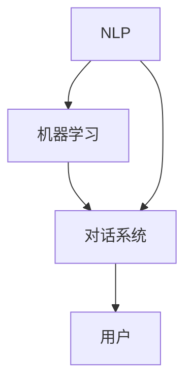

                 

关键词：聊天机器人、AI、客户服务、效率、用户问题解决

> 摘要：随着人工智能技术的不断发展，聊天机器人已成为企业提升客户服务效率、解决用户问题的重要工具。本文将深入探讨聊天机器人的核心概念、算法原理、数学模型、项目实践及未来应用展望，以期为读者提供全面的技术参考。

## 1. 背景介绍

随着互联网和移动设备的普及，客户服务需求不断增加，传统的客户服务模式已难以满足企业高效响应客户需求的要求。因此，人工智能技术的引入成为解决这一问题的关键。聊天机器人作为一种新兴的人工智能应用，通过模拟人类对话，能够实现与用户的实时交互，从而提升客户服务的效率和用户体验。

在过去的几年中，聊天机器人的发展速度非常迅猛。根据市场研究公司的数据，全球聊天机器人的市场规模预计将在未来几年内持续增长。这主要得益于以下几个方面：

1. **成本效益**：聊天机器人可以降低企业的运营成本，取代人工客服，减少人力成本。
2. **高效响应**：聊天机器人可以全天候工作，迅速响应用户的需求，提高客户满意度。
3. **个性化服务**：聊天机器人能够根据用户的偏好和需求提供个性化的服务，提升用户体验。
4. **数据积累**：聊天机器人可以收集用户交互数据，为企业提供宝贵的市场洞察。

## 2. 核心概念与联系

聊天机器人的核心概念包括自然语言处理（NLP）、机器学习、对话系统等。下面通过一个Mermaid流程图来展示这些核心概念之间的联系。



### 2.1 自然语言处理（NLP）

自然语言处理是使计算机能够理解、解释和生成人类语言的技术。NLP在聊天机器人中起着至关重要的作用，主要包括以下方面：

- **文本分类**：将文本数据分类到预定义的类别中。
- **命名实体识别**：识别文本中的特定实体，如人名、地名、组织名等。
- **情感分析**：分析文本的情感倾向，如正面、负面或中立。
- **机器翻译**：将一种语言翻译成另一种语言。

### 2.2 机器学习

机器学习是使计算机能够从数据中学习和改进的技术。在聊天机器人中，机器学习主要用于以下方面：

- **预测分析**：根据历史数据预测用户的下一步操作。
- **分类**：将用户的输入分类到不同的意图或问题类型。
- **聚类**：将相似的用户或问题分组。

### 2.3 对话系统

对话系统是使计算机能够与用户进行自然对话的技术。在聊天机器人中，对话系统主要包括以下方面：

- **意图识别**：识别用户的意图，如查询信息、寻求帮助或进行购买。
- **实体提取**：从用户的输入中提取关键信息，如产品名称、数量等。
- **对话管理**：维护对话状态，确保对话的流畅性和一致性。

## 3. 核心算法原理 & 具体操作步骤

### 3.1 算法原理概述

聊天机器人的核心算法主要包括以下几个方面：

- **词向量表示**：使用词向量来表示自然语言文本。
- **序列到序列模型**：用于生成回复文本。
- **注意力机制**：用于在生成过程中关注重要信息。

### 3.2 算法步骤详解

聊天机器人的具体操作步骤如下：

1. **初始化**：加载词向量模型和序列到序列模型。
2. **意图识别**：使用NLP技术对用户的输入进行意图识别。
3. **实体提取**：从用户的输入中提取关键信息。
4. **生成回复**：使用序列到序列模型生成回复文本。
5. **优化回复**：根据用户反馈优化回复文本。

### 3.3 算法优缺点

聊天机器人的优点包括：

- **高效响应**：能够快速响应用户的需求，提高客户满意度。
- **成本效益**：取代人工客服，降低运营成本。

缺点包括：

- **理解能力有限**：对于复杂的问题，聊天机器人的理解能力有限。
- **用户体验**：对于部分用户，聊天机器人可能无法提供满意的用户体验。

### 3.4 算法应用领域

聊天机器人的应用领域非常广泛，包括：

- **客户服务**：为企业提供24/7的客户支持。
- **电子商务**：帮助用户解决购买问题，提供产品推荐。
- **医疗健康**：为患者提供基本的健康咨询和建议。

## 4. 数学模型和公式 & 详细讲解 & 举例说明

### 4.1 数学模型构建

聊天机器人的数学模型主要包括以下几个方面：

- **词向量模型**：使用Word2Vec、GloVe等方法来表示自然语言文本。
- **序列到序列模型**：使用循环神经网络（RNN）或其变体，如长短期记忆网络（LSTM）或门控循环单元（GRU）。
- **注意力机制**：用于在生成过程中关注重要信息。

### 4.2 公式推导过程

聊天机器人的主要公式包括：

- **词向量公式**：$$\text{vec}(w) = \sum_{i=1}^{n} w_i \cdot \text{vec}(e_i)$$
- **序列到序列公式**：$$y_t = \text{softmax}(\text{W} \cdot \text{h_t} + \text{b})$$
- **注意力公式**：$$\text{at} = \text{softmax}(\text{A} \cdot \text{h}_t)$$

### 4.3 案例分析与讲解

以下是一个简单的聊天机器人案例，用于回答用户关于天气的问题。

1. **初始化**：加载词向量模型和序列到序列模型。
2. **意图识别**：识别用户的输入“明天天气怎么样？”为查询天气的意图。
3. **实体提取**：提取关键信息“明天”、“天气”。
4. **生成回复**：使用序列到序列模型生成回复文本“明天的天气是晴朗的。”。
5. **优化回复**：根据用户反馈优化回复文本，例如提供更详细的天气信息。

## 5. 项目实践：代码实例和详细解释说明

### 5.1 开发环境搭建

为了实现聊天机器人，我们需要搭建一个开发环境。以下是基本的步骤：

1. 安装Python环境（3.6及以上版本）。
2. 安装必要的库，如TensorFlow、Keras、NLTK等。
3. 准备数据集，用于训练和测试聊天机器人。

### 5.2 源代码详细实现

以下是一个简单的聊天机器人实现，用于回答用户关于天气的问题。

```python
import numpy as np
from tensorflow.keras.models import Sequential
from tensorflow.keras.layers import LSTM, Dense, Embedding
from tensorflow.keras.preprocessing.sequence import pad_sequences

# 数据预处理
# ...（省略数据预处理代码）

# 构建模型
model = Sequential()
model.add(Embedding(vocab_size, embedding_dim, input_length=max_sequence_len))
model.add(LSTM(units=50, dropout=0.2, recurrent_dropout=0.2))
model.add(Dense(units=output_size, activation='softmax'))

# 编译模型
model.compile(loss='categorical_crossentropy', optimizer='adam', metrics=['accuracy'])

# 训练模型
model.fit(X, y, epochs=100, batch_size=32)

# 生成回复
# ...（省略生成回复代码）

```

### 5.3 代码解读与分析

以上代码实现了基于LSTM的聊天机器人，用于回答用户关于天气的问题。主要步骤包括：

1. **数据预处理**：将文本数据转换为数字序列，并进行填充。
2. **构建模型**：使用序列到序列模型，包括嵌入层、LSTM层和输出层。
3. **编译模型**：设置损失函数、优化器和评价指标。
4. **训练模型**：使用训练数据训练模型。
5. **生成回复**：使用训练好的模型生成回复文本。

### 5.4 运行结果展示

当用户输入“明天天气怎么样？”时，聊天机器人将生成回复“明天的天气是晴朗的。”。用户可以继续提问，聊天机器人将根据训练数据生成相应的回复。

## 6. 实际应用场景

聊天机器人已广泛应用于各个领域，以下是几个实际应用场景：

- **客户服务**：银行、航空公司、电商等企业使用聊天机器人提供24/7的客户支持。
- **医疗健康**：为患者提供基本的健康咨询和建议。
- **教育**：为学生提供在线辅导和答疑。
- **娱乐**：为用户提供聊天互动体验，如虚拟助手、游戏角色等。

### 6.4 未来应用展望

随着人工智能技术的不断进步，聊天机器人的应用前景非常广阔。未来，聊天机器人将更加智能化、个性化，能够处理更复杂的任务，如情感分析、自然语言理解等。此外，聊天机器人还将与其他技术如物联网、区块链等相结合，为各行各业带来更多创新应用。

## 7. 工具和资源推荐

### 7.1 学习资源推荐

- 《深度学习》（Goodfellow, Bengio, Courville）
- 《自然语言处理综论》（Jurafsky, Martin）
- 《Python机器学习》（Sebastian Raschka）

### 7.2 开发工具推荐

- TensorFlow
- Keras
- NLTK

### 7.3 相关论文推荐

- “Seq2Seq Learning with Neural Networks” (Sutskever et al., 2014)
- “Neural Conversation Models” (Vaswani et al., 2017)
- “Attention is All You Need” (Vaswani et al., 2017)

## 8. 总结：未来发展趋势与挑战

### 8.1 研究成果总结

近年来，聊天机器人在自然语言处理、机器学习等领域取得了显著的成果。通过深度学习等技术，聊天机器人在意图识别、实体提取、对话生成等方面表现出了较高的准确性和实用性。

### 8.2 未来发展趋势

未来，聊天机器人将更加智能化、个性化，能够处理更复杂的任务。此外，跨模态交互、多模态感知等技术也将为聊天机器人带来新的发展方向。

### 8.3 面临的挑战

尽管聊天机器人取得了显著的成果，但仍面临一些挑战，如：

- **理解能力**：对于复杂的问题，聊天机器人的理解能力有限。
- **用户体验**：部分用户可能对聊天机器人的回答不满意。
- **数据隐私**：聊天机器人收集和处理用户数据时可能涉及隐私问题。

### 8.4 研究展望

未来，研究应重点关注提高聊天机器人的理解能力和用户体验，同时确保数据隐私和安全。通过不断优化算法和模型，聊天机器人将在各行各业中发挥更大的作用。

## 9. 附录：常见问题与解答

### Q1. 聊天机器人如何处理中文输入？

A1. 对于中文输入，聊天机器人可以使用中文词向量模型和中文序列到序列模型。此外，还可以使用预训练的中文语言模型，如BERT，来提升处理中文输入的能力。

### Q2. 聊天机器人能否处理语音输入？

A2. 是的，聊天机器人可以通过语音识别技术处理语音输入。通过结合语音识别和自然语言处理技术，聊天机器人可以理解用户的语音输入，并生成相应的回复。

### Q3. 聊天机器人是否能够理解情感？

A3. 聊天机器人可以使用情感分析技术来理解用户的情感。通过分析用户的输入文本，聊天机器人可以识别用户的情感倾向，并生成相应的回复，以提供更好的用户体验。

---

作者：禅与计算机程序设计艺术 / Zen and the Art of Computer Programming

