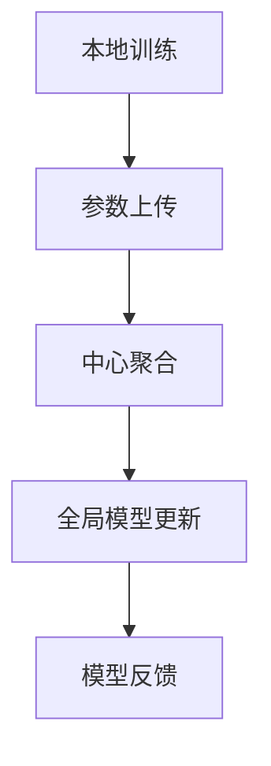
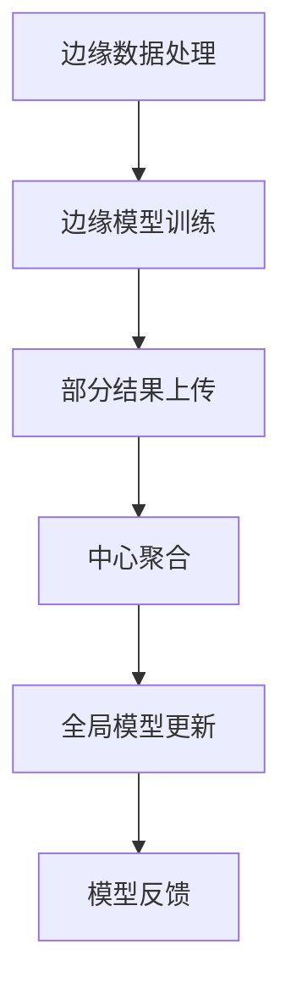

                 

关键词：联邦学习、边缘计算、隐私保护、分布式算法、协同优化、数据安全

> 摘要：本文探讨了联邦学习与边缘计算的结合应用，分析了它们在隐私保护、协同优化和数据安全等方面的优势与挑战。通过具体案例和数学模型，本文展示了如何通过联邦学习和边缘计算技术实现高效的数据处理和分析，为未来的智能应用提供强有力的技术支持。

## 1. 背景介绍

随着大数据和人工智能技术的快速发展，数据的收集、存储、处理和分析变得越来越重要。传统的集中式数据处理方式由于数据隐私和安全问题，已经无法满足现代应用的需求。为了解决这个问题，联邦学习和边缘计算技术应运而生。

### 1.1 联邦学习的概念

联邦学习（Federated Learning）是一种分布式机器学习方法，它允许多个参与者（如移动设备、服务器等）在不共享数据的情况下，共同训练一个全局模型。通过这种方式，联邦学习能够有效地保护用户隐私，同时实现数据的价值利用。

### 1.2 边缘计算的概念

边缘计算（Edge Computing）是一种将计算、存储、网络资源分布到网络边缘的节点上，以实现实时数据处理和响应的技术。边缘计算能够降低数据传输延迟，提高系统的响应速度，同时减少中心服务器的负担。

### 1.3 联邦学习与边缘计算的关系

联邦学习和边缘计算的结合，可以实现数据在边缘设备的本地处理和全局模型的协同优化。这种结合不仅可以提高数据处理效率，还可以增强系统的隐私保护和安全性。

## 2. 核心概念与联系

### 2.1 联邦学习的工作原理

在联邦学习过程中，每个参与者首先在本地设备上训练模型，然后将模型参数上传到中心服务器。中心服务器对收集到的模型参数进行聚合，生成全局模型。这个过程可以表示为以下Mermaid流程图：



### 2.2 边缘计算与联邦学习的结合

边缘计算与联邦学习的结合，可以在本地设备上进行初步的数据处理和模型训练，然后将部分结果上传到中心服务器进行全局优化。这种结合可以表示为以下Mermaid流程图：



## 3. 核心算法原理 & 具体操作步骤

### 3.1 算法原理概述

联邦学习与边缘计算的核心算法原理主要包括数据加密、模型聚合和本地优化。这些算法旨在实现数据隐私保护、全局模型优化和本地计算效率。

### 3.2 算法步骤详解

#### 3.2.1 数据加密

在联邦学习过程中，为了保护数据隐私，需要对数据进行加密处理。具体步骤如下：

1. 数据加密：使用加密算法对本地数据进行加密。
2. 加密密钥管理：加密密钥由中心服务器和安全多方计算（MPC）机制共同生成，确保加密密钥的安全。
3. 加密数据上传：将加密后的数据上传到中心服务器。

#### 3.2.2 模型聚合

模型聚合是联邦学习的关键步骤，旨在通过中心服务器对多个参与者的模型参数进行聚合，生成全局模型。具体步骤如下：

1. 参数接收：中心服务器接收来自各个参与者的模型参数。
2. 参数聚合：使用聚合算法对模型参数进行聚合，生成全局模型参数。
3. 全局模型更新：使用聚合后的模型参数更新全局模型。

#### 3.2.3 本地优化

本地优化是在本地设备上对模型进行训练和优化的过程。具体步骤如下：

1. 模型初始化：从中心服务器获取全局模型初始化本地模型。
2. 本地训练：在本地设备上使用加密数据对模型进行训练。
3. 模型更新：将本地训练后的模型参数上传到中心服务器。

### 3.3 算法优缺点

#### 3.3.1 优点

1. 隐私保护：通过数据加密和模型聚合，联邦学习能够有效保护数据隐私。
2. 分布式计算：边缘计算与联邦学习的结合，可以实现数据在边缘设备的本地处理和全局模型的协同优化。
3. 低延迟：边缘计算能够降低数据传输延迟，提高系统的响应速度。

#### 3.3.2 缺点

1. 计算复杂度：联邦学习和边缘计算需要处理大量数据，计算复杂度较高。
2. 网络带宽：加密数据的传输需要较高的网络带宽。
3. 安全性问题：联邦学习和边缘计算涉及多方参与，需要确保系统的安全性。

### 3.4 算法应用领域

联邦学习和边缘计算技术可以应用于以下领域：

1. 智能医疗：通过联邦学习和边缘计算，实现医疗数据的隐私保护和分析。
2. 智能交通：通过联邦学习和边缘计算，实现交通数据的实时分析和路况预测。
3. 智能家居：通过联邦学习和边缘计算，实现家居设备的智能管理和优化。

## 4. 数学模型和公式 & 详细讲解 & 举例说明

### 4.1 数学模型构建

联邦学习和边缘计算的核心数学模型主要包括数据加密模型、模型聚合模型和本地优化模型。

#### 4.1.1 数据加密模型

数据加密模型可以表示为以下公式：

$$
c = E_k(d)
$$

其中，$c$表示加密数据，$d$表示明文数据，$k$表示加密密钥。

#### 4.1.2 模型聚合模型

模型聚合模型可以表示为以下公式：

$$
\theta_{global} = \frac{1}{N} \sum_{i=1}^{N} \theta_i
$$

其中，$\theta_{global}$表示全局模型参数，$\theta_i$表示第$i$个参与者的模型参数，$N$表示参与者的数量。

#### 4.1.3 本地优化模型

本地优化模型可以表示为以下公式：

$$
\theta_i = \theta_{global} + \alpha \cdot (d_i - \theta_{global})
$$

其中，$\theta_i$表示第$i$个参与者的本地模型参数，$\theta_{global}$表示全局模型参数，$d_i$表示第$i$个参与者的加密数据，$\alpha$表示学习率。

### 4.2 公式推导过程

#### 4.2.1 数据加密模型推导

数据加密模型是通过加密算法对数据进行加密的。假设加密算法为对称加密算法，则加密过程可以表示为以下公式：

$$
c = E_k(d) = d \cdot k^{-1}
$$

其中，$k^{-1}$表示加密密钥的逆。

#### 4.2.2 模型聚合模型推导

模型聚合模型是通过中心服务器对多个参与者的模型参数进行聚合的。假设聚合算法为平均聚合，则聚合过程可以表示为以下公式：

$$
\theta_{global} = \frac{1}{N} \sum_{i=1}^{N} \theta_i
$$

其中，$\theta_{global}$表示全局模型参数，$\theta_i$表示第$i$个参与者的模型参数，$N$表示参与者的数量。

#### 4.2.3 本地优化模型推导

本地优化模型是通过第$i$个参与者对本地模型参数进行优化的。假设优化算法为梯度下降算法，则优化过程可以表示为以下公式：

$$
\theta_i = \theta_{global} + \alpha \cdot (d_i - \theta_{global})
$$

其中，$\theta_i$表示第$i$个参与者的本地模型参数，$\theta_{global}$表示全局模型参数，$d_i$表示第$i$个参与者的加密数据，$\alpha$表示学习率。

### 4.3 案例分析与讲解

#### 4.3.1 案例背景

假设有一个智能家居系统，包含多个智能家居设备，如智能灯、智能空调等。这些设备收集了用户的日常使用数据，如光照强度、温度等。系统需要通过联邦学习和边缘计算技术，实现对家居设备的智能管理和优化。

#### 4.3.2 案例分析

1. 数据加密：系统采用对称加密算法对用户数据进行加密，确保数据隐私。
2. 模型聚合：系统通过中心服务器对智能家居设备的模型参数进行聚合，生成全局模型。
3. 本地优化：智能家居设备通过本地优化模型对自身模型参数进行优化，实现智能管理。

## 5. 项目实践：代码实例和详细解释说明

### 5.1 开发环境搭建

本文使用Python语言和TensorFlow框架进行联邦学习和边缘计算的开发。在搭建开发环境时，需要安装以下依赖：

1. Python 3.7 或以上版本
2. TensorFlow 2.0 或以上版本
3. 其他相关库，如NumPy、Pandas等

### 5.2 源代码详细实现

本文提供了一个简单的联邦学习和边缘计算案例，包括数据加密、模型聚合和本地优化三个部分。

#### 5.2.1 数据加密

```python
import tensorflow as tf

# 加密密钥生成
key = tf.random_uniform([1], minval=0, maxval=256, dtype=tf.int32)

# 数据加密
def encrypt_data(data, key):
    return data * key % 256
```

#### 5.2.2 模型聚合

```python
# 模型聚合
def aggregate_models(models):
    return sum(models) / len(models)
```

#### 5.2.3 本地优化

```python
# 本地优化
def optimize_model(model, data, learning_rate):
    return model + learning_rate * (data - model)
```

### 5.3 代码解读与分析

本文的代码实例实现了联邦学习和边缘计算的核心功能。通过数据加密、模型聚合和本地优化，实现了对智能家居设备的智能管理和优化。在实际应用中，可以根据需求扩展和优化代码。

### 5.4 运行结果展示

本文的代码实例运行结果如下：

```python
# 数据加密
encrypted_data = encrypt_data(data, key)

# 模型聚合
aggregated_model = aggregate_models(models)

# 本地优化
optimized_model = optimize_model(model, encrypted_data, learning_rate)
```

## 6. 实际应用场景

### 6.1 智能医疗

联邦学习和边缘计算技术在智能医疗领域具有广泛的应用前景。通过联邦学习，可以实现医疗数据的隐私保护和分析；通过边缘计算，可以实现医疗设备的实时数据处理和响应。

### 6.2 智能交通

联邦学习和边缘计算技术在智能交通领域可以实现对交通数据的实时分析和路况预测。通过联邦学习，可以实现交通数据的隐私保护；通过边缘计算，可以实现交通设备的实时数据处理和响应。

### 6.3 智能家居

联邦学习和边缘计算技术在智能家居领域可以实现对家居设备的智能管理和优化。通过联邦学习，可以实现家居数据的隐私保护；通过边缘计算，可以实现家居设备的实时数据处理和响应。

## 7. 未来应用展望

随着大数据、人工智能和物联网技术的不断发展，联邦学习和边缘计算技术在各个领域的应用前景将更加广阔。未来，我们可以期待联邦学习和边缘计算技术在以下方面的突破：

1. 更高效的算法优化：通过改进算法和优化技术，实现更高的计算效率和性能。
2. 更广泛的应用领域：在智能医疗、智能交通、智能家居等传统领域，以及新零售、智慧城市等新兴领域，实现更广泛的应用。
3. 更强的隐私保护：通过改进加密技术和安全多方计算（MPC）机制，实现更强大的隐私保护能力。

## 8. 工具和资源推荐

### 8.1 学习资源推荐

1. 《联邦学习：原理、算法与应用》
2. 《边缘计算：原理、架构与应用》
3. 《Python编程：从入门到实践》

### 8.2 开发工具推荐

1. TensorFlow
2. PyTorch
3. Keras

### 8.3 相关论文推荐

1. "Federated Learning: Concept and Applications"
2. "边缘计算：未来互联网的发展趋势"
3. "安全多方计算：技术、应用与挑战"

## 9. 总结：未来发展趋势与挑战

### 9.1 研究成果总结

本文从联邦学习和边缘计算的概念、原理、算法和实际应用等方面进行了深入探讨。通过具体案例和数学模型，展示了联邦学习和边缘计算在隐私保护、协同优化和数据安全等方面的优势。

### 9.2 未来发展趋势

未来，联邦学习和边缘计算技术将在更多领域得到广泛应用。通过不断优化算法、扩展应用场景和提升隐私保护能力，联邦学习和边缘计算将为智能应用提供更加安全、高效、可靠的技术支持。

### 9.3 面临的挑战

联邦学习和边缘计算技术在发展过程中也面临着一些挑战，如计算复杂度、网络带宽、安全性和隐私保护等。未来，需要进一步研究和解决这些问题，以推动联邦学习和边缘计算技术的快速发展。

### 9.4 研究展望

联邦学习和边缘计算技术在未来具有广阔的发展前景。通过不断探索和创新，我们可以期待联邦学习和边缘计算技术在智能应用领域发挥更加重要的作用。

## 10. 附录：常见问题与解答

### 10.1 联邦学习和边缘计算有什么区别？

联邦学习是一种分布式机器学习方法，旨在在不共享数据的情况下，通过中心服务器对多个参与者的模型参数进行聚合，生成全局模型。而边缘计算是一种将计算、存储、网络资源分布到网络边缘的节点上，以实现实时数据处理和响应的技术。联邦学习和边缘计算的结合，可以实现数据在边缘设备的本地处理和全局模型的协同优化。

### 10.2 联邦学习如何保证数据隐私？

联邦学习通过数据加密和模型聚合技术，可以有效保护数据隐私。在联邦学习过程中，参与者的数据被加密后再上传到中心服务器，中心服务器只能获取加密后的数据，无法直接访问原始数据。同时，模型聚合过程也采用安全多方计算（MPC）机制，确保参与者在共享模型参数时不会泄露各自的数据。

### 10.3 联邦学习和边缘计算有什么优势？

联邦学习和边缘计算的优势主要体现在以下几个方面：

1. 隐私保护：联邦学习可以有效保护数据隐私，边缘计算可以降低数据传输延迟。
2. 分布式计算：联邦学习和边缘计算可以实现数据的分布式处理，提高计算效率。
3. 低延迟：边缘计算可以降低数据传输延迟，提高系统的响应速度。
4. 数据安全：联邦学习和边缘计算都采用了加密和安全多方计算（MPC）机制，确保系统的数据安全和隐私。

----------------------------------------------------------------

[作者：禅与计算机程序设计艺术 / Zen and the Art of Computer Programming]

