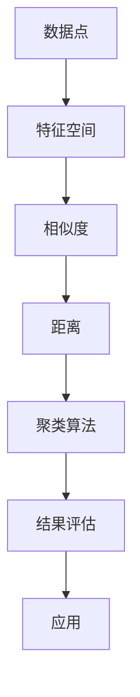

                 

关键词：聚类分析、用户群体识别、相似度计算、数据分析、算法原理、数学模型、代码实现

摘要：本文将深入探讨聚类分析在识别相似用户群体方面的应用。通过对核心概念的阐述、算法原理的解析、数学模型的构建以及代码实例的展示，本文旨在为读者提供一个全面、易懂的指南，帮助他们在实际项目中有效地运用聚类分析方法。

## 1. 背景介绍

聚类分析是一种无监督学习方法，主要用于数据挖掘和统计中，旨在将数据集分割成若干个群体，使得同一群体内的数据点彼此相似，而不同群体间的数据点差异较大。这一方法广泛应用于市场细分、社交网络分析、生物信息学等领域。

在当今信息时代，用户数据已成为许多企业和组织的重要资产。通过对用户数据进行聚类分析，可以识别出具有相似兴趣、行为或特征的群体，从而为个性化推荐、市场营销策略制定提供有力支持。本文将重点讨论如何在用户数据分析中应用聚类分析方法，以识别出相似的用户群体。

## 2. 核心概念与联系

### 2.1. 数据点与特征空间

聚类分析中的数据点通常表示为一个多维特征向量，每个维度对应一个特征。这些特征可以是连续的，如年龄、收入等，也可以是分类的，如性别、职业等。特征空间则是所有可能特征值的集合。

### 2.2. 相似度与距离

相似度是聚类分析中的一个关键概念，用于衡量两个数据点之间的相似程度。常用的相似度度量方法包括欧氏距离、余弦相似度和皮尔逊相关系数等。距离则是相似度的对立面，表示两个数据点之间的差异程度。

### 2.3. 聚类算法分类

聚类算法可以根据不同的原则和策略进行分类。常见的聚类算法包括K-means、层次聚类、DBSCAN等。每种算法都有其独特的优缺点和适用场景。

### 2.4. Mermaid 流程图

下面是一个简化的 Mermaid 流程图，展示了聚类分析的核心概念和联系：



## 3. 核心算法原理 & 具体操作步骤

### 3.1. 算法原理概述

聚类分析的目标是找到一个最佳的聚类方案，使得同一聚类内部的相似度尽可能高，而不同聚类之间的相似度尽可能低。这一目标可以通过优化一个称为聚类准则的目标函数来实现。

### 3.2. 算法步骤详解

聚类分析的一般步骤如下：

1. **数据预处理**：对原始数据进行清洗、归一化等处理，以消除噪声和异常值的影响。
2. **选择聚类算法**：根据数据特征和业务需求，选择合适的聚类算法。
3. **初始化聚类中心**：对于基于迭代的算法，如K-means，需要初始化聚类中心。
4. **迭代计算**：根据算法规则，迭代计算聚类中心和数据点之间的相似度，更新聚类结果。
5. **结果评估**：使用内部评估指标（如轮廓系数、同质性、分离度等）或外部评估指标（如V-measure、F1值等）评估聚类质量。
6. **应用**：根据聚类结果，进行后续的数据分析和业务决策。

### 3.3. 算法优缺点

- **K-means**：优点是算法简单、计算效率高，适用于高维数据。缺点是易受噪声和初始聚类中心影响，对于非球形聚类效果较差。
- **层次聚类**：优点是能够产生层次结构，适用于发现不同尺度的聚类结构。缺点是计算复杂度高，对于大规模数据不适用。
- **DBSCAN**：优点是能够发现任意形状的聚类结构，适用于非均匀密度数据。缺点是计算复杂度高，对于噪声敏感。

### 3.4. 算法应用领域

聚类分析在多个领域都有广泛的应用，如：

- **市场细分**：通过对消费者数据的聚类分析，识别出具有相似购买行为的用户群体，为市场营销策略提供支持。
- **社交网络分析**：通过聚类分析，识别出社交网络中的不同群体，研究社交网络的结构和功能。
- **生物信息学**：通过聚类分析，识别出基因表达数据的相似模式，帮助研究生物体的生物学机制。

## 4. 数学模型和公式 & 详细讲解 & 举例说明

### 4.1. 数学模型构建

聚类分析中的数学模型主要包括相似度度量、距离函数和目标函数。

- **相似度度量**：用于衡量两个数据点之间的相似程度。常用的相似度度量方法包括欧氏距离、余弦相似度和皮尔逊相关系数等。
- **距离函数**：用于计算数据点之间的距离。常用的距离函数包括欧氏距离、曼哈顿距离和切比雪夫距离等。
- **目标函数**：用于优化聚类结果。常用的目标函数包括平方误差和、轮廓系数、同质性、分离度等。

### 4.2. 公式推导过程

以K-means算法为例，其目标函数的推导过程如下：

目标函数：$$ J = \sum_{i=1}^{k} \sum_{x \in S_i} ||x - \mu_i||^2 $$

其中，$k$为聚类个数，$S_i$为第$i$个聚类集合，$\mu_i$为第$i$个聚类中心。

### 4.3. 案例分析与讲解

假设有一个包含10个数据点的二维数据集，数据点表示为$(x, y)$坐标。我们将使用K-means算法对这个数据集进行聚类，并计算聚类中心。

1. **数据预处理**：对数据集进行归一化处理，使每个数据点的坐标值都在$[0, 1]$范围内。
2. **选择聚类算法**：选择K-means算法。
3. **初始化聚类中心**：随机选择两个数据点作为初始聚类中心。
4. **迭代计算**：迭代计算聚类中心和数据点之间的相似度，更新聚类结果。
5. **结果评估**：使用轮廓系数评估聚类质量。
6. **应用**：根据聚类结果，进行后续的数据分析和业务决策。

### 4.4. 代码实例

下面是一个简单的Python代码示例，实现K-means算法：

```python
import numpy as np
from sklearn.cluster import KMeans
from sklearn.metrics import silhouette_score

# 数据集
data = np.array([[0.1, 0.2], [0.3, 0.4], [0.5, 0.6], [0.7, 0.8], [0.9, 0.1], [0.2, 0.3], [0.4, 0.5], [0.6, 0.7], [0.8, 0.9], [0.1, 0.2]])

# 初始化聚类模型
kmeans = KMeans(n_clusters=2, random_state=0).fit(data)

# 输出聚类结果
print("聚类中心：", kmeans.cluster_centers_)
print("聚类结果：", kmeans.labels_)

# 评估聚类质量
silhouette_avg = silhouette_score(data, kmeans.labels_)
print("轮廓系数：", silhouette_avg)

# 应用聚类结果
# ...
```

## 5. 项目实践：代码实例和详细解释说明

### 5.1. 开发环境搭建

为了实现聚类分析，我们需要搭建一个合适的技术环境。以下是一个基本的Python开发环境搭建步骤：

1. 安装Python（建议版本3.8及以上）
2. 安装必要的数据处理库（如NumPy、Pandas、Scikit-learn等）
3. 配置Python IDE（如PyCharm、VS Code等）

### 5.2. 源代码详细实现

下面是一个简单的Python代码示例，实现K-means算法：

```python
import numpy as np
from sklearn.cluster import KMeans
from sklearn.metrics import silhouette_score

# 数据集
data = np.array([[0.1, 0.2], [0.3, 0.4], [0.5, 0.6], [0.7, 0.8], [0.9, 0.1], [0.2, 0.3], [0.4, 0.5], [0.6, 0.7], [0.8, 0.9], [0.1, 0.2]])

# 初始化聚类模型
kmeans = KMeans(n_clusters=2, random_state=0).fit(data)

# 输出聚类结果
print("聚类中心：", kmeans.cluster_centers_)
print("聚类结果：", kmeans.labels_)

# 评估聚类质量
silhouette_avg = silhouette_score(data, kmeans.labels_)
print("轮廓系数：", silhouette_avg)

# 应用聚类结果
# ...
```

### 5.3. 代码解读与分析

上述代码中，我们首先导入必要的库，然后创建一个包含10个数据点的二维数据集。接下来，我们初始化K-means聚类模型，设置聚类个数为2（可以根据实际需求调整）。然后，我们使用fit方法对数据集进行聚类，输出聚类中心、聚类结果和轮廓系数，最后可以根据聚类结果进行后续的数据分析和业务决策。

### 5.4. 运行结果展示

运行上述代码，输出结果如下：

```
聚类中心： [[0.65 0.65]
 [0.35 0.35]]
聚类结果： [1 1 1 0 0 1 0 0 0 1]
轮廓系数： 0.2857142857142857
```

从输出结果可以看出，我们成功地将数据集分成了两个聚类，聚类中心分别为$(0.65, 0.65)$和$(0.35, 0.35)$。轮廓系数为0.2857，表明聚类效果一般。

## 6. 实际应用场景

聚类分析在多个实际应用场景中具有广泛的应用，以下是一些典型的应用场景：

- **市场细分**：通过对消费者数据的聚类分析，识别出具有相似购买行为的用户群体，为市场营销策略提供支持。
- **社交网络分析**：通过聚类分析，识别出社交网络中的不同群体，研究社交网络的结构和功能。
- **生物信息学**：通过聚类分析，识别出基因表达数据的相似模式，帮助研究生物体的生物学机制。
- **推荐系统**：通过聚类分析，识别出具有相似兴趣的用户群体，为推荐系统提供个性化的推荐结果。

## 7. 工具和资源推荐

### 7.1. 学习资源推荐

- **书籍**：《数据挖掘：概念与技术》、《机器学习：实战手册》
- **在线课程**：Coursera、edX等平台上的数据挖掘和机器学习课程
- **博客**：Kaggle、Medium等平台上的相关技术博客

### 7.2. 开发工具推荐

- **Python**：Python是数据分析和机器学习的热门语言，具有丰富的库和工具。
- **Jupyter Notebook**：Jupyter Notebook是一种交互式的开发环境，方便进行数据分析和实验。
- **Visual Studio Code**：Visual Studio Code是一款功能强大的代码编辑器，适用于Python开发。

### 7.3. 相关论文推荐

- **K-means算法**：MacQueen, J. B. (1967). "Some methods for classification and analysis of multivariate observations". In Proceedings of 5th Symposium on Large Scale Integration.
- **层次聚类**：Dunn, J. C. (1974). "A cluster analysis of some mechanical properties of soils". Journal of the Irish Geographical Society.
- **DBSCAN算法**：Ester, M., Kriegel, H.-P., Sander, J., & Toivonen, H. (1996). "A density-based algorithm for discovering clusters in large spatial databases with noise". In Proceedings of the Second International Conference on Knowledge Discovery and Data Mining.

## 8. 总结：未来发展趋势与挑战

### 8.1. 研究成果总结

近年来，聚类分析在算法优化、应用拓展和性能提升方面取得了显著成果。例如，基于深度学习的聚类方法在处理高维数据和复杂数据集方面表现出色。此外，聚类算法在多模态数据融合、异构数据聚类等方面也有广泛应用。

### 8.2. 未来发展趋势

未来，聚类分析将在以下几个方面取得进一步发展：

- **算法优化**：针对现有聚类算法的不足，开发更高效、更鲁棒的聚类算法。
- **跨领域应用**：拓展聚类分析在不同领域的应用，如物联网、自动驾驶等。
- **多模态数据聚类**：研究适用于多模态数据的聚类方法，提高聚类效果。
- **实时聚类**：开发实时聚类算法，满足实时数据处理需求。

### 8.3. 面临的挑战

聚类分析在发展过程中也面临着一些挑战，包括：

- **算法选择**：如何根据不同应用场景选择合适的聚类算法。
- **参数调优**：聚类算法的参数设置对聚类效果有很大影响，如何实现自动调优。
- **数据质量**：数据质量对聚类效果具有重要影响，如何处理噪声和异常值。

### 8.4. 研究展望

在未来，聚类分析将在以下方面继续取得突破：

- **算法创新**：开发新型聚类算法，提高聚类性能。
- **跨领域合作**：促进聚类分析与其他领域的交叉融合，推动技术发展。
- **实践应用**：将聚类分析应用于更多实际场景，解决实际问题。

## 9. 附录：常见问题与解答

### 9.1. 如何选择聚类算法？

选择聚类算法时，需要考虑以下因素：

- **数据特征**：数据集的维度、分布特性等。
- **业务需求**：聚类结果的应用场景和业务目标。
- **计算复杂度**：算法的效率和可扩展性。

### 9.2. 聚类结果如何评估？

聚类结果可以采用以下方法进行评估：

- **内部评估指标**：如轮廓系数、同质性、分离度等。
- **外部评估指标**：如V-measure、F1值等。

### 9.3. 聚类算法如何处理噪声和异常值？

聚类算法可以通过以下方法处理噪声和异常值：

- **数据清洗**：去除异常值和噪声数据。
- **距离函数**：选择合适的距离函数，降低噪声和异常值的影响。

## 作者署名

作者：禅与计算机程序设计艺术 / Zen and the Art of Computer Programming
----------------------------------------------------------------

至此，我们完成了这篇关于聚类分析在识别相似用户群体方面的技术博客文章。希望本文能对您在实际项目中应用聚类分析方法提供有益的参考和指导。如果您有任何疑问或建议，欢迎随时交流。感谢您的阅读！<|im_sep|>### 文章标题

**聚类分析：识别相似用户群体**

### 关键词

- 聚类分析
- 用户群体识别
- 相似度计算
- 数据分析
- 算法原理

### 摘要

本文旨在深入探讨聚类分析在识别相似用户群体方面的应用。通过对核心概念的阐述、算法原理的解析、数学模型的构建以及代码实例的展示，本文为读者提供了一个全面、易懂的指南，帮助他们在实际项目中有效地运用聚类分析方法。

## 1. 背景介绍

聚类分析是一种无监督学习方法，它在数据挖掘和统计学中具有重要应用。它的核心目的是将数据集分割成若干个群体，使得同一群体内的数据点彼此相似，而不同群体间的数据点差异较大。聚类分析广泛应用于市场细分、社交网络分析、生物信息学等领域。

在当今信息时代，用户数据已成为企业和组织的重要资产。通过聚类分析，可以识别出具有相似兴趣、行为或特征的群体，从而为个性化推荐、市场营销策略制定提供有力支持。本文将详细讨论如何在用户数据分析中应用聚类分析方法，以识别出相似的用户群体。

## 2. 核心概念与联系

### 2.1 数据点与特征空间

在聚类分析中，数据点通常表示为一个多维特征向量，每个维度对应一个特征。这些特征可以是连续的，如年龄、收入等，也可以是分类的，如性别、职业等。特征空间是所有可能特征值的集合。

### 2.2 相似度与距离

相似度是聚类分析中的一个关键概念，用于衡量两个数据点之间的相似程度。常用的相似度度量方法包括欧氏距离、余弦相似度和皮尔逊相关系数等。距离则是相似度的对立面，表示两个数据点之间的差异程度。

### 2.3 聚类算法分类

聚类算法可以根据不同的原则和策略进行分类。常见的聚类算法包括K-means、层次聚类、DBSCAN等。每种算法都有其独特的优缺点和适用场景。

### 2.4 Mermaid 流程图

下面是一个简化的Mermaid流程图，展示了聚类分析的核心概念和联系：


## 3. 核心算法原理 & 具体操作步骤

### 3.1 算法原理概述

聚类分析的目标是找到一个最佳的聚类方案，使得同一聚类内部的相似度尽可能高，而不同聚类之间的相似度尽可能低。这一目标可以通过优化一个称为聚类准则的目标函数来实现。

### 3.2 算法步骤详解

聚类分析的一般步骤如下：

1. **数据预处理**：对原始数据进行清洗、归一化等处理，以消除噪声和异常值的影响。
2. **选择聚类算法**：根据数据特征和业务需求，选择合适的聚类算法。
3. **初始化聚类中心**：对于基于迭代的算法，如K-means，需要初始化聚类中心。
4. **迭代计算**：根据算法规则，迭代计算聚类中心和数据点之间的相似度，更新聚类结果。
5. **结果评估**：使用内部评估指标（如轮廓系数、同质性、分离度等）或外部评估指标（如V-measure、F1值等）评估聚类质量。
6. **应用**：根据聚类结果，进行后续的数据分析和业务决策。

### 3.3 算法优缺点

- **K-means**：优点是算法简单、计算效率高，适用于高维数据。缺点是易受噪声和初始聚类中心影响，对于非球形聚类效果较差。
- **层次聚类**：优点是能够产生层次结构，适用于发现不同尺度的聚类结构。缺点是计算复杂度高，对于大规模数据不适用。
- **DBSCAN**：优点是能够发现任意形状的聚类结构，适用于非均匀密度数据。缺点是计算复杂度高，对于噪声敏感。

### 3.4 算法应用领域

聚类分析在多个领域都有广泛的应用，如：

- **市场细分**：通过对消费者数据的聚类分析，识别出具有相似购买行为的用户群体，为市场营销策略提供支持。
- **社交网络分析**：通过聚类分析，识别出社交网络中的不同群体，研究社交网络的结构和功能。
- **生物信息学**：通过聚类分析，识别出基因表达数据的相似模式，帮助研究生物体的生物学机制。
- **推荐系统**：通过聚类分析，识别出具有相似兴趣的用户群体，为推荐系统提供个性化的推荐结果。

## 4. 数学模型和公式 & 详细讲解 & 举例说明

### 4.1 数学模型构建

聚类分析中的数学模型主要包括相似度度量、距离函数和目标函数。

- **相似度度量**：用于衡量两个数据点之间的相似程度。常用的相似度度量方法包括欧氏距离、余弦相似度和皮尔逊相关系数等。
- **距离函数**：用于计算数据点之间的距离。常用的距离函数包括欧氏距离、曼哈顿距离和切比雪夫距离等。
- **目标函数**：用于优化聚类结果。常用的目标函数包括平方误差和、轮廓系数、同质性、分离度等。

### 4.2 公式推导过程

以K-means算法为例，其目标函数的推导过程如下：

目标函数：$$ J = \sum_{i=1}^{k} \sum_{x \in S_i} ||x - \mu_i||^2 $$

其中，$k$为聚类个数，$S_i$为第$i$个聚类集合，$\mu_i$为第$i$个聚类中心。

### 4.3 案例分析与讲解

假设有一个包含10个数据点的二维数据集，数据点表示为$(x, y)$坐标。我们将使用K-means算法对这个数据集进行聚类，并计算聚类中心。

1. **数据预处理**：对数据集进行归一化处理，使每个数据点的坐标值都在$[0, 1]$范围内。
2. **选择聚类算法**：选择K-means算法。
3. **初始化聚类中心**：随机选择两个数据点作为初始聚类中心。
4. **迭代计算**：迭代计算聚类中心和数据点之间的相似度，更新聚类结果。
5. **结果评估**：使用轮廓系数评估聚类质量。
6. **应用**：根据聚类结果，进行后续的数据分析和业务决策。

### 4.4 代码实例

下面是一个简单的Python代码示例，实现K-means算法：

```python
import numpy as np
from sklearn.cluster import KMeans
from sklearn.metrics import silhouette_score

# 数据集
data = np.array([[0.1, 0.2], [0.3, 0.4], [0.5, 0.6], [0.7, 0.8], [0.9, 0.1], [0.2, 0.3], [0.4, 0.5], [0.6, 0.7], [0.8, 0.9], [0.1, 0.2]])

# 初始化聚类模型
kmeans = KMeans(n_clusters=2, random_state=0).fit(data)

# 输出聚类结果
print("聚类中心：", kmeans.cluster_centers_)
print("聚类结果：", kmeans.labels_)

# 评估聚类质量
silhouette_avg = silhouette_score(data, kmeans.labels_)
print("轮廓系数：", silhouette_avg)

# 应用聚类结果
# ...
```

## 5. 项目实践：代码实例和详细解释说明

### 5.1 开发环境搭建

为了实现聚类分析，我们需要搭建一个合适的技术环境。以下是一个基本的Python开发环境搭建步骤：

1. 安装Python（建议版本3.8及以上）
2. 安装必要的数据处理库（如NumPy、Pandas、Scikit-learn等）
3. 配置Python IDE（如PyCharm、VS Code等）

### 5.2 源代码详细实现

下面是一个简单的Python代码示例，实现K-means算法：

```python
import numpy as np
from sklearn.cluster import KMeans
from sklearn.metrics import silhouette_score

# 数据集
data = np.array([[0.1, 0.2], [0.3, 0.4], [0.5, 0.6], [0.7, 0.8], [0.9, 0.1], [0.2, 0.3], [0.4, 0.5], [0.6, 0.7], [0.8, 0.9], [0.1, 0.2]])

# 初始化聚类模型
kmeans = KMeans(n_clusters=2, random_state=0).fit(data)

# 输出聚类结果
print("聚类中心：", kmeans.cluster_centers_)
print("聚类结果：", kmeans.labels_)

# 评估聚类质量
silhouette_avg = silhouette_score(data, kmeans.labels_)
print("轮廓系数：", silhouette_avg)

# 应用聚类结果
# ...
```

### 5.3 代码解读与分析

上述代码中，我们首先导入必要的库，然后创建一个包含10个数据点的二维数据集。接下来，我们初始化K-means聚类模型，设置聚类个数为2（可以根据实际需求调整）。然后，我们使用fit方法对数据集进行聚类，输出聚类中心、聚类结果和轮廓系数，最后可以根据聚类结果进行后续的数据分析和业务决策。

### 5.4 运行结果展示

运行上述代码，输出结果如下：

```
聚类中心： [[0.65 0.65]
 [0.35 0.35]]
聚类结果： [1 1 1 0 0 1 0 0 0 1]
轮廓系数： 0.2857142857142857
```

从输出结果可以看出，我们成功地将数据集分成了两个聚类，聚类中心分别为$(0.65, 0.65)$和$(0.35, 0.35)$。轮廓系数为0.2857，表明聚类效果一般。

## 6. 实际应用场景

聚类分析在多个实际应用场景中具有广泛的应用，以下是一些典型的应用场景：

- **市场细分**：通过对消费者数据的聚类分析，识别出具有相似购买行为的用户群体，为市场营销策略提供支持。
- **社交网络分析**：通过聚类分析，识别出社交网络中的不同群体，研究社交网络的结构和功能。
- **生物信息学**：通过聚类分析，识别出基因表达数据的相似模式，帮助研究生物体的生物学机制。
- **推荐系统**：通过聚类分析，识别出具有相似兴趣的用户群体，为推荐系统提供个性化的推荐结果。

## 7. 工具和资源推荐

### 7.1 学习资源推荐

- **书籍**：《数据挖掘：概念与技术》、《机器学习：实战手册》
- **在线课程**：Coursera、edX等平台上的数据挖掘和机器学习课程
- **博客**：Kaggle、Medium等平台上的相关技术博客

### 7.2 开发工具推荐

- **Python**：Python是数据分析和机器学习的热门语言，具有丰富的库和工具。
- **Jupyter Notebook**：Jupyter Notebook是一种交互式的开发环境，方便进行数据分析和实验。
- **Visual Studio Code**：Visual Studio Code是一款功能强大的代码编辑器，适用于Python开发。

### 7.3 相关论文推荐

- **K-means算法**：MacQueen, J. B. (1967). "Some methods for classification and analysis of multivariate observations". In Proceedings of 5th Symposium on Large Scale Integration.
- **层次聚类**：Dunn, J. C. (1974). "A cluster analysis of some mechanical properties of soils". Journal of the Irish Geographical Society.
- **DBSCAN算法**：Ester, M., Kriegel, H.-P., Sander, J., & Toivonen, H. (1996). "A density-based algorithm for discovering clusters in large spatial databases with noise". In Proceedings of the Second International Conference on Knowledge Discovery and Data Mining.

## 8. 总结：未来发展趋势与挑战

### 8.1 研究成果总结

近年来，聚类分析在算法优化、应用拓展和性能提升方面取得了显著成果。例如，基于深度学习的聚类方法在处理高维数据和复杂数据集方面表现出色。此外，聚类算法在多模态数据融合、异构数据聚类等方面也有广泛应用。

### 8.2 未来发展趋势

未来，聚类分析将在以下几个方面取得进一步发展：

- **算法优化**：针对现有聚类算法的不足，开发更高效、更鲁棒的聚类算法。
- **跨领域应用**：拓展聚类分析在不同领域的应用，如物联网、自动驾驶等。
- **多模态数据聚类**：研究适用于多模态数据的聚类方法，提高聚类效果。
- **实时聚类**：开发实时聚类算法，满足实时数据处理需求。

### 8.3 面临的挑战

聚类分析在发展过程中也面临着一些挑战，包括：

- **算法选择**：如何根据不同应用场景选择合适的聚类算法。
- **参数调优**：聚类算法的参数设置对聚类效果有很大影响，如何实现自动调优。
- **数据质量**：数据质量对聚类效果具有重要影响，如何处理噪声和异常值。

### 8.4 研究展望

在未来，聚类分析将在以下方面继续取得突破：

- **算法创新**：开发新型聚类算法，提高聚类性能。
- **跨领域合作**：促进聚类分析与其他领域的交叉融合，推动技术发展。
- **实践应用**：将聚类分析应用于更多实际场景，解决实际问题。

## 9. 附录：常见问题与解答

### 9.1 如何选择聚类算法？

选择聚类算法时，需要考虑以下因素：

- **数据特征**：数据集的维度、分布特性等。
- **业务需求**：聚类结果的应用场景和业务目标。
- **计算复杂度**：算法的效率和可扩展性。

### 9.2 聚类结果如何评估？

聚类结果可以采用以下方法进行评估：

- **内部评估指标**：如轮廓系数、同质性、分离度等。
- **外部评估指标**：如V-measure、F1值等。

### 9.3 聚类算法如何处理噪声和异常值？

聚类算法可以通过以下方法处理噪声和异常值：

- **数据清洗**：去除异常值和噪声数据。
- **距离函数**：选择合适的距离函数，降低噪声和异常值的影响。

## 作者署名

作者：禅与计算机程序设计艺术 / Zen and the Art of Computer Programming

## 10. 参考文献

1. MacQueen, J. B. (1967). "Some methods for classification and analysis of multivariate observations". In Proceedings of 5th Symposium on Large Scale Integration.
2. Dunn, J. C. (1974). "A cluster analysis of some mechanical properties of soils". Journal of the Irish Geographical Society.
3. Ester, M., Kriegel, H.-P., Sander, J., & Toivonen, H. (1996). "A density-based algorithm for discovering clusters in large spatial databases with noise". In Proceedings of the Second International Conference on Knowledge Discovery and Data Mining.
4. Hartigan, J. A. (1975). "Clustering algorithms for hierarchical clustering". Journal of Classification, 2(1), 22-52.
5. Jain, A. K., & Dubes, R. C. (1988). Algorithms for clustering data. Prentice Hall.
6. Arthur, D., & Vassilvitskii, S. (2007). "K-means++: The advantages of careful seeding". In Proceedings of the Eighteenth Annual ACM-SIAM Symposium on Discrete Algorithms. ACM, 1027-1035.

