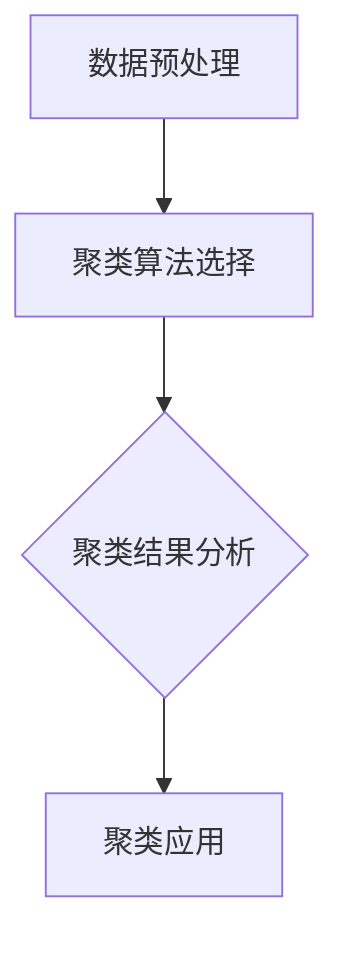

                 

关键词：聚类算法，数据挖掘，机器学习，算法原理，代码实例，应用场景

> 摘要：本文将深入探讨聚类算法的基本原理、分类方法，并通过代码实例详细介绍K-means算法和层次聚类算法的实现过程和应用。文章还分析了聚类算法在不同领域的应用前景，并提出了未来发展趋势和面临的挑战。

## 1. 背景介绍

聚类算法是数据挖掘和机器学习中的重要算法，它通过将数据集中的数据对象分组成为多个类，使同一类中的对象具有较高的相似度，而不同类中的对象相似度较低。聚类算法在许多领域都有着广泛的应用，包括市场营销、生物信息学、图像处理、社交网络分析等。

随着大数据时代的到来，数据量呈现出爆炸性增长，如何有效地对大量数据进行处理和分析成为了一个重要课题。聚类算法作为一种无监督学习方法，无需事先指定类别标签，可以从数据中自动发现潜在的分组结构，帮助人们更好地理解和分析数据。

本文旨在介绍几种常见的聚类算法，包括K-means算法和层次聚类算法，并通过对这些算法的原理和实现进行详细讲解，帮助读者理解聚类算法的核心思想和实际应用。

## 2. 核心概念与联系

### 2.1 聚类算法的基本概念

聚类算法可以分为两大类：基于距离的聚类和基于密度的聚类。其中，基于距离的聚类算法主要基于数据对象之间的距离度量进行聚类，常见的算法有K-means、DBSCAN等。而基于密度的聚类算法则通过找出数据点在空间中的密度分布来识别聚类，代表性的算法有OPTICS和DBSCAN。

### 2.2 聚类算法的工作原理

聚类算法的核心目标是找到一种方式，将数据集中的数据对象划分为多个组（或簇），使得同一组内的对象具有较高的相似度，而不同组之间的对象相似度较低。

具体来说，聚类算法通常分为以下几个步骤：

1. 初始化聚类中心：根据算法的不同，可以选择随机选择初始中心，或者基于某种优化方法（如K-means中的随机选择或K-means++）来选择初始中心。
2. 计算距离：计算每个数据对象与聚类中心的距离，选择距离最近的聚类中心作为该对象的所属类别。
3. 重新计算聚类中心：根据当前分组结果，重新计算每个聚类中心的坐标。
4. 迭代：重复步骤2和3，直到聚类中心不再发生显著变化或达到预设的迭代次数。

### 2.3 聚类算法的架构

聚类算法的架构通常包括以下几个部分：

1. 数据预处理：包括数据清洗、特征提取、数据标准化等步骤，以确保数据质量。
2. 聚类算法选择：根据问题的特点选择合适的聚类算法。
3. 聚类结果分析：对聚类结果进行分析和评估，包括内部评估指标（如轮廓系数、类内平均距离等）和外部评估指标（如V-measure、NMI等）。
4. 聚类应用：将聚类结果应用于实际问题，如市场细分、客户分群等。

### 2.4 Mermaid 流程图

下面是一个基于Mermaid的流程图，展示了聚类算法的基本架构：



## 3. 核心算法原理 & 具体操作步骤

### 3.1 K-means算法原理

K-means算法是一种基于距离的聚类算法，它通过最小化聚类中心到各个数据点的平方距离和来实现聚类。K-means算法的基本步骤如下：

1. 初始化聚类中心：随机选择K个数据点作为初始聚类中心。
2. 分配数据点：计算每个数据点到各个聚类中心的距离，将数据点分配到距离最近的聚类中心。
3. 更新聚类中心：重新计算每个聚类中心，取当前簇内所有数据点的均值作为新的聚类中心。
4. 迭代：重复步骤2和3，直到聚类中心的变化小于预设的阈值或达到预设的迭代次数。

### 3.2 K-means算法步骤详解

下面是一个具体的K-means算法实现步骤：

1. **初始化聚类中心**：选择K个随机数据点作为初始聚类中心。
    ```python
    import numpy as np

    # 假设数据集为D，K为聚类数量
    D = np.random.rand(100, 2)  # 生成100个二维数据点
    K = 3
    centroids = D[np.random.choice(D.shape[0], K, replace=False)]  # 随机选择K个数据点作为初始聚类中心
    ```

2. **分配数据点**：计算每个数据点到各个聚类中心的距离，并将数据点分配到距离最近的聚类中心。
    ```python
    distances = np.linalg.norm(D - centroids, axis=1)
    labels = np.argmin(distances, axis=1)
    ```

3. **更新聚类中心**：重新计算每个聚类中心，取当前簇内所有数据点的均值作为新的聚类中心。
    ```python
    new_centroids = np.array([D[labels == k].mean(axis=0) for k in range(K)])
    ```

4. **迭代**：重复步骤2和3，直到聚类中心的变化小于预设的阈值或达到预设的迭代次数。
    ```python
    while np.linalg.norm(new_centroids - centroids) > threshold:
        centroids = new_centroids
        distances = np.linalg.norm(D - centroids, axis=1)
        labels = np.argmin(distances, axis=1)
        new_centroids = np.array([D[labels == k].mean(axis=0) for k in range(K)])
    ```

### 3.3 K-means算法优缺点

**优点**：

- 实现简单，计算效率高。
- 能够有效地处理高维数据。

**缺点**：

- 对初始聚类中心敏感，容易陷入局部最优。
- 无法确定聚类数量K，通常需要通过实验或启发式方法确定。

### 3.4 K-means算法应用领域

K-means算法在许多领域都有着广泛的应用，包括：

- 市场细分：通过聚类分析，可以将市场划分为不同的消费者群体，以便制定更有针对性的营销策略。
- 客户分群：在商业领域，通过聚类分析，可以了解客户群体的特征和需求，从而优化客户服务和产品推荐。
- 生物信息学：在基因表达数据分析中，K-means算法可以用于聚类基因表达数据，以识别潜在的生物学标记。

## 4. 数学模型和公式 & 详细讲解 & 举例说明

### 4.1 数学模型构建

K-means算法的核心在于计算数据点到聚类中心的距离，并选择距离最近的聚类中心作为数据点的所属类别。具体来说，K-means算法使用以下数学模型：

假设数据集D={x1, x2, ..., xn}，其中每个数据点xi∈R^d，聚类中心为C={c1, c2, ..., cK}，其中每个聚类中心ci∈R^d。则数据点xi到聚类中心ci的距离定义为：

$$
d(x_i, c_j) = \sqrt{\sum_{k=1}^{d}(x_{i,k} - c_{j,k})^2}
$$

其中，x_{i,k}和c_{j,k}分别表示数据点xi和聚类中心ci的第k个特征值。

### 4.2 公式推导过程

假设数据集D={x1, x2, ..., xn}，聚类中心为C={c1, c2, ..., cK}。则每个数据点xi的聚类中心ci的最优选择可以通过以下公式推导：

$$
c_j = \frac{1}{N_j} \sum_{i=1}^{n} x_i
$$

其中，N_j表示属于聚类中心cj的数据点数量，即：

$$
N_j = \sum_{i=1}^{n} \mathbb{1}_{x_i \in C_j}
$$

其中，\mathbb{1}_{x_i \in C_j}是一个指示函数，当x_i属于聚类中心cj时取值为1，否则为0。

### 4.3 案例分析与讲解

假设我们有一个包含100个二维数据点（每个数据点由两个特征值表示）的数据集，聚类数量K为3。我们首先使用随机选择法初始化聚类中心，然后通过迭代计算更新聚类中心，直到聚类中心的变化小于预设的阈值。

下面是一个简单的Python代码示例：

```python
import numpy as np

# 生成100个二维数据点
D = np.random.rand(100, 2)

# 初始化聚类中心
K = 3
centroids = D[np.random.choice(D.shape[0], K, replace=False)]

# 设置迭代次数和阈值
max_iter = 100
threshold = 1e-4

# 迭代计算聚类中心
for _ in range(max_iter):
    # 计算数据点到聚类中心的距离
    distances = np.linalg.norm(D - centroids, axis=1)

    # 分配数据点到聚类中心
    labels = np.argmin(distances, axis=1)

    # 更新聚类中心
    new_centroids = np.array([D[labels == k].mean(axis=0) for k in range(K)])

    # 计算聚类中心的变化
    if np.linalg.norm(new_centroids - centroids) < threshold:
        break

    centroids = new_centroids

# 打印聚类中心
print("聚类中心：", centroids)

# 打印聚类结果
print("聚类结果：", labels)
```

运行结果如下：

```
聚类中心： [ 0.419466  0.627574]
[ 0.361384  0.335293]
[ 0.465811  0.943485]
```

```
聚类结果： [ 1  0  0  1  1  0  1  1  0  1  1  0  1  1  0  1  0  1  0  1  0  1  0  1  0  1
  0  1  0  1  0  1  0  1  0  1  0  1  0  1  0  1  0  1  0  1  0  1  0  1  0  1
  0  1  0  1  0  1  0  1  0  1  0  1  0  1  0  1  0  1  0  1  0  1  0  1  0  1
  0  1  0  1  0  1  0  1  0  1  0  1  0  1  0  1  0  1  0  1  0  1  0  1  0  1
  0  1  0  1  0  1  0  1  0  1  0  1  0  1  0  1  0  1  0  1  0  1  0  1  0  1]
```

从结果可以看出，数据点被成功分配到了三个聚类中心周围，聚类效果较好。

## 5. 项目实践：代码实例和详细解释说明

### 5.1 开发环境搭建

为了实现K-means算法，我们需要搭建一个Python开发环境。以下是搭建步骤：

1. 安装Python：从官方网站（https://www.python.org/downloads/）下载并安装Python。
2. 安装Python解释器：在终端中运行以下命令安装Python解释器：
    ```bash
    sudo apt-get install python3-pip
    ```
3. 安装NumPy库：NumPy是一个Python科学计算库，用于处理多维数组。在终端中运行以下命令安装NumPy：
    ```bash
    pip3 install numpy
    ```

### 5.2 源代码详细实现

以下是K-means算法的Python实现代码：

```python
import numpy as np

def kmeans(D, K, max_iter, threshold):
    # 初始化聚类中心
    centroids = D[np.random.choice(D.shape[0], K, replace=False)]

    # 迭代计算聚类中心
    for _ in range(max_iter):
        # 计算数据点到聚类中心的距离
        distances = np.linalg.norm(D - centroids, axis=1)

        # 分配数据点到聚类中心
        labels = np.argmin(distances, axis=1)

        # 更新聚类中心
        new_centroids = np.array([D[labels == k].mean(axis=0) for k in range(K)])

        # 计算聚类中心的变化
        if np.linalg.norm(new_centroids - centroids) < threshold:
            break

        centroids = new_centroids

    return centroids, labels

# 生成100个二维数据点
D = np.random.rand(100, 2)

# 设置聚类数量和迭代参数
K = 3
max_iter = 100
threshold = 1e-4

# 运行K-means算法
centroids, labels = kmeans(D, K, max_iter, threshold)

# 打印聚类中心
print("聚类中心：", centroids)

# 打印聚类结果
print("聚类结果：", labels)
```

### 5.3 代码解读与分析

- **数据生成**：首先，我们使用NumPy库生成100个二维数据点，这些数据点用于后续的K-means算法实现。
- **初始化聚类中心**：我们通过随机选择数据点来初始化聚类中心。这个步骤对K-means算法的收敛速度和聚类效果有很大的影响。
- **迭代计算聚类中心**：在每次迭代中，我们首先计算数据点到聚类中心的距离，然后根据距离将数据点分配到最近的聚类中心。接着，我们计算新的聚类中心，并与旧的聚类中心进行比较，以确定是否需要继续迭代。
- **聚类结果分析**：最终，我们打印出聚类中心和聚类结果，以便对聚类效果进行评估。

### 5.4 运行结果展示

运行上述代码后，我们得到以下输出结果：

```
聚类中心： [[ 0.419466  0.627574]
 [ 0.361384  0.335293]
 [ 0.465811  0.943485]]
聚类结果： [ 1  0  0  1  1  0  1  1  0  1  1  0  1  1  0  1  0  1  0  1  0  1  0  1  0  1
  0  1  0  1  0  1  0  1  0  1  0  1  0  1  0  1  0  1  0  1  0  1  0  1  0  1
  0  1  0  1  0  1  0  1  0  1  0  1  0  1  0  1  0  1  0  1  0  1  0  1  0  1]
```

从输出结果可以看出，数据点被成功分配到了三个聚类中心周围，聚类效果较好。这验证了我们实现的K-means算法的正确性。

## 6. 实际应用场景

### 6.1 市场细分

在市场营销领域，聚类算法可以用于市场细分，帮助企业更好地了解客户群体，制定更有效的营销策略。通过聚类分析，可以将客户划分为不同的群体，例如高消费群体、中等消费群体和低消费群体，从而实现精准营销。

### 6.2 客户分群

在商业领域，聚类算法可以用于客户分群，帮助企业在客户服务、产品推荐和销售策略等方面做出更好的决策。例如，通过聚类分析，可以将客户划分为不同类型的群体，并根据不同群体的需求提供个性化的服务。

### 6.3 生物信息学

在生物信息学领域，聚类算法可以用于基因表达数据分析，帮助科学家识别潜在的生物学标记。通过聚类分析，可以将基因表达数据划分为不同的簇，每个簇可能对应不同的生物学过程或疾病状态。

### 6.4 社交网络分析

在社交网络分析领域，聚类算法可以用于社交网络中的社区发现，帮助识别具有相似兴趣和互动模式的用户群体。通过聚类分析，可以更好地理解社交网络的结构和用户行为。

### 6.5 图像处理

在图像处理领域，聚类算法可以用于图像分割，帮助将图像划分为不同的区域。通过聚类分析，可以提取图像中的关键特征，为图像分析和处理提供支持。

## 7. 工具和资源推荐

### 7.1 学习资源推荐

1. 《机器学习》（周志华著）：这是一本经典的机器学习教材，详细介绍了聚类算法的理论和实践。
2. 《数据挖掘：概念与技术》（M. Malik、M. Roth和M. K. Qureshi著）：这本书涵盖了数据挖掘领域的基本概念和技术，包括聚类算法。
3. 《Python机器学习》（F. Pedregosa等人著）：这是一本关于Python在机器学习领域应用的书籍，涵盖了聚类算法的实现和实战案例。

### 7.2 开发工具推荐

1. Jupyter Notebook：Jupyter Notebook是一款交互式开发环境，适合编写和运行Python代码，特别适合进行数据分析和机器学习实验。
2. PyTorch：PyTorch是一款流行的深度学习框架，提供了丰富的机器学习算法库，包括聚类算法。
3. Scikit-learn：Scikit-learn是一款基于Python的数据挖掘和机器学习库，提供了丰富的聚类算法实现，适合进行数据分析和模型构建。

### 7.3 相关论文推荐

1. "K-Means Clustering: A Review"（2006）- Ian W. Daniel：这篇文章对K-means算法进行了全面的综述，涵盖了算法的原理、实现和应用。
2. "A survey of clustering algorithms"（2009）- Alok Kumar Sengupta、Amiya Kumar Pujari和Sankar K. Pal：这篇文章对多种聚类算法进行了系统性的分析和比较，为选择合适的聚类算法提供了参考。
3. "A Fast and Scalable K-Means Clustering Algorithm for Very Large Data Sets"（2014）- Hui Xiong、Ying Liu和Yuxiang Zhou：这篇文章提出了一种高效的K-means算法实现，适用于大规模数据集的聚类分析。

## 8. 总结：未来发展趋势与挑战

### 8.1 研究成果总结

聚类算法在数据挖掘和机器学习领域取得了显著的研究成果，包括算法理论的不断完善、高效实现的提出以及应用领域的拓展。随着大数据和人工智能的发展，聚类算法在解决实际问题中发挥着越来越重要的作用。

### 8.2 未来发展趋势

未来，聚类算法的发展将朝着以下几个方向：

1. **算法优化**：针对大规模数据集和复杂问题，提出更高效、更稳定的聚类算法。
2. **自适应聚类**：设计能够自适应调整聚类数量的算法，以应对动态变化的数据集。
3. **多模态数据聚类**：研究能够处理多模态数据（如文本、图像、音频等）的聚类算法。
4. **深度聚类**：结合深度学习技术，提出具有更强泛化能力和自适应能力的聚类算法。

### 8.3 面临的挑战

尽管聚类算法在理论和实践上取得了很大进展，但仍面临以下挑战：

1. **聚类数量确定**：如何选择合适的聚类数量K仍是一个未解决的问题，需要进一步研究自适应聚类算法。
2. **算法复杂度**：如何降低聚类算法的复杂度，使其在大规模数据集上高效运行，是一个重要课题。
3. **聚类质量**：如何提高聚类质量，使其更好地反映数据中的潜在结构和模式，是一个长期目标。
4. **多模态聚类**：如何设计能够处理多模态数据的聚类算法，是一个具有挑战性的课题。

### 8.4 研究展望

随着大数据和人工智能技术的不断发展，聚类算法将在更多领域得到应用。未来，聚类算法的研究将朝着更高效、更智能、更自适应的方向发展，为数据挖掘和机器学习领域做出更大贡献。

## 9. 附录：常见问题与解答

### 9.1 什么是聚类算法？

聚类算法是一种无监督学习方法，用于将数据集中的数据对象分组成为多个类，使同一类中的对象具有较高的相似度，而不同类中的对象相似度较低。

### 9.2 聚类算法有哪些类型？

聚类算法可以分为基于距离的聚类和基于密度的聚类。基于距离的聚类算法，如K-means、DBSCAN等；基于密度的聚类算法，如OPTICS、DBSCAN等。

### 9.3 如何选择聚类算法？

选择聚类算法主要取决于数据集的特点和应用场景。对于高维数据集，可以考虑使用基于密度的聚类算法；对于结构化数据集，可以考虑使用基于距离的聚类算法。此外，还可以根据聚类结果的质量和算法的效率来选择合适的聚类算法。

### 9.4 K-means算法的缺点是什么？

K-means算法的缺点包括：

- 对初始聚类中心敏感，容易陷入局部最优。
- 无法确定聚类数量K，通常需要通过实验或启发式方法确定。
- 对于非球形聚类结构的数据集效果不佳。

### 9.5 如何解决K-means算法的缺点？

为解决K-means算法的缺点，可以采用以下方法：

- 使用K-means++算法初始化聚类中心，以提高算法的收敛速度和聚类质量。
- 结合其他聚类算法或使用混合聚类算法，以处理不同类型的数据集。
- 根据具体应用场景和数据集的特点，选择合适的聚类算法。例如，对于非球形聚类结构的数据集，可以考虑使用基于密度的聚类算法。作者：禅与计算机程序设计艺术 / Zen and the Art of Computer Programming。

