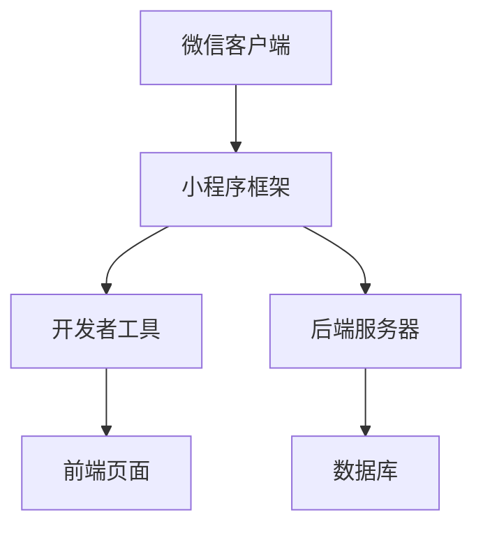
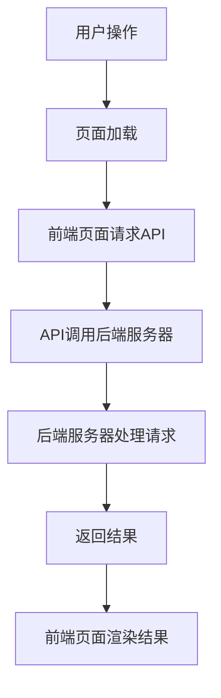

                 

关键词：腾讯校招、微信小程序、开发工程师、面试问题、答案解析

> 摘要：本文旨在为参加腾讯2024校招的微信小程序开发工程师面试的考生提供全面的常见问题与答案解析，帮助考生在面试中展示自己的技术实力，顺利通过面试。

## 1. 背景介绍

腾讯，作为中国领先的互联网科技公司，其微信小程序开发工程师岗位一直受到广大求职者的青睐。微信小程序自推出以来，凭借其低门槛、高互动性的特点，成为了企业数字化转型的重要工具。作为微信小程序开发工程师，需要具备扎实的前端技术、小程序开发框架理解以及项目实践经验。

本文将针对腾讯2024校招微信小程序开发工程师面试中可能出现的问题进行详细解析，帮助考生更好地应对面试挑战。

## 2. 核心概念与联系

### 2.1 微信小程序开发基础

#### 微信小程序架构



#### 微信小程序开发框架

微信小程序开发框架主要包括：

- WXML（WeiXin Markup Language）：类似于HTML，用于定义小程序的页面结构。
- WXSS（WeiXin Style Sheets）：类似于CSS，用于定义小程序的样式。
- JavaScript：用于小程序的逻辑处理和交互。

### 2.2 微信小程序API

微信小程序提供了一系列API，包括：

- 界面API：如页面跳转、导航栏设置、动画等。
- 媒体API：如音频、视频、图片等。
- 网络API：如请求、上传、下载等。
- 地理API：如位置获取、地图显示等。
- 数据存储API：如本地存储、数据库等。

#### Mermaid 流程图（微信小程序API调用流程）



## 3. 核心算法原理 & 具体操作步骤

### 3.1 算法原理概述

微信小程序开发中的核心算法主要包括：

- 算法排序：如冒泡排序、快速排序等。
- 算法搜索：如二分搜索、广度优先搜索等。
- 算法加密：如MD5、AES等。

### 3.2 算法步骤详解

以冒泡排序算法为例，具体步骤如下：

1. 比较相邻的元素。如果第一个比第二个大（升序排序），就交换它们两个。
2. 对每一对相邻元素做同样的工作，从开始第一对到结尾的最后一对。这步做完后，最后的元素会是最大的数。
3. 针对所有的元素重复以上的步骤，除了最后一个。
4. 重复步骤1~3，直到排序完成。

### 3.3 算法优缺点

冒泡排序的优点是简单易懂、稳定，但缺点是时间复杂度高（O(n^2)），不适合大数据量排序。

### 3.4 算法应用领域

冒泡排序适用于数据量较小或者对稳定性有要求的场景，如学生成绩排序等。

## 4. 数学模型和公式 & 详细讲解 & 举例说明

### 4.1 数学模型构建

假设我们有一个包含n个元素的无序数组，我们需要对其进行排序，可以使用冒泡排序算法。

### 4.2 公式推导过程

冒泡排序的算法复杂度为O(n^2)，其中n为待排序数组的长度。

### 4.3 案例分析与讲解

假设我们有一个包含5个整数的数组：[5, 2, 9, 1, 5]，使用冒泡排序进行排序，过程如下：

1. 第一次遍历：[2, 5, 1, 5, 9]，最大值9被交换到数组末尾。
2. 第二次遍历：[2, 1, 5, 5, 9]，最大值5被交换到数组末尾。
3. 第三次遍历：[2, 1, 5, 5]，最大值5被交换到数组末尾。
4. 第四次遍历：[2, 1, 5]，最大值5被交换到数组末尾。
5. 第五次遍历：[2, 1]，最大值2被交换到数组末尾。

最终，数组被成功排序为：[1, 2, 5, 5, 9]。

## 5. 项目实践：代码实例和详细解释说明

### 5.1 开发环境搭建

在本地计算机上安装微信开发者工具，并创建一个新项目。

### 5.2 源代码详细实现

以下是使用冒泡排序算法对微信小程序页面的数据数组进行排序的源代码：

```javascript
// 页面组件的data属性
data: {
    numbers: [5, 2, 9, 1, 5]
},
// 页面组件的方法
onSort: function() {
    var numbers = this.data.numbers;
    for (var i = 0; i < numbers.length - 1; i++) {
        for (var j = 0; j < numbers.length - 1 - i; j++) {
            if (numbers[j] > numbers[j + 1]) {
                var temp = numbers[j];
                numbers[j] = numbers[j + 1];
                numbers[j + 1] = temp;
            }
        }
    }
    this.setData({ numbers: numbers });
}
```

### 5.3 代码解读与分析

1. 在页面的data属性中定义了一个名为numbers的数组，用于存储待排序的整数。
2. 在页面的方法onSort中实现了冒泡排序算法，对numbers数组进行排序。
3. 调用setData方法更新页面的数据，实现排序效果。

### 5.4 运行结果展示

在微信开发者工具中运行项目，点击“排序”按钮后，页面上的数据数组将按照冒泡排序算法进行排序，显示排序结果。

## 6. 实际应用场景

微信小程序开发工程师在实际工作中，需要掌握以下应用场景：

- 界面设计与交互：根据产品需求设计小程序界面，实现良好的用户体验。
- 数据处理与存储：使用小程序API对用户数据进行处理和存储，保证数据的安全性和可靠性。
- 网络通信与交互：实现小程序与后端服务器的数据交互，提供实时、高效的网络服务。
- 功能扩展与优化：针对用户反馈和业务需求，对小程序进行功能扩展和性能优化。

## 7. 工具和资源推荐

### 7.1 学习资源推荐

- 《微信小程序开发实战》
- 《Vue.js 实战：基础、进阶与原理解析》
- 《小程序开发实战：微信、支付宝与百度小程序全解析》

### 7.2 开发工具推荐

- 微信开发者工具：用于开发、调试和预览微信小程序。
- VS Code：一款强大的代码编辑器，支持微信小程序开发。
- Git：版本控制工具，方便团队协作和代码管理。

### 7.3 相关论文推荐

- 《微信小程序的设计哲学与实践》
- 《基于微信小程序的电商应用设计与实现》
- 《微信小程序的网络安全分析与防护策略》

## 8. 总结：未来发展趋势与挑战

### 8.1 研究成果总结

微信小程序自推出以来，得到了广泛应用和快速发展。在技术方面，微信小程序不断优化性能、提升用户体验；在应用方面，小程序已经成为企业数字化转型的重要工具。

### 8.2 未来发展趋势

未来，微信小程序将继续在以下几个方面发展：

- 技术层面：持续优化性能、提升安全性、增强功能。
- 应用层面：拓展应用场景，从消费领域向生产领域延伸。
- 开放层面：加强与第三方平台和开发者的合作，推动生态发展。

### 8.3 面临的挑战

微信小程序在发展过程中也面临一些挑战：

- 技术挑战：如何提高小程序的性能、稳定性，满足不同用户的需求。
- 应用挑战：如何拓展应用场景，满足更多行业和企业的需求。
- 开放挑战：如何建立良好的生态，鼓励更多开发者参与。

### 8.4 研究展望

未来，微信小程序将继续在技术、应用和开放等方面不断探索，为用户提供更好的服务。作为微信小程序开发工程师，我们需要不断学习新技术、关注行业动态，为小程序的发展贡献自己的力量。

## 9. 附录：常见问题与解答

### 9.1 微信小程序的开发框架是什么？

微信小程序的开发框架是一种基于JavaScript的轻量级开发框架，包括WXML、WXSS和JavaScript等组件。

### 9.2 微信小程序的API有哪些？

微信小程序的API包括界面API、媒体API、网络API、地理API和数据存储API等。

### 9.3 冒泡排序算法的时间复杂度是多少？

冒泡排序算法的时间复杂度为O(n^2)。

### 9.4 微信小程序的安全性能如何保障？

微信小程序的安全性能通过以下几个方面保障：

- 数据安全：采用加密算法对用户数据进行加密处理。
- 访问控制：通过权限控制确保用户数据的安全。
- 安全防护：采用安全防护技术，防止恶意攻击。

### 9.5 微信小程序的后端服务器如何搭建？

微信小程序的后端服务器可以通过以下步骤搭建：

1. 确定后端技术栈，如Node.js、Java等。
2. 搭建服务器，配置服务器环境。
3. 开发后端逻辑，实现数据存储、处理和交互等功能。
4. 部署后端服务器，确保小程序的正常运行。

---

**作者：禅与计算机程序设计艺术 / Zen and the Art of Computer Programming**

