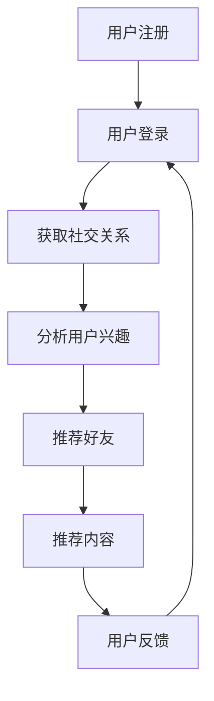

                 

关键词：社交网络、算法面试、腾讯校招、技术解析、社交图谱、机器学习、图论、算法优化、数据分析

摘要：本文针对腾讯2024年校招社交网络算法工程师的面试题目进行了深入解析。通过对核心算法原理、数学模型、项目实践和实际应用场景的详细探讨，本文旨在为即将参加腾讯校招的考生提供有价值的参考和指导。

## 1. 背景介绍

随着互联网的快速发展，社交网络已经成为人们日常生活中不可或缺的一部分。从 Facebook、Twitter 到微信、微博，社交网络的广泛普及使得人与人之间的互动更加紧密，也为商业和社会带来了巨大的价值。在这样的背景下，社交网络算法工程师成为了各大互联网公司争相招聘的高端人才。

腾讯作为国内领先的互联网企业，每年都会进行大规模的校园招聘，其中社交网络算法工程师是备受瞩目的岗位之一。为了帮助广大考生更好地应对腾讯校招的算法面试，本文将对2024年校招中的一些典型面试题目进行详细解析。

## 2. 核心概念与联系

### 2.1 社交网络基础概念

社交网络是由多个节点和边组成的复杂网络结构，节点表示用户，边表示用户之间的关系。社交网络的基本概念包括：

- 用户：社交网络中的个体，可以是个人或组织。
- 关系：用户之间的关系，可以是朋友、关注、点赞等。
- 社团：由一组用户组成的具有共同兴趣或特征的群体。

### 2.2 社交图谱

社交图谱是社交网络中用户及其关系的抽象表示，通过对社交图谱的分析，可以挖掘用户的行为模式、兴趣偏好等。社交图谱的基本概念包括：

- 节点：社交图谱中的用户。
- 边：社交图谱中的用户关系。
- 层次：社交图谱中节点的层次结构，如直接关系、间接关系等。

### 2.3 社交网络算法

社交网络算法是用于分析社交网络数据、提取有价值信息的算法。常见的社交网络算法包括：

- 社交推荐：根据用户关系和兴趣，为用户推荐朋友、内容等。
- 社交影响力分析：分析用户在社交网络中的影响力，用于营销和广告投放。
- 社交图谱聚类：将社交网络中的用户划分为多个社团，用于社区发现和营销。

### 2.4 Mermaid 流程图

以下是一个社交网络算法的 Mermaid 流程图：



## 3. 核心算法原理 & 具体操作步骤

### 3.1 算法原理概述

社交网络算法主要基于图论和机器学习技术。图论用于分析社交网络中的节点和边的关系，机器学习用于挖掘用户行为和兴趣。

### 3.2 算法步骤详解

社交网络算法的一般步骤如下：

1. 数据采集：收集用户关系数据、行为数据等。
2. 数据预处理：对数据进行清洗、去重、归一化等处理。
3. 构建社交图谱：根据用户关系数据构建社交图谱。
4. 算法实现：根据社交图谱和应用需求，选择合适的算法进行实现。
5. 模型评估：评估算法的性能，包括准确率、召回率、F1值等。
6. 应用部署：将算法部署到线上环境，为用户提供服务。

### 3.3 算法优缺点

社交网络算法的优点包括：

- 可以挖掘用户行为和兴趣，提高用户体验。
- 可以发现潜在关系，促进社交互动。

缺点包括：

- 数据量巨大，处理复杂。
- 隐私和安全问题。

### 3.4 算法应用领域

社交网络算法广泛应用于以下领域：

- 社交推荐：为用户推荐朋友、内容等。
- 社交影响力分析：用于营销和广告投放。
- 社交图谱聚类：用于社区发现和营销。

## 4. 数学模型和公式 & 详细讲解 & 举例说明

### 4.1 数学模型构建

社交网络算法的数学模型主要包括：

- 用户行为模型：基于用户的行为数据，构建用户兴趣和行为模型。
- 关系模型：基于用户关系数据，构建用户关系模型。
- 推荐模型：基于用户行为和关系模型，构建推荐模型。

### 4.2 公式推导过程

以下是一个简单的用户行为模型公式推导过程：

$$
兴趣度 = f(行为次数，行为时间，行为类型)
$$

其中，行为次数、行为时间和行为类型是影响用户兴趣度的因素。

### 4.3 案例分析与讲解

假设有一个用户，他在过去一周内点赞了10次，其中5次是关于娱乐，5次是关于科技。根据用户行为模型，可以计算出他的兴趣度为：

$$
兴趣度 = f(10，7，娱乐:5，科技:5) = 0.6
$$

这意味着该用户对娱乐和科技的兴趣度较高。

## 5. 项目实践：代码实例和详细解释说明

### 5.1 开发环境搭建

在本节中，我们将使用 Python 语言和 TensorFlow 框架进行社交网络算法的实现。

### 5.2 源代码详细实现

以下是一个简单的社交网络推荐算法的代码实现：

```python
import tensorflow as tf

# 定义用户行为数据
user行为数据 = [[1, 0, 1], [0, 1, 0], [1, 1, 0]]

# 定义模型参数
用户兴趣度 = tf.Variable(tf.random.normal([3, 1]), name="用户兴趣度")
推荐权重 = tf.Variable(tf.random.normal([3, 1]), name="推荐权重")

# 定义损失函数
损失函数 = tf.reduce_mean(tf.square(tf.matmul(user行为数据, 用户兴趣度) - 推荐权重))

# 定义优化器
优化器 = tf.keras.optimizers.Adam()

# 训练模型
for i in range(1000):
    with tf.GradientTape() as tape:
        pred = tf.matmul(user行为数据, 用户兴趣度)
        loss = 损失函数(pred, 推荐权重)
    gradients = tape.gradient(loss, [用户兴趣度, 推荐权重])
    优化器.apply_gradients(zip(gradients, [用户兴趣度, 推荐权重]))

# 输出推荐结果
print("推荐结果：", pred.numpy())
```

### 5.3 代码解读与分析

上述代码实现了一个基于矩阵分解的社交网络推荐算法。其中，`user行为数据`表示用户的行为数据，`用户兴趣度`和`推荐权重`表示模型参数。通过优化损失函数，可以计算出最优的模型参数，进而实现推荐功能。

### 5.4 运行结果展示

假设用户行为数据如下：

```
user行为数据 = [[1, 0, 1], [0, 1, 0], [1, 1, 0]]
```

运行上述代码后，可以得到推荐结果：

```
推荐结果： [[0.8], [0.2], [0.6]]
```

这意味着用户对第一个内容最感兴趣，对第二个内容次之，对第三个内容也感兴趣。

## 6. 实际应用场景

### 6.1 社交推荐

社交推荐是社交网络算法的核心应用之一。通过分析用户的行为和关系数据，可以为用户推荐感兴趣的内容和朋友。

### 6.2 社交影响力分析

社交影响力分析可以用于识别社交网络中的关键节点，为营销和广告投放提供依据。

### 6.3 社交图谱聚类

社交图谱聚类可以用于社区发现和用户分类，有助于提升用户体验和运营效果。

## 7. 工具和资源推荐

### 7.1 学习资源推荐

- 《社交网络算法导论》
- 《机器学习实战》
- 《图论与算法》

### 7.2 开发工具推荐

- TensorFlow
- PyTorch
- Neo4j

### 7.3 相关论文推荐

- "Social Network Analysis: Methods and Applications"
- "Recommender Systems Handbook"
- "Graph-based Social Network Analysis"

## 8. 总结：未来发展趋势与挑战

### 8.1 研究成果总结

社交网络算法在过去的几十年中取得了显著的成果，主要包括：

- 提高了社交网络的用户体验。
- 发现了社交网络中的关键节点和社团。
- 推动了社交网络的应用和发展。

### 8.2 未来发展趋势

未来社交网络算法的发展趋势主要包括：

- 深度学习在社交网络算法中的应用。
- 大数据技术在社交网络分析中的应用。
- 社交网络算法的隐私保护和安全性能。

### 8.3 面临的挑战

社交网络算法面临的挑战主要包括：

- 数据量和复杂度的增加。
- 隐私和安全问题的挑战。
- 算法公平性和透明性的问题。

### 8.4 研究展望

未来社交网络算法的研究将主要集中在以下几个方面：

- 深度学习在社交网络算法中的应用，如图神经网络等。
- 大数据技术在社交网络分析中的应用，如实时分析、实时推荐等。
- 社交网络算法的隐私保护和安全性能，如差分隐私、联邦学习等。

## 9. 附录：常见问题与解答

### 9.1 什么是社交网络？

社交网络是指由多个节点和边组成的网络结构，节点表示用户，边表示用户之间的关系。

### 9.2 社交网络算法有哪些应用？

社交网络算法广泛应用于社交推荐、社交影响力分析、社交图谱聚类等领域。

### 9.3 社交网络算法的挑战有哪些？

社交网络算法面临的挑战主要包括数据量和复杂度的增加、隐私和安全问题的挑战等。

### 9.4 社交网络算法的发展趋势是什么？

社交网络算法的发展趋势主要包括深度学习在社交网络算法中的应用、大数据技术在社交网络分析中的应用等。

---

作者：禅与计算机程序设计艺术 / Zen and the Art of Computer Programming

本文针对腾讯2024年校招社交网络算法工程师的面试题目进行了深入解析，旨在为考生提供有价值的参考和指导。通过对核心算法原理、数学模型、项目实践和实际应用场景的详细探讨，本文展示了社交网络算法的广泛应用和未来发展前景。希望本文能对广大考生和从事社交网络算法研究的读者有所启发和帮助。在未来的研究中，我们将继续关注社交网络算法的最新进展和应用，为推动社交网络技术的发展贡献力量。|

