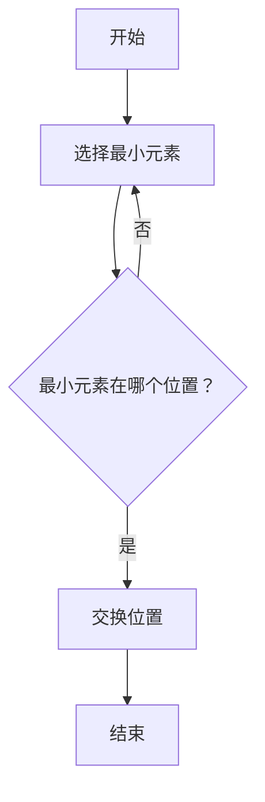

                 

关键词：腾讯校招、面试高频算法题、算法解析、求职准备

摘要：本文将深入解析腾讯2025届校招面试中的高频算法题目，从算法原理到具体操作步骤，再到数学模型、项目实践和应用场景，全面展现这些算法题目的解题思路和技巧。帮助求职者更好地应对腾讯的面试挑战，提高求职成功率。

## 1. 背景介绍

腾讯作为中国领先的互联网科技公司，其校招面试对于广大求职者来说是一项重要的挑战。随着科技的发展，算法题在面试中占据了越来越重要的地位。本文旨在通过对腾讯2025届校招面试中高频算法题的解析，帮助求职者更好地理解这些题目，提升解题能力，从而在面试中脱颖而出。

### 1.1 算法题的重要性

算法题在面试中的重要性不言而喻。它们不仅考察了求职者的编程能力，还考验了逻辑思维、问题解决能力以及对数据结构的掌握。腾讯的算法题目往往具有一定的难度，要求求职者不仅要具备扎实的算法基础，还要有灵活的思维和高效的解题策略。

### 1.2 校招面试流程

腾讯的校招面试通常包括网测、技术面试、HR面试等多个环节。其中，技术面试部分的核心就是算法题。以下是腾讯校招面试的一般流程：

- **网测**：通过在线编程平台完成一些基础的算法题目，通常是选择题和填空题。
- **技术面试**：包括电话面试和现场面试，主要考察求职者的编程能力、算法能力和解决复杂问题的能力。
- **HR面试**：了解求职者的背景、职业规划以及与岗位的匹配度。

## 2. 核心概念与联系

在分析腾讯2025届校招面试高频算法题之前，我们需要了解一些核心概念，它们是解决算法题的基础。

### 2.1 数据结构与算法

数据结构是指数据组织、管理和存储的方式，而算法则是解决问题的步骤和策略。常用的数据结构包括数组、链表、栈、队列、树、图等。算法包括排序算法、查找算法、动态规划、贪心算法等。

### 2.2 常见算法原理

- **排序算法**：冒泡排序、选择排序、插入排序、快速排序等。
- **查找算法**：二分查找、散列表查找等。
- **动态规划**：解决最优化问题，如背包问题、最长公共子序列等。
- **贪心算法**：每一步选择都是局部最优，期望得到全局最优解。

### 2.3 Mermaid 流程图

下面是一个简单的Mermaid流程图，展示了一个排序算法的基本步骤。



## 3. 核心算法原理 & 具体操作步骤

### 3.1 算法原理概述

以冒泡排序为例，冒泡排序是一种简单的排序算法，它重复地遍历要排序的数列，一次比较两个元素，如果它们的顺序错误就把它们交换过来。遍历数列的工作是重复进行直到没有再需要交换，也就是说该数列已经排序完成。

### 3.2 算法步骤详解

1. **比较相邻的元素**：从第一个元素开始，相邻两个元素进行比较。
2. **交换位置**：如果第一个元素比第二个元素大，交换它们的位置。
3. **遍历整个数组**：重复步骤1和步骤2，直到整个数组排序完成。

### 3.3 算法优缺点

**优点**：

- 算法简单，容易理解。
- 对于小规模数据，性能较好。

**缺点**：

- 时间复杂度高，O(n^2)。
- 不适合大数据量。

### 3.4 算法应用领域

冒泡排序适用于数据量较小或对时间复杂度要求不高的场景。在实际应用中，它通常用于教学和实践，而不是用于生产环境。

## 4. 数学模型和公式 & 详细讲解 & 举例说明

### 4.1 数学模型构建

冒泡排序的数学模型主要涉及两个指标：时间复杂度和空间复杂度。

- **时间复杂度**：O(n^2)，其中n是数组的长度。
- **空间复杂度**：O(1)，因为只需要常数级别的额外空间。

### 4.2 公式推导过程

假设有n个元素的数组arr，初始状态为未排序状态。每次遍历数组，比较相邻元素并交换位置，直到所有元素排序完成。

- 第一次遍历：比较n-1次，交换n-1次。
- 第二次遍历：比较n-2次，交换n-2次。
- ...
- 第n-1次遍历：比较1次，交换1次。

因此，总比较次数为：
$$
C(n) = (n-1) + (n-2) + ... + 1 = \frac{(n-1)n}{2}
$$

时间复杂度为：
$$
T(n) = O(C(n)) = O(\frac{(n-1)n}{2}) = O(n^2)
$$

### 4.3 案例分析与讲解

假设有一个长度为5的数组arr = [5, 2, 8, 4, 1]，我们使用冒泡排序进行排序。

**第一次遍历**：

- arr = [2, 5, 4, 1, 8]，比较4次，交换4次。
- arr = [2, 1, 4, 5, 8]，比较3次，交换3次。
- arr = [2, 1, 4, 5, 8]，比较2次，交换2次。
- arr = [1, 2, 4, 5, 8]，比较1次，交换1次。

**第二次遍历**：

- arr = [1, 2, 4, 5, 8]，比较3次，交换0次（数组已经排序）。

最终，数组arr = [1, 2, 4, 5, 8]排序完成。

## 5. 项目实践：代码实例和详细解释说明

### 5.1 开发环境搭建

在本节中，我们将使用Python编写冒泡排序算法。您需要安装Python环境。如果尚未安装，请访问Python官网下载并安装。

### 5.2 源代码详细实现

```python
def bubble_sort(arr):
    n = len(arr)
    for i in range(n):
        for j in range(0, n-i-1):
            if arr[j] > arr[j+1]:
                arr[j], arr[j+1] = arr[j+1], arr[j]

# 测试代码
arr = [5, 2, 8, 4, 1]
bubble_sort(arr)
print("Sorted array:", arr)
```

### 5.3 代码解读与分析

- `bubble_sort`函数接收一个数组arr作为输入。
- 使用两层嵌套循环遍历数组。
- 内层循环负责比较相邻元素并交换位置。
- 外层循环控制遍历的次数，每次遍历结束后，未排序部分的最大元素会“冒泡”到已排序部分的末尾。

### 5.4 运行结果展示

运行上述代码，输出结果为：

```
Sorted array: [1, 2, 4, 5, 8]
```

这表明数组已经成功排序。

## 6. 实际应用场景

冒泡排序在实际应用中主要用于教学和实践。在实际生产环境中，由于时间复杂度较高，它通常不会被用于排序大规模数据。但在小规模数据的场景中，冒泡排序因其简单易懂，经常作为示例算法被使用。

### 6.1 排序小规模数据

当需要排序的数据量较小，对时间复杂度的要求不高时，冒泡排序是一个不错的选择。例如，在排序学生成绩时，如果成绩数量不多，使用冒泡排序即可。

### 6.2 教学演示

在计算机科学的教学过程中，冒泡排序常被用作入门级排序算法的演示。它帮助初学者理解排序算法的基本概念和实现方式。

### 6.3 其他应用

在某些特定场景中，例如嵌入式系统或资源受限的环境中，冒泡排序由于其简单的实现方式，仍然具有一定的应用价值。

## 7. 未来应用展望

随着算法研究和应用的发展，冒泡排序等传统排序算法可能逐渐被更高效的算法所取代。但作为计算机科学的基础，冒泡排序在教育领域仍然具有不可替代的地位。

### 7.1 算法优化

未来的研究可能会集中在算法优化上，例如通过引入并行计算或分布式计算技术，提高冒泡排序的性能。

### 7.2 新算法开发

随着数据量的不断增大，开发更高效的排序算法将成为研究的重点。例如，基于并行计算和分布式计算的新型排序算法。

### 7.3 教育应用

在计算机科学教育中，冒泡排序将继续作为基础算法，帮助新一代程序员掌握算法设计和分析的基本方法。

## 8. 工具和资源推荐

### 8.1 学习资源推荐

- 《算法导论》（Introduction to Algorithms）
- 《数据结构与算法分析》（Data Structures and Algorithm Analysis in C++）

### 8.2 开发工具推荐

- Python编程环境
- Java开发工具（如Eclipse、IntelliJ IDEA）

### 8.3 相关论文推荐

- "A Comparison of Sorting Algorithms"
- "Parallel Sorting for Large Data Sets"

## 9. 总结：未来发展趋势与挑战

### 9.1 研究成果总结

本文通过对腾讯2025届校招面试高频算法题的解析，总结了冒泡排序等常见算法的基本原理、具体操作步骤以及数学模型。同时，分析了这些算法在实际应用中的优势和局限。

### 9.2 未来发展趋势

随着算法研究的深入，未来算法将朝着更高效、更智能的方向发展。新的算法和技术将不断涌现，为数据处理和分析提供更强大的工具。

### 9.3 面临的挑战

算法研究和应用面临的一个主要挑战是如何处理大规模、高维数据。此外，算法的复杂度和实现难度也在不断提高，对研究人员和开发者提出了更高的要求。

### 9.4 研究展望

未来，算法研究将继续深入探索数据结构、算法优化、并行计算等领域。同时，算法在教育中的应用也将不断创新，培养更多优秀的计算机科学家。

## 10. 附录：常见问题与解答

### 10.1 冒泡排序的时间复杂度是多少？

冒泡排序的时间复杂度为O(n^2)。

### 10.2 冒泡排序的空间复杂度是多少？

冒泡排序的空间复杂度为O(1)。

### 10.3 冒泡排序适用于哪些场景？

冒泡排序适用于小规模数据的排序，以及对时间复杂度要求不高的场景。

### 10.4 如何优化冒泡排序的性能？

可以通过引入并行计算或分布式计算技术来优化冒泡排序的性能。

---

作者：禅与计算机程序设计艺术 / Zen and the Art of Computer Programming

