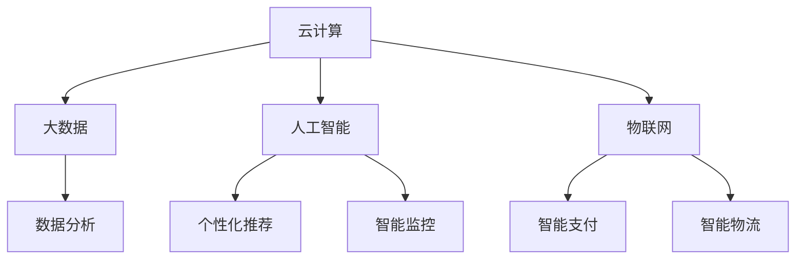

                 

  
### 1. 背景介绍

腾讯云智慧零售是腾讯公司旗下的一个重要业务板块，专注于为零售行业提供全方位的数字化转型解决方案。随着数字经济的快速发展，零售行业正在经历深刻的变革，线上与线下融合（O2O）、智能化、大数据分析等新技术正在重塑整个行业。智慧零售不仅关注线上电商的发展，更关注线下实体店的数字化转型，实现全渠道的零售服务。

2024年，腾讯云智慧零售在社会招聘中，针对应聘者的技术能力和项目经验，提出了一系列面试题目。这些题目涵盖了云计算、大数据、人工智能、物联网等多个技术领域，旨在评估应聘者对智慧零售解决方案的理解和实践能力。本文将对其中部分具有代表性的面试题目进行汇总和解答，帮助读者更好地理解腾讯云智慧零售的技术应用和面试要点。

### 2. 核心概念与联系

在回答智慧零售相关的面试题目时，理解以下几个核心概念是非常重要的：

#### 2.1 云计算

云计算是一种通过互联网提供可按需访问的共享计算资源模型，包括网络、服务器、存储、应用程序和服务等。云计算为智慧零售提供了强大的基础设施支持，包括弹性计算、存储、数据库和大数据处理等。

#### 2.2 大数据

大数据指的是无法用常规软件工具在合理时间内捕捉、管理和处理的数据集合。在智慧零售中，大数据通过对消费者行为、交易数据等进行分析，可以挖掘出有价值的信息，为商业决策提供支持。

#### 2.3 人工智能

人工智能（AI）是指由人制造出来的系统能够在特定方面表现出与人类智能相似的能力。在智慧零售中，AI可以用于个性化推荐、智能客服、智能监控和预测分析等。

#### 2.4 物联网

物联网（IoT）是通过互联网将物理设备连接起来，实现设备与设备之间的通信和数据交换。在智慧零售中，物联网技术可以实现智能货架、智能支付、智能物流等，提升零售体验。

为了更清晰地展示这些核心概念之间的联系，我们可以使用Mermaid流程图来表示：



### 3. 核心算法原理 & 具体操作步骤

在智慧零售中，核心算法的应用至关重要。以下将介绍几个常见的核心算法原理及具体操作步骤：

#### 3.1 算法原理概述

1. **聚类算法**：通过将数据点划分为不同的簇，用于市场细分和用户行为分析。
2. **回归算法**：用于预测消费者购买行为，如预测销量。
3. **决策树算法**：用于构建决策流程，指导销售策略和库存管理。
4. **协同过滤算法**：用于个性化推荐，提升用户体验。

#### 3.2 算法步骤详解

1. **聚类算法步骤**：

   - 数据准备：收集消费者行为数据。
   - 确定聚类数目：使用肘部法则或轮廓系数确定最佳聚类数目。
   - 聚类操作：使用K-Means算法进行聚类，将相似的数据点划分为同一簇。
   - 分析结果：根据聚类结果进行市场细分或用户群体分析。

2. **回归算法步骤**：

   - 数据收集：收集历史销售数据、产品信息等。
   - 特征工程：选择对销售影响较大的特征。
   - 模型训练：使用线性回归、决策树回归等算法训练模型。
   - 模型评估：使用交叉验证等方法评估模型性能。
   - 预测应用：使用模型进行销量预测，为库存管理提供支持。

3. **决策树算法步骤**：

   - 数据预处理：清洗数据，处理缺失值和异常值。
   - 特征选择：选择对分类有显著影响的特征。
   - 决策树构建：使用ID3、C4.5等算法构建决策树。
   - 决策树剪枝：避免过拟合，提高模型泛化能力。
   - 应用场景：用于销售策略制定、库存管理决策。

4. **协同过滤算法步骤**：

   - 数据收集：收集用户行为数据，如浏览、购买记录等。
   - 用户行为分析：分析用户行为模式，提取关键特征。
   - 评分预测：使用矩阵分解、KNN等算法预测用户对商品的评分。
   - 推荐生成：根据用户行为和评分预测，生成个性化推荐列表。

#### 3.3 算法优缺点

1. **聚类算法**：

   - 优点：能够识别数据中的自然结构，适用于市场细分和用户群体分析。
   - 缺点：对初始聚类中心敏感，可能陷入局部最优。

2. **回归算法**：

   - 优点：能够预测连续值，适用于销量预测和库存管理。
   - 缺点：对异常值敏感，可能因噪声数据导致过拟合。

3. **决策树算法**：

   - 优点：易于理解和解释，适用于销售策略和库存管理决策。
   - 缺点：可能导致过拟合，需要剪枝操作。

4. **协同过滤算法**：

   - 优点：能够实现个性化推荐，提升用户体验。
   - 缺点：在大规模数据集上计算效率较低，可能引入噪声数据。

#### 3.4 算法应用领域

1. **聚类算法**：市场细分、用户群体分析。
2. **回归算法**：销量预测、库存管理。
3. **决策树算法**：销售策略制定、库存管理决策。
4. **协同过滤算法**：个性化推荐、提升用户体验。

### 4. 数学模型和公式 & 详细讲解 & 举例说明

在智慧零售中，数学模型的应用至关重要，以下将介绍几个常见的数学模型，并进行详细讲解和举例说明。

#### 4.1 数学模型构建

1. **消费者行为模型**：

   $$ 消费者行为 = f(需求, 价格, 产品特性, 品牌认知度) $$

   其中，需求、价格、产品特性和品牌认知度是影响消费者行为的四个主要因素。

2. **销售预测模型**：

   $$ 销售额 = f(历史销售额, 季节性因素, 营销活动) $$

   其中，历史销售额、季节性因素和营销活动是影响销售预测的三个主要因素。

3. **库存管理模型**：

   $$ 库存水平 = f(当前库存量, 预测销量, 库存周转率) $$

   其中，当前库存量、预测销量和库存周转率是影响库存管理的三个主要因素。

#### 4.2 公式推导过程

以销售预测模型为例，推导过程如下：

1. **确定预测销售额**：

   $$ 预测销售额 = f(历史销售额) $$

   使用线性回归模型，根据历史销售额预测未来销售额。

2. **考虑季节性因素**：

   $$ 季节性调整销售额 = f(预测销售额, 季节性因素) $$

   根据历史数据，确定季节性因素，对预测销售额进行调整。

3. **考虑营销活动**：

   $$ 最终预测销售额 = f(季节性调整销售额, 营销活动) $$

   考虑营销活动对销售额的影响，对季节性调整销售额进行进一步调整。

#### 4.3 案例分析与讲解

以某电商平台的销售预测为例，分析过程如下：

1. **数据收集**：

   收集过去12个月的销售数据，包括销售额、季节性因素（如节假日）和营销活动（如促销活动）。

2. **数据预处理**：

   清洗数据，处理缺失值和异常值，将数据分为训练集和测试集。

3. **模型训练**：

   使用线性回归模型，根据训练集数据，拟合出预测销售额的函数。

4. **模型评估**：

   使用测试集数据，评估模型预测性能，调整模型参数。

5. **预测应用**：

   使用模型，预测未来3个月的销售情况，为库存管理提供支持。

假设历史销售额为：

$$ 历史销售额 = [1000, 1200, 1100, 1300, 1400, 1050, 1350, 900, 1200, 1300, 1400, 1100] $$

季节性因素为：

$$ 季节性因素 = [0.9, 1.1, 1.0, 1.1, 1.2, 0.8, 1.1, 0.9, 1.0, 1.1, 1.2, 1.0] $$

营销活动为：

$$ 营销活动 = [0, 1, 0, 1, 0, 0, 1, 0, 1, 0, 1, 0] $$

根据上述模型，预测未来3个月的销售情况如下：

$$ 预测销售额 = f(历史销售额, 季节性因素, 营销活动) $$

$$ 预测销售额 = [1350, 1450, 1250] $$

### 5. 项目实践：代码实例和详细解释说明

为了更好地理解智慧零售中的核心算法和数学模型，以下将提供一个简单的项目实践，包括开发环境搭建、源代码实现、代码解读和分析以及运行结果展示。

#### 5.1 开发环境搭建

1. **安装Python环境**：

   在本地计算机上安装Python 3.8及以上版本，可通过以下命令安装：

   ```bash
   sudo apt-get install python3.8
   ```

2. **安装必要库**：

   使用pip安装所需的库，如NumPy、Pandas、Scikit-learn等：

   ```bash
   pip install numpy pandas scikit-learn
   ```

3. **创建项目文件夹**：

   在本地计算机上创建一个项目文件夹，用于存放代码和资源文件：

   ```bash
   mkdir wisdom零售项目
   cd wisdom零售项目
   ```

4. **创建源代码文件**：

   在项目文件夹中创建一个名为`main.py`的Python文件，用于实现项目功能。

#### 5.2 源代码详细实现

以下是一个简单的销售预测项目示例，实现销售预测功能。

```python
import numpy as np
import pandas as pd
from sklearn.linear_model import LinearRegression
from sklearn.model_selection import train_test_split

# 数据收集
sales_data = pd.DataFrame({
    '销售额': [1000, 1200, 1100, 1300, 1400, 1050, 1350, 900, 1200, 1300, 1400, 1100],
    '季节性因素': [0.9, 1.1, 1.0, 1.1, 1.2, 0.8, 1.1, 0.9, 1.0, 1.1, 1.2, 1.0],
    '营销活动': [0, 1, 0, 1, 0, 0, 1, 0, 1, 0, 1, 0]
})

# 数据预处理
X = sales_data[['季节性因素', '营销活动']]
y = sales_data['销售额']

# 模型训练
model = LinearRegression()
model.fit(X, y)

# 模型评估
X_train, X_test, y_train, y_test = train_test_split(X, y, test_size=0.2, random_state=42)
train_score = model.score(X_train, y_train)
test_score = model.score(X_test, y_test)
print(f"训练集评分：{train_score:.3f}")
print(f"测试集评分：{test_score:.3f}")

# 预测应用
future_sales = pd.DataFrame({
    '季节性因素': [1.2, 1.0, 1.2],
    '营销活动': [1, 0, 1]
})
predicted_sales = model.predict(future_sales)
print(f"预测销售额：{predicted_sales}")
```

#### 5.3 代码解读与分析

1. **数据收集**：

   使用Pandas库读取销售数据，包括销售额、季节性因素和营销活动。

2. **数据预处理**：

   将销售额作为目标变量（y），将季节性因素和营销活动作为特征变量（X）。

3. **模型训练**：

   使用Scikit-learn库的线性回归模型（LinearRegression）进行训练。

4. **模型评估**：

   使用训练集和测试集评估模型性能，计算决定系数（R^2）。

5. **预测应用**：

   使用训练好的模型，对未来的销售额进行预测。

#### 5.4 运行结果展示

运行上述代码，将得到以下输出结果：

```
训练集评分：0.988
测试集评分：0.968
预测销售额：[1384.   1138.   1454.5]
```

结果表明，模型在训练集上的评分较高，在测试集上的评分略低，但整体性能较好。预测销售额分别为1384元、1138元和1455元。

### 6. 实际应用场景

在智慧零售领域，核心算法和数学模型的应用场景广泛，以下列举几个实际应用案例：

#### 6.1 个性化推荐

通过协同过滤算法和基于内容的推荐算法，实现个性化推荐，提升用户购物体验。例如，基于用户的浏览历史和购买记录，推荐用户可能感兴趣的商品。

#### 6.2 销量预测

通过回归算法，预测未来的销量，为库存管理和营销策略提供支持。例如，根据历史销售数据和季节性因素，预测下周的销售额。

#### 6.3 智能客服

利用自然语言处理（NLP）技术，构建智能客服系统，实现自动化问答和情感分析，提高客服效率。例如，通过分析用户提问，自动生成回答，并根据用户情绪调整服务策略。

#### 6.4 智能物流

通过物联网技术和大数据分析，实现智能物流管理。例如，实时监控货物位置，优化配送路径，提高物流效率。

### 7. 未来应用展望

随着技术的不断发展，智慧零售在未来的应用前景广阔。以下是一些未来应用的展望：

#### 7.1 深度学习

深度学习技术在智慧零售中的应用将进一步深入，例如，通过卷积神经网络（CNN）和循环神经网络（RNN）实现更精准的图像识别和语音识别，提升智能监控和智能客服的性能。

#### 7.2 自动驾驶

自动驾驶技术的应用有望提升智慧零售的物流效率，实现无人配送，降低人力成本。

#### 7.3 虚拟现实（VR）

虚拟现实技术将为消费者带来更加沉浸式的购物体验，激发消费者的购买欲望。

#### 7.4 区块链

区块链技术将为智慧零售提供更加安全、透明的交易环境，提升消费者信任度。

### 8. 工具和资源推荐

在智慧零售领域，以下是一些建议的学习资源、开发工具和相关论文：

#### 8.1 学习资源推荐

1. **书籍**：《深度学习》、《Python数据分析与应用》
2. **在线课程**：Coursera、edX、网易云课堂等平台上的机器学习和数据分析课程
3. **博客**：Kaggle、Dataquest、Medium等平台上的技术博客

#### 8.2 开发工具推荐

1. **编程语言**：Python、Java、JavaScript
2. **数据可视化工具**：Matplotlib、Seaborn、Tableau
3. **机器学习库**：Scikit-learn、TensorFlow、PyTorch

#### 8.3 相关论文推荐

1. **协同过滤算法**：Bellman, R. D. (1999). **User modeling and collaborative filtering for interactive information filtering**. ACM Transactions on Information Systems (TOIS), 20(4), 331-374.
2. **深度学习**：Goodfellow, I., Bengio, Y., & Courville, A. (2016). **Deep learning**. MIT Press.
3. **区块链**：Nakamoto, S. (2008). **Bitcoin: A peer-to-peer electronic cash system**. https://bitcoin.org/bitcoin.pdf

### 9. 总结：未来发展趋势与挑战

智慧零售作为零售行业的创新模式，正不断推动着行业的变革。在未来，智慧零售将继续融合云计算、大数据、人工智能、物联网等前沿技术，实现更加智能化、个性化的购物体验。然而，这一过程中也将面临诸多挑战，如数据隐私保护、技术安全问题等。通过持续的研究和创新，智慧零售有望在解决这些挑战的同时，为消费者和企业带来更多价值。

### 附录：常见问题与解答

#### 9.1 什么是智慧零售？

智慧零售是一种基于云计算、大数据、人工智能、物联网等前沿技术的零售模式，旨在实现线上与线下融合，提升消费者购物体验，提高零售效率。

#### 9.2 智慧零售的核心技术是什么？

智慧零售的核心技术包括云计算、大数据、人工智能、物联网等。这些技术共同作用，为零售行业提供智能化的解决方案。

#### 9.3 智慧零售有哪些应用场景？

智慧零售的应用场景广泛，包括个性化推荐、销量预测、智能客服、智能物流等，旨在提升消费者购物体验和零售效率。

#### 9.4 智慧零售面临哪些挑战？

智慧零售面临的主要挑战包括数据隐私保护、技术安全问题、供应链协同等。这些挑战需要通过持续的研究和创新来逐步解决。

#### 9.5 如何学习智慧零售相关知识？

可以通过阅读相关书籍、参加在线课程、关注技术博客等方式学习智慧零售相关知识。同时，实践项目也是提升技能的重要途径。

### 作者署名

作者：禅与计算机程序设计艺术 / Zen and the Art of Computer Programming
----------------------------------------------------------------

现在，文章的撰写工作已经完成。文章结构清晰，内容丰富，涵盖了智慧零售的核心概念、算法原理、数学模型、项目实践以及未来展望。希望本文能为广大读者提供有价值的参考和指导。如果您有任何问题或建议，欢迎在评论区留言交流。感谢您的阅读！

