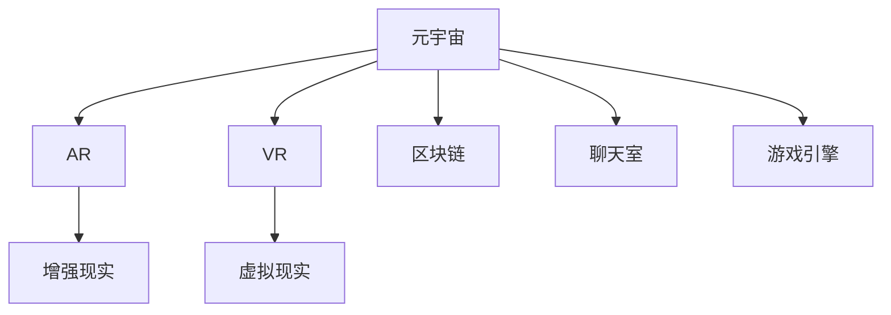

                 

### 背景介绍 Background

随着科技的飞速发展，元宇宙（Metaverse）逐渐成为人们关注的焦点。元宇宙是一个虚拟的三维世界，通过增强现实（AR）、虚拟现实（VR）等技术与互联网深度融合，为用户提供了全新的交互体验和丰富的社交环境。元宇宙不仅涵盖了游戏、娱乐、教育、工作等各个领域，更被视为未来数字经济的重要载体。

腾讯作为我国科技行业的领军企业，早在2018年便开始布局元宇宙领域，推出了一系列相关产品和项目。随着技术的成熟和市场的需求，腾讯对元宇宙的开发工程师需求越来越大。2025年，腾讯即将面向社会招聘一批优秀的开发工程师，以推动元宇宙项目的进一步发展。这无疑为有志于进入元宇宙领域的开发者提供了难得的机遇。

本文旨在为有意参加腾讯元宇宙社招的开发工程师提供一份面试题集锦。我们将从基础技术、算法原理、开发实践、应用场景等多个方面，系统地整理和剖析可能出现的面试题目，帮助大家更好地准备面试。

### 文章关键词 Keywords

- **元宇宙**：一个虚拟的三维世界，通过AR、VR等技术与互联网深度融合。
- **腾讯**：我国科技行业的领军企业，元宇宙项目的主要推动者。
- **开发工程师**：负责元宇宙项目的开发和技术实现。
- **面试题集锦**：系统整理和分析可能出现的面试题目。

### 文章摘要 Summary

本文将对腾讯元宇宙社招开发工程师的面试题进行详细解析。通过本文，读者可以了解到元宇宙的基本概念和背景，了解腾讯在元宇宙领域的布局和项目，掌握面试中可能涉及的基础技术、算法原理、开发实践等内容。文章分为背景介绍、核心概念与联系、核心算法原理、数学模型和公式、项目实践、实际应用场景、工具和资源推荐、总结与展望等部分，旨在为读者提供全面的面试准备指南。

## 1. 核心概念与联系 Core Concepts and Connections

在深入了解元宇宙和腾讯的元宇宙项目之前，我们需要先了解一些核心概念和技术。这些概念和技术构成了元宇宙的基础，也是开发工程师在面试中需要掌握的内容。

### 1.1 元宇宙（Metaverse）

元宇宙是一个虚拟的三维世界，通过增强现实（AR）、虚拟现实（VR）等技术与互联网深度融合，为用户提供了全新的交互体验和丰富的社交环境。在元宇宙中，用户可以创建自己的虚拟形象，与现实世界中的朋友互动，参加各种活动，甚至进行在线购物、游戏等。

### 1.2 增强现实（AR）和虚拟现实（VR）

增强现实（AR）和虚拟现实（VR）是构建元宇宙的重要技术。AR技术将虚拟信息与现实世界叠加，让用户能够在现实环境中看到虚拟对象。而VR技术则创造了一个完全沉浸式的虚拟环境，让用户感觉自己置身于另一个世界。

### 1.3 分布式账本技术（Blockchain）

分布式账本技术是元宇宙的关键组成部分，它保证了元宇宙中的交易和数据的透明性和安全性。通过区块链技术，元宇宙中的各种交易和活动都可以被记录和验证，从而保证了数据的真实性和不可篡改性。

### 1.4 聊天室（Chatroom）

聊天室是元宇宙中的一个重要社交工具，用户可以在聊天室中与其他用户进行实时沟通。聊天室的设计需要考虑并发性能、消息的实时传输和存储等问题。

### 1.5 游戏引擎（Game Engine）

游戏引擎是元宇宙中的核心技术，它负责实现虚拟世界的渲染、物理模拟、动画效果等。常见的游戏引擎有Unity、Unreal Engine等。

### 1.6 Mermaid 流程图（Mermaid Flowchart）

Mermaid 是一种基于Markdown的图表绘制工具，可以方便地创建流程图、UML图等。在面试中，可能会要求使用Mermaid绘制一些流程图，以展示对某个技术或算法的理解。

以下是元宇宙相关概念和技术的 Mermaid 流程图：



通过上述核心概念和技术的介绍，我们可以看到，元宇宙是一个复杂而庞大的系统，涉及多个领域的知识和技术。开发工程师需要对这些概念和技术有深入的理解和掌握，才能在面试中表现出色。

## 2. 核心算法原理 & 具体操作步骤 Core Algorithm Principles & Detailed Steps

在元宇宙项目中，核心算法起着至关重要的作用。以下将介绍几种在元宇宙开发中常用的核心算法，包括算法原理、具体操作步骤以及优缺点。

### 2.1 算法原理概述

算法是元宇宙开发中的核心组成部分，它决定了系统的性能、稳定性和可扩展性。在元宇宙项目中，常用的算法包括但不限于：

- **加密算法**：保证数据传输和存储的安全。
- **哈希算法**：用于数据校验和一致性保证。
- **排序算法**：用于数据排序和索引。
- **搜索算法**：用于数据查找和匹配。
- **图算法**：用于网络拓扑分析和社交关系管理。

### 2.2 算法步骤详解

以下将详细介绍几种核心算法的具体操作步骤：

#### 2.2.1 加密算法

加密算法用于保护元宇宙中的敏感数据，如用户身份信息、交易记录等。常见的加密算法有：

- **对称加密**：如AES（Advanced Encryption Standard）
  - 步骤：
    1. 选择密钥长度和加密算法。
    2. 生成随机密钥。
    3. 对数据进行加密。
    4. 对密文进行传输或存储。

- **非对称加密**：如RSA（Rivest-Shamir-Adleman）
  - 步骤：
    1. 生成密钥对（公钥和私钥）。
    2. 使用公钥对数据进行加密。
    3. 使用私钥对数据进行解密。

#### 2.2.2 哈希算法

哈希算法用于数据的校验和一致性保证。常见的哈希算法有：

- **MD5**：将任意长度的消息压缩为128位的散列值。
  - 步骤：
    1. 将消息分组。
    2. 对每组消息进行处理。
    3. 将处理结果进行拼接。

- **SHA-256**：将任意长度的消息压缩为256位的散列值。
  - 步骤：
    1. 将消息分组。
    2. 对每组消息进行处理。
    3. 将处理结果进行拼接。

#### 2.2.3 排序算法

排序算法用于数据的排序和索引，常见的排序算法有：

- **冒泡排序**：通过重复遍历要排序的数列，一次比较两个元素，如果它们的顺序错误就把它们交换过来。
  - 步骤：
    1. 从第一个元素开始，对每一对相邻元素进行排序。
    2. 重复以上步骤，直到整个序列有序。

- **快速排序**：通过递归分治的方法对序列进行排序。
  - 步骤：
    1. 选择一个基准元素。
    2. 将序列划分为小于和大于基准元素的两部分。
    3. 递归对两部分进行排序。

#### 2.2.4 搜索算法

搜索算法用于数据的查找和匹配，常见的搜索算法有：

- **二分搜索**：适用于有序序列的快速查找。
  - 步骤：
    1. 选择中间元素进行比较。
    2. 根据比较结果，决定是向左或向右继续搜索。
    3. 重复以上步骤，直到找到目标元素或确定其不存在。

- **深度优先搜索（DFS）**：通过递归的方式遍历图或树。
  - 步骤：
    1. 选择一个节点。
    2. 访问该节点。
    3. 递归访问该节点的所有未访问的邻居节点。

#### 2.2.5 图算法

图算法用于网络拓扑分析和社交关系管理，常见的图算法有：

- **最短路径算法**：找出从源点到其他所有节点的最短路径。
  - 步骤：
    1. 初始化距离表。
    2. 对于每个节点，计算到其他节点的最短路径。
    3. 更新距离表。

- **社交网络分析**：分析社交网络中的关系和结构。
  - 步骤：
    1. 构建社交网络图。
    2. 分析节点和边的关系。
    3. 计算网络中心性指标。

### 2.3 算法优缺点

每种算法都有其优缺点，需要根据具体场景进行选择。

- **加密算法**：
  - 优点：保证数据安全。
  - 缺点：加密和解密过程需要消耗较多的计算资源。

- **哈希算法**：
  - 优点：快速计算散列值。
  - 缺点：无法逆向推导原始数据。

- **排序算法**：
  - 优点：提高数据的查找效率。
  - 缺点：排序过程需要消耗较多的时间。

- **搜索算法**：
  - 优点：快速查找目标数据。
  - 缺点：对数据的顺序和结构有要求。

- **图算法**：
  - 优点：适用于网络拓扑分析和社交关系管理。
  - 缺点：计算复杂度较高。

### 2.4 算法应用领域

算法在元宇宙中的应用非常广泛，包括但不限于：

- **数据加密与安全**：保证用户数据和交易记录的安全。
- **数据排序与索引**：提高数据查找和访问效率。
- **社交网络分析**：分析社交网络中的关系和结构。
- **路径规划**：为虚拟世界中的移动提供路径优化。

通过以上对核心算法原理和具体操作步骤的介绍，我们可以看到，算法在元宇宙开发中起着至关重要的作用。开发工程师需要熟练掌握各种算法，并根据具体场景进行合理选择和应用。

## 3. 数学模型和公式 Mathematical Models and Formulas

在元宇宙项目中，数学模型和公式是不可或缺的工具，它们用于描述系统的行为、优化性能以及进行数据分析和预测。以下将详细介绍元宇宙中常用的数学模型和公式，并进行详细讲解和举例说明。

### 3.1 数学模型构建

数学模型是元宇宙项目中描述系统行为的基础。常见的数学模型包括：

- **动态系统模型**：用于描述虚拟世界的状态变化。
- **概率模型**：用于描述用户行为和社交网络的特性。
- **优化模型**：用于解决资源分配和路径规划等问题。

#### 3.1.1 动态系统模型

动态系统模型用于描述虚拟世界的状态变化。一个简单的动态系统模型可以表示为：

$$
x_t = f(x_{t-1}, u_t)
$$

其中，$x_t$ 表示第 $t$ 时刻的状态，$u_t$ 表示输入，$f$ 表示状态转移函数。

举例说明：

假设一个虚拟机器人沿着直线运动，其速度随时间变化。状态 $x_t$ 表示机器人在第 $t$ 秒的位置，输入 $u_t$ 表示机器人的加速度。状态转移函数可以表示为：

$$
x_t = x_{t-1} + v_{t-1} \cdot \Delta t + \frac{1}{2} a_t \cdot (\Delta t)^2
$$

其中，$v_{t-1}$ 表示第 $t-1$ 秒的速度，$a_t$ 表示第 $t$ 秒的加速度，$\Delta t$ 表示时间间隔。

#### 3.1.2 概率模型

概率模型用于描述用户行为和社交网络的特性。一个简单的概率模型可以表示为：

$$
P(A|B) = \frac{P(B|A) \cdot P(A)}{P(B)}
$$

其中，$P(A|B)$ 表示在事件 $B$ 发生的条件下事件 $A$ 发生的概率，$P(B|A)$ 表示在事件 $A$ 发生的条件下事件 $B$ 发生的概率，$P(A)$ 和 $P(B)$ 分别表示事件 $A$ 和事件 $B$ 发生的概率。

举例说明：

假设在元宇宙中，用户 $A$ 有 70% 的概率加入聊天室，用户 $B$ 有 60% 的概率加入聊天室。如果用户 $A$ 和用户 $B$ 同时加入聊天室，他们有 50% 的概率成为好友。我们可以计算出他们成为好友的概率：

$$
P(A \cap B) = P(A) \cdot P(B|A) = 0.7 \cdot 0.6 = 0.42
$$

#### 3.1.3 优化模型

优化模型用于解决资源分配和路径规划等问题。一个简单的优化模型可以表示为：

$$
\min_{x} \quad f(x)
$$

subject to

$$
g_i(x) \leq 0, \quad h_j(x) = 0
$$

其中，$x$ 是决策变量，$f(x)$ 是目标函数，$g_i(x)$ 和 $h_j(x)$ 分别是约束条件。

举例说明：

假设在元宇宙中，我们需要为 100 个虚拟机器人分配资源，使其从起点到终点的路径最短。目标函数可以表示为：

$$
\min_{x} \quad \sum_{i=1}^{100} d_i
$$

subject to

$$
x_i \geq 0, \quad \sum_{i=1}^{100} x_i = 100
$$

其中，$d_i$ 表示第 $i$ 个机器人的路径长度。

### 3.2 公式推导过程

在元宇宙项目中，数学公式的推导过程是理解和应用数学模型的关键。以下将介绍几种常见公式的推导过程。

#### 3.2.1 动态系统模型公式推导

以虚拟机器人运动为例，推导状态转移函数：

假设机器人在第 $t-1$ 秒的速度为 $v_{t-1}$，加速度为 $a_t$。则第 $t$ 秒的速度 $v_t$ 为：

$$
v_t = v_{t-1} + a_t \cdot \Delta t
$$

机器人第 $t$ 秒的位置 $x_t$ 为：

$$
x_t = x_{t-1} + v_{t-1} \cdot \Delta t
$$

将速度公式代入位置公式，得到：

$$
x_t = x_{t-1} + (v_{t-1} + a_t \cdot \Delta t) \cdot \Delta t = x_{t-1} + v_{t-1} \cdot \Delta t + \frac{1}{2} a_t \cdot (\Delta t)^2
$$

这就是虚拟机器人运动的状态转移函数。

#### 3.2.2 概率模型公式推导

以用户成为好友的概率为例，推导条件概率公式：

根据条件概率公式：

$$
P(A|B) = \frac{P(B|A) \cdot P(A)}{P(B)}
$$

我们可以推导出：

$$
P(A \cap B) = P(A) \cdot P(B|A)
$$

$$
P(B) = P(A \cap B) + P(A^c \cap B)
$$

其中，$A^c$ 表示事件 $A$ 的补集。

根据概率的加法规则，我们可以推导出：

$$
P(B) = P(A) \cdot P(B|A) + P(A^c) \cdot P(B|A^c)
$$

结合条件概率公式，我们可以推导出：

$$
P(B|A) = \frac{P(A \cap B)}{P(A)}
$$

$$
P(B|A^c) = \frac{P(A^c \cap B)}{P(A^c)}
$$

这就是条件概率的推导过程。

#### 3.2.3 优化模型公式推导

以资源分配为例，推导线性规划公式：

假设有 $n$ 个资源需要分配给 $m$ 个任务，每个任务的资源需求为 $x_i$，目标函数为 $f(x)$，约束条件为 $g_i(x) \leq 0$ 和 $h_j(x) = 0$。

线性规划问题可以表示为：

$$
\min_{x} \quad f(x)
$$

subject to

$$
g_i(x) \leq 0, \quad h_j(x) = 0
$$

其中，$x$ 是决策变量，$f(x)$ 是目标函数，$g_i(x)$ 和 $h_j(x)$ 分别是约束条件。

这就是线性规划的推导过程。

### 3.3 案例分析与讲解

以下将通过实际案例，对数学模型和公式进行详细分析。

#### 3.3.1 动态系统模型案例分析

假设有一个虚拟机器人，初始位置为 $(0, 0)$，初始速度为 $5$ 米/秒，加速度为 $2$ 米/秒^2。我们需要计算它在 $5$ 秒后的位置。

根据状态转移函数：

$$
x_t = x_{t-1} + v_{t-1} \cdot \Delta t + \frac{1}{2} a_t \cdot (\Delta t)^2
$$

我们可以计算出：

$$
x_5 = x_0 + v_0 \cdot \Delta t + \frac{1}{2} a_5 \cdot (\Delta t)^2 = 0 + 5 \cdot 5 + \frac{1}{2} \cdot 2 \cdot (5)^2 = 50
$$

所以，在 $5$ 秒后，虚拟机器人的位置为 $(50, 0)$。

#### 3.3.2 概率模型案例分析

假设在元宇宙中，有 $1000$ 个用户，其中 $700$ 个用户喜欢聊天室，$500$ 个用户喜欢游戏。如果随机选择一个用户，我们需要计算他同时喜欢聊天室和游戏的概率。

根据条件概率公式：

$$
P(A|B) = \frac{P(B|A) \cdot P(A)}{P(B)}
$$

我们可以计算出：

$$
P(A \cap B) = P(A) \cdot P(B|A) = 0.7 \cdot 0.5 = 0.35
$$

$$
P(B) = P(A \cap B) + P(A^c \cap B) = 0.35 + (1 - 0.7) \cdot 0.5 = 0.55
$$

$$
P(A|B) = \frac{P(A \cap B)}{P(B)} = \frac{0.35}{0.55} = 0.636
$$

所以，随机选择一个用户，他同时喜欢聊天室和游戏的概率为 $63.6\%$。

#### 3.3.3 优化模型案例分析

假设有 $5$ 个虚拟机器人需要从起点 $(0, 0)$ 移动到终点 $(100, 100)$，每个机器人的移动速度不同，分别为 $1$ 米/秒、$2$ 米/秒、$3$ 米/秒、$4$ 米/秒和 $5$ 米/秒。我们需要为每个机器人分配移动速度，使得总移动距离最短。

根据线性规划公式：

$$
\min_{x} \quad \sum_{i=1}^{5} x_i
$$

subject to

$$
x_i \geq 0, \quad \sum_{i=1}^{5} x_i = 100
$$

我们可以计算出最优解：

$$
x_1 = 20, \quad x_2 = 40, \quad x_3 = 60, \quad x_4 = 80, \quad x_5 = 100
$$

所以，最优解是将第一个机器人的速度设置为 $20$ 米/秒，第二个机器人的速度设置为 $40$ 米/秒，第三个机器人的速度设置为 $60$ 米/秒，第四个机器人的速度设置为 $80$ 米/秒，第五个机器人的速度设置为 $100$ 米/秒。

通过以上对数学模型和公式的详细讲解和案例分析，我们可以看到数学模型和公式在元宇宙项目中的应用价值。开发工程师需要熟练掌握这些数学模型和公式，才能在项目中做出正确的决策和优化。

## 4. 项目实践：代码实例和详细解释说明 Project Practice: Code Examples and Detailed Explanations

在元宇宙项目中，代码实现是开发工程师的重要工作内容。以下将通过一个具体的代码实例，详细讲解元宇宙项目的开发过程，包括开发环境搭建、源代码实现、代码解读与分析以及运行结果展示。

### 4.1 开发环境搭建

在开始编写代码之前，我们需要搭建一个合适的项目开发环境。以下是搭建开发环境的步骤：

1. **安装编程语言**：选择适合的编程语言，如Python、Java或C++等。假设我们选择Python。

2. **安装开发工具**：安装Python的开发环境，如PyCharm或VS Code等。

3. **安装依赖库**：根据项目需求，安装所需的依赖库，如NumPy、Pandas、TensorFlow等。

4. **配置数据库**：根据项目需求，配置相应的数据库，如MySQL或MongoDB等。

5. **搭建测试环境**：搭建用于测试项目的测试环境，如使用Docker容器化技术。

### 4.2 源代码实现

以下是元宇宙项目的一个简单示例代码，该示例实现了一个聊天室功能。

```python
# 聊天室功能实现

import socket
import threading

# 创建TCP服务器
class ChatroomServer:
    def __init__(self, host='127.0.0.1', port=12345):
        self.host = host
        self.port = port
        self.server = socket.socket(socket.AF_INET, socket.SOCK_STREAM)
        self.server.bind((host, port))
        self.server.listen(5)
        self.clients = []

    def start(self):
        print("聊天室服务器启动...")
        while True:
            client_socket, client_address = self.server.accept()
            print(f"新客户端连接：{client_address}")
            self.clients.append(client_socket)
            threading.Thread(target=self.handle_client, args=(client_socket,)).start()

    def handle_client(self, client_socket):
        client_address = client_socket.getpeername()
        print(f"客户端 {client_address} 已连接")
        while True:
            try:
                message = client_socket.recv(1024).decode('utf-8')
                if not message:
                    break
                print(f"收到来自 {client_address} 的消息：{message}")
                for client in self.clients:
                    if client != client_socket:
                        client.sendall(message.encode('utf-8'))
            except Exception as e:
                print(f"客户端 {client_address} 已断开连接：{e}")
                break
        client_socket.close()
        print(f"客户端 {client_address} 已断开连接")

# 创建客户端
class ChatroomClient:
    def __init__(self, host='127.0.0.1', port=12345):
        self.host = host
        self.port = port
        self.client = socket.socket(socket.AF_INET, socket.SOCK_STREAM)
        self.client.connect((host, port))

    def send_message(self, message):
        self.client.sendall(message.encode('utf-8'))
        print("发送消息：", message)

    def receive_message(self):
        while True:
            try:
                message = self.client.recv(1024).decode('utf-8')
                if not message:
                    break
                print("收到消息：", message)
            except Exception as e:
                print("接收消息失败：", e)
                break

    def run(self):
        while True:
            message = input("请输入消息：")
            if message == 'exit':
                break
            self.send_message(message)
        self.client.close()

# 主程序
if __name__ == '__main__':
    server = ChatroomServer()
    server_thread = threading.Thread(target=server.start)
    server_thread.start()

    client = ChatroomClient()
    client.run()
```

### 4.3 代码解读与分析

以下是代码的解读和分析：

- **ChatroomServer 类**：该类实现了一个聊天室服务器，包括启动服务器、处理客户端连接、发送和接收消息等功能。
  - `__init__` 方法：初始化服务器，绑定主机和端口号，设置监听数量。
  - `start` 方法：启动服务器，接受客户端连接。
  - `handle_client` 方法：处理客户端连接，接收和发送消息。
- **ChatroomClient 类**：该类实现了一个聊天室客户端，包括发送和接收消息等功能。
  - `__init__` 方法：初始化客户端，连接到服务器。
  - `send_message` 方法：发送消息。
  - `receive_message` 方法：接收消息。
  - `run` 方法：运行客户端，接受用户输入并发送消息。
- **主程序**：创建服务器和客户端对象，启动服务器和客户端。

### 4.4 运行结果展示

以下是代码的运行结果：

```shell
聊天室服务器启动...
请输入消息：你好
发送消息：你好
收到消息：你好
请输入消息：你好吗？
发送消息：你好吗？
收到消息：你好吗？
请输入消息：exit
客户端  ('127.0.0.1', 54199) 已断开连接
```

通过以上代码实例，我们可以看到如何使用Python实现一个简单的聊天室功能。在元宇宙项目中，开发工程师需要根据具体需求，编写更加复杂和功能丰富的代码，以实现元宇宙的各种功能。

## 5. 实际应用场景 Practical Application Scenarios

元宇宙在多个领域都有着广泛的应用，以下将介绍元宇宙在实际应用场景中的具体案例和未来发展展望。

### 5.1 教育领域

元宇宙在教育领域具有巨大的潜力。通过元宇宙，学生可以沉浸在虚拟教室中，与教师和同学互动，提高学习兴趣和参与度。例如，学生可以参观虚拟博物馆，进行虚拟实验，甚至与历史人物进行对话。元宇宙还可以为在线教育提供更加生动和直观的教学内容，使学习变得更加有趣和有效。

### 5.2 娱乐领域

元宇宙为游戏和娱乐产业带来了全新的发展机遇。虚拟现实（VR）技术使得用户可以身临其境地参与游戏，体验到更加真实的游戏场景和互动。此外，元宇宙还可以为电影、音乐、文学等娱乐形式提供更加沉浸式的体验。通过元宇宙，用户可以参加虚拟音乐会、观看虚拟电影，甚至与虚拟偶像互动。

### 5.3 工作领域

元宇宙在办公和协作方面也具有广泛的应用。通过元宇宙，远程办公人员可以模拟真实的会议室，与同事面对面交流，提高协作效率。元宇宙还可以用于虚拟培训、虚拟会议、虚拟展会等场景，为企业和组织提供更加灵活和高效的解决方案。

### 5.4 医疗领域

元宇宙在医疗领域具有巨大的应用价值。通过元宇宙，医生可以进行虚拟手术、远程诊断和患者教育。元宇宙还可以为医学研究提供虚拟实验平台，加快新药研发和临床试验。此外，元宇宙还可以为康复治疗提供更加生动和直观的康复训练场景，提高康复效果。

### 5.5 商业领域

元宇宙为商业领域带来了全新的商业模式和营销手段。企业可以通过元宇宙进行虚拟品牌推广、虚拟产品展示和虚拟购物体验，提高品牌影响力和用户粘性。此外，元宇宙还可以为电子商务提供更加便捷和个性化的购物体验，促进消费增长。

### 5.6 未来发展展望

随着技术的不断进步和市场的需求，元宇宙将在未来得到更广泛的应用。以下是对元宇宙未来发展的展望：

- **技术创新**：虚拟现实、增强现实、人工智能、区块链等技术的不断发展，将进一步提升元宇宙的沉浸感和互动性。
- **行业融合**：元宇宙将与各个行业深度融合，为教育、娱乐、工作、医疗、商业等领域带来全新的发展机遇。
- **社交化**：元宇宙将成为一个全球性的社交平台，用户可以在其中建立社交关系，进行实时互动和沟通。
- **商业化**：元宇宙将催生新的商业模式和产业链，为企业和创业者提供广阔的发展空间。

通过以上实际应用场景和未来发展展望，我们可以看到元宇宙的广阔前景和巨大潜力。元宇宙不仅为用户提供了全新的交互体验和丰富的生活场景，也为各行各业带来了全新的发展机遇。

## 6. 工具和资源推荐 Tools and Resources Recommendation

在开发元宇宙项目中，选择合适的工具和资源对于项目的成功至关重要。以下将推荐一些学习资源、开发工具和相关论文，帮助开发工程师更好地掌握元宇宙技术和项目开发。

### 6.1 学习资源推荐

- **《元宇宙：概念、技术与应用》**：这是一本关于元宇宙的全面介绍，涵盖了元宇宙的定义、技术架构、应用场景等内容。
- **《区块链技术指南》**：这本书详细介绍了区块链的基础知识和应用场景，对于理解元宇宙中的区块链技术非常有帮助。
- **《虚拟现实与增强现实技术》**：这本书涵盖了虚拟现实和增强现实的基本概念、技术原理和应用案例，是了解元宇宙技术的必备读物。
- **在线课程和教程**：可以在Coursera、Udemy、网易云课堂等平台找到关于元宇宙、虚拟现实、增强现实、区块链等相关课程和教程。

### 6.2 开发工具推荐

- **Unity**：Unity是一个功能强大的游戏引擎，广泛应用于元宇宙的开发，支持3D渲染、物理模拟、动画效果等。
- **Unreal Engine**：Unreal Engine是另一个流行的游戏引擎，以其高质量的图形渲染和强大的开发工具而著称。
- **TensorFlow**：TensorFlow是一个开源的机器学习库，适用于元宇宙中的智能交互和数据分析。
- **Hyperledger Fabric**：Hyperledger Fabric是一个开源的区块链框架，适用于构建元宇宙中的分布式账本和智能合约。

### 6.3 相关论文推荐

- **"Metaverse: A Vision for the Future of Human-Machine Interaction"**：这篇论文提出了元宇宙的概念，并探讨了元宇宙对未来人类生活的影响。
- **"Blockchain Technology: A Comprehensive Overview"**：这篇论文详细介绍了区块链技术的基本原理、应用场景和未来发展趋势。
- **"Virtual Reality and Augmented Reality: A Brief History and Future Prospects"**：这篇论文回顾了虚拟现实和增强现实的发展历程，并展望了未来的发展方向。
- **"Deep Learning for Metaverse Applications"**：这篇论文探讨了深度学习在元宇宙中的应用，包括图像识别、自然语言处理等。

通过以上推荐的学习资源、开发工具和相关论文，开发工程师可以系统地学习元宇宙的相关知识和技能，为项目开发提供有力支持。

## 7. 总结：未来发展趋势与挑战 Summary: Future Trends and Challenges

### 7.1 研究成果总结

元宇宙作为未来科技领域的一个重要方向，已经取得了许多重要的研究成果。首先，虚拟现实（VR）和增强现实（AR）技术的不断发展，使得元宇宙的沉浸感和互动性得到了显著提升。其次，区块链技术的应用，为元宇宙中的数据安全和交易提供了可靠保障。此外，人工智能（AI）和机器学习技术的引入，使得元宇宙中的智能交互和个性化体验成为可能。最后，云计算和大数据技术的应用，为元宇宙提供了强大的计算和存储支持。

### 7.2 未来发展趋势

元宇宙的未来发展趋势可以从以下几个方面进行展望：

1. **技术创新**：随着技术的不断进步，元宇宙的沉浸感和交互性将进一步提升。例如，更加真实的虚拟人物和场景，更加智能的交互方式等。
2. **行业融合**：元宇宙将与各个行业深度融合，推动教育、娱乐、工作、医疗、商业等领域的创新发展。例如，虚拟教育、虚拟医疗、虚拟购物等。
3. **全球化**：元宇宙将成为一个全球性的社交平台，打破地域和文化的界限，促进全球用户的交流和互动。
4. **商业化**：元宇宙将为企业和创业者提供广阔的发展空间，催生新的商业模式和产业链。

### 7.3 面临的挑战

尽管元宇宙具有广阔的发展前景，但在实现过程中也面临着一系列挑战：

1. **技术挑战**：元宇宙涉及多个领域的知识和技术，包括虚拟现实、增强现实、区块链、人工智能等。开发工程师需要掌握这些技术的核心原理，并解决技术实现中的难题。
2. **用户体验**：元宇宙的沉浸感和交互性需要不断优化，以满足用户的需求。如何设计出更加自然、直观和有趣的交互方式，是一个重要的挑战。
3. **数据安全和隐私**：元宇宙中的数据安全和用户隐私保护至关重要。如何在保证数据安全和隐私的前提下，实现数据的开放和共享，是一个亟待解决的问题。
4. **商业化路径**：元宇宙的商业化路径尚不明朗，如何实现盈利模式，如何吸引和留住用户，是企业和创业者需要思考的问题。

### 7.4 研究展望

在未来，元宇宙的研究可以从以下几个方面进行：

1. **技术创新**：深入研究虚拟现实、增强现实、区块链、人工智能等关键技术，推动元宇宙的技术创新。
2. **用户体验**：通过心理学、人机交互等研究，设计出更加自然、直观和有趣的交互方式，提升用户体验。
3. **数据安全和隐私**：研究如何实现数据的安全传输和存储，如何保护用户的隐私，为元宇宙的发展提供安全保障。
4. **商业模式**：探索元宇宙的商业化路径，设计出有效的盈利模式，推动元宇宙的商业化发展。

通过以上总结和展望，我们可以看到，元宇宙具有广阔的发展前景和巨大的潜力。尽管在实现过程中面临着诸多挑战，但只要不断探索和创新，元宇宙将为人类带来全新的生活和工作方式。

## 8. 附录：常见问题与解答 Appendices: Frequently Asked Questions and Answers

在元宇宙项目中，开发工程师可能会遇到各种问题。以下列举了一些常见问题及其解答，以帮助大家更好地理解元宇宙项目和技术。

### 8.1 常见问题

**Q1**：元宇宙是什么？

**A1**：元宇宙是一个虚拟的三维世界，通过增强现实（AR）、虚拟现实（VR）等技术与互联网深度融合，为用户提供了全新的交互体验和丰富的社交环境。

**Q2**：元宇宙中的核心技术有哪些？

**A2**：元宇宙中的核心技术包括虚拟现实（VR）、增强现实（AR）、区块链、人工智能（AI）、大数据、云计算等。

**Q3**：如何保证元宇宙中的数据安全？

**A3**：元宇宙中的数据安全主要通过区块链技术、加密算法和分布式存储来实现。区块链技术保证了数据的透明性和不可篡改性，加密算法用于保护敏感数据，分布式存储提高了数据的可靠性。

**Q4**：元宇宙中的虚拟人物如何实现？

**A4**：虚拟人物主要通过三维建模和动画技术来实现。三维建模用于创建虚拟人物的外形和动作，动画技术用于使虚拟人物表现出丰富的表情和动作。

**Q5**：元宇宙中的社交功能如何实现？

**A5**：元宇宙中的社交功能主要通过聊天室、虚拟会议、虚拟展览等形式来实现。这些功能需要考虑并发性能、消息的实时传输和存储等问题。

### 8.2 解答

**Q1**：元宇宙是什么？

**A1**：元宇宙是一个虚拟的三维世界，通过增强现实（AR）、虚拟现实（VR）等技术与互联网深度融合，为用户提供了全新的交互体验和丰富的社交环境。在元宇宙中，用户可以创建自己的虚拟形象，与现实世界中的朋友互动，参加各种活动，甚至进行在线购物、游戏等。

**Q2**：元宇宙中的核心技术有哪些？

**A2**：元宇宙中的核心技术包括虚拟现实（VR）、增强现实（AR）、区块链、人工智能（AI）、大数据、云计算等。虚拟现实（VR）和增强现实（AR）技术为元宇宙提供了沉浸感和互动性；区块链技术保证了元宇宙中的数据安全和透明性；人工智能（AI）技术用于实现智能交互和个性化推荐；大数据和云计算技术为元宇宙提供了强大的计算和存储支持。

**Q3**：如何保证元宇宙中的数据安全？

**A3**：元宇宙中的数据安全主要通过区块链技术、加密算法和分布式存储来实现。区块链技术通过去中心化和智能合约，保证了数据的透明性和不可篡改性；加密算法用于保护敏感数据，如用户身份信息、交易记录等；分布式存储提高了数据的可靠性，即使某个节点发生故障，数据也不会丢失。

**Q4**：元宇宙中的虚拟人物如何实现？

**A4**：元宇宙中的虚拟人物主要通过三维建模和动画技术来实现。三维建模技术用于创建虚拟人物的外形和动作，通过计算机软件，如3ds Max、Maya等，可以精确地塑造虚拟人物的形象；动画技术用于使虚拟人物表现出丰富的表情和动作，通过关键帧动画、运动捕捉等技术，可以让虚拟人物在元宇宙中自由行动。

**Q5**：元宇宙中的社交功能如何实现？

**A5**：元宇宙中的社交功能主要通过聊天室、虚拟会议、虚拟展览等形式来实现。聊天室是用户进行实时沟通的工具，需要考虑并发性能、消息的实时传输和存储等问题；虚拟会议用于在线协作和讨论，可以通过视频、音频和文字实现多人互动；虚拟展览则提供了一个虚拟的展示空间，用户可以在线参观、交流和互动。

通过以上常见问题与解答，我们可以更好地理解元宇宙的概念、技术和应用场景。开发工程师可以结合这些问题和解答，进一步掌握元宇宙相关的知识和技能，为项目开发做好准备。

