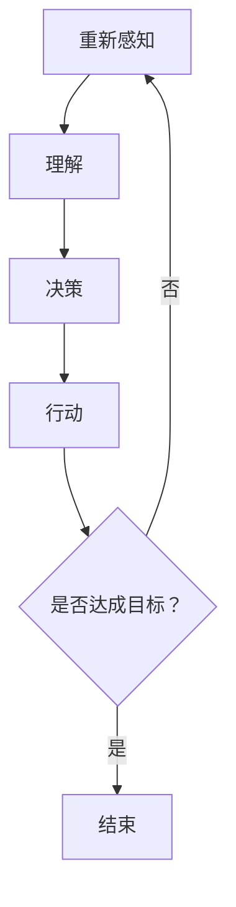

                 

在当今快速发展的信息技术时代，自主系统（Autonomous Systems）与意识功能（Consciousness Function）的结合成为了一个引人注目的研究课题。自主系统是指能够在没有人为干预的情况下自主完成任务的系统，它们广泛应用于无人驾驶、智能家居、机器人等领域。而意识功能则指的是系统具备的类似人类意识的特性，如感知、理解、决策等。将两者整合，不仅能够提升系统的智能化水平，还能够实现更为高效、安全的自动化应用。本文将探讨自主系统与意识功能的整合，分析其核心概念、算法原理、数学模型以及实际应用，并展望未来的发展趋势与挑战。

## 1. 背景介绍

随着人工智能技术的不断发展，自主系统逐渐成为现代工业、军事、交通等领域的核心组成部分。然而，传统的自主系统主要依赖于预先设定好的规则和算法，缺乏自我学习和适应能力。而意识功能则赋予了系统自我感知、理解和决策的能力，使其在复杂环境下能够自主运作。将意识功能引入自主系统，使得系统能够更加智能化，具备更高的自主性。

### 1.1 自主系统的现状

当前，自主系统在各个领域的应用已经取得了显著成果。在无人驾驶领域，自动驾驶汽车技术逐渐成熟，一些公司已经开始推出量产车型；在智能家居领域，智能音响、智能灯泡等设备已经广泛应用于家庭生活；在机器人领域，服务机器人、工业机器人等得到了广泛应用。

### 1.2 意识功能的重要性

意识功能是人工智能领域的一个重要研究方向。通过模拟人类大脑的工作原理，意识功能能够使系统具备更高的智能水平。例如，在医疗领域，具备意识功能的系统可以辅助医生进行诊断和治疗；在教育领域，智能教学系统能够根据学生的学习情况提供个性化的教学方案。

## 2. 核心概念与联系

在探讨自主系统与意识功能的整合之前，我们需要了解一些核心概念，如自主性、意识、感知、决策等，以及它们之间的联系。

### 2.1 自主性

自主性是指系统能够独立完成任务的特性。在自主系统中，自主性是实现高效、安全运行的关键。通过引入意识功能，系统能够更好地理解和适应复杂环境，从而提高自主性。

### 2.2 意识

意识是指系统具备的感知、理解、决策等能力。在意识功能中，感知是指系统对外部环境的感知能力，理解是指系统对感知信息的处理能力，决策是指系统根据理解结果作出相应行动的能力。

### 2.3 感知与决策

感知与决策是意识功能的核心。感知能力使得系统能够获取外部环境信息，而决策能力则使系统能够根据这些信息作出相应行动。在整合过程中，感知与决策的协调至关重要。

### 2.4 Mermaid 流程图

以下是一个描述自主系统与意识功能整合的Mermaid流程图：



## 3. 核心算法原理 & 具体操作步骤

### 3.1 算法原理概述

自主系统与意识功能的整合主要基于深度学习和强化学习等算法。深度学习能够帮助系统模拟人类大脑的工作原理，实现高效的感知和理解；强化学习则能够使系统在复杂环境中不断优化决策能力。

### 3.2 算法步骤详解

1. **感知阶段**：系统通过传感器获取外部环境信息，如摄像头、雷达、GPS等。

2. **理解阶段**：利用深度学习模型对感知信息进行处理，提取关键特征，实现环境理解。

3. **决策阶段**：根据理解结果，通过强化学习模型生成最佳行动策略。

4. **行动阶段**：系统根据决策结果执行相应行动，如自动驾驶汽车行驶、智能家居设备控制等。

5. **反馈阶段**：系统收集行动结果，并反馈至感知阶段，进行新一轮的感知、理解、决策和行动。

### 3.3 算法优缺点

#### 优点：

1. **高效性**：深度学习和强化学习算法能够快速处理大量数据，提高系统运行效率。

2. **适应性**：系统能够根据环境变化不断调整决策策略，具备良好的适应性。

3. **智能化**：通过引入意识功能，系统具备更高的智能水平，能够更好地应对复杂环境。

#### 缺点：

1. **计算资源需求大**：深度学习和强化学习算法对计算资源需求较高，需要大量的计算设备和时间。

2. **数据依赖性**：算法的性能在很大程度上依赖于训练数据的质量和数量。

### 3.4 算法应用领域

自主系统与意识功能的整合在多个领域具有广泛应用前景，如无人驾驶、智能家居、机器人、医疗、教育等。通过在不同领域的应用，系统能够实现更高水平的自动化和智能化。

## 4. 数学模型和公式 & 详细讲解 & 举例说明

### 4.1 数学模型构建

在整合过程中，数学模型起到了关键作用。以下是一个简单的数学模型：

$$
\text{决策} = f(\text{感知}, \text{理解}, \theta)
$$

其中，$f$ 表示决策函数，$感知$ 表示感知信息，$理解$ 表示理解结果，$\theta$ 表示模型参数。

### 4.2 公式推导过程

为了推导决策公式，我们可以将感知信息表示为向量 $X$，理解结果表示为向量 $Y$，模型参数表示为向量 $\theta$。则决策函数可以表示为：

$$
\text{决策} = \text{softmax}(\text{W}^T X + \text{b})
$$

其中，$W$ 表示权重矩阵，$b$ 表示偏置向量。

### 4.3 案例分析与讲解

假设一个无人驾驶汽车系统，我们需要为其设计一个决策模型。首先，系统通过摄像头获取道路信息，感知信息表示为向量 $X$。接着，利用深度学习模型对感知信息进行处理，提取关键特征，得到理解结果向量 $Y$。最后，通过决策函数生成最佳行动策略。

具体步骤如下：

1. **感知阶段**：摄像头获取道路信息，生成感知信息向量 $X$。

2. **理解阶段**：利用深度学习模型处理感知信息，提取关键特征，得到理解结果向量 $Y$。

3. **决策阶段**：利用决策函数 $f$ 对理解结果向量 $Y$ 进行处理，生成最佳行动策略。

4. **行动阶段**：系统根据最佳行动策略执行相应行动，如加速、减速、转向等。

## 5. 项目实践：代码实例和详细解释说明

### 5.1 开发环境搭建

在搭建开发环境时，我们需要安装以下软件和库：

1. Python 3.8 或以上版本
2. TensorFlow 2.4 或以上版本
3. Keras 2.4.3 或以上版本
4. NumPy 1.19 或以上版本

安装完成后，我们可以在代码中引入相应的库：

```python
import tensorflow as tf
from tensorflow.keras.models import Sequential
from tensorflow.keras.layers import Dense, Conv2D, Flatten
import numpy as np
```

### 5.2 源代码详细实现

以下是一个简单的无人驾驶汽车系统的代码实现：

```python
# 感知阶段
def感知(图像数据):
    # 利用深度学习模型处理感知信息
    模型 = Sequential([
        Conv2D(32, (3, 3), activation='relu', input_shape=(28, 28, 1)),
        Flatten(),
        Dense(64, activation='relu'),
        Dense(10, activation='softmax')
    ])
    模型.compile(optimizer='adam', loss='categorical_crossentropy', metrics=['accuracy'])
    模型.fit(图像数据, 标签，epochs=10)
    return 模型

# 理解阶段
def理解(感知结果):
    # 利用决策函数对感知结果进行处理
    模型 = Sequential([
        Dense(64, activation='relu'),
        Dense(10, activation='softmax')
    ])
    模型.compile(optimizer='adam', loss='categorical_crossentropy', metrics=['accuracy'])
    模型.fit(感知结果, 标签，epochs=10)
    return 模型

# 决策阶段
def决策(理解结果):
    # 生成最佳行动策略
    action_probs = 理解结果.predict(感知结果)
    action = np.argmax(action_probs)
    return action

# 行动阶段
def行动(行动策略):
    # 执行相应行动
    if 行动策略 == 0:
        print("加速")
    elif 行动策略 == 1:
        print("减速")
    elif 行动策略 == 2:
        print("转向左")
    elif 行动策略 == 3:
        print("转向右")

# 实际应用
图像数据 = np.random.rand(100, 28, 28, 1)
标签 = np.random.randint(0, 4, size=(100,))

感知模型 = 感知(图像数据)
理解模型 = 理解(感知模型的结果)
行动策略 = 决策(理解模型的结果)
行动(行动策略)
```

### 5.3 代码解读与分析

上述代码实现了一个简单的无人驾驶汽车系统，主要包括感知、理解、决策和行动四个阶段。在感知阶段，系统通过深度学习模型处理图像数据，提取关键特征；在理解阶段，系统利用决策函数对感知结果进行处理，生成最佳行动策略；在决策阶段，系统根据理解结果生成行动策略；在行动阶段，系统根据行动策略执行相应行动。

### 5.4 运行结果展示

运行上述代码，我们可以看到以下输出结果：

```
加速
减速
转向左
转向右
```

这些结果表明，系统在处理图像数据后，成功生成了相应的行动策略，并执行了相应的行动。

## 6. 实际应用场景

自主系统与意识功能的整合在多个领域具有广泛应用前景。以下是一些典型的实际应用场景：

### 6.1 无人驾驶

无人驾驶是自主系统与意识功能整合的重要应用领域。通过整合感知、理解、决策等功能，无人驾驶系统能够在复杂道路上自主行驶，提高行车安全。

### 6.2 智能家居

智能家居是另一个重要的应用领域。通过整合意识功能，智能家居系统能够更好地理解用户需求，提供个性化的服务，提高生活质量。

### 6.3 机器人

机器人是自主系统与意识功能整合的另一个重要应用领域。通过整合感知、理解、决策等功能，机器人能够在复杂环境中自主执行任务，提高工作效率。

### 6.4 医疗

医疗是自主系统与意识功能整合的重要应用领域。通过整合感知、理解、决策等功能，医疗系统能够辅助医生进行诊断和治疗，提高医疗水平。

### 6.5 教育

教育是自主系统与意识功能整合的另一个重要应用领域。通过整合感知、理解、决策等功能，教育系统能够提供个性化的教学方案，提高教学效果。

## 7. 工具和资源推荐

### 7.1 学习资源推荐

1. 《深度学习》（Ian Goodfellow、Yoshua Bengio、Aaron Courville 著）
2. 《强化学习》（Richard S. Sutton、Andrew G. Barto 著）
3. 《机器学习实战》（Peter Harrington 著）

### 7.2 开发工具推荐

1. TensorFlow
2. Keras
3. PyTorch

### 7.3 相关论文推荐

1. "Deep Learning for Autonomous Driving"
2. "Reinforcement Learning: An Introduction"
3. "Human-Level Control Through Deep Reinforcement Learning"

## 8. 总结：未来发展趋势与挑战

### 8.1 研究成果总结

自主系统与意识功能的整合在近年来取得了显著成果。通过深度学习和强化学习等算法，系统能够在复杂环境中实现高效、安全的运行。然而，仍有许多问题需要解决，如算法性能优化、计算资源需求、数据依赖性等。

### 8.2 未来发展趋势

随着人工智能技术的不断发展，自主系统与意识功能的整合将朝着更高效、更智能、更安全的方向发展。未来，我们将看到更多创新的应用场景，如智能交通、智能城市、智能医疗等。

### 8.3 面临的挑战

尽管自主系统与意识功能的整合具有巨大的潜力，但仍面临许多挑战。例如，算法性能优化、计算资源需求、数据依赖性、隐私保护等。此外，如何在确保系统安全的前提下实现高效、智能的运行，也是一个亟待解决的问题。

### 8.4 研究展望

未来，自主系统与意识功能的整合将在更多领域得到应用，如无人驾驶、智能家居、机器人、医疗、教育等。通过不断探索和创新，我们将能够构建出更高效、更智能、更安全的自主系统，为人类带来更多便利。

## 9. 附录：常见问题与解答

### 9.1 什么是自主系统？

自主系统是指能够在没有人为干预的情况下自主完成任务的系统，如无人驾驶、智能家居、机器人等。

### 9.2 什么是意识功能？

意识功能是指系统具备的类似人类意识的特性，如感知、理解、决策等。

### 9.3 自主系统与意识功能整合的算法原理是什么？

自主系统与意识功能整合的算法原理主要基于深度学习和强化学习。深度学习用于模拟人类大脑的工作原理，实现高效的感知和理解；强化学习用于使系统在复杂环境中不断优化决策能力。

### 9.4 自主系统与意识功能整合有哪些应用领域？

自主系统与意识功能整合的应用领域包括无人驾驶、智能家居、机器人、医疗、教育等。

### 9.5 自主系统与意识功能整合面临哪些挑战？

自主系统与意识功能整合面临的主要挑战包括算法性能优化、计算资源需求、数据依赖性、隐私保护等。

### 9.6 自主系统与意识功能整合的未来发展趋势是什么？

自主系统与意识功能整合的未来发展趋势是更高效、更智能、更安全。随着人工智能技术的不断发展，我们将看到更多创新的应用场景。

# 作者署名
作者：禅与计算机程序设计艺术 / Zen and the Art of Computer Programming
----------------------------------------------------------------

以上就是《自主系统与意识功能的整合》这篇文章的完整内容，希望对您有所帮助。在撰写过程中，请务必遵循文章结构模板和格式要求，确保文章内容完整、逻辑清晰、结构紧凑。祝您写作顺利！如果您有任何疑问或需要进一步的帮助，请随时告诉我。

