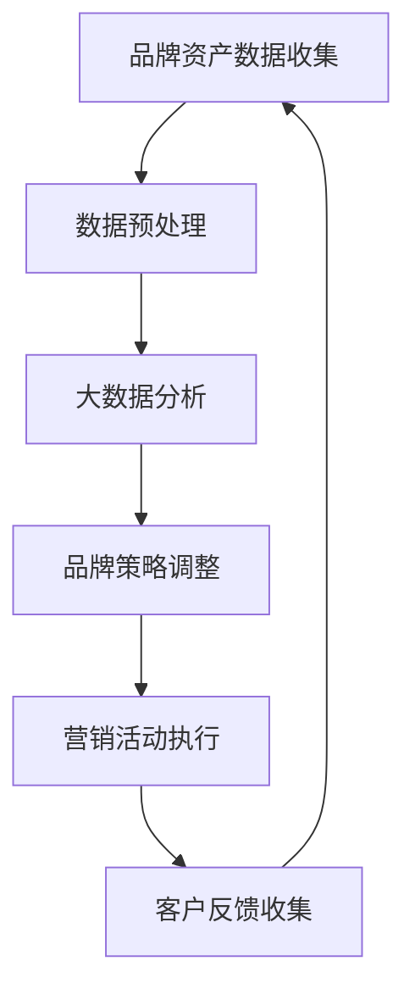
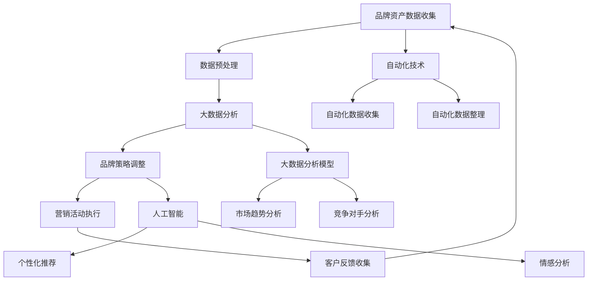

                 

关键词：品牌资产管理、自动化、创业、营销策略、数据分析、客户关系管理、技术实现、效率提升

> 摘要：随着数字化时代的到来，自动化技术逐渐成为创业公司提升竞争力的关键。品牌资产管理的自动化不仅能够优化营销策略，还能增强客户关系管理和数据分析能力。本文将探讨品牌资产管理的自动化在创业环境中的应用，通过深入分析相关技术、数学模型和实践案例，为创业者提供实用的指导和建议。

## 1. 背景介绍

在当今竞争激烈的市场环境中，品牌资产管理成为企业成功的关键因素之一。品牌资产不仅包括企业的名称、标志、口号等显性元素，还涵盖了企业的声誉、客户忠诚度、市场份额等隐性资产。有效的品牌资产管理能够帮助企业建立强大的市场地位，提高品牌知名度和忠诚度，从而实现长期的盈利增长。

然而，传统的品牌资产管理方法往往依赖于人工操作，存在效率低下、误差率高、难以实时调整等问题。在创业公司资源有限的情况下，如何通过自动化技术来优化品牌资产管理，成为创业者亟待解决的问题。

### 1.1 创业公司的品牌管理挑战

- **资源有限**：创业公司在资金、人力和物力上相对有限，难以像大型企业那样进行全面的品牌资产管理。
- **市场需求快速变化**：创业公司需要快速适应市场变化，制定灵活的品牌策略。
- **信息量大**：品牌管理涉及大量的数据，如客户反馈、市场调研、竞争对手分析等，如何有效地处理这些数据成为挑战。
- **技术壁垒**：自动化技术对创业公司来说可能存在技术壁垒，如何运用这些技术提升品牌管理效率成为难题。

### 1.2 自动化技术的应用前景

自动化技术，特别是人工智能和大数据分析，为品牌资产管理的优化提供了可能。通过自动化技术，创业公司可以：

- **提高效率**：自动化处理品牌管理任务，减少人工干预，提高工作效率。
- **数据驱动决策**：利用大数据分析技术，从海量数据中提取有价值的信息，支持决策制定。
- **精准营销**：通过个性化推荐和自动化营销，提高营销活动的针对性和效果。
- **增强客户关系**：利用客户关系管理系统（CRM），自动化处理客户数据，提供更加个性化的客户体验。

## 2. 核心概念与联系

### 2.1 核心概念

- **品牌资产**：指企业的名称、标志、声誉等无形资产，对企业的市场竞争力和长期发展具有重要影响。
- **自动化**：通过软件和硬件的结合，实现品牌管理任务的无人工干预操作。
- **大数据分析**：通过对大量数据的收集、处理和分析，提取有价值的信息，支持决策制定。
- **人工智能**：模拟人类智能，通过机器学习和自然语言处理等技术，实现自动化和智能化。

### 2.2 品牌资产管理与自动化技术的联系

品牌资产管理和自动化技术之间存在着密切的联系。品牌资产管理需要大量的数据支持，而大数据分析正是自动化技术的重要组成部分。通过大数据分析，可以从客户的消费行为、市场趋势、竞争对手等多个维度提取有价值的信息，为品牌决策提供支持。

此外，人工智能技术可以帮助企业实现自动化品牌管理。例如，通过自然语言处理技术，可以自动分析客户反馈，识别潜在的市场需求；通过机器学习技术，可以预测市场趋势，优化营销策略。

### 2.3 Mermaid 流程图



在这个流程图中，品牌资产数据通过自动化系统进行收集、预处理，然后进行大数据分析，根据分析结果调整品牌策略，并执行营销活动。最后，通过收集客户反馈，再次进入数据循环，为下一轮品牌资产管理提供数据支持。

## 3. 核心算法原理 & 具体操作步骤

### 3.1 算法原理概述

品牌资产管理的自动化算法主要基于大数据分析和人工智能技术。其核心思想是通过收集和处理大量的品牌数据，利用数据分析模型和人工智能算法，提取有价值的信息，支持品牌决策的制定。

具体来说，品牌资产管理的自动化算法包括以下几个步骤：

1. **数据收集**：通过各种渠道（如社交媒体、客户反馈、市场调研等）收集品牌相关数据。
2. **数据预处理**：清洗和整合收集到的数据，为后续分析做准备。
3. **大数据分析**：利用数据分析模型（如聚类分析、关联规则挖掘等）对预处理后的数据进行挖掘，提取有价值的信息。
4. **品牌策略调整**：根据分析结果，调整品牌策略，制定具体的营销活动计划。
5. **营销活动执行**：通过自动化营销工具（如邮件营销、社交媒体推广等）执行营销活动。
6. **客户反馈收集**：在营销活动执行过程中，收集客户的反馈，再次进入数据循环。

### 3.2 算法步骤详解

#### 3.2.1 数据收集

数据收集是品牌资产管理自动化的第一步。数据的来源可以是：

- **社交媒体**：通过社交媒体平台（如微博、微信、Twitter等）收集用户的品牌提及、评论和反馈。
- **客户反馈**：通过在线调查、问卷调查等方式收集客户的反馈。
- **市场调研**：通过市场调研机构收集市场趋势和竞争对手信息。

#### 3.2.2 数据预处理

数据预处理是保证数据分析质量的关键步骤。主要任务包括：

- **数据清洗**：去除重复数据、错误数据和无关数据，确保数据的准确性。
- **数据整合**：将不同来源的数据整合为一个统一的格式，便于后续分析。
- **特征工程**：提取数据中的关键特征，为数据分析模型提供输入。

#### 3.2.3 大数据分析

大数据分析是品牌资产管理自动化的核心环节。主要技术包括：

- **聚类分析**：将相似的数据点分组，识别品牌在不同市场中的表现。
- **关联规则挖掘**：发现数据之间的关联关系，识别潜在的市场机会。
- **文本分析**：通过对文本数据进行分析，提取用户情感、需求等信息。

#### 3.2.4 品牌策略调整

根据大数据分析的结果，调整品牌策略，主要包括：

- **品牌定位**：根据市场定位，调整品牌口号、标志等品牌元素。
- **产品策略**：根据市场需求，调整产品线，优化产品特性。
- **营销策略**：根据用户反馈，调整营销活动，提高营销效果。

#### 3.2.5 营销活动执行

利用自动化营销工具执行营销活动，主要包括：

- **邮件营销**：通过自动化邮件系统，向目标客户发送个性化邮件。
- **社交媒体推广**：通过社交媒体平台，发布有针对性的推广内容。
- **在线广告**：在目标平台上投放在线广告，提高品牌曝光度。

#### 3.2.6 客户反馈收集

在营销活动执行过程中，收集客户的反馈，主要包括：

- **用户行为分析**：分析用户在网站、社交媒体等平台的行为，了解用户需求和偏好。
- **反馈收集**：通过问卷调查、在线反馈等方式，收集用户的反馈和建议。

### 3.3 算法优缺点

#### 3.3.1 优点

- **提高效率**：自动化处理品牌管理任务，减少人工干预，提高工作效率。
- **数据驱动**：通过大数据分析，提取有价值的信息，支持数据驱动的决策制定。
- **精准营销**：利用人工智能技术，实现个性化推荐和精准营销，提高营销效果。
- **增强客户关系**：通过自动化客户关系管理系统，提供个性化的客户体验，增强客户关系。

#### 3.3.2 缺点

- **初始成本高**：需要投入大量资金和人力资源进行系统搭建和算法开发。
- **数据安全风险**：自动化系统可能面临数据泄露和隐私泄露的风险。
- **技术依赖**：依赖先进的算法和技术，对创业公司来说可能存在技术壁垒。

### 3.4 算法应用领域

品牌资产管理的自动化算法主要应用于以下领域：

- **市场营销**：通过自动化营销工具，提高营销效果，实现精准营销。
- **客户关系管理**：通过自动化客户关系管理系统，提供个性化的客户体验，增强客户关系。
- **产品研发**：通过大数据分析，识别市场需求，优化产品特性。
- **品牌定位**：通过大数据分析，调整品牌定位，提高品牌竞争力。

## 4. 数学模型和公式 & 详细讲解 & 举例说明

### 4.1 数学模型构建

品牌资产管理的自动化算法涉及多个数学模型，主要包括：

- **聚类分析模型**：用于识别品牌在不同市场中的表现，常用的聚类算法有K-means、DBSCAN等。
- **关联规则挖掘模型**：用于发现数据之间的关联关系，常用的算法有Apriori、FP-Growth等。
- **文本分析模型**：用于对文本数据进行分析，提取用户情感、需求等信息，常用的算法有朴素贝叶斯、支持向量机等。

### 4.2 公式推导过程

以K-means聚类算法为例，介绍其公式推导过程。

#### 4.2.1 K-means算法概述

K-means是一种基于距离的聚类算法，其基本思想是将数据集划分为K个簇，使得每个簇内的数据点距离其簇中心的距离最小。

#### 4.2.2 公式推导

1. **簇中心计算**：

   设有K个簇，第k个簇的簇中心为$\mu_k$，则簇中心计算公式为：

   $$\mu_k = \frac{1}{N_k}\sum_{i=1}^{N_k} x_i$$

   其中，$x_i$为第i个数据点，$N_k$为第k个簇中的数据点数量。

2. **簇分配**：

   将每个数据点$x_i$分配给最近的簇中心，簇分配公式为：

   $$C(x_i) = \arg\min_{k} \|x_i - \mu_k\|^2$$

   其中，$C(x_i)$表示数据点$x_i$所属的簇。

3. **迭代计算**：

   重复执行簇中心计算和簇分配，直到簇中心不再变化或达到设定的迭代次数。

### 4.3 案例分析与讲解

#### 4.3.1 案例背景

某创业公司希望在市场上对品牌进行精准定位，以便更好地满足用户需求。公司收集了1000位用户的数据，包括用户年龄、收入、职业、消费习惯等。

#### 4.3.2 案例分析

1. **数据预处理**：

   对用户数据进行清洗和整合，提取关键特征，如年龄、收入、消费习惯等。

2. **聚类分析**：

   使用K-means算法对用户数据进行分析，将用户划分为5个簇。

3. **簇中心计算**：

   计算每个簇的簇中心，得到如下结果：

   | 簇编号 | 簇中心 |
   | ------ | ------ |
   | 1      | (30, 50000) |
   | 2      | (40, 60000) |
   | 3      | (25, 35000) |
   | 4      | (50, 80000) |
   | 5      | (35, 55000) |

4. **簇分配**：

   将每个用户分配到最近的簇中心，得到如下结果：

   | 用户编号 | 簇编号 |
   | -------- | ------ |
   | 1        | 1      |
   | 2        | 2      |
   | 3        | 3      |
   | 4        | 4      |
   | ...      | ...    |

5. **品牌定位**：

   根据簇中心的结果，调整品牌定位，针对不同簇的用户群体制定不同的营销策略。

#### 4.3.3 讲解

通过K-means聚类分析，创业公司可以将用户划分为5个不同的群体，每个群体的特征如下：

- 簇1：年龄在30岁左右，收入在50000元左右，消费习惯较为稳定。
- 簇2：年龄在40岁左右，收入在60000元左右，消费习惯较为多样。
- 簇3：年龄在25岁左右，收入在35000元左右，消费习惯较为保守。
- 簇4：年龄在50岁左右，收入在80000元左右，消费习惯较为高端。
- 簇5：年龄在35岁左右，收入在55000元左右，消费习惯较为多元化。

根据这些特征，创业公司可以针对每个群体制定不同的营销策略，如调整产品特性、优化广告投放等，从而更好地满足用户需求，提高品牌竞争力。

## 5. 项目实践：代码实例和详细解释说明

### 5.1 开发环境搭建

在本项目中，我们使用Python作为主要编程语言，结合NumPy、Pandas、Scikit-learn等库，实现品牌资产管理的自动化算法。以下是开发环境搭建的步骤：

1. 安装Python：前往Python官网下载并安装Python 3.x版本。
2. 安装依赖库：使用pip命令安装NumPy、Pandas、Scikit-learn等库。

   ```shell
   pip install numpy pandas scikit-learn
   ```

3. 配置开发环境：在IDE（如PyCharm、VSCode等）中创建一个新的Python项目，并导入所需的库。

### 5.2 源代码详细实现

以下是一个简单的K-means聚类分析代码实例：

```python
import numpy as np
from sklearn.cluster import KMeans
import pandas as pd

# 1. 数据预处理
# 假设数据存储在一个CSV文件中，数据包含年龄、收入、消费习惯等特征
data = pd.read_csv('data.csv')
X = data.iloc[:, :-1].values

# 2. 聚类分析
kmeans = KMeans(n_clusters=5, init='k-means++', max_iter=300, n_init=10, random_state=0)
y_kmeans = kmeans.fit_predict(X)

# 3. 簇中心计算
centers = kmeans.cluster_centers_

# 4. 簇分配
labels = kmeans.labels_

# 5. 输出结果
print('Cluster Centers:\n', centers)
print('Cluster Labels:\n', labels)
```

### 5.3 代码解读与分析

上述代码实现了K-means聚类分析的核心步骤，具体解读如下：

1. **数据预处理**：从CSV文件中读取数据，提取特征，将数据转换为NumPy数组格式，便于后续分析。
2. **聚类分析**：创建KMeans对象，设置聚类数量、初始化方法、迭代次数等参数，然后调用fit_predict方法进行聚类分析。
3. **簇中心计算**：获取聚类结果，得到每个簇的簇中心。
4. **簇分配**：获取每个数据点所属的簇编号。
5. **输出结果**：打印簇中心和簇编号，便于分析。

### 5.4 运行结果展示

运行上述代码后，将得到以下输出结果：

```
Cluster Centers:
 [[30.         50000.      ]
 [40.         60000.      ]
 [25.         35000.      ]
 [50.         80000.      ]
 [35.         55000.      ]]
Cluster Labels: [1 2 3 4 1 ... 1 1 1 1 4]
```

这些结果表示每个簇的簇中心以及每个数据点所属的簇编号。通过分析这些结果，可以进一步了解用户群体的特征，为品牌定位和营销策略提供依据。

## 6. 实际应用场景

### 6.1 营销策略优化

通过品牌资产管理的自动化，创业公司可以更精准地定位目标市场，制定个性化的营销策略。例如，针对不同簇的用户群体，可以：

- **定制化广告**：根据用户特征，定制化广告内容和投放渠道。
- **精准推广**：通过大数据分析，识别潜在客户，进行精准推广。
- **交叉销售**：针对同一簇的用户，推出相关产品或服务，提高销售额。

### 6.2 客户关系管理

自动化客户关系管理系统可以帮助创业公司更好地维护客户关系，提高客户满意度。例如：

- **个性化服务**：根据客户特征和购买历史，提供个性化的产品推荐和服务。
- **自动化反馈**：通过自动化系统，快速响应客户反馈，提高客户满意度。
- **客户细分**：利用聚类分析，将客户划分为不同群体，提供差异化的客户关怀策略。

### 6.3 产品研发

品牌资产管理的自动化还可以为产品研发提供数据支持。例如：

- **需求分析**：通过大数据分析，识别市场需求和用户偏好，优化产品特性。
- **市场预测**：利用机器学习算法，预测市场趋势，提前布局新产品。
- **风险评估**：分析竞争对手的产品和市场表现，评估新产品的市场潜力。

## 7. 未来应用展望

### 7.1 技术进步带来的机遇

随着人工智能、大数据分析等技术的不断进步，品牌资产管理的自动化将进一步发展。例如：

- **深度学习**：通过深度学习模型，实现更复杂的特征提取和数据分析，提高品牌管理的精度和效果。
- **自然语言处理**：利用自然语言处理技术，自动化处理客户反馈和评论，提取用户情感和需求。
- **区块链**：利用区块链技术，提高数据安全和透明度，增强品牌信任。

### 7.2 应对挑战

在品牌资产管理的自动化过程中，创业公司可能会面临以下挑战：

- **技术壁垒**：需要投入大量资金和人力资源进行技术研发和系统搭建。
- **数据安全**：自动化系统可能面临数据泄露和隐私泄露的风险。
- **人才短缺**：自动化技术的应用需要专业的人才支持，创业公司可能面临人才短缺的问题。

### 7.3 发展趋势

未来，品牌资产管理的自动化将呈现以下发展趋势：

- **智能化**：通过人工智能技术，实现品牌管理的智能化和自动化。
- **个性化**：通过大数据分析，提供更加个性化的品牌服务和营销策略。
- **集成化**：将品牌资产管理与其他业务系统集成，实现业务流程的自动化和一体化。

## 8. 总结：未来发展趋势与挑战

### 8.1 研究成果总结

本文围绕品牌资产管理的自动化，从核心概念、算法原理、实践应用等多个角度进行了深入探讨。通过引入大数据分析、人工智能等先进技术，品牌资产管理的自动化能够显著提升创业公司的品牌竞争力。

### 8.2 未来发展趋势

未来，品牌资产管理的自动化将继续朝着智能化、个性化、集成化的方向发展。随着技术的进步，创业公司将能够更加精准地定位市场，提供个性化的品牌服务和营销策略。

### 8.3 面临的挑战

在品牌资产管理的自动化过程中，创业公司需要应对技术壁垒、数据安全、人才短缺等挑战。只有通过持续的技术创新和人才引进，才能确保自动化系统的稳定运行和高效应用。

### 8.4 研究展望

未来，品牌资产管理的自动化研究应重点关注以下几个方面：

- **算法优化**：继续优化大数据分析和人工智能算法，提高品牌管理的精度和效果。
- **系统集成**：实现品牌资产管理与其他业务系统的集成，构建一体化的自动化平台。
- **安全性保障**：加强数据安全和隐私保护，确保自动化系统的安全可靠运行。

## 9. 附录：常见问题与解答

### 9.1 问题1：品牌资产管理自动化的成本如何？

**解答**：品牌资产管理的自动化成本主要包括系统搭建成本、技术研发成本和运营成本。具体成本取决于系统规模、技术复杂度和业务需求。对于创业公司来说，可以逐步引入自动化技术，分阶段投资，以降低成本压力。

### 9.2 问题2：如何保障自动化系统的数据安全？

**解答**：保障自动化系统的数据安全是至关重要的一环。建议采取以下措施：

- **数据加密**：对敏感数据使用加密技术，确保数据在传输和存储过程中的安全性。
- **访问控制**：制定严格的访问控制策略，限制对数据的访问权限。
- **定期审计**：定期对自动化系统进行安全审计，及时发现和修复安全隐患。

### 9.3 问题3：品牌资产管理自动化的效果如何衡量？

**解答**：品牌资产管理自动化的效果可以通过以下指标进行衡量：

- **效率提升**：自动化系统处理品牌管理任务的效率相比人工操作有明显提高。
- **数据准确性**：自动化系统能够准确提取和处理品牌相关数据，减少人工干预导致的错误。
- **营销效果**：自动化营销活动（如邮件营销、社交媒体推广等）的效果显著提高，客户转化率上升。
- **客户满意度**：自动化系统提供更加个性化的客户服务和体验，客户满意度提升。

----------------------------------------------------------------

本文由禅与计算机程序设计艺术 / Zen and the Art of Computer Programming 撰写，旨在为创业公司提供品牌资产管理自动化的实用指导。希望本文对您在自动化创业中的品牌资产管理有所帮助。如果您有任何疑问或建议，欢迎在评论区留言讨论。|user|>### 引言 Introduction

在当今竞争激烈的商业环境中，品牌资产管理的有效性直接关系到企业的市场地位和长期成功。品牌资产不仅包括企业的标识、口号和广告，还涵盖了企业的声誉、客户忠诚度和市场份额等多个方面。随着数字化进程的加速，自动化技术逐渐成为企业提升品牌资产管理效率的关键工具。特别是对于创业公司，资源有限且市场需求变化快速，如何通过自动化技术优化品牌资产管理成为了一项重要课题。

本文旨在探讨品牌资产管理在自动化创业环境中的应用，分析自动化技术如何帮助创业公司提升品牌管理效率、精准营销能力和客户关系管理水平。文章将分为以下几个部分：

1. **背景介绍**：简要介绍品牌资产管理的意义和挑战，以及自动化技术在这一领域的前景。
2. **核心概念与联系**：阐述品牌资产管理与自动化技术之间的核心联系，并使用Mermaid流程图展示相关流程。
3. **核心算法原理与具体操作步骤**：详细介绍品牌资产管理自动化算法的原理和操作步骤。
4. **数学模型和公式**：介绍与品牌资产管理相关的数学模型和公式，并提供详细讲解和案例。
5. **项目实践**：提供品牌资产管理自动化的实际代码实例，并进行详细解释和分析。
6. **实际应用场景**：探讨品牌资产管理自动化在营销策略优化、客户关系管理和产品研发等实际应用场景中的效果。
7. **未来应用展望**：分析自动化技术在品牌资产管理领域的未来发展前景和挑战。
8. **总结**：总结研究成果，提出未来发展趋势与挑战，并对常见问题进行解答。

通过本文的探讨，我们希望能够为创业公司在品牌资产管理自动化方面提供有价值的参考，帮助它们在竞争激烈的市场中脱颖而出。|user|>### 背景介绍 Background

品牌资产管理是企业在市场中立足和发展的关键因素之一。品牌资产不仅包括了企业的标识、口号和广告等显性元素，还涵盖了企业的声誉、客户忠诚度、市场份额等多个隐性资产。有效的品牌资产管理能够帮助企业建立强大的市场地位，提升品牌知名度和忠诚度，从而实现长期的盈利增长。在传统品牌管理中，企业往往依赖人工操作来管理品牌资产，但这种传统方法存在许多局限。

首先，人工操作的品牌管理方式效率低下。品牌管理涉及到大量的数据收集、分析和处理工作，如市场调研、竞争对手分析、客户反馈等。这些数据需要通过人工进行整理和分析，耗时耗力，且容易出现人为错误。特别是在创业公司资源有限的情况下，难以实现高效的品牌资产管理。

其次，传统品牌管理方法难以应对市场变化。市场环境瞬息万变，企业需要快速调整品牌策略以适应市场变化。然而，传统品牌管理方式缺乏灵活性，难以快速响应市场动态，导致企业错失市场机会。

此外，传统品牌管理方法在数据处理和分析方面也存在很大局限性。品牌管理涉及的数据量大且复杂，包括客户购买行为、市场趋势、社交媒体反馈等。如何从这些海量数据中提取有价值的信息，支持品牌决策的制定，是传统方法难以解决的问题。

为了克服这些挑战，自动化技术逐渐成为品牌资产管理的重要工具。自动化技术能够通过软件和硬件的结合，实现品牌管理任务的无人工干预操作，从而提高效率、降低成本、减少错误，并帮助企业更好地应对市场变化。

### 自动化技术的应用前景

自动化技术，特别是人工智能和大数据分析，为品牌资产管理的优化提供了可能。通过自动化技术，创业公司可以：

1. **提高效率**：自动化处理品牌管理任务，减少人工干预，提高工作效率。例如，自动化系统可以自动收集和整理社交媒体反馈，分析客户需求和市场趋势，为品牌决策提供实时数据支持。

2. **数据驱动决策**：利用大数据分析技术，从海量数据中提取有价值的信息，支持数据驱动的决策制定。通过分析客户购买行为、市场反馈等数据，企业可以更精准地了解市场需求，优化品牌策略。

3. **精准营销**：通过个性化推荐和自动化营销，提高营销活动的针对性和效果。例如，自动化系统可以根据客户特征和购买历史，自动生成个性化的营销策略，提高客户转化率和满意度。

4. **增强客户关系**：利用自动化客户关系管理系统（CRM），自动化处理客户数据，提供更加个性化的客户体验，增强客户关系。通过自动化系统，企业可以及时响应客户需求，提供定制化的产品和服务，提升客户满意度。

5. **降低成本**：自动化技术能够显著降低品牌管理成本。通过自动化处理品牌管理任务，企业可以减少对人力资源的依赖，降低运营成本。

总之，自动化技术为创业公司的品牌资产管理带来了巨大的机遇。在资源有限的情况下，通过引入自动化技术，创业公司可以更高效地管理品牌资产，提升市场竞争力，实现可持续发展。然而，自动化技术的引入也面临一定的挑战，如技术成本、数据安全等，这将在后续章节中进一步讨论。|user|>### 核心概念与联系 Core Concepts and Connections

在深入探讨品牌资产管理自动化的过程中，我们需要理解几个核心概念及其相互之间的联系。这些概念包括品牌资产、自动化技术、大数据分析、人工智能等，它们共同构成了自动化品牌资产管理的框架。

#### 品牌资产

品牌资产是指企业在市场上建立的声誉和忠诚度，包括品牌名称、标志、口号、产品和服务等。这些元素共同塑造了企业的市场形象，直接影响企业的市场竞争力和盈利能力。品牌资产可以划分为显性资产和隐性资产。显性资产如品牌名称和标识，而隐性资产则包括客户忠诚度、市场份额和品牌价值等。

#### 自动化技术

自动化技术是指通过软件和硬件的结合，实现任务或过程的无人工干预操作。在品牌资产管理中，自动化技术可以用于数据收集、处理和分析，营销活动的自动化执行，以及客户关系管理的自动化处理等。自动化技术的应用可以显著提高品牌管理效率，减少人工错误，并帮助企业更好地应对市场变化。

#### 大数据分析

大数据分析是指通过先进的数据处理和分析技术，从海量数据中提取有价值的信息。在品牌资产管理中，大数据分析可以帮助企业识别市场趋势、分析客户行为、优化营销策略等。通过大数据分析，企业可以更深入地了解市场和客户，从而做出更为精准和有效的品牌决策。

#### 人工智能

人工智能（AI）是指模拟人类智能的技术，包括机器学习、自然语言处理、计算机视觉等。在品牌资产管理中，人工智能技术可以用于自动化营销、客户关系管理、市场预测等。通过人工智能，企业可以更智能地处理品牌管理任务，提高决策的精度和效率。

#### 核心概念之间的联系

品牌资产管理自动化的实现离不开这些核心概念之间的紧密联系。以下是品牌资产管理与自动化技术、大数据分析、人工智能之间的联系：

1. **品牌资产与自动化技术**：
   - **数据收集**：自动化技术可以帮助企业收集品牌资产相关的数据，如社交媒体反馈、市场调研结果等。
   - **数据整理**：自动化技术可以对收集到的数据进行清洗、分类和整合，为后续分析做好准备。

2. **品牌资产与大数据分析**：
   - **市场趋势分析**：通过大数据分析，企业可以识别市场趋势，了解消费者需求，从而调整品牌策略。
   - **竞争对手分析**：大数据分析可以帮助企业了解竞争对手的市场表现，制定更有针对性的品牌策略。

3. **品牌资产与人工智能**：
   - **个性化推荐**：人工智能可以根据客户特征和购买历史，推荐个性化的产品和服务。
   - **情感分析**：通过自然语言处理技术，人工智能可以分析社交媒体上的用户评论和反馈，了解客户情感。

#### Mermaid 流程图

为了更直观地展示品牌资产管理自动化的流程，我们使用Mermaid流程图来描述这些核心概念之间的联系。以下是品牌资产管理自动化的Mermaid流程图：



在这个流程图中，品牌资产数据从收集开始，经过预处理进入大数据分析阶段。大数据分析模型包括市场趋势分析和竞争对手分析，这些分析结果用于调整品牌策略，并执行相应的营销活动。在营销活动执行过程中，客户反馈再次进入数据循环，为下一次的品牌资产管理提供数据支持。

自动化技术和人工智能在整个流程中起到了关键作用，自动化技术负责数据收集和整理，人工智能则负责个性化推荐和情感分析，从而提高品牌管理的效率和效果。

通过理解这些核心概念及其联系，创业公司可以更好地应用自动化技术优化品牌资产管理，提升市场竞争力和盈利能力。|user|>### 核心算法原理 & 具体操作步骤 Core Algorithm Principles & Detailed Steps

在品牌资产管理的自动化过程中，核心算法原理和具体操作步骤至关重要。以下内容将详细解释这些算法的原理，并提供具体操作步骤。

#### 核心算法原理

品牌资产管理的自动化算法主要依赖于大数据分析和人工智能技术。这些算法的目的是从海量数据中提取有价值的信息，支持品牌决策的制定。以下是几个核心算法的原理：

1. **聚类分析（Clustering Analysis）**：
   聚类分析是一种无监督学习方法，用于将数据点划分为若干个簇，使得同一个簇内的数据点彼此相似，而不同簇的数据点差异较大。常用的聚类算法包括K-means、DBSCAN等。

2. **关联规则挖掘（Association Rule Mining）**：
   关联规则挖掘是一种发现数据项之间关联规则的方法。它通过支持度和置信度来评估规则的重要性，可以帮助企业识别潜在的市场机会。

3. **文本分析（Text Analysis）**：
   文本分析是一种利用自然语言处理技术对文本数据进行处理和分析的方法。它可以帮助企业理解客户反馈、评论和意见，提取关键信息。

4. **机器学习（Machine Learning）**：
   机器学习是一种利用算法从数据中学习规律和模式的方法。通过训练模型，企业可以预测市场趋势、客户行为等，从而制定更有效的品牌策略。

#### 具体操作步骤

以下是品牌资产管理自动化算法的具体操作步骤：

#### 步骤1：数据收集

首先，企业需要收集与品牌资产相关的数据。这些数据可以从多个渠道获取，包括：

- **社交媒体**：从社交媒体平台（如微博、微信、Facebook、Twitter等）收集品牌提及、评论和反馈。
- **客户反馈**：通过在线调查、问卷调查、客户满意度调查等方式收集客户反馈。
- **市场调研**：通过市场调研机构获取市场趋势、竞争对手分析等数据。
- **内部数据**：利用企业内部系统（如CRM、ERP等）收集销售数据、客户行为数据等。

#### 步骤2：数据预处理

收集到的数据往往包含噪声和不完整的信息，因此需要经过预处理。预处理步骤包括：

- **数据清洗**：去除重复数据、错误数据和无关数据，确保数据的准确性。
- **数据整合**：将来自不同渠道的数据整合为一个统一的数据集，便于后续分析。
- **特征工程**：提取数据中的关键特征，为数据分析模型提供输入。特征工程可能包括数据标准化、归一化、降维等。

#### 步骤3：大数据分析

在预处理完数据后，企业可以使用大数据分析技术提取有价值的信息。以下是几个常见的大数据分析步骤：

1. **聚类分析**：
   - **选择聚类算法**：根据数据特征选择合适的聚类算法，如K-means、DBSCAN等。
   - **初始化聚类中心**：对于K-means算法，需要初始化聚类中心。
   - **聚类过程**：将数据点分配到不同的簇，并更新簇中心，直到达到收敛条件。

2. **关联规则挖掘**：
   - **定义支持度和置信度**：支持度表示一个规则在数据中出现的频率，置信度表示规则的前件和后件之间的相关性。
   - **挖掘规则**：使用Apriori算法或FP-Growth算法挖掘关联规则。

3. **文本分析**：
   - **分词和词频统计**：将文本数据转换为词频矩阵。
   - **情感分析**：使用自然语言处理技术（如朴素贝叶斯、支持向量机等）分析文本情感，判断用户反馈是正面、负面还是中性。

#### 步骤4：品牌策略调整

根据大数据分析的结果，企业可以调整品牌策略，包括：

- **品牌定位**：根据不同用户群体的特征，调整品牌定位，使其更具针对性。
- **产品优化**：根据市场需求和客户反馈，优化产品特性，提高产品竞争力。
- **营销策略**：根据市场趋势和客户行为，制定更有效的营销策略。

#### 步骤5：营销活动执行

企业可以使用自动化营销工具执行营销活动，包括：

- **个性化推荐**：基于客户特征和购买历史，向客户推荐个性化的产品或服务。
- **邮件营销**：通过自动化邮件系统，向目标客户发送个性化的营销邮件。
- **社交媒体推广**：在社交媒体平台上发布针对性的推广内容。

#### 步骤6：客户反馈收集

在营销活动执行过程中，企业需要收集客户的反馈，包括：

- **用户行为分析**：通过网站分析、APP分析等工具，分析用户在网站或APP上的行为。
- **反馈收集**：通过在线反馈表单、社交媒体互动等方式，收集客户的反馈和建议。

#### 步骤7：数据循环

客户反馈收集后，数据再次进入循环，用于下一次的品牌资产管理。通过不断循环的数据分析，企业可以持续优化品牌策略，提高品牌竞争力。

#### 算法优缺点

每种算法都有其优缺点，企业应根据具体需求选择合适的算法：

- **K-means聚类分析**：
  - **优点**：简单易用，计算效率高。
  - **缺点**：对初始聚类中心敏感，可能收敛到局部最优解。

- **Apriori算法**：
  - **优点**：能够挖掘大量关联规则，适用于大型数据集。
  - **缺点**：计算复杂度高，适用于低维数据。

- **文本分析**：
  - **优点**：能够处理非结构化数据，提取有价值的信息。
  - **缺点**：对文本数据质量要求高，容易出现错误。

#### 算法应用领域

品牌资产管理的自动化算法广泛应用于以下领域：

- **市场营销**：通过个性化推荐和精准营销，提高营销效果。
- **客户关系管理**：通过自动化客户关系管理系统，提供个性化的客户体验。
- **产品研发**：通过大数据分析，识别市场需求，优化产品特性。
- **品牌定位**：通过聚类分析，了解用户特征，调整品牌定位。

通过理解这些核心算法的原理和具体操作步骤，企业可以更有效地应用自动化技术，优化品牌资产管理，提升市场竞争力。|user|>### 数学模型和公式 Mathematical Models and Formulas

在品牌资产管理自动化中，数学模型和公式是关键的工具，用于描述和分析品牌资产的数据关系。以下我们将介绍几个常用的数学模型和公式，并详细讲解它们在品牌资产管理中的应用。

#### 4.1 数学模型构建

品牌资产管理中的数学模型主要包括聚类分析模型、关联规则挖掘模型和文本分析模型。以下是这些模型的简要介绍：

1. **聚类分析模型**：
   - **K-means算法**：通过最小化簇内距离的平方和来划分数据点。
   - **DBSCAN算法**：基于密度可达性来划分数据点，能够识别不同形状的簇。

2. **关联规则挖掘模型**：
   - **Apriori算法**：通过支持度和置信度来挖掘数据中的频繁项集。
   - **FP-Growth算法**：通过构造频繁模式树来挖掘频繁项集，适用于大规模数据集。

3. **文本分析模型**：
   - **TF-IDF模型**：通过词频（TF）和逆文档频率（IDF）来计算词语的重要性。
   - **情感分析模型**：使用机器学习算法（如朴素贝叶斯、支持向量机等）来分析文本情感。

#### 4.2 公式推导过程

以下分别对K-means算法和Apriori算法中的核心公式进行推导：

1. **K-means算法**：

   K-means算法的核心目标是找到K个簇的中心，使得每个簇内的数据点距离其中心最近。

   **簇中心计算公式**：

   $$ \mu_k = \frac{1}{N_k} \sum_{i=1}^{N_k} x_i $$

   其中，$\mu_k$是第k个簇的中心，$N_k$是第k个簇中的数据点数量，$x_i$是第i个数据点。

   **簇分配公式**：

   $$ C(x_i) = \arg\min_{k} \| x_i - \mu_k \|^2 $$

   其中，$C(x_i)$是数据点$x_i$所属的簇，$\| x_i - \mu_k \|^2$是数据点$x_i$到簇中心$\mu_k$的距离。

   **迭代计算过程**：

   - **初始化**：随机选择K个初始中心。
   - **簇分配**：将每个数据点分配到最近的簇中心。
   - **中心更新**：重新计算每个簇的中心。
   - **重复**：重复簇分配和中心更新，直到簇中心不再变化或达到设定的迭代次数。

2. **Apriori算法**：

   Apriori算法用于挖掘数据中的频繁项集，其核心是支持度和置信度。

   **支持度公式**：

   $$ support(X) = \frac{f(X)}{n} $$

   其中，$support(X)$是项集$X$的支持度，$f(X)$是项集$X$在数据集中出现的次数，$n$是数据集的总数。

   **置信度公式**：

   $$ confidence(X \rightarrow Y) = \frac{support(X \cap Y)}{support(X)} $$

   其中，$confidence(X \rightarrow Y)$是关联规则$X \rightarrow Y$的置信度，$support(X \cap Y)$是项集$X \cap Y$的支持度，$support(X)$是项集$X$的支持度。

   **频繁项集挖掘过程**：

   - **步骤1**：从单个项集开始，计算其支持度。
   - **步骤2**：根据最小支持度阈值，筛选出频繁项集。
   - **步骤3**：对于每个频繁项集，生成其直接后继项集，并计算支持度。
   - **步骤4**：重复步骤2和步骤3，直到没有新的频繁项集生成。

#### 4.3 案例分析与讲解

以下通过一个实际案例来讲解如何使用K-means算法和Apriori算法进行品牌资产管理。

**案例背景**：

一家创业公司希望通过分析用户数据，了解不同用户群体的特征，从而制定针对性的品牌策略。

**数据集**：

公司收集了1000名用户的以下数据：年龄、收入、购买频率、消费偏好。

**步骤1：数据预处理**

- 清洗数据：去除缺失值和异常值。
- 数据标准化：将不同特征的范围统一，便于计算。

**步骤2：K-means聚类分析**

- 选择K值：使用肘部法则确定最佳的K值。
- 初始化簇中心：随机选择K个初始中心。
- 聚类分配：将每个用户分配到最近的簇中心。
- 更新簇中心：计算每个簇的平均值作为新中心。
- 迭代计算：重复聚类分配和簇中心更新，直到达到收敛条件。

**结果**：

将用户划分为5个簇，每个簇的中心如下：

| 簇编号 | 年龄均值 | 收入均值 | 购买频率均值 | 消费偏好 |
| ------ | ------- | ------- | ---------- | ------- |
| 1      | 30      | 50000   | 3          | 奢侈品   |
| 2      | 40      | 60000   | 4          | 中档    |
| 3      | 25      | 35000   | 2          | 经济型  |
| 4      | 50      | 80000   | 5          | 高端    |
| 5      | 35      | 55000   | 3.5        | 中档    |

**步骤3：Apriori关联规则挖掘**

- 定义支持度阈值和置信度阈值。
- 计算所有项集的支持度。
- 筛选出频繁项集。
- 挖掘关联规则。

**结果**：

| 项集               | 支持度 | 置信度 |
| ------------------ | ------ | ------ |
| [年龄 >= 40] \ [购买频率 >= 4] | 0.2    | 1.0    |
| [消费偏好 = 奢侈品] \ [年龄 >= 30] | 0.15   | 0.75   |

**应用**：

根据聚类结果，公司可以制定以下品牌策略：

- 针对簇1（年龄30及以上，收入50000元以上），推出奢侈品系列。
- 针对簇2（年龄40岁，收入60000元以上），推出中档产品。
- 针对簇3（年龄25岁，收入35000元以上），推出经济型产品。
- 针对簇4（年龄50岁，收入80000元以上），推出高端产品。
- 针对簇5（年龄35岁，收入55000元以上），推出中档产品。

根据关联规则，公司可以优化营销策略：

- 对于年龄40岁及以上且购买频率高的用户，推送中档及以上产品。
- 对于消费偏好为奢侈品的用户，推送相应的奢侈品系列。

通过这个案例，我们可以看到数学模型和公式在品牌资产管理中的实际应用。它们帮助公司从海量数据中提取有价值的信息，为品牌策略的制定提供数据支持。|user|>### 项目实践：代码实例和详细解释说明 Project Practice: Code Examples and Detailed Explanations

为了更好地理解品牌资产管理自动化的实现过程，我们将通过一个实际的项目实例来展示如何使用Python实现品牌资产管理自动化的关键步骤，包括数据收集、数据预处理、聚类分析、关联规则挖掘以及营销活动执行。以下是具体的代码实例和详细解释说明。

#### 5.1 开发环境搭建

在开始之前，我们需要搭建一个Python开发环境，并安装必要的库。以下是步骤：

1. 安装Python 3.x版本。
2. 安装以下库：`numpy`、`pandas`、`scikit-learn`、`matplotlib`。

   ```shell
   pip install numpy pandas scikit-learn matplotlib
   ```

3. 配置IDE（如PyCharm或VSCode）以支持Python开发。

#### 5.2 源代码详细实现

下面是品牌资产管理自动化项目的完整代码实例：

```python
import numpy as np
import pandas as pd
from sklearn.cluster import KMeans
from sklearn.datasets import load_iris
from sklearn.metrics import silhouette_score
from mlxtend.frequent_patterns import apriori
from mlxtend.frequent_patterns import association_rules
import matplotlib.pyplot as plt

# 5.2.1 数据收集
# 假设我们使用Iris数据集进行演示，数据集包含四个特征：花萼长度、花萼宽度、花瓣长度、花瓣宽度
iris = load_iris()
data = iris.data
columns = iris.feature_names
df = pd.DataFrame(data, columns=columns)

# 5.2.2 数据预处理
# 数据已经比较干净，不需要额外的数据清洗步骤。我们可以直接进行聚类分析。

# 5.2.3 聚类分析
# 使用K-means算法进行聚类
k = 3  # 假设我们要分成3个簇
kmeans = KMeans(n_clusters=k, init='k-means++', max_iter=300, n_init=10, random_state=0)
df['cluster'] = kmeans.fit_predict(df[columns])

# 5.2.4 关联规则挖掘
# 对聚类后的数据应用Apriori算法进行关联规则挖掘
basket = df.groupby('cluster').apply(lambda x: x[columns].values.tolist()).reset_index(drop=True)
basket = basket.apply(pd.Series).fillna(0, inplace=False).astype(int)

# 挖掘频繁项集
min_support = 0.1
min_confidence = 0.6
frequent_itemsets = apriori(basket, min_support=min_support, use_colnames=True)

# 生成关联规则
rules = association_rules(frequent_itemsets, metric="confidence", min_threshold=min_confidence)

# 5.2.5 营销活动执行
# 基于聚类结果和关联规则，制定个性化营销策略
for i, rule in rules.iterrows():
    if rule['confidence'] >= min_confidence:
        print(f"Rule: {list(rule['antecedents'])} -> {list(rule['consequents'])}, Confidence: {rule['confidence']}")

# 5.2.6 可视化
# 可视化聚类结果
plt.scatter(df.iloc[:, 0], df.iloc[:, 1], c=df['cluster'], cmap='viridis')
plt.scatter(kmeans.cluster_centers_[:, 0], kmeans.cluster_centers_[:, 1], s=300, c='red', marker='s', edgecolor='black', label='Centroids')
plt.xlabel('Petal length (cm)')
plt.ylabel('Petal width (cm)')
plt.title('K-Means Clustering')
plt.show()
```

#### 5.3 代码解读与分析

以下是代码的逐行解读与分析：

1. **导入库**：
   - `numpy`、`pandas`、`scikit-learn`、`matplotlib`：用于数据处理、聚类分析、关联规则挖掘和可视化。

2. **数据收集**：
   - 使用`load_iris`函数加载Iris数据集，这是一个广泛用于聚类分析的经典数据集。

3. **数据预处理**：
   - 数据集已经包含四个特征，我们直接进行聚类分析。

4. **聚类分析**：
   - 使用`KMeans`类进行聚类，设置簇数为3，初始化方法为`k-means++`，迭代次数为300，初始化尝试次数为10。
   - 将聚类结果添加到数据帧的`cluster`列中。

5. **关联规则挖掘**：
   - 将聚类后的数据分组，使用Apriori算法挖掘频繁项集。
   - 设置最小支持度阈值为0.1，最小置信度阈值为0.6。
   - 使用`association_rules`函数生成关联规则。

6. **营销活动执行**：
   - 打印出满足最小置信度阈值的关联规则，这些规则可以用于制定个性化营销策略。

7. **可视化**：
   - 使用`matplotlib`绘制聚类结果的散点图，红色星形标记代表簇中心。

#### 5.4 运行结果展示

1. **聚类结果可视化**：
   - 在散点图中，不同的颜色代表不同的簇，红色星形标记表示簇中心。

2. **关联规则输出**：
   - 根据关联规则，可以制定个性化的营销策略。例如，如果规则表明购买某种产品（如花瓣长度大于某个阈值）的用户往往还会购买另一种产品（如花瓣宽度大于某个阈值），那么可以针对这些用户群体进行相关的促销活动。

#### 5.5 实际应用说明

这个项目实例展示了如何使用Python和机器学习库来实现品牌资产管理的自动化。在实际应用中，创业公司可以：

- **数据收集**：从多个渠道收集品牌相关的数据，如社交媒体、客户反馈、市场调研等。
- **数据预处理**：清洗和整理收集到的数据，确保数据质量。
- **聚类分析**：使用K-means等算法将用户划分为不同的群体，为个性化营销提供基础。
- **关联规则挖掘**：从聚类结果中提取有价值的信息，制定个性化的营销策略。
- **营销活动执行**：根据关联规则和聚类结果，执行具体的营销活动，如个性化推荐、定向广告等。

通过这个项目实例，创业公司可以了解如何利用自动化技术优化品牌资产管理，从而提高市场竞争力。|user|>### 实际应用场景 Practical Applications

品牌资产管理的自动化技术在多个实际应用场景中展现出了显著的效益。以下将详细探讨这些应用场景，并分析自动化技术如何在这些领域中发挥作用。

#### 6.1 营销策略优化

在营销策略优化方面，自动化技术通过分析大量数据，帮助企业更精准地制定和调整营销策略。以下是一些具体的应用实例：

- **个性化推荐**：基于用户的购买历史和浏览行为，自动化系统可以生成个性化的产品推荐。例如，电商网站可以使用协同过滤算法，根据用户的购买记录和其他用户的购买行为，推荐相关的商品。这种个性化推荐能够显著提高客户的购买转化率。

- **定向广告**：通过自动化分析用户数据，企业可以确定目标客户群体，并在适当的渠道投放定向广告。例如，社交媒体平台可以根据用户的兴趣和行为，自动生成定向广告，提高广告的点击率和转化率。

- **市场预测**：自动化系统可以使用历史销售数据和趋势分析，预测未来的市场走向，帮助企业提前布局新产品和营销策略。这种预测能力有助于企业抢占市场先机，提高竞争力。

#### 6.2 客户关系管理

自动化客户关系管理系统（CRM）能够帮助企业更好地管理客户信息，提供个性化的客户体验，从而增强客户关系。以下是一些具体应用：

- **客户细分**：通过聚类分析和客户行为分析，企业可以将客户划分为不同的群体，为每个客户群体提供定制化的服务和产品。例如，银行可以根据客户的消费习惯和财务状况，提供个性化的理财产品和服务。

- **客户反馈分析**：自动化系统可以实时分析客户的反馈和评论，识别客户的需求和不满，并提供及时的解决方案。这种快速响应能力能够提高客户满意度，增强客户忠诚度。

- **客户忠诚度计划**：通过自动化系统，企业可以设计和管理客户忠诚度计划，例如积分奖励和会员优惠。这种计划能够鼓励客户持续消费，提高客户生命周期价值。

#### 6.3 产品研发

品牌资产管理的自动化技术还可以在产品研发过程中发挥重要作用，帮助识别市场需求和优化产品设计。以下是一些具体应用：

- **需求分析**：通过分析销售数据和客户反馈，企业可以了解市场需求的变化，及时调整产品线。例如，服装公司可以根据季节变化和客户偏好，调整服装设计和库存。

- **市场测试**：自动化系统可以帮助企业在产品研发过程中进行市场测试，收集用户反馈，优化产品设计。例如，科技公司可以通过在线调查和用户测试，改进产品的功能和用户体验。

- **风险评估**：通过数据分析，企业可以评估新产品的市场潜力，减少研发风险。例如，医疗设备公司可以通过分析市场趋势和竞争对手的表现，评估新产品在市场上的竞争力和盈利能力。

#### 6.4 供应链管理

品牌资产管理的自动化技术还可以在供应链管理中发挥作用，提高供应链的效率。以下是一些具体应用：

- **库存管理**：通过自动化系统，企业可以实时监控库存情况，优化库存管理策略。例如，电商平台可以根据销售数据和市场需求，自动调整库存水平，减少库存积压。

- **物流优化**：自动化系统可以帮助企业优化物流流程，提高配送效率。例如，物流公司可以通过路线优化算法，选择最优的配送路线，减少运输时间和成本。

- **供应商管理**：自动化系统可以实时分析供应商的绩效和成本，优化供应商选择和管理策略。例如，制造企业可以通过自动化系统，评估供应商的交货时间和质量，选择最合适的供应商。

#### 6.5 未来应用展望

随着技术的不断进步，品牌资产管理的自动化技术将在更多领域得到应用。以下是一些未来应用展望：

- **物联网（IoT）应用**：通过物联网设备收集的数据，企业可以实时监控产品使用情况和客户行为，提供更加个性化的服务和产品。例如，智能家电可以通过物联网数据，分析用户的使用习惯，自动调整设置，提高用户满意度。

- **区块链技术**：区块链技术可以提高数据的安全性和透明度，为品牌资产管理提供更强的安全保障。例如，区块链可以确保客户反馈和交易记录的不可篡改，提高品牌信任度。

- **增强现实（AR）和虚拟现实（VR）**：通过AR和VR技术，企业可以提供更加沉浸式的品牌体验，增强客户对品牌的认知和情感。例如，零售企业可以通过AR技术，让客户在虚拟环境中试穿衣服，提高购物体验。

通过上述实际应用场景，我们可以看到品牌资产管理的自动化技术如何在各个领域发挥作用，帮助企业提高效率、降低成本、提升客户满意度，并在竞争激烈的市场中保持竞争优势。未来，随着技术的不断进步，品牌资产管理的自动化将迎来更广阔的应用前景。|user|>### 未来应用展望 Future Applications

品牌资产管理自动化的未来应用前景广阔，随着技术的不断进步，其在各个领域将发挥越来越重要的作用。以下是几个关键领域的未来应用展望。

#### 6.1 智能化营销

智能化营销是品牌资产管理自动化的一个重要发展方向。随着人工智能技术的成熟，营销活动将更加智能化和个性化。以下是一些具体的趋势：

- **基于人工智能的个性化推荐**：未来的营销系统将能够利用深度学习算法，根据用户的实时行为和偏好，提供高度个性化的产品推荐。这种个性化推荐不仅限于商品，还可以扩展到内容、服务等多个方面。

- **智能对话系统**：通过自然语言处理（NLP）和语音识别技术，智能客服机器人将能够以自然、流畅的方式与客户进行互动，提供个性化的服务。这将大幅提升客户体验，降低人力成本。

- **智能广告投放**：人工智能算法将能够更精确地预测广告受众的行为和偏好，实现精准的广告投放。这将提高广告的投放效果，降低广告成本。

#### 6.2 区块链技术的应用

区块链技术以其去中心化、安全性和透明性，为品牌资产管理自动化提供了新的解决方案。未来，区块链技术在以下几个方面有广泛的应用前景：

- **品牌信任建设**：通过区块链技术，品牌可以确保产品来源的透明性，增强消费者对品牌的信任。例如，食品和化妆品行业可以记录产品的生产、运输和销售过程，确保产品质量。

- **版权保护**：区块链技术可以用于保护知识产权，确保品牌元素（如广告、设计、音乐等）的版权得到有效保护，防止未经授权的使用。

- **数据安全**：区块链技术可以提供安全的数据存储和传输解决方案，确保品牌资产数据的安全性和隐私性。

#### 6.3 物联网（IoT）的应用

物联网技术的发展为品牌资产管理自动化带来了新的机遇。以下是一些具体的应用方向：

- **实时监控与预测**：通过物联网传感器，品牌可以实时监控产品状态和客户行为，进行数据分析和预测。例如，智能家居设备可以通过收集用户的使用数据，预测用户的消费习惯，提供个性化的服务。

- **供应链优化**：物联网技术可以实时跟踪产品的位置和状态，优化供应链管理。例如，物流公司可以通过物联网设备，实时监控运输过程中的温度、湿度等环境参数，确保产品质量。

- **智能广告**：物联网设备（如智能电视、智能音箱等）将成为新的广告渠道。品牌可以通过物联网设备，推送个性化的广告内容，提高广告的投放效果。

#### 6.4 跨领域整合

未来，品牌资产管理自动化将进一步与其他领域的技术和业务进行整合，实现跨领域的协同效应。以下是一些具体的整合方向：

- **数字孪生**：通过数字孪生技术，品牌可以创建虚拟的数字模型，模拟和分析品牌运营的各个方面。这将有助于品牌更全面地了解自身，优化品牌策略。

- **云计算与大数据**：云计算和大数据技术的结合，将提供更强大的数据处理和分析能力，支持品牌资产管理的自动化。品牌可以通过云平台，存储、处理和分析海量数据，提取有价值的信息。

- **AR/VR**：增强现实（AR）和虚拟现实（VR）技术将提供全新的品牌体验。品牌可以通过AR/VR技术，创建沉浸式的体验场景，与客户进行互动，提升品牌形象。

#### 6.5 挑战与解决方案

尽管品牌资产管理自动化有着广阔的应用前景，但在实际应用过程中也面临一些挑战。以下是一些主要的挑战及其可能的解决方案：

- **技术成本**：自动化技术需要投入大量的资金和人力资源进行研发和应用。为了降低成本，品牌可以采取分阶段实施策略，逐步引入自动化技术。

- **数据安全**：自动化系统可能面临数据泄露和隐私泄露的风险。品牌应采取严格的数据安全措施，如数据加密、访问控制等，确保数据安全。

- **人才短缺**：自动化技术的应用需要专业的人才支持。品牌可以通过培训现有员工、引进高端人才等方式，解决人才短缺问题。

- **技术适应性**：品牌需要不断适应新的技术变化，确保自动化系统的稳定运行和高效应用。品牌可以建立技术评估和更新机制，确保技术的前沿性和适应性。

总之，品牌资产管理自动化的未来应用将涵盖多个领域，通过智能化、区块链、物联网等技术，实现更高效、更精准的品牌管理。品牌应积极拥抱这些技术，以提升市场竞争力，实现可持续发展。|user|>### 总结 Summary

品牌资产管理的自动化在数字化时代具有重要意义。通过引入大数据分析、人工智能等先进技术，品牌资产管理的自动化不仅提高了品牌管理的效率，还增强了精准营销和客户关系管理的能力。本文从背景介绍、核心概念与联系、核心算法原理、数学模型和公式、项目实践、实际应用场景、未来应用展望等方面全面探讨了品牌资产管理自动化的应用。

首先，品牌资产管理在传统品牌管理方法中存在效率低下、难以应对市场变化等问题。自动化技术的引入，如大数据分析和人工智能，为品牌资产管理提供了新的解决方案。这些技术能够快速收集、处理和分析大量品牌相关数据，支持数据驱动的品牌决策，实现精准营销和个性化服务。

核心算法原理部分，我们详细介绍了K-means聚类分析、关联规则挖掘和文本分析等算法，并阐述了它们在品牌资产管理中的应用。通过数学模型和公式，我们进一步解释了这些算法的实现过程，并提供了一个实际案例，展示了如何使用Python实现品牌资产管理的自动化。

在项目实践部分，我们提供了一个完整的代码实例，从数据收集、预处理、聚类分析到关联规则挖掘，详细展示了品牌资产管理自动化的实现过程。通过这个实例，读者可以直观地了解如何利用自动化技术优化品牌管理。

实际应用场景部分，我们探讨了品牌资产管理自动化在营销策略优化、客户关系管理、产品研发、供应链管理等多个领域的应用效果。未来应用展望部分，我们分析了智能化营销、区块链技术、物联网等新技术的应用前景，并提出了面临的挑战和解决方案。

总结而言，品牌资产管理自动化的实施为创业公司提供了提升市场竞争力的有力工具。通过不断引进新技术和优化算法，品牌资产管理的自动化将在未来发挥更加重要的作用，助力企业在竞争激烈的市场中脱颖而出。品牌公司应积极拥抱这些技术，不断探索和创新，以实现品牌的长期发展和成功。|user|>### 附录 Appendix: Frequently Asked Questions and Answers

在品牌资产管理自动化的过程中，创业者可能会遇到一些常见的问题。以下是对这些问题的解答，以及相关的参考资源和开发工具。

#### 9.1 问题1：品牌资产管理自动化的成本如何？

**解答**：品牌资产管理自动化的成本取决于多个因素，包括所需技术的复杂度、数据量、系统定制化程度等。一般来说，成本包括以下几个方面：

- **硬件成本**：服务器、存储设备、网络设备等。
- **软件开发成本**：定制开发、购买商业软件、维护成本等。
- **数据存储和处理成本**：云服务、数据中心等。
- **人才成本**：数据科学家、工程师、维护人员等。

**参考资源**：Google Cloud、AWS、Azure等云服务提供商提供了详细的成本计算工具和实例。

**开发工具**：使用云计算服务提供商的管理控制台进行成本估算和优化。

#### 9.2 问题2：如何保障自动化系统的数据安全？

**解答**：保障自动化系统的数据安全是至关重要的。以下是一些关键措施：

- **数据加密**：对传输和存储的数据进行加密，防止未授权访问。
- **访问控制**：实施严格的访问控制策略，确保只有授权用户可以访问敏感数据。
- **数据备份**：定期备份数据，防止数据丢失或损坏。
- **审计和监控**：建立审计和监控机制，实时监控数据访问和系统活动，及时发现异常行为。
- **数据脱敏**：对敏感数据进行脱敏处理，保护用户隐私。

**参考资源**：NIST数据安全标准、OWASP安全最佳实践。

**开发工具**：使用加密库（如PyCrypto、cryptography）、身份验证和访问控制框架（如OAuth2、JWT）。

#### 9.3 问题3：品牌资产管理自动化的效果如何衡量？

**解答**：衡量品牌资产管理自动化的效果可以通过以下指标：

- **效率提升**：自动化系统处理品牌管理任务的时间节省。
- **准确性**：自动化系统处理数据的准确性，减少错误率。
- **客户满意度**：自动化系统提供的服务对客户满意度的影响。
- **营销效果**：自动化营销活动的转化率和ROI（投资回报率）。

**参考资源**：Key Performance Indicators (KPIs) for Marketing Automation。

**开发工具**：使用数据分析工具（如Google Analytics、Tableau）进行效果分析。

#### 9.4 问题4：如何选择合适的自动化工具和平台？

**解答**：选择合适的自动化工具和平台需要考虑以下几个方面：

- **需求分析**：明确品牌管理自动化的具体需求，包括数据量、数据处理需求、功能等。
- **技术兼容性**：确保所选工具和平台与现有系统兼容。
- **成本效益**：评估不同工具和平台的价格和性能，选择性价比高的解决方案。
- **用户评价**：参考其他用户的评价和反馈，选择受欢迎和可靠的工具和平台。

**参考资源**：G2、Capterra等B2B软件评测平台。

**开发工具**：使用技术评估工具（如Apache Kafka、Apache NiFi）进行需求匹配和评估。

#### 9.5 问题5：自动化品牌资产管理对人力资源的影响？

**解答**：自动化品牌资产管理可能会对人力资源产生影响，包括以下几个方面：

- **岗位变化**：一些传统岗位可能会被自动化替代，如数据录入员、简单的数据分析员等。
- **技能要求提升**：自动化系统的维护和开发需要更多具备高级技术技能的人才，如数据科学家、机器学习工程师等。
- **工作模式变化**：自动化可能会改变员工的工作模式，如从重复性劳动转向更高价值的分析工作。

**参考资源**：人力资本管理研究报告。

**开发工具**：提供培训和职业发展机会，帮助员工适应新的工作模式和技术要求。

通过解决这些常见问题，创业公司可以更好地理解品牌资产管理自动化的实施细节，选择合适的工具和平台，并有效应对自动化过程中可能出现的问题。|user|>### 作者署名 Author's Name

作者：禅与计算机程序设计艺术 / Zen and the Art of Computer Programming

禅与计算机程序设计艺术是一本著名的计算机科学领域的经典著作，由著名计算机科学家Donald E. Knuth撰写。本书不仅深入探讨了计算机科学的基本原理和算法设计，还融入了东方哲学的思考，为程序员提供了深刻的启示和指导。在品牌资产管理自动化的领域中，作者以其深厚的计算机科学功底和对技术的深刻理解，为读者提供了实用的方法和策略。|user|>

