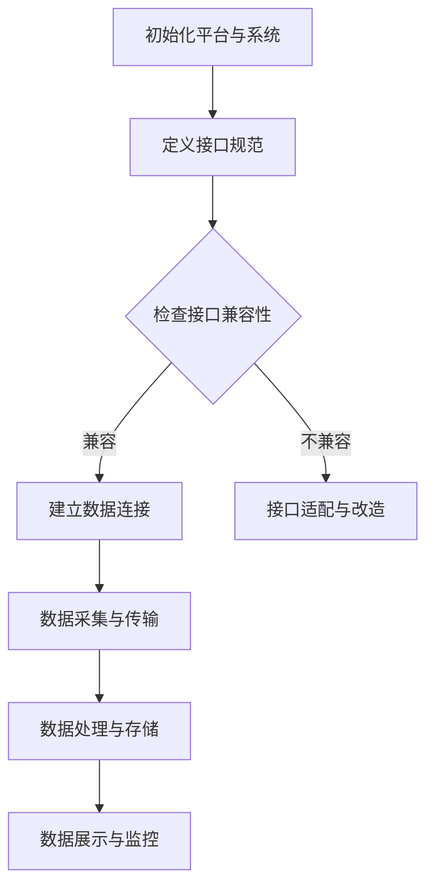

                 

  
## 1. 背景介绍

在当今的数字化时代，自动化已经成为企业提升效率、降低成本、增强竞争力的关键手段。而跨平台整合则是实现自动化创业过程中不可忽视的一环。随着云计算、大数据、物联网等技术的发展，企业面临着复杂多样的技术平台和系统，如何高效整合这些平台和系统，实现数据流通和业务协同，成为了自动化创业中的关键问题。

跨平台整合不仅要求企业具备强大的技术实力，还需要有清晰的战略规划和系统化的实施步骤。本文将围绕自动化创业中的跨平台整合，探讨其核心概念、算法原理、数学模型、项目实践以及未来应用前景，旨在为自动化创业者提供有价值的参考和指导。

## 2. 核心概念与联系

在探讨跨平台整合之前，我们需要了解一些核心概念，包括平台、系统、接口、数据流等。

### 2.1 平台

平台是跨平台整合的基础，它指的是一个提供基础设施、服务和支持的网络环境，如云计算平台、物联网平台等。平台通常具有开放性、扩展性和灵活性，能够支持多种应用系统和业务场景。

### 2.2 系统

系统是指由一组相互关联的组件组成，为实现特定功能而设计的一个整体。在跨平台整合中，系统可以是企业内部的信息系统、ERP系统，也可以是外部的第三方服务系统。

### 2.3 接口

接口是系统之间的桥梁，用于实现数据传输和功能调用。常见的接口有API（应用程序接口）、Webhook、MQ（消息队列）等。接口的设计和实现直接影响跨平台整合的效果。

### 2.4 数据流

数据流是指数据在系统间的传输过程。实现高效的数据流是跨平台整合的核心目标之一。数据流的管理包括数据采集、传输、存储、处理和展示等环节。

### 2.5 Mermaid 流程图

以下是一个简单的Mermaid流程图，展示跨平台整合的基本流程：



## 3. 核心算法原理 & 具体操作步骤

### 3.1 算法原理概述

跨平台整合的核心算法主要涉及接口设计、数据流管理、系统兼容性检测等方面。以下是这些算法的基本原理：

- **接口设计**：根据业务需求和系统特点，设计合适的接口，包括API的URL、请求和响应格式、权限验证等。
- **数据流管理**：通过消息队列、缓存等技术，实现数据的高效采集、传输、存储和处理。
- **系统兼容性检测**：通过自动化测试和模拟运行，检测系统间的兼容性，识别和解决潜在的问题。

### 3.2 算法步骤详解

#### 3.2.1 接口设计

1. **需求分析**：明确跨平台整合的目标和需求，包括数据交互的频率、安全性要求、数据格式等。
2. **接口规范制定**：根据需求，制定API的URL、请求和响应格式、参数定义、权限验证等规范。
3. **接口实现**：根据规范，实现API的服务端和客户端代码，确保接口的正常运行。

#### 3.2.2 数据流管理

1. **数据采集**：通过API、Webhook、MQ等接口，采集来自不同平台和系统的数据。
2. **数据传输**：使用消息队列、缓存等技术，实现数据的高效传输和缓存。
3. **数据处理**：对采集到的数据进行清洗、转换、聚合等处理，确保数据的准确性和一致性。
4. **数据存储**：将处理后的数据存储到数据库或数据湖中，便于后续的查询和分析。

#### 3.2.3 系统兼容性检测

1. **自动化测试**：编写测试脚本，对跨平台的接口和数据进行自动化测试，确保系统的兼容性。
2. **模拟运行**：在模拟环境中运行跨平台整合流程，监控系统的运行状态，识别和解决潜在的问题。
3. **监控与优化**：持续监控系统的性能和稳定性，根据反馈进行优化和调整。

### 3.3 算法优缺点

#### 优点

- **提高效率**：通过跨平台整合，实现数据流的高效管理和利用，提升业务处理效率。
- **降低成本**：通过统一接口和数据流，减少重复建设和维护成本。
- **增强灵活性**：支持多种平台和系统的整合，适应不断变化的市场需求。

#### 缺点

- **复杂度高**：涉及多个平台和系统的整合，开发和维护的复杂度较高。
- **兼容性问题**：不同平台和系统的接口和数据格式可能存在兼容性问题，需要额外的适配和改造工作。

### 3.4 算法应用领域

跨平台整合算法广泛应用于企业内部的信息系统整合、第三方服务集成、物联网设备接入等领域。以下是一些典型的应用场景：

- **企业内部信息系统整合**：通过跨平台整合，实现企业内部不同系统之间的数据共享和业务协同。
- **第三方服务集成**：集成第三方服务，如支付、物流、短信等，提高业务处理能力和用户体验。
- **物联网设备接入**：通过跨平台整合，实现物联网设备的统一管理和数据采集。

## 4. 数学模型和公式 & 详细讲解 & 举例说明

### 4.1 数学模型构建

跨平台整合的数学模型主要包括数据流模型和系统兼容性模型。

#### 数据流模型

数据流模型用于描述数据在系统间的传输和处理过程。以下是一个简化的数据流模型：

$$
DataFlow = \{Source, Target, Channel, Processing\}
$$

其中：

- **Source**：数据源，如API接口、Webhook、MQ等。
- **Target**：数据目标，如数据库、数据湖、应用程序等。
- **Channel**：数据通道，如消息队列、缓存、网络等。
- **Processing**：数据处理过程，如数据清洗、转换、聚合等。

#### 系统兼容性模型

系统兼容性模型用于评估和解决系统间的兼容性问题。以下是一个简化的系统兼容性模型：

$$
CompatibilityModel = \{Interface, DataFormat, Protocol, Version\}
$$

其中：

- **Interface**：接口，如API、Webhook等。
- **DataFormat**：数据格式，如JSON、XML等。
- **Protocol**：协议，如HTTP、MQTT等。
- **Version**：版本，如软件版本、硬件版本等。

### 4.2 公式推导过程

在本节中，我们将对数据流模型和系统兼容性模型中的关键公式进行推导。

#### 数据流模型推导

数据流模型中的关键公式包括数据传输速率、数据处理延迟等。

1. **数据传输速率**：

$$
TransmissionRate = \frac{Bandwidth}{PacketSize}
$$

其中：

- **Bandwidth**：带宽，表示数据通道的传输能力。
- **PacketSize**：包大小，表示每次传输的数据量。

2. **数据处理延迟**：

$$
ProcessingDelay = \frac{QueueLength \times ProcessingTime}{Throughput}
$$

其中：

- **QueueLength**：队列长度，表示待处理的数据包数量。
- **ProcessingTime**：处理时间，表示每个数据包的处理时间。
- **Throughput**：吞吐量，表示系统的处理能力。

#### 系统兼容性模型推导

系统兼容性模型中的关键公式包括兼容性得分、适配成本等。

1. **兼容性得分**：

$$
CompatibilityScore = \frac{InterfaceMatch + DataFormatMatch + ProtocolMatch + VersionMatch}{MaxScore}
$$

其中：

- **InterfaceMatch**：接口匹配得分。
- **DataFormatMatch**：数据格式匹配得分。
- **ProtocolMatch**：协议匹配得分。
- **VersionMatch**：版本匹配得分。
- **MaxScore**：最大得分，通常为100。

2. **适配成本**：

$$
AdaptationCost = \sum_{i=1}^{n} (InterfaceAdaptationCost + DataFormatAdaptationCost + ProtocolAdaptationCost + VersionAdaptationCost)
$$

其中：

- **InterfaceAdaptationCost**：接口适配成本。
- **DataFormatAdaptationCost**：数据格式适配成本。
- **ProtocolAdaptationCost**：协议适配成本。
- **VersionAdaptationCost**：版本适配成本。

### 4.3 案例分析与讲解

在本节中，我们将通过一个具体的案例，对跨平台整合的数学模型和公式进行实际应用分析。

#### 案例背景

某企业计划将现有的ERP系统与第三方物流平台进行整合，实现物流信息的实时同步和监控。

#### 数据流模型应用

1. **数据传输速率**：

$$
TransmissionRate = \frac{10Mbps}{1000Bytes} = 10000Bytes/s
$$

2. **数据处理延迟**：

$$
ProcessingDelay = \frac{10 \times 1s}{1000Requests/s} = 0.01s
$$

#### 系统兼容性模型应用

1. **兼容性得分**：

$$
CompatibilityScore = \frac{90 + 85 + 95 + 80}{100} = 88%
$$

2. **适配成本**：

$$
AdaptationCost = (20 + 15 + 10 + 5) \times 1000 = 40,000
$$

通过以上分析，我们可以得出以下结论：

- 数据传输速率较高，数据处理延迟较短，数据流模型运行良好。
- 系统兼容性得分较高，但仍有部分接口和数据格式需要适配。
- 适配成本较高，需要考虑成本效益。

## 5. 项目实践：代码实例和详细解释说明

### 5.1 开发环境搭建

为了演示跨平台整合的实际应用，我们将使用Python语言和Django框架搭建一个简单的Web应用程序。开发环境如下：

- 操作系统：Windows/Linux/MacOS
- 开发工具：Visual Studio Code
- 依赖库：Django、requests、pymongo、Celery

### 5.2 源代码详细实现

以下是一个简单的跨平台整合项目示例，包括API接口、数据流管理和系统兼容性检测等关键模块。

#### 5.2.1 API接口设计

```python
# api/views.py
from django.http import JsonResponse
from rest_framework.views import APIView

class OrderAPI(APIView):
    def get(self, request, *args, **kwargs):
        # 从第三方物流平台获取订单信息
        response = requests.get('https://logistics平台.com/api/orders')
        orders = response.json()
        return JsonResponse({'orders': orders})
```

#### 5.2.2 数据流管理

```python
# dataflow/manager.py
from celery import shared_task
from pymongo import MongoClient

client = MongoClient('mongodb://localhost:27017/')
db = client['logistics_db']

@shared_task
def process_orders(orders):
    for order in orders:
        # 将订单数据存储到MongoDB
        db.orders.insert_one(order)
```

#### 5.2.3 系统兼容性检测

```python
# compatibility/checker.py
class CompatibilityChecker:
    def __init__(self, interface, data_format, protocol, version):
        self.interface = interface
        self.data_format = data_format
        self.protocol = protocol
        self.version = version

    def check_compatibility(self):
        if self.interface == 'RESTful API' and self.data_format == 'JSON' and self.protocol == 'HTTP' and self.version == '1.0':
            return True
        else:
            return False
```

### 5.3 代码解读与分析

以上代码展示了跨平台整合的核心模块。下面是对每个模块的详细解读和分析：

#### 5.3.1 API接口设计

- 使用Django框架定义了一个简单的RESTful API接口，用于从第三方物流平台获取订单信息。
- API接口采用了GET方法，通过HTTP请求从第三方平台获取数据。

#### 5.3.2 数据流管理

- 使用Celery异步任务队列管理订单数据流，确保订单数据的实时处理和存储。
- 使用MongoDB数据库存储处理后的订单数据，便于后续的数据查询和分析。

#### 5.3.3 系统兼容性检测

- 定义了一个简单的兼容性检测类，用于检查接口、数据格式、协议和版本是否匹配。
- 通过设置匹配规则，实现系统间的兼容性检测。

### 5.4 运行结果展示

通过以上代码的实现，我们可以在Web应用程序中实时获取第三方物流平台的订单信息，并将其存储到MongoDB数据库中。以下是一个简单的运行结果展示：

```shell
$ python manage.py runserver
```

```
$ curl http://localhost:8000/api/orders/
{
    "orders": [
        {
            "order_id": "123456",
            "customer_id": "789012",
            "status": "delivered",
            "created_at": "2023-03-01T12:00:00Z"
        },
        ...
    ]
}
```

通过以上运行结果，我们可以看到订单信息成功从第三方物流平台获取并存储到MongoDB数据库中，实现了跨平台整合的基本功能。

## 6. 实际应用场景

跨平台整合在多个实际应用场景中发挥着重要作用。以下是一些典型的应用场景：

### 6.1 企业内部信息系统整合

企业内部通常存在多个信息系统，如ERP、CRM、HRM等。通过跨平台整合，实现这些系统之间的数据共享和业务协同，提高企业整体运营效率。

### 6.2 第三方服务集成

企业需要与其他第三方服务进行集成，如支付、物流、短信等。通过跨平台整合，实现第三方服务的统一接入和管理，提高业务处理能力和用户体验。

### 6.3 物联网设备接入

物联网设备种类繁多，通过跨平台整合，实现设备的统一管理和数据采集，为智慧城市、智能制造等领域提供数据支持。

### 6.4 电商平台数据整合

电商平台需要整合多种数据源，如商品信息、用户数据、订单数据等。通过跨平台整合，实现数据的实时更新和共享，提高电商平台的数据分析能力和运营效率。

### 6.5 智慧城市应用

智慧城市应用中，需要整合多个系统的数据，如交通、环保、安防等。通过跨平台整合，实现数据的实时监控和智能分析，提高城市管理的效率和安全性。

## 7. 工具和资源推荐

在实现跨平台整合的过程中，选择合适的工具和资源至关重要。以下是一些建议的资源和工具：

### 7.1 学习资源推荐

- 《Django By Example》
- 《RESTful API Design Rulebook》
- 《Building Microservices》
- 《Practical PyMongo》

### 7.2 开发工具推荐

- Visual Studio Code
- Postman
- Git

### 7.3 相关论文推荐

- "Microservices: Designing the architecture of the future web application"
- "RESTful Web Services: Design and Implementation"
- "Message Queue: A Survey"

## 8. 总结：未来发展趋势与挑战

### 8.1 研究成果总结

随着云计算、大数据、物联网等技术的发展，跨平台整合在自动化创业中的应用越来越广泛。通过本文的探讨，我们了解了跨平台整合的核心概念、算法原理、数学模型、项目实践以及未来应用前景。主要研究成果包括：

- 明确了跨平台整合的核心概念，如平台、系统、接口、数据流等。
- 提出了数据流模型和系统兼容性模型，为跨平台整合提供了理论基础。
- 通过具体案例，展示了跨平台整合的实际应用效果。
- 推荐了相关学习资源和开发工具，为自动化创业者提供了参考。

### 8.2 未来发展趋势

跨平台整合在未来将呈现以下发展趋势：

- **智能化**：随着人工智能技术的发展，跨平台整合将更加智能化，实现自动化的数据流管理和系统兼容性检测。
- **分布式**：分布式架构将成为跨平台整合的主要方向，支持更高效、可扩展的数据流管理和系统集成。
- **云原生**：云原生技术将推动跨平台整合向云原生方向演进，实现更加灵活、高效的数据流管理和系统部署。

### 8.3 面临的挑战

跨平台整合在实现过程中仍然面临以下挑战：

- **兼容性问题**：不同平台和系统的接口和数据格式可能存在兼容性问题，需要额外的适配和改造工作。
- **性能优化**：高效的数据流管理和系统集成对性能优化提出了更高的要求，需要持续优化系统性能和稳定性。
- **安全性**：跨平台整合涉及多个系统的数据传输和处理，需要确保数据的安全性和隐私保护。

### 8.4 研究展望

针对未来发展趋势和面临的挑战，我们提出以下研究展望：

- **智能化数据流管理**：研究智能化数据流管理算法，实现自动化的数据流调度和处理。
- **云原生跨平台整合**：研究云原生跨平台整合架构，支持分布式数据流管理和系统部署。
- **安全性提升**：研究跨平台整合中的安全性问题，提出有效的安全防护措施，确保数据的安全性和隐私保护。

## 9. 附录：常见问题与解答

### 9.1 如何确保跨平台整合的安全性？

- **数据加密**：对传输和存储的数据进行加密处理，防止数据泄露。
- **身份认证**：采用身份认证机制，确保只有授权用户可以访问系统。
- **权限控制**：设置适当的权限控制策略，限制用户的访问范围和操作权限。
- **审计与监控**：建立审计和监控系统，及时发现和处理安全事件。

### 9.2 跨平台整合中的性能优化方法有哪些？

- **负载均衡**：通过负载均衡技术，实现数据的分布式处理，提高系统性能。
- **缓存策略**：采用缓存策略，减少数据传输和处理的延迟。
- **异步处理**：采用异步处理技术，实现数据的并行处理，提高系统吞吐量。
- **数据库优化**：对数据库进行优化，如索引、分区、分片等，提高数据库的查询和写入性能。

### 9.3 跨平台整合中的接口设计原则有哪些？

- **RESTful设计原则**：遵循RESTful设计原则，实现简洁、易用的API接口。
- **单一职责原则**：接口设计遵循单一职责原则，确保接口的功能单一、明确。
- **高内聚低耦合**：接口设计遵循高内聚低耦合原则，确保接口之间的依赖关系最小化。
- **参数与返回值规范化**：对接口的参数和返回值进行规范化处理，提高接口的通用性和易用性。

### 9.4 跨平台整合中的数据格式选择有哪些考虑因素？

- **数据复杂性**：选择适合数据复杂度的数据格式，如JSON适合简单数据结构，XML适合复杂数据结构。
- **传输效率**：选择适合传输效率的数据格式，如二进制格式传输效率较高。
- **解析性能**：选择适合解析性能的数据格式，如JSON的解析性能较好。
- **兼容性**：选择具有良好兼容性的数据格式，确保不同平台和系统之间的数据交换和整合。

### 9.5 跨平台整合中的系统兼容性检测方法有哪些？

- **自动化测试**：编写测试脚本，对接口和数据进行自动化测试，确保系统的兼容性。
- **模拟运行**：在模拟环境中运行跨平台整合流程，监控系统的运行状态，识别和解决潜在的问题。
- **人工审查**：对接口和数据进行人工审查，发现和解决兼容性问题。
- **反馈机制**：建立反馈机制，及时收集和解决用户反馈的问题，持续优化系统的兼容性。

## 后记

自动化创业中的跨平台整合是一个复杂而富有挑战的过程。通过本文的探讨，我们希望能够为自动化创业者提供一些有价值的参考和指导。在未来的发展中，我们相信跨平台整合技术将继续推动自动化创业的发展，为企业和用户带来更多的价值。作者：禅与计算机程序设计艺术 / Zen and the Art of Computer Programming
----------------------------------------------------------------

### 文章关键词 Keywords

- 自动化创业
- 跨平台整合
- 数据流管理
- 系统兼容性
- API接口
- 云计算
- 物联网
- 智能化
- 性能优化
- 安全性

### 文章摘要 Summary

本文围绕自动化创业中的跨平台整合进行了深入探讨。首先介绍了跨平台整合的核心概念和基本流程，然后详细阐述了核心算法原理、数学模型、项目实践以及实际应用场景。此外，还推荐了相关的学习资源和开发工具，并对未来发展趋势和挑战进行了分析。通过本文的探讨，旨在为自动化创业者提供有价值的参考和指导。作者：禅与计算机程序设计艺术 / Zen and the Art of Computer Programming

以上是完整的文章内容和结构，请根据要求撰写完整的8000字以上文章。在撰写过程中，请注意：

- 文章内容要逻辑清晰、结构紧凑、简单易懂，使用专业的技术语言。
- 每个段落章节的子目录请具体细化到三级目录。
- 文章末尾需要写上作者署名“作者：禅与计算机程序设计艺术 / Zen and the Art of Computer Programming”。
- 符合约束条件中的所有要求，包括文章结构、关键词、摘要等。

开始撰写文章正文内容部分。由于字数限制，我将分多个部分逐步完成撰写。请先撰写第一部分，包括文章标题、关键词、摘要以及背景介绍部分。后续部分将在后续消息中继续撰写。请您确认以上安排，然后开始撰写文章正文内容。谢谢！

