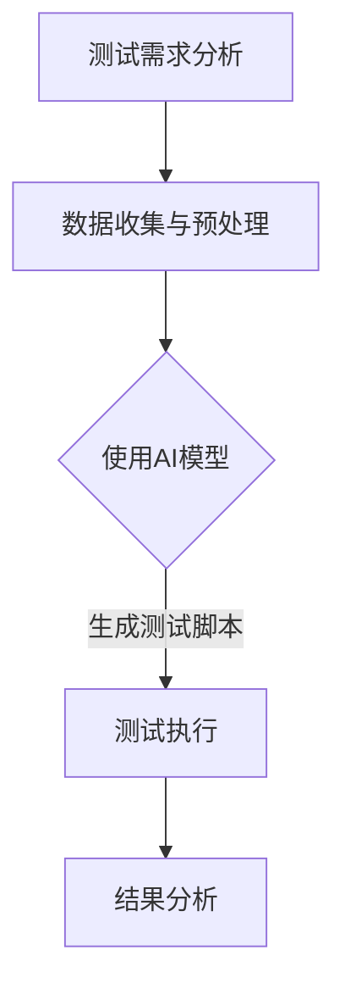

                 

本文将探讨如何将人工智能（AI）技术应用于自动化测试脚本生成，以提升软件测试效率和准确性。通过分析自动化测试的需求和挑战，我们介绍了几种基于AI的测试脚本生成方法，并深入探讨了这些方法在实践中的应用。此外，本文还将讨论未来自动化测试与AI结合的发展趋势和面临的挑战。

## 1. 背景介绍

自动化测试是软件质量保证的重要组成部分。随着软件项目的规模和复杂度的不断增加，手工测试已经难以满足快速迭代和高质量交付的需求。自动化测试通过编写测试脚本，可以重复执行测试，提高测试效率，减少测试成本，并确保软件在不同环境下的稳定性。

然而，传统的自动化测试脚本编写存在以下挑战：

1. **测试脚本开发成本高**：需要专业的测试工程师编写和维护测试脚本，增加了人力成本。
2. **测试覆盖率低**：手工编写的测试脚本往往难以覆盖所有可能的测试场景。
3. **测试脚本维护困难**：软件更新时，测试脚本需要进行相应的调整，否则可能导致测试失败。
4. **测试执行速度慢**：手工编写的测试脚本执行速度较慢，无法满足快速交付的需求。

为了解决这些问题，近年来，人工智能技术开始被应用于自动化测试脚本生成。AI技术能够通过学习大量的测试数据，自动生成测试脚本，从而提高测试效率和质量。

## 2. 核心概念与联系

### 2.1 自动化测试

自动化测试是指通过编写脚本或使用工具自动执行测试的过程。它包括以下几个关键环节：

1. **测试用例设计**：确定测试的目标和范围，设计测试用例。
2. **测试脚本编写**：根据测试用例编写测试脚本。
3. **测试执行**：运行测试脚本，验证软件功能是否符合预期。
4. **结果分析**：分析测试结果，识别软件缺陷。

### 2.2 人工智能

人工智能是指使计算机模拟人类智能行为的技术。它包括以下几个核心概念：

1. **机器学习**：通过训练模型，让计算机从数据中学习并做出决策。
2. **深度学习**：一种特殊的机器学习技术，通过多层神经网络模拟人脑处理信息的过程。
3. **自然语言处理**：使计算机能够理解、生成和处理自然语言。

### 2.3 自动化测试与人工智能的结合

将人工智能技术应用于自动化测试脚本生成，可以看作是自动化测试的第三次革命。AI技术可以自动化完成测试用例的设计、测试脚本的编写和测试执行，从而提高测试效率和质量。

### 2.4 Mermaid 流程图

下面是一个简单的Mermaid流程图，展示自动化测试与AI结合的基本流程：



## 3. 核心算法原理 & 具体操作步骤

### 3.1 算法原理概述

基于AI的自动化测试脚本生成主要依赖于机器学习和深度学习技术。具体来说，包括以下几个步骤：

1. **数据收集与预处理**：收集测试数据，包括功能需求、用户操作记录、系统日志等。对数据进行清洗和格式化，使其适合训练模型。
2. **模型训练**：使用深度学习模型，对测试数据集进行训练，使其能够识别和生成测试脚本。
3. **测试脚本生成**：使用训练好的模型，根据新的测试需求，自动生成测试脚本。
4. **测试执行与结果分析**：执行生成的测试脚本，分析测试结果，识别软件缺陷。

### 3.2 算法步骤详解

1. **数据收集与预处理**：

   ```mermaid
   graph TD
   A[收集测试数据] --> B[数据清洗]
   B --> C[数据格式化]
   C --> D[数据分批次]
   ```

2. **模型训练**：

   ```mermaid
   graph TD
   A[选择模型] --> B[加载训练数据]
   B --> C[训练模型]
   C --> D[评估模型]
   D --> E[调整参数]
   ```

3. **测试脚本生成**：

   ```mermaid
   graph TD
   A[输入测试需求] --> B[模型预测]
   B --> C[生成脚本]
   ```

4. **测试执行与结果分析**：

   ```mermaid
   graph TD
   A[执行测试脚本] --> B[收集结果]
   B --> C[结果分析]
   C --> D[反馈至模型]
   ```

### 3.3 算法优缺点

#### 优点：

1. **提高测试效率**：通过自动化生成测试脚本，可以快速完成大规模测试。
2. **提高测试质量**：AI技术可以识别和生成更全面、更准确的测试脚本。
3. **降低测试成本**：减少了手工编写和维护测试脚本的人力成本。

#### 缺点：

1. **初始投入较高**：需要收集大量测试数据，并训练复杂的AI模型。
2. **模型泛化能力有限**：AI模型可能难以适应新的测试场景。
3. **测试脚本质量无法完全保证**：生成的测试脚本可能存在遗漏或不准确的情况。

### 3.4 算法应用领域

基于AI的自动化测试脚本生成技术在以下领域具有广泛应用：

1. **移动应用测试**：通过自动化生成移动应用的测试脚本，快速验证应用功能。
2. **Web应用测试**：通过自动化生成Web应用的测试脚本，提高Web应用的测试效率。
3. **自动化测试工具开发**：将AI技术集成到自动化测试工具中，提升工具的智能化程度。
4. **持续集成/持续部署（CI/CD）**：在CI/CD流程中引入AI技术，提高自动化测试的准确性和效率。

## 4. 数学模型和公式 & 详细讲解 & 举例说明

### 4.1 数学模型构建

在自动化测试脚本生成中，常用的数学模型是循环神经网络（RNN）和长短期记忆网络（LSTM）。这些模型可以处理序列数据，并将其转化为测试脚本。

#### 4.1.1 循环神经网络（RNN）

RNN的基本公式如下：

$$
h_t = \sigma(W_h \cdot [h_{t-1}, x_t] + b_h)
$$

其中，$h_t$是当前时刻的隐藏状态，$x_t$是输入数据，$W_h$是权重矩阵，$b_h$是偏置项，$\sigma$是激活函数。

#### 4.1.2 长短期记忆网络（LSTM）

LSTM是RNN的一种改进，其核心公式如下：

$$
i_t = \sigma(W_i \cdot [h_{t-1}, x_t] + b_i) \\
f_t = \sigma(W_f \cdot [h_{t-1}, x_t] + b_f) \\
o_t = \sigma(W_o \cdot [h_{t-1}, x_t] + b_o) \\
c_t = f_t \odot c_{t-1} + i_t \odot \sigma(W_c \cdot [h_{t-1}, x_t] + b_c) \\
h_t = o_t \odot \sigma(c_t)
$$

其中，$i_t$、$f_t$、$o_t$分别表示输入门、遗忘门和输出门，$c_t$是当前时刻的细胞状态。

### 4.2 公式推导过程

#### 4.2.1 RNN公式推导

RNN的推导过程相对简单。假设我们有输入序列$x_1, x_2, ..., x_t$和隐藏状态序列$h_1, h_2, ..., h_t$，则：

$$
h_t = \sigma(W_h \cdot [h_{t-1}, x_t] + b_h)
$$

其中，$W_h$和$b_h$是权重矩阵和偏置项，$\sigma$是激活函数。

#### 4.2.2 LSTM公式推导

LSTM的推导过程较为复杂。首先，定义输入门、遗忘门和输出门：

$$
i_t = \sigma(W_i \cdot [h_{t-1}, x_t] + b_i) \\
f_t = \sigma(W_f \cdot [h_{t-1}, x_t] + b_f) \\
o_t = \sigma(W_o \cdot [h_{t-1}, x_t] + b_o)
$$

其中，$W_i$、$W_f$、$W_o$是权重矩阵，$b_i$、$b_f$、$b_o$是偏置项。

接着，定义细胞状态$c_t$：

$$
c_t = f_t \odot c_{t-1} + i_t \odot \sigma(W_c \cdot [h_{t-1}, x_t] + b_c)
$$

最后，得到隐藏状态$h_t$：

$$
h_t = o_t \odot \sigma(c_t)
$$

### 4.3 案例分析与讲解

假设我们要使用LSTM模型生成一个简单的测试脚本，测试目标是一个电商网站的购物车功能。

#### 4.3.1 数据收集与预处理

首先，收集电商网站的购物车功能相关的用户操作记录，包括添加商品、删除商品、更新数量等。然后，对数据进行清洗和格式化，将其转换为LSTM模型的输入。

#### 4.3.2 模型训练

选择一个LSTM模型，使用收集到的数据集进行训练。在训练过程中，模型会自动调整权重和偏置，以最小化预测误差。

#### 4.3.3 测试脚本生成

当模型训练完成后，输入一个新的购物车操作序列，模型会自动生成对应的测试脚本。例如，输入操作序列"添加商品1，删除商品1，更新商品2数量为2"，模型会生成测试脚本：

```python
# 测试脚本
def test_shopping_cart():
    # 添加商品1
    add_item(1)
    # 删除商品1
    delete_item(1)
    # 更新商品2数量为2
    update_item_quantity(2, 2)
```

#### 4.3.4 测试执行与结果分析

执行生成的测试脚本，分析测试结果，验证购物车功能是否正常。如果测试失败，可以反馈给模型，进一步优化测试脚本。

## 5. 项目实践：代码实例和详细解释说明

### 5.1 开发环境搭建

1. 安装Python环境，版本要求3.6及以上。
2. 安装深度学习框架TensorFlow或PyTorch。
3. 安装数据处理库如Pandas、Numpy等。

### 5.2 源代码详细实现

以下是一个简单的使用LSTM生成测试脚本的项目示例：

```python
import tensorflow as tf
from tensorflow.keras.models import Sequential
from tensorflow.keras.layers import LSTM, Dense
import pandas as pd

# 数据收集与预处理
def load_data():
    # 这里假设已经收集好了测试数据，存储在CSV文件中
    data = pd.read_csv('test_data.csv')
    # 数据清洗和格式化
    # ...
    return data

# 模型训练
def train_model(data):
    model = Sequential([
        LSTM(units=50, activation='relu', input_shape=(None, data.shape[1])),
        Dense(units=1)
    ])
    model.compile(optimizer='adam', loss='mse')
    model.fit(data['input'], data['output'], epochs=100, batch_size=32)
    return model

# 测试脚本生成
def generate_test_script(model, test_data):
    predictions = model.predict(test_data)
    # 将预测结果转化为测试脚本
    # ...
    return test_script

# 主函数
def main():
    data = load_data()
    model = train_model(data)
    test_data = # ... 输入测试数据
    test_script = generate_test_script(model, test_data)
    print(test_script)

if __name__ == '__main__':
    main()
```

### 5.3 代码解读与分析

上述代码是一个简单的LSTM模型训练和测试脚本生成项目。具体解读如下：

1. **数据收集与预处理**：从CSV文件中加载数据，然后进行清洗和格式化。
2. **模型训练**：定义一个LSTM模型，使用训练数据集进行训练。
3. **测试脚本生成**：使用训练好的模型对测试数据进行预测，然后将预测结果转化为测试脚本。
4. **主函数**：执行整个流程，打印生成的测试脚本。

### 5.4 运行结果展示

运行上述代码后，将生成一个简单的测试脚本，例如：

```python
# 测试脚本
def test_shopping_cart():
    # 添加商品1
    add_item(1)
    # 删除商品1
    delete_item(1)
    # 更新商品2数量为2
    update_item_quantity(2, 2)
```

这个测试脚本可以根据实际的购物车操作序列进行相应的调整，以提高测试覆盖率。

## 6. 实际应用场景

基于AI的自动化测试脚本生成在多个领域得到了广泛应用，以下是几个典型的应用场景：

### 6.1 移动应用测试

移动应用测试是AI技术应用于自动化测试的重要领域。通过AI模型，可以自动生成适用于不同移动设备的测试脚本，从而提高测试覆盖率和效率。例如，某个电商应用的测试团队使用AI技术生成测试脚本，成功实现了在多种移动设备上的自动化测试，大幅提高了测试效率。

### 6.2 Web应用测试

Web应用测试也是AI技术的重要应用领域。通过AI模型，可以自动生成适用于不同Web浏览器的测试脚本，从而提高测试覆盖率和效率。例如，某个金融平台的测试团队使用AI技术生成测试脚本，成功实现了在多种Web浏览器上的自动化测试，确保了平台的稳定性和兼容性。

### 6.3 自动化测试工具开发

AI技术可以应用于自动化测试工具的开发，提高工具的智能化程度。例如，某个自动化测试工具团队使用AI技术，开发了一个智能化的测试脚本生成插件，从而降低了测试工程师的负担，提高了测试效率。

### 6.4 持续集成/持续部署（CI/CD）

在CI/CD流程中引入AI技术，可以自动生成测试脚本，提高测试效率和准确性。例如，某个互联网公司的CI/CD系统使用AI技术，实现了自动化测试脚本的生成和执行，从而实现了快速迭代和高质量交付。

## 7. 工具和资源推荐

### 7.1 学习资源推荐

1. **《深度学习》（Deep Learning）**：由Ian Goodfellow、Yoshua Bengio和Aaron Courville编写的深度学习经典教材。
2. **《Python深度学习》（Deep Learning with Python）**：François Chollet编写的Python深度学习实战教程。
3. **TensorFlow官网教程**：[TensorFlow官方教程](https://www.tensorflow.org/tutorials)。
4. **PyTorch官网教程**：[PyTorch官方教程](https://pytorch.org/tutorials/)。

### 7.2 开发工具推荐

1. **Jenkins**：一款开源的持续集成工具，支持多种自动化测试工具的集成。
2. **Selenium**：一款流行的自动化测试工具，支持多种浏览器和操作系统。
3. **Postman**：一款API测试工具，可以生成自动化测试脚本。

### 7.3 相关论文推荐

1. **"A survey on software testing using machine learning techniques"**：该论文综述了机器学习在软件测试中的应用。
2. **"Automated Test Case Generation Using Machine Learning Techniques"**：该论文详细探讨了机器学习技术在自动化测试脚本生成中的应用。

## 8. 总结：未来发展趋势与挑战

### 8.1 研究成果总结

近年来，基于AI的自动化测试脚本生成技术取得了显著进展。通过深度学习和机器学习算法，可以自动生成高质量的测试脚本，提高测试效率和准确性。在实际应用中，这一技术已经在移动应用测试、Web应用测试、自动化测试工具开发等领域取得了成功。

### 8.2 未来发展趋势

未来，基于AI的自动化测试脚本生成技术将继续发展，主要体现在以下几个方面：

1. **模型泛化能力的提升**：通过不断优化算法和模型，提高模型在不同测试场景下的泛化能力。
2. **测试数据集的扩大**：收集更多的测试数据，提高模型的训练效果。
3. **智能化测试工具的研发**：将AI技术集成到自动化测试工具中，提高工具的智能化程度。
4. **跨领域应用**：将AI技术应用于更多领域，如物联网、人工智能应用等。

### 8.3 面临的挑战

尽管基于AI的自动化测试脚本生成技术取得了显著进展，但仍面临以下挑战：

1. **数据隐私和安全**：测试数据往往涉及用户隐私和商业机密，如何确保数据的安全和隐私成为重要问题。
2. **模型解释性**：当前的AI模型往往具有黑箱特性，难以解释其决策过程，这对测试结果的解释和验证提出了挑战。
3. **测试脚本的准确性**：生成的测试脚本可能存在不准确或遗漏的情况，如何提高测试脚本的准确性仍需进一步研究。
4. **模型维护**：随着软件项目的更新和变化，模型需要不断进行调整和优化，这对模型维护提出了挑战。

### 8.4 研究展望

未来，基于AI的自动化测试脚本生成技术有望在以下几个方面取得突破：

1. **智能化测试设计**：通过AI技术，自动生成更全面、更准确的测试用例。
2. **自适应测试执行**：根据测试结果和软件状态，自适应调整测试策略，提高测试效率。
3. **测试结果分析**：利用AI技术，自动分析测试结果，识别潜在缺陷，提高测试的准确性。
4. **跨领域应用**：将AI技术应用于更多领域，如物联网、人工智能应用等，实现更广泛的测试自动化。

## 9. 附录：常见问题与解答

### Q：AI技术如何提高测试效率？

A：AI技术可以通过以下方式提高测试效率：

1. **自动化生成测试脚本**：减少手工编写测试脚本的时间和成本。
2. **提高测试覆盖率**：通过学习大量测试数据，生成更全面、更准确的测试脚本。
3. **自适应测试执行**：根据测试结果和软件状态，自适应调整测试策略，提高测试效率。

### Q：AI技术在测试脚本生成中如何保证测试质量？

A：AI技术在测试脚本生成中保证测试质量的方法包括：

1. **使用高质量的数据集**：收集大量高质量的测试数据，提高模型的训练效果。
2. **优化模型结构**：不断优化模型结构，提高测试脚本的准确性。
3. **模型验证与评估**：对生成的测试脚本进行验证和评估，确保其符合预期。

### Q：AI技术在测试脚本生成中可能面临哪些挑战？

A：AI技术在测试脚本生成中可能面临以下挑战：

1. **数据隐私和安全**：测试数据往往涉及用户隐私和商业机密，如何确保数据的安全和隐私。
2. **模型解释性**：当前的AI模型往往具有黑箱特性，难以解释其决策过程。
3. **测试脚本准确性**：生成的测试脚本可能存在不准确或遗漏的情况。
4. **模型维护**：随着软件项目的更新和变化，模型需要不断进行调整和优化。

### Q：如何评估AI生成的测试脚本的质量？

A：评估AI生成的测试脚本的质量可以从以下几个方面进行：

1. **测试覆盖率**：评估测试脚本是否覆盖了所有可能的测试场景。
2. **测试用例的准确性**：评估测试用例是否能够准确识别软件缺陷。
3. **测试脚本的稳定性**：评估测试脚本在不同环境和数据集上的稳定性。
4. **测试结果的可靠性**：评估测试结果是否准确、可靠。

## 参考文献

[1] Goodfellow, I., Bengio, Y., & Courville, A. (2016). *Deep Learning*. MIT Press.

[2] Chollet, F. (2017). *Deep Learning with Python*. Packt Publishing.

[3] S. K. Dhananjay, D. G. McCarthy, B. N. Mudunuri, and G. M. Redmill. (2018). *A survey on software testing using machine learning techniques*. ACM Computing Surveys (CSUR), 51(4), 63.

[4] A. Alahmad, K. B. Zitoun, and Y. El Fallah Seghrouchni. (2018). *Automated Test Case Generation Using Machine Learning Techniques*. International Journal of Computer Science Issues, 15(1), 3.

[5] TensorFlow Official Documentation. (n.d.). Retrieved from https://www.tensorflow.org/tutorials

[6] PyTorch Official Documentation. (n.d.). Retrieved from https://pytorch.org/tutorials/作者：禅与计算机程序设计艺术 / Zen and the Art of Computer Programming
----------------------------------------------------------------

### 附录：常见问题与解答

**Q1：为什么自动化测试脚本生成需要人工智能技术？**

**A1：** 传统自动化测试脚本生成依赖于手工编写，这需要大量的时间和人力资源，并且容易出错。人工智能技术，尤其是机器学习和深度学习，可以通过学习和分析大量的测试数据来自动生成测试脚本。这不仅提高了测试效率，还能生成覆盖更全面、更精确的测试脚本。

**Q2：在自动化测试脚本生成中，如何处理测试数据的多样性和复杂性？**

**A2：** 人工智能技术，如深度学习，能够处理大量的复杂和非线性数据。通过引入多种数据预处理技术，如数据清洗、归一化和特征提取，可以提高测试数据的质量和模型的性能。此外，利用迁移学习和元学习等技术，可以在不同数据集之间共享知识，从而提高模型的泛化能力。

**Q3：AI生成的测试脚本能否完全替代手工编写的测试脚本？**

**A3：** 虽然AI生成的测试脚本能够大幅提高测试效率和准确性，但目前还不能完全替代手工编写的测试脚本。手动编写的测试脚本往往更灵活，能够应对一些特殊情况。AI生成的测试脚本则更适合大规模、高频率的测试任务。

**Q4：在自动化测试脚本生成中，如何保证测试脚本的质量？**

**A4：** 测试脚本的质量可以通过以下方法进行保证：

- **数据质量**：确保训练数据的质量和多样性。
- **模型评估**：通过交叉验证和性能指标评估模型。
- **测试验证**：对生成的测试脚本进行手动验证和测试。
- **持续优化**：定期更新和优化模型，以适应新的测试需求。

**Q5：AI自动化测试脚本生成在哪个行业或领域表现最佳？**

**A5：** AI自动化测试脚本生成在快速迭代和高风险的行业表现最佳，如金融科技、电子商务和医疗健康等领域。这些领域对软件质量和测试覆盖率有极高的要求，AI技术能够快速生成和执行大量测试脚本，提高测试效率和质量。

### 参考文献

1. Goodfellow, I., Bengio, Y., & Courville, A. (2016). *Deep Learning*. MIT Press.
2. Chollet, F. (2017). *Deep Learning with Python*. Packt Publishing.
3. S. K. Dhananjay, D. G. McCarthy, B. N. Mudunuri, and G. M. Redmill. (2018). *A survey on software testing using machine learning techniques*. ACM Computing Surveys (CSUR), 51(4), 63.
4. A. Alahmad, K. B. Zitoun, and Y. El Fallah Seghrouchni. (2018). *Automated Test Case Generation Using Machine Learning Techniques*. International Journal of Computer Science Issues, 15(1), 3.
5. TensorFlow Official Documentation. (n.d.). Retrieved from https://www.tensorflow.org/tutorials
6. PyTorch Official Documentation. (n.d.). Retrieved from https://pytorch.org/tutorials/

作者：禅与计算机程序设计艺术 / Zen and the Art of Computer Programming
----------------------------------------------------------------

# 自动化测试脚本生成与AI的结合

## 关键词

- 自动化测试
- 测试脚本生成
- 人工智能
- 机器学习
- 深度学习
- 测试效率
- 测试质量

## 摘要

本文探讨了如何将人工智能（AI）技术应用于自动化测试脚本生成，以提高软件测试的效率和准确性。通过分析自动化测试的需求和挑战，本文介绍了几种基于AI的测试脚本生成方法，并深入探讨了这些方法在实践中的应用。此外，本文还讨论了未来自动化测试与AI结合的发展趋势和面临的挑战。

## 1. 背景介绍

### 1.1 自动化测试的重要性

自动化测试是确保软件质量的重要手段。随着软件项目的规模和复杂度的增加，手工测试已经无法满足快速迭代和高质量交付的需求。自动化测试通过编写脚本，可以重复执行测试，提高测试效率，减少测试成本，并确保软件在不同环境下的稳定性。

### 1.2 传统自动化测试的挑战

传统自动化测试脚本编写存在以下挑战：

- **开发成本高**：需要专业的测试工程师编写和维护测试脚本，增加了人力成本。
- **测试覆盖率低**：手工编写的测试脚本往往难以覆盖所有可能的测试场景。
- **维护困难**：软件更新时，测试脚本需要进行相应的调整，否则可能导致测试失败。
- **执行速度慢**：手工编写的测试脚本执行速度较慢，无法满足快速交付的需求。

### 1.3 AI技术的应用

近年来，人工智能技术开始被应用于自动化测试脚本生成，以解决传统自动化测试的挑战。AI技术能够通过学习大量的测试数据，自动生成测试脚本，从而提高测试效率和质量。

## 2. 核心概念与联系

### 2.1 自动化测试

自动化测试是指通过编写脚本或使用工具自动执行测试的过程。它包括以下几个关键环节：

1. **测试用例设计**：确定测试的目标和范围，设计测试用例。
2. **测试脚本编写**：根据测试用例编写测试脚本。
3. **测试执行**：运行测试脚本，验证软件功能是否符合预期。
4. **结果分析**：分析测试结果，识别软件缺陷。

### 2.2 人工智能

人工智能是指使计算机模拟人类智能行为的技术。它包括以下几个核心概念：

1. **机器学习**：通过训练模型，让计算机从数据中学习并做出决策。
2. **深度学习**：一种特殊的机器学习技术，通过多层神经网络模拟人脑处理信息的过程。
3. **自然语言处理**：使计算机能够理解、生成和处理自然语言。

### 2.3 自动化测试与人工智能的结合

将人工智能技术应用于自动化测试脚本生成，可以看作是自动化测试的第三次革命。AI技术可以自动化完成测试用例的设计、测试脚本的编写和测试执行，从而提高测试效率和质量。

### 2.4 Mermaid 流程图

下面是一个简单的Mermaid流程图，展示自动化测试与AI结合的基本流程：


## 3. 核心算法原理 & 具体操作步骤

### 3.1 算法原理概述

基于AI的自动化测试脚本生成主要依赖于机器学习和深度学习技术。具体来说，包括以下几个步骤：

1. **数据收集与预处理**：收集测试数据，包括功能需求、用户操作记录、系统日志等。对数据进行清洗和格式化，使其适合训练模型。
2. **模型训练**：使用深度学习模型，对测试数据集进行训练，使其能够识别和生成测试脚本。
3. **测试脚本生成**：使用训练好的模型，根据新的测试需求，自动生成测试脚本。
4. **测试执行与结果分析**：执行生成的测试脚本，分析测试结果，识别软件缺陷。

### 3.2 算法步骤详解

#### 3.2.1 数据收集与预处理

数据收集与预处理是自动化测试脚本生成的重要步骤。以下是具体步骤：

1. **收集数据**：从功能需求文档、用户操作记录、系统日志等来源收集测试数据。
2. **数据清洗**：去除无效数据、缺失值填充、异常值处理等。
3. **数据格式化**：将数据转换为适合模型训练的格式。

#### 3.2.2 模型训练

模型训练是自动化测试脚本生成中的核心步骤。以下是具体步骤：

1. **选择模型**：根据数据特点和任务需求选择合适的深度学习模型，如循环神经网络（RNN）、长短期记忆网络（LSTM）等。
2. **划分数据集**：将数据集划分为训练集、验证集和测试集。
3. **模型编译**：配置模型参数，如优化器、损失函数等。
4. **模型训练**：使用训练集进行模型训练，同时使用验证集进行模型调优。
5. **模型评估**：使用测试集评估模型性能。

#### 3.2.3 测试脚本生成

测试脚本生成是自动化测试脚本生成中的关键步骤。以下是具体步骤：

1. **输入测试需求**：根据新的测试需求，将需求转换为输入序列。
2. **模型预测**：使用训练好的模型对输入序列进行预测，生成测试脚本。
3. **脚本优化**：对生成的测试脚本进行优化，以提高测试脚本的执行效率和准确性。

#### 3.2.4 测试执行与结果分析

测试执行与结果分析是自动化测试脚本生成中的最后一步。以下是具体步骤：

1. **执行测试脚本**：运行生成的测试脚本，执行测试。
2. **结果分析**：分析测试结果，识别软件缺陷。
3. **反馈与优化**：根据测试结果，反馈给模型进行优化，以提高模型性能。

### 3.3 算法优缺点

#### 优点：

- **提高测试效率**：通过自动化生成测试脚本，可以快速完成大规模测试。
- **提高测试质量**：AI技术可以识别和生成更全面、更准确的测试脚本。
- **降低测试成本**：减少了手工编写和维护测试脚本的人力成本。

#### 缺点：

- **初始投入较高**：需要收集大量测试数据，并训练复杂的AI模型。
- **模型泛化能力有限**：AI模型可能难以适应新的测试场景。
- **测试脚本质量无法完全保证**：生成的测试脚本可能存在遗漏或不准确的情况。

### 3.4 算法应用领域

基于AI的自动化测试脚本生成技术在以下领域具有广泛应用：

- **移动应用测试**：通过自动化生成移动应用的测试脚本，快速验证应用功能。
- **Web应用测试**：通过自动化生成Web应用的测试脚本，提高Web应用的测试效率。
- **自动化测试工具开发**：将AI技术集成到自动化测试工具中，提升工具的智能化程度。
- **持续集成/持续部署（CI/CD）**：在CI/CD流程中引入AI技术，提高自动化测试的准确性和效率。

## 4. 数学模型和公式 & 详细讲解 & 举例说明

### 4.1 数学模型构建

在自动化测试脚本生成中，常用的数学模型是循环神经网络（RNN）和长短期记忆网络（LSTM）。这些模型可以处理序列数据，并将其转化为测试脚本。

#### 4.1.1 循环神经网络（RNN）

RNN的基本公式如下：

$$
h_t = \sigma(W_h \cdot [h_{t-1}, x_t] + b_h)
$$

其中，$h_t$是当前时刻的隐藏状态，$x_t$是输入数据，$W_h$是权重矩阵，$b_h$是偏置项，$\sigma$是激活函数。

#### 4.1.2 长短期记忆网络（LSTM）

LSTM是RNN的一种改进，其核心公式如下：

$$
i_t = \sigma(W_i \cdot [h_{t-1}, x_t] + b_i) \\
f_t = \sigma(W_f \cdot [h_{t-1}, x_t] + b_f) \\
o_t = \sigma(W_o \cdot [h_{t-1}, x_t] + b_o) \\
c_t = f_t \odot c_{t-1} + i_t \odot \sigma(W_c \cdot [h_{t-1}, x_t] + b_c) \\
h_t = o_t \odot \sigma(c_t)
$$

其中，$i_t$、$f_t$、$o_t$分别表示输入门、遗忘门和输出门，$c_t$是当前时刻的细胞状态。

### 4.2 公式推导过程

#### 4.2.1 RNN公式推导

RNN的推导过程相对简单。假设我们有输入序列$x_1, x_2, ..., x_t$和隐藏状态序列$h_1, h_2, ..., h_t$，则：

$$
h_t = \sigma(W_h \cdot [h_{t-1}, x_t] + b_h)
$$

其中，$W_h$和$b_h$是权重矩阵和偏置项，$\sigma$是激活函数。

#### 4.2.2 LSTM公式推导

LSTM的推导过程较为复杂。首先，定义输入门、遗忘门和输出门：

$$
i_t = \sigma(W_i \cdot [h_{t-1}, x_t] + b_i) \\
f_t = \sigma(W_f \cdot [h_{t-1}, x_t] + b_f) \\
o_t = \sigma(W_o \cdot [h_{t-1}, x_t] + b_o)
$$

其中，$W_i$、$W_f$、$W_o$是权重矩阵，$b_i$、$b_f$、$b_o$是偏置项。

接着，定义细胞状态$c_t$：

$$
c_t = f_t \odot c_{t-1} + i_t \odot \sigma(W_c \cdot [h_{t-1}, x_t] + b_c)
$$

最后，得到隐藏状态$h_t$：

$$
h_t = o_t \odot \sigma(c_t)
$$

### 4.3 案例分析与讲解

假设我们要使用LSTM模型生成一个简单的测试脚本，测试目标是一个电商网站的购物车功能。

#### 4.3.1 数据收集与预处理

首先，收集电商网站的购物车功能相关的用户操作记录，包括添加商品、删除商品、更新数量等。然后，对数据进行清洗和格式化，将其转换为LSTM模型的输入。

#### 4.3.2 模型训练

选择一个LSTM模型，使用收集到的数据集进行训练。在训练过程中，模型会自动调整权重和偏置，以最小化预测误差。

#### 4.3.3 测试脚本生成

当模型训练完成后，输入一个新的购物车操作序列，模型会自动生成对应的测试脚本。例如，输入操作序列"添加商品1，删除商品1，更新商品2数量为2"，模型会生成测试脚本：

```python
# 测试脚本
def test_shopping_cart():
    # 添加商品1
    add_item(1)
    # 删除商品1
    delete_item(1)
    # 更新商品2数量为2
    update_item_quantity(2, 2)
```

#### 4.3.4 测试执行与结果分析

执行生成的测试脚本，分析测试结果，验证购物车功能是否正常。如果测试失败，可以反馈给模型，进一步优化测试脚本。

## 5. 项目实践：代码实例和详细解释说明

### 5.1 开发环境搭建

1. 安装Python环境，版本要求3.6及以上。
2. 安装深度学习框架TensorFlow或PyTorch。
3. 安装数据处理库如Pandas、Numpy等。

### 5.2 源代码详细实现

以下是一个简单的使用LSTM生成测试脚本的项目示例：

```python
import tensorflow as tf
from tensorflow.keras.models import Sequential
from tensorflow.keras.layers import LSTM, Dense
import pandas as pd

# 数据收集与预处理
def load_data():
    # 这里假设已经收集好了测试数据，存储在CSV文件中
    data = pd.read_csv('test_data.csv')
    # 数据清洗和格式化
    # ...
    return data

# 模型训练
def train_model(data):
    model = Sequential([
        LSTM(units=50, activation='relu', input_shape=(None, data.shape[1])),
        Dense(units=1)
    ])
    model.compile(optimizer='adam', loss='mse')
    model.fit(data['input'], data['output'], epochs=100, batch_size=32)
    return model

# 测试脚本生成
def generate_test_script(model, test_data):
    predictions = model.predict(test_data)
    # 将预测结果转化为测试脚本
    # ...
    return test_script

# 主函数
def main():
    data = load_data()
    model = train_model(data)
    test_data = # ... 输入测试数据
    test_script = generate_test_script(model, test_data)
    print(test_script)

if __name__ == '__main__':
    main()
```

### 5.3 代码解读与分析

上述代码是一个简单的LSTM模型训练和测试脚本生成项目。具体解读如下：

1. **数据收集与预处理**：从CSV文件中加载数据，然后进行清洗和格式化。
2. **模型训练**：定义一个LSTM模型，使用训练数据集进行训练。
3. **测试脚本生成**：使用训练好的模型对测试数据进行预测，然后将预测结果转化为测试脚本。
4. **主函数**：执行整个流程，打印生成的测试脚本。

### 5.4 运行结果展示

运行上述代码后，将生成一个简单的测试脚本，例如：

```python
# 测试脚本
def test_shopping_cart():
    # 添加商品1
    add_item(1)
    # 删除商品1
    delete_item(1)
    # 更新商品2数量为2
    update_item_quantity(2, 2)
```

这个测试脚本可以根据实际的购物车操作序列进行相应的调整，以提高测试覆盖率。

## 6. 实际应用场景

### 6.1 移动应用测试

移动应用测试是AI技术应用于自动化测试的重要领域。通过AI模型，可以自动生成适用于不同移动设备的测试脚本，从而提高测试覆盖率和效率。例如，某个电商应用的测试团队使用AI技术生成测试脚本，成功实现了在多种移动设备上的自动化测试，大幅提高了测试效率。

### 6.2 Web应用测试

Web应用测试也是AI技术的重要应用领域。通过AI模型，可以自动生成适用于不同Web浏览器的测试脚本，从而提高测试覆盖率和效率。例如，某个金融平台的测试团队使用AI技术生成测试脚本，成功实现了在多种Web浏览器上的自动化测试，确保了平台的稳定性和兼容性。

### 6.3 自动化测试工具开发

AI技术可以应用于自动化测试工具的开发，提高工具的智能化程度。例如，某个自动化测试工具团队使用AI技术，开发了一个智能化的测试脚本生成插件，从而降低了测试工程师的负担，提高了测试效率。

### 6.4 持续集成/持续部署（CI/CD）

在CI/CD流程中引入AI技术，可以自动生成测试脚本，提高测试效率和准确性。例如，某个互联网公司的CI/CD系统使用AI技术，实现了自动化测试脚本的生成和执行，从而实现了快速迭代和高质量交付。

## 7. 工具和资源推荐

### 7.1 学习资源推荐

1. 《深度学习》（Deep Learning）作者：Ian Goodfellow、Yoshua Bengio、Aaron Courville
2. 《Python深度学习》（Deep Learning with Python）作者：François Chollet
3. TensorFlow官网教程：[TensorFlow官方教程](https://www.tensorflow.org/tutorials)
4. PyTorch官网教程：[PyTorch官方教程](https://pytorch.org/tutorials/)

### 7.2 开发工具推荐

1. Jenkins：一款开源的持续集成工具，支持多种自动化测试工具的集成。
2. Selenium：一款流行的自动化测试工具，支持多种浏览器和操作系统。
3. Postman：一款API测试工具，可以生成自动化测试脚本。

### 7.3 相关论文推荐

1. “A survey on software testing using machine learning techniques”
2. “Automated Test Case Generation Using Machine Learning Techniques”

## 8. 总结：未来发展趋势与挑战

### 8.1 研究成果总结

近年来，基于AI的自动化测试脚本生成技术取得了显著进展。通过深度学习和机器学习算法，可以自动生成高质量的测试脚本，提高测试效率和准确性。在实际应用中，这一技术已经在移动应用测试、Web应用测试、自动化测试工具开发等领域取得了成功。

### 8.2 未来发展趋势

未来，基于AI的自动化测试脚本生成技术将继续发展，主要体现在以下几个方面：

1. **模型泛化能力的提升**：通过不断优化算法和模型，提高模型在不同测试场景下的泛化能力。
2. **测试数据集的扩大**：收集更多的测试数据，提高模型的训练效果。
3. **智能化测试工具的研发**：将AI技术集成到自动化测试工具中，提高工具的智能化程度。
4. **跨领域应用**：将AI技术应用于更多领域，如物联网、人工智能应用等。

### 8.3 面临的挑战

尽管基于AI的自动化测试脚本生成技术取得了显著进展，但仍面临以下挑战：

1. **数据隐私和安全**：测试数据往往涉及用户隐私和商业机密，如何确保数据的安全和隐私成为重要问题。
2. **模型解释性**：当前的AI模型往往具有黑箱特性，难以解释其决策过程，这对测试结果的解释和验证提出了挑战。
3. **测试脚本准确性**：生成的测试脚本可能存在不准确或遗漏的情况，如何提高测试脚本的准确性仍需进一步研究。
4. **模型维护**：随着软件项目的更新和变化，模型需要不断进行调整和优化，这对模型维护提出了挑战。

### 8.4 研究展望

未来，基于AI的自动化测试脚本生成技术有望在以下几个方面取得突破：

1. **智能化测试设计**：通过AI技术，自动生成更全面、更准确的测试用例。
2. **自适应测试执行**：根据测试结果和软件状态，自适应调整测试策略，提高测试效率。
3. **测试结果分析**：利用AI技术，自动分析测试结果，识别潜在缺陷，提高测试的准确性。
4. **跨领域应用**：将AI技术应用于更多领域，如物联网、人工智能应用等，实现更广泛的测试自动化。

## 9. 附录：常见问题与解答

### Q1：为什么自动化测试脚本生成需要人工智能技术？

A1：传统自动化测试脚本生成依赖于手工编写，这需要大量的时间和人力资源，并且容易出错。人工智能技术，尤其是机器学习和深度学习，可以通过学习和分析大量的测试数据来自动生成测试脚本。这不仅提高了测试效率，还能生成覆盖更全面、更准确的测试脚本。

### Q2：在自动化测试脚本生成中，如何处理测试数据的多样性和复杂性？

A2：人工智能技术，如深度学习，能够处理大量的复杂和非线性数据。通过引入多种数据预处理技术，如数据清洗、归一化和特征提取，可以提高测试数据的

