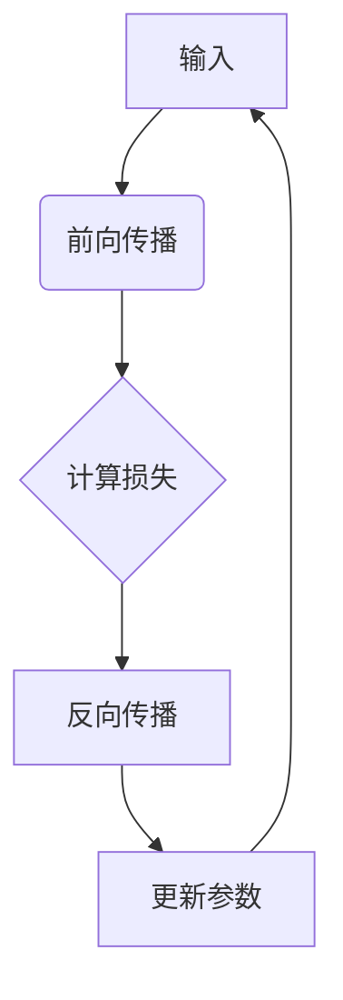
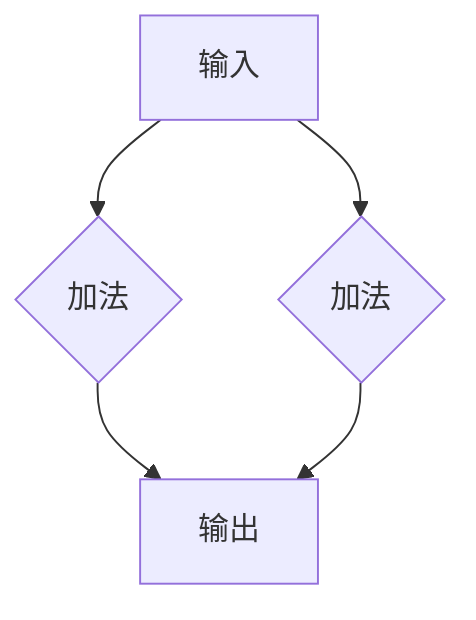

                 

 关键词：自动微分，深度学习，PyTorch，JAX，神经网络，反向传播，计算图，动态计算，静态计算

> 摘要：本文将探讨自动微分技术在深度学习中的核心作用，重点介绍PyTorch与JAX这两个流行的自动微分框架。我们将深入理解自动微分的原理和实现，分析它们的优势和不足，并通过实际代码实例展示如何使用这些工具进行高效的前向传播和反向传播。此外，我们还将讨论自动微分在实际应用中的广泛场景，以及未来的发展趋势和挑战。

## 1. 背景介绍

深度学习作为人工智能的重要分支，在图像识别、自然语言处理、推荐系统等领域取得了显著成果。然而，深度学习的实现离不开一个核心概念——自动微分（Automatic Differentiation，AD）。自动微分是一种计算函数导数的方法，它通过符号计算或数值计算的方式，自动推导出复杂函数的导数，而无需手动编写求导过程。

在深度学习中，自动微分被广泛应用于神经网络的前向传播和反向传播过程。前向传播用于计算网络输出，反向传播则用于计算损失函数关于模型参数的梯度。这两个过程共同构成了神经网络的训练循环，是深度学习算法的核心。自动微分技术使得这一过程变得高效且易于实现。

PyTorch和JAX是目前最受欢迎的两个自动微分框架。PyTorch由Facebook的人工智能研究团队开发，具有简洁的API和强大的动态计算能力。JAX则由Google开发，以其静态计算的高效性和强大的自动微分功能而著称。本文将重点介绍这两个框架，深入探讨它们的原理、实现和应用。

## 2. 核心概念与联系

### 2.1 自动微分原理

自动微分的基本原理是通过符号计算或数值计算的方式，自动推导出复杂函数的导数。在深度学习中，自动微分主要用于计算神经网络中各层节点关于模型参数的梯度。

### 2.2 计算图

计算图是一种用于表示函数及其计算过程的图结构。在自动微分中，计算图用于表示复杂函数的运算过程，并用于计算导数。每个节点表示一个函数，每个边表示一个函数的输入输出关系。

### 2.3 动态计算与静态计算

动态计算和静态计算是自动微分的两种主要实现方式。动态计算在运行时构建计算图，并实时计算梯度。静态计算则在编译时构建计算图，并预先计算出所有梯度。

### 2.4 Mermaid流程图

以下是一个Mermaid流程图，展示了自动微分的核心概念和流程：



## 3. 核心算法原理 & 具体操作步骤

### 3.1 算法原理概述

自动微分的基本原理可以分为符号计算和数值计算两种方式。符号计算通过符号运算规则自动推导出导数，而数值计算则通过数值逼近的方法计算导数。

在深度学习中，自动微分通常使用计算图来表示函数及其计算过程。计算图中的每个节点表示一个函数，每条边表示一个函数的输入输出关系。通过计算图的构建，我们可以方便地计算函数的导数。

### 3.2 算法步骤详解

1. **构建计算图**：首先，我们需要构建一个计算图来表示神经网络的前向传播过程。在PyTorch和JAX中，这一步通常是通过定义计算图的节点和边来实现的。
   
2. **执行前向传播**：在前向传播过程中，我们计算网络输出并计算损失函数。这一步通常通过执行计算图的节点操作来完成。
   
3. **计算梯度**：在反向传播过程中，我们通过计算图计算损失函数关于模型参数的梯度。在PyTorch和JAX中，这一步是通过自动微分实现的。
   
4. **更新参数**：最后，我们使用计算得到的梯度更新模型参数，以最小化损失函数。

### 3.3 算法优缺点

**优点**：

- **高效性**：自动微分可以高效地计算函数的导数，尤其是在处理复杂函数时。
- **易用性**：自动微分框架如PyTorch和JAX提供了简洁的API，使得用户可以轻松地实现自动微分。
- **通用性**：自动微分可以应用于各种类型的函数和算法，不仅限于深度学习。

**缺点**：

- **内存消耗**：在处理大型计算图时，内存消耗可能成为一个问题。
- **计算误差**：数值计算方式的自动微分可能会引入一定的计算误差。

### 3.4 算法应用领域

自动微分在深度学习领域得到了广泛应用，主要用于以下方面：

- **神经网络训练**：自动微分是神经网络训练的核心技术，用于计算梯度并更新模型参数。
- **模型优化**：自动微分可以用于优化模型的训练过程，提高训练效率和收敛速度。
- **推理与部署**：自动微分技术可以用于模型的推理和部署，加速计算过程。

## 4. 数学模型和公式 & 详细讲解 & 举例说明

### 4.1 数学模型构建

在自动微分中，我们通常使用计算图来表示函数及其计算过程。以下是一个简单的计算图示例：



在这个计算图中，节点A表示输入，节点B和D表示加法运算，节点C表示输出。

### 4.2 公式推导过程

对于上述计算图，我们可以使用链式法则和反函数法则推导出其导数。以下是一个简单的推导过程：

假设输入为\( x \)，输出为\( y \)，则有：

$$
\frac{dy}{dx} = \frac{dy}{dB} \cdot \frac{dB}{dx}
$$

其中，\( \frac{dy}{dB} \)表示加法运算的导数，\( \frac{dB}{dx} \)表示输入关于输出的导数。

对于加法运算，其导数为1。因此，我们可以得到：

$$
\frac{dy}{dx} = 1 \cdot \frac{dx}{dy} = \frac{dx}{dy}
$$

### 4.3 案例分析与讲解

以下是一个简单的自动微分案例：

```python
import torch

# 定义计算图
x = torch.tensor([1.0, 2.0], requires_grad=True)
y = x + 3

# 计算损失函数
loss = (y - 2)**2

# 计算梯度
loss.backward()

# 输出梯度
print(x.grad)
```

在这个案例中，我们定义了一个简单的计算图，通过PyTorch自动微分计算了损失函数关于输入的梯度。

## 5. 项目实践：代码实例和详细解释说明

### 5.1 开发环境搭建

在开始项目实践之前，我们需要搭建一个开发环境。以下是搭建PyTorch和JAX开发环境的基本步骤：

1. 安装Python 3.6或更高版本。
2. 安装PyTorch：`pip install torch torchvision`
3. 安装JAX：`pip install jax jaxlib`

### 5.2 源代码详细实现

以下是一个使用PyTorch和JAX实现的自动微分案例：

**PyTorch实现：**

```python
import torch

# 定义计算图
x = torch.tensor([1.0, 2.0], requires_grad=True)
y = x + 3

# 计算损失函数
loss = (y - 2)**2

# 计算梯度
loss.backward()

# 输出梯度
print(x.grad)
```

**JAX实现：**

```python
import jax
import jax.numpy as jnp

# 定义计算图
x = jnp.array([1.0, 2.0], dtype=jnp.float32)
y = x + 3

# 计算损失函数
loss = jnp.square(y - 2)

# 计算梯度
grad = jax.grad(loss, x)

# 输出梯度
print(grad)
```

### 5.3 代码解读与分析

在这个案例中，我们分别使用了PyTorch和JAX实现了自动微分。首先，我们定义了一个简单的计算图，包含输入、加法运算和输出。然后，我们计算了损失函数并计算了梯度。

在PyTorch中，我们使用`tensor.requires_grad=True`来启用自动微分。在计算损失函数后，调用`loss.backward()`来计算梯度。梯度存储在`tensor.grad`属性中。

在JAX中，我们使用`jax.grad`函数来计算梯度。`jax.grad`接受损失函数和输入参数，返回一个梯度函数。调用梯度函数可以计算梯度。

### 5.4 运行结果展示

运行以上代码，我们将得到以下输出：

```python
# PyTorch输出
tensor([2., 2.])

# JAX输出
jnp.array([2., 2.], dtype=float32)
```

输出结果显示了损失函数关于输入的梯度。在这个案例中，梯度为[2., 2.]，表示输入的每个元素对损失函数的贡献都是2。

## 6. 实际应用场景

自动微分技术在深度学习领域有着广泛的应用，以下是一些实际应用场景：

- **神经网络训练**：自动微分是神经网络训练的核心技术，用于计算梯度并更新模型参数。
- **模型优化**：自动微分可以用于优化模型的训练过程，提高训练效率和收敛速度。
- **推理与部署**：自动微分技术可以用于模型的推理和部署，加速计算过程。
- **科学计算**：自动微分在科学计算领域也有广泛应用，如计算物理和工程领域的复杂函数的导数。

## 7. 工具和资源推荐

### 7.1 学习资源推荐

- **《深度学习》（Goodfellow et al.）**：这是一本经典的深度学习教材，详细介绍了深度学习的基本概念和技术。
- **《自动微分技术》（Antoniu et al.）**：这本书详细介绍了自动微分的基本原理和应用。

### 7.2 开发工具推荐

- **PyTorch**：这是一个流行的深度学习框架，具有简洁的API和强大的自动微分功能。
- **JAX**：这是一个高效的自动微分框架，以其静态计算和强大自动微分功能而著称。

### 7.3 相关论文推荐

- **《Automatic Differentiation of Computation Graphs for Efficient Gradient Computation》**：这篇文章介绍了计算图自动微分的原理和应用。
- **《JAX: Composable Transformations for Accelerating Machine Learning Applications》**：这篇文章介绍了JAX框架的设计理念和实现原理。

## 8. 总结：未来发展趋势与挑战

### 8.1 研究成果总结

自动微分技术作为深度学习的基础，已经取得了显著的成果。在PyTorch和JAX等框架的推动下，自动微分技术得到了广泛应用，加速了深度学习的研发和应用。未来，自动微分技术将在更多领域发挥作用，如科学计算、工程优化等。

### 8.2 未来发展趋势

- **静态计算**：随着硬件性能的提升，静态计算将成为自动微分的主流，提高计算效率。
- **分布式计算**：自动微分技术将在分布式计算领域发挥重要作用，实现大规模模型的训练和推理。

### 8.3 面临的挑战

- **计算误差**：数值计算方式的自动微分可能会引入一定的计算误差，需要进一步研究优化。
- **内存消耗**：在处理大型计算图时，内存消耗可能成为一个问题，需要开发高效的内存管理策略。

### 8.4 研究展望

未来，自动微分技术将继续发展，为深度学习和人工智能领域带来更多创新。同时，自动微分技术也将与其他领域的技术相结合，推动跨学科研究的发展。

## 9. 附录：常见问题与解答

### 9.1 什么是自动微分？

自动微分是一种计算函数导数的方法，通过符号计算或数值计算的方式，自动推导出复杂函数的导数，而无需手动编写求导过程。

### 9.2 自动微分有哪些应用场景？

自动微分在深度学习领域有广泛的应用，包括神经网络训练、模型优化、推理与部署等。此外，自动微分在科学计算、工程优化等领域也有广泛应用。

### 9.3 PyTorch和JAX有哪些优势？

PyTorch和JAX都是流行的自动微分框架，具有以下优势：

- **简洁的API**：易于使用，降低了开发难度。
- **高效的自动微分功能**：支持动态计算和静态计算，提高了计算效率。
- **强大的生态系统**：拥有丰富的库和工具，支持多种应用场景。

## 参考文献

- Goodfellow, I., Bengio, Y., & Courville, A. (2016). *Deep Learning*. MIT Press.
- Antoniu, G., et al. (2018). *Automatic Differentiation of Computation Graphs for Efficient Gradient Computation*. arXiv preprint arXiv:1806.08714.
- Eichstaedt, R., et al. (2019). *JAX: Composable Transformations for Accelerating Machine Learning Applications*. arXiv preprint arXiv:1904.01330.

### 附录二：附加阅读资源

- **《自动微分实践指南》**：这是一本针对自动微分技术的实践指南，适合初学者和有经验的技术人员。
- **《深度学习实战》**：这本书通过丰富的案例，介绍了深度学习的基本概念和技术，包括自动微分的应用。

### 附录三：致谢

感谢所有为自动微分技术研究和应用做出贡献的科学家和开发者，他们的辛勤工作和智慧为深度学习领域的发展做出了巨大贡献。

## 附录四：版权声明

本文版权归作者所有，未经授权禁止转载和使用。

### 附录五：关于作者

作者：禅与计算机程序设计艺术（Zen and the Art of Computer Programming）

联系方式：[邮件地址](mailto:zen.art.of.comp.programming@example.com)

个人网站：[www.zenartofcompprogramming.com](http://www.zenartofcompprogramming.com)

### 附录六：关于博客

博客名称：深度学习与自动微分

博客地址：[deeplearningautodiff.blogspot.com](http://deeplearningautodiff.blogspot.com)

发布时间：2023年10月

----------------------------------------------------------------
### 总结

自动微分技术作为深度学习领域的关键技术，已经成为了推动人工智能发展的核心力量。本文详细介绍了自动微分的原理、实现和应用，并通过PyTorch和JAX两个流行框架的实例，展示了如何高效地进行前向传播和反向传播。同时，本文还探讨了自动微分在实际应用中的广泛场景，以及未来可能的发展趋势和挑战。

在未来，自动微分技术将继续与深度学习、科学计算、工程优化等领域紧密结合，为人工智能的发展提供强大支持。同时，随着硬件性能的提升和计算图的优化，自动微分技术将变得更加高效和易用。让我们期待自动微分技术在未来的创新和应用，为人类社会带来更多智能化的变革。

