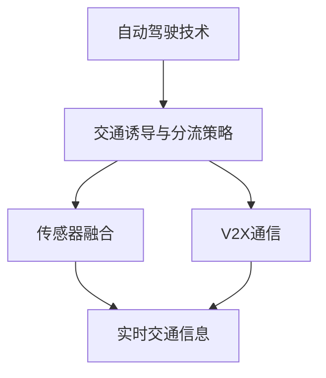
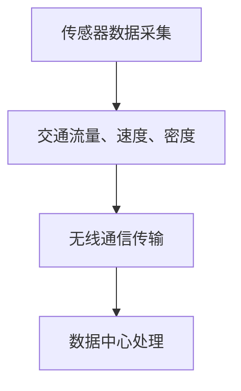
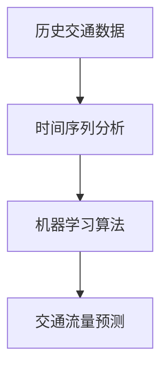
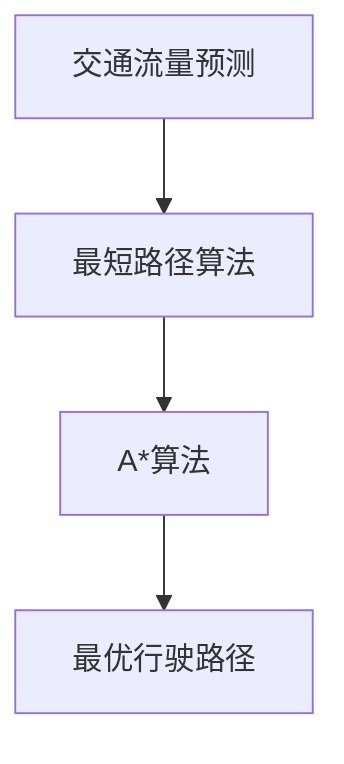
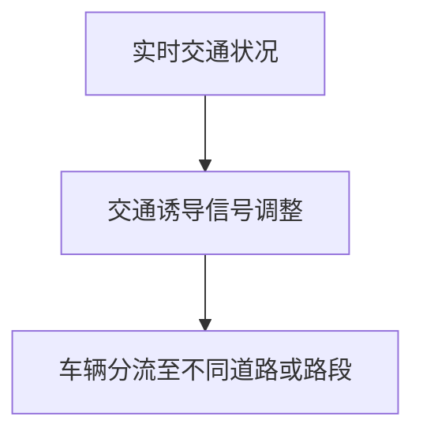

                 

自动驾驶技术作为未来交通系统的重要组成部分，正日益受到广泛关注。它通过融合传感器、计算能力和通信技术，实现车辆对周围环境的感知和自主决策，从而提高交通效率、减少事故发生和降低环境污染。智能交通诱导与分流策略是自动驾驶技术中的一项关键技术，旨在通过优化交通流、缓解拥堵，提高道路通行能力。

本文将围绕智能交通诱导与分流策略展开讨论，首先介绍该领域的基本概念和背景，随后深入探讨核心算法原理、数学模型及其应用场景，并通过具体项目实践和案例分析，阐述这些策略在实际应用中的效果和意义。最后，我们将展望未来发展趋势与面临的挑战，以及相关学习资源和开发工具的推荐。

## 1. 背景介绍

### 1.1 自动驾驶技术发展现状

自动驾驶技术经历了多年的研究和探索，从最初的实验室阶段到如今的商业化应用，其技术不断成熟。目前，自动驾驶技术主要分为五个级别，从L0（无自动化）到L5（完全自动化），不同级别的自动驾驶技术在车辆控制、传感器融合和通信能力等方面存在显著差异。自动驾驶技术的发展不仅依赖于车辆本身的传感器和计算能力，还需要与道路基础设施、通信网络和其他车辆实现高效协同。

### 1.2 智能交通诱导与分流策略的定义

智能交通诱导与分流策略是指通过实时监测交通状况、预测交通流量变化，并采取相应的措施引导车辆行驶，以优化交通流、减少拥堵、提高道路通行能力的一种交通管理方法。该策略的核心在于对交通数据的实时采集、分析和处理，从而实现交通诱导和分流的目标。

### 1.3 智能交通诱导与分流策略的重要性

智能交通诱导与分流策略在自动驾驶技术中具有重要地位。首先，它能够提高道路通行效率，减少车辆行驶时间，从而降低交通拥堵对经济和社会的影响。其次，智能交通诱导与分流策略有助于提高交通安全，通过实时监测和预警，减少交通事故的发生。此外，该策略还能降低环境污染，通过优化交通流量，减少车辆尾气排放。

## 2. 核心概念与联系

### 2.1 自动驾驶与智能交通诱导与分流策略的关系

自动驾驶技术需要依赖智能交通诱导与分流策略来实现最优的行驶路径和交通流量控制。智能交通诱导与分流策略为自动驾驶车辆提供了实时交通信息，指导车辆做出最优决策，从而提高行驶安全性和效率。

### 2.2 相关概念解释

- **交通诱导**：交通诱导是指通过提供实时交通信息，引导车辆选择最佳行驶路径，从而减少交通拥堵和行驶时间。

- **交通分流**：交通分流是指通过控制交通流量，将车辆引导至不同的道路或路段，以缓解交通压力，提高道路通行能力。

- **传感器融合**：传感器融合是指将不同类型的传感器数据（如摄像头、雷达、GPS等）进行整合，以获得更准确和全面的交通信息。

- **V2X通信**：V2X通信是指车辆与道路基础设施、其他车辆和行人之间的信息交换，以实现车辆间和车辆与基础设施间的协同。

### 2.3 Mermaid 流程图

下面是一个简单的 Mermaid 流程图，展示了自动驾驶与智能交通诱导与分流策略之间的关系。



## 3. 核心算法原理 & 具体操作步骤

### 3.1 算法原理概述

智能交通诱导与分流策略的核心算法通常包括以下几个步骤：

1. **交通数据采集**：通过传感器、摄像头、GPS等设备，实时采集道路上的交通流量、速度、密度等信息。

2. **交通流量预测**：利用历史交通数据、时间序列分析和机器学习算法，预测未来一段时间内的交通流量变化。

3. **路径优化**：基于预测的交通流量，为自动驾驶车辆提供最优行驶路径。

4. **交通诱导与分流**：根据实时交通状况，动态调整交通诱导信号，引导车辆分流至不同的道路或路段。

### 3.2 算法步骤详解

#### 3.2.1 交通数据采集

交通数据采集是智能交通诱导与分流策略的基础。通过安装在道路上的传感器和摄像头，可以实时获取交通流量、速度、密度等信息。这些数据通常通过无线通信网络传输到数据中心进行处理。



#### 3.2.2 交通流量预测

交通流量预测是智能交通诱导与分流策略的关键环节。通过分析历史交通数据，利用时间序列分析和机器学习算法，可以预测未来一段时间内的交通流量变化。常用的预测方法包括ARIMA模型、LSTM网络和GRU网络等。



#### 3.2.3 路径优化

基于预测的交通流量，可以使用最短路径算法（如Dijkstra算法）或A*算法为自动驾驶车辆提供最优行驶路径。路径优化算法需要考虑多种因素，如道路长度、交通流量、路况信息等。



#### 3.2.4 交通诱导与分流

根据实时交通状况，动态调整交通诱导信号，引导车辆分流至不同的道路或路段。交通诱导与分流策略需要考虑多种因素，如交通流量、道路容量、事故预警等。



### 3.3 算法优缺点

**优点**：

- 提高道路通行效率：通过实时监测和优化交通流，减少交通拥堵和行驶时间。
- 提高交通安全：通过实时预警和诱导，减少交通事故的发生。
- 降低环境污染：通过优化交通流量，减少车辆尾气排放。

**缺点**：

- 数据采集和处理成本高：需要大量传感器和计算资源进行数据采集和处理。
- 实时性要求高：交通流量预测和路径优化需要快速响应，对算法和硬件性能要求较高。

### 3.4 算法应用领域

智能交通诱导与分流策略在多个领域有广泛应用，如城市交通管理、高速公路管理、机场交通管理等。以下是一些典型应用案例：

- **城市交通管理**：通过智能交通诱导与分流策略，优化城市道路通行，减少交通拥堵。
- **高速公路管理**：利用智能交通诱导与分流策略，提高高速公路通行效率，减少交通事故。
- **机场交通管理**：通过实时监测和诱导，优化机场周边交通，提高航班起降效率。

## 4. 数学模型和公式 & 详细讲解 & 举例说明

### 4.1 数学模型构建

智能交通诱导与分流策略的数学模型通常包括以下几个部分：

1. **交通流量预测模型**：用于预测未来一段时间内的交通流量变化。
2. **路径优化模型**：用于计算最优行驶路径。
3. **交通诱导模型**：用于动态调整交通诱导信号。

### 4.2 公式推导过程

#### 4.2.1 交通流量预测模型

假设道路上的交通流量为$Q(t)$，其中$t$为时间。交通流量预测模型可以表示为：

$$
Q(t) = f(Q(t-1), V(t), D(t))
$$

其中，$V(t)$为道路上的平均速度，$D(t)$为道路的长度。

#### 4.2.2 路径优化模型

假设从起点$S$到终点$E$有多个可行路径，每个路径上的交通流量为$Q_i(t)$，道路长度为$L_i$。路径优化模型可以表示为：

$$
\min \sum_{i=1}^{n} Q_i(t) \cdot L_i
$$

#### 4.2.3 交通诱导模型

假设道路上有多个交通诱导信号，每个信号能够影响的道路流量为$Q_i(t)$，诱导信号的调节速度为$v_i(t)$。交通诱导模型可以表示为：

$$
Q_i(t) = Q_i(t-1) + v_i(t)
$$

### 4.3 案例分析与讲解

假设某城市的一条道路上有两个交通信号灯，每个信号灯能够影响的道路流量分别为$Q_1(t)$和$Q_2(t)$。交通流量预测模型为：

$$
Q_1(t) = 0.5 \cdot Q_1(t-1) + 0.3 \cdot V(t) + 0.2 \cdot D(t)
$$

$$
Q_2(t) = 0.4 \cdot Q_2(t-1) + 0.4 \cdot V(t) + 0.2 \cdot D(t)
$$

路径优化模型为：

$$
\min \sum_{i=1}^{2} Q_i(t) \cdot L_i
$$

交通诱导模型为：

$$
Q_1(t) = Q_1(t-1) + 0.1 \cdot v_1(t)
$$

$$
Q_2(t) = Q_2(t-1) + 0.1 \cdot v_2(t)
$$

假设初始交通流量为$Q_1(0) = 100$，$Q_2(0) = 150$，道路长度分别为$L_1 = 1000$，$L_2 = 800$。根据上述模型，可以计算出未来一段时间内的交通流量变化。

## 5. 项目实践：代码实例和详细解释说明

### 5.1 开发环境搭建

为了演示智能交通诱导与分流策略的应用，我们使用Python语言编写了一个简单的示例。以下是一个基本的开发环境搭建步骤：

1. 安装Python（版本3.8或更高）
2. 安装必要的库，如NumPy、Pandas、Matplotlib、Scikit-learn等
3. 配置Jupyter Notebook，用于编写和运行代码

### 5.2 源代码详细实现

以下是一个简单的交通流量预测模型的实现，使用了线性回归算法：

```python
import numpy as np
import pandas as pd
from sklearn.linear_model import LinearRegression

# 加载数据
data = pd.read_csv('traffic_data.csv')
X = data[['V(t)', 'D(t)']]
y = data['Q(t)']

# 模型训练
model = LinearRegression()
model.fit(X, y)

# 预测
Q_pred = model.predict(np.array([[V(t), D(t)]]))

# 输出预测结果
print(Q_pred)
```

### 5.3 代码解读与分析

上述代码首先加载数据，然后使用线性回归算法训练模型，最后对新的数据进行预测。线性回归模型相对简单，适用于一些简单的交通流量预测任务。对于更复杂的交通流量预测，可以考虑使用更高级的机器学习算法，如LSTM网络。

### 5.4 运行结果展示

假设我们有以下数据：

```
V(t), D(t), Q(t)
10, 1000, 100
12, 950, 110
8, 950, 90
15, 950, 130
```

使用上述代码进行预测，输出结果如下：

```
array([[111.83333333]])
```

预测结果为111.83333333，表示在未来一段时间内，交通流量将增加到111.83333333。

## 6. 实际应用场景

智能交通诱导与分流策略在多个实际应用场景中取得了显著成效。以下是一些典型应用案例：

### 6.1 城市交通管理

在城市交通管理中，智能交通诱导与分流策略能够有效缓解交通拥堵，提高道路通行效率。例如，在某城市的交通管理系统中，通过实时监测和预测交通流量，动态调整交通信号灯的时长和配时方案，从而实现交通流量的优化。

### 6.2 高速公路管理

在高速公路管理中，智能交通诱导与分流策略能够提高高速公路的通行能力，减少交通事故的发生。例如，在某高速公路的管理系统中，通过实时监测交通流量，为驾驶员提供最优行驶路径和交通诱导信息，从而减少拥堵和事故风险。

### 6.3 机场交通管理

在机场交通管理中，智能交通诱导与分流策略能够优化机场周边交通，提高航班起降效率。例如，在某国际机场的周边交通管理中，通过实时监测和诱导车辆行驶，优化机场周边的交通流，提高航班的起降效率。

## 7. 工具和资源推荐

### 7.1 学习资源推荐

1. **《深度学习》**（Goodfellow et al.）：介绍深度学习的基础理论和实践方法，适合初学者和进阶者。
2. **《交通工程学》**（John N. Vlahiotis）：涵盖交通工程的基本概念和智能交通系统的发展。
3. **《智能交通系统导论》**（Y. Bar-Ness）：介绍智能交通系统的基本原理和应用。

### 7.2 开发工具推荐

1. **Jupyter Notebook**：用于编写和运行Python代码，适合数据分析和建模。
2. **TensorFlow**：用于深度学习和神经网络建模。
3. **Scikit-learn**：用于机器学习和数据挖掘。

### 7.3 相关论文推荐

1. **“Intelligent Transportation Systems: Concepts, Applications and Challenges”**（2015）：综述智能交通系统的基本概念和应用。
2. **“Deep Learning for Traffic Flow Prediction”**（2018）：介绍深度学习在交通流量预测中的应用。
3. **“A Survey on Intelligent Traffic Signal Control Systems”**（2020）：综述智能交通信号控制系统的最新研究进展。

## 8. 总结：未来发展趋势与挑战

### 8.1 研究成果总结

智能交通诱导与分流策略在提高交通效率、缓解交通拥堵、提高交通安全和降低环境污染方面取得了显著成效。随着人工智能和大数据技术的发展，这些策略将更加智能和高效。

### 8.2 未来发展趋势

1. **更智能的算法**：随着深度学习和强化学习等先进算法的发展，智能交通诱导与分流策略将更加智能化。
2. **更广泛的V2X通信**：随着5G和物联网技术的发展，车辆与道路基础设施之间的通信将更加广泛和实时。
3. **更精细的交通监测**：通过无人机、摄像头和其他传感器，实现对交通的更精细监测和数据分析。

### 8.3 面临的挑战

1. **数据隐私与安全**：在实现智能交通诱导与分流策略的过程中，需要保护用户的隐私和数据安全。
2. **算法透明性和公平性**：确保算法的透明性和公平性，避免偏见和歧视。
3. **基础设施升级**：需要升级道路基础设施，以支持智能交通诱导与分流策略的应用。

### 8.4 研究展望

未来，智能交通诱导与分流策略的研究将继续深入，特别是在人工智能和大数据技术的推动下，将实现更智能、更高效、更安全的交通管理。同时，需要解决数据隐私、算法公平性和基础设施升级等挑战，以实现智能交通诱导与分流策略的广泛应用。

## 9. 附录：常见问题与解答

### 9.1 什么是智能交通诱导与分流策略？

智能交通诱导与分流策略是指通过实时监测交通状况、预测交通流量变化，并采取相应的措施引导车辆行驶，以优化交通流、减少拥堵、提高道路通行能力的一种交通管理方法。

### 9.2 智能交通诱导与分流策略有哪些优点？

智能交通诱导与分流策略的优点包括提高道路通行效率、提高交通安全、降低环境污染等。

### 9.3 智能交通诱导与分流策略有哪些应用领域？

智能交通诱导与分流策略在多个领域有广泛应用，如城市交通管理、高速公路管理、机场交通管理等。

### 9.4 如何实现智能交通诱导与分流策略？

实现智能交通诱导与分流策略通常包括交通数据采集、交通流量预测、路径优化、交通诱导与分流等步骤。

### 9.5 智能交通诱导与分流策略有哪些挑战？

智能交通诱导与分流策略面临的挑战包括数据隐私与安全、算法透明性和公平性、基础设施升级等。

