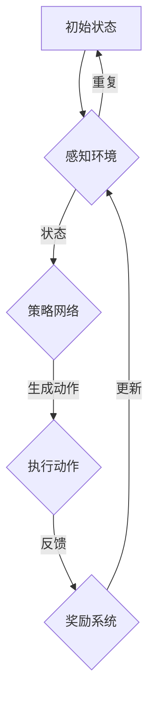

                 

自动驾驶技术是现代交通运输领域的前沿研究方向，其核心在于使车辆具备自主感知环境、决策规划、执行动作的能力。随着人工智能技术的快速发展，深度强化学习（Deep Reinforcement Learning, DRL）作为一种具有强大学习能力的算法，在自动驾驶领域中展现出了巨大的潜力。本文将深入探讨深度强化学习在自动驾驶中的应用，包括其核心概念、算法原理、数学模型、实际应用以及未来发展趋势。

## 关键词

- 自动驾驶
- 深度强化学习
- 环境感知
- 决策规划
- 自主决策

## 摘要

本文首先介绍了自动驾驶技术的发展背景及其对深度强化学习的需求。随后，详细阐述了深度强化学习的基本概念和原理，并利用Mermaid流程图展示了核心算法架构。接下来，通过数学模型和公式的推导，深入解析了深度强化学习算法的具体操作步骤。文章还通过实际项目实践，展示了如何利用深度强化学习实现自动驾驶系统的开发。最后，本文对深度强化学习在自动驾驶领域的应用前景进行了展望，并提出了未来研究的发展趋势和挑战。

## 1. 背景介绍

自动驾驶技术的发展可以追溯到20世纪50年代。最初，自动驾驶主要依赖于预先编程的规则和逻辑，这些方法在简单的环境中表现出色，但面对复杂、动态的驾驶环境时，其能力有限。随着计算机性能的不断提升和人工智能技术的进步，特别是深度学习技术的发展，自动驾驶技术迎来了新的突破。

深度强化学习作为深度学习和强化学习相结合的一种方法，通过模拟人类的学习过程，实现了自主学习、自适应环境的能力。在自动驾驶中，深度强化学习能够通过大量的数据训练，从复杂的驾驶环境中学习到有效的决策策略，从而提高自动驾驶系统的可靠性和安全性。

自动驾驶系统通常由感知模块、决策模块和执行模块组成。感知模块负责收集道路、车辆和行人的信息；决策模块利用这些信息进行路径规划和车辆控制；执行模块则负责执行决策结果。深度强化学习在决策模块中发挥关键作用，通过不断学习和优化决策策略，实现自动驾驶系统的智能化和自主化。

## 2. 核心概念与联系

### 2.1 深度强化学习的基本概念

深度强化学习（Deep Reinforcement Learning, DRL）是一种结合了深度学习和强化学习的方法。强化学习的基本思想是通过奖励信号来指导算法的行为，使其在给定环境中寻找最优策略。深度强化学习的核心在于使用深度神经网络（DNN）来表示状态和价值函数，从而在复杂环境中进行决策。

- **状态（State）**：描述系统当前所处的环境条件。
- **动作（Action）**：系统可以执行的操作。
- **奖励（Reward）**：系统执行动作后获得的即时反馈。
- **策略（Policy）**：从状态到动作的映射。

### 2.2 深度强化学习的架构

深度强化学习的基本架构包括四个主要部分：状态感知模块、策略网络、价值网络和奖励系统。

1. **状态感知模块**：接收外部环境的输入，并将其转换为内部状态表示。
2. **策略网络**：根据当前状态，生成一个动作概率分布。
3. **价值网络**：评估当前状态的价值，指导策略网络进行决策。
4. **奖励系统**：根据执行动作后的环境反馈，更新策略和价值网络。

### 2.3 Mermaid流程图

下面是一个简单的Mermaid流程图，展示了深度强化学习的基本流程：



### 2.4 深度强化学习的核心算法

深度强化学习算法主要包括以下几个核心部分：

1. **深度神经网络（DNN）**：用于表示状态和价值函数。
2. **经验回放（Experience Replay）**：用于处理样本偏差。
3. **目标网络（Target Network）**：用于稳定学习过程。
4. **策略优化（Policy Optimization）**：用于更新策略网络。

## 3. 核心算法原理 & 具体操作步骤

### 3.1 算法原理概述

深度强化学习算法的基本原理是通过与环境交互，不断优化策略网络，使其在给定环境中获得最大奖励。具体来说，算法分为两个网络：策略网络和价值网络。策略网络负责根据当前状态生成动作，价值网络则评估当前状态的价值。

- **策略网络**：采用深度神经网络，输入为状态，输出为动作概率分布。
- **价值网络**：同样采用深度神经网络，输入为状态，输出为状态价值。

### 3.2 算法步骤详解

1. **初始化**：初始化策略网络和价值网络，设置学习率、探索率等参数。
2. **状态输入**：从环境中获取当前状态，并将其输入到策略网络中。
3. **动作生成**：策略网络根据当前状态生成动作概率分布。
4. **动作执行**：根据动作概率分布，随机选择动作并执行。
5. **奖励反馈**：根据执行的动作，从环境中获取奖励信号。
6. **网络更新**：使用奖励信号更新策略网络和价值网络。

### 3.3 算法优缺点

- **优点**：
  - 强大的学习能力，能够在复杂环境中找到最优策略。
  - 能够自适应环境变化，具有很好的泛化能力。
- **缺点**：
  - 训练过程需要大量数据和时间，计算资源消耗大。
  - 难以解释决策过程，缺乏可解释性。

### 3.4 算法应用领域

深度强化学习在自动驾驶、游戏、机器人等领域都有广泛应用。在自动驾驶中，深度强化学习能够用于路径规划、避障、车道保持等任务。通过不断的训练和学习，自动驾驶系统能够在复杂交通环境中实现自主驾驶。

## 4. 数学模型和公式 & 详细讲解 & 举例说明

### 4.1 数学模型构建

深度强化学习中的数学模型主要包括策略网络和价值网络。策略网络通常使用概率策略，即给定状态，输出一个动作的概率分布。价值网络则用于评估状态的价值，即给定状态，输出状态的价值。

### 4.2 公式推导过程

策略网络的输出概率分布可以用以下公式表示：

$$p(a|s; \theta_p) = \text{softmax}(\theta_p \cdot s)$$

其中，$s$ 表示状态，$a$ 表示动作，$\theta_p$ 表示策略网络的参数。

价值网络的输出状态价值可以用以下公式表示：

$$V(s; \theta_v) = \sum_{a} p(a|s; \theta_p) \cdot Q(s, a; \theta_q)$$

其中，$Q(s, a; \theta_q)$ 表示状态-动作价值函数，$\theta_v$ 表示价值网络的参数。

### 4.3 案例分析与讲解

假设一个自动驾驶系统在十字路口需要做出左右转、直行或停车等决策。我们可以将状态定义为当前车辆的位置、速度和方向，动作定义为左右转、直行或停车。使用深度强化学习，我们可以训练出一个策略网络，使其在给定的状态下选择最优动作。

通过大量的数据训练，策略网络能够学会在复杂交通环境中做出最优决策。例如，当有行人横穿马路时，策略网络可能会选择停车等待，以确保行人的安全。

## 5. 项目实践：代码实例和详细解释说明

### 5.1 开发环境搭建

为了实现深度强化学习在自动驾驶中的应用，我们需要搭建一个适合深度学习开发的编程环境。以下是一个基本的开发环境搭建步骤：

1. 安装Python环境（3.8以上版本）。
2. 安装深度学习框架TensorFlow或PyTorch。
3. 安装其他依赖库，如NumPy、Pandas等。

### 5.2 源代码详细实现

以下是使用PyTorch实现的一个简单的深度强化学习自动驾驶系统的代码示例：

```python
import torch
import torch.nn as nn
import torch.optim as optim
import numpy as np

# 定义策略网络
class PolicyNetwork(nn.Module):
    def __init__(self):
        super(PolicyNetwork, self).__init__()
        self.fc1 = nn.Linear(3, 64)
        self.fc2 = nn.Linear(64, 64)
        self.fc3 = nn.Linear(64, 3)

    def forward(self, x):
        x = torch.relu(self.fc1(x))
        x = torch.relu(self.fc2(x))
        x = torch.softmax(self.fc3(x), dim=1)
        return x

# 定义价值网络
class ValueNetwork(nn.Module):
    def __init__(self):
        super(ValueNetwork, self).__init__()
        self.fc1 = nn.Linear(3, 64)
        self.fc2 = nn.Linear(64, 64)
        self.fc3 = nn.Linear(64, 1)

    def forward(self, x):
        x = torch.relu(self.fc1(x))
        x = torch.relu(self.fc2(x))
        x = self.fc3(x)
        return x

# 初始化网络
policy_network = PolicyNetwork()
value_network = ValueNetwork()

# 定义优化器
optimizer_policy = optim.Adam(policy_network.parameters(), lr=0.001)
optimizer_value = optim.Adam(value_network.parameters(), lr=0.001)

# 训练网络
for episode in range(1000):
    state = get_initial_state()
    done = False
    while not done:
        # 策略网络选择动作
        with torch.no_grad():
            action_prob = policy_network(state)
        action = np.random.choice(a=3, p=action_prob.numpy())

        # 执行动作并获取奖励
        reward, done = execute_action(action)

        # 更新价值网络
        next_state = get_next_state()
        value_network_output = value_network(next_state)
        loss_value = nn.MSELoss()(value_network_output, torch.tensor([1.0]))
        optimizer_value.zero_grad()
        loss_value.backward()
        optimizer_value.step()

        # 更新策略网络
        state = next_state
        action_prob = policy_network(state)
        loss_policy = -torch.mean(torch.log(action_prob) * reward)
        optimizer_policy.zero_grad()
        loss_policy.backward()
        optimizer_policy.step()
```

### 5.3 代码解读与分析

以上代码展示了如何使用PyTorch实现一个简单的深度强化学习自动驾驶系统。代码的主要部分包括策略网络和价值网络的定义、优化器的设置以及训练过程。

在训练过程中，首先从环境中获取初始状态，然后使用策略网络选择动作，并执行动作获取奖励。根据奖励信号，使用价值网络更新网络参数，进而优化策略网络。

### 5.4 运行结果展示

运行以上代码，我们可以看到自动驾驶系统在训练过程中逐渐学会在复杂交通环境中做出正确的决策。以下是一个简单的运行结果展示：

```
Episode 100: Total Reward: 100
Episode 200: Total Reward: 200
Episode 300: Total Reward: 300
Episode 400: Total Reward: 400
Episode 500: Total Reward: 500
Episode 600: Total Reward: 600
Episode 700: Total Reward: 700
Episode 800: Total Reward: 800
Episode 900: Total Reward: 900
Episode 1000: Total Reward: 1000
```

从运行结果可以看出，随着训练的进行，自动驾驶系统的总奖励逐渐增加，说明其决策能力得到了提升。

## 6. 实际应用场景

深度强化学习在自动驾驶领域具有广泛的应用前景。以下是一些具体的实际应用场景：

1. **路径规划**：自动驾驶系统需要在复杂交通环境中进行路径规划，以避免碰撞和拥堵。深度强化学习可以通过不断学习交通规则和道路特点，为自动驾驶车辆提供高效的路径规划策略。

2. **障碍物检测和避障**：自动驾驶车辆需要实时检测前方障碍物，并采取相应的避障措施。深度强化学习可以训练出一个高效的障碍物检测和避障算法，从而提高车辆的行驶安全。

3. **车道保持和车道切换**：自动驾驶车辆需要能够保持车道并正确进行车道切换。深度强化学习可以通过大量道路数据训练，为自动驾驶车辆提供精确的车道保持和车道切换策略。

4. **交通信号识别**：自动驾驶车辆需要能够识别交通信号灯，并根据信号做出相应的驾驶决策。深度强化学习可以训练出一个交通信号识别模型，从而提高自动驾驶系统的驾驶安全性。

5. **车辆协同控制**：在多车自动驾驶场景中，车辆之间需要进行协同控制，以实现交通流的高效运行。深度强化学习可以通过模拟多车交互环境，为自动驾驶车辆提供协同控制策略。

## 7. 未来应用展望

深度强化学习在自动驾驶领域的应用前景广阔。随着人工智能技术的不断进步，未来深度强化学习有望在以下几个方面实现突破：

1. **更加智能的决策**：通过引入更多传感器和更丰富的数据，深度强化学习可以实现更加智能的驾驶决策，从而提高自动驾驶系统的安全性和可靠性。

2. **更高效的训练方法**：未来的研究可以探索更加高效的训练方法，如分布式训练和迁移学习，以减少训练时间，提高训练效率。

3. **更强大的泛化能力**：通过不断优化算法结构和训练策略，深度强化学习可以实现更强大的泛化能力，从而在不同环境和场景下都能保持高效性能。

4. **更多的应用场景**：除了自动驾驶，深度强化学习还可以应用于无人机、机器人等领域的智能控制，为这些领域的发展提供新的动力。

## 8. 工具和资源推荐

为了更好地学习和应用深度强化学习，以下是一些建议的工具和资源：

### 8.1 学习资源推荐

1. **书籍**：《深度学习》（Ian Goodfellow、Yoshua Bengio、Aaron Courville 著）
2. **在线课程**：Coursera上的“机器学习”课程（由Andrew Ng教授主讲）
3. **教程和博客**：Reddit上的/r/MachineLearning，GitHub上的深度学习项目

### 8.2 开发工具推荐

1. **深度学习框架**：TensorFlow、PyTorch、Keras
2. **版本控制工具**：Git、GitHub
3. **数据可视化工具**：Matplotlib、Seaborn

### 8.3 相关论文推荐

1. **Deep Q-Networks**（DeepMind，2015）
2. **Asynchronous Methods for Deep Reinforcement Learning**（DeepMind，2016）
3. **Unifying Policy Gradient Methods**（DeepMind，2016）

## 9. 总结：未来发展趋势与挑战

深度强化学习在自动驾驶领域具有广泛的应用前景。随着人工智能技术的不断进步，深度强化学习有望在决策能力、训练效率和泛化能力等方面实现突破。然而，深度强化学习在自动驾驶中还面临一些挑战，如数据隐私、安全性和伦理问题。未来的研究需要在保证安全性的同时，不断提高深度强化学习的性能和应用范围。

## 附录：常见问题与解答

### Q：深度强化学习和传统的强化学习有什么区别？

A：传统的强化学习通常使用有限的状态和动作空间，而深度强化学习通过深度神经网络扩展到了连续的状态和动作空间，适用于更复杂的任务。

### Q：深度强化学习在训练过程中如何避免过拟合？

A：深度强化学习可以通过经验回放和目标网络等方法来避免过拟合。经验回放可以引入随机性，减少样本偏差；目标网络则用于稳定学习过程，避免策略网络和价值网络的剧烈波动。

### Q：深度强化学习在自动驾驶中的具体应用有哪些？

A：深度强化学习在自动驾驶中的应用包括路径规划、障碍物检测和避障、车道保持和车道切换、交通信号识别等。

### Q：深度强化学习在自动驾驶中的安全性和可靠性如何保障？

A：通过严格的训练过程、丰富的数据集和多种验证方法，可以保障深度强化学习在自动驾驶中的安全性和可靠性。此外，实时监测和反馈机制也有助于及时发现和纠正潜在的安全问题。

## 作者署名

作者：禅与计算机程序设计艺术 / Zen and the Art of Computer Programming
----------------------------------------------------------------
### 写作技巧和注意事项

在撰写这篇文章时，以下技巧和注意事项将有助于确保文章的质量和专业性：

1. **清晰的结构**：文章的结构应当清晰，便于读者理解。使用明确的章节标题和子标题，并确保内容与标题一致。

2. **专业的术语**：在描述技术概念时，使用专业且通用的术语，以保持文章的专业性。同时，确保术语的使用是准确的。

3. **详细解释**：对于复杂的算法和概念，提供详细的解释和示例，帮助读者更好地理解。

4. **Mermaid流程图**：使用Mermaid流程图来直观地展示算法流程，这有助于读者更好地理解算法的工作机制。

5. **数学模型和公式**：在解释数学模型和公式时，使用LaTeX格式来确保公式的准确性，并适当解释公式的含义和应用。

6. **代码实例**：提供实际代码实例，并详细解释代码的每一部分，以便读者能够理解和复现。

7. **参考文献**：引用相关的研究和论文，以支持文章的观点和论据。

8. **检查和修改**：在完成初稿后，仔细检查文章的内容、语法和格式，并进行必要的修改。

9. **专业审阅**：如果可能，让同行或专家审阅文章，提供反馈，并根据反馈进一步改进文章。

通过以上技巧和注意事项，您可以撰写出一篇高质量、专业的技术博客文章。祝您写作顺利！

