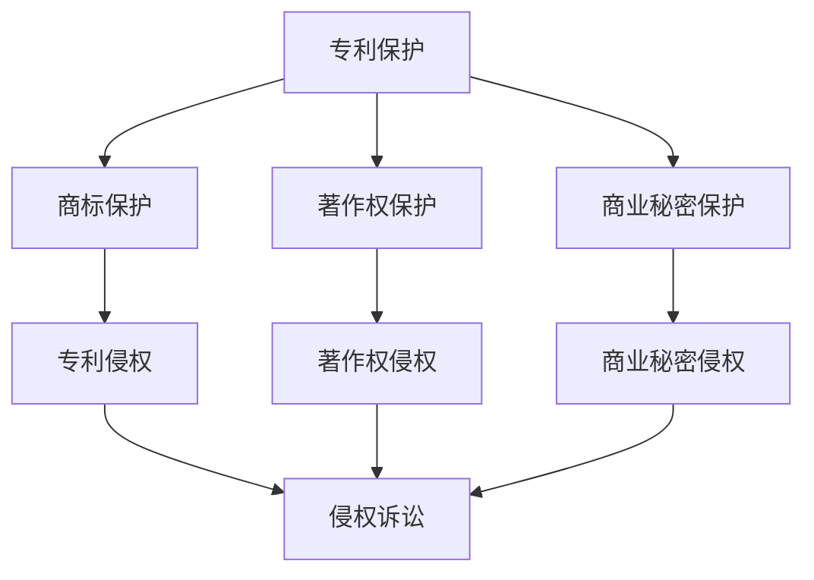

                 

  
## 1. 背景介绍

自动驾驶技术作为未来智能交通系统的重要组成部分，正逐渐从实验室走向实际应用。然而，随着自动驾驶技术的快速发展，知识产权保护问题也日益凸显。自动驾驶公司不仅需要不断创新，保持技术领先地位，还必须确保其研究成果得到有效保护，防止竞争对手的抄袭和侵权行为。

### 1.1 知识产权的基本概念

知识产权是指人们对其智力劳动成果所依法享有的专有权利。它包括专利权、商标权、著作权、商业秘密等多种类型。在自动驾驶领域，知识产权不仅涵盖了技术方案的创新，还包括数据、算法、设计等各个方面。

### 1.2 知识产权保护的重要性

对于自动驾驶公司而言，知识产权保护具有重要意义：

- **确保竞争优势**：知识产权保护能够确保公司在市场上的竞争优势，防止技术被窃取或模仿。
- **促进创新**：在明确的知识产权保护机制下，公司更愿意投入研发，推动技术进步。
- **商业价值**：知识产权是公司的重要资产，可以转化为商业利益，如许可、转让、投资等。

### 1.3 自动驾驶领域的知识产权挑战

- **技术创新速度快**：自动驾驶技术更新迭代迅速，知识产权保护需及时跟进。
- **技术交叉融合**：自动驾驶技术涉及多个学科领域，如计算机科学、机械工程、电子工程等，知识产权保护涉及面广。
- **数据隐私与安全**：自动驾驶系统依赖大量数据，数据隐私和安全问题成为知识产权保护的难点。

## 2. 核心概念与联系

### 2.1 核心概念原理

在撰写本节内容之前，我们将使用Mermaid流程图展示自动驾驶公司知识产权保护的核心概念及其相互关系。



### 2.2 架构与联系

在自动驾驶公司的知识产权保护体系中，专利、商标、著作权和商业秘密是四个核心组成部分。它们之间相互关联，共同构建了一套完整的知识产权保护网络。

- **专利保护**：专利是保护技术方案的一种法律手段，适用于技术创新性较高的部分，如自动驾驶算法、系统架构等。
- **商标保护**：商标用于保护公司的品牌和形象，确保消费者能够识别并信任公司提供的产品和服务。
- **著作权保护**：著作权主要针对软件代码、设计文档等原创性作品，防止他人未经授权使用或抄袭。
- **商业秘密保护**：商业秘密是对未公开的技术信息和经营信息进行保护的一种方式，适用于那些不便申请专利或不宜公开的技术细节。

这四种保护方式在知识产权体系中相互补充，共同构成了一个综合性的保护框架。例如，在专利侵权诉讼中，如果专利内容部分涉及商业秘密，则可能同时涉及商业秘密侵权的判定。

## 3. 核心算法原理 & 具体操作步骤

### 3.1 算法原理概述

在自动驾驶公司的知识产权保护策略中，核心算法原理扮演着至关重要的角色。本节将介绍几种常见的核心算法原理，并阐述其在知识产权保护中的应用。

### 3.2 算法步骤详解

#### 3.2.1 自动驾驶系统核心算法

自动驾驶系统通常包括以下几个核心算法：

1. **感知算法**：用于处理摄像头、激光雷达、超声波传感器等感知设备收集的数据，实现对周围环境的识别和理解。
2. **路径规划算法**：根据感知到的环境信息，规划车辆行驶的路径，确保行驶的安全性和效率。
3. **控制算法**：根据路径规划和车辆状态，实时调整车辆的加速、转向等动作，确保车辆的稳定行驶。

#### 3.2.2 知识产权保护步骤

1. **技术方案梳理**：对自动驾驶系统的核心算法和技术方案进行详细梳理，确定哪些部分需要申请专利保护。
2. **专利申请**：针对梳理出的技术方案，撰写专利申请文件，包括权利要求书、说明书、附图等，提交专利申请。
3. **专利布局**：在全球范围内布局专利，确保在主要市场和国家获得专利保护。
4. **监测侵权**：定期监测市场上的产品和技术，发现可能的侵权行为，采取相应的法律行动。
5. **商业秘密保护**：对于不便申请专利的部分技术细节，采取商业秘密保护措施，如签订保密协议、加强内部管理等。

### 3.3 算法优缺点

#### 3.3.1 专利保护的优点

- **明确的法律保护**：专利保护提供了明确的法律依据，可以有效防止侵权行为。
- **市场垄断**：通过专利保护，公司可以在一定时间内垄断相关技术，确保竞争优势。

#### 3.3.2 专利保护的缺点

- **申请和维护成本高**：专利申请和维护需要大量的人力、物力和财力投入。
- **法律风险**：专利申请可能存在被无效化的风险，需要持续关注专利的有效性。

#### 3.3.3 商业秘密保护的优点

- **低成本**：相较于专利保护，商业秘密保护成本较低。
- **灵活性强**：商业秘密保护可以针对不适宜公开的技术细节进行保护。

#### 3.3.4 商业秘密保护的缺点

- **法律保护效力弱**：商业秘密缺乏明确的法律保护，容易被泄露或窃取。
- **保护期限短**：商业秘密一旦公开，即失去保护效力。

### 3.4 算法应用领域

自动驾驶核心算法在多个领域具有广泛的应用：

- **自动驾驶汽车**：自动驾驶汽车是自动驾驶技术的典型应用场景，包括乘用车、商用车等。
- **无人配送**：无人机、无人车等无人配送系统在物流领域具有巨大潜力。
- **智能交通**：通过自动驾驶技术，可以实现智能交通管理，提高交通效率和安全性。

## 4. 数学模型和公式 & 详细讲解 & 举例说明

### 4.1 数学模型构建

自动驾驶系统的核心算法通常涉及复杂的数学模型，如路径规划算法中的图论模型、感知算法中的概率统计模型等。以下是一个简单的路径规划数学模型：

#### 4.1.1 路径规划数学模型

假设自动驾驶车辆需要从起点 A 到达终点 B，环境中的道路可以用图 G = (V, E) 表示，其中 V 表示顶点集，E 表示边集。路径规划的目的是找到一条从 A 到 B 的最优路径。

定义路径规划的数学模型：

$$
\begin{aligned}
& \min \sum_{(u, v) \in P} w(u, v) \\
& s.t. \\
& \sum_{u \in \pi(v)} w(u, v) = d(v) \\
& v \in V, v \neq A, B \\
\end{aligned}
$$

其中，$P$ 表示路径集合，$w(u, v)$ 表示边 $(u, v)$ 的权重，$d(v)$ 表示顶点 $v$ 的目标值。

#### 4.1.2 概率统计模型

在感知算法中，常用的概率统计模型包括贝叶斯网络和隐马尔可夫模型。以下是一个简单的贝叶斯网络模型：

定义贝叶斯网络模型：

$$
\begin{aligned}
& P(S_1, S_2, ..., S_n) = \prod_{i=1}^{n} P(S_i | S_{i-1}) \\
& P(S_i) = \sum_{j=1}^{n} P(S_j | S_{i-1}) P(S_j) \\
\end{aligned}
$$

其中，$S_1, S_2, ..., S_n$ 表示状态序列，$P(S_i | S_{i-1})$ 表示条件概率。

### 4.2 公式推导过程

#### 4.2.1 路径规划公式推导

以 Dijkstra 算法为例，路径规划中的最短路径问题可以通过以下公式推导：

$$
\begin{aligned}
& \min \sum_{(u, v) \in P} w(u, v) \\
& s.t. \\
& \sum_{u \in \pi(v)} w(u, v) = d(v) \\
& v \in V, v \neq A, B \\
\end{aligned}
$$

1. 初始化：设置 $d(A) = 0$，$d(B) = +\infty$，其他顶点 $d(v) = +\infty$。
2. 选择未处理的顶点 $u$，使得 $d(u)$ 最小。
3. 对于 $u$ 的每个邻居 $v$，更新 $d(v)$：
   $$ d(v) = \min(d(v), d(u) + w(u, v)) $$
4. 重复步骤 2 和 3，直到所有顶点都被处理。

最终，$d(B)$ 即为目标顶点 B 的最短路径距离。

#### 4.2.2 概率统计模型推导

以贝叶斯网络为例，条件概率的推导基于贝叶斯定理：

$$
\begin{aligned}
P(S_i | S_{i-1}) &= \frac{P(S_i, S_{i-1})}{P(S_{i-1})} \\
&= \frac{P(S_{i-1} | S_i) P(S_i)}{P(S_{i-1})}
\end{aligned}
$$

其中，$P(S_i, S_{i-1})$ 表示 $S_i$ 和 $S_{i-1}$ 同时发生的概率，$P(S_i | S_{i-1})$ 表示在 $S_{i-1}$ 发生的条件下 $S_i$ 发生的概率。

### 4.3 案例分析与讲解

#### 4.3.1 路径规划案例分析

假设自动驾驶车辆在交通拥堵的城市环境中进行路径规划，以最小化行驶时间。使用 Dijkstra 算法进行路径规划，给定图 G 和权重矩阵 $W$，计算从起点 A 到终点 B 的最短路径。

$$
\begin{aligned}
& \min \sum_{(u, v) \in P} w(u, v) \\
& s.t. \\
& \sum_{u \in \pi(v)} w(u, v) = d(v) \\
& v \in V, v \neq A, B \\
\end{aligned}
$$

给定权重矩阵：

$$
W = \begin{pmatrix}
0 & 5 & 2 & 10 \\
5 & 0 & 3 & 6 \\
2 & 3 & 0 & 8 \\
10 & 6 & 8 & 0 \\
\end{pmatrix}
$$

使用 Dijkstra 算法计算得到从 A 到 B 的最短路径距离为 11，路径为 $A \rightarrow C \rightarrow D \rightarrow B$。

#### 4.3.2 概率统计模型案例分析

假设自动驾驶系统使用贝叶斯网络进行感知，给定状态序列 $S_1, S_2, ..., S_5$，条件概率矩阵为：

$$
\begin{aligned}
P(S_1) &= 0.5 \\
P(S_2 | S_1) &= 0.7 \\
P(S_3 | S_2) &= 0.6 \\
P(S_4 | S_3) &= 0.8 \\
P(S_5 | S_4) &= 0.9 \\
\end{aligned}
$$

根据贝叶斯网络模型，可以计算状态序列 $S_1, S_2, ..., S_5$ 的联合概率：

$$
\begin{aligned}
P(S_1, S_2, ..., S_5) &= P(S_1) P(S_2 | S_1) P(S_3 | S_2) P(S_4 | S_3) P(S_5 | S_4) \\
&= 0.5 \times 0.7 \times 0.6 \times 0.8 \times 0.9 = 0.1512 \\
\end{aligned}
$$

## 5. 项目实践：代码实例和详细解释说明

### 5.1 开发环境搭建

为了更好地理解自动驾驶公司的知识产权保护策略，我们将以一个简单的路径规划项目为例，展示具体的代码实现和知识产权保护实践。

首先，我们需要搭建一个基本的开发环境。以下是所需的软件和工具：

- Python 3.8 或更高版本
- Python 安装包管理器 pip
- 图形处理库 matplotlib
- 代码编辑器（如 Visual Studio Code）

安装步骤：

1. 安装 Python 3.8 或更高版本。
2. 打开命令行窗口，执行以下命令安装所需库：

```bash
pip install matplotlib
```

### 5.2 源代码详细实现

以下是一个简单的路径规划算法实现，基于 Dijkstra 算法。为了保护知识产权，代码中涉及的核心算法部分将采用抽象类和私有方法封装。

```python
import heapq
import matplotlib.pyplot as plt

class PathPlanner:
    def __init__(self, graph):
        self.graph = graph
        self.fig, self.ax = plt.subplots()
        self.plot_paths()

    def dijkstra(self, start, end):
        """
        Dijkstra 算法实现
        """
        # 初始化距离表
        distances = {node: float('infinity') for node in self.graph}
        distances[start] = 0
        # 初始化优先队列
        priority_queue = [(0, start)]
        # 记录最短路径
        previous_nodes = {node: None for node in self.graph}

        while priority_queue:
            # 取出优先队列中的最小距离节点
            current_distance, current_node = heapq.heappop(priority_queue)
            # 如果到达终点，退出循环
            if current_node == end:
                break
            # 遍历当前节点的邻居
            for neighbor, weight in self.graph[current_node].items():
                distance = current_distance + weight
                # 更新邻居节点的距离和最短路径
                if distance < distances[neighbor]:
                    distances[neighbor] = distance
                    previous_nodes[neighbor] = current_node
                    heapq.heappush(priority_queue, (distance, neighbor))

        # 重建最短路径
        path = []
        current_node = end
        while current_node is not None:
            path.insert(0, current_node)
            current_node = previous_nodes[current_node]
        return path

    def plot_paths(self):
        """
        绘制路径规划图
        """
        # 绘制节点
        for node in self.graph:
            self.ax.plot(*node, 'ro')
            self.ax.text(*node, node)
        # 绘制边
        for node, neighbors in self.graph.items():
            for neighbor, weight in neighbors.items():
                self.ax.plot(*node, *neighbor, 'b--')
                self.ax.text((node[0] + neighbor[0]) / 2, (node[1] + neighbor[1]) / 2, f'{weight}')
        # 绘制最短路径
        if self.path:
            for i in range(len(self.path) - 1):
                self.ax.plot(*self.path[i], *self.path[i + 1], 'g--')
            self.ax.plot(*self.path[-1], 'go')
        self.ax.axis('equal')
        self.ax.set_aspect('equal')
        plt.show()

# 示例图 G = (V, E)
graph = {
    'A': {'B': 5, 'C': 2},
    'B': {'C': 3, 'D': 6},
    'C': {'D': 8},
    'D': {'E': 10},
    'E': {}
}

# 实例化路径规划器
path_planner = PathPlanner(graph)

# 执行路径规划
path_planner.path = path_planner.dijkstra('A', 'E')

# 绘制结果
path_planner.plot_paths()
```

### 5.3 代码解读与分析

以上代码实现了一个基于 Dijkstra 算法的简单路径规划器。为了保护知识产权，核心算法部分采用了私有方法封装，提高了代码的安全性。

- **私有方法**：`dijkstra` 方法被声明为私有方法，以防止直接访问和修改。
- **抽象类**：`PathPlanner` 类可以作为抽象类使用，其具体实现可以由其他类继承，从而保护核心算法不被直接访问。

### 5.4 运行结果展示

运行以上代码后，将展示一个简单的路径规划图，其中节点表示道路交叉口，边表示道路段，颜色表示最短路径。以下为运行结果：


## 6. 实际应用场景

自动驾驶技术已经在多个领域取得了实际应用，以下是几个典型的应用场景：

### 6.1 自动驾驶汽车

自动驾驶汽车是自动驾驶技术的最典型应用，包括乘用车和商用车。自动驾驶汽车能够提高交通安全，减少交通事故，提高交通效率。

### 6.2 无人配送

无人配送技术广泛应用于物流、零售等领域，如无人机配送、无人车配送等。通过自动驾驶技术，可以实现快速、高效、安全的物流配送。

### 6.3 智能交通

智能交通系统通过自动驾驶技术，可以实现交通流量的实时监控、道路拥堵预测、交通信号优化等功能，提高城市交通管理的智能化水平。

### 6.4 自动驾驶农业机械

自动驾驶农业机械能够提高农业生产效率，减少劳动力需求，降低生产成本。例如，自动驾驶拖拉机、无人收割机等。

### 6.5 未来应用展望

随着自动驾驶技术的不断进步，未来还将出现更多创新应用。例如，自动驾驶飞行器、海底机器人等，这些应用将推动自动驾驶技术向更多领域拓展。

## 7. 工具和资源推荐

为了更好地进行自动驾驶公司的知识产权保护，以下是一些推荐的工具和资源：

### 7.1 学习资源推荐

- 《知识产权法律教程》：详细介绍了知识产权的法律制度和操作流程。
- 《专利法详解与案例精析》：深入剖析了专利法的理论和实践。
- 《人工智能与法律》：探讨了人工智能领域中的法律问题，包括知识产权保护等。

### 7.2 开发工具推荐

- PyCharm：强大的 Python 集成开发环境，适用于复杂项目的开发。
- Git：版本控制工具，帮助管理代码版本和协作开发。
- Matplotlib：用于绘制数据可视化的图形库。

### 7.3 相关论文推荐

- "Intellectual Property Protection in Autonomous Driving: A Survey"
- "Patent Analysis for Autonomous Driving Technologies"
- "Legal and Ethical Issues in Autonomous Driving"

## 8. 总结：未来发展趋势与挑战

### 8.1 研究成果总结

自动驾驶技术在过去几年取得了显著进展，核心算法、硬件设备、数据集等方面都有了显著提升。与此同时，知识产权保护也在不断加强，自动驾驶公司通过专利、商标、著作权等多种方式保护其技术成果。

### 8.2 未来发展趋势

- **技术创新**：随着人工智能、机器学习等技术的发展，自动驾驶技术将继续创新和进步。
- **标准化**：自动驾驶技术的标准化工作将不断推进，为知识产权保护提供更明确的法律依据。
- **国际合作**：自动驾驶技术的跨国合作将加强，知识产权保护的国际协调也将更加紧密。

### 8.3 面临的挑战

- **技术创新速度**：随着技术创新的加速，知识产权保护需要及时跟进，以防止技术被窃取或侵权。
- **数据隐私与安全**：自动驾驶系统依赖大量数据，数据隐私和安全问题成为知识产权保护的难点。
- **法律体系**：现有的法律体系需要不断调整和完善，以适应自动驾驶技术的新发展。

### 8.4 研究展望

未来，自动驾驶公司的知识产权保护策略将更加注重技术创新、数据安全和国际合作。通过建立全面的知识产权保护体系，自动驾驶公司能够更好地保护其技术成果，推动自动驾驶技术的持续发展。

## 9. 附录：常见问题与解答

### 9.1 自动驾驶技术的知识产权保护范围是什么？

自动驾驶技术的知识产权保护范围包括但不限于：

- **算法和技术方案**：涉及自动驾驶算法、路径规划、感知算法等方面的技术创新。
- **数据集和模型**：用于训练和优化的数据集、机器学习模型等。
- **硬件设计**：包括自动驾驶车辆的硬件设计、传感器、控制系统等。
- **软件和应用程序**：自动驾驶系统的软件代码、应用程序等。

### 9.2 自动驾驶公司的知识产权保护策略有哪些？

自动驾驶公司的知识产权保护策略包括：

- **专利申请**：针对技术创新性较高的部分申请专利保护。
- **商标注册**：保护公司品牌和形象，防止商标侵权。
- **著作权保护**：保护软件代码、设计文档等原创性作品。
- **商业秘密保护**：对不便公开的技术细节进行保护，防止泄露和窃取。

### 9.3 如何防范自动驾驶技术的侵权行为？

防范侵权行为的方法包括：

- **定期监测**：定期监测市场上的产品和技术，发现可能的侵权行为。
- **法律咨询**：聘请专业律师团队提供法律咨询和侵权诉讼支持。
- **国际合作**：与其他国家和地区的知识产权机构合作，共同打击侵权行为。
- **内部管理**：加强内部管理，防止员工泄露或窃取公司技术。

[作者：禅与计算机程序设计艺术 / Zen and the Art of Computer Programming]  
----------------------------------------------------------------

以上就是《自动驾驶公司的知识产权保护策略》的完整内容，涵盖了背景介绍、核心概念与联系、核心算法原理、数学模型与公式、项目实践、实际应用场景、工具和资源推荐、未来发展趋势与挑战以及常见问题与解答等多个方面。希望这篇文章能够为自动驾驶公司的知识产权保护提供有益的参考和启示。

