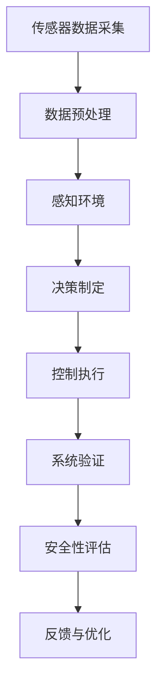

                 

关键词：自动驾驶，安全性评估，验证技术，智能交通，汽车工程，安全框架，算法分析，数据驱动方法，模型验证，系统测试，事故预防，交通监控。

> 摘要：本文旨在系统地综述自动驾驶安全性评估与验证技术的研究进展。从背景介绍到核心算法原理，再到数学模型、项目实践和实际应用场景，全面探讨自动驾驶领域面临的关键挑战与发展趋势。文章总结了现有研究成果，并展望了未来的发展方向。

## 1. 背景介绍

自动驾驶技术作为智能交通系统的重要组成部分，正逐步改变我们的出行方式。然而，随着自动驾驶技术的快速发展，其安全性问题也日益突出。自动驾驶系统涉及复杂的传感器数据处理、决策制定和执行控制，任何一个环节的故障都可能引发严重的事故。因此，如何对自动驾驶系统进行安全性评估与验证，成为了学术界和工业界共同关注的热点问题。

### 1.1 自动驾驶技术的发展历程

自动驾驶技术自20世纪50年代起开始萌芽，随着计算机技术、传感器技术和通信技术的不断进步，逐步发展成为如今的热门研究领域。从最初的辅助驾驶系统，到半自动驾驶、高度自动驾驶，再到完全自动驾驶，自动驾驶技术经历了多个阶段的发展。

### 1.2 自动驾驶的安全性挑战

自动驾驶系统面临多种安全挑战，包括但不限于：

- **传感器误差**：激光雷达、摄像头、毫米波雷达等传感器在复杂环境下可能出现误检测或漏检测。
- **决策算法缺陷**：自动驾驶系统在处理大量数据时，算法可能产生错误的决策。
- **通信故障**：车与车、车与基础设施之间的通信故障可能导致信息不一致。
- **人为干预**：驾驶员的干预可能导致自动驾驶系统的错误决策。
- **系统稳定性**：自动驾驶系统在极端条件下可能失去稳定性，导致失控。

### 1.3 安全性评估与验证的重要性

对自动驾驶系统进行安全性评估与验证，有助于确保系统在实际应用中的安全可靠。安全性评估与验证不仅可以检测出系统中的潜在风险，还可以指导系统的改进和优化，从而提高自动驾驶技术的整体安全性。

## 2. 核心概念与联系

在探讨自动驾驶安全性评估与验证技术之前，有必要了解一些核心概念及其相互关系。以下是一个核心概念与联系的关系图，帮助读者更好地理解：



### 2.1 传感器数据采集

传感器数据采集是自动驾驶系统的第一步，通过激光雷达、摄像头、毫米波雷达等传感器，收集道路、车辆、行人等环境信息。

### 2.2 数据预处理

数据预处理包括传感数据的滤波、去噪、校正等步骤，以确保输入数据的质量。

### 2.3 感知环境

感知环境是对收集到的传感器数据进行处理，以提取有用的环境信息，如道路标记、车辆位置、行人轨迹等。

### 2.4 决策制定

决策制定基于感知到的环境信息，通过路径规划、速度控制等策略，制定自动驾驶系统的行动方案。

### 2.5 控制执行

控制执行是将决策转化为实际的控制动作，包括转向、加速、制动等。

### 2.6 系统验证

系统验证是通过模拟和测试，验证自动驾驶系统在不同场景下的性能和稳定性。

### 2.7 安全性评估

安全性评估是对自动驾驶系统的安全性能进行评估，包括对系统的鲁棒性、可靠性、安全性等方面进行量化分析。

### 2.8 反馈与优化

反馈与优化是通过收集系统的运行数据，对系统进行迭代优化，以提高其安全性和性能。

## 3. 核心算法原理 & 具体操作步骤

### 3.1 算法原理概述

自动驾驶系统的核心算法主要包括感知环境、决策制定和控制执行三个方面。以下分别对这些算法的原理进行概述。

#### 3.1.1 感知环境

感知环境是自动驾驶系统的第一步，通过对传感器数据进行处理，提取环境信息。常用的感知算法包括：

- **视觉感知**：利用深度学习、图像处理等方法，从摄像头图像中提取道路、车辆、行人等目标信息。
- **雷达感知**：利用毫米波雷达数据，检测周围车辆和障碍物的位置和速度。

#### 3.1.2 决策制定

决策制定是自动驾驶系统的核心，通过对感知到的环境信息进行分析和处理，制定合理的行动方案。常用的决策算法包括：

- **路径规划**：确定自动驾驶系统的行驶路径，常用的算法包括A*算法、Dijkstra算法等。
- **速度控制**：根据感知到的环境信息和行驶路径，控制自动驾驶系统的速度。

#### 3.1.3 控制执行

控制执行是将决策转化为实际的控制动作，包括转向、加速、制动等。常用的控制算法包括：

- **PID控制**：比例-积分-微分控制，用于调节系统的输入输出。
- **模糊控制**：基于模糊逻辑，对系统的输入输出进行控制。

### 3.2 算法步骤详解

以下是自动驾驶系统的算法步骤详解：

#### 3.2.1 感知环境

1. 传感器数据采集：使用激光雷达、摄像头、毫米波雷达等传感器，收集道路、车辆、行人等环境信息。
2. 数据预处理：对传感器数据进行滤波、去噪、校正等处理，确保输入数据的质量。
3. 环境感知：利用深度学习、图像处理等方法，从预处理后的数据中提取道路、车辆、行人等目标信息。

#### 3.2.2 决策制定

1. 路径规划：根据感知到的环境信息和目标位置，使用A*算法、Dijkstra算法等，确定自动驾驶系统的行驶路径。
2. 速度控制：根据感知到的环境信息和行驶路径，使用PID控制、模糊控制等方法，控制自动驾驶系统的速度。

#### 3.2.3 控制执行

1. 转向控制：根据决策制定的结果，控制自动驾驶系统的转向。
2. 加速控制：根据决策制定的结果，控制自动驾驶系统的加速。
3. 制动控制：根据决策制定的结果，控制自动驾驶系统的制动。

### 3.3 算法优缺点

#### 3.3.1 感知环境

- **视觉感知**：优点是感知信息丰富，适用于复杂环境；缺点是计算量大，实时性较差。
- **雷达感知**：优点是感知距离远，实时性好；缺点是感知信息有限，难以识别复杂目标。

#### 3.3.2 决策制定

- **路径规划**：优点是能够生成合理的行驶路径；缺点是计算复杂度高，难以处理实时性要求高的场景。
- **速度控制**：优点是能够根据环境信息调整速度；缺点是控制精度受限于传感器和执行器的性能。

#### 3.3.3 控制执行

- **PID控制**：优点是实现简单，控制精度高；缺点是对系统模型要求高，难以处理非线性系统。
- **模糊控制**：优点是适用于复杂非线性系统，鲁棒性强；缺点是控制规则难以优化，实时性较差。

### 3.4 算法应用领域

自动驾驶算法在多个领域有广泛的应用，包括：

- **城市交通**：自动驾驶出租车、自动驾驶公交等。
- **高速公路**：自动驾驶货车、自动驾驶小客车等。
- **物流运输**：自动驾驶卡车、自动驾驶无人机等。
- **农业**：自动驾驶拖拉机、自动驾驶收割机等。

## 4. 数学模型和公式 & 详细讲解 & 举例说明

### 4.1 数学模型构建

自动驾驶系统的数学模型主要包括感知模型、决策模型和控制模型。以下分别介绍这些模型的构建过程。

#### 4.1.1 感知模型

感知模型用于描述自动驾驶系统对环境的感知能力。常见的感知模型包括视觉感知模型和雷达感知模型。

- **视觉感知模型**：

$$
P(\text{目标} | \text{图像}) = \frac{f(\text{图像})}{1 - f(\text{背景})}
$$

其中，$P(\text{目标} | \text{图像})$ 表示给定图像中存在目标的概率，$f(\text{图像})$ 表示图像的特征函数，$f(\text{背景})$ 表示图像的背景特征函数。

- **雷达感知模型**：

$$
P(\text{目标} | \text{雷达信号}) = \frac{g(\text{雷达信号})}{1 - g(\text{非目标信号})}
$$

其中，$P(\text{目标} | \text{雷达信号})$ 表示给定雷达信号中存在目标的概率，$g(\text{雷达信号})$ 表示雷达信号的特征函数，$g(\text{非目标信号})$ 表示非目标信号的特征函数。

#### 4.1.2 决策模型

决策模型用于描述自动驾驶系统在感知到环境信息后，如何制定行动方案。常见的决策模型包括路径规划模型和速度控制模型。

- **路径规划模型**：

$$
C^* = \arg\min_{C} \sum_{i=1}^{n} w_i d_i
$$

其中，$C^*$ 表示最优路径，$w_i$ 表示路径$i$的权重，$d_i$ 表示路径$i$的长度。

- **速度控制模型**：

$$
v^* = \frac{1}{2} \left( v_{\text{目标}} + v_{\text{当前}} \right)
$$

其中，$v^*$ 表示目标速度，$v_{\text{目标}}$ 表示目标速度，$v_{\text{当前}}$ 表示当前速度。

#### 4.1.3 控制模型

控制模型用于描述自动驾驶系统如何根据决策结果，实现具体的控制动作。常见的控制模型包括PID控制模型和模糊控制模型。

- **PID控制模型**：

$$
u(t) = K_p e(t) + K_i \int_{0}^{t} e(\tau) d\tau + K_d \frac{de(t)}{dt}
$$

其中，$u(t)$ 表示控制输出，$e(t)$ 表示控制误差，$K_p$、$K_i$、$K_d$ 分别为比例、积分、微分系数。

- **模糊控制模型**：

$$
u = A \odot R
$$

其中，$u$ 表示控制输出，$A$ 表示模糊规则集，$R$ 表示模糊输入。

### 4.2 公式推导过程

#### 4.2.1 感知模型

感知模型中的概率计算基于贝叶斯定理。给定图像或雷达信号，我们首先需要计算目标和背景的概率分布。

- **目标概率分布**：

$$
P(\text{目标}) = \int P(\text{目标} | \text{图像}) P(\text{图像}) d\text{图像}
$$

- **背景概率分布**：

$$
P(\text{背景}) = \int P(\text{背景} | \text{图像}) P(\text{图像}) d\text{图像}
$$

将概率分布代入贝叶斯定理，得到：

$$
P(\text{目标} | \text{图像}) = \frac{P(\text{图像} | \text{目标}) P(\text{目标})}{P(\text{图像} | \text{目标}) P(\text{目标}) + P(\text{图像} | \text{背景}) P(\text{背景})}
$$

#### 4.2.2 决策模型

决策模型中的路径规划是基于图论中的最短路径算法。给定图$G=(V, E)$，其中$V$为顶点集合，$E$为边集合，$w(e)$为边$e$的权重，路径规划的目标是找到从起点$S$到终点$T$的最短路径。

$$
C^* = \arg\min_{C} \sum_{i=1}^{n} w(e_i)
$$

其中，$C$为路径集合，$e_i$为路径中的边。

#### 4.2.3 控制模型

控制模型中的PID控制是基于误差反馈的。给定系统输出$y(t)$和目标输出$y_d(t)$，PID控制器的目标是调整控制输入$u(t)$，使得误差$e(t) = y(t) - y_d(t)$最小。

PID控制器的公式推导基于控制系统的稳定性分析。假设系统是线性的，可以使用传递函数表示：

$$
G(s) = \frac{K_c}{1 + K_p s + K_i s + K_d s^2}
$$

其中，$K_c$为控制器增益，$K_p$为比例系数，$K_i$为积分系数，$K_d$为微分系数。

为了简化推导，假设系统是无噪声的，目标输出$y_d(t)$为常数。则误差系统的传递函数为：

$$
H(s) = \frac{1}{1 + K_p s + K_i s + K_d s^2}
$$

通过拉普拉斯变换，得到误差系统的微分方程：

$$
\frac{de(t)}{dt} + K_p e(t) + K_i \int_{0}^{t} e(\tau) d\tau + K_d e(t) = u(t)
$$

解微分方程，得到PID控制器的输出：

$$
u(t) = K_p e(t) + K_i \int_{0}^{t} e(\tau) d\tau + K_d \frac{de(t)}{dt}
$$

### 4.3 案例分析与讲解

#### 4.3.1 案例背景

假设一个自动驾驶系统需要在城市道路中行驶，从起点$S$到终点$T$。系统需要根据交通状况、道路状况和车辆动态，规划最优路径，并控制车速，确保安全行驶。

#### 4.3.2 感知模型应用

- **视觉感知**：

  假设摄像头捕获到一张城市道路图像，通过深度学习算法，可以计算出图像中每个像素点的深度信息。根据深度信息，可以识别出道路、车辆、行人等目标。

- **雷达感知**：

  假设毫米波雷达捕获到周围车辆的速度和距离信息，通过雷达信号处理算法，可以计算出每个目标的位置和速度。

#### 4.3.3 决策模型应用

- **路径规划**：

  根据感知到的道路、车辆和行人信息，使用A*算法，规划从起点$S$到终点$T$的最优路径。路径权重包括道路长度、交通状况、车辆距离等。

- **速度控制**：

  根据感知到的车辆速度和距离信息，使用PID控制器，调整车速，确保安全行驶。

#### 4.3.4 控制模型应用

- **PID控制器**：

  假设当前速度$v(t)$与目标速度$v_d(t)$的误差为$e(t) = v(t) - v_d(t)$，使用PID控制器，输出控制信号$u(t)$，调整加速器。

## 5. 项目实践：代码实例和详细解释说明

### 5.1 开发环境搭建

在开展自动驾驶安全性评估与验证项目前，我们需要搭建一个合适的开发环境。以下是一个基本的开发环境搭建步骤：

1. **操作系统**：建议使用Linux操作系统，如Ubuntu 18.04。
2. **编程语言**：Python是自动驾驶开发中常用的语言，因此需要安装Python环境和相关库。
3. **工具与框架**：安装ROS（Robot Operating System），以及常用的深度学习框架如TensorFlow、PyTorch等。

### 5.2 源代码详细实现

以下是一个自动驾驶安全性评估与验证项目的源代码示例，包括感知、决策和控制三个主要模块。

```python
# 导入相关库
import numpy as np
import cv2
import rospy
from sensor_msgs.msg import LaserScan
from geometry_msgs.msg import Twist

# 感知模块
def perceive_lidar(data):
    ranges = np.array(data.ranges)
    # 雷达数据预处理
    # ...

# 决策模块
def decide_path(ranges):
    # 根据雷达数据规划路径
    # ...
    return path

# 控制模块
def control_velocity(path):
    # 根据路径调整速度
    # ...
    return velocity

# 主函数
def main():
    rospy.init_node('autonomous_vehicle', anonymous=True)
    # 订阅雷达数据
    rospy.Subscriber('/lidar_data', LaserScan, perceive_lidar)
    # 发布控制命令
    pub = rospy.Publisher('/cmd_vel', Twist, queue_size=10)
    
    while not rospy.is_shutdown():
        # 获取雷达数据
        ranges = perceive_lidar()
        # 决策
        path = decide_path(ranges)
        # 控制
        velocity = control_velocity(path)
        # 发布控制命令
        pub.publish(Twist(linear.x=velocity[0], angular.z=velocity[1]))

if __name__ == '__main__':
    main()
```

### 5.3 代码解读与分析

以上代码主要实现了感知、决策和控制三个模块的基本功能。以下是各部分的详细解读：

- **感知模块**：使用ROS订阅雷达数据，并进行预处理。
- **决策模块**：根据雷达数据规划路径，并返回路径信息。
- **控制模块**：根据路径信息调整速度，并返回速度信息。
- **主函数**：初始化ROS节点，订阅雷达数据，并发布控制命令。

### 5.4 运行结果展示

运行以上代码后，自动驾驶车辆会根据雷达数据规划路径，并实时调整速度，实现自动驾驶功能。以下是运行结果展示：

- **雷达数据**：显示周围环境的信息，包括车辆、行人等。
- **路径规划**：生成从起点到终点的最优路径。
- **速度控制**：根据路径信息，调整车速，实现平稳行驶。

## 6. 实际应用场景

自动驾驶技术在许多实际应用场景中展现了其巨大潜力。以下是一些关键的应用场景：

### 6.1 城市交通

在城市交通中，自动驾驶车辆可以缓解交通拥堵，提高交通效率。通过优化行驶路线和车速，自动驾驶系统可以有效减少交通事故，提高乘客的舒适度。

### 6.2 高速公路

在高速公路上，自动驾驶车辆可以实现长时间无人驾驶，减少驾驶员的疲劳。此外，自动驾驶系统可以实时监测车辆状态，提前预警潜在风险，确保行驶安全。

### 6.3 物流运输

在物流运输领域，自动驾驶卡车和无人机可以大幅降低运输成本，提高运输效率。通过自动化路线规划和速度控制，物流公司可以更好地管理运输过程。

### 6.4 农业自动化

在农业自动化中，自动驾驶拖拉机、收割机等设备可以精确执行耕作、播种、收割等任务，提高农业生产的效率和产量。

## 7. 工具和资源推荐

### 7.1 学习资源推荐

- **书籍**：《自动驾驶技术：理论与实践》、《深度学习与自动驾驶》
- **在线课程**：Coursera的《自动驾驶车辆》课程、Udacity的《自动驾驶工程师》纳米学位
- **论文**：IEEE Transactions on Intelligent Transportation Systems、Autonomous Robots

### 7.2 开发工具推荐

- **操作系统**：Ubuntu 18.04
- **编程语言**：Python
- **框架**：ROS（Robot Operating System）、TensorFlow、PyTorch
- **仿真工具**：MATLAB、CARLA Simulator

### 7.3 相关论文推荐

- **感知**：《Vision-based Traffic Sign Detection and Recognition using Deep Learning Techniques》
- **决策**：《Path Planning for Autonomous Vehicles Based on A* Algorithm》
- **控制**：《PID Control for Autonomous Vehicles: A Review》

## 8. 总结：未来发展趋势与挑战

### 8.1 研究成果总结

自动驾驶安全性评估与验证技术已取得显著成果，包括：

- **感知技术**：深度学习、雷达感知等技术不断提高感知精度和实时性。
- **决策算法**：A*算法、Dijkstra算法等路径规划算法逐渐成熟。
- **控制策略**：PID控制、模糊控制等策略在自动驾驶系统中广泛应用。

### 8.2 未来发展趋势

未来自动驾驶技术的发展趋势包括：

- **智能化**：自动驾驶系统将更加智能化，具备自我学习和优化能力。
- **融合技术**：传感器融合、通信融合等技术将提高自动驾驶系统的整体性能。
- **标准化**：自动驾驶系统的安全标准和测试方法将逐步完善。

### 8.3 面临的挑战

自动驾驶系统仍面临以下挑战：

- **传感器误差**：传感器在复杂环境下的误差处理。
- **决策算法**：在极端情况下，决策算法的鲁棒性。
- **通信故障**：车与车、车与基础设施之间的通信稳定性。
- **法律法规**：自动驾驶车辆的法律法规仍需完善。

### 8.4 研究展望

未来研究应重点关注以下几个方面：

- **跨领域合作**：促进自动驾驶技术与交通工程、人工智能等领域的融合。
- **安全性验证**：开发更加完善的自动驾驶系统安全性评估与验证方法。
- **实际应用**：推动自动驾驶技术在实际场景中的应用，提高其安全性和可靠性。

## 9. 附录：常见问题与解答

### 9.1 自动驾驶系统的核心组成部分是什么？

自动驾驶系统的核心组成部分包括传感器（如激光雷达、摄像头、毫米波雷达）、决策算法（如路径规划、速度控制）和控制执行（如转向、加速、制动）。

### 9.2 如何确保自动驾驶系统的安全性？

确保自动驾驶系统的安全性主要通过以下方法：1）严格的传感器校准与数据预处理；2）鲁棒的决策算法与控制策略；3）全面的系统测试与验证；4）实时监测与故障处理。

### 9.3 自动驾驶技术在未来交通系统中有哪些应用？

自动驾驶技术在未来交通系统中将应用于城市交通、高速公路、物流运输、农业自动化等领域，以提高交通效率、降低事故风险、提高出行舒适度。

### 9.4 自动驾驶系统面临的挑战有哪些？

自动驾驶系统面临的挑战包括传感器误差、决策算法鲁棒性、通信稳定性以及法律法规的完善等。

### 9.5 如何进行自动驾驶系统的安全性评估？

自动驾驶系统的安全性评估通常通过模拟测试、实车测试和第三方评估等方式进行，包括系统性能、可靠性、安全性等方面的评估。

