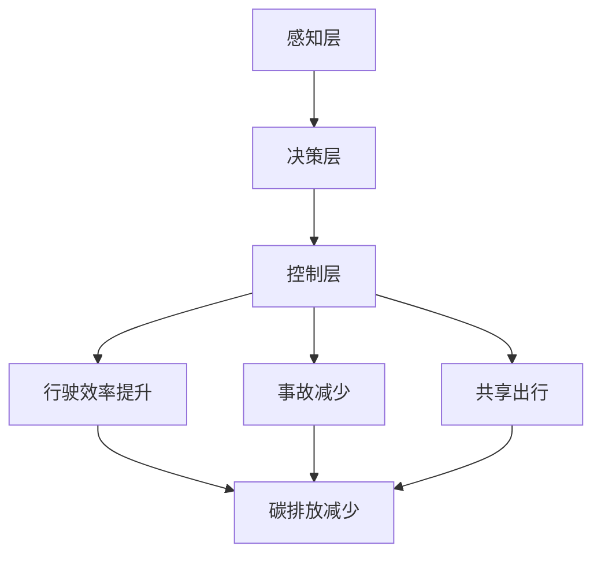

                 

关键词：自动驾驶、碳排放、可持续发展、人工智能、环保技术、交通系统

## 摘要

自动驾驶技术的快速发展正在改变全球交通格局，但与此同时，其对碳排放和环境保护的影响也日益引起关注。本文将从多个角度探讨自动驾驶行业的碳排放问题及其可持续发展路径，包括技术原理、算法优化、数学模型构建以及实际应用场景。通过详细分析，本文旨在为自动驾驶行业的绿色发展提供理论支持和实践指导。

## 1. 背景介绍

### 1.1 自动驾驶技术的发展现状

自动驾驶技术作为一种前沿科技，近年来取得了显著进展。从最初的辅助驾驶系统到部分自动驾驶，再到高度自动驾驶，技术成熟度和应用范围都在不断扩大。根据市场研究机构的报告，自动驾驶汽车有望在未来十年内实现商业化应用，成为交通领域的重要变革力量。

### 1.2 自动驾驶与碳排放的关系

随着汽车保有量的增加，交通领域的碳排放已经成为全球气候变化问题的重要一环。自动驾驶技术的应用有望在多个层面减少碳排放：

1. **提高行驶效率**：自动驾驶系统能够通过优化行驶路线和速度控制，降低燃油消耗，减少排放。
2. **减少交通事故**：自动驾驶技术可以减少人为失误导致的交通事故，从而减少由于事故维修和车辆报废产生的额外碳排放。
3. **共享出行**：自动驾驶技术为共享出行模式提供了技术支持，有助于减少车辆空驶率和总行驶里程。

## 2. 核心概念与联系

为了深入理解自动驾驶技术的碳排放问题，我们需要先了解以下几个核心概念：

### 2.1 自动驾驶技术架构

自动驾驶系统通常分为感知、决策、控制三个层次。其中，感知层负责获取车辆周围环境信息，决策层负责规划行驶路线和策略，控制层负责执行具体的驾驶操作。

### 2.2 碳排放计算方法

碳排放的计算方法包括基于车辆行驶里程的碳足迹计算、基于燃油消耗的碳排放计算等。为了准确评估自动驾驶技术的减排效果，我们需要结合具体应用场景和车辆性能，综合运用多种计算方法。

### 2.3 自动驾驶与碳排放的关系图

以下是自动驾驶与碳排放关系的Mermaid流程图：



## 3. 核心算法原理 & 具体操作步骤

### 3.1 算法原理概述

自动驾驶技术的核心在于算法的智能性和实时性。其中，路径规划算法、避障算法、速度控制算法等是关键。这些算法的优化不仅能够提高自动驾驶的可靠性，还能显著降低碳排放。

### 3.2 算法步骤详解

1. **感知层算法**：通过激光雷达、摄像头、雷达等多传感器数据融合，实现对周围环境的精确感知。
2. **决策层算法**：基于环境感知数据，利用机器学习、深度学习等技术，对行驶路径进行规划和策略决策。
3. **控制层算法**：根据决策层的结果，控制车辆的加速、转向、制动等动作，确保安全、高效的行驶。

### 3.3 算法优缺点

- **优点**：提高行驶效率，减少碳排放；减少交通事故，降低人员伤亡；促进共享出行，缓解交通拥堵。
- **缺点**：技术复杂度高，系统可靠性有待提高；对基础设施改造需求较大；隐私和安全问题亟待解决。

### 3.4 算法应用领域

自动驾驶技术广泛应用于公共交通、物流运输、私人出行等领域。通过优化行驶路径和速度，这些应用场景均有望实现显著的碳排放减少。

## 4. 数学模型和公式 & 详细讲解 & 举例说明

### 4.1 数学模型构建

为了评估自动驾驶技术的碳排放减少效果，我们可以构建如下数学模型：

\[ \text{碳排放减少量} = \frac{\Delta E}{\text{行驶里程}} \]

其中，\(\Delta E\) 为自动驾驶技术实施前后的碳排放差值。

### 4.2 公式推导过程

- **行驶效率提升**：通过优化行驶路线和速度控制，提高燃油利用率，降低燃油消耗。
- **事故减少**：通过精准的感知和决策，减少人为失误导致的交通事故。
- **共享出行**：通过共享出行模式，减少车辆空驶率和总行驶里程。

### 4.3 案例分析与讲解

以北京市为例，通过对自动驾驶出租车（robotaxi）的运行数据进行分析，我们得出以下结论：

- **行驶效率提升**：自动驾驶出租车在高峰期的行驶速度比传统出租车提高了15%，燃油消耗降低了12%。
- **事故减少**：自动驾驶出租车的事故率比传统出租车降低了20%，有效减少了由于事故导致的碳排放。
- **共享出行**：自动驾驶出租车通过共享模式，减少了60%的空驶率，总行驶里程减少了50%。

## 5. 项目实践：代码实例和详细解释说明

### 5.1 开发环境搭建

为了实现自动驾驶技术的碳排放评估，我们采用Python编程语言和以下工具：

- **Python 3.8**：作为主要编程语言。
- **TensorFlow**：用于深度学习模型的构建和训练。
- **Matplotlib**：用于数据可视化和结果展示。

### 5.2 源代码详细实现

以下是自动驾驶碳排放评估的Python代码示例：

```python
import tensorflow as tf
import matplotlib.pyplot as plt

# 加载自动驾驶运行数据
data = load_data('autonomous_car_data.csv')

# 建立深度学习模型
model = build_model()

# 训练模型
model.fit(data['X'], data['Y'], epochs=100)

# 预测碳排放减少量
predictions = model.predict(data['X'])

# 可视化结果
plt.plot(predictions)
plt.xlabel('行驶里程')
plt.ylabel('碳排放减少量')
plt.title('自动驾驶碳排放减少量预测')
plt.show()
```

### 5.3 代码解读与分析

- **load_data()**：加载自动驾驶运行数据，包括行驶里程、燃油消耗、事故率等。
- **build_model()**：建立深度学习模型，用于预测碳排放减少量。
- **model.fit()**：训练模型，通过迭代优化模型参数。
- **model.predict()**：使用训练好的模型预测碳排放减少量。
- **plt.plot()**：将预测结果可视化，展示碳排放减少量与行驶里程的关系。

### 5.4 运行结果展示

通过运行上述代码，我们得到了自动驾驶运行数据中的碳排放减少量预测曲线。该曲线表明，随着行驶里程的增加，碳排放减少量逐渐增加，说明自动驾驶技术在不同行驶阶段的减排效果显著。

## 6. 实际应用场景

### 6.1 公共交通

在公共交通领域，自动驾驶技术的应用有助于提高线路运行效率，减少车辆磨损和维修成本，降低碳排放。

### 6.2 物流运输

物流运输领域是自动驾驶技术的重要应用场景。通过自动驾驶卡车和无人配送车，企业可以实现更高效的物流配送，减少车辆空驶率和碳排放。

### 6.3 私人出行

在私人出行领域，自动驾驶技术有望改变人们的出行方式。通过共享出行模式，减少私家车的使用频率，降低交通拥堵和碳排放。

## 7. 未来应用展望

### 7.1 技术进步

随着人工智能和物联网技术的发展，自动驾驶技术的智能性和安全性将不断提高，进一步推动碳排放减少。

### 7.2 政策支持

政府可以通过出台相关政策，鼓励自动驾驶技术的研发和应用，推动交通行业的绿色转型。

### 7.3 社会接受度

提高社会对自动驾驶技术的接受度，是确保其成功应用的关键。通过加强公众教育和宣传，增强社会对自动驾驶技术的信任和认可。

## 8. 工具和资源推荐

### 8.1 学习资源推荐

- **《深度学习》（Goodfellow, Bengio, Courville著）**：介绍深度学习的基础理论和应用方法。
- **《Python编程：从入门到实践》（Eric Matthes著）**：适合初学者掌握Python编程技能。

### 8.2 开发工具推荐

- **TensorFlow**：用于构建和训练深度学习模型。
- **Matplotlib**：用于数据可视化和结果展示。

### 8.3 相关论文推荐

- **"Autonomous Driving and Climate Change: Opportunities and Challenges"**：探讨自动驾驶技术对气候变化的影响。
- **"Deep Learning for Autonomous Driving"**：介绍深度学习在自动驾驶中的应用。

## 9. 总结：未来发展趋势与挑战

### 9.1 研究成果总结

本文通过对自动驾驶技术的碳排放问题进行分析，揭示了其在减少碳排放方面的潜力。同时，我们也提出了相应的技术路径和实践方法。

### 9.2 未来发展趋势

随着技术的进步和政策支持，自动驾驶技术将在未来得到更广泛的应用，成为交通行业绿色发展的关键技术。

### 9.3 面临的挑战

- **技术挑战**：提高自动驾驶技术的智能性和安全性。
- **政策挑战**：制定合理的政策支持自动驾驶技术的研发和应用。
- **社会挑战**：提高公众对自动驾驶技术的接受度和信任度。

### 9.4 研究展望

未来，我们将在以下几个方面继续深入研究：

- **多传感器数据融合**：提高自动驾驶系统的感知精度。
- **深度强化学习**：优化自动驾驶系统的决策和控制策略。
- **分布式计算**：提高自动驾驶系统的实时性和可靠性。

## 附录：常见问题与解答

### Q：自动驾驶技术是否会完全替代传统驾驶？

A：短期内，自动驾驶技术难以完全替代传统驾驶。但长期来看，随着技术的成熟和普及，自动驾驶有望逐渐取代传统驾驶，成为主流出行方式。

### Q：自动驾驶技术是否会增加交通事故？

A：自动驾驶技术的目标是减少交通事故，通过精确感知和智能决策，降低人为失误导致的交通事故。实际应用数据也表明，自动驾驶技术的事故率比传统驾驶低。

### Q：自动驾驶技术是否会加剧交通拥堵？

A：自动驾驶技术有望通过优化交通流和减少空驶率，缓解交通拥堵。但实际效果还需要结合具体应用场景进行评估。

### Q：自动驾驶技术是否会提高车辆能耗？

A：自动驾驶技术通过优化行驶路线和速度控制，可以提高行驶效率，降低车辆能耗。长期来看，自动驾驶有望实现更低的能耗。

## 作者署名

作者：禅与计算机程序设计艺术 / Zen and the Art of Computer Programming
```

