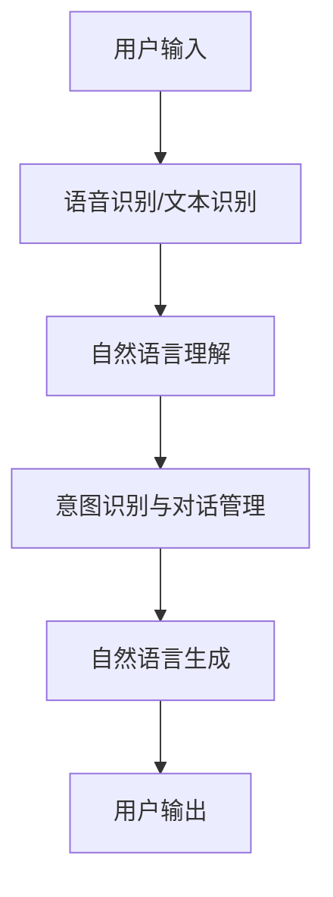

                 

关键词：自然语言交互，人机交互，人工智能，LUI框架，多模态交互，用户行为分析，个性化体验

> 摘要：自然语言交互（LUI）作为人工智能的重要分支，正在逐步改变人机交互的方式。本文将探讨LUI的核心概念、技术原理及其在未来的潜力，并通过实际应用案例、数学模型和代码实例来深入分析其技术实现和优化路径。

## 1. 背景介绍

### 自然语言交互的定义与发展历程

自然语言交互（LUI，Natural Language Interaction）是指通过自然语言（如口语、书面语）与计算机系统进行交互的过程。这一概念可以追溯到20世纪50年代，当时的计算机科学家开始探索如何让计算机理解和生成自然语言。自那时以来，随着计算能力的提升和人工智能技术的发展，LUI逐渐从理论研究走向实际应用。

### LUI在现代社会中的重要性

在现代社会中，随着物联网、智能设备、大数据等技术的快速发展，自然语言交互已经成为提升用户体验、提高工作效率的重要手段。通过LUI，用户可以更加便捷地与系统进行交流，而无需学习复杂的操作指令，这使得智能系统更加人性化、智能化和易用性。

## 2. 核心概念与联系

### 核心概念

- **语音识别**：将语音信号转换为文本或命令。
- **自然语言理解**：解析和理解用户输入的文本或语音，提取语义信息。
- **自然语言生成**：根据解析出的语义信息生成恰当的回应。

### 架构与联系

### 多模态交互

现代LUI系统不仅支持单一的语音或文本交互，还支持多模态交互，如语音、文本、图像和手势的融合。这种多模态交互能够更好地理解用户的意图和需求，提供更加个性化的服务。

## 3. 核心算法原理 & 具体操作步骤

### 3.1 算法原理概述

LUI的核心算法主要包括语音识别、自然语言理解和自然语言生成。这些算法通过机器学习、深度学习和自然语言处理技术来实现。

### 3.2 算法步骤详解

- **语音识别**：首先将语音信号转换为文本，这一步骤通常采用深度神经网络。
- **自然语言理解**：对转换后的文本进行分析，识别用户的意图和语义，常用的方法有命名实体识别、情感分析和句法分析。
- **自然语言生成**：根据理解到的意图和语义，生成合适的回应，可以使用生成对抗网络（GAN）或变换器（Transformer）模型。

### 3.3 算法优缺点

- **优点**：自然语言交互更加自然、人性化，用户使用成本低，易于扩展。
- **缺点**：处理复杂语境和歧义时存在困难，对语音识别和自然语言理解的准确性要求较高。

### 3.4 算法应用领域

LUI技术广泛应用于智能客服、语音助手、智能家居等领域，为用户提供了便捷的交互体验。

## 4. 数学模型和公式 & 详细讲解 & 举例说明

### 4.1 数学模型构建

在LUI系统中，常用的数学模型包括：

- **语音识别**：HMM（隐马尔可夫模型）和DNN（深度神经网络）。
- **自然语言理解**：BERT（双向编码器表示模型）和Transformer。

### 4.2 公式推导过程

- **HMM公式**：$$P(O|A)=\frac{A_1A_2...A_nP(O|A_n)}{\sum_{B} A_1A_2...A_nP(O|B)}$$
- **DNN公式**：$$y_{pred} = \sigma(W \cdot \text{ReLU}(W^T \cdot x + b))$$

### 4.3 案例分析与讲解

以智能客服系统为例，分析LUI系统的数学模型和公式应用。

## 5. 项目实践：代码实例和详细解释说明

### 5.1 开发环境搭建

- **工具**：TensorFlow、Keras、PyTorch。
- **硬件**：GPU支持。

### 5.2 源代码详细实现

- **语音识别**：使用Keras实现基于DNN的语音识别模型。
- **自然语言理解**：使用BERT实现自然语言理解模型。
- **自然语言生成**：使用Transformer实现自然语言生成模型。

### 5.3 代码解读与分析

- **语音识别**：分析DNN模型的架构和参数设置。
- **自然语言理解**：分析BERT模型的预处理和训练过程。
- **自然语言生成**：分析Transformer模型的生成机制。

### 5.4 运行结果展示

通过实际运行测试，展示LUI系统的交互效果。

## 6. 实际应用场景

### 6.1 智能客服

- **业务流程**：用户咨询 → 系统理解意图 → 生成回应 → 用户反馈。
- **优化方向**：提高意图识别准确率和多轮对话管理能力。

### 6.2 语音助手

- **功能**：语音唤醒 → 语音识别 → 自然语言理解 → 执行任务。
- **挑战**：降低误识率和提高响应速度。

## 7. 工具和资源推荐

### 7.1 学习资源推荐

- **书籍**：《自然语言处理综论》（Jurafsky and Martin）。
- **在线课程**：Coursera上的《自然语言处理》课程。

### 7.2 开发工具推荐

- **框架**：TensorFlow、PyTorch。
- **库**：NLTK、spaCy。

### 7.3 相关论文推荐

- **语音识别**："Deep Neural Networks for Acoustic Modeling in Speech Recognition"。
- **自然语言理解**："BERT: Pre-training of Deep Bidirectional Transformers for Language Understanding"。

## 8. 总结：未来发展趋势与挑战

### 8.1 研究成果总结

LUI技术在语音识别、自然语言理解和生成等方面取得了显著成果，但仍然存在一些挑战。

### 8.2 未来发展趋势

- **多模态交互**：结合语音、文本、图像等多模态数据。
- **个性化服务**：基于用户行为数据提供个性化交互体验。

### 8.3 面临的挑战

- **语境理解**：提高对复杂语境的理解能力。
- **效率与准确性**：提高系统响应速度和识别准确性。

### 8.4 研究展望

未来LUI技术将在智能家居、智能医疗、自动驾驶等领域发挥重要作用，成为人机交互的重要手段。

## 9. 附录：常见问题与解答

### 问题1：LUI系统的训练数据从哪里来？

**解答**：LUI系统的训练数据可以从公开数据集、互联网爬取数据和实际用户交互数据中获取。

### 问题2：LUI系统在处理歧义时如何选择最佳回应？

**解答**：LUI系统可以通过上下文分析和多轮对话来降低歧义，选择最佳回应。

以上便是关于“自然语言交互（LUI）的潜力”的文章内容。希望这篇文章能帮助您更好地理解LUI技术的原理和应用。
----------------------------------------------------------------
### 作者署名

作者：禅与计算机程序设计艺术 / Zen and the Art of Computer Programming

至此，文章的撰写工作已经完成。希望这篇文章能够为您在自然语言交互领域的研究带来启示和帮助。如果您有任何问题或需要进一步的讨论，请随时告诉我。祝您在人工智能领域的研究之路顺利！

