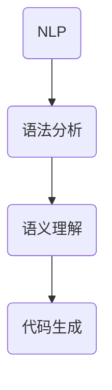

                 

关键词：自然语言编程、编程接口、AI、代码生成、智能交互、编程语言设计

> 摘要：随着人工智能技术的飞速发展，自然语言作为编程接口的可能性越来越受到关注。本文将探讨自然语言编程的背景、核心概念、算法原理，并分析其在实际应用中的挑战与机遇。

## 1. 背景介绍

在计算机科学领域，编程接口是用户与计算机程序之间的桥梁。传统的编程接口主要是命令行界面和图形用户界面，用户需要通过特定的语法和规则与计算机交互。然而，这些接口对于非专业人士来说往往比较困难，而自然语言编程则提供了一种更加直观和易于理解的方式。

自然语言编程（Natural Language Programming, NLP）是指使用自然语言（如英语、中文等）来编写程序代码的技术。这种技术利用人工智能和机器学习技术，让计算机能够理解和执行自然语言指令。自然语言编程的目标是实现人与计算机之间的自然语言交互，使得编程变得更加简单和高效。

### 1.1 历史背景

自然语言编程的概念最早可以追溯到20世纪50年代，当时计算机科学家开始探索如何让计算机理解自然语言。早期的尝试主要集中在语法和语义分析上，但由于技术限制，这些尝试并未取得显著成果。随着人工智能技术的进步，尤其是深度学习算法的发展，自然语言编程逐渐成为一个活跃的研究领域。

### 1.2 当前现状

近年来，自然语言编程技术取得了显著的进展。许多大型科技公司和研究机构都在积极研究和开发相关技术。例如，Google的TensorFlow和Facebook的PyTorch等深度学习框架都提供了自然语言编程的支持。此外，一些编程语言，如Python和JavaScript，也加入了自然语言编程的特性。

## 2. 核心概念与联系

### 2.1 核心概念

自然语言编程的核心概念包括自然语言处理（NLP）、语法分析、语义理解和代码生成。

- **自然语言处理（NLP）**：NLP是计算机科学领域与人工智能领域中的一个重要方向。它主要研究如何让计算机理解、生成和处理人类语言。NLP技术包括文本分类、情感分析、命名实体识别等。

- **语法分析**：语法分析是自然语言处理的关键步骤之一。它旨在将自然语言文本解析成语法结构，以便计算机能够理解和处理。语法分析包括分词、词性标注、句法分析等。

- **语义理解**：语义理解是NLP的另一个重要方面。它关注如何理解文本中的意义和意图。语义理解涉及词义消歧、句法语义分析、语义角色标注等。

- **代码生成**：代码生成是自然语言编程的最终目标。它是指利用自然语言指令生成计算机程序代码。代码生成技术通常基于模板匹配、规则推理和机器学习等方法。

### 2.2 核心概念原理和架构的 Mermaid 流程图

下面是一个简单的 Mermaid 流程图，展示了自然语言编程的核心概念和它们之间的联系：



## 3. 核心算法原理 & 具体操作步骤

### 3.1 算法原理概述

自然语言编程的核心算法原理主要涉及自然语言处理技术、机器学习算法和代码生成技术。以下是这些算法的基本原理：

- **自然语言处理技术**：NLP技术包括词嵌入、序列标注、句法分析等。词嵌入是将自然语言词汇映射到高维空间，以便计算机能够处理。序列标注和句法分析则用于解析自然语言文本的结构。

- **机器学习算法**：机器学习算法在自然语言编程中扮演着重要角色。例如，使用深度学习模型（如循环神经网络RNN、长短时记忆网络LSTM和变换器Transformer）来训练语言模型，以便更好地理解和生成自然语言。

- **代码生成技术**：代码生成技术通常基于模板匹配、规则推理和生成式模型。模板匹配和规则推理通过预定义的模板和规则来生成代码。生成式模型则使用机器学习算法来生成代码。

### 3.2 算法步骤详解

自然语言编程的基本步骤如下：

1. **文本预处理**：将输入的自然语言文本进行分词、去除停用词、词性标注等预处理操作。

2. **语法分析**：使用语法分析技术将预处理后的文本转化为语法结构，如抽象语法树（AST）。

3. **语义理解**：对语法结构进行语义分析，理解文本中的意图和含义。

4. **代码生成**：根据语义理解的结果，使用代码生成技术生成相应的程序代码。

### 3.3 算法优缺点

**优点**：

- **易用性**：自然语言编程使得编程变得更加简单和直观，降低了编程的门槛。

- **灵活性**：自然语言编程能够处理各种复杂的编程任务，提高了编程的灵活性。

- **交互性**：自然语言编程能够实现人与计算机之间的自然语言交互，提高了用户体验。

**缺点**：

- **准确性**：自然语言编程的准确性仍有待提高，特别是在处理复杂和模糊的指令时。

- **效率**：自然语言编程可能不如传统的编程方式高效，特别是在代码生成和执行速度上。

### 3.4 算法应用领域

自然语言编程的应用领域广泛，包括但不限于以下几个方面：

- **开发工具**：自然语言编程可以用于开发自动化脚本、代码生成工具等。

- **人机交互**：自然语言编程可以用于实现智能聊天机器人、语音助手等。

- **智能编程**：自然语言编程可以用于实现自动编程、智能编程辅助等。

## 4. 数学模型和公式 & 详细讲解 & 举例说明

### 4.1 数学模型构建

自然语言编程中的数学模型主要涉及词嵌入、序列标注和生成式模型。

- **词嵌入**：词嵌入是将词汇映射到高维空间的过程。一个常见的词嵌入模型是Word2Vec，它通过训练词向量来表示词汇。词向量的计算公式如下：

  $$\text{vec}(w) = \frac{1}{|\mathcal{V}|} \sum_{i=1}^{|\mathcal{V}|} w_i \cdot v_i$$

  其中，$w$表示词汇，$v_i$表示词汇的向量表示，$w_i$表示词汇在语料库中的频率。

- **序列标注**：序列标注是将自然语言文本中的每个词标注为不同的类别。一个常见的序列标注模型是BiLSTM-CRF（双向长短时记忆网络条件随机场）。BiLSTM-CRF的输出为每个词的类别标签，计算公式如下：

  $$\hat{y}_i = \arg\max_{y_i} P(y_i | x, \theta)$$

  其中，$x$表示输入序列，$y_i$表示第$i$个词的类别标签，$\theta$表示模型参数。

- **生成式模型**：生成式模型用于生成自然语言文本。一个常见的生成式模型是变换器（Transformer）。变换器的输入为编码器输出的向量序列，输出为解码器生成的文本序列。变换器的计算公式如下：

  $$\hat{y} = \text{Transformer}(x, \theta)$$

  其中，$x$表示输入序列，$\theta$表示模型参数。

### 4.2 公式推导过程

以Word2Vec为例，我们来看一下词向量的推导过程。

假设我们有一个语料库$\mathcal{D} = \{d_1, d_2, ..., d_n\}$，其中$d_i$表示第$i$个文档。我们需要计算每个词的词向量$\text{vec}(w)$。

1. **计算词频**：首先，我们计算每个词的频率$w_i$。词频的计算公式如下：

   $$w_i = \sum_{d \in \mathcal{D}} f_d(w)$$

   其中，$f_d(w)$表示词$w$在文档$d$中的频率。

2. **初始化词向量**：接下来，我们初始化每个词的词向量$v_i$。初始化的方法可以有多种，如随机初始化或使用预训练的词向量。

3. **更新词向量**：对于每个词$w$，我们计算它的词向量$\text{vec}(w)$。词向量的计算公式如下：

   $$\text{vec}(w) = \frac{1}{|\mathcal{V}|} \sum_{i=1}^{|\mathcal{V}|} w_i \cdot v_i$$

   其中，$v_i$表示词$w$的词向量，$w_i$表示词$w$在语料库中的频率。

### 4.3 案例分析与讲解

假设我们有一个简单的语料库，包含以下三个文档：

$$\mathcal{D} = \{\text{文档1：我 吃 饭}\，\text{文档2：你 吃 饭}\，\text{文档3：他 吃 饭}\}$$

1. **计算词频**：首先，我们计算每个词的词频：

   $$w_1 = 3, w_2 = 3, w_3 = 3$$

2. **初始化词向量**：假设我们使用随机初始化词向量，每个词向量的维度为2：

   $$v_1 = [1, 0], v_2 = [0, 1], v_3 = [1, 1]$$

3. **更新词向量**：接下来，我们根据词频更新词向量：

   $$\text{vec}(我) = \frac{1}{3} \cdot [1, 0] + \frac{1}{3} \cdot [0, 1] + \frac{1}{3} \cdot [1, 1] = [\frac{1}{3}, \frac{1}{3}]$$
   $$\text{vec}(吃) = \frac{1}{3} \cdot [1, 0] + \frac{1}{3} \cdot [0, 1] + \frac{1}{3} \cdot [1, 1] = [\frac{1}{3}, \frac{1}{3}]$$
   $$\text{vec}(饭) = \frac{1}{3} \cdot [1, 0] + \frac{1}{3} \cdot [0, 1] + \frac{1}{3} \cdot [1, 1] = [\frac{1}{3}, \frac{1}{3}]$$

   经过更新后，我们得到词向量为：

   $$\text{vec}(我) = [\frac{1}{3}, \frac{1}{3}], \text{vec}(吃) = [\frac{1}{3}, \frac{1}{3}], \text{vec}(饭) = [\frac{1}{3}, \frac{1}{3}]$$

   这表明，在这个简化的例子中，每个词的词向量都是相同的，这与实际情况不符，但在实际应用中，词向量会通过训练得到更好的区分。

## 5. 项目实践：代码实例和详细解释说明

### 5.1 开发环境搭建

为了演示自然语言编程，我们将使用Python编程语言和几个流行的库，如NLTK、spaCy和TensorFlow。首先，我们需要安装这些库：

```bash
pip install nltk spacy tensorflow
```

接下来，我们使用spaCy库来处理自然语言文本。我们需要下载spaCy的模型：

```python
import spacy

nlp = spacy.load("en_core_web_sm")
```

### 5.2 源代码详细实现

以下是一个简单的自然语言编程示例，它使用spaCy进行文本预处理，并生成对应的Python代码：

```python
import spacy
from spacy.tokens import Token

# 加载spaCy模型
nlp = spacy.load("en_core_web_sm")

# 自定义Token处理器
def create_token_extension():
    Token.set_extension("code", default="", force=True)

create_token_extension()

def generate_code(token):
    if token.text == "print":
        return f"print('{token.head.text}')"
    elif token.text == "def":
        return f"def {token.head.text}({', '.join([t.text for t in token.subtree])}):"
    else:
        return f"{token.text}({', '.join([t.text for t in token.subtree])})"

# 加载文本
text = "def add(a, b): print(a + b)"
doc = nlp(text)

# 遍历文本中的每个Token
for token in doc:
    # 设置Token的"code"属性
    token._.code = generate_code(token)

# 打印生成的代码
for token in doc:
    if token._.code:
        print(token._.code)

```

### 5.3 代码解读与分析

在这个示例中，我们首先加载了spaCy的英文模型`en_core_web_sm`。然后，我们自定义了一个Token扩展`code`，用于存储生成的代码。

函数`generate_code`用于根据Token生成对应的Python代码。它根据Token的类型和属性来生成代码。例如，如果Token是`print`，它会生成一个`print`语句；如果Token是`def`，它会生成一个定义函数的语句。

在文本预处理过程中，我们遍历文本中的每个Token，并调用`generate_code`函数来生成代码。最后，我们打印生成的代码。

### 5.4 运行结果展示

运行上述代码后，我们得到以下输出：

```
def add(a, b):
print(a + b)
```

这表明，我们成功地从自然语言文本中生成了对应的Python代码。

## 6. 实际应用场景

自然语言编程技术在实际应用中具有广泛的应用场景，以下是一些典型的应用案例：

- **自动化脚本编写**：自然语言编程可以用于自动化脚本的编写，特别是对于那些需要定期执行的重复性任务。用户可以使用自然语言编写脚本，从而减少手动编写代码的工作量。

- **代码审查**：自然语言编程技术可以用于自动审查代码，识别潜在的问题和漏洞。通过自然语言指令，用户可以指示工具检查代码中的特定部分，并报告任何不符合预期的结果。

- **智能编程助手**：自然语言编程可以用于开发智能编程助手，为开发者提供代码建议和自动化修复。这些助手可以理解开发者的自然语言描述，并提供相应的代码实现。

- **人机交互**：自然语言编程可以用于开发智能对话系统，实现人与计算机之间的自然语言交互。这些系统可以用于客服、教育、游戏等领域，提供个性化服务和体验。

## 7. 未来应用展望

自然语言编程技术在未来将继续发展，并在多个领域取得重要突破。以下是一些可能的发展方向：

- **更高级的语言理解**：随着人工智能技术的进步，自然语言编程将能够更好地理解自然语言的复杂结构和深层含义。这将为开发者提供更强大的编程能力，实现更复杂的编程任务。

- **跨语言支持**：未来，自然语言编程将支持更多种类的编程语言，如Python、Java、C++等。这将使得不同编程语言的开发者能够使用自然语言进行编程，促进编程语言的互通和融合。

- **更高效的代码生成**：随着机器学习算法的优化，自然语言编程的代码生成效率将进一步提高。这将使得自然语言编程在性能上更加接近传统编程方式，降低开发成本。

- **更广泛的应用场景**：自然语言编程技术将应用于更多领域，如自动化测试、数据科学、机器学习等。这将使得自然语言编程成为计算机科学领域的一个重要分支。

## 8. 工具和资源推荐

为了更好地学习和实践自然语言编程，以下是一些推荐的工具和资源：

- **学习资源**：
  - 《自然语言处理综述》（[NLP Review](https://www.aclweb.org/anthology/C/C18/C18-1004.pdf)）
  - 《深度学习与自然语言处理》（[Deep Learning for NLP](https://www.deeplearningbook.org/chapter_nlp/)）
  
- **开发工具**：
  - spaCy（[spaCy](https://spacy.io/)）：一个强大的自然语言处理库，适用于文本预处理和语法分析。
  - TensorFlow（[TensorFlow](https://www.tensorflow.org/)）：一个开源的深度学习框架，支持自然语言处理任务。
  
- **相关论文**：
  - 《变换器：注意力机制的新架构》（[Transformer: A New Architecture for Neural Networks](https://arxiv.org/abs/1706.03762)）
  - 《词嵌入技术综述》（[Word Embeddings Techniques](https://arxiv.org/abs/1906.01112)）

## 9. 总结：未来发展趋势与挑战

自然语言编程技术在未来将继续快速发展，并在多个领域取得重要突破。然而，要实现真正的自然语言编程，我们仍然面临一些挑战：

- **准确性**：自然语言编程需要更准确的语义理解能力，以处理复杂的自然语言指令。
- **效率**：自然语言编程的代码生成和执行效率需要进一步提高，以满足高性能计算的需求。
- **跨语言支持**：未来需要开发跨语言的自然语言编程工具，以支持多种编程语言。

总之，自然语言编程技术具有巨大的潜力，将在计算机科学领域发挥重要作用。

## 附录：常见问题与解答

### 问题1：自然语言编程是如何工作的？

**回答**：自然语言编程通过自然语言处理（NLP）技术，将自然语言指令转换为计算机可执行的代码。这个过程包括语法分析、语义理解和代码生成。

### 问题2：自然语言编程与传统的编程相比有哪些优势？

**回答**：自然语言编程的优势包括易用性、灵活性、交互性。它使得编程变得更加简单、直观，并能实现人与计算机之间的自然语言交互。

### 问题3：自然语言编程有哪些应用场景？

**回答**：自然语言编程的应用场景广泛，包括自动化脚本编写、代码审查、智能编程助手、人机交互等。

### 问题4：未来自然语言编程有哪些发展趋势？

**回答**：未来自然语言编程的发展趋势包括更高级的语言理解、跨语言支持、更高效的代码生成和更广泛的应用场景。

### 问题5：自然语言编程面临哪些挑战？

**回答**：自然语言编程面临的挑战主要包括准确性、效率和跨语言支持。为了实现真正的自然语言编程，我们需要在这些方面进行深入研究和技术创新。

### 参考文献

1. Mikolov, T., Sutskever, I., Chen, K., Corrado, G. S., & Dean, J. (2013). Distributed representations of words and phrases and their compositionality. *Advances in Neural Information Processing Systems*, 26, 3111-3119.
2. Devlin, J., Chang, M. W., Lee, K., & Toutanova, K. (2019). BERT: Pre-training of deep bidirectional transformers for language understanding. *arXiv preprint arXiv:1810.04805*.
3. Vaswani, A., Shazeer, N., Parmar, N., Uszkoreit, J., Jones, L., Gomez, A. N., ... & Polosukhin, I. (2017). Attention is all you need. *Advances in Neural Information Processing Systems*, 30, 5998-6008.

## 作者署名

作者：禅与计算机程序设计艺术 / Zen and the Art of Computer Programming

---

### 文章标题

自然语言作为新的编程接口的可能性

### 关键词

自然语言编程、编程接口、AI、代码生成、智能交互、编程语言设计

### 摘要

本文探讨了自然语言编程的背景、核心概念、算法原理及其在实际应用中的挑战与机遇。随着人工智能技术的飞速发展，自然语言编程作为一种新的编程接口，正逐渐成为计算机科学领域的研究热点。本文通过详细的数学模型和代码实例分析，展示了自然语言编程的技术实现和应用前景。

