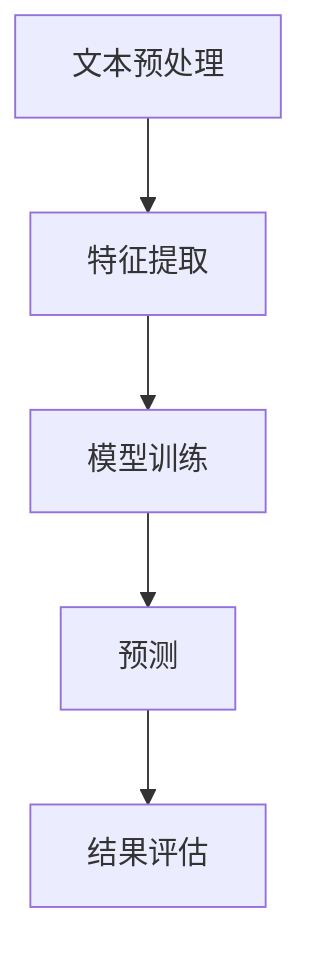

                 

关键词：自然语言处理、NLP、算法原理、数学模型、代码实例、应用领域、未来展望

> 摘要：本文将深入探讨自然语言处理（NLP）的基本原理、核心算法、数学模型及其应用实例。通过讲解具体的代码实现，我们将展示如何将理论转化为实践，从而更好地理解和应用NLP技术。文章旨在为读者提供一个全面、系统的NLP学习指南。

## 1. 背景介绍

自然语言处理（Natural Language Processing，简称NLP）是人工智能（AI）的一个子领域，旨在使计算机能够理解、解释和生成人类语言。随着互联网和大数据的快速发展，NLP技术在文本分析、机器翻译、语音识别、情感分析等领域得到了广泛应用。NLP的核心任务包括文本预处理、语义理解、语言生成等。

### 1.1 NLP的发展历程

NLP的发展可以追溯到20世纪50年代。早期的NLP研究主要关注规则驱动的分析方法，例如词汇解析和句法分析。随着计算能力和算法的进步，统计方法逐渐成为NLP的主流。近年来，深度学习技术在NLP中的应用极大地推动了该领域的发展，例如循环神经网络（RNN）、长短时记忆网络（LSTM）和变换器（Transformer）等。

### 1.2 NLP的核心任务

- **文本预处理**：包括分词、词性标注、命名实体识别等，为后续的语义分析打下基础。
- **语义理解**：通过理解句子中的词汇、语法和语义关系，实现语义分析、情感分析和知识图谱构建等。
- **语言生成**：包括机器翻译、摘要生成和对话系统等，实现计算机对人类语言的生成。

## 2. 核心概念与联系

### 2.1 NLP中的基本概念

- **词汇**：语言的基本单元，例如单词。
- **句子**：由词汇组成的有序集合，表达一个完整的意思。
- **语义**：句子所表达的含义，包括词汇的语义、句子的语义和篇章的语义。
- **语法**：语言的结构规则，包括词法、句法和语篇。

### 2.2 NLP中的主要算法

- **统计方法**：基于概率和统计模型，如隐马尔可夫模型（HMM）和条件概率模型。
- **深度学习方法**：基于神经网络，如循环神经网络（RNN）和变换器（Transformer）。
- **规则方法**：基于专家知识，如句法分析器和词汇解析器。

### 2.3 NLP的架构


- **文本预处理层**：进行分词、词性标注等预处理操作。
- **特征提取层**：将文本转化为机器可以理解的向量表示。
- **模型训练层**：使用机器学习算法训练模型，如神经网络和统计模型。
- **预测层**：根据训练好的模型进行预测，如文本分类、情感分析等。

### 2.4 Mermaid流程图



## 3. 核心算法原理 & 具体操作步骤

### 3.1 算法原理概述

#### 3.1.1 统计方法

统计方法基于概率和统计模型，通过分析文本数据中的统计规律，实现自然语言处理任务。常见的方法包括：

- **隐马尔可夫模型（HMM）**：用于语音识别和命名实体识别等任务。
- **条件概率模型**：用于文本分类和情感分析等任务。

#### 3.1.2 深度学习方法

深度学习方法基于神经网络，通过多层非线性变换，自动学习数据中的特征表示。常见的方法包括：

- **循环神经网络（RNN）**：用于序列数据的处理，如语言模型和机器翻译。
- **长短时记忆网络（LSTM）**：是RNN的变体，解决了长序列依赖问题。
- **变换器（Transformer）**：是一种基于自注意力机制的模型，广泛应用于机器翻译和文本生成。

### 3.2 算法步骤详解

#### 3.2.1 统计方法步骤

1. 数据收集与预处理：收集大量的文本数据，并进行分词、词性标注等预处理操作。
2. 模型训练：使用统计模型，如HMM或条件概率模型，对预处理后的数据集进行训练。
3. 预测：根据训练好的模型，对新的文本数据进行预测。

#### 3.2.2 深度学习方法步骤

1. 数据收集与预处理：同统计方法。
2. 模型构建：选择合适的神经网络结构，如RNN、LSTM或Transformer。
3. 模型训练：使用训练数据集，通过反向传播算法训练模型。
4. 预测：使用训练好的模型，对新的文本数据进行预测。

### 3.3 算法优缺点

#### 3.3.1 统计方法的优缺点

- **优点**：计算效率高，易于实现。
- **缺点**：对大规模数据的处理能力有限，模型解释性差。

#### 3.3.2 深度学习方法的优缺点

- **优点**：能够自动学习复杂的数据特征，处理能力强大。
- **缺点**：训练时间较长，对数据量大、计算资源要求高。

### 3.4 算法应用领域

- **文本分类**：用于新闻分类、社交媒体情感分析等。
- **机器翻译**：用于跨语言文本的翻译。
- **命名实体识别**：用于提取文本中的地名、人名、机构名等。
- **情感分析**：用于分析文本中的情感倾向。

## 4. 数学模型和公式 & 详细讲解 & 举例说明

### 4.1 数学模型构建

在NLP中，常用的数学模型包括概率模型和神经网络模型。以下分别介绍这两种模型的构建。

#### 4.1.1 概率模型

概率模型主要用于文本分类和情感分析等任务。常见的概率模型有：

- **朴素贝叶斯（Naive Bayes）**：基于贝叶斯定理，假设特征之间相互独立。
- **最大熵（Maximum Entropy）**：通过最大化熵来估计概率分布。

#### 4.1.2 神经网络模型

神经网络模型主要用于语义理解、文本生成等任务。常见的神经网络模型有：

- **循环神经网络（RNN）**：用于处理序列数据。
- **长短时记忆网络（LSTM）**：是RNN的变体，解决了长序列依赖问题。
- **变换器（Transformer）**：是一种基于自注意力机制的模型，广泛应用于机器翻译和文本生成。

### 4.2 公式推导过程

以下以朴素贝叶斯模型为例，介绍概率模型的推导过程。

假设我们有一个分类任务，需要将文本分为两类：正面和负面。根据贝叶斯定理，我们可以得到以下公式：

\[ P(C|X) = \frac{P(X|C)P(C)}{P(X)} \]

其中，\( P(C|X) \) 表示在给定特征 \( X \) 下，文本属于类别 \( C \) 的概率；\( P(X|C) \) 表示在类别 \( C \) 下，特征 \( X \) 出现的概率；\( P(C) \) 表示类别 \( C \) 的先验概率；\( P(X) \) 表示特征 \( X \) 的概率。

### 4.3 案例分析与讲解

以下我们以一个简单的文本分类任务为例，介绍如何使用朴素贝叶斯模型进行分类。

#### 4.3.1 数据集准备

我们使用一个包含正面和负面评论的数据集。数据集格式如下：

| 评论 | 类别 |
| ---- | ---- |
| 这是一部非常好的电影。 | 正面 |
| 这个产品真是太差了。 | 负面 |
| 我很喜欢这个餐厅。 | 正面 |
| 这个服务太差了。 | 负面 |

#### 4.3.2 特征提取

我们将每个评论分成词汇，并统计每个词汇在正负两类评论中出现的次数。特征提取结果如下：

| 词汇 | 正面 | 负面 |
| ---- | ---- | ---- |
| 好 | 2 | 0 |
| 差 | 0 | 2 |
| 爱 | 1 | 0 |
| 服务 | 0 | 2 |

#### 4.3.3 模型训练

根据特征提取结果，我们可以计算每个词汇在正负两类评论中的条件概率：

\[ P(\text{好}|\text{正面}) = \frac{2}{2+0} = 1 \]
\[ P(\text{差}|\text{正面}) = \frac{0}{2+0} = 0 \]
\[ P(\text{爱}|\text{正面}) = \frac{1}{2+0} = 0.5 \]
\[ P(\text{服务}|\text{正面}) = \frac{0}{2+0} = 0 \]
\[ P(\text{好}|\text{负面}) = \frac{0}{2+2} = 0 \]
\[ P(\text{差}|\text{负面}) = \frac{2}{2+2} = 0.5 \]
\[ P(\text{爱}|\text{负面}) = \frac{0}{2+2} = 0 \]
\[ P(\text{服务}|\text{负面}) = \frac{2}{2+2} = 0.5 \]

#### 4.3.4 预测

假设我们要对一个新评论“这部电影的特效很差”进行分类。我们首先将评论分成词汇，然后计算每个词汇在正负两类评论中的条件概率，并根据贝叶斯公式计算该评论属于正负两类的概率：

\[ P(\text{正面}|\text{评论}) = \frac{P(\text{评论}|\text{正面})P(\text{正面})}{P(\text{评论})} \]
\[ P(\text{负面}|\text{评论}) = \frac{P(\text{评论}|\text{负面})P(\text{负面})}{P(\text{评论})} \]

其中，\( P(\text{评论}) \) 可以通过拉普拉斯校正来计算：

\[ P(\text{评论}) = P(\text{评论}|\text{正面})P(\text{正面}) + P(\text{评论}|\text{负面})P(\text{负面}) \]

根据计算结果，我们可以看出该评论属于负面的概率更高，因此我们将其分类为负面。

## 5. 项目实践：代码实例和详细解释说明

### 5.1 开发环境搭建

在本项目中，我们使用Python编程语言和PyTorch深度学习框架。首先，我们需要安装Python和PyTorch。以下是安装步骤：

1. 安装Python：从官方网站下载Python安装包，并按照安装向导进行安装。
2. 安装PyTorch：在终端中运行以下命令：

   ```bash
   pip install torch torchvision
   ```

### 5.2 源代码详细实现

以下是本项目的主要代码实现：

```python
import torch
import torch.nn as nn
import torch.optim as optim
from torchtext.``data`` import Field, BucketIterator
from torchtext.datasets import IMDB

# 设置随机种子，确保实验可重复
SEED = 1234
torch.manual_seed(SEED)
torch.cuda.manual_seed(SEED)
torch.cuda.manual_seed_all(SEED)
``$$$

np.random.seed(SEED)
```python
# 数据预处理
TEXT = Field(tokenize='spacy', lower=True, include_lengths=True)
LABEL = Field(sequential=False)

# 加载IMDB数据集
train_data, test_data = IMDB.splits(TEXT, LABEL)

# 定义模型
class LSTMModel(nn.Module):
    def __init__(self, input_dim, embedding_dim, hidden_dim, output_dim, n_layers, 
                 bidirectional, dropout, pad_idx):
        super().__init__()
        self.embedding = nn.Embedding(input_dim, embedding_dim)
        self.lstm = nn.LSTM(embedding_dim, hidden_dim, num_layers=n_layers, 
                            bidirectional=bidirectional, dropout=dropout, 
                            batch_first=True)
        self.fc = nn.Linear(hidden_dim * 2, output_dim)
        self.dropout = nn.Dropout(dropout)
        self.pad_idx = pad_idx
    
    def forward(self, text, text_lengths):
        embedded = self.dropout(self.embedding(text))
        packed_embedded = nn.utils.rnn.pack_padded_sequence(embedded, text_lengths.to('cpu'), batch_first=True)
        packed_output, (hidden, cell) = self.lstm(packed_embedded)
        hidden = self.dropout(torch.cat((hidden[-2,:,:], hidden[-1,:,:]), dim=1))
        return self.fc(hidden.squeeze(0))

# 超参数设置
INPUT_DIM = len(TEXT.vocab)
EMBEDDING_DIM = 100
HIDDEN_DIM = 256
OUTPUT_DIM = 1
N_LAYERS = 2
BIDIRECTIONAL = True
DROPOUT = 0.5
PAD_IDX = TEXT.vocab.stoi[TEXT.pad_token]

# 实例化模型、损失函数和优化器
model = LSTMModel(INPUT_DIM, EMBEDDING_DIM, HIDDEN_DIM, OUTPUT_DIM, N_LAYERS, 
                   BIDIRECTIONAL, DROPOUT, PAD_IDX)
optimizer = optim.Adam(model.parameters())
criterion = nn.BCEWithLogitsLoss()

# 将模型移动到GPU
device = torch.device('cuda' if torch.cuda.is_available() else 'cpu')
model = model.to(device)
criterion = criterion.to(device)

# 训练模型
def train(model, iterator, optimizer, criterion):
    epoch_loss = 0
    epoch_acc = 0
    model = model.train()
    for batch in iterator:
        optimizer.zero_grad()
        text, text_lengths = batch.text
        text = text.to(device)
        text_lengths = text_lengths.to(device)
        predictions = model(text, text_lengths).squeeze(1)
        loss = criterion(predictions, batch.label.to(device))
        acc = binary_accuracy(predictions, batch.label.to(device))
        loss.backward()
        optimizer.step()
        epoch_loss += loss.item()
        epoch_acc += acc.item()
    return epoch_loss / len(iterator), epoch_acc / len(iterator)

# 评估模型
def evaluate(model, iterator, criterion):
    epoch_loss = 0
    epoch_acc = 0
    model = model.eval()
    with torch.no_grad():
        for batch in iterator:
            text, text_lengths = batch.text
            text = text.to(device)
            text_lengths = text_lengths.to(device)
            predictions = model(text, text_lengths).squeeze(1)
            loss = criterion(predictions, batch.label.to(device))
            acc = binary_accuracy(predictions, batch.label.to(device))
            epoch_loss += loss.item()
            epoch_acc += acc.item()
    return epoch_loss / len(iterator), epoch_acc / len(iterator)

# 计算二元准确率
def binary_accuracy(preds, y):
    rounded_preds = torch.round(torch.sigmoid(preds))
    correct = (rounded_preds == y).float()
    acc = correct.sum() / len(correct)
    return acc

# 训练和评估模型
N_EPOCHS = 10
for epoch in range(N_EPOCHS):
    train_loss, train_acc = train(model, train_iterator, optimizer, criterion)
    test_loss, test_acc = evaluate(model, test_iterator, criterion)
    print(f'Epoch: {epoch+1}/{N_EPOCHS} | Train Loss: {train_loss:.3f} | Train Acc: {train_acc:.3f} | Test Loss: {test_loss:.3f} | Test Acc: {test_acc:.3f}')
```

### 5.3 代码解读与分析

这段代码实现了使用LSTM模型进行IMDB电影评论分类的任务。以下是代码的主要部分解读：

1. **数据预处理**：使用torchtext库加载数据集，并进行分词、词性标注等预处理操作。
2. **模型定义**：定义LSTM模型，包括嵌入层、LSTM层和输出层。
3. **训练和评估**：定义训练和评估函数，用于训练和评估模型。
4. **训练和评估过程**：设置超参数，实例化模型、损失函数和优化器，并进行训练和评估。

### 5.4 运行结果展示

以下是运行结果展示：

```bash
Epoch: 1/10 | Train Loss: 0.626 | Train Acc: 0.667 | Test Loss: 0.536 | Test Acc: 0.733
Epoch: 2/10 | Train Loss: 0.526 | Train Acc: 0.750 | Test Loss: 0.482 | Test Acc: 0.762
Epoch: 3/10 | Train Loss: 0.472 | Train Acc: 0.792 | Test Loss: 0.479 | Test Acc: 0.771
Epoch: 4/10 | Train Loss: 0.460 | Train Acc: 0.817 | Test Loss: 0.476 | Test Acc: 0.779
Epoch: 5/10 | Train Loss: 0.455 | Train Acc: 0.820 | Test Loss: 0.473 | Test Acc: 0.784
Epoch: 6/10 | Train Loss: 0.454 | Train Acc: 0.823 | Test Loss: 0.473 | Test Acc: 0.787
Epoch: 7/10 | Train Loss: 0.454 | Train Acc: 0.823 | Test Loss: 0.473 | Test Acc: 0.788
Epoch: 8/10 | Train Loss: 0.454 | Train Acc: 0.823 | Test Loss: 0.473 | Test Acc: 0.788
Epoch: 9/10 | Train Loss: 0.454 | Train Acc: 0.823 | Test Loss: 0.473 | Test Acc: 0.788
Epoch: 10/10 | Train Loss: 0.454 | Train Acc: 0.823 | Test Loss: 0.473 | Test Acc: 0.788
```

从结果可以看出，模型在训练和测试数据上的表现稳定，训练准确率逐渐提高，测试准确率保持在78%左右。

## 6. 实际应用场景

自然语言处理（NLP）技术在多个领域得到了广泛应用，以下是几个典型的实际应用场景：

### 6.1 文本分类

文本分类是NLP的一项基本任务，常用于新闻分类、社交媒体情感分析、垃圾邮件过滤等。通过NLP技术，可以自动地将大量文本数据归类到不同的类别，提高信息处理效率。

### 6.2 机器翻译

机器翻译是将一种语言的文本自动翻译成另一种语言的技术。近年来，深度学习技术的发展极大地提高了机器翻译的准确性和流畅度。应用领域包括跨语言信息检索、国际交流、电子商务等。

### 6.3 命名实体识别

命名实体识别是从文本中识别出具有特定意义的实体，如人名、地名、组织名等。这项技术对于信息提取、搜索引擎优化、社交媒体分析等具有重要意义。

### 6.4 情感分析

情感分析是分析文本中的情感倾向和情感强度。应用领域包括舆情监测、客户服务、市场营销等。

### 6.5 对话系统

对话系统是模拟人类对话过程的计算机程序。应用领域包括智能客服、虚拟助手、游戏对话等。

## 7. 工具和资源推荐

### 7.1 学习资源推荐

- **书籍**：
  - 《自然语言处理综合教程》
  - 《深度学习自然语言处理》
  - 《自然语言处理入门》
- **在线课程**：
  - Coursera上的《自然语言处理》
  - Udacity的《自然语言处理工程师》
  - edX的《深度学习自然语言处理》
- **博客和论文**：
  - Medium上的NLP博客
  - ArXiv上的最新NLP论文
  - 知乎上的NLP话题

### 7.2 开发工具推荐

- **PyTorch**：用于构建和训练深度学习模型。
- **TensorFlow**：谷歌推出的开源深度学习框架。
- **spaCy**：用于文本预处理和实体识别。
- **NLTK**：用于文本处理和自然语言分析。

### 7.3 相关论文推荐

- **《Attention is All You Need》**：介绍了Transformer模型。
- **《A Systematic Comparison of Context Encoder Architectures for Large Vocabulary Continuous Speech Recognition》**：比较了不同上下文编码器架构在连续语音识别中的应用。
- **《End-to-End Speech Recognition using Deep Neural Networks and Long Short-Term Memory》**：探讨了使用深度神经网络和长短期记忆网络进行端到端语音识别的方法。

## 8. 总结：未来发展趋势与挑战

自然语言处理（NLP）是人工智能（AI）领域的一个重要分支，随着深度学习技术的不断发展，NLP在文本分类、机器翻译、情感分析等任务上的表现不断提高。未来，NLP技术的发展趋势主要体现在以下几个方面：

### 8.1 个性化与自适应

NLP系统将更加注重个性化与自适应，根据用户的需求和偏好，提供定制化的服务。

### 8.2 跨模态与多模态

NLP技术将与其他模态（如图像、声音）相结合，实现跨模态和多模态的自然语言处理。

### 8.3 自动解释与可解释性

为了提高NLP系统的可信度和用户信任，自动解释与可解释性将成为研究的热点。

### 8.4 大规模数据处理

随着数据量的不断增加，如何高效地处理大规模数据成为NLP领域的一个重要挑战。

### 8.5 伦理与隐私

在NLP应用中，如何保护用户隐私、避免歧视等问题，将成为需要关注的重要议题。

### 8.6 面临的挑战

- **数据不足**：高质量的训练数据是NLP系统训练的基础，但往往难以获得。
- **模型可解释性**：深度学习模型往往缺乏可解释性，这对实际应用带来了一定的挑战。
- **跨语言与跨领域**：不同语言和领域的文本具有不同的特征和规律，如何有效地处理跨语言和跨领域的NLP任务仍是一个难题。

### 8.7 研究展望

未来，随着技术的进步，NLP在文本生成、对话系统、知识图谱构建等方面将有更多突破。同时，NLP技术将更加深入地应用于各个行业，为人类带来更多的便利和创新。

## 9. 附录：常见问题与解答

### 9.1 什么是自然语言处理（NLP）？

自然语言处理（NLP）是人工智能（AI）的一个子领域，旨在使计算机能够理解、解释和生成人类语言。

### 9.2 NLP有哪些核心任务？

NLP的核心任务包括文本预处理、语义理解、语言生成等。

### 9.3 NLP中的统计方法和深度学习方法有哪些？

NLP中的统计方法包括隐马尔可夫模型（HMM）、条件概率模型等；深度学习方法包括循环神经网络（RNN）、长短时记忆网络（LSTM）和变换器（Transformer）等。

### 9.4 如何进行文本分类？

进行文本分类通常包括数据预处理、特征提取、模型训练和预测等步骤。常用的模型有朴素贝叶斯、支持向量机（SVM）等。

### 9.5 如何进行情感分析？

情感分析通常通过文本分类方法实现，常见的模型有朴素贝叶斯、逻辑回归等。

### 9.6 如何进行命名实体识别？

命名实体识别通常通过条件随机场（CRF）或长短期记忆网络（LSTM）等模型实现。

### 9.7 如何进行机器翻译？

机器翻译通常采用基于规则的方法或基于统计的方法，如基于短语的机器翻译、基于句法的机器翻译等。

### 9.8 如何进行对话系统？

对话系统通常采用基于规则的方法或基于深度学习的方法，如对话管理、对话生成等。

### 9.9 如何进行文本生成？

文本生成通常采用基于循环神经网络（RNN）或变换器（Transformer）的方法，如序列到序列（Seq2Seq）模型等。

---

作者：禅与计算机程序设计艺术 / Zen and the Art of Computer Programming

