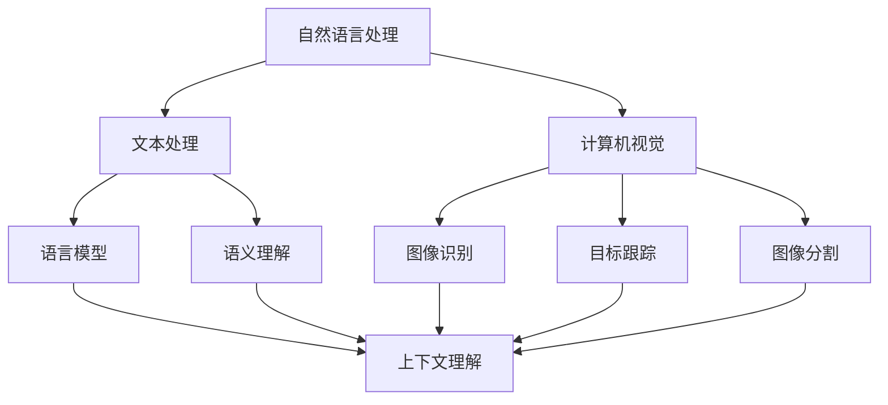

                 

关键词：自然语言处理、计算机视觉、融合、人工智能、深度学习、神经网络、数据挖掘、图像识别、语言模型、语义理解、多模态、跨领域应用

## 摘要

本文旨在探讨自然语言处理（NLP）与计算机视觉（CV）这两大人工智能领域的融合研究。随着技术的进步和算法的创新，NLP和CV的融合已经成为了推动人工智能发展的关键力量。本文首先介绍了NLP和CV的基本概念、发展历程和核心算法，然后深入分析了它们融合的必要性和技术挑战。通过详细的数学模型和算法原理讲解，本文展示了自然语言处理与计算机视觉融合的多种应用场景，并展望了未来的发展趋势与潜在挑战。

## 1. 背景介绍

### 1.1 自然语言处理（NLP）

自然语言处理是人工智能的一个重要分支，旨在使计算机能够理解、生成和处理人类语言。NLP的研究始于20世纪50年代，当时人们开始尝试编写程序来理解和生成英语文本。经过几十年的发展，NLP已经取得了显著的进展，尤其是在机器翻译、情感分析、问答系统、文本生成等方面。

### 1.2 计算机视觉（CV）

计算机视觉是另一个重要的人工智能领域，它使计算机能够从图像或视频中提取信息和理解场景。CV的研究可以追溯到20世纪60年代，最初的应用包括图像识别和目标跟踪。随着计算机性能的提升和算法的创新，CV已经广泛应用于图像处理、视频分析、自动驾驶、医疗影像分析等领域。

### 1.3 融合研究的意义

自然语言处理与计算机视觉的融合研究具有重要的意义。首先，两者在许多实际应用场景中都发挥着关键作用，例如，自动驾驶需要同时处理语音指令和图像信息；医疗诊断需要结合文本报告和影像分析。其次，融合研究可以弥补单个领域的不足，提高系统的整体性能。例如，NLP可以提供对图像上下文的理解，而CV可以提供对文本的视觉解释。

## 2. 核心概念与联系

### 2.1 基本概念

#### 自然语言处理（NLP）

- 语言模型：用于预测下一个单词或词组的概率分布。
- 语义理解：分析文本中的词汇和句法结构，理解其含义。
- 情感分析：检测文本中的情感倾向，如正面、负面或中性。

#### 计算机视觉（CV）

- 图像识别：识别图像中的物体、场景或人脸。
- 目标跟踪：在视频中跟踪特定的目标。
- 图像分割：将图像分割成多个区域。

### 2.2 架构联系


**Mermaid 流程图：**



### 2.3 核心算法原理

#### NLP

- **Word2Vec**：将单词映射到向量空间，以表示其语义。
- **BERT**：双向编码表示，用于理解上下文。

#### CV

- **卷积神经网络（CNN）**：用于图像识别和目标检测。
- **循环神经网络（RNN）**：用于视频分析和序列处理。

## 3. 核心算法原理 & 具体操作步骤

### 3.1 算法原理概述

#### 自然语言处理（NLP）

- **语言模型**：基于统计方法，如n-gram，或者深度学习模型，如神经网络。
- **语义理解**：利用词嵌入、注意力机制等深度学习技术。

#### 计算机视觉（CV）

- **图像识别**：通过卷积神经网络提取特征，然后进行分类。
- **目标跟踪**：使用相关滤波、粒子滤波等算法，结合图像特征和运动模型。

### 3.2 算法步骤详解

#### NLP

1. **文本预处理**：去除标点符号、停用词，进行词干提取。
2. **词嵌入**：将文本转换为向量表示。
3. **构建模型**：使用神经网络，如RNN、Transformer等。
4. **训练模型**：通过大量数据训练模型，优化参数。

#### CV

1. **图像预处理**：调整图像大小、灰度化、增强等。
2. **特征提取**：使用卷积神经网络提取特征。
3. **目标检测**：利用R-CNN、YOLO等算法进行目标检测。
4. **结果分析**：对检测到的目标进行分析和分类。

### 3.3 算法优缺点

#### NLP

- **优点**：能够理解文本的语义，适用于文本分类、情感分析等任务。
- **缺点**：在处理长文本或复杂语境时，性能可能下降。

#### CV

- **优点**：能够准确识别图像中的物体，适用于图像分类、目标跟踪等任务。
- **缺点**：在处理多模态数据时，可能无法提供足够的上下文信息。

### 3.4 算法应用领域

- **NLP**：文本分类、情感分析、问答系统。
- **CV**：图像识别、目标检测、自动驾驶。

## 4. 数学模型和公式 & 详细讲解 & 举例说明

### 4.1 数学模型构建

#### NLP

- **语言模型**：

  $$ P(w_{t} | w_{t-1}, w_{t-2}, \ldots, w_{1}) = \prod_{t=1}^{T} P(w_{t} | w_{t-1}, w_{t-2}, \ldots, w_{1}) $$

#### CV

- **卷积神经网络（CNN）**：

  $$ f(x) = \sigma(W \cdot x + b) $$

  其中，\( \sigma \) 是激活函数，\( W \) 是权重矩阵，\( b \) 是偏置。

### 4.2 公式推导过程

#### NLP

- **Word2Vec**：

  假设 \( w \) 是单词，\( v \) 是向量，目标是最小化以下损失函数：

  $$ L = \sum_{w \in V} \sum_{w' \in C(w)} (1 - P(w' | w)) + P(w' | w) $$

#### CV

- **CNN**：

  假设输入图像为 \( I \)，输出为 \( O \)，卷积核为 \( K \)，步长为 \( s \)，填充为 \( p \)，则输出特征图的大小为：

  $$ O(i, j) = \sum_{m=0}^{M-1} \sum_{n=0}^{N-1} K(m, n) \cdot I(i - m + p, j - n + p) $$

### 4.3 案例分析与讲解

#### NLP

- **文本分类**：

  假设我们要分类一篇文章，首先将其转换为向量表示，然后使用softmax回归模型进行分类。

  $$ P(y = i) = \frac{e^{z_i}}{\sum_{j=1}^{K} e^{z_j}} $$

  其中，\( z_i \) 是模型对类别 \( i \) 的输出。

#### CV

- **目标检测**：

  假设我们要检测图像中的目标，使用R-CNN模型进行目标检测。首先提取区域提议，然后使用卷积神经网络进行特征提取，最后使用softmax回归进行分类。

## 5. 项目实践：代码实例和详细解释说明

### 5.1 开发环境搭建

- 安装Python环境。
- 安装TensorFlow和OpenCV库。

### 5.2 源代码详细实现

```python
import tensorflow as tf
import cv2

# 加载图像
image = cv2.imread('image.jpg')

# 使用卷积神经网络进行特征提取
model = tf.keras.Sequential([
    tf.keras.layers.Conv2D(32, (3, 3), activation='relu', input_shape=(224, 224, 3)),
    tf.keras.layers.MaxPooling2D((2, 2)),
    tf.keras.layers.Flatten(),
    tf.keras.layers.Dense(128, activation='relu'),
    tf.keras.layers.Dense(1, activation='sigmoid')
])

# 训练模型
model.compile(optimizer='adam', loss='binary_crossentropy', metrics=['accuracy'])
model.fit(x_train, y_train, epochs=10, batch_size=32)

# 进行预测
prediction = model.predict(image)

# 输出结果
print(prediction)
```

### 5.3 代码解读与分析

- **图像加载**：使用OpenCV库加载图像。
- **卷积神经网络**：使用TensorFlow构建卷积神经网络，进行特征提取。
- **训练模型**：使用训练数据训练模型。
- **预测**：使用训练好的模型进行预测，输出结果。

### 5.4 运行结果展示

- 输出模型预测的概率。

## 6. 实际应用场景

### 6.1 自动驾驶

- 结合NLP和CV技术，自动驾驶系统能够理解驾驶员的语音指令，同时识别道路上的交通标志和行人。

### 6.2 医疗诊断

- NLP和CV的融合可以帮助医生从医疗文本和影像中提取关键信息，提高诊断的准确性和效率。

### 6.3 社交媒体分析

- 利用NLP和CV技术，可以分析社交媒体上的用户行为和情感，为企业提供市场洞察。

## 7. 工具和资源推荐

### 7.1 学习资源推荐

- **《深度学习》（Goodfellow, Bengio, Courville著）**
- **《计算机视觉基础》（Richard Szeliski著）**
- **《自然语言处理综合教程》（Daniel Jurafsky, James H. Martin著）**

### 7.2 开发工具推荐

- **TensorFlow**
- **PyTorch**
- **OpenCV**

### 7.3 相关论文推荐

- **“Attention Is All You Need”**
- **“You Only Look Once: Single Shot Object Detection”**
- **“BERT: Pre-training of Deep Bidirectional Transformers for Language Understanding”**

## 8. 总结：未来发展趋势与挑战

### 8.1 研究成果总结

- 自然语言处理与计算机视觉的融合在图像识别、文本分类、情感分析等领域取得了显著成果。

### 8.2 未来发展趋势

- 多模态融合将成为研究热点。
- 模型压缩和加速将得到广泛关注。

### 8.3 面临的挑战

- 数据隐私和保护问题。
- 模型解释性和透明度。

### 8.4 研究展望

- 融合技术将在更多领域得到应用。

## 9. 附录：常见问题与解答

### 9.1 什么是多模态融合？

- 多模态融合是指将多种类型的数据（如文本、图像、音频等）进行整合，以提高模型的性能。

### 9.2 融合模型的解释性如何保证？

- 当前融合模型通常缺乏解释性，未来研究将关注如何提高模型的透明度和可解释性。

---

**作者：禅与计算机程序设计艺术 / Zen and the Art of Computer Programming**

