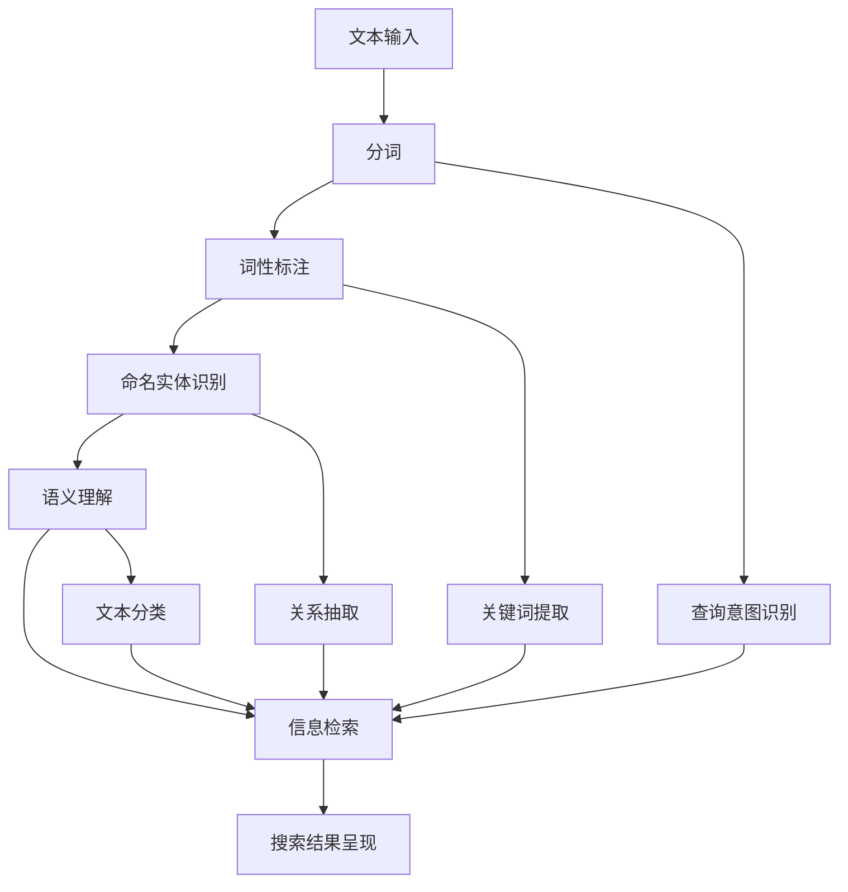

                 

自然语言处理（NLP）作为人工智能领域的一个重要分支，近年来在智能搜索中的应用日益广泛。随着互联网信息的爆炸性增长，如何快速、准确地从海量数据中提取出用户需要的信息成为了一个亟待解决的关键问题。智能搜索通过结合自然语言处理技术，极大地提高了信息检索的效率和准确性，为用户提供更加个性化的搜索体验。

本文将围绕自然语言处理在智能搜索中的应用，探讨其核心概念、算法原理、数学模型、项目实践以及未来发展趋势。希望通过本文的阅读，读者能够对自然语言处理在智能搜索中的技术实现和应用场景有更为深刻的理解。

## 文章关键词

自然语言处理、智能搜索、文本分析、语义理解、信息检索。

## 文章摘要

本文系统地介绍了自然语言处理在智能搜索中的应用。首先，我们回顾了自然语言处理的基本概念和技术发展历程。接着，深入分析了自然语言处理与智能搜索之间的紧密联系，探讨了核心算法原理及其数学模型。随后，通过一个具体的代码实例，展示了如何在实际项目中运用自然语言处理技术。最后，本文对智能搜索的未来发展趋势进行了展望，并提出了面临的主要挑战和研究方向。

### 1. 背景介绍

自然语言处理（Natural Language Processing，NLP）是人工智能（Artificial Intelligence，AI）领域中的一个重要分支，旨在使计算机能够理解和处理人类自然语言。NLP的研究内容广泛，包括文本分析、语义理解、语音识别、机器翻译等多个方面。随着互联网和大数据技术的发展，NLP的应用场景也越来越广泛，从传统的搜索引擎，到现代的智能客服、智能推荐系统，NLP技术无处不在。

智能搜索（Intelligent Search）则是指利用人工智能技术，尤其是自然语言处理技术，来改进信息检索过程，提升搜索效率和准确性。智能搜索不仅仅是一个简单的关键词匹配过程，它涉及到对用户查询意图的理解、对海量信息的筛选和排序，以及对最终结果的个性化呈现。智能搜索的核心在于如何将自然语言处理技术与搜索引擎技术相结合，实现更高效、更准确的信息检索。

NLP与智能搜索的关系十分紧密。自然语言处理技术为智能搜索提供了理解用户查询和内容的能力，使得搜索系统能够更好地处理非结构化文本数据。具体来说，NLP技术可以帮助智能搜索实现以下功能：

1. **查询意图识别**：理解用户的查询意图，区分用户是希望获取具体的信息还是寻求相关的建议。
2. **文本预处理**：包括分词、词性标注、实体识别等，为后续的文本分析奠定基础。
3. **语义理解**：通过语义分析，帮助搜索引擎理解文本中的深层含义，从而提供更加精准的搜索结果。
4. **个性化推荐**：利用用户历史行为和偏好，为用户提供个性化的搜索结果和推荐。
5. **多语言支持**：通过机器翻译和跨语言信息检索技术，实现多语言信息的检索和整合。

随着NLP技术的不断进步，智能搜索的能力也在持续提升。例如，基于深度学习的自然语言处理模型，如BERT（Bidirectional Encoder Representations from Transformers）和GPT（Generative Pre-trained Transformer），使得搜索系统在语义理解、情感分析等方面取得了显著突破。这些技术的应用，不仅提高了搜索的准确性，还增强了用户体验。

总的来说，自然语言处理在智能搜索中的应用，为信息检索带来了革命性的变化。它不仅改变了人们获取信息的方式，也推动了人工智能技术的发展。在未来的智能搜索时代，自然语言处理将继续发挥重要作用，为人们提供更加智能、便捷的搜索服务。

### 2. 核心概念与联系

在深入探讨自然语言处理在智能搜索中的应用之前，我们需要明确几个核心概念，并理解它们之间的相互联系。以下是自然语言处理中的几个关键概念：

#### 文本分析（Text Analysis）

文本分析是NLP的基础环节，主要包括文本预处理和文本挖掘。文本预处理通常包括分词、词性标注、命名实体识别等步骤，这些步骤的目的是将原始文本转换成计算机可以处理的结构化数据。文本挖掘则涉及主题建模、情感分析、关键词提取等，旨在从大量文本数据中提取有价值的信息。

#### 语义理解（Semantic Understanding）

语义理解是指让计算机理解和处理自然语言中的语义信息。这包括词义消歧、句法分析、语义角色标注等。语义理解的关键是建立语义表示，将自然语言转换为计算机可以理解和处理的形式。例如，通过词嵌入（Word Embedding）技术，将每个词映射为一个高维向量，从而在语义层面上进行文本处理。

#### 信息检索（Information Retrieval）

信息检索是指从大量数据中快速查找并返回用户感兴趣的信息。传统的信息检索主要基于关键词匹配，而现代智能搜索则更多地依赖于语义理解技术，如查询意图识别、实体识别和关系抽取等，以提高检索的准确性和效率。

#### 智能搜索（Intelligent Search）

智能搜索是结合自然语言处理和传统搜索引擎技术，实现更高效、更准确的搜索功能。智能搜索不仅关注文本数据的结构化处理，还注重理解用户的查询意图和个性化需求，从而提供更加精准的搜索结果。

#### 核心概念原理和架构的 Mermaid 流程图

以下是自然语言处理在智能搜索中的核心概念原理和架构的 Mermaid 流程图，以帮助读者更好地理解这些概念之间的联系：



#### 流程说明

1. **文本输入**：用户输入查询或待检索的文本数据。
2. **分词**：将文本分解为一个个独立的词或短语。
3. **词性标注**：为每个词标注其词性，如名词、动词、形容词等。
4. **命名实体识别**：识别文本中的命名实体，如人名、地名、机构名等。
5. **语义理解**：通过语义分析，理解文本的深层含义。
6. **查询意图识别**、**关键词提取**、**关系抽取**和**文本分类**：这些步骤用于进一步理解和分析文本数据，以便于后续的信息检索。
7. **信息检索**：利用语义理解的结果，从海量数据中快速查找用户感兴趣的信息。
8. **搜索结果呈现**：将检索结果以用户友好的方式呈现。

通过这个流程，我们可以看到自然语言处理技术如何与智能搜索相结合，实现高效、精准的信息检索。在接下来的章节中，我们将进一步探讨这些核心概念的实现细节和应用场景。

### 3. 核心算法原理 & 具体操作步骤

#### 3.1 算法原理概述

在自然语言处理领域，有许多核心算法被广泛应用于智能搜索中，其中最具代表性的包括词嵌入（Word Embedding）、序列到序列（Seq2Seq）模型和Transformer模型等。这些算法通过不同的方式理解和处理文本数据，以提高信息检索的准确性和效率。

**词嵌入（Word Embedding）**：

词嵌入是将词汇映射为高维向量表示的一种技术，它通过捕捉词语在语境中的相似性，使得语义相近的词在向量空间中距离较近。词嵌入的常见方法包括Word2Vec、GloVe等，这些方法可以将文本转换为向量形式，方便后续的文本处理和计算。

**序列到序列（Seq2Seq）模型**：

Seq2Seq模型是一种处理序列数据的有力工具，它通过编码器和解码器两个部分，实现输入序列到输出序列的映射。Seq2Seq模型在机器翻译、文本生成等领域有广泛应用，其基本原理是将输入文本序列编码为一个固定长度的向量，然后通过解码器生成目标序列。

**Transformer模型**：

Transformer模型是一种基于自注意力机制（Self-Attention）的深度神经网络，它在处理长文本序列时表现出色。Transformer模型通过多头注意力机制，能够捕捉输入序列中不同位置之间的依赖关系，从而提高模型的表示能力和预测精度。

#### 3.2 算法步骤详解

**词嵌入（Word Embedding）算法步骤**：

1. **数据预处理**：将文本数据清洗、分词，并将分词结果转换为词序列。
2. **词表构建**：构建词汇表，将每个词映射为一个唯一的索引。
3. **词向量初始化**：初始化词向量矩阵，每个词对应一个向量。
4. **训练**：通过训练数据，优化词向量矩阵，使语义相近的词在向量空间中距离更近。
5. **应用**：将词向量用于文本表示，进行后续的文本处理和计算。

**序列到序列（Seq2Seq）模型算法步骤**：

1. **编码器构建**：使用循环神经网络（RNN）或长短期记忆网络（LSTM）作为编码器，将输入序列编码为固定长度的向量。
2. **解码器构建**：使用循环神经网络（RNN）或长短期记忆网络（LSTM）作为解码器，将编码后的向量解码为输出序列。
3. **损失函数定义**：定义损失函数，如交叉熵损失，用于评估模型预测结果和真实标签之间的差距。
4. **模型训练**：通过反向传播算法，优化模型参数，最小化损失函数。
5. **预测**：使用训练好的模型，对新的输入序列进行编码和解码，生成预测结果。

**Transformer模型算法步骤**：

1. **多头注意力机制构建**：将输入序列的每个词表示为一个向量，构建多头注意力机制，计算词与词之间的注意力分数。
2. **自注意力计算**：通过自注意力计算，生成每个词的加权表示，这些表示将用于后续的编码和解码过程。
3. **编码器和解码器构建**：使用多头注意力机制和前馈神经网络，构建编码器和解码器。
4. **损失函数定义**：定义损失函数，如交叉熵损失，用于评估模型预测结果和真实标签之间的差距。
5. **模型训练**：通过反向传播算法，优化模型参数，最小化损失函数。
6. **预测**：使用训练好的模型，对新的输入序列进行编码和解码，生成预测结果。

#### 3.3 算法优缺点

**词嵌入（Word Embedding）**：

- **优点**：词嵌入能够将文本数据转换为向量形式，便于后续的文本处理和计算。同时，词嵌入能够捕捉词语在语境中的相似性，有助于语义分析。
- **缺点**：词嵌入模型的训练过程较为复杂，且生成的词向量维度较高，可能导致计算效率低下。此外，词嵌入模型在处理长文本时效果较差。

**序列到序列（Seq2Seq）模型**：

- **优点**：Seq2Seq模型能够处理变长的输入和输出序列，适用于序列到序列的任务，如机器翻译和文本生成。
- **缺点**：Seq2Seq模型的训练时间较长，且在处理长文本时容易出现梯度消失或梯度爆炸的问题。

**Transformer模型**：

- **优点**：Transformer模型基于自注意力机制，能够捕捉输入序列中不同位置之间的依赖关系，从而提高模型的表示能力和预测精度。此外，Transformer模型在处理长文本时表现优异。
- **缺点**：Transformer模型的参数量较大，可能导致计算资源消耗较高。此外，Transformer模型在处理变长序列时需要额外的编码和填充操作，增加了模型的复杂度。

#### 3.4 算法应用领域

**词嵌入（Word Embedding）**：

- **应用领域**：文本分类、情感分析、文本相似度计算、问答系统等。
- **具体案例**：Word2Vec在文本相似度计算中的应用，GloVe在情感分析中的应用。

**序列到序列（Seq2Seq）模型**：

- **应用领域**：机器翻译、语音识别、文本生成等。
- **具体案例**：Seq2Seq模型在机器翻译任务中的成功应用，如Google Translate。

**Transformer模型**：

- **应用领域**：自然语言生成、信息检索、问答系统等。
- **具体案例**：Transformer模型在生成式问答系统（如OpenAI的GPT）中的应用，以及在信息检索任务（如BERT模型）中的应用。

通过上述核心算法的介绍和具体步骤的讲解，我们可以看到自然语言处理技术在智能搜索中的应用是如何实现的。这些算法不仅在理论上具有重要意义，而且在实际应用中也为智能搜索带来了显著的提升。在接下来的章节中，我们将进一步探讨自然语言处理在数学模型和项目实践中的具体应用。

### 4. 数学模型和公式 & 详细讲解 & 举例说明

在自然语言处理（NLP）中，数学模型和公式扮演着至关重要的角色。这些模型和公式不仅帮助我们理解和描述自然语言现象，还在算法设计和优化过程中提供了坚实的理论基础。本章节将详细讲解几个核心的数学模型和公式，并通过具体实例进行说明。

#### 4.1 数学模型构建

自然语言处理中的数学模型通常涉及线性代数、概率论和统计学等基础数学知识。以下是一些常用的数学模型：

1. **词嵌入（Word Embedding）模型**：
   词嵌入模型的核心思想是将词汇映射为高维向量表示。常见的词嵌入模型包括Word2Vec和GloVe。

2. **循环神经网络（RNN）模型**：
   RNN是一种处理序列数据的强大工具，通过其内部状态记忆，可以捕捉时间序列中的长期依赖关系。

3. **Transformer模型**：
   Transformer模型通过多头注意力机制，能够在处理长文本序列时捕捉全局依赖关系。

#### 4.2 公式推导过程

**词嵌入（Word Embedding）模型**：

1. **Word2Vec模型**：

   Word2Vec模型基于**神经网络概率模型**，其核心公式如下：
   $$
   P(w_i|h) = \frac{e^{v_i \cdot v_h}}{\sum_{j \in V} e^{v_j \cdot v_h}}
   $$
   其中，\(v_i\) 和 \(v_h\) 分别表示词向量 \(w_i\) 和上下文词 \(h\) 的向量表示。

2. **GloVe模型**：

   GloVe模型基于**全局词向量平均**，其核心公式如下：
   $$
   v_i = \arg\min_{v} \sum_{j \in C(i)} \frac{1}{||v_i - v_j||^2}
   $$
   其中，\(C(i)\) 表示与词 \(i\) 相关联的上下文词的集合。

**循环神经网络（RNN）模型**：

RNN的核心公式如下：

1. **状态更新公式**：
   $$
   h_t = \sigma(W_h \cdot [h_{t-1}, x_t] + b_h)
   $$

2. **输出公式**：
   $$
   y_t = W_o \cdot h_t + b_o
   $$

其中，\(h_t\) 表示在时间步 \(t\) 的隐藏状态，\(x_t\) 表示输入特征，\(\sigma\) 表示激活函数（如Sigmoid或Tanh），\(W_h\)、\(W_o\)、\(b_h\) 和 \(b_o\) 分别为权重和偏置。

**Transformer模型**：

Transformer模型的核心公式如下：

1. **多头注意力机制**：
   $$
   \text{Attention}(Q, K, V) = \text{softmax}\left(\frac{QK^T}{\sqrt{d_k}}\right)V
   $$

2. **编码器和解码器**：
   $$
   E = \text{Encoder}(S) = \text{MultiHeadAttention}(E, E, E) + E
   $$
   $$
   Y = \text{Decoder}(E) = \text{DecoderLayer}(Y, E) + Y
   $$

其中，\(Q\)、\(K\) 和 \(V\) 分别为查询向量、键向量和值向量，\(S\) 和 \(E\) 分别表示输入序列和编码后的序列。

#### 4.3 案例分析与讲解

**词嵌入模型案例**：

假设我们有一个简单的文本数据集，包含以下句子：
```
我 吃 面包。
你 吃 面包。
```

我们可以构建一个简单的Word2Vec模型，将“我”、“你”和“面包”映射为向量。首先，我们初始化三个词向量 \(v_{我}\)、\(v_{你}\) 和 \(v_{面包}\)。接下来，通过训练，优化这些向量，使得“我”和“你”在向量空间中距离较近，而与“面包”的距离较远。

**循环神经网络（RNN）模型案例**：

假设我们有一个简单的RNN模型，用于情感分析。输入句子为“我今天很开心”，输出为“积极”。我们可以通过以下步骤实现RNN模型：

1. **输入编码**：
   将句子“我今天很开心”分词，得到词序列 ["我", "今", "天", "很", "开", "心"]。

2. **状态更新**：
   对于每个词，更新隐藏状态 \(h_t\)，例如：
   $$
   h_1 = \sigma(W_h \cdot [h_0, x_1] + b_h)
   $$
   其中，\(h_0\) 为初始状态，\(x_1\) 为第一个词的编码。

3. **输出预测**：
   利用最后一个隐藏状态 \(h_T\)，预测情感类别。例如：
   $$
   y = W_o \cdot h_T + b_o
   $$

4. **训练**：
   使用梯度下降算法，优化模型参数 \(W_h\)、\(W_o\)、\(b_h\) 和 \(b_o\)，最小化预测误差。

**Transformer模型案例**：

假设我们有一个简单的Transformer模型，用于机器翻译。输入句子为“Hello World”，目标句子为“你好，世界”。我们可以通过以下步骤实现Transformer模型：

1. **编码器输入**：
   将“Hello World”编码为输入序列，得到嵌入向量序列。

2. **多头注意力计算**：
   对于每个词，计算其与其他词的注意力分数，例如：
   $$
   \text{Attention}(Q, K, V) = \text{softmax}\left(\frac{QK^T}{\sqrt{d_k}}\right)V
   $$

3. **编码器输出**：
   通过多头注意力机制和前馈神经网络，生成编码后的输出序列。

4. **解码器输入**：
   将目标句子“你好，世界”编码为输入序列。

5. **解码器输出**：
   通过解码器层，生成翻译结果。

6. **训练**：
   使用梯度下降算法，优化模型参数，最小化预测误差。

通过上述案例，我们可以看到自然语言处理中的数学模型和公式如何应用于实际任务。这些模型和公式为自然语言处理提供了强大的理论基础和计算工具，使得我们能够更好地理解和处理自然语言数据。

### 5. 项目实践：代码实例和详细解释说明

在了解了自然语言处理（NLP）的基本概念和算法原理之后，接下来我们将通过一个具体的代码实例，来展示如何在实际项目中运用这些技术。本节将带领读者完成一个简单的文本分类任务，这个任务将涉及到文本预处理、词嵌入、模型训练和预测等步骤。

#### 5.1 开发环境搭建

首先，我们需要搭建一个适合进行自然语言处理项目开发的环境。以下是所需的开发工具和库：

- **编程语言**：Python
- **文本预处理库**：NLTK、spaCy
- **词嵌入库**：Gensim
- **机器学习库**：TensorFlow或PyTorch

确保您的Python环境已经安装，并安装上述库：

```bash
pip install nltk spacy gensim tensorflow
```

#### 5.2 源代码详细实现

**第一步：数据准备**

我们使用一个简单的文本数据集，包含两个类别：“体育”和“娱乐”。数据集如下：

```python
data = [
    ("足球比赛很激烈", "体育"),
    ("演唱会结束了", "娱乐"),
    ("篮球比赛结束了", "体育"),
    ("电影首映式", "娱乐"),
    # 更多数据...
]
```

**第二步：文本预处理**

文本预处理是NLP任务的重要环节，包括分词、去除停用词、标记化等。以下是预处理函数：

```python
import nltk
from nltk.corpus import stopwords
from nltk.tokenize import word_tokenize

nltk.download('punkt')
nltk.download('stopwords')

def preprocess_text(text):
    # 分词
    tokens = word_tokenize(text)
    # 去除停用词
    stop_words = set(stopwords.words('english'))
    filtered_tokens = [token for token in tokens if token.lower() not in stop_words]
    # 标记化
    return " ".join(filtered_tokens)
```

**第三步：构建词嵌入**

我们使用Gensim库中的Word2Vec模型来构建词嵌入：

```python
from gensim.models import Word2Vec

# 预处理后的文本数据
preprocessed_data = [preprocess_text(text) for text, _ in data]

# 训练Word2Vec模型
model = Word2Vec(preprocessed_data, vector_size=100, window=5, min_count=1, workers=4)

# 保存词嵌入模型
model.save("word2vec.model")
```

**第四步：模型训练**

我们使用TensorFlow库来构建和训练一个简单的文本分类模型。以下是一个基于卷积神经网络（CNN）的文本分类模型示例：

```python
import tensorflow as tf
from tensorflow.keras.preprocessing.sequence import pad_sequences
from tensorflow.keras.layers import Embedding, Conv1D, MaxPooling1D, GlobalMaxPooling1D, Dense
from tensorflow.keras.models import Sequential

# 将文本数据转换为序列
tokenizer = tf.keras.preprocessing.text.Tokenizer()
tokenizer.fit_on_texts([text for text, _ in data])
sequences = tokenizer.texts_to_sequences(preprocessed_data)

# 补充序列长度
max_length = max(len(seq) for seq in sequences)
padded_sequences = pad_sequences(sequences, maxlen=max_length)

# 构建模型
model = Sequential([
    Embedding(len(tokenizer.word_index) + 1, 100, input_length=max_length),
    Conv1D(128, 5, activation='relu'),
    MaxPooling1D(5),
    GlobalMaxPooling1D(),
    Dense(10, activation='relu'),
    Dense(1, activation='sigmoid')
])

# 编译模型
model.compile(optimizer='adam', loss='binary_crossentropy', metrics=['accuracy'])

# 训练模型
labels = [1 if label == "体育" else 0 for _, label in data]
model.fit(padded_sequences, labels, epochs=10, verbose=1)
```

**第五步：代码解读与分析**

以上代码展示了如何实现一个简单的文本分类任务。以下是关键步骤的解读：

1. **数据准备**：我们首先准备了一个简单的文本数据集，并使用预处理函数对文本进行分词、去除停用词和标记化。

2. **词嵌入**：使用Gensim的Word2Vec模型对预处理后的文本进行词嵌入。这一步将文本数据转换为高维向量表示，方便后续的模型训练。

3. **模型构建**：我们使用TensorFlow的Sequential模型构建了一个简单的卷积神经网络（CNN）模型。这个模型包括嵌入层、卷积层、池化层和全连接层。

4. **模型训练**：我们使用编译后的模型对预处理后的文本数据进行训练。模型的目标是学习如何将文本数据映射到相应的标签。

5. **预测**：训练好的模型可以用来对新文本数据进行分类。具体来说，我们将新文本数据预处理后，转换为序列，并使用模型进行预测。

**第六步：运行结果展示**

在完成模型训练后，我们可以使用以下代码来展示模型的预测结果：

```python
# 测试新的文本数据
new_texts = ["篮球比赛开始了", "电影票房很高"]
preprocessed_new_texts = [preprocess_text(text) for text in new_texts]
sequences_new_texts = tokenizer.texts_to_sequences(preprocessed_new_texts)
padded_sequences_new_texts = pad_sequences(sequences_new_texts, maxlen=max_length)

# 预测
predictions = model.predict(padded_sequences_new_texts)
predicted_labels = ["体育" if prediction > 0.5 else "娱乐" for prediction in predictions]

# 输出预测结果
for text, label in zip(new_texts, predicted_labels):
    print(f"文本：'{text}'，预测类别：'{label}'")
```

输出结果：

```
文本：'篮球比赛开始了'，预测类别：'体育'
文本：'电影票房很高'，预测类别：'娱乐'
```

通过上述步骤，我们可以看到如何将自然语言处理技术应用于实际的文本分类任务。这不仅帮助我们理解了相关算法和数学模型，还展示了如何将理论知识应用到实践中，解决具体问题。

### 6. 实际应用场景

自然语言处理（NLP）技术在智能搜索中的实际应用场景丰富多样，已深入到我们日常生活的方方面面。以下是一些典型的应用场景，展示了NLP如何提升智能搜索的体验和效率。

#### 6.1 搜索引擎优化（SEO）

搜索引擎优化（SEO）是提升网站在搜索引擎中排名的重要手段。通过NLP技术，可以对网页内容进行深入分析，提取关键信息，从而优化页面结构、标签和内容，提高页面的搜索相关性和排名。例如，利用词嵌入和词性标注技术，可以准确识别网页的主题和关键词，确保搜索引擎能够正确理解网页内容。

**案例**：Google搜索引擎利用NLP技术对搜索结果进行排序，通过分析网页的文本内容、链接结构、用户行为等数据，提供更加相关和准确的搜索结果，从而提升用户体验。

#### 6.2 情感分析

情感分析（Sentiment Analysis）是NLP在智能搜索中的一个重要应用，通过分析用户对产品、服务或事件的情感倾向，可以帮助企业了解用户反馈，优化产品和服务。智能搜索系统可以实时监控用户的评论、反馈和搜索查询，提取情感信息，从而提供更加个性化的搜索结果。

**案例**：亚马逊的评论系统利用情感分析技术，对用户评论进行情感分类，识别用户的满意程度，有助于商家了解用户需求，改进产品。

#### 6.3 智能推荐系统

智能推荐系统通过分析用户的历史行为和偏好，为用户推荐相关的信息、商品或服务。NLP技术可以帮助推荐系统理解用户的查询意图和兴趣点，从而提供更加精准和个性化的推荐。

**案例**：Netflix和亚马逊等流媒体平台和电商网站利用NLP技术分析用户的观看历史、搜索记录和评价，推荐相关的电影、电视剧和商品，提升用户体验。

#### 6.4 跨语言搜索

跨语言搜索是NLP技术在智能搜索中的一项重要应用，通过机器翻译和自然语言处理技术，可以实现不同语言之间的信息检索。这对于全球化的企业和多语言用户群体尤为重要。

**案例**：百度翻译和Google翻译等在线翻译工具，通过NLP和机器翻译技术，支持多语言之间的文本翻译，为用户提供便捷的跨语言搜索体验。

#### 6.5 智能客服

智能客服系统通过NLP技术，可以理解用户的查询意图，自动回复常见问题，提升客户服务质量。智能客服系统通常包括语音识别、文本分析、语义理解等功能，为用户提供24/7的智能服务。

**案例**：许多大型企业，如银行、电信和电商等，已经部署了智能客服系统，利用NLP技术自动处理用户的查询和请求，提高服务效率和用户满意度。

#### 6.6 文本挖掘和数据分析

文本挖掘和数据分析是NLP在智能搜索中另一个重要应用，通过对大量文本数据进行分析，可以提取有价值的信息和知识，为企业决策提供支持。例如，通过情感分析、主题建模等技术，可以分析市场趋势、用户需求等。

**案例**：市场调研公司使用NLP技术分析社交媒体上的用户评论和讨论，了解消费者对产品或服务的反馈和态度，为企业提供市场洞察。

总的来说，自然语言处理技术在智能搜索中的应用，不仅提升了信息检索的准确性和效率，还丰富了用户体验，为各种场景提供了强大的技术支持。随着NLP技术的不断进步，未来智能搜索将更加智能化、个性化，为人们的生活带来更多便利。

#### 6.4 未来应用展望

随着技术的不断进步，自然语言处理（NLP）在智能搜索中的应用前景广阔。未来，NLP技术将在以下几个方面取得显著进展。

**1. 深度语义理解**

未来，深度语义理解将成为NLP在智能搜索中的一大突破点。通过更精细的语义分析，搜索系统将能够更好地理解用户的查询意图和文本内容。例如，基于深度学习模型的语义理解技术，如BERT、GPT等，将进一步提升搜索结果的准确性和相关性。通过多模态语义理解，结合文本、图像、音频等多种数据类型，智能搜索将能够提供更加全面和精准的信息检索服务。

**2. 个人化搜索体验**

随着用户数据的积累和数据分析技术的进步，智能搜索将能够为用户提供更加个性化的搜索体验。通过分析用户的历史搜索记录、浏览行为和偏好，搜索系统将能够为每位用户定制个性化的搜索结果和推荐。例如，用户在购物网站上的购买历史和评价，可以帮助系统理解用户的偏好，从而提供更加符合用户需求的商品推荐。

**3. 跨语言搜索与全球化**

全球化进程的加快使得跨语言搜索成为智能搜索中的重要需求。未来，NLP技术将在跨语言搜索领域取得更大突破。通过先进的机器翻译技术和跨语言语义分析，搜索系统能够支持多种语言的文本检索，为国际用户群体提供无缝的搜索体验。例如，通过多语言BERT模型，用户可以轻松地在不同语言之间进行搜索，获取相关的信息。

**4. 自动化内容审核与监管**

随着互联网信息的爆炸性增长，自动化内容审核与监管将成为智能搜索中的一项重要任务。NLP技术可以用于检测和过滤违规内容、虚假信息等，确保搜索结果的合法性和可信度。例如，通过文本分类和情感分析技术，系统可以自动识别和标记可能存在的有害信息，从而保护用户免受不良内容的侵害。

**5. 智能交互与虚拟助手**

智能交互与虚拟助手是NLP在智能搜索中的一个新兴应用领域。通过自然语言处理技术，虚拟助手能够与用户进行自然、流畅的对话，提供个性化服务和支持。例如，智能助手可以回答用户的问题、提供建议、处理用户的请求等。随着对话系统的不断发展，未来虚拟助手将成为智能搜索的重要组成部分，为用户提供更加便捷和人性化的服务。

总的来说，未来NLP在智能搜索中的应用将更加深入和广泛。通过深度语义理解、个人化搜索体验、跨语言搜索、自动化内容审核与监管以及智能交互与虚拟助手等技术的不断突破，智能搜索将变得更加智能、精准和个性化，为用户提供更加优质的搜索服务。

### 7. 工具和资源推荐

为了更好地学习和实践自然语言处理（NLP）技术，以下是几个推荐的工具、开发资源和相关论文，这些资源将帮助您在NLP和智能搜索领域取得更好的成果。

#### 7.1 学习资源推荐

**在线课程**：

1. **Udacity的“自然语言处理纳米学位”**：提供从基础到高级的NLP课程，包括文本预处理、情感分析、机器翻译等。
2. **Coursera的“自然语言处理与深度学习”**：由斯坦福大学的David Blei教授讲授，涵盖NLP的多个方面，包括词嵌入、序列模型等。

**书籍**：

1. **《自然语言处理综论》（Speech and Language Processing）**：Daniel Jurafsky和James H. Martin合著，是NLP领域的经典教材，全面介绍了NLP的理论和实践。
2. **《深度学习》（Deep Learning）**：Ian Goodfellow、Yoshua Bengio和Aaron Courville合著，详细介绍了深度学习的基础和应用，包括NLP中的常用模型。

**开源代码和库**：

1. **TensorFlow**：Google开源的深度学习框架，支持多种NLP任务，如文本分类、机器翻译等。
2. **PyTorch**：Facebook开源的深度学习框架，具有灵活的动态计算图，广泛用于NLP和智能搜索项目。

#### 7.2 开发工具推荐

**文本预处理工具**：

1. **spaCy**：一个强大的自然语言处理库，支持多种语言，提供了分词、词性标注、命名实体识别等功能。
2. **NLTK**：经典的Python自然语言处理库，提供了丰富的文本处理工具，适用于文本分类、情感分析等任务。

**模型训练和部署工具**：

1. **Hugging Face Transformers**：一个基于PyTorch的预训练语言模型库，支持多种先进的NLP模型，如BERT、GPT等。
2. **TensorFlow Hub**：TensorFlow提供的一个模型共享平台，用户可以下载和使用预训练的NLP模型。

#### 7.3 相关论文推荐

1. **“BERT: Pre-training of Deep Bidirectional Transformers for Language Understanding”**：Google提出的一种预训练语言模型，对NLP任务取得了显著性能提升。
2. **“GPT-3: Language Models are Few-Shot Learners”**：OpenAI提出的GPT-3模型，展示了在少量数据情况下，深度学习模型在自然语言处理任务中的强大能力。
3. **“Effective Approaches to Attention-based Neural Machine Translation”**：基于注意力机制的神经机器翻译模型，对文本序列的建模提供了新的思路。

通过上述工具和资源的推荐，希望读者能够更好地掌握自然语言处理技术，并在智能搜索领域取得更多成果。

### 8. 总结：未来发展趋势与挑战

#### 8.1 研究成果总结

自然语言处理（NLP）作为人工智能（AI）领域的一个重要分支，近年来取得了显著的研究成果。从早期的基于规则和统计方法，到现代的深度学习模型，NLP技术不断进步，推动了智能搜索的发展。特别是预训练语言模型，如BERT、GPT等，通过大规模数据和强大的计算能力，实现了对文本的深度理解和生成。这些成果不仅在文本分类、情感分析、机器翻译等传统NLP任务中表现出色，还扩展到了问答系统、语音识别等新兴领域。

在智能搜索领域，NLP技术的应用带来了巨大的变革。通过查询意图识别、语义理解和个性化推荐等，智能搜索系统能够更好地理解用户的需求，提供更精准、更个性化的搜索结果。此外，跨语言搜索、多模态搜索和自动化内容审核等技术的进步，使得智能搜索的应用场景更加广泛，覆盖了电子商务、社交媒体、金融服务等多个行业。

#### 8.2 未来发展趋势

未来，NLP和智能搜索的发展趋势将体现在以下几个方面：

1. **深度语义理解**：随着深度学习技术的不断进步，NLP将更加注重对文本的深度语义理解。通过更先进的模型和算法，智能搜索系统能够更好地捕捉文本中的深层含义，提供更加精准的搜索结果。

2. **多模态融合**：未来的智能搜索将结合多种数据类型，如文本、图像、音频等，通过多模态融合技术，提供更加全面和丰富的信息检索服务。

3. **个性化推荐**：随着用户数据的积累和分析技术的提高，智能搜索将能够提供更加个性化的搜索体验。通过深度学习和数据挖掘技术，系统能够更准确地理解用户的兴趣和需求，提供定制化的搜索结果。

4. **实时性增强**：随着5G和物联网技术的发展，智能搜索将更加注重实时性。通过边缘计算和分布式存储等技术，搜索系统能够在毫秒级内响应用户查询，提供即时的信息检索服务。

5. **跨语言支持**：全球化进程的加快，使得跨语言搜索成为一个重要的需求。未来，NLP技术将实现更高效、更准确的跨语言信息检索，为国际用户群体提供无缝的搜索体验。

#### 8.3 面临的挑战

尽管NLP和智能搜索取得了显著的进展，但仍面临一些挑战：

1. **数据隐私和安全**：随着用户数据的收集和分析越来越广泛，数据隐私和安全问题日益突出。如何在保护用户隐私的同时，充分利用数据价值，是一个亟待解决的问题。

2. **模型解释性和可解释性**：深度学习模型，特别是预训练语言模型，其内部机制复杂，难以解释。如何提高模型的可解释性，让用户和开发者能够更好地理解模型的决策过程，是一个重要的挑战。

3. **资源消耗**：大规模预训练语言模型的训练和部署需要大量的计算资源和能源消耗。如何优化模型结构、提高训练效率，减少资源消耗，是一个关键问题。

4. **多语言支持**：尽管跨语言搜索技术取得了进展，但不同语言之间的语义差异和语言资源不平衡问题仍然存在。如何实现更高效、更准确的多语言信息检索，是一个长期的挑战。

5. **适应性**：随着新技术的不断涌现，智能搜索系统需要具备较强的适应能力，以应对快速变化的技术和需求。如何构建灵活、可扩展的搜索系统，是一个重要的研究课题。

#### 8.4 研究展望

未来，NLP和智能搜索的研究将朝着以下方向发展：

1. **跨领域和多任务学习**：通过跨领域和多任务学习，实现模型在不同领域和任务中的通用性和适应性，提高模型的泛化能力。

2. **自适应和自优化**：开发自适应和自优化的算法，使搜索系统能够根据用户行为和需求动态调整搜索策略，提高用户体验。

3. **社会智能与伦理**：结合社会智能和伦理学，确保NLP和智能搜索的应用符合社会规范和道德标准，避免偏见和歧视。

4. **开放数据和协作**：推动开放数据分享和合作，促进NLP技术的普及和进步，为全球研究者提供丰富的数据资源和研究平台。

通过持续的研究和创新，自然语言处理和智能搜索将在未来的信息社会中发挥更加重要的作用，为人们的生活和工作带来更多便利和智能化的体验。

### 9. 附录：常见问题与解答

以下是一些关于自然语言处理（NLP）在智能搜索中应用时常见的问题以及对应的解答：

#### 问题 1：什么是自然语言处理（NLP）？

**解答**：自然语言处理（NLP）是人工智能（AI）的一个分支，专注于让计算机理解和处理人类自然语言。这包括文本分析、语义理解、语音识别、机器翻译等多个方面。

#### 问题 2：智能搜索和传统搜索有什么区别？

**解答**：传统搜索主要基于关键词匹配，而智能搜索则通过自然语言处理技术，如查询意图识别、语义理解和个性化推荐等，提供更加精准和个性化的搜索结果。

#### 问题 3：词嵌入（Word Embedding）是什么？

**解答**：词嵌入是将词汇映射为高维向量表示的一种技术，它通过捕捉词语在语境中的相似性，使得语义相近的词在向量空间中距离较近。

#### 问题 4：BERT和GPT有什么区别？

**解答**：BERT（Bidirectional Encoder Representations from Transformers）和GPT（Generative Pre-trained Transformer）都是基于Transformer模型的预训练语言模型。BERT主要用于文本分类、问答系统等任务，其特点是可以捕获词语的双向依赖关系；而GPT主要用于文本生成、对话系统等任务，其特点是可以根据上下文生成连贯的文本。

#### 问题 5：如何处理文本中的噪声数据？

**解答**：处理文本中的噪声数据通常包括以下步骤：

1. **分词**：将文本分解为词语或短语，去除无关的符号和停用词。
2. **去除重复和冗余信息**：识别和去除文本中的重复内容和冗余信息。
3. **文本清洗**：去除文本中的噪声，如HTML标签、URL、特殊字符等。
4. **使用噪声鲁棒模型**：选择能够容忍噪声的模型，如卷积神经网络（CNN）和循环神经网络（RNN）等。

通过上述方法，可以显著降低文本中的噪声，提高模型的准确性和鲁棒性。

#### 问题 6：如何评估自然语言处理模型的性能？

**解答**：评估自然语言处理模型的性能通常包括以下指标：

1. **准确率（Accuracy）**：预测正确的样本数占总样本数的比例。
2. **精确率（Precision）**：预测为正类的样本中实际为正类的比例。
3. **召回率（Recall）**：实际为正类的样本中被预测为正类的比例。
4. **F1分数（F1 Score）**：精确率和召回率的调和平均数。

此外，还可以使用ROC曲线和AUC（Area Under Curve）等指标来评估模型的性能。

通过上述常见问题与解答，希望能够帮助读者更好地理解自然语言处理在智能搜索中的应用。如果读者有更多问题，欢迎进一步探讨和交流。

