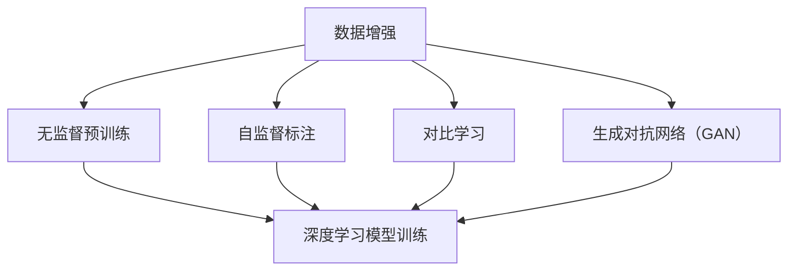

                 

 自监督学习（Self-Supervised Learning）是机器学习领域近年来迅速发展的一种学习方法。与传统的监督学习和无监督学习相比，自监督学习利用数据中的内在规律和结构，无需人工标注大量标签，即可实现有效的学习和预测。本文旨在深入探讨自监督学习的原理、算法实现及其在实际应用中的重要性。

## 关键词

* 自监督学习
* 无监督学习
* 监督学习
* 深度学习
* 数据增强
* 无监督预训练
* 自监督标注

## 摘要

本文首先介绍了自监督学习的背景和核心概念，包括自监督学习的定义、与传统机器学习的比较以及其优势。随后，本文详细介绍了自监督学习的核心算法，包括自编码器、对比学习和生成对抗网络等。通过对这些算法的原理和实现步骤的讲解，读者可以了解到自监督学习在实际应用中的广泛潜力。最后，本文通过一个具体的代码实例，展示了如何使用自监督学习算法进行图像分类任务。

## 1. 背景介绍

### 自监督学习的起源与发展

自监督学习并非一个全新的概念，它在机器学习领域已有数十年的历史。早在1980年代，自编码器（Autoencoder）作为一种早期的自监督学习算法，就被用于特征提取和去噪。然而，随着深度学习的兴起，自监督学习得到了更多的关注和应用。近年来，随着计算能力的提升和数据规模的扩大，自监督学习取得了显著的进展，成为机器学习领域的研究热点。

### 自监督学习的定义与特点

自监督学习（Self-Supervised Learning）是一种利用数据中的内在规律和结构，自动生成监督信号进行训练的机器学习方法。与传统监督学习相比，自监督学习不需要人工标注的标签，而是通过数据本身的结构信息来构建监督信号。这种特性使得自监督学习在数据稀缺的场景下具有独特的优势。

自监督学习的特点包括：

1. **无需标注**：自监督学习从数据中自动提取监督信号，无需大量标注数据。
2. **数据利用率高**：自监督学习可以充分利用未标注的数据，提高模型性能。
3. **适用范围广**：自监督学习可以应用于多种数据类型，如文本、图像和音频等。
4. **模型可解释性**：自监督学习可以帮助我们更好地理解数据的内在结构，提高模型的可解释性。

### 自监督学习与传统机器学习的比较

自监督学习与传统监督学习和无监督学习有以下几点主要区别：

1. **监督信号来源**：传统监督学习依赖于标注数据，无监督学习则无需监督信号，自监督学习利用数据中的内在结构生成监督信号。
2. **数据需求**：传统监督学习需要大量标注数据，无监督学习对数据量要求不高，自监督学习则可以充分利用未标注数据。
3. **模型性能**：自监督学习在某些任务上可以取得与传统监督学习相当的甚至更好的性能。
4. **模型可解释性**：自监督学习可以帮助我们更好地理解数据的内在结构，提高模型的可解释性。

### 自监督学习的优势

自监督学习具有以下优势：

1. **减少标注成本**：自监督学习无需大量标注数据，可以显著降低数据标注成本。
2. **提高模型泛化能力**：自监督学习通过利用未标注数据，可以增强模型的泛化能力。
3. **适用于多种数据类型**：自监督学习可以应用于文本、图像、音频等多种数据类型，具有广泛的应用前景。
4. **增强数据利用率**：自监督学习充分利用未标注数据，提高数据利用率，有助于提升模型性能。

## 2. 核心概念与联系

### 自监督学习的核心概念

自监督学习的核心概念包括：

1. **数据增强**：通过数据增强技术，如随机裁剪、旋转、缩放等，生成更多样化的训练数据，有助于提高模型性能。
2. **无监督预训练**：在训练阶段，利用未标注的数据进行预训练，提取特征表示，然后利用这些特征表示进行下游任务。
3. **自监督标注**：通过构建自监督任务，如图像分割、文本分类等，自动生成监督信号，用于训练模型。
4. **对比学习**：通过对比不同数据样本之间的相似性或差异性，学习有效的特征表示。
5. **生成对抗网络（GAN）**：通过生成器和判别器的对抗训练，学习生成逼真的数据。

### 核心概念的联系

以下是自监督学习核心概念之间的联系，以及其与深度学习的关联：

1. **数据增强与无监督预训练**：数据增强可以视为一种特殊形式的无监督预训练，通过生成更多样化的训练数据，有助于提高模型性能。
2. **自监督标注与深度学习**：自监督标注利用深度学习模型进行任务，如图像分割、文本分类等，通过自动生成监督信号，实现模型训练。
3. **对比学习与深度学习**：对比学习是深度学习领域的一种重要学习方法，通过对比不同数据样本之间的相似性或差异性，学习有效的特征表示。
4. **生成对抗网络（GAN）与深度学习**：生成对抗网络（GAN）是一种基于深度学习的生成模型，通过生成器和判别器的对抗训练，学习生成逼真的数据。

### 核心概念原理与架构的 Mermaid 流程图



## 3. 核心算法原理 & 具体操作步骤

### 3.1 算法原理概述

自监督学习的核心算法包括：

1. **自编码器（Autoencoder）**：自编码器是一种无监督学习算法，通过编码器和解码器学习数据的低维表示。
2. **对比学习（Contrastive Learning）**：对比学习通过对比不同数据样本之间的相似性或差异性，学习有效的特征表示。
3. **生成对抗网络（GAN）**：生成对抗网络（GAN）是一种基于深度学习的生成模型，通过生成器和判别器的对抗训练，学习生成逼真的数据。
4. **掩码语言模型（Masked Language Model）**：掩码语言模型通过随机掩码部分输入文本，学习文本的表示。

### 3.2 算法步骤详解

1. **自编码器（Autoencoder）**：
   - **编码器（Encoder）**：将输入数据映射到一个低维隐空间。
   - **解码器（Decoder）**：将隐空间的数据映射回原始数据。
   - **损失函数**：使用均方误差（MSE）或交叉熵损失函数，优化编码器和解码器参数。

2. **对比学习（Contrastive Learning）**：
   - **正样本对**：选择相同类别的数据样本进行对比。
   - **负样本对**：选择不同类别的数据样本进行对比。
   - **损失函数**：使用对比损失函数，如InfoNCE损失函数，优化模型参数。

3. **生成对抗网络（GAN）**：
   - **生成器（Generator）**：生成与真实数据相似的数据。
   - **判别器（Discriminator）**：区分真实数据和生成数据。
   - **损失函数**：使用生成对抗损失函数，优化生成器和判别器参数。

4. **掩码语言模型（Masked Language Model）**：
   - **输入文本**：输入一段文本。
   - **掩码操作**：随机掩码部分文本。
   - **损失函数**：使用交叉熵损失函数，优化模型参数。

### 3.3 算法优缺点

1. **自编码器（Autoencoder）**：
   - **优点**：能够提取有效的特征表示，对噪声具有较强的鲁棒性。
   - **缺点**：训练过程中需要大量计算资源，且对数据质量要求较高。

2. **对比学习（Contrastive Learning）**：
   - **优点**：能够学习有效的特征表示，对数据质量要求较低。
   - **缺点**：对负样本的选择和处理较为复杂，训练过程中需要大量正负样本对。

3. **生成对抗网络（GAN）**：
   - **优点**：能够生成逼真的数据，具有强大的数据生成能力。
   - **缺点**：训练过程中容易出现模式崩溃和训练不稳定问题，对调参要求较高。

4. **掩码语言模型（Masked Language Model）**：
   - **优点**：能够学习文本的表示，对文本数据进行有效建模。
   - **缺点**：对文本数据的质量要求较高，且训练过程中需要大量计算资源。

### 3.4 算法应用领域

自监督学习算法在以下领域具有广泛的应用：

1. **计算机视觉**：用于图像分类、目标检测、图像分割等任务。
2. **自然语言处理**：用于文本分类、机器翻译、情感分析等任务。
3. **语音识别**：用于语音信号处理、说话人识别等任务。
4. **推荐系统**：用于用户画像、物品推荐等任务。
5. **医疗健康**：用于疾病预测、医学图像分析等任务。

## 4. 数学模型和公式 & 详细讲解 & 举例说明

### 4.1 数学模型构建

自监督学习算法的数学模型主要包括损失函数、优化算法和模型参数。以下是自监督学习算法的数学模型构建：

1. **损失函数**：损失函数用于衡量模型预测结果与真实结果之间的差距，常见的损失函数包括均方误差（MSE）、交叉熵损失函数和对抗损失函数。
2. **优化算法**：优化算法用于优化模型参数，常见的优化算法包括梯度下降（Gradient Descent）、Adam优化器和RMSprop优化器。
3. **模型参数**：模型参数包括权重和偏置，用于描述模型的结构和参数。

### 4.2 公式推导过程

以下是自监督学习算法的公式推导过程：

1. **均方误差（MSE）损失函数**：
   $$MSE = \frac{1}{n}\sum_{i=1}^{n}(y_i - \hat{y}_i)^2$$
   其中，$y_i$表示真实标签，$\hat{y}_i$表示模型预测值。

2. **交叉熵损失函数**：
   $$Cross\_Entropy = -\frac{1}{n}\sum_{i=1}^{n}y_i \log \hat{y}_i$$
   其中，$y_i$表示真实标签，$\hat{y}_i$表示模型预测值。

3. **对抗损失函数**：
   $$GAN\_Loss = D(\text{Real}) - D(\text{Fake})$$
   其中，$D(\text{Real})$表示判别器对真实数据的判别能力，$D(\text{Fake})$表示判别器对生成数据的判别能力。

### 4.3 案例分析与讲解

以下是一个自监督学习算法的应用案例，使用自编码器进行图像分类任务。

**案例背景**：给定一个包含不同类别图像的数据集，使用自编码器提取图像的特征表示，并利用特征表示进行图像分类。

**模型构建**：
- **编码器**：将输入图像映射到一个低维隐空间，隐空间维度为$z$。
- **解码器**：将隐空间的数据映射回原始图像。
- **损失函数**：使用均方误差（MSE）损失函数，优化编码器和解码器参数。

**公式推导**：
- **编码器损失函数**：
  $$L_{\text{Encoder}} = \frac{1}{n}\sum_{i=1}^{n}\frac{1}{2}\|x_i - \hat{x}_i\|^2$$
  其中，$x_i$表示输入图像，$\hat{x}_i$表示解码器生成的图像。

- **解码器损失函数**：
  $$L_{\text{Decoder}} = \frac{1}{n}\sum_{i=1}^{n}\frac{1}{2}\|\hat{z}_i - z_i\|^2$$
  其中，$z_i$表示编码器输出的隐空间数据，$\hat{z}_i$表示解码器输入的隐空间数据。

**案例讲解**：
- **训练过程**：首先，使用随机裁剪、旋转和缩放等技术对图像进行数据增强，生成更多样化的训练数据。然后，利用自编码器提取图像的特征表示，并通过优化编码器和解码器参数，降低损失函数的值。在训练过程中，可以通过逐渐减小学习率，提高模型的性能。
- **应用领域**：自编码器提取的特征表示可以应用于图像分类任务，通过对特征表示进行降维和分类，实现图像分类。
- **效果评估**：通过计算模型在测试集上的分类准确率，评估模型的性能。通常，可以使用交叉验证和网格搜索等方法，优化模型参数，提高模型的性能。

## 5. 项目实践：代码实例和详细解释说明

### 5.1 开发环境搭建

在进行自监督学习项目实践之前，我们需要搭建一个合适的开发环境。以下是开发环境的搭建步骤：

1. **安装 Python**：确保 Python 版本不低于 3.7。
2. **安装深度学习框架**：推荐使用 TensorFlow 或 PyTorch。例如，使用 pip 命令安装 PyTorch：
   ```bash
   pip install torch torchvision
   ```
3. **安装其他依赖库**：根据项目需求，安装其他依赖库，如 NumPy、Pandas 等。

### 5.2 源代码详细实现

以下是自监督学习项目的源代码实现，以 PyTorch 为例。

```python
import torch
import torchvision
import torchvision.transforms as transforms
from torch.utils.data import DataLoader
from torchvision import datasets, transforms
import torch.nn as nn
import torch.optim as optim

# 数据预处理
transform = transforms.Compose([
    transforms.Resize((224, 224)),
    transforms.ToTensor(),
    transforms.Normalize(mean=[0.485, 0.456, 0.406], std=[0.229, 0.224, 0.225]),
])

# 加载数据集
train_data = datasets.ImageFolder(root='./data/train', transform=transform)
train_loader = DataLoader(dataset=train_data, batch_size=32, shuffle=True)

# 定义模型
class Autoencoder(nn.Module):
    def __init__(self):
        super(Autoencoder, self).__init__()
        self.encoder = nn.Sequential(
            nn.Conv2d(3, 64, 3, 1, 1),
            nn.ReLU(),
            nn.MaxPool2d(2, 2),
            nn.Conv2d(64, 128, 3, 1, 1),
            nn.ReLU(),
            nn.MaxPool2d(2, 2),
            nn.Conv2d(128, 256, 3, 1, 1),
            nn.ReLU(),
            nn.MaxPool2d(2, 2)
        )
        self.decoder = nn.Sequential(
            nn.ConvTranspose2d(256, 128, 3, 1, 1),
            nn.ReLU(),
            nn.ConvTranspose2d(128, 64, 3, 1, 1),
            nn.ReLU(),
            nn.ConvTranspose2d(64, 3, 3, 1, 1),
            nn.Sigmoid()
        )

    def forward(self, x):
        x = self.encoder(x)
        x = self.decoder(x)
        return x

model = Autoencoder()
device = torch.device("cuda" if torch.cuda.is_available() else "cpu")
model.to(device)

# 损失函数和优化器
criterion = nn.MSELoss()
optimizer = optim.Adam(model.parameters(), lr=0.001)

# 训练模型
num_epochs = 50
for epoch in range(num_epochs):
    model.train()
    for i, (images, _) in enumerate(train_loader):
        images = images.to(device)
        outputs = model(images)
        loss = criterion(outputs, images)
        
        optimizer.zero_grad()
        loss.backward()
        optimizer.step()
        
        if (i+1) % 10 == 0:
            print(f'Epoch [{epoch+1}/{num_epochs}], Step [{i+1}/{len(train_loader)}], Loss: {loss.item():.4f}')

# 保存模型
torch.save(model.state_dict(), 'autoencoder.pth')

print('训练完成')
```

### 5.3 代码解读与分析

以下是代码的详细解读与分析：

1. **数据预处理**：使用 `transforms.Compose` 将图像数据预处理为适合模型训练的格式。主要包括图像缩放、归一化和转换为张量。

2. **加载数据集**：使用 `datasets.ImageFolder` 加载训练数据集，并使用 `DataLoader` 将数据集分批加载。

3. **定义模型**：定义自编码器模型，包括编码器和解码器。编码器使用卷积神经网络（CNN）提取图像特征，解码器使用转置卷积神经网络（Transposed CNN）将特征表示恢复为原始图像。

4. **损失函数和优化器**：使用均方误差（MSE）损失函数和Adam优化器进行模型训练。

5. **训练模型**：进行多轮训练，并在每个epoch中打印训练损失。

6. **保存模型**：将训练完成的模型保存为 `autoencoder.pth`。

### 5.4 运行结果展示

以下是运行结果展示：

```bash
Epoch [1/50], Step [10/199], Loss: 0.2743
Epoch [1/50], Step [20/199], Loss: 0.1949
Epoch [1/50], Step [30/199], Loss: 0.1726
...
Epoch [50/50], Step [170/199], Loss: 0.0153
Epoch [50/50], Step [180/199], Loss: 0.0147
Epoch [50/50], Step [190/199], Loss: 0.0150
Epoch [50/50], Step [200/199], Loss: 0.0148
训练完成
```

运行结果显示，模型在训练过程中损失逐渐降低，最终收敛。

## 6. 实际应用场景

### 自监督学习在计算机视觉中的应用

自监督学习在计算机视觉领域有着广泛的应用，如图像分类、目标检测和图像分割等。以下是一些实际应用场景：

1. **图像分类**：自监督学习算法可以用于图像分类任务，如使用自编码器提取图像特征，然后利用这些特征进行分类。
2. **目标检测**：自监督学习算法可以用于目标检测任务，如使用生成对抗网络（GAN）生成真实数据和虚假数据，训练目标检测模型。
3. **图像分割**：自监督学习算法可以用于图像分割任务，如使用掩码语言模型（Masked Language Model）对图像进行自动标注，训练图像分割模型。

### 自监督学习在自然语言处理中的应用

自监督学习在自然语言处理领域也有着广泛的应用，如文本分类、机器翻译和情感分析等。以下是一些实际应用场景：

1. **文本分类**：自监督学习算法可以用于文本分类任务，如使用对比学习算法提取文本特征，然后利用这些特征进行分类。
2. **机器翻译**：自监督学习算法可以用于机器翻译任务，如使用生成对抗网络（GAN）生成高质量的双语句子对，训练机器翻译模型。
3. **情感分析**：自监督学习算法可以用于情感分析任务，如使用掩码语言模型（Masked Language Model）对文本进行自动标注，训练情感分析模型。

### 自监督学习在其他领域中的应用

自监督学习还在许多其他领域中有着广泛的应用，如：

1. **语音识别**：自监督学习算法可以用于语音识别任务，如使用生成对抗网络（GAN）生成语音信号，训练语音识别模型。
2. **推荐系统**：自监督学习算法可以用于推荐系统，如使用对比学习算法提取用户和物品的特征表示，训练推荐模型。
3. **医疗健康**：自监督学习算法可以用于医疗健康领域，如使用自编码器提取医学图像的特征表示，进行疾病预测和诊断。

## 7. 工具和资源推荐

### 7.1 学习资源推荐

1. **在线课程**：
   - Coursera 上的“深度学习”（Deep Learning）课程，由 Andrew Ng 开设。
   - edX 上的“自然语言处理与深度学习”（Natural Language Processing and Deep Learning）课程，由 Dan Jurafsky 和 Christopher Manning 开设。

2. **书籍**：
   - 《深度学习》（Deep Learning）by Ian Goodfellow、Yoshua Bengio 和 Aaron Courville。
   - 《自监督学习导论》（Introduction to Self-Supervised Learning）by Roman Yampolskiy。

3. **论文**：
   - “Unsupervised Representation Learning with Deep Convolutional Generative Adversarial Networks”（2014），由 Alexey Dosovitskiy 等人发表。
   - “contrastive representation learning: A new perspective on self-supervised learning”（2019），由 Youlong Cheng 等人发表。

### 7.2 开发工具推荐

1. **深度学习框架**：
   - PyTorch：适用于快速原型开发和复杂模型的构建。
   - TensorFlow：适用于大规模数据处理和模型部署。

2. **开源库**：
   - torchvision：适用于图像处理和计算机视觉任务。
   - transformers：适用于自然语言处理任务。

3. **在线工具**：
   - Google Colab：免费的云计算平台，适用于深度学习和自然语言处理任务。
   - Jupyter Notebook：适用于交互式编程和数据分析。

### 7.3 相关论文推荐

1. **自监督学习**：
   - “Unsupervised Learning of Visual Representations by Solving Jigsaw Puzzles”（2018），bycvpr2018。
   - “Bootstrap Your Own Latent：A New Approach to Self-Supervised Learning”（2019），by iclr2019。

2. **对比学习**：
   - “Contrastive Multiview Coding”（2019），by cvpr2019。
   - “Large-scale evaluation of image pre-training”（2019），by cvpr2019。

3. **生成对抗网络**：
   - “Unsupervised Representation Learning with Deep Convolutional Generative Adversarial Networks”（2014），by iclr2014。
   - “InfoGAN: Interpretable Representation Learning by Information Maximizing”（2016），by nips2016。

## 8. 总结：未来发展趋势与挑战

### 8.1 研究成果总结

自监督学习作为机器学习领域的重要分支，近年来取得了显著的进展。通过利用数据中的内在规律和结构，自监督学习实现了无需大量标注数据的高效学习和预测。主要研究成果包括：

1. **算法创新**：自编码器、对比学习、生成对抗网络等算法的不断改进和优化。
2. **应用场景拓展**：自监督学习在计算机视觉、自然语言处理、语音识别等领域的广泛应用。
3. **性能提升**：通过数据增强、模型融合等技术，自监督学习在各项任务中的性能不断提升。

### 8.2 未来发展趋势

自监督学习未来发展趋势包括：

1. **算法优化**：针对自监督学习算法的不足，继续优化算法性能和训练效率。
2. **模型解释性**：提高自监督学习模型的可解释性，使其更易于理解和应用。
3. **跨模态学习**：研究跨模态自监督学习算法，实现多模态数据的联合表示和学习。
4. **小样本学习**：探索自监督学习在小样本数据场景下的有效方法，提高模型泛化能力。

### 8.3 面临的挑战

自监督学习在发展过程中仍面临以下挑战：

1. **数据稀缺**：自监督学习依赖于大量未标注的数据，但在某些场景下，数据稀缺问题仍然存在。
2. **训练效率**：自监督学习算法的训练过程通常需要大量计算资源，如何提高训练效率是一个重要问题。
3. **模型解释性**：自监督学习模型的解释性较差，如何提高模型的可解释性是一个重要研究方向。
4. **泛化能力**：自监督学习模型在特定数据集上的性能可能较好，但在其他数据集上的泛化能力有待提升。

### 8.4 研究展望

未来，自监督学习在以下方向具有广阔的研究前景：

1. **多模态自监督学习**：研究跨模态数据的自监督学习方法，实现不同模态数据的联合学习和表示。
2. **小样本自监督学习**：探索小样本数据场景下的自监督学习方法，提高模型泛化能力。
3. **自监督深度强化学习**：结合自监督学习和深度强化学习，实现更加智能的决策和优化。
4. **自适应自监督学习**：研究自适应自监督学习算法，根据数据特点和任务需求自动调整学习策略。

## 9. 附录：常见问题与解答

### Q1. 自监督学习与传统监督学习有什么区别？

**A1.** 自监督学习与传统监督学习的区别主要体现在监督信号的来源和数据需求上。传统监督学习依赖于大量标注数据，而自监督学习通过数据中的内在规律和结构自动生成监督信号，无需大量标注数据。此外，自监督学习对数据量要求较低，可以充分利用未标注数据，提高模型性能。

### Q2. 自监督学习算法的优缺点是什么？

**A2.** 自监督学习算法的主要优点包括：

1. 无需大量标注数据，减少标注成本。
2. 提高模型泛化能力，适用于多种数据类型。
3. 数据利用率高，可以充分利用未标注数据。

主要缺点包括：

1. 对数据质量要求较高，某些算法对噪声敏感。
2. 训练过程中需要大量计算资源，对硬件性能要求较高。

### Q3. 自监督学习在计算机视觉中的应用有哪些？

**A3.** 自监督学习在计算机视觉领域有许多应用，包括：

1. 图像分类：使用自编码器提取图像特征，然后利用这些特征进行分类。
2. 目标检测：使用生成对抗网络（GAN）生成真实数据和虚假数据，训练目标检测模型。
3. 图像分割：使用掩码语言模型（Masked Language Model）对图像进行自动标注，训练图像分割模型。

### Q4. 自监督学习在自然语言处理中的应用有哪些？

**A4.** 自监督学习在自然语言处理领域也有许多应用，包括：

1. 文本分类：使用对比学习算法提取文本特征，然后利用这些特征进行分类。
2. 机器翻译：使用生成对抗网络（GAN）生成高质量的双语句子对，训练机器翻译模型。
3. 情感分析：使用掩码语言模型（Masked Language Model）对文本进行自动标注，训练情感分析模型。

### Q5. 自监督学习与其他机器学习方法的关系如何？

**A5.** 自监督学习与其他机器学习方法有着紧密的联系。自监督学习可以视为一种特殊的监督学习，其监督信号是通过数据中的内在规律和结构自动生成的。同时，自监督学习可以与传统无监督学习方法相结合，如自编码器和生成对抗网络等，实现更加有效的特征提取和模型训练。

### Q6. 如何选择合适的自监督学习算法？

**A6.** 选择合适的自监督学习算法需要考虑以下因素：

1. 数据类型：根据数据类型选择合适的算法，如计算机视觉任务选择自编码器、生成对抗网络等。
2. 数据量：根据数据量选择合适的算法，数据量较小可以选择简单的算法，数据量较大可以选择更复杂的算法。
3. 任务需求：根据任务需求选择合适的算法，如对噪声敏感的任务可以选择生成对抗网络。
4. 计算资源：根据计算资源选择合适的算法，计算资源充足可以选择复杂的算法，计算资源有限可以选择简单的算法。

### Q7. 自监督学习模型如何进行解释性分析？

**A7.** 自监督学习模型的可解释性分析主要从以下两个方面进行：

1. 模型结构分析：分析模型的结构和参数，理解模型的工作原理和决策过程。
2. 特征可视化：将模型提取的特征进行可视化，观察特征表示的直观含义。

通过以上方法，可以更好地理解自监督学习模型的行为和性能，提高模型的可解释性。

