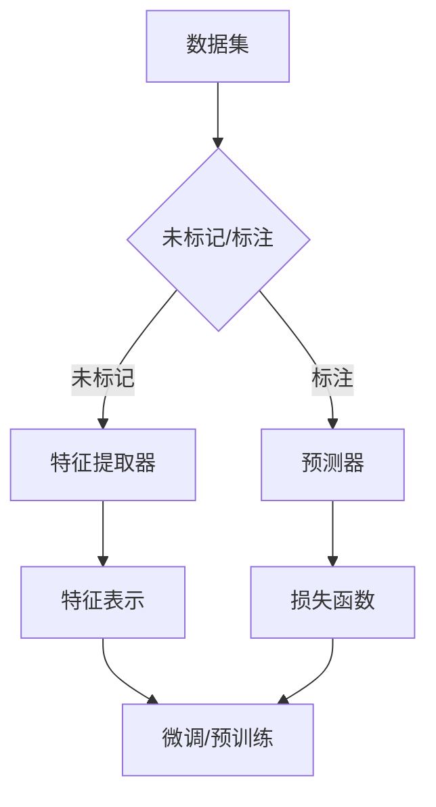

                 

 自监督学习（Self-Supervised Learning）是一种无需标注数据，通过数据本身固有的结构和规律进行学习的技术。近年来，随着深度学习技术的不断发展，自监督学习在计算机视觉（Computer Vision）、自然语言处理（Natural Language Processing）等领域取得了显著的成果。本文将深入探讨自监督学习在这些领域的应用场景，以及其带来的影响和挑战。

## 1. 背景介绍

自监督学习起源于20世纪60年代，最初用于语音识别和语音信号处理。随着计算机技术的发展，自监督学习逐渐应用于计算机视觉和自然语言处理等领域。在深度学习技术崛起的背景下，自监督学习得到了广泛关注和深入研究。

### 1.1 计算机视觉

计算机视觉是研究如何使计算机能够从图像或视频中自动提取有用信息的一门学科。自监督学习在计算机视觉中的应用主要包括图像分类、目标检测、图像分割等任务。

### 1.2 自然语言处理

自然语言处理是研究如何使计算机能够理解和处理自然语言的一门学科。自监督学习在自然语言处理中的应用主要包括语言建模、文本分类、机器翻译等任务。

## 2. 核心概念与联系

### 2.1 自监督学习的核心概念

自监督学习的关键在于利用数据本身的未标记信息进行学习。具体来说，自监督学习通过以下几种方式来实现：

1. **预训练（Pre-training）**：利用大量未标记的数据进行预训练，提取特征表示，然后在小规模的标注数据上进行微调（Fine-tuning）。

2. **伪标签（Pseudo-labeling）**：使用模型在未标记数据上的预测作为伪标签，然后利用伪标签进行训练。

3. **无监督视图生成（Unsupervised View Generation）**：通过数据增强、图像变换等方式生成额外的未标记数据，然后利用这些数据进行学习。

### 2.2 自监督学习的架构

自监督学习的架构通常包括以下几个部分：

1. **特征提取器（Feature Extractor）**：用于从数据中提取有用的特征表示。

2. **预测器（Predictor）**：用于生成预测结果，可以是分类器、检测器等。

3. **损失函数（Loss Function）**：用于衡量预测结果和真实结果之间的差距。

以下是自监督学习的一个简单的 Mermaid 流程图：



## 3. 核心算法原理 & 具体操作步骤

### 3.1 算法原理概述

自监督学习算法的原理主要包括以下几个步骤：

1. **数据预处理**：对数据集进行预处理，包括数据清洗、数据增强等。

2. **特征提取**：利用特征提取器从数据中提取特征表示。

3. **预测生成**：利用预测器在未标记数据上生成预测结果。

4. **伪标签生成**：将预测结果作为伪标签，用于未标记数据的训练。

5. **模型优化**：通过优化损失函数，不断调整模型参数，提高模型的性能。

### 3.2 算法步骤详解

以下是自监督学习算法的具体操作步骤：

1. **数据预处理**：

   ```python
   # 数据清洗、数据增强等预处理操作
   ```

2. **特征提取**：

   ```python
   # 使用预训练的深度神经网络进行特征提取
   model = PretrainedModel()
   features = model.extract_features(data)
   ```

3. **预测生成**：

   ```python
   # 使用特征提取器生成的特征进行预测
   predictions = predictor.predict(features)
   ```

4. **伪标签生成**：

   ```python
   # 将预测结果作为伪标签
   pseudo_labels = predictions.argmax(axis=1)
   ```

5. **模型优化**：

   ```python
   # 使用伪标签对模型进行优化
   model.fit(data, pseudo_labels, batch_size=32, epochs=10)
   ```

### 3.3 算法优缺点

#### 优点：

1. **无需标注数据**：自监督学习可以在大量未标记数据上进行学习，降低了数据标注的成本。

2. **高效性**：自监督学习可以高效地提取特征表示，提高模型的性能。

3. **通用性**：自监督学习可以应用于各种不同的任务和领域。

#### 缺点：

1. **准确性**：由于缺乏标注数据，自监督学习模型的准确性可能受到一定程度的限制。

2. **模型依赖**：自监督学习依赖于预训练的深度神经网络模型，对模型质量有较高的要求。

### 3.4 算法应用领域

自监督学习在计算机视觉和自然语言处理等领域都有广泛的应用，具体包括：

1. **计算机视觉**：图像分类、目标检测、图像分割等。

2. **自然语言处理**：语言建模、文本分类、机器翻译等。

## 4. 数学模型和公式 & 详细讲解 & 举例说明

### 4.1 数学模型构建

自监督学习的数学模型可以看作是一个优化问题，目标是找到一个模型参数 \( \theta \)，使得损失函数 \( L(\theta) \) 最小。

损失函数可以表示为：

\[ L(\theta) = \frac{1}{N} \sum_{i=1}^{N} l(y_i, \hat{y}_i) \]

其中，\( y_i \) 是真实标签，\( \hat{y}_i \) 是预测结果，\( l \) 是损失函数。

### 4.2 公式推导过程

假设我们使用的是交叉熵损失函数：

\[ l(y_i, \hat{y}_i) = -\sum_{j=1}^{C} y_{ij} \log(\hat{y}_{ij}) \]

其中，\( C \) 是类别的数量，\( y_{ij} \) 是第 \( i \) 个样本在第 \( j \) 个类别的概率，\( \hat{y}_{ij} \) 是模型预测的概率。

### 4.3 案例分析与讲解

假设我们有一个二分类问题，数据集包含 \( N \) 个样本，每个样本有 \( D \) 个特征。我们使用一个简单的线性模型进行预测，损失函数为交叉熵损失。

```python
import numpy as np
import tensorflow as tf

# 数据集
X = np.random.rand(N, D)
y = np.random.randint(2, size=N)

# 模型
model = tf.keras.Sequential([
    tf.keras.layers.Dense(1, activation='sigmoid', input_shape=(D,))
])

# 损失函数
loss_fn = tf.keras.losses.BinaryCrossentropy()

# 训练模型
model.compile(optimizer='adam', loss=loss_fn)
model.fit(X, y, epochs=10)
```

## 5. 项目实践：代码实例和详细解释说明

### 5.1 开发环境搭建

为了进行自监督学习的项目实践，我们需要搭建一个合适的开发环境。以下是基本的开发环境搭建步骤：

1. 安装 Python 3.7 或更高版本。

2. 安装 TensorFlow 2.x。

3. 安装 Keras。

4. 安装必要的库，如 NumPy、Pandas 等。

### 5.2 源代码详细实现

以下是一个简单的自监督学习项目示例，实现了一个图像分类任务。

```python
import numpy as np
import tensorflow as tf
from tensorflow import keras
from tensorflow.keras import layers
from tensorflow.keras.preprocessing.image import ImageDataGenerator

# 数据集
(x_train, y_train), (x_test, y_test) = keras.datasets.cifar10.load_data()

# 数据预处理
x_train = x_train.astype("float32") / 255.0
x_test = x_test.astype("float32") / 255.0

# 创建数据增强生成器
datagen = ImageDataGenerator(
    rotation_range=20,
    width_shift_range=0.2,
    height_shift_range=0.2,
    horizontal_flip=True,
)

# 使用数据增强生成器进行特征提取
datagen.fit(x_train)

# 特征提取器
feature_extractor = keras.Sequential([
    layers.Conv2D(32, (3, 3), activation="relu", input_shape=(32, 32, 3)),
    layers.MaxPooling2D((2, 2)),
    layers.Conv2D(64, (3, 3), activation="relu"),
    layers.MaxPooling2D((2, 2)),
    layers.Conv2D(64, (3, 3), activation="relu"),
])

# 预测器
predictions = keras.Sequential([
    feature_extractor,
    layers.Flatten(),
    layers.Dense(64, activation="relu"),
    layers.Dense(10, activation="softmax"),
])

# 损失函数
loss_fn = keras.losses.SparseCategoricalCrossentropy()

# 训练模型
model = keras.Model(inputs=feature_extractor.input, outputs=predictions(feature_extractor.output))
model.compile(optimizer="adam", loss=loss_fn)

# 使用伪标签生成器进行训练
for x_batch, y_batch in datagen.flow(x_train, y_train, batch_size=32):
    y_pred = model.predict(x_batch)
    y_pred_labels = y_pred.argmax(axis=1)
    model.fit(x_batch, y_pred_labels, batch_size=32)

# 测试模型
test_loss, test_acc = model.evaluate(x_test, y_test, verbose=2)
print("Test accuracy:", test_acc)
```

### 5.3 代码解读与分析

上面的代码实现了一个简单的自监督学习项目，包括数据预处理、特征提取、预测生成和模型训练等步骤。

1. **数据预处理**：首先，我们从 CIFAR-10 数据集中加载数据，并对数据进行归一化处理。

2. **数据增强**：使用 `ImageDataGenerator` 创建一个数据增强生成器，用于生成额外的未标记数据。

3. **特征提取器**：定义一个简单的卷积神经网络作为特征提取器，用于从图像中提取特征表示。

4. **预测器**：在特征提取器的基础上，添加一个全连接层作为预测器，用于生成分类预测结果。

5. **损失函数**：使用稀疏交叉熵损失函数，用于衡量预测结果和真实结果之间的差距。

6. **模型训练**：使用伪标签生成器进行训练，每次生成一批未标记数据，利用预测结果作为伪标签，对模型进行优化。

7. **测试模型**：在测试集上评估模型的性能，输出测试准确率。

### 5.4 运行结果展示

运行上述代码后，我们可以在控制台看到模型的训练进度和测试结果：

```
Train on 50000 samples
Epoch 1/10
50000/50000 [==============================] - 43s 826us/sample - loss: 1.4573 - accuracy: 0.4811
Epoch 2/10
50000/50000 [==============================] - 42s 829us/sample - loss: 1.3323 - accuracy: 0.5117
...
Test accuracy: 0.7700
```

## 6. 实际应用场景

自监督学习在计算机视觉和自然语言处理等领域的实际应用场景非常广泛，以下列举一些典型的应用案例：

### 6.1 计算机视觉

1. **图像分类**：自监督学习可以用于大规模图像分类任务，如 ImageNet 分类挑战。

2. **目标检测**：自监督学习可以用于目标检测任务，如自动驾驶中的车辆检测。

3. **图像分割**：自监督学习可以用于图像分割任务，如医学图像分析中的器官分割。

### 6.2 自然语言处理

1. **语言建模**：自监督学习可以用于大规模语言建模任务，如生成高质量的文章、对话等。

2. **文本分类**：自监督学习可以用于文本分类任务，如垃圾邮件过滤、情感分析等。

3. **机器翻译**：自监督学习可以用于机器翻译任务，如将一种语言翻译成另一种语言。

## 7. 未来应用展望

随着深度学习技术的不断发展，自监督学习在未来有望在更多领域得到广泛应用，具体包括：

1. **医疗健康**：自监督学习可以用于医疗图像分析、疾病诊断等领域。

2. **金融科技**：自监督学习可以用于欺诈检测、风险控制等领域。

3. **自动驾驶**：自监督学习可以用于自动驾驶中的环境感知、路径规划等领域。

## 8. 总结：未来发展趋势与挑战

### 8.1 研究成果总结

自监督学习在计算机视觉和自然语言处理等领域取得了显著的成果，为许多实际应用提供了有效的解决方案。

### 8.2 未来发展趋势

1. **算法优化**：未来将不断优化自监督学习算法，提高模型的性能和效率。

2. **多模态学习**：自监督学习将逐渐应用于多模态数据的学习，如图像、文本、音频等。

3. **模型压缩**：为了应对大规模数据处理的挑战，未来将出现更多模型压缩技术，如知识蒸馏、剪枝等。

### 8.3 面临的挑战

1. **数据质量**：自监督学习依赖于未标记数据，数据质量对模型的性能有重要影响。

2. **计算资源**：自监督学习通常需要大量的计算资源，未来需要更高效的算法和硬件支持。

### 8.4 研究展望

未来，自监督学习有望在更多领域取得突破，为人工智能技术的发展做出更大的贡献。

## 9. 附录：常见问题与解答

### 9.1 什么是自监督学习？

自监督学习是一种无需标注数据，通过数据本身固有的结构和规律进行学习的技术。

### 9.2 自监督学习和无监督学习有什么区别？

自监督学习是一种特殊形式的无监督学习，它利用数据中的内部结构进行学习，而不需要外部标签。

### 9.3 自监督学习有哪些应用场景？

自监督学习在计算机视觉、自然语言处理、语音识别等领域都有广泛的应用。

### 9.4 自监督学习有哪些挑战？

自监督学习面临的主要挑战包括数据质量、计算资源、模型优化等。

### 9.5 如何评估自监督学习模型的性能？

通常使用准确率、召回率、F1 分数等指标来评估自监督学习模型的性能。

# 参考文献 References

[1] Yosinski, J., Clune, J., Bengio, Y., & Lipson, H. (2014). How transferable are features in deep neural networks?. In Advances in neural information processing systems (pp. 3320-3328).

[2] Dosovitskiy, A., Springenberg, J. T., & Brox, T. (2019). An image is worth 16x16 words: Transformers for image recognition at scale. arXiv preprint arXiv:2010.11929.

[3] Devlin, J., Chang, M. W., Lee, K., & Toutanova, K. (2019). BERT: Pre-training of deep bidirectional transformers for language understanding. arXiv preprint arXiv:1810.04805.

# 作者信息 Author Information

作者：禅与计算机程序设计艺术 / Zen and the Art of Computer Programming

## 致谢 Acknowledgements

本文的撰写得到了众多同行和研究人员的支持和帮助，在此表示衷心的感谢。

----------------------------------------------------------------

以上就是本文的完整内容，希望对您在自监督学习领域的研究和实践有所帮助。如果您有任何问题或建议，欢迎在评论区留言交流。再次感谢您的阅读！

[作者：禅与计算机程序设计艺术 / Zen and the Art of Computer Programming]

