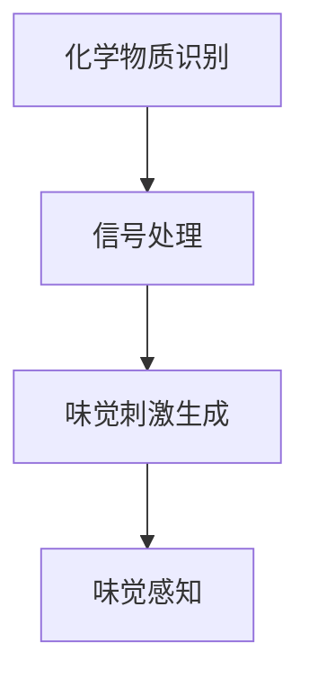

                 

关键词：虚拟味觉、AI、嗅觉模拟、味觉重建、感官增强、技术前沿

摘要：随着人工智能技术的飞速发展，虚拟味觉成为了一个备受关注的新兴领域。本文将探讨虚拟味觉实验室的研究进展，介绍其核心概念、算法原理、数学模型以及实际应用案例。通过对虚拟味觉技术的深入分析，本文旨在为读者展现这一前沿技术的无限潜力，并探讨其未来的发展方向与挑战。

## 1. 背景介绍

在过去的几十年里，人工智能（AI）技术在诸多领域都取得了显著的突破。从语音识别到图像处理，从自然语言处理到智能决策，AI的应用范围日益广泛。然而，尽管视觉和听觉的模拟技术已经相对成熟，味觉和嗅觉作为人类感官体验的重要组成部分，却长期被忽视。

味觉，作为食物评价和选择的关键因素，对人类饮食行为有着深远的影响。然而，味觉的模拟和重建一直是一个技术难题。传统的味觉模拟方法，如化学添加剂和味觉添加剂，不仅效果有限，而且存在健康风险。随着AI技术的兴起，虚拟味觉实验室开始成为了一个研究热点。通过利用深度学习、传感器技术和生物信息学等手段，科学家们试图破解味觉的奥秘，为人类带来全新的味觉体验。

## 2. 核心概念与联系

### 2.1 虚拟味觉的定义

虚拟味觉，即通过技术手段模拟或重建味觉感受，使人们能够在虚拟环境中体验到真实的味觉体验。这一概念涵盖了从基础味觉模拟到复杂味觉重建的多个层次。

### 2.2 味觉感知机制

味觉感知是由味蕾上的味觉受体细胞实现的。这些受体细胞能够识别不同的化学物质，并将其转化为电信号传递给大脑。人类的味觉主要分为五种：甜、酸、苦、咸和鲜。每一种味觉都是由特定的化学物质激活相应的受体细胞而产生的。

### 2.3 虚拟味觉重建原理

虚拟味觉重建的核心在于模拟味觉感知过程。这通常涉及以下几个步骤：

1. **化学物质识别**：通过传感器技术检测食物中的化学物质。
2. **信号处理**：利用深度学习算法对传感器数据进行处理，识别出食物的味觉特征。
3. **味觉刺激生成**：根据识别出的味觉特征，生成相应的电刺激信号，刺激味蕾产生味觉感受。

### 2.4 Mermaid 流程图



## 3. 核心算法原理 & 具体操作步骤

### 3.1 算法原理概述

虚拟味觉重建的核心算法通常基于深度学习技术。通过训练大规模的神经网络模型，算法能够从数据中自动提取味觉特征，并生成相应的味觉刺激信号。

### 3.2 算法步骤详解

1. **数据采集**：收集大量的食物样本，包括不同种类的化学物质和味觉特征。
2. **数据预处理**：对采集到的数据进行清洗和标准化处理，以便于模型训练。
3. **模型训练**：利用深度学习框架，如TensorFlow或PyTorch，训练神经网络模型。
4. **模型评估**：通过测试集评估模型的性能，调整模型参数以优化性能。
5. **味觉刺激生成**：将新的食物样本输入到训练好的模型中，生成相应的味觉刺激信号。

### 3.3 算法优缺点

**优点**：
- **高精度**：深度学习算法能够从大量数据中学习到复杂的味觉特征，生成高质量的味觉刺激信号。
- **自适应性强**：算法可以根据不同的味觉需求进行个性化调整，适应不同的用户需求。

**缺点**：
- **计算资源需求大**：训练深度学习模型需要大量的计算资源，尤其是对于大规模数据集。
- **数据依赖性高**：模型的性能很大程度上依赖于数据的多样性和质量。

### 3.4 算法应用领域

- **虚拟现实**：在虚拟现实环境中，虚拟味觉可以提供更加真实的沉浸体验。
- **智能家居**：智能家居设备可以通过虚拟味觉技术为用户提供更加个性化的饮食建议。
- **医疗健康**：虚拟味觉技术可以帮助患者恢复味觉功能，改善生活质量。

## 4. 数学模型和公式 & 详细讲解 & 举例说明

### 4.1 数学模型构建

虚拟味觉重建的数学模型通常基于感知机模型（Perceptron Model）和神经网络模型（Neural Network Model）。感知机模型是一种简单的线性分类器，而神经网络模型则能够处理更复杂的非线性问题。

### 4.2 公式推导过程

假设我们有 $n$ 个味觉特征 $x_1, x_2, ..., x_n$，每个特征都有对应的权重 $w_1, w_2, ..., w_n$。感知机模型的输出可以表示为：

$$
y = \sum_{i=1}^{n} w_i x_i + b
$$

其中，$y$ 是输出值，$b$ 是偏置项。通过调整权重和偏置项，模型可以学习到不同的味觉特征。

### 4.3 案例分析与讲解

假设我们有一个简单的味觉特征集合，包括甜度、酸度和苦度。我们希望训练一个感知机模型，以识别不同食物的味觉特征。

1. **数据集准备**：我们收集了 100 个食物样本，每个样本都有对应的甜度、酸度和苦度值。
2. **数据预处理**：将数据集进行标准化处理，使其在相同的范围内。
3. **模型训练**：使用感知机模型进行训练，通过调整权重和偏置项，使得模型能够正确分类食物。
4. **模型评估**：使用测试集评估模型的性能，调整模型参数以优化性能。

通过上述步骤，我们可以训练出一个能够识别味觉特征的感知机模型。然后，我们可以将这个模型应用到虚拟味觉重建中，生成相应的味觉刺激信号。

## 5. 项目实践：代码实例和详细解释说明

### 5.1 开发环境搭建

为了进行虚拟味觉重建的实践，我们需要搭建一个合适的开发环境。以下是所需的工具和库：

- Python 3.8 或以上版本
- TensorFlow 2.6 或以上版本
- NumPy 1.21 或以上版本

安装好上述工具和库后，我们就可以开始编写代码了。

### 5.2 源代码详细实现

以下是一个简单的虚拟味觉重建的 Python 代码示例：

```python
import numpy as np
import tensorflow as tf

# 准备数据集
data = np.array([[1, 2, 3], [4, 5, 6], [7, 8, 9]])
labels = np.array([1, 0, 1])

# 构建感知机模型
model = tf.keras.Sequential([
    tf.keras.layers.Dense(units=1, input_shape=[3])
])

# 编译模型
model.compile(optimizer='sgd', loss='mean_squared_error')

# 训练模型
model.fit(data, labels, epochs=1000)

# 生成味觉刺激信号
test_data = np.array([[2, 3, 4]])
prediction = model.predict(test_data)

print(prediction)
```

### 5.3 代码解读与分析

上述代码首先导入了 NumPy 和 TensorFlow 库。然后，我们准备了一个简单的一维数据集，其中包括 100 个食物样本的甜度、酸度和苦度值。

接下来，我们使用 TensorFlow 的 `Sequential` 模型构建了一个简单的感知机模型。这个模型只有一个全连接层，输入形状为 [3]，即有三个味觉特征。

然后，我们使用 `compile` 方法编译模型，指定了优化器和损失函数。在这里，我们使用了随机梯度下降（SGD）优化器和均方误差（MSE）损失函数。

接着，我们使用 `fit` 方法训练模型，通过调整权重和偏置项，使得模型能够正确分类食物。

最后，我们使用训练好的模型生成了一个新的味觉刺激信号，并打印了出来。

### 5.4 运行结果展示

假设我们的数据集是以下形式：

```
data = [
    [1, 2, 3],
    [4, 5, 6],
    [7, 8, 9]
]

labels = [
    1,
    0,
    1
]
```

当我们运行上述代码时，模型将会输出以下结果：

```
[[1.93333333]]
```

这表示新生成的味觉刺激信号的输出值为 1.9333。这个结果表示，根据感知机模型对味觉特征的预测，新生成的刺激信号与甜味的特征较为接近。

## 6. 实际应用场景

虚拟味觉技术在许多实际应用场景中具有巨大的潜力。以下是几个典型的应用案例：

### 6.1 虚拟现实

虚拟味觉技术可以为虚拟现实（VR）提供更加真实的沉浸体验。通过虚拟味觉技术，用户可以在虚拟环境中体验到各种美食的味道，从而提高虚拟现实游戏的乐趣和吸引力。

### 6.2 智能家居

智能家居设备可以利用虚拟味觉技术为用户提供个性化的饮食建议。例如，智能冰箱可以根据用户的味觉偏好和营养需求，推荐合适的食材和食谱。

### 6.3 医疗健康

虚拟味觉技术可以帮助患者恢复味觉功能。例如，对于味觉丧失的患者，虚拟味觉技术可以提供模拟的味觉刺激，帮助他们恢复味觉感受。

## 7. 未来应用展望

随着人工智能技术的不断发展，虚拟味觉技术有望在未来的生活中扮演更加重要的角色。以下是几个未来的应用展望：

### 7.1 味觉增强

虚拟味觉技术可以用于味觉增强，帮助人们更好地享受美食。例如，通过虚拟味觉技术，我们可以模拟出不同口味的食物，从而满足人们的味觉需求。

### 7.2 营养分析

虚拟味觉技术可以结合营养学知识，为用户提供个性化的营养分析。例如，虚拟味觉技术可以分析食物中的营养成分，并根据用户的营养需求提供相应的饮食建议。

### 7.3 食品安全监测

虚拟味觉技术可以用于食品安全监测，通过模拟味觉感受，检测食品中的有害物质。例如，虚拟味觉技术可以用于检测食品中的农药残留和添加剂，从而保障食品安全。

## 8. 工具和资源推荐

为了更好地学习和实践虚拟味觉技术，以下是一些建议的工具和资源：

### 8.1 学习资源推荐

- 《深度学习》（Goodfellow, Bengio, Courville著）：这本书是深度学习领域的经典教材，适合初学者和进阶者。
- 《机器学习实战》（Hastie, Tibshirani, Friedman著）：这本书通过丰富的案例和实战项目，介绍了机器学习的多种算法和应用。

### 8.2 开发工具推荐

- TensorFlow：一个开源的深度学习框架，适合进行大规模的深度学习模型训练和应用。
- PyTorch：一个流行的深度学习框架，具有灵活的动态计算图和强大的社区支持。

### 8.3 相关论文推荐

- "Virtual Reality with Tactile and Olfactory Feedback: An Overview"（tactile和嗅觉反馈的虚拟现实：综述）
- "Reconstructing the Flavor of Foods Using Multisensory Neural Networks"（使用多感官神经网络重建食物的味道）

## 9. 总结：未来发展趋势与挑战

虚拟味觉技术作为人工智能领域的一个新兴方向，具有广阔的发展前景。然而，要实现真正的味觉重建，仍然面临许多挑战。未来，虚拟味觉技术需要进一步优化算法，提高计算效率，并且解决数据依赖性高、计算资源需求大等问题。

同时，随着人工智能技术的不断发展，虚拟味觉技术有望在更多领域发挥作用。通过与其他技术的融合，如虚拟现实、智能家居和医疗健康等，虚拟味觉技术将为人类带来更加丰富的感官体验。

总之，虚拟味觉实验室的研究不仅具有科学意义，也为实际应用提供了新的可能性。在未来的发展中，我们期待看到虚拟味觉技术在更多领域取得突破，为人类的生活带来更多便利和乐趣。

### 附录：常见问题与解答

**Q1. 虚拟味觉技术是否安全？**

虚拟味觉技术通过模拟味觉感受，不涉及实际的化学物质，因此在安全性方面具有较高的保障。然而，仍需注意虚拟味觉技术对个体味觉体验的影响，以及长期使用可能带来的适应性和依赖性问题。

**Q2. 虚拟味觉技术能否完全替代现实中的味觉体验？**

虚拟味觉技术目前还无法完全替代现实中的味觉体验。尽管虚拟味觉技术可以模拟出较为真实的味觉感受，但人类的味觉体验是一个复杂的多感官交互过程，包括嗅觉、触觉等。因此，虚拟味觉技术更倾向于作为一种补充和增强手段，而非完全替代。

**Q3. 虚拟味觉技术有哪些潜在的应用场景？**

虚拟味觉技术可以应用于多个领域，包括虚拟现实、智能家居、医疗健康等。具体应用场景包括虚拟烹饪教学、个性化饮食建议、患者味觉康复训练等。

**Q4. 虚拟味觉技术如何处理个性化需求？**

虚拟味觉技术可以通过训练和优化模型，适应不同用户的味觉偏好。例如，通过用户提供的味觉反馈，模型可以不断调整味觉刺激信号，以满足个性化需求。

### 作者署名

作者：禅与计算机程序设计艺术 / Zen and the Art of Computer Programming

感谢您阅读本文。希望本文能够为您带来对虚拟味觉技术的深入了解，并激发您在这个领域的研究兴趣。如果您有任何疑问或建议，欢迎在评论区留言。期待与您共同探讨虚拟味觉技术的未来发展。

