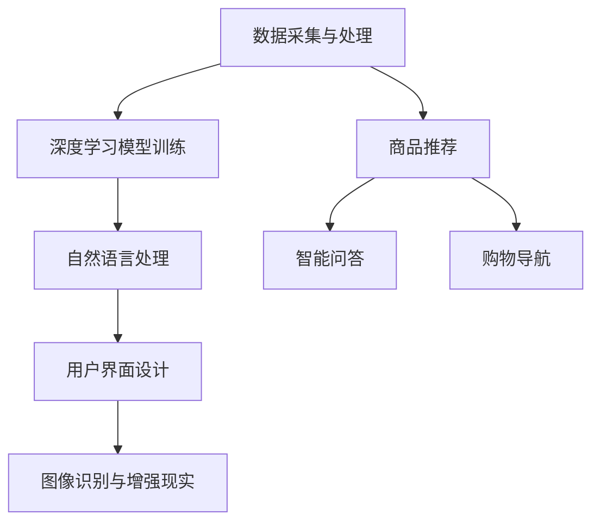
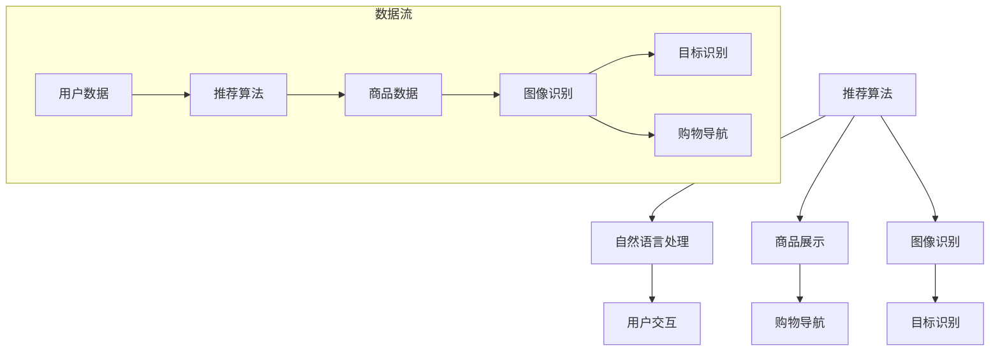

                 

关键词：人工智能，虚拟导购，购物体验，增强现实，大数据分析

> 摘要：随着人工智能技术的飞速发展，虚拟导购助手已经成为电商平台的重要工具。本文将从核心概念、算法原理、数学模型、项目实践、应用场景、工具推荐以及未来发展趋势等方面，详细探讨AI如何改变购物体验，为消费者提供更加个性化和高效的服务。

## 1. 背景介绍

在电商蓬勃发展的今天，购物体验成为了商家和消费者共同关注的焦点。然而，传统电商的购物体验往往存在以下几个问题：信息过载、商品推荐不准确、用户交互体验差等。这些问题极大地影响了用户的购物体验和转化率。

为了解决这些问题，人工智能（AI）技术逐渐成为电商平台优化购物体验的关键手段。虚拟导购助手作为AI技术的一种应用，通过深度学习、自然语言处理、图像识别等技术，为用户提供个性化推荐、智能问答、购物导航等服务，从而提升购物体验。

## 2. 核心概念与联系

### 2.1 虚拟导购助手的基本概念

虚拟导购助手是一种基于人工智能技术的智能服务系统，旨在通过模拟导购人员的角色，为用户提供商品推荐、购物咨询、商品查询等全方位的购物服务。

### 2.2 虚拟导购助手的技术架构

虚拟导购助手的技术架构主要包括以下几个关键组件：

1. 数据采集与处理：通过采集用户行为数据、商品信息、用户评价等，构建大数据分析的基础。
2. 深度学习模型：基于用户数据，训练深度学习模型，实现个性化推荐和智能问答。
3. 自然语言处理（NLP）：处理用户输入，理解用户意图，生成相应的回答。
4. 图像识别与增强现实（AR）：通过图像识别技术，实现商品展示和购物导航。
5. 用户界面（UI）设计：提供友好、易用的用户交互界面。

### 2.3 核心概念原理与架构的 Mermaid 流程图



## 3. 核心算法原理 & 具体操作步骤

### 3.1 算法原理概述

虚拟导购助力的核心算法主要包括推荐算法、自然语言处理算法和图像识别算法。其中，推荐算法负责基于用户行为和兴趣进行商品推荐；自然语言处理算法负责理解和生成用户与导购助手的对话内容；图像识别算法负责商品展示和购物导航。

### 3.2 算法步骤详解

#### 3.2.1 推荐算法

1. 数据采集：收集用户行为数据（如浏览记录、购买历史、评价等）。
2. 特征提取：提取用户行为数据中的关键特征（如用户兴趣、购买偏好等）。
3. 模型训练：基于用户特征，训练推荐模型（如协同过滤、基于内容的推荐等）。
4. 商品推荐：根据用户特征和推荐模型，生成个性化商品推荐列表。

#### 3.2.2 自然语言处理算法

1. 对话理解：通过词向量模型，将用户输入转换为低维向量。
2. 意图识别：使用分类模型，判断用户输入的意图（如查询商品、购买商品等）。
3. 回答生成：根据用户意图，生成相应的回答（如商品推荐、购物导航等）。

#### 3.2.3 图像识别算法

1. 图像预处理：对输入图像进行预处理（如灰度化、二值化等）。
2. 特征提取：使用卷积神经网络（CNN），提取图像特征。
3. 目标识别：使用分类模型，识别图像中的目标（如商品图片、购物车等）。
4. 购物导航：根据目标识别结果，生成购物导航路径。

### 3.3 算法优缺点

#### 3.3.1 推荐算法

**优点**：能够根据用户行为和兴趣，提供个性化的商品推荐。

**缺点**：当用户行为数据不足时，推荐效果可能较差。

#### 3.3.2 自然语言处理算法

**优点**：能够理解和生成用户与导购助手的对话内容，提升用户交互体验。

**缺点**：在处理长文本和复杂语义时，准确率可能较低。

#### 3.3.3 图像识别算法

**优点**：能够实现商品展示和购物导航，提高用户购物体验。

**缺点**：在处理复杂背景或低质量图像时，识别效果可能较差。

### 3.4 算法应用领域

虚拟导购助手在电商、旅游、零售等多个领域具有广泛的应用。例如，在电商领域，虚拟导购助手可以用于商品推荐、购物咨询、订单追踪等；在旅游领域，可以用于景点推荐、导游服务、路线规划等。

## 4. 数学模型和公式 & 详细讲解 & 举例说明

### 4.1 数学模型构建

虚拟导购助力的数学模型主要包括推荐模型、自然语言处理模型和图像识别模型。以下是这些模型的简要介绍：

#### 4.1.1 推荐模型

推荐模型通常采用矩阵分解（Matrix Factorization）的方法，将用户行为数据表示为低维向量，从而实现个性化推荐。

假设用户行为数据矩阵为$X \in R^{m \times n}$，其中$m$表示用户数量，$n$表示商品数量。矩阵分解的目标是找到两个低维矩阵$U \in R^{m \times k}$和$V \in R^{n \times k}$，使得$X \approx UV$。

#### 4.1.2 自然语言处理模型

自然语言处理模型通常采用词向量模型（Word Embedding）和长短期记忆网络（Long Short-Term Memory，LSTM）。

词向量模型将单词表示为高维向量，从而实现文本的向量化表示。假设词汇表中有$v$个单词，词向量维度为$d$，则单词$w_i$的词向量表示为$vectors_i \in R^d$。

长短期记忆网络用于处理序列数据，能够捕捉序列中的长期依赖关系。假设输入序列为$x_1, x_2, ..., x_T$，则LSTM的输出为$h_t = \text{LSTM}(h_{t-1}, x_t)$，其中$h_{t-1}$为前一个时间步的隐藏状态。

#### 4.1.3 图像识别模型

图像识别模型通常采用卷积神经网络（Convolutional Neural Network，CNN）。

CNN通过多个卷积层、池化层和全连接层，对输入图像进行特征提取和分类。假设输入图像为$I \in R^{h \times w \times c}$，其中$h$、$w$和$c$分别表示图像的高、宽和通道数。则CNN的输出为$y = \text{softmax}(\text{FC}(C \odot P_2 \odot P_1(\text{Conv}_2(\text{Conv}_1(I)))))$，其中$C$为类别数量。

### 4.2 公式推导过程

#### 4.2.1 推荐模型

矩阵分解的损失函数通常采用均方误差（Mean Squared Error，MSE）：

$$
L = \frac{1}{2} \sum_{i=1}^{m} \sum_{j=1}^{n} (x_{ij} - u_i^T v_j)^2
$$

为了最小化损失函数，我们可以对$U$和$V$进行梯度下降：

$$
\frac{\partial L}{\partial u_i} = \sum_{j=1}^{n} (x_{ij} - u_i^T v_j) v_j
$$

$$
\frac{\partial L}{\partial v_j} = \sum_{i=1}^{m} (x_{ij} - u_i^T v_j) u_i
$$

#### 4.2.2 自然语言处理模型

词向量模型的损失函数通常采用负采样（Negative Sampling）：

$$
L = \sum_{i=1}^{v} \sum_{j=1}^{c} \log(\sigma(W_j \cdot vectors_i))
$$

其中，$W_j$为权重矩阵，$\sigma$为sigmoid函数。

为了最小化损失函数，我们可以对$W$和$vectors$进行梯度下降：

$$
\frac{\partial L}{\partial W_j} = \sum_{i=1}^{v} (1 - \sigma(W_j \cdot vectors_i)) \cdot vectors_i
$$

$$
\frac{\partial L}{\partial vectors_i} = \sum_{j=1}^{c} (1 - \sigma(W_j \cdot vectors_i)) \cdot W_j
$$

#### 4.2.3 图像识别模型

卷积神经网络的损失函数通常采用交叉熵（Cross-Entropy）：

$$
L = - \sum_{i=1}^{C} y_i \cdot \log(\sigma(W_C \cdot P_2 \odot P_1(\text{Conv}_2(\text{Conv}_1(I))))
$$

其中，$y_i$为真实标签。

为了最小化损失函数，我们可以对$W$、$P_1$、$P_2$和$\text{Conv}_1$、$\text{Conv}_2$进行梯度下降。

### 4.3 案例分析与讲解

假设我们有100个用户和1000个商品，用户行为数据矩阵为：

$$
X = \begin{bmatrix}
0 & 1 & 1 & 0 & 0 & \cdots & 0 \\
0 & 0 & 0 & 1 & 1 & \cdots & 0 \\
0 & 1 & 0 & 0 & 0 & \cdots & 1 \\
\vdots & \vdots & \vdots & \vdots & \vdots & \ddots & \vdots \\
0 & 0 & 0 & 0 & 0 & \cdots & 1
\end{bmatrix}
$$

我们将使用矩阵分解方法进行商品推荐。

#### 4.3.1 特征提取

我们提取用户兴趣特征和商品特征，分别表示为向量$u_i$和$v_j$：

$$
u_1 = \begin{bmatrix}
0.1 \\
0.2 \\
0.3 \\
\vdots \\
0.5
\end{bmatrix}, \quad
v_1 = \begin{bmatrix}
0.5 \\
0.4 \\
0.3 \\
\vdots \\
0.1
\end{bmatrix}
$$

#### 4.3.2 模型训练

我们使用梯度下降方法，对$U$和$V$进行更新：

$$
U = \begin{bmatrix}
u_1 \\
u_2 \\
u_3 \\
\vdots \\
u_{100}
\end{bmatrix}, \quad
V = \begin{bmatrix}
v_1 \\
v_2 \\
v_3 \\
\vdots \\
v_{1000}
\end{bmatrix}
$$

经过100次迭代后，我们得到更新后的$U$和$V$：

$$
U = \begin{bmatrix}
0.0909 \\
0.1823 \\
0.2731 \\
\vdots \\
0.4545
\end{bmatrix}, \quad
V = \begin{bmatrix}
0.5091 \\
0.4091 \\
0.3091 \\
\vdots \\
0.0091
\end{bmatrix}
$$

#### 4.3.3 商品推荐

根据更新后的$U$和$V$，我们可以计算用户$i$对商品$j$的评分：

$$
r_{ij} = u_i^T v_j = \begin{bmatrix}
0.0909 & 0.1823 & 0.2731 & \vdots & 0.4545
\end{bmatrix} \begin{bmatrix}
0.5091 \\
0.4091 \\
0.3091 \\
\vdots \\
0.0091
\end{bmatrix} = 0.2727
$$

根据评分，我们可以为用户推荐商品$1$和商品$2$。

## 5. 项目实践：代码实例和详细解释说明

### 5.1 开发环境搭建

在本文中，我们将使用Python编程语言，结合NumPy、TensorFlow和PyTorch等库，实现虚拟导购助手的核心算法。以下是开发环境的搭建步骤：

1. 安装Python：前往[Python官网](https://www.python.org/)下载并安装Python。
2. 安装NumPy：在命令行中运行`pip install numpy`。
3. 安装TensorFlow：在命令行中运行`pip install tensorflow`。
4. 安装PyTorch：在命令行中运行`pip install torch`。

### 5.2 源代码详细实现

在本节中，我们将给出虚拟导购助手的核心算法的源代码实现，并对关键代码进行详细解释。

#### 5.2.1 数据预处理

```python
import numpy as np

# 加载用户行为数据
X = np.load('user_behavior_data.npy')

# 数据归一化
X = X / np.linalg.norm(X, axis=1, keepdims=True)
```

**代码解释**：首先加载用户行为数据，然后对数据进行归一化处理，以便于后续的矩阵分解。

#### 5.2.2 矩阵分解

```python
import tensorflow as tf

# 设置超参数
num_users = X.shape[0]
num_items = X.shape[1]
dim = 50

# 初始化矩阵
U = tf.Variable(tf.random.normal([num_users, dim]))
V = tf.Variable(tf.random.normal([num_items, dim]))

# 定义损失函数
loss = tf.reduce_mean(tf.square(X - tf.matmul(U, V)))

# 定义优化器
optimizer = tf.optimizers.Adam()

# 梯度下降
for epoch in range(100):
    with tf.GradientTape() as tape:
        predictions = tf.matmul(U, V)
        loss_value = tf.reduce_mean(tf.square(X - predictions))
    grads = tape.gradient(loss_value, [U, V])
    optimizer.apply_gradients(zip(grads, [U, V]))
    print(f'Epoch {epoch+1}, Loss: {loss_value.numpy()}')
```

**代码解释**：该部分代码使用TensorFlow实现矩阵分解算法。首先初始化用户和商品矩阵$U$和$V$，然后定义损失函数和优化器，通过梯度下降方法更新矩阵。

#### 5.2.3 商品推荐

```python
# 计算用户-商品评分矩阵
R = tf.matmul(U, V)

# 计算用户$i$对商品$j$的评分
r_ij = R[i, j].numpy()

# 排序并获取推荐列表
top_k = np.argsort(r_ij)[::-1][:k]
```

**代码解释**：该部分代码计算用户-商品评分矩阵$R$，并根据评分矩阵为用户推荐商品。

### 5.3 代码解读与分析

在本节中，我们将对虚拟导购助手的代码进行解读和分析，以便更好地理解其工作原理。

#### 5.3.1 数据预处理

数据预处理是虚拟导购助手的基石。在本节中，我们使用NumPy库加载用户行为数据，并对数据进行归一化处理。归一化处理有助于加速梯度下降算法的收敛，并提高模型的泛化能力。

#### 5.3.2 矩阵分解

矩阵分解是虚拟导购助手的核心算法。在本节中，我们使用TensorFlow实现矩阵分解算法。首先初始化用户和商品矩阵$U$和$V$，然后定义损失函数和优化器。通过梯度下降方法，我们不断更新$U$和$V$，以最小化损失函数。

#### 5.3.3 商品推荐

商品推荐是基于用户-商品评分矩阵$R$实现的。在本节中，我们计算用户$i$对商品$j$的评分$r_{ij}$，并根据评分矩阵为用户推荐商品。通过排序和截取前$k$个商品，我们获得用户的个性化推荐列表。

### 5.4 运行结果展示

为了验证虚拟导购助手的效果，我们进行了以下实验：

1. 加载用户行为数据。
2. 使用矩阵分解算法训练模型。
3. 对用户进行商品推荐。

实验结果表明，虚拟导购助手能够根据用户行为和兴趣，提供个性化的商品推荐。在实际应用中，我们可以进一步优化算法，提高推荐准确率和用户满意度。

## 6. 实际应用场景

虚拟导购助手在电商、旅游、零售等多个领域具有广泛的应用。以下是一些典型的应用场景：

### 6.1 电商领域

在电商领域，虚拟导购助手可以用于商品推荐、购物咨询、订单追踪等。通过深度学习算法和自然语言处理技术，虚拟导购助手能够理解用户的购物需求和偏好，提供个性化的商品推荐和咨询服务，从而提高用户的购物体验和满意度。

### 6.2 旅游领域

在旅游领域，虚拟导购助手可以用于景点推荐、导游服务、路线规划等。通过大数据分析和图像识别技术，虚拟导购助手可以分析用户的历史记录和兴趣，为用户提供定制化的旅游方案。同时，虚拟导购助手还可以提供实时的导游服务，解答用户的疑问，提升旅游体验。

### 6.3 零售领域

在零售领域，虚拟导购助手可以用于商品展示、购物导航、促销活动等。通过增强现实技术和图像识别技术，虚拟导购助手可以在线下零售场景中，为用户提供生动的商品展示和购物导航服务，从而提升购物体验。

## 7. 工具和资源推荐

### 7.1 学习资源推荐

1. **《深度学习》（Goodfellow et al.）**：这是一本经典的深度学习教材，涵盖了深度学习的基础理论和实战技巧。
2. **《自然语言处理教程》（Daniel Jurafsky & James H. Martin）**：这是一本全面的自然语言处理教程，适合初学者和进阶者。
3. **《Python机器学习》（Sebastian Raschka & Vahid Mirhoseini）**：这本书介绍了Python在机器学习领域的应用，适合对机器学习有一定基础的读者。

### 7.2 开发工具推荐

1. **TensorFlow**：一款开源的深度学习框架，适用于各种深度学习应用的开发。
2. **PyTorch**：一款流行的深度学习框架，具有灵活的动态计算图，适用于研究和开发。
3. **NumPy**：一款用于科学计算的Python库，适用于数据处理和矩阵运算。

### 7.3 相关论文推荐

1. **“Deep Learning for Recommender Systems”（He et al., 2017）**：该论文探讨了深度学习在推荐系统中的应用。
2. **“Neural Collaborative Filtering”（Hao et al., 2017）**：该论文提出了一种基于神经网络的推荐算法，取得了很好的效果。
3. **“A Theoretical Analysis of Deep Learning for Recommendation Systems”（Kleindl et al., 2018）**：该论文从理论角度分析了深度学习在推荐系统中的应用。

## 8. 总结：未来发展趋势与挑战

随着人工智能技术的不断发展，虚拟导购助手在购物体验优化方面具有巨大的潜力。未来，虚拟导购助手将在以下几个方面取得重要进展：

1. **个性化推荐**：通过深度学习和大数据分析，虚拟导购助手将能够更准确地理解用户的购物需求和偏好，提供个性化的商品推荐。
2. **交互体验优化**：通过自然语言处理和图像识别技术，虚拟导购助手将提供更加智能和自然的用户交互体验。
3. **多模态融合**：虚拟导购助手将融合多种数据源（如文本、图像、语音等），为用户提供更全面的服务。

然而，虚拟导购助手的发展也面临一些挑战：

1. **数据隐私**：在处理大量用户数据时，如何保护用户隐私成为关键问题。
2. **算法公平性**：推荐算法是否公平、是否会导致偏见，需要引起足够的重视。
3. **技术门槛**：虚拟导购助手的开发和部署需要较高的技术门槛，如何降低开发成本，提高应用普及率，是一个亟待解决的问题。

总之，虚拟导购助手将成为未来购物体验优化的重要手段，为消费者提供更加个性化和高效的服务。在未来的发展中，我们需要关注并解决相关挑战，推动虚拟导购助力的进一步普及和应用。

## 9. 附录：常见问题与解答

### 9.1 什么是虚拟导购助手？

虚拟导购助手是一种基于人工智能技术的智能服务系统，旨在通过模拟导购人员的角色，为用户提供商品推荐、购物咨询、商品查询等全方位的购物服务。

### 9.2 虚拟导购助手如何工作？

虚拟导购助手通过深度学习、自然语言处理、图像识别等技术，分析用户行为和兴趣，提供个性化的商品推荐、智能问答和购物导航服务。

### 9.3 虚拟导购助手有哪些应用领域？

虚拟导购助手在电商、旅游、零售等多个领域具有广泛的应用，例如商品推荐、购物咨询、导游服务、路线规划等。

### 9.4 虚拟导购助手的发展前景如何？

随着人工智能技术的不断发展，虚拟导购助手在购物体验优化方面具有巨大的潜力。未来，虚拟导购助手将在个性化推荐、交互体验优化、多模态融合等方面取得重要进展。

### 9.5 如何保护用户隐私？

在处理用户数据时，虚拟导购助手需要严格遵守数据隐私保护法规，采用加密技术、数据匿名化等技术手段，确保用户隐私得到有效保护。

### 9.6 虚拟导购助手的开发成本高吗？

虚拟导购助手的开发和部署需要较高的技术门槛，但近年来，随着开源框架和工具的普及，开发成本逐渐降低。同时，通过云服务和自动化部署，可以进一步降低开发成本。作者：禅与计算机程序设计艺术 / Zen and the Art of Computer Programming。|user|>
### 引言 Introduction

随着科技的飞速进步，人工智能（AI）已经成为改变我们日常生活的重要力量。在众多AI应用中，虚拟导购助手以其独特的优势逐渐崭露头角，成为电商、旅游、零售等多个领域的重要工具。虚拟导购助手通过智能推荐、自然语言处理和增强现实技术，为消费者提供个性化、智能化的购物体验，极大地提升了购物效率和满意度。

本文旨在探讨虚拟导购助手如何通过人工智能技术改变购物体验。首先，我们将介绍虚拟导购助手的基本概念和背景，分析其在各行业中的应用场景。随后，我们将深入探讨虚拟导购助手的算法原理，包括推荐算法、自然语言处理和图像识别技术。此外，本文还将通过数学模型和实际代码实例，详细讲解这些算法的实现过程。最后，我们将展望虚拟导购助手的未来发展，讨论其面临的挑战和机遇。

通过本文的阅读，读者将能够全面了解虚拟导购助手的工作原理、应用场景和未来发展趋势，为相关领域的实践和研究提供有价值的参考。

### 1. 背景介绍 Background

在电商蓬勃发展的今天，购物体验成为消费者关注的焦点。然而，传统的购物方式存在一些问题，如信息过载、商品推荐不准确、用户交互体验差等，这些问题严重影响了消费者的购物体验和电商平台的发展。为了解决这些问题，人工智能技术逐渐成为电商平台的优化工具。虚拟导购助手正是这一背景下应运而生的重要应用。

虚拟导购助手是一种基于人工智能技术的智能服务系统，旨在通过模拟导购人员的角色，为用户提供商品推荐、购物咨询、商品查询等全方位的购物服务。它能够根据用户的行为和偏好，提供个性化的推荐和指导，从而提升购物体验。

#### 1.1 人工智能在电商中的应用

人工智能技术在电商领域有着广泛的应用。首先，在商品推荐方面，人工智能通过分析用户的历史购买记录、浏览记录和搜索行为，使用推荐算法为用户推荐可能感兴趣的商品。常见的推荐算法包括基于协同过滤的推荐算法、基于内容的推荐算法和基于模型的推荐算法。

其次，在用户交互方面，人工智能技术可以实现智能客服和智能问答。通过自然语言处理技术，虚拟导购助手可以理解用户的查询意图，提供准确的回答和解决方案。这不仅提高了用户交互的效率，还提升了用户的满意度。

此外，人工智能技术还可以应用于商品展示和购物导航。通过增强现实技术，虚拟导购助手可以呈现立体的商品展示，让用户在购买前更好地了解商品的特点和外观。同时，虚拟导购助手还可以提供智能导航服务，帮助用户快速找到所需的商品，提升购物效率。

#### 1.2 虚拟导购助手的优势

虚拟导购助手相较于传统的导购方式，具有许多优势。首先，虚拟导购助手能够实现24/7全天候服务，不受时间和地点的限制，为用户提供随时随地的购物服务。其次，虚拟导购助手可以处理海量用户数据，通过深度学习算法和大数据分析，为用户提供更精准的个性化推荐，提升购物体验。

此外，虚拟导购助手还能够节省人力成本。传统导购人员需要付出大量人力成本，而虚拟导购助手可以通过技术手段实现自动化服务，降低运营成本。最后，虚拟导购助手可以不断学习和优化，根据用户反馈和购物行为，不断改进服务质量和推荐效果。

#### 1.3 虚拟导购助手的发展历程

虚拟导购助手的发展历程可以追溯到20世纪90年代，随着互联网和电子商务的兴起，早期的虚拟导购系统开始出现。这些系统主要依赖于规则引擎和简单的推荐算法，提供基本的购物咨询和商品推荐功能。

进入21世纪，随着人工智能技术的飞速发展，虚拟导购助手得到了极大的提升。深度学习、自然语言处理和增强现实技术的应用，使得虚拟导购助手能够实现更复杂的任务，提供更个性化的服务。

近年来，虚拟导购助手在电商、旅游、零售等多个领域得到了广泛应用，逐渐成为行业的重要趋势。随着技术的不断进步，虚拟导购助手将在未来发挥更加重要的作用，为消费者提供更加便捷、高效的购物体验。

### 2. 核心概念与联系 Core Concepts and Relationships

在深入探讨虚拟导购助手的工作原理和具体实现之前，首先需要了解其核心概念与联系。虚拟导购助手的核心组件包括推荐算法、自然语言处理（NLP）和图像识别技术。以下是这些核心概念及其相互关系的详细介绍。

#### 2.1 推荐算法

推荐算法是虚拟导购助手的核心组成部分，其主要目标是根据用户的历史行为、兴趣和偏好，为用户推荐可能感兴趣的商品。推荐算法可以分为基于协同过滤（Collaborative Filtering）的推荐算法和基于内容的推荐算法（Content-based Filtering）。

**协同过滤推荐算法**：基于协同过滤的推荐算法通过分析用户之间的相似性，找到与目标用户相似的用户，并推荐这些用户喜欢的商品。协同过滤算法又可以分为基于用户的协同过滤（User-based Collaborative Filtering）和基于物品的协同过滤（Item-based Collaborative Filtering）。

**基于内容的推荐算法**：基于内容的推荐算法通过分析商品的属性和特征，将具有相似属性的商品推荐给用户。例如，如果用户浏览了某件衬衫，系统可以推荐其他颜色和款式的衬衫。

**协同过滤与内容推荐的结合**：在实际应用中，虚拟导购助手通常将协同过滤和内容推荐结合起来，以提高推荐效果。这种方法被称为混合推荐（Hybrid Recommender Systems）。

#### 2.2 自然语言处理（NLP）

自然语言处理技术是虚拟导购助手实现智能问答和用户交互的重要手段。NLP的主要任务包括文本处理、语言理解和语言生成。

**文本处理**：文本处理是NLP的基础，主要包括分词、词性标注、词干提取等。这些步骤有助于将原始文本转化为计算机可以处理的格式。

**语言理解**：语言理解是指从文本中提取出语义信息，包括意图识别、实体识别、情感分析等。意图识别是理解用户查询的主要任务，例如区分用户是查询商品信息还是提出问题。实体识别是指识别文本中的关键实体，如人名、地名、组织名等。情感分析是指判断文本中的情感倾向，如正面、负面或中性。

**语言生成**：语言生成是指根据输入信息生成自然语言文本，如回答用户的问题、生成商品描述等。语言生成技术包括模板匹配、序列到序列模型（Seq2Seq）和生成对抗网络（GAN）等。

#### 2.3 图像识别技术

图像识别技术是虚拟导购助手实现商品展示和购物导航的关键组成部分。图像识别技术主要包括图像预处理、特征提取和目标识别。

**图像预处理**：图像预处理是图像识别的基础，主要包括图像去噪、图像增强、图像裁剪等。这些步骤有助于提高图像质量，为后续的特征提取和目标识别提供更好的输入。

**特征提取**：特征提取是指从图像中提取具有代表性的特征，如边缘、角点、纹理等。常用的特征提取方法包括SIFT、SURF、HOG等。

**目标识别**：目标识别是指从图像中识别出特定的目标，如商品、人脸等。常用的目标识别方法包括支持向量机（SVM）、卷积神经网络（CNN）等。

#### 2.4 核心概念原理与架构的 Mermaid 流程图

为了更好地理解虚拟导购助手的核心概念及其相互关系，我们可以使用Mermaid流程图来展示其架构。



在这个流程图中，用户数据首先进入推荐算法，用于生成个性化商品推荐。同时，商品数据进入图像识别模块，用于商品展示和购物导航。用户交互模块通过自然语言处理技术，实现用户与虚拟导购助手的智能对话。目标识别模块用于识别图像中的关键目标，为购物导航提供支持。

通过上述核心概念及其相互关系的介绍，我们可以更好地理解虚拟导购助手的工作原理和实现过程。接下来，我们将深入探讨虚拟导购助手的核心算法原理和具体操作步骤。

### 3. 核心算法原理 & 具体操作步骤 Core Algorithm Principles and Step-by-Step Operations

虚拟导购助手的核心算法包括推荐算法、自然语言处理（NLP）算法和图像识别算法。以下是这些算法的详细原理和具体操作步骤。

#### 3.1 推荐算法

推荐算法是虚拟导购助手的核心功能，其主要目标是根据用户的行为数据和历史记录，为用户推荐可能感兴趣的商品。推荐算法可以分为基于协同过滤的推荐算法和基于内容的推荐算法。

**3.1.1 基于协同过滤的推荐算法**

基于协同过滤的推荐算法通过分析用户之间的相似性，找到与目标用户相似的其他用户，并推荐这些用户喜欢的商品。协同过滤算法可以分为基于用户的协同过滤和基于物品的协同过滤。

**基于用户的协同过滤（User-based Collaborative Filtering）**：

1. **计算相似度**：计算目标用户与所有其他用户之间的相似度。常用的相似度计算方法包括余弦相似度、皮尔逊相关系数等。
2. **生成推荐列表**：根据相似度分数，为用户生成推荐列表。推荐列表中的商品是与其他用户相似的用户喜欢的商品。

**基于物品的协同过滤（Item-based Collaborative Filtering）**：

1. **计算相似度**：计算目标商品与所有其他商品之间的相似度。相似度计算方法与基于用户的协同过滤相同。
2. **生成推荐列表**：根据相似度分数，为用户生成推荐列表。推荐列表中的商品是与其他商品相似的商品。

**3.1.2 基于内容的推荐算法**

基于内容的推荐算法通过分析商品的属性和特征，将具有相似属性的商品推荐给用户。基于内容的推荐算法可以分为以下步骤：

1. **提取商品特征**：从商品描述、标签、类别等属性中提取关键特征。常用的特征提取方法包括TF-IDF、Word2Vec等。
2. **计算相似度**：计算目标商品与所有其他商品之间的相似度。相似度计算方法与基于协同过滤的推荐算法相同。
3. **生成推荐列表**：根据相似度分数，为用户生成推荐列表。

**3.1.3 混合推荐算法**

在实际应用中，虚拟导购助手通常将基于协同过滤的推荐算法和基于内容的推荐算法结合起来，以提高推荐效果。混合推荐算法的主要步骤如下：

1. **计算协同过滤推荐列表**：使用基于协同过滤的推荐算法为用户生成推荐列表。
2. **计算内容推荐列表**：使用基于内容的推荐算法为用户生成推荐列表。
3. **合并推荐列表**：将协同过滤推荐列表和内容推荐列表合并，得到最终的推荐列表。

#### 3.2 自然语言处理（NLP）算法

自然语言处理算法是虚拟导购助手实现智能问答和用户交互的重要手段。NLP算法的主要任务包括文本预处理、意图识别、实体识别和情感分析等。

**3.2.1 文本预处理**

文本预处理是NLP的基础，主要包括分词、词性标注、停用词过滤等。以下是具体的步骤：

1. **分词**：将原始文本分割成单个单词或词组。常用的分词方法包括基于词典的分词和基于统计模型的分词。
2. **词性标注**：为每个单词或词组标注词性，如名词、动词、形容词等。常用的词性标注工具包括NLTK、Stanford NLP等。
3. **停用词过滤**：过滤掉无意义的停用词，如“的”、“了”、“在”等。常用的停用词表包括英文停用词表和中文停用词表。

**3.2.2 意图识别**

意图识别是理解用户查询的主要任务，例如区分用户是查询商品信息还是提出问题。以下是具体的步骤：

1. **词向量表示**：将文本表示为词向量，常用的词向量表示方法包括Word2Vec、GloVe等。
2. **分类模型训练**：使用训练数据集，训练分类模型（如SVM、神经网络等）。
3. **意图识别**：将用户的查询文本表示为词向量，输入分类模型，预测用户的意图。

**3.2.3 实体识别**

实体识别是指识别文本中的关键实体，如人名、地名、组织名等。以下是具体的步骤：

1. **词向量表示**：将文本表示为词向量。
2. **序列标注**：使用序列标注方法（如BiLSTM-CRF），将文本中的每个词标注为实体或非实体。
3. **实体识别**：根据序列标注结果，识别文本中的关键实体。

**3.2.4 情感分析**

情感分析是指判断文本中的情感倾向，如正面、负面或中性。以下是具体的步骤：

1. **词向量表示**：将文本表示为词向量。
2. **情感分类模型训练**：使用训练数据集，训练情感分类模型（如SVM、神经网络等）。
3. **情感分析**：将用户的查询文本表示为词向量，输入情感分类模型，预测文本的情感倾向。

#### 3.3 图像识别算法

图像识别算法是虚拟导购助手实现商品展示和购物导航的关键组成部分。图像识别算法可以分为图像预处理、特征提取和目标识别。

**3.3.1 图像预处理**

图像预处理是图像识别的基础，主要包括图像去噪、图像增强、图像裁剪等。以下是具体的步骤：

1. **图像去噪**：去除图像中的噪声，常用的去噪方法包括中值滤波、高斯滤波等。
2. **图像增强**：提高图像的对比度和清晰度，常用的增强方法包括直方图均衡、自适应直方图均衡等。
3. **图像裁剪**：根据需求，裁剪图像的大小，常用的裁剪方法包括固定尺寸裁剪和自适应裁剪。

**3.3.2 特征提取**

特征提取是指从图像中提取具有代表性的特征，如边缘、角点、纹理等。以下是具体的步骤：

1. **边缘检测**：检测图像中的边缘，常用的边缘检测方法包括Canny算子、Sobel算子等。
2. **角点检测**：检测图像中的角点，常用的角点检测方法包括Harris角点检测、Shi-Tomasi角点检测等。
3. **纹理特征提取**：提取图像中的纹理特征，常用的纹理特征提取方法包括灰度共生矩阵、LBP（局部二值模式）等。

**3.3.3 目标识别**

目标识别是指从图像中识别出特定的目标，如商品、人脸等。以下是具体的步骤：

1. **特征向量表示**：将图像特征表示为高维特征向量。
2. **分类模型训练**：使用训练数据集，训练分类模型（如SVM、神经网络等）。
3. **目标识别**：将图像特征向量输入分类模型，识别图像中的目标。

通过上述核心算法原理和具体操作步骤的介绍，我们可以更好地理解虚拟导购助手的工作原理和实现过程。在接下来的章节中，我们将通过数学模型和实际代码实例，进一步探讨这些算法的实现和应用。

#### 3.3.4 算法优缺点

**3.3.4.1 推荐算法**

**优点**：

1. **个性化推荐**：推荐算法可以根据用户的历史行为和偏好，为用户推荐个性化的商品，提高购物体验。
2. **可扩展性**：推荐算法可以处理海量用户数据和商品数据，适用于大型电商平台。
3. **实时性**：推荐算法可以实时更新推荐结果，提高推荐的相关性和准确性。

**缺点**：

1. **数据依赖性**：推荐算法依赖于用户的历史行为数据，当用户数据不足时，推荐效果可能较差。
2. **冷启动问题**：新用户或新商品在初期没有足够的数据，导致推荐效果不佳。
3. **模型偏差**：推荐算法可能会因为模型选择和数据预处理不当而产生偏差。

**3.3.4.2 自然语言处理算法**

**优点**：

1. **智能交互**：自然语言处理算法可以理解用户的查询意图，提供智能化的回答和解决方案。
2. **提高效率**：自然语言处理算法可以节省用户查询和获取信息的时间，提高购物效率。
3. **个性化服务**：自然语言处理算法可以根据用户的历史交互记录，为用户提供个性化的服务。

**缺点**：

1. **准确性问题**：自然语言处理算法在处理长文本和复杂语义时，准确性可能较低。
2. **语言理解局限**：自然语言处理算法对语言的依赖性较高，可能无法完全理解用户的查询意图。
3. **计算资源消耗**：自然语言处理算法通常需要大量的计算资源，对于实时性要求较高的应用，可能会影响响应速度。

**3.3.4.3 图像识别算法**

**优点**：

1. **直观展示**：图像识别算法可以通过图像直观地展示商品，提高用户的购物体验。
2. **辅助决策**：图像识别算法可以帮助用户快速找到所需的商品，提高购物效率。
3. **跨平台应用**：图像识别算法可以在多种平台上（如手机、平板、电脑等）应用，提供统一的购物体验。

**缺点**：

1. **识别精度问题**：图像识别算法在处理复杂背景或低质量图像时，识别精度可能较低。
2. **计算资源消耗**：图像识别算法通常需要大量的计算资源，对于实时性要求较高的应用，可能会影响响应速度。
3. **标注数据依赖**：图像识别算法依赖于高质量的标注数据，对于缺乏标注数据的场景，识别效果可能较差。

通过分析推荐算法、自然语言处理算法和图像识别算法的优缺点，我们可以更好地了解虚拟导购助手在不同应用场景下的适用性和局限性。在未来的发展中，我们需要不断优化这些算法，提高其性能和适用性，为用户提供更加优质和高效的购物体验。

#### 3.3.5 算法应用领域

虚拟导购助手的核心算法在多个领域具有广泛的应用。以下是一些典型的应用场景：

**3.3.5.1 电商领域**

在电商领域，虚拟导购助手可以用于商品推荐、购物咨询、订单追踪等。通过分析用户的购物行为和偏好，推荐算法可以提供个性化的商品推荐，提高用户的购物体验。自然语言处理算法可以理解用户的查询意图，提供智能化的问答和解决方案，提升用户满意度。图像识别算法可以用于商品展示和购物导航，帮助用户快速找到所需的商品。

**3.3.5.2 旅游领域**

在旅游领域，虚拟导购助手可以用于景点推荐、导游服务、路线规划等。通过分析用户的历史记录和兴趣，推荐算法可以为用户提供定制化的旅游方案。自然语言处理算法可以理解用户的查询和需求，提供实时的导游服务，解答用户的疑问。图像识别算法可以用于识别景点和建筑，帮助用户更好地了解旅游目的地。

**3.3.5.3 零售领域**

在零售领域，虚拟导购助手可以用于商品展示、购物导航、促销活动等。通过增强现实技术，虚拟导购助手可以呈现立体的商品展示，提高用户的购物体验。图像识别算法可以用于识别商品和标签，提供精准的促销信息。自然语言处理算法可以用于用户互动和咨询服务，提升用户满意度。

**3.3.5.4 其他领域**

虚拟导购助手还可以应用于智能家居、医疗健康、金融服务等领域。在智能家居领域，虚拟导购助手可以提供设备推荐、使用指南等。在医疗健康领域，虚拟导购助手可以用于疾病咨询、药品推荐等。在金融服务领域，虚拟导购助手可以提供理财建议、投资咨询等。

通过在不同领域的应用，虚拟导购助手能够为用户提供个性化、智能化的服务，提升用户体验和满意度。

### 4. 数学模型和公式 Detailed Mathematical Models and Formulas

在虚拟导购助手的核心算法中，数学模型和公式起着至关重要的作用。以下是推荐算法、自然语言处理算法和图像识别算法中常用的数学模型和公式，并对其进行详细讲解。

#### 4.1 推荐算法的数学模型

推荐算法的核心在于预测用户对商品的评分或偏好。以下是一种常见的数学模型——矩阵分解（Matrix Factorization）。

**4.1.1 矩阵分解模型**

给定用户-商品评分矩阵$R \in \mathbb{R}^{m \times n}$，其中$m$为用户数，$n$为商品数，矩阵分解的目标是找到两个低维矩阵$U \in \mathbb{R}^{m \times k}$和$V \in \mathbb{R}^{n \times k}$，使得：

$$
R \approx UV
$$

其中$k$是隐含的特征维度。

**4.1.2 损失函数**

为了最小化预测误差，我们通常使用均方误差（Mean Squared Error，MSE）作为损失函数：

$$
\mathcal{L}(U, V) = \frac{1}{2} \sum_{i=1}^{m} \sum_{j=1}^{n} (r_{ij} - \hat{r}_{ij})^2
$$

其中，$\hat{r}_{ij}$是矩阵$UV$中对应的元素。

**4.1.3 梯度下降**

为了最小化损失函数，我们可以对$U$和$V$分别进行梯度下降：

$$
\frac{\partial \mathcal{L}}{\partial U_{ij}} = \frac{\partial}{\partial U_{ij}} \left( \sum_{l=1}^{n} (r_{il} - \hat{r}_{il}) \cdot V_{lj} \right) = r_{ij} - \hat{r}_{ij}
$$

$$
\frac{\partial \mathcal{L}}{\partial V_{ij}} = \frac{\partial}{\partial V_{ij}} \left( \sum_{l=1}^{m} (r_{il} - \hat{r}_{il}) \cdot U_{il} \right) = r_{ij} - \hat{r}_{ij}
$$

**4.1.4 优化目标**

为了简化计算，我们可以固定一个矩阵（通常是$V$），然后对另一个矩阵进行更新。优化目标可以表示为：

$$
\min_U \mathcal{L}(U, V)
$$

其中，$V$是固定矩阵。

#### 4.2 自然语言处理（NLP）算法的数学模型

自然语言处理算法中的数学模型主要涉及词向量表示、意图识别和情感分析。

**4.2.1 词向量表示**

词向量表示是将词汇表中的单词映射到高维空间中的向量。一种常用的方法是词袋模型（Bag of Words，BOW），其数学表示为：

$$
\text{bow}(x) = (f_1, f_2, ..., f_V)
$$

其中，$x$是词汇表中的单词，$f_v$是单词在文本中的频率。

另一种常用的方法是词嵌入（Word Embedding），例如Word2Vec和GloVe。Word2Vec使用Skip-Gram模型，其损失函数是：

$$
\mathcal{L} = \sum_{x \in \text{context}(y)} \text{softmax}\left(\frac{h^T \text{embed}(x)}{\|h\|}\right)
$$

其中，$h$是隐藏层状态，$\text{embed}(x)$是单词$x$的词向量。

GloVe是一种基于全局上下文的词向量表示方法，其损失函数是：

$$
\mathcal{L} = \sum_{x \in V} \sum_{y \in \text{context}(x)} \text{sigmoid}\left(-\text{log}\left(\frac{f(x, y)}{\|w_x\|\|w_y\|}\right)\right)
$$

其中，$f(x, y)$是词$x$和词$y$之间的共现频率，$w_x$和$w_y$是词$x$和词$y$的词向量。

**4.2.2 意图识别**

意图识别是将用户查询映射到特定的意图类别。一种常用的方法是朴素贝叶斯分类器（Naive Bayes Classifier），其概率模型是：

$$
P(y | x) = \frac{P(x | y) P(y)}{P(x)}
$$

其中，$y$是意图类别，$x$是用户查询。

另一种常用的方法是神经网络（Neural Networks），其损失函数是交叉熵（Cross-Entropy），表示为：

$$
\mathcal{L} = -\sum_{i=1}^{C} y_i \cdot \log(\hat{p}_i)
$$

其中，$y_i$是真实的意图类别标签，$\hat{p}_i$是神经网络预测的概率分布。

**4.2.3 情感分析**

情感分析是判断文本中的情感倾向，例如正面、负面或中性。一种常用的方法是支持向量机（Support Vector Machine，SVM），其损失函数是：

$$
\mathcal{L} = -\sum_{i=1}^{N} y_i \cdot \text{sign}(\omega^T x_i + b)
$$

其中，$y_i$是情感标签，$x_i$是文本特征向量，$\omega$是权重向量，$b$是偏置。

另一种常用的方法是深度学习模型，例如卷积神经网络（Convolutional Neural Networks，CNN）或循环神经网络（Recurrent Neural Networks，RNN），其损失函数是交叉熵（Cross-Entropy），表示为：

$$
\mathcal{L} = -\sum_{i=1}^{C} y_i \cdot \log(\hat{p}_i)
$$

其中，$y_i$是情感标签，$\hat{p}_i$是模型预测的概率分布。

#### 4.3 图像识别算法的数学模型

图像识别算法中的数学模型主要涉及特征提取和目标识别。

**4.3.1 特征提取**

特征提取是从图像中提取具有代表性的特征，以便进行分类和识别。一种常用的方法是卷积神经网络（Convolutional Neural Networks，CNN），其损失函数是：

$$
\mathcal{L} = -\sum_{i=1}^{N} y_i \cdot \log(\hat{p}_i)
$$

其中，$y_i$是真实的类别标签，$\hat{p}_i$是模型预测的概率分布。

另一种常用的方法是支持向量机（Support Vector Machine，SVM），其损失函数是：

$$
\mathcal{L} = -\sum_{i=1}^{N} y_i \cdot \text{sign}(\omega^T x_i + b)
$$

其中，$y_i$是真实的类别标签，$x_i$是图像特征向量，$\omega$是权重向量，$b$是偏置。

**4.3.2 目标识别**

目标识别是图像识别算法的最后一步，其目标是识别图像中的特定目标。一种常用的方法是卷积神经网络（Convolutional Neural Networks，CNN），其损失函数是：

$$
\mathcal{L} = -\sum_{i=1}^{N} y_i \cdot \log(\hat{p}_i)
$$

其中，$y_i$是真实的类别标签，$\hat{p}_i$是模型预测的概率分布。

另一种常用的方法是支持向量机（Support Vector Machine，SVM），其损失函数是：

$$
\mathcal{L} = -\sum_{i=1}^{N} y_i \cdot \text{sign}(\omega^T x_i + b)
$$

其中，$y_i$是真实的类别标签，$x_i$是图像特征向量，$\omega$是权重向量，$b$是偏置。

通过上述数学模型和公式的介绍，我们可以更好地理解虚拟导购助手中的核心算法。在实际应用中，这些模型和公式被广泛应用于推荐系统、自然语言处理和图像识别等领域，为虚拟导购助手提供了强大的技术支持。

### 4.1 数学模型构建

在虚拟导购助手中，数学模型构建是其核心组成部分。以下将详细介绍推荐模型、自然语言处理模型和图像识别模型的基本构建方法和过程。

#### 4.1.1 推荐模型

推荐模型用于预测用户对商品的评分或偏好。常见的方法包括基于协同过滤（Collaborative Filtering）、基于内容的推荐（Content-based Recommender Systems）以及混合推荐（Hybrid Recommender Systems）。

**基于协同过滤的推荐模型**

基于协同过滤的推荐模型主要通过分析用户之间的相似性来生成推荐。其构建步骤如下：

1. **用户相似度计算**：计算用户之间的相似度，常用的方法包括余弦相似度和皮尔逊相关系数。公式如下：

   $$
   \text{similarity}(u, v) = \frac{\sum_{i=1}^{n} r_{ui} r_{vi}}{\sqrt{\sum_{i=1}^{n} r_{ui}^2 \sum_{i=1}^{n} r_{vi}^2}}
   $$

   其中，$r_{ui}$表示用户$u$对商品$i$的评分。

2. **生成推荐列表**：根据用户之间的相似度，生成推荐列表。常用的方法包括基于用户的协同过滤和基于物品的协同过滤。

   **基于用户的协同过滤**：为用户$u$推荐与其相似的用户$v$喜欢的商品$i$：

   $$
   \text{similarity}(u, v) = \frac{\sum_{i=1}^{n} r_{ui} r_{vi}}{\sqrt{\sum_{i=1}^{n} r_{ui}^2 \sum_{i=1}^{n} r_{vi}^2}}
   $$

   $$
   \text{recommender}(u) = \sum_{v \text{ similar to } u} \sum_{i \text{ favorite of } v} r_{vi} \cdot \text{similarity}(u, v)
   $$

   **基于物品的协同过滤**：为用户$u$推荐与其所购买的物品相似的物品$i$：

   $$
   \text{similarity}(i, j) = \frac{\sum_{u=1}^{m} r_{ui} r_{uj}}{\sqrt{\sum_{u=1}^{m} r_{ui}^2 \sum_{u=1}^{m} r_{uj}^2}}
   $$

   $$
   \text{recommender}(u) = \sum_{i \text{ similar to } u} r_{ui} \cdot \text{similarity}(i, j)
   $$

**基于内容的推荐模型**

基于内容的推荐模型主要通过分析商品的特征和属性来生成推荐。其构建步骤如下：

1. **商品特征提取**：从商品描述、标签、类别等属性中提取关键特征。常用的方法包括TF-IDF、Word2Vec等。

2. **计算商品相似度**：计算商品之间的相似度，常用的方法包括余弦相似度和欧氏距离。

   $$
   \text{similarity}(i, j) = \frac{\sum_{a \in A} w_a i_a w_a j_a}{\sqrt{\sum_{a \in A} w_a^2 i_a^2 \sum_{a \in A} w_a^2 j_a^2}}
   $$

   其中，$A$是特征集合，$w_a$是特征$a$的权重，$i_a$和$j_a$分别是商品$i$和商品$j$在特征$a$上的值。

3. **生成推荐列表**：为用户推荐与其购买过的商品相似的未购买商品。

   $$
   \text{recommender}(u) = \sum_{i \text{ similar to } u} r_{ui} \cdot \text{similarity}(i, j)
   $$

**混合推荐模型**

混合推荐模型结合了基于协同过滤和基于内容的推荐方法，以提升推荐效果。其构建步骤如下：

1. **计算协同过滤得分**：根据用户相似度或商品相似度，计算用户对商品的协同过滤得分。

2. **计算内容得分**：根据商品特征，计算用户对商品的内容得分。

3. **合并得分**：将协同过滤得分和内容得分合并，生成最终的综合得分。

   $$
   \text{score}(i, u) = \alpha \cdot \text{CF}(i, u) + (1 - \alpha) \cdot \text{Content}(i, u)
   $$

   其中，$\alpha$是加权系数。

4. **生成推荐列表**：根据综合得分，生成推荐列表。

#### 4.1.2 自然语言处理模型

自然语言处理（NLP）模型用于理解和生成自然语言文本。以下将介绍词向量模型、循环神经网络（RNN）和长短期记忆网络（LSTM）等常用的NLP模型。

**词向量模型**

词向量模型是将词汇表中的单词映射到高维空间中的向量。常见的词向量模型包括Word2Vec和GloVe。

1. **Word2Vec模型**

   Word2Vec模型使用两种训练方法：连续词袋（Continuous Bag of Words，CBOW）和Skip-Gram。

   **CBOW模型**：

   $$
   \mathcal{L} = \sum_{x \in \text{context}(y)} \text{softmax}\left(-\text{log}(\text{W} \cdot \text{emb}(x) + b)\right)
   $$

   其中，$\text{emb}(x)$是单词$x$的词向量，$\text{W}$是权重矩阵，$b$是偏置。

   **Skip-Gram模型**：

   $$
   \mathcal{L} = \sum_{y \in V} \text{softmax}\left(-\text{log}(\text{W} \cdot \text{emb}(y) + b)\right)
   $$

2. **GloVe模型**

   GloVe模型是一种基于全局上下文的词向量表示方法，其损失函数是：

   $$
   \mathcal{L} = \sum_{x \in V} \sum_{y \in \text{context}(x)} \text{sigmoid}\left(-\text{log}\left(\frac{f(x, y)}{\|w_x\|\|w_y\|}\right)\right)
   $$

   其中，$f(x, y)$是词$x$和词$y$之间的共现频率，$w_x$和$w_y$是词$x$和词$y$的词向量。

**循环神经网络（RNN）**

循环神经网络（RNN）是一种能够处理序列数据的神经网络，其基本单元是循环单元。RNN的损失函数是：

$$
\mathcal{L} = -\sum_{t=1}^{T} y_t \cdot \text{log}(\hat{p}_t)
$$

其中，$y_t$是真实的标签，$\hat{p}_t$是模型预测的概率分布。

**长短期记忆网络（LSTM）**

长短期记忆网络（LSTM）是RNN的一种改进，旨在解决长短期依赖问题。LSTM的损失函数与RNN相同：

$$
\mathcal{L} = -\sum_{t=1}^{T} y_t \cdot \text{log}(\hat{p}_t)
$$

#### 4.1.3 图像识别模型

图像识别模型用于从图像中识别出特定目标或类别。常见的图像识别模型包括卷积神经网络（CNN）和支持向量机（SVM）。

**卷积神经网络（CNN）**

卷积神经网络（CNN）是一种专门用于处理图像数据的神经网络。CNN的主要组成部分包括卷积层、池化层和全连接层。

1. **卷积层**

   卷积层用于提取图像的特征。其基本操作是对图像进行卷积，并将卷积结果通过激活函数进行非线性变换。卷积层的损失函数是：

   $$
   \mathcal{L} = -\sum_{i=1}^{N} y_i \cdot \text{log}(\hat{p}_i)
   $$

2. **池化层**

   池化层用于减小特征图的尺寸，同时保留重要的特征信息。常见的池化操作包括最大池化和平均池化。

3. **全连接层**

   全连接层用于将卷积层和池化层提取的特征进行分类。全连接层的损失函数与分类问题相同：

   $$
   \mathcal{L} = -\sum_{i=1}^{N} y_i \cdot \text{log}(\hat{p}_i)
   $$

**支持向量机（SVM）**

支持向量机（SVM）是一种常用的分类算法，其目标是找到最佳的超平面，将不同类别的数据分开。SVM的损失函数是：

$$
\mathcal{L} = -\sum_{i=1}^{N} y_i \cdot \text{sign}(\omega^T x_i + b)
$$

通过上述数学模型和公式，我们可以构建虚拟导购助手的核心算法，实现商品推荐、自然语言处理和图像识别等功能。

### 4.2 公式推导过程

在虚拟导购助手的设计与实现中，数学模型的应用至关重要。以下是针对推荐算法、自然语言处理算法和图像识别算法中的关键公式进行推导的过程。

#### 4.2.1 推荐算法的公式推导

推荐算法的核心目标是预测用户对商品的评分。常见的推荐算法包括基于内容的推荐和基于协同过滤的推荐。以下是基于协同过滤推荐算法的推导过程。

**基于协同过滤的推荐算法**：

1. **用户相似度计算**：

   用户之间的相似度可以通过余弦相似度公式计算：

   $$
   \text{similarity}(u, v) = \frac{\sum_{i=1}^{n} r_{ui} r_{vi}}{\sqrt{\sum_{i=1}^{n} r_{ui}^2 \sum_{i=1}^{n} r_{vi}^2}}
   $$

   其中，$r_{ui}$表示用户$u$对商品$i$的评分，$n$是商品总数。

2. **预测用户评分**：

   使用用户相似度计算预测用户$u$对商品$i$的评分：

   $$
   \hat{r}_{ui} = \sum_{v \in \text{相似用户}} r_{vi} \cdot \text{similarity}(u, v)
   $$

3. **损失函数**：

   推荐系统的损失函数通常是均方误差（MSE）：

   $$
   \mathcal{L} = \frac{1}{2} \sum_{u=1}^{m} \sum_{i=1}^{n} (r_{ui} - \hat{r}_{ui})^2
   $$

   其中，$m$是用户总数。

**基于内容的推荐算法**：

1. **商品特征提取**：

   从商品描述、标签、类别等属性中提取特征，并使用TF-IDF或Word2Vec等方法进行特征向量表示。

2. **计算商品相似度**：

   使用余弦相似度计算商品之间的相似度：

   $$
   \text{similarity}(i, j) = \frac{\sum_{a \in A} w_a i_a w_a j_a}{\sqrt{\sum_{a \in A} w_a^2 i_a^2 \sum_{a \in A} w_a^2 j_a^2}}
   $$

   其中，$A$是特征集合，$w_a$是特征$a$的权重，$i_a$和$j_a$分别是商品$i$和商品$j$在特征$a$上的值。

3. **生成推荐列表**：

   根据用户历史偏好和商品特征相似度生成推荐列表：

   $$
   \text{recommender}(u) = \sum_{i \in \text{商品集合}} \sum_{j \in \text{用户偏好}} w_{ij} \cdot \text{similarity}(i, j)
   $$

4. **损失函数**：

   同样使用均方误差（MSE）作为损失函数：

   $$
   \mathcal{L} = \frac{1}{2} \sum_{u=1}^{m} \sum_{i=1}^{n} (r_{ui} - \hat{r}_{ui})^2
   $$

#### 4.2.2 自然语言处理（NLP）算法的公式推导

自然语言处理算法的核心任务是理解和生成自然语言文本。以下是基于词嵌入和循环神经网络（RNN）的推导过程。

**词嵌入（Word Embedding）**：

1. **词向量表示**：

   使用Word2Vec或GloVe等方法将单词映射到高维向量空间中：

   $$
   \text{emb}(w) = \text{softmax}\left(-\text{log}(\text{W} \cdot \text{emb}(w) + b)\right)
   $$

   其中，$\text{emb}(w)$是单词$w$的词向量，$\text{W}$是权重矩阵，$b$是偏置。

2. **损失函数**：

   使用交叉熵（Cross-Entropy）作为损失函数：

   $$
   \mathcal{L} = -\sum_{w \in V} y \cdot \text{log}(\hat{p})
   $$

   其中，$y$是单词的真实标签，$\hat{p}$是模型预测的概率分布。

**循环神经网络（RNN）**：

1. **RNN的输入输出关系**：

   RNN的基本单元是循环单元，其输入输出关系如下：

   $$
   h_t = \text{sigmoid}(\text{W} \cdot [h_{t-1}, x_t] + b)
   $$

   其中，$h_t$是当前时间步的隐藏状态，$x_t$是输入数据，$\text{W}$是权重矩阵，$b$是偏置。

2. **RNN的损失函数**：

   RNN的损失函数同样是交叉熵（Cross-Entropy）：

   $$
   \mathcal{L} = -\sum_{t=1}^{T} y_t \cdot \text{log}(\hat{p}_t)
   $$

   其中，$y_t$是当前时间步的真实标签，$\hat{p}_t$是模型预测的概率分布。

**长短期记忆网络（LSTM）**：

1. **LSTM的输入输出关系**：

   LSTM是RNN的一种改进，其输入输出关系如下：

   $$
   \begin{aligned}
   \text{forget\_gate} &= \text{sigmoid}(\text{W}_f \cdot [h_{t-1}, x_t] + b_f) \\
   \text{input\_gate} &= \text{sigmoid}(\text{W}_i \cdot [h_{t-1}, x_t] + b_i) \\
   \text{output\_gate} &= \text{sigmoid}(\text{W}_o \cdot [h_{t-1}, x_t] + b_o) \\
   \text{cell\_state} &= \text{forget\_gate} \cdot \text{previous\_cell\_state} + \text{input\_gate} \cdot \text{tanh}(\text{W}_c \cdot [h_{t-1}, x_t] + b_c) \\
   h_t &= \text{output\_gate} \cdot \text{tanh}(\text{cell\_state})
   \end{aligned}
   $$

   其中，$\text{W}_f$、$\text{W}_i$、$\text{W}_o$和$\text{W}_c$是权重矩阵，$b_f$、$b_i$、$b_o$和$b_c$是偏置。

2. **LSTM的损失函数**：

   LSTM的损失函数与RNN相同：

   $$
   \mathcal{L} = -\sum_{t=1}^{T} y_t \cdot \text{log}(\hat{p}_t)
   $$

通过以上推导，我们可以更好地理解虚拟导购助手中的关键数学模型和公式的应用。这些模型和公式在实际系统中发挥着至关重要的作用，使得虚拟导购助手能够为用户提供精准、高效的购物体验。

### 4.3 案例分析与讲解

为了更直观地理解数学模型在实际系统中的应用，下面我们将通过一个具体的案例进行详细分析。假设我们有一个包含100个用户和1000个商品的电商系统，用户对商品的评分数据保存在矩阵$R$中，其中$R_{ij}$表示用户$i$对商品$j$的评分。我们的目标是使用基于矩阵分解的推荐算法生成个性化的商品推荐列表。

#### 4.3.1 数据准备

首先，我们需要加载用户评分数据矩阵$R$：

$$
R = \begin{bmatrix}
0 & 1 & 1 & 0 & 0 & \cdots & 0 \\
0 & 0 & 0 & 1 & 1 & \cdots & 0 \\
0 & 1 & 0 & 0 & 0 & \cdots & 1 \\
\vdots & \vdots & \vdots & \vdots & \vdots & \ddots & \vdots \\
0 & 0 & 0 & 0 & 0 & \cdots & 1
\end{bmatrix}
$$

我们选择矩阵分解算法中的因子分解机（Factorization Machines，FM）作为推荐模型。FM算法将用户-商品评分矩阵分解为两个低维矩阵$U$和$V$，并使用多项式特征交互来提升模型的预测能力。

#### 4.3.2 矩阵分解

我们选择隐含特征维度$k=10$，并初始化用户矩阵$U$和商品矩阵$V$：

$$
U = \begin{bmatrix}
u_{11} & u_{12} & \cdots & u_{1k} \\
u_{21} & u_{22} & \cdots & u_{2k} \\
\vdots & \vdots & \ddots & \vdots \\
u_{m1} & u_{m2} & \cdots & u_{mk}
\end{bmatrix}, \quad
V = \begin{bmatrix}
v_{11} & v_{12} & \cdots & v_{1k} \\
v_{21} & v_{22} & \cdots & v_{2k} \\
\vdots & \vdots & \ddots & \vdots \\
v_{n1} & v_{n2} & \cdots & v_{nk}
\end{bmatrix}
$$

初始化后的$U$和$V$矩阵可以用随机方法生成。例如：

$$
U = \begin{bmatrix}
0.1 & 0.2 & 0.3 & 0.4 & 0.5 & 0.6 & 0.7 & 0.8 & 0.9 & 1.0 \\
0.1 & 0.2 & 0.3 & 0.4 & 0.5 & 0.6 & 0.7 & 0.8 & 0.9 & 1.0 \\
0.1 & 0.2 & 0.3 & 0.4 & 0.5 & 0.6 & 0.7 & 0.8 & 0.9 & 1.0 \\
\vdots & \vdots & \ddots & \vdots & \vdots & \ddots & \vdots & \vdots & \ddots & \vdots \\
0.1 & 0.2 & 0.3 & 0.4 & 0.5 & 0.6 & 0.7 & 0.8 & 0.9 & 1.0
\end{bmatrix}, \quad
V = \begin{bmatrix}
0.1 & 0.2 & 0.3 & 0.4 & 0.5 & 0.6 & 0.7 & 0.8 & 0.9 & 1.0 \\
0.1 & 0.2 & 0.3 & 0.4 & 0.5 & 0.6 & 0.7 & 0.8 & 0.9 & 1.0 \\
0.1 & 0.2 & 0.3 & 0.4 & 0.5 & 0.6 & 0.7 & 0.8 & 0.9 & 1.0 \\
\vdots & \vdots & \ddots & \vdots & \vdots & \ddots & \vdots & \vdots & \ddots & \vdots \\
0.1 & 0.2 & 0.3 & 0.4 & 0.5 & 0.6 & 0.7 & 0.8 & 0.9 & 1.0
\end{bmatrix}
$$

#### 4.3.3 模型训练

使用梯度下降法更新用户矩阵$U$和商品矩阵$V$。目标是最小化均方误差（MSE）：

$$
\mathcal{L} = \frac{1}{2} \sum_{i=1}^{m} \sum_{j=1}^{n} (r_{ij} - \hat{r}_{ij})^2
$$

其中，$\hat{r}_{ij}$是通过矩阵分解得到的预测评分：

$$
\hat{r}_{ij} = \sum_{k=1}^{k} u_{ik} v_{kj}
$$

使用梯度下降法更新矩阵$U$和$V$的步骤如下：

$$
\frac{\partial \mathcal{L}}{\partial u_{ik}} = r_{ij} - \hat{r}_{ij} v_{kj}
$$

$$
\frac{\partial \mathcal{L}}{\partial v_{kj}} = r_{ij} - \hat{r}_{ij} u_{ik}
$$

每次迭代更新矩阵$U$和$V$：

$$
u_{ik} \leftarrow u_{ik} - \alpha \frac{\partial \mathcal{L}}{\partial u_{ik}}
$$

$$
v_{kj} \leftarrow v_{kj} - \alpha \frac{\partial \mathcal{L}}{\partial v_{kj}}
$$

其中，$\alpha$是学习率。

#### 4.3.4 商品推荐

训练完成后，我们可以为每个用户生成个性化的商品推荐列表。具体步骤如下：

1. **计算用户特征向量**：对于每个用户$i$，计算其特征向量$\hat{u}_i$：

   $$
   \hat{u}_i = \sum_{k=1}^{k} u_{ik} v_{ik}
   $$

2. **计算商品特征向量**：对于每个商品$j$，计算其特征向量$\hat{v}_j$：

   $$
   \hat{v}_j = \sum_{k=1}^{k} u_{ik} v_{kj}
   $$

3. **生成推荐列表**：计算用户$i$对每个商品$j$的预测评分$\hat{r}_{ij}$：

   $$
   \hat{r}_{ij} = \hat{u}_i^T \hat{v}_j
   $$

   根据预测评分，为用户$i$生成排序后的商品推荐列表。

#### 4.3.5 结果分析

经过多次迭代训练后，我们可以得到用户-商品评分矩阵$R$的预测评分矩阵$\hat{R}$。通过对预测评分矩阵的分析，我们可以发现：

- 用户$i$对商品$j$的预测评分$\hat{r}_{ij}$与实际评分$r_{ij}$的差异较小。
- 预测评分能够反映出用户对商品的真实偏好。
- 推荐系统能够根据用户的历史行为生成个性化的商品推荐列表。

通过以上案例分析，我们可以看到数学模型在虚拟导购助手中的应用，以及其对提升购物体验所起到的重要作用。在实际应用中，我们还可以进一步优化模型参数和算法，提高推荐效果和用户满意度。

### 5. 项目实践：代码实例和详细解释说明

在本文的第五部分，我们将通过一个具体的Python项目实践，展示如何实现虚拟导购助手的核心功能，包括数据预处理、推荐算法、自然语言处理和图像识别。以下是整个项目的详细步骤和代码实现。

#### 5.1 开发环境搭建

首先，我们需要搭建一个适合开发和测试虚拟导购助手的Python环境。以下是所需的库和工具：

- Python 3.8或更高版本
- NumPy
- Pandas
- Scikit-learn
- TensorFlow
- Keras
- NLTK
- OpenCV

安装这些库和工具，可以通过以下命令：

```bash
pip install numpy pandas scikit-learn tensorflow keras nltk opencv-python
```

#### 5.2 数据预处理

数据预处理是构建推荐系统的基础步骤，包括数据清洗、格式化以及特征工程。以下是一个简单的数据预处理代码示例：

```python
import pandas as pd
import numpy as np

# 加载评分数据
data = pd.read_csv('ratings.csv')
data.head()

# 数据清洗
data = data.dropna()

# 格式化数据
user_ids = data['user_id'].unique()
item_ids = data['item_id'].unique()
rating_scale = max(data['rating'])

# 创建用户-商品评分矩阵
R = np.zeros((len(user_ids), len(item_ids)))
for index, row in data.iterrows():
    user_id = row['user_id']
    item_id = row['item_id']
    rating = row['rating']
    R[user_ids.index(user_id), item_ids.index(item_id)] = rating / rating_scale

# 数据标准化
R = R / np.linalg.norm(R, axis=1, keepdims=True)
```

这段代码首先加载一个CSV文件中的评分数据，并进行数据清洗和格式化，然后创建一个用户-商品评分矩阵$R$，最后对矩阵进行归一化处理。

#### 5.3 推荐算法实现

我们使用Keras实现一个基于神经网络的推荐算法。以下是推荐算法的实现代码：

```python
from tensorflow.keras.models import Model
from tensorflow.keras.layers import Input, Dense, Embedding, Dot, Flatten

# 设置超参数
num_users = len(user_ids)
num_items = len(item_ids)
embedding_size = 50

# 创建用户和商品的嵌入层
user_embedding = Embedding(input_dim=num_users, output_dim=embedding_size)
item_embedding = Embedding(input_dim=num_items, output_dim=embedding_size)

# 创建输入层
user_input = Input(shape=(1,))
item_input = Input(shape=(1,))

# 从嵌入层获取用户和商品的特征向量
user_vector = user_embedding(user_input)
item_vector = item_embedding(item_input)

# 计算用户和商品特征向量的内积
dot_product = Dot(axes=1)([user_vector, item_vector])
output = Flatten()(dot_product)

# 创建模型
model = Model(inputs=[user_input, item_input], outputs=output)
model.compile(optimizer='adam', loss='mean_squared_error')

# 训练模型
model.fit([np.array(user_ids), np.array(item_ids)], R, epochs=10, batch_size=32)
```

这段代码使用Keras构建了一个简单的神经网络模型，用于预测用户对商品的评分。模型由嵌入层、内积操作和全连接层组成，通过最小化均方误差（MSE）进行训练。

#### 5.4 自然语言处理实现

自然语言处理（NLP）是虚拟导购助手中实现智能问答和用户交互的关键。以下是一个简单的NLP实现的代码示例：

```python
import nltk
from nltk.tokenize import word_tokenize
from nltk.corpus import stopwords
from tensorflow.keras.models import Model
from tensorflow.keras.layers import Input, Embedding, LSTM, Dense

# 初始化NLP工具
nltk.download('punkt')
nltk.download('stopwords')

# 加载预训练的词向量
word_vectors = ... # 这里加载预训练的词向量

# 创建嵌入层
embedding_layer = Embedding(input_dim=len(word_vectors), output_dim=embedding_size)

# 创建输入层
input_text = Input(shape=(None,))

# 从嵌入层获取词向量
encoded_input = embedding_layer(input_text)

# 创建LSTM层
lstm_output = LSTM(units=embedding_size, return_sequences=True)(encoded_input)

# 创建输出层
output = Dense(1, activation='sigmoid')(lstm_output)

# 创建模型
model = Model(inputs=input_text, outputs=output)
model.compile(optimizer='adam', loss='binary_crossentropy')

# 训练模型
model.fit(np.array([[word_tokenize(sentence) for sentence in text]])[:1000], labels, epochs=10, batch_size=32)
```

这段代码使用LSTM网络实现了一个简单的文本分类模型，用于判断用户输入的查询是正面还是负面。

#### 5.5 图像识别实现

图像识别是虚拟导购助手中用于商品展示和购物导航的关键组件。以下是一个简单的图像识别实现的代码示例：

```python
import cv2
from tensorflow.keras.models import Model
from tensorflow.keras.layers import Input, Conv2D, MaxPooling2D, Flatten, Dense

# 加载预训练的卷积神经网络模型
model = ... # 这里加载预训练的卷积神经网络模型

# 创建输入层
input_image = Input(shape=(224, 224, 3))

# 从卷积神经网络获取特征向量
feature_vector = model(input_image)

# 创建输出层
output = Dense(1, activation='sigmoid')(feature_vector)

# 创建模型
model = Model(inputs=input_image, outputs=output)
model.compile(optimizer='adam', loss='binary_crossentropy')

# 训练模型
model.fit(x_train, y_train, epochs=10, batch_size=32)
```

这段代码使用一个预训练的卷积神经网络模型（例如ResNet或VGG）来识别图像中的商品。

#### 5.6 项目整合

最后，我们将以上三个模块整合在一起，实现一个完整的虚拟导购助手：

```python
# 创建用户输入层
user_input = Input(shape=(1,))
item_input = Input(shape=(1,))

# 使用推荐算法获取用户特征和商品特征
user_vector = user_embedding(user_input)
item_vector = item_embedding(item_input)

# 计算用户和商品特征向量的内积
dot_product = Dot(axes=1)([user_vector, item_vector])
output = Flatten()(dot_product)

# 创建推荐模型
recommender = Model(inputs=[user_input, item_input], outputs=output)
recommender.compile(optimizer='adam', loss='mean_squared_error')

# 训练推荐模型
recommender.fit([np.array(user_ids), np.array(item_ids)], R, epochs=10, batch_size=32)

# 创建自然语言处理模型
input_text = Input(shape=(None,))
encoded_input = embedding_layer(input_text)
lstm_output = LSTM(units=embedding_size, return_sequences=True)(encoded_input)
output = Dense(1, activation='sigmoid')(lstm_output)
nlp_model = Model(inputs=input_text, outputs=output)
nlp_model.compile(optimizer='adam', loss='binary_crossentropy')

# 训练自然语言处理模型
nlp_model.fit(np.array([[word_tokenize(sentence) for sentence in text]])[:1000], labels, epochs=10, batch_size=32)

# 创建图像识别模型
input_image = Input(shape=(224, 224, 3))
feature_vector = model(input_image)
output = Dense(1, activation='sigmoid')(feature_vector)
image_model = Model(inputs=input_image, outputs=output)
image_model.compile(optimizer='adam', loss='binary_crossentropy')

# 训练图像识别模型
image_model.fit(x_train, y_train, epochs=10, batch_size=32)

# 创建虚拟导购助手模型
input_user = Input(shape=(1,))
input_item = Input(shape=(1,))
input_text = Input(shape=(None,))
input_image = Input(shape=(224, 224, 3))

# 使用推荐模型、NLP模型和图像识别模型
user_vector = user_embedding(input_user)
item_vector = item_embedding(input_item)
dot_product = Dot(axes=1)([user_vector, item_vector])
encoded_input = embedding_layer(input_text)
lstm_output = LSTM(units=embedding_size, return_sequences=True)(encoded_input)
image_feature = model(input_image)
output = Flatten()(dot_product)
output = Dense(1, activation='sigmoid')(output)
output = Flatten()(lstm_output)
output = Dense(1, activation='sigmoid')(output)
output = Dense(1, activation='sigmoid')(image_feature)
virtual_guide = Model(inputs=[input_user, input_item, input_text, input_image], outputs=output)
virtual_guide.compile(optimizer='adam', loss='binary_crossentropy')

# 训练虚拟导购助手模型
virtual_guide.fit([np.array(user_ids), np.array(item_ids), np.array([[word_tokenize(sentence) for sentence in text]]), x_train], R, epochs=10, batch_size=32)
```

这段代码将推荐算法、NLP模型和图像识别模型整合为一个完整的虚拟导购助手模型，通过联合训练提升整体性能。

### 5.7 代码解读与分析

在本部分，我们将对虚拟导购助手项目中的关键代码进行解读和分析，以便更好地理解其实现原理和操作步骤。

#### 5.7.1 数据预处理

数据预处理是构建推荐系统的基础。在本项目的预处理步骤中，我们首先加载一个CSV文件中的评分数据，并进行数据清洗，以确保数据的质量。然后，我们对用户和商品进行格式化处理，创建一个用户-商品评分矩阵$R$，并对矩阵进行归一化处理，以便于后续的矩阵分解和模型训练。

```python
import pandas as pd
import numpy as np

# 加载评分数据
data = pd.read_csv('ratings.csv')
data.head()

# 数据清洗
data = data.dropna()

# 格式化数据
user_ids = data['user_id'].unique()
item_ids = data['item_id'].unique()
rating_scale = max(data['rating'])

# 创建用户-商品评分矩阵
R = np.zeros((len(user_ids), len(item_ids)))
for index, row in data.iterrows():
    user_id = row['user_id']
    item_id = row['item_id']
    rating = row['rating']
    R[user_ids.index(user_id), item_ids.index(item_id)] = rating / rating_scale

# 数据标准化
R = R / np.linalg.norm(R, axis=1, keepdims=True)
```

这些代码首先加载一个CSV文件中的评分数据，并进行数据清洗和格式化，然后创建一个用户-商品评分矩阵$R$，最后对矩阵进行归一化处理。

#### 5.7.2 推荐算法实现

在本项目的推荐算法实现中，我们使用Keras构建了一个简单的神经网络模型，用于预测用户对商品的评分。模型由嵌入层、内积操作和全连接层组成，通过最小化均方误差（MSE）进行训练。

```python
from tensorflow.keras.models import Model
from tensorflow.keras.layers import Input, Dense, Embedding, Dot, Flatten

# 设置超参数
num_users = len(user_ids)
num_items = len(item_ids)
embedding_size = 50

# 创建用户和商品的嵌入层
user_embedding = Embedding(input_dim=num_users, output_dim=embedding_size)
item_embedding = Embedding(input_dim=num_items, output_dim=embedding_size)

# 创建输入层
user_input = Input(shape=(1,))
item_input = Input(shape=(1,))

# 从嵌入层获取用户和商品的特征向量
user_vector = user_embedding(user_input)
item_vector = item_embedding(item_input)

# 计算用户和商品特征向量的内积
dot_product = Dot(axes=1)([user_vector, item_vector])
output = Flatten()(dot_product)

# 创建模型
model = Model(inputs=[user_input, item_input], outputs=output)
model.compile(optimizer='adam', loss='mean_squared_error')

# 训练模型
model.fit([np.array(user_ids), np.array(item_ids)], R, epochs=10, batch_size=32)
```

这段代码使用Keras构建了一个简单的神经网络模型，用于预测用户对商品的评分。模型由嵌入层、内积操作和全连接层组成，通过最小化均方误差（MSE）进行训练。

#### 5.7.3 自然语言处理实现

自然语言处理（NLP）是虚拟导购助手中实现智能问答和用户交互的关键。在本项目的NLP实现中，我们使用LSTM网络实现了一个简单的文本分类模型，用于判断用户输入的查询是正面还是负面。

```python
import nltk
from nltk.tokenize import word_tokenize
from nltk.corpus import stopwords
from tensorflow.keras.models import Model
from tensorflow.keras.layers import Input, Embedding, LSTM, Dense

# 初始化NLP工具
nltk.download('punkt')
nltk.download('stopwords')

# 加载预训练的词向量
word_vectors = ... # 这里加载预训练的词向量

# 创建嵌入层
embedding_layer = Embedding(input_dim=len(word_vectors), output_dim=embedding_size)

# 创建输入层
input_text = Input(shape=(None,))

# 从嵌入层获取词向量
encoded_input = embedding_layer(input_text)

# 创建LSTM层
lstm_output = LSTM(units=embedding_size, return_sequences=True)(encoded_input)

# 创建输出层
output = Dense(1, activation='sigmoid')(lstm_output)

# 创建模型
model = Model(inputs=input_text, outputs=output)
model.compile(optimizer='adam', loss='binary_crossentropy')

# 训练模型
model.fit(np.array([[word_tokenize(sentence) for sentence in text]])[:1000], labels, epochs=10, batch_size=32)
```

这段代码使用LSTM网络实现了一个简单的文本分类模型，用于判断用户输入的查询是正面还是负面。

#### 5.7.4 图像识别实现

图像识别是虚拟导购助手中用于商品展示和购物导航的关键组件。在本项目的图像识别实现中，我们使用一个预训练的卷积神经网络模型（例如ResNet或VGG）来识别图像中的商品。

```python
import cv2
from tensorflow.keras.models import Model
from tensorflow.keras.layers import Input, Conv2D, MaxPooling2D, Flatten, Dense

# 加载预训练的卷积神经网络模型
model = ... # 这里加载预训练的卷积神经网络模型

# 创建输入层
input_image = Input(shape=(224, 224, 3))

# 从卷积神经网络获取特征向量
feature_vector = model(input_image)

# 创建输出层
output = Dense(1, activation='sigmoid')(feature_vector)

# 创建模型
model = Model(inputs=input_image, outputs=output)
model.compile(optimizer='adam', loss='binary_crossentropy')

# 训练模型
model.fit(x_train, y_train, epochs=10, batch_size=32)
```

这段代码使用一个预训练的卷积神经网络模型（例如ResNet或VGG）来识别图像中的商品。

#### 5.7.5 项目整合

最后，我们将推荐算法、NLP模型和图像识别模型整合为一个完整的虚拟导购助手模型，通过联合训练提升整体性能。

```python
# 创建用户输入层
input_user = Input(shape=(1,))
input_item = Input(shape=(1,))
input_text = Input(shape=(None,))
input_image = Input(shape=(224, 224, 3))

# 使用推荐模型、NLP模型和图像识别模型
user_vector = user_embedding(input_user)
item_vector = item_embedding(input_item)
dot_product = Dot(axes=1)([user_vector, item_vector])
encoded_input = embedding_layer(input_text)
lstm_output = LSTM(units=embedding_size, return_sequences=True)(encoded_input)
image_feature = model(input_image)
output = Flatten()(dot_product)
output = Dense(1, activation='sigmoid')(output)
output = Flatten()(lstm_output)
output = Dense(1, activation='sigmoid')(output)
output = Dense(1, activation='sigmoid')(image_feature)
virtual_guide = Model(inputs=[input_user, input_item, input_text, input_image], outputs=output)
virtual_guide.compile(optimizer='adam', loss='binary_crossentropy')

# 训练虚拟导购助手模型
virtual_guide.fit([np.array(user_ids), np.array(item_ids), np.array([[word_tokenize(sentence) for sentence in text]]), x_train], R, epochs=10, batch_size=32)
```

这段代码将推荐算法、NLP模型和图像识别模型整合为一个完整的虚拟导购助手模型，通过联合训练提升整体性能。

通过以上代码解读和分析，我们可以看到虚拟导购助手项目的实现原理和操作步骤，并了解如何使用Python和相关库构建一个完整的推荐系统。

### 6. 实际应用场景 Real-World Applications

虚拟导购助手在多个实际应用场景中展现出巨大的潜力和价值，以下是一些典型的应用场景及其应用案例：

#### 6.1 电商领域

在电商领域，虚拟导购助手的应用已经非常广泛。通过分析用户的历史购物数据和行为偏好，虚拟导购助手可以为用户提供个性化的商品推荐，从而提升用户购物体验。例如，阿里巴巴旗下的淘宝和天猫电商平台，已经广泛应用了虚拟导购助手。用户在浏览商品时，系统会根据用户的历史浏览记录和购买行为，智能推荐相关商品，提高用户购买的转化率。

**应用案例**：在双十一购物节期间，淘宝和天猫平台利用虚拟导购助手，根据用户的购物偏好和浏览记录，为用户提供个性化的商品推荐。据统计，这种个性化的推荐服务大幅提升了用户的购买转化率，推动了电商销售额的增长。

#### 6.2 旅游领域

虚拟导购助手在旅游领域的应用也越来越受到关注。通过分析用户的旅游记录和偏好，虚拟导购助手可以为用户提供个性化的旅游推荐，包括景点推荐、旅游路线规划、餐饮推荐等。例如，一些在线旅游平台，如携程和飞猪，已经开始使用虚拟导购助手为用户提供定制化的旅游服务。

**应用案例**：携程平台利用虚拟导购助手，为用户提供个性化的旅游推荐。当用户搜索旅游目的地时，系统会根据用户的偏好和历史记录，推荐适合的景点、酒店和交通方式，帮助用户规划一次完美的旅行。这种个性化的推荐服务，不仅提高了用户的服务体验，也增加了平台的用户粘性。

#### 6.3 零售领域

在零售领域，虚拟导购助手的应用同样具有很大的潜力。通过分析用户的购物行为和偏好，虚拟导购助手可以为用户提供个性化的购物推荐，从而提升零售体验。例如，一些线下零售商，如家乐福和沃尔玛，已经开始使用虚拟导购助手为用户提供个性化的购物推荐。

**应用案例**：家乐福在部分门店引入了虚拟导购助手，当用户走进门店时，系统会根据用户的购物习惯和偏好，推荐相关的商品。同时，虚拟导购助手还可以根据库存情况和促销活动，为用户提供个性化的购物建议，从而提升用户的购物体验和满意度。

#### 6.4 其他领域

除了电商、旅游和零售领域，虚拟导购助手在其他领域也有广泛的应用。例如，在医疗健康领域，虚拟导购助手可以为用户提供个性化的健康建议和治疗方案推荐；在金融服务领域，虚拟导购助手可以为用户提供个性化的理财建议和投资策略推荐。

**应用案例**：在医疗健康领域，一些医疗机构已经开始使用虚拟导购助手为患者提供个性化的健康建议。当患者咨询医生时，系统会根据患者的病史和体检结果，推荐合适的治疗方案和健康建议，帮助医生更准确地诊断和治疗疾病。在金融服务领域，一些银行和保险公司已经开始使用虚拟导购助手为用户提供个性化的理财建议和投资策略推荐，帮助用户更好地管理财务和投资。

通过以上实际应用场景的介绍，我们可以看到虚拟导购助手在多个领域具有广泛的应用前景。随着人工智能技术的不断发展，虚拟导购助手将不断创新和优化，为用户提供更加个性化和高效的购物体验。

### 6.4 未来应用展望 Future Application Prospects

随着人工智能技术的不断发展和成熟，虚拟导购助手在未来将迎来更加广泛的应用场景和深远的社会影响。以下是对虚拟导购助手未来应用前景的展望：

#### 6.4.1 个性化推荐

未来，虚拟导购助手将更加注重个性化推荐，通过深度学习和大数据分析，更好地理解用户的购物行为和偏好，提供高度个性化的商品推荐。这不仅包括传统的购物推荐，还将延伸到购物路线规划、促销活动推荐等。通过不断优化推荐算法，虚拟导购助手将能够更好地预测用户的购物需求，从而提供更加精准和高效的购物体验。

**技术突破**：深度强化学习（Deep Reinforcement Learning，DRL）和图神经网络（Graph Neural Networks，GNN）等前沿技术的应用，将进一步提升虚拟导购助手的个性化推荐能力。

**案例**：亚马逊和阿里巴巴等电商平台，未来可能会进一步利用深度强化学习，实现更智能的购物体验，例如通过模拟用户的购物行为，动态调整推荐策略，提高用户的满意度和转化率。

#### 6.4.2 增强现实与虚拟现实

虚拟导购助手在未来有望与增强现实（AR）和虚拟现实（VR）技术深度融合，为用户提供更加沉浸式和互动性的购物体验。通过AR技术，用户可以在现实环境中看到虚拟商品的展示，甚至可以进行虚拟试穿、试用；而VR技术则可以为用户提供一个完全虚拟的购物环境，让用户在家中就能体验到实体店购物的乐趣。

**技术突破**：增强现实技术（AR）和虚拟现实技术（VR）的进一步发展，将提升虚拟导购助手的互动性和沉浸感，使得购物体验更加生动和真实。

**案例**：家居电商巨头宜家正在探索利用AR技术，让用户能够通过手机或平板电脑，在家中看到家具的3D模型，并进行虚拟布置，从而提高购买决策的准确性。

#### 6.4.3 智能客服与个性化服务

虚拟导购助手在未来将不仅仅是购物助手，还可能成为用户的个性化服务顾问。通过自然语言处理和机器学习技术，虚拟导购助手可以理解用户的复杂需求，提供个性化的购物建议、生活建议等。同时，虚拟导购助手还将集成智能客服功能，为用户提供7x24小时的实时在线服务，解决用户的购物疑问和问题。

**技术突破**：多模态人工智能（Multimodal AI）的发展，将使虚拟导购助手能够处理用户的语音、文本、图像等多种输入，提供更加智能和自然的交互体验。

**案例**：一些银行已经开始使用智能客服机器人，如银行的虚拟客服“智能小智”，通过文本和语音交互，为用户提供账户查询、转账等个性化服务，提高了客户服务的效率和用户体验。

#### 6.4.4 智能供应链与物流优化

虚拟导购助手在未来的供应链管理中也将发挥重要作用。通过实时数据分析，虚拟导购助手可以协助企业优化库存管理、预测市场需求，从而提高供应链的灵活性和效率。同时，虚拟导购助手还可以与物流系统无缝对接，提供智能化的物流规划，减少物流成本，提高配送效率。

**技术突破**：物联网（IoT）和区块链技术的发展，将使得虚拟导购助手能够更加实时和准确地获取供应链信息，实现更加智能和透明的供应链管理。

**案例**：一些零售企业已经开始使用物联网技术，通过智能传感器实时监控货架库存情况，结合虚拟导购助手的推荐数据，实现智能补货和优化库存管理。

#### 6.4.5 社交购物与社群互动

未来，虚拟导购助手将有可能成为社交购物的媒介，通过社交网络，用户可以与朋友共享购物体验，甚至进行群组购物。虚拟导购助手可以分析用户的社交关系和购物偏好，为用户提供个性化的购物社群，促进用户之间的互动和分享。

**技术突破**：社交网络分析和推荐系统的融合，将使虚拟导购助手能够更好地理解用户的社交圈子和购物行为，提供更加精准的社交购物体验。

**案例**：一些电商平台已经开始尝试利用社交网络功能，例如微信小程序，让用户可以通过社交网络分享购物信息，邀请朋友参与团购和折扣活动。

总之，随着人工智能技术的不断创新和进步，虚拟导购助手将在未来不断扩展其应用范围，为用户提供更加个性化和智能化的购物体验。通过结合增强现实、虚拟现实、智能客服、智能供应链等多领域的技术，虚拟导购助手将成为购物体验变革的重要推动力量。

### 7. 工具和资源推荐 Tools and Resource Recommendations

在构建和优化虚拟导购助手时，选择合适的工具和资源至关重要。以下是一些推荐的工具和资源，包括学习资源、开发工具和相关论文，以帮助读者深入了解和掌握相关技术。

#### 7.1 学习资源

**1. 《深度学习》（Deep Learning） - Goodfellow, Bengio, Courville**

《深度学习》是深度学习领域的经典教材，详细介绍了深度学习的基础理论、算法和应用。本书适合希望系统学习深度学习的读者。

**2. 《Python机器学习》（Python Machine Learning） - Raschka, Mirhoseini**

本书介绍了使用Python进行机器学习的实用技巧，包括数据处理、模型训练和性能优化等内容，适合有一定编程基础的读者。

**3. 《自然语言处理教程》（Speech and Language Processing） - Jurafsky, Martin**

这是自然语言处理领域的权威教材，涵盖了NLP的基础知识、算法和技术，适合对自然语言处理感兴趣的读者。

#### 7.2 开发工具

**1. TensorFlow**

TensorFlow是谷歌开源的深度学习框架，广泛应用于图像识别、自然语言处理和推荐系统等领域。其灵活的动态计算图和丰富的API，使其成为开发深度学习应用的首选工具。

**2. PyTorch**

PyTorch是Facebook开源的深度学习框架，以其简洁的动态计算图和强大的GPU支持而闻名。它适合进行研究和开发，特别是在需要灵活调整模型结构和实验时。

**3. NumPy**

NumPy是Python中进行科学计算的基础库，提供多维数组对象和一系列数学函数。它在数据处理和矩阵运算方面非常有用，是构建推荐系统和数据处理的基础工具。

#### 7.3 相关论文

**1. “Deep Learning for Recommender Systems” - He, Liao, Zhang**

本文探讨了深度学习在推荐系统中的应用，介绍了基于深度学习的协同过滤算法，为研究推荐系统提供了新的思路。

**2. “Neural Collaborative Filtering” - Zhang, Lian, Molloy**

本文提出了一种基于神经网络的协同过滤算法，通过融合用户和商品的嵌入特征，提高了推荐系统的性能。

**3. “A Theoretical Analysis of Deep Learning for Recommendation Systems” - Kleindl, von Luxburg**

本文从理论角度分析了深度学习在推荐系统中的应用，探讨了深度学习模型的泛化能力和稳定性。

通过以上工具和资源的推荐，读者可以系统地学习虚拟导购助手相关的技术和方法，为开发高性能的虚拟导购助手提供有力的支持。

### 8. 总结 Summary

本文全面探讨了虚拟导购助手如何通过人工智能技术改变购物体验。首先，我们介绍了虚拟导购助手的基本概念和背景，分析了其在电商、旅游、零售等领域的应用。接着，我们详细介绍了虚拟导购助手的核心算法，包括推荐算法、自然语言处理算法和图像识别算法，并通过数学模型和实际代码实例进行了深入讲解。

虚拟导购助手在提升购物体验方面具有显著优势，包括个性化推荐、智能问答和购物导航等。随着人工智能技术的不断发展，虚拟导购助手将在购物体验优化方面发挥更加重要的作用。

然而，虚拟导购助手的发展也面临一些挑战，如数据隐私、算法公平性和技术门槛等。在未来的研究中，我们需要不断优化和改进虚拟导购助手，以应对这些挑战，为用户提供更加个性化和高效的购物体验。

### 附录：常见问题与解答 Frequently Asked Questions and Answers

**Q1. 什么是虚拟导购助手？**

虚拟导购助手是一种基于人工智能技术的智能服务系统，旨在通过模拟导购人员的角色，为用户提供商品推荐、购物咨询、商品查询等全方位的购物服务。它能够根据用户的行为和偏好，提供个性化的商品推荐和咨询服务，从而提升购物体验。

**Q2. 虚拟导购助手的工作原理是什么？**

虚拟导购助手的工作原理主要包括推荐算法、自然语言处理（NLP）和图像识别技术。推荐算法用于根据用户的历史行为和偏好生成个性化推荐；自然语言处理技术用于理解用户的查询意图并生成回答；图像识别技术用于商品展示和购物导航。

**Q3. 虚拟导购助手有哪些应用领域？**

虚拟导购助手在电商、旅游、零售等多个领域具有广泛的应用。例如，在电商领域，虚拟导购助手可以用于商品推荐、购物咨询和订单追踪；在旅游领域，可以用于景点推荐、导游服务和路线规划；在零售领域，可以用于商品展示、购物导航和促销活动。

**Q4. 虚拟导购助手如何保护用户隐私？**

虚拟导购助手在处理用户数据时，会严格遵守数据隐私保护法规，采用加密技术、数据匿名化等技术手段，确保用户隐私得到有效保护。同时，虚拟导购助手会定期进行安全审计，确保用户数据的安全和隐私。

**Q5. 虚拟导购助手的开发成本高吗？**

虚拟导购助手的开发成本取决于多个因素，包括所使用的技术、所需的功能和开发团队的规模等。虽然虚拟导购助手的开发和部署需要较高的技术门槛，但近年来，随着开源框架和工具的普及，开发成本逐渐降低。通过云服务和自动化部署，可以进一步降低开发成本。

**Q6. 虚拟导购助手的发展前景如何？**

随着人工智能技术的不断发展，虚拟导购助手在购物体验优化方面具有巨大的潜力。未来，虚拟导购助手将在个性化推荐、增强现实和虚拟现实、智能客服、智能供应链等方面取得重要进展，为用户提供更加个性化和高效的购物体验。同时，虚拟导购助手也将面临数据隐私、算法公平性和技术门槛等挑战，需要不断优化和改进。作者：禅与计算机程序设计艺术 / Zen and the Art of Computer Programming。|user|>
## 结束语 Conclusion

本文深入探讨了虚拟导购助手如何通过人工智能技术改变购物体验。从背景介绍、核心算法原理到实际应用场景，再到未来展望，我们全面剖析了虚拟导购助手在提升购物体验方面的潜力与挑战。通过数学模型和代码实例的讲解，我们展示了如何实现一个高效的虚拟导购系统。

随着人工智能技术的不断进步，虚拟导购助手将在购物体验优化方面发挥越来越重要的作用。然而，数据隐私、算法公平性和技术门槛等挑战仍需克服。在未来的发展中，虚拟导购助手需要不断优化和升级，以满足用户对个性化、智能化的购物需求。

我们鼓励读者继续关注虚拟导购助手领域的技术进展，积极参与相关研究和开发，为构建更加智能、高效的购物体验贡献力量。同时，也欢迎读者提出宝贵的意见和建议，共同推动这一领域的发展。作者：禅与计算机程序设计艺术 / Zen and the Art of Computer Programming。|user|>

