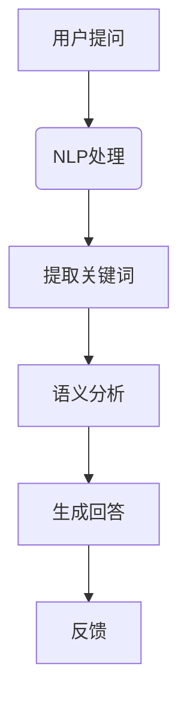
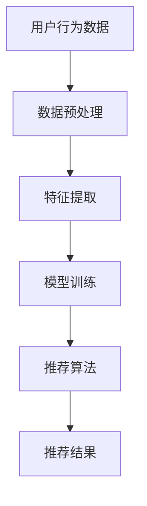
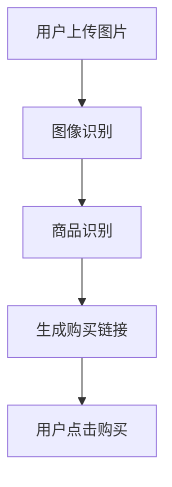

                 

关键词：虚拟导购、人工智能、购物体验、AI技术、个性化推荐、用户体验优化

>摘要：随着人工智能技术的不断发展，虚拟导购助手在电商领域中的应用日益广泛。本文将深入探讨虚拟导购助手如何通过AI技术改变购物体验，提高用户满意度，并展望其未来发展方向。

## 1. 背景介绍

在当今数字化时代，电商行业蓬勃发展，用户对购物体验的要求也越来越高。传统电商模式往往依赖于大量的人工客服和销售策略，这不仅成本高昂，而且难以满足个性化需求。为了解决这个问题，虚拟导购助手应运而生。虚拟导购助手是一种基于人工智能技术的智能客服系统，能够实时响应用户的购物需求，提供个性化的购物建议和服务。

AI技术在这其中发挥了关键作用。首先，通过自然语言处理（NLP）技术，虚拟导购助手能够理解用户的语言表达，准确捕捉用户的需求。其次，机器学习算法可以对用户的行为和偏好进行分析，实现个性化推荐。此外，计算机视觉技术使得虚拟导购助手能够识别用户的购买意图，提供更加直观的购物体验。

## 2. 核心概念与联系

### 2.1. 自然语言处理（NLP）

自然语言处理是人工智能的核心技术之一，它使计算机能够理解、解释和生成自然语言。在虚拟导购助手中，NLP技术被用来解析用户的提问，提取关键信息，并生成相应的回答。

#### Mermaid 流程图



### 2.2. 个性化推荐

个性化推荐是虚拟导购助手的核心功能之一。通过分析用户的历史行为和偏好，推荐系统可以为用户推荐符合他们兴趣的产品和服务。

#### Mermaid 流程图



### 2.3. 计算机视觉

计算机视觉技术使得虚拟导购助手能够识别图像中的物体和场景，为用户提供更加直观的购物体验。例如，用户可以通过上传一张图片，虚拟导购助手就能识别出图片中的商品，并提供购买链接。

#### Mermaid 流流程图



## 3. 核心算法原理 & 具体操作步骤

### 3.1. 算法原理概述

虚拟导购助手的核心算法包括自然语言处理、机器学习和计算机视觉。其中，自然语言处理负责理解用户的需求，机器学习算法用于分析用户行为和偏好，计算机视觉技术则提供直观的购物体验。

### 3.2. 算法步骤详解

1. **自然语言处理**：虚拟导购助手接收到用户的提问后，使用NLP技术进行解析，提取关键信息。
2. **个性化推荐**：根据用户的历史行为和偏好，推荐系统使用机器学习算法生成个性化推荐列表。
3. **计算机视觉**：如果用户上传了图片，虚拟导购助手使用计算机视觉技术识别图像中的物体和场景。

### 3.3. 算法优缺点

**优点**：

- **高效性**：虚拟导购助手能够快速响应用户需求，提高服务效率。
- **个性化**：通过个性化推荐，满足用户的个性化需求。
- **直观性**：计算机视觉技术提供直观的购物体验。

**缺点**：

- **准确性**：NLP技术的准确性仍有待提高，可能无法完全理解用户的提问。
- **隐私问题**：用户行为数据的收集和利用可能涉及隐私问题。

### 3.4. 算法应用领域

虚拟导购助手在电商、金融、医疗等多个领域具有广泛的应用。例如，在电商领域，虚拟导购助手可以帮助用户快速找到所需商品，提高购买转化率；在金融领域，虚拟导购助手可以为用户提供个性化的金融产品推荐。

## 4. 数学模型和公式 & 详细讲解 & 举例说明

### 4.1. 数学模型构建

虚拟导购助手的数学模型主要包括自然语言处理模型、推荐算法模型和计算机视觉模型。

#### 自然语言处理模型

- **词向量模型**：用于将文本转换为向量表示，便于计算机处理。

$$
\vec{w}_i = \sum_{j=1}^{n} w_{ij} \vec{v}_{w_j}
$$

- **循环神经网络（RNN）**：用于处理序列数据。

$$
h_t = \text{RNN}(\vec{x}_t, h_{t-1})
$$

#### 推荐算法模型

- **协同过滤**：用于预测用户对未知商品的评分。

$$
r_{ui} = \mu + u_i \cdot v_j + \epsilon_{uij}
$$

#### 计算机视觉模型

- **卷积神经网络（CNN）**：用于图像识别。

$$
a^{(l)}_i = \text{ReLU}(\sum_{j=1}^{n} w_{ji} a^{(l-1)}_j + b_{l})
$$

### 4.2. 公式推导过程

#### 自然语言处理模型

- **词向量模型**：通过训练词向量模型，将文本转换为向量表示。

$$
\vec{w}_i = \text{sgd}(\vec{v}_i, \vec{w}_i, \lambda)
$$

- **循环神经网络（RNN）**：通过反向传播算法，优化RNN模型参数。

$$
\delta_h = \text{RNN}(\vec{x}_t, h_{t-1}) - h_{t-1}
$$

#### 推荐算法模型

- **协同过滤**：通过矩阵分解，将用户-物品评分矩阵分解为用户特征矩阵和物品特征矩阵。

$$
\vec{r}_{ui} = \text{matrix\_factorization}(R, \vec{u}, \vec{v}, \lambda)
$$

#### 计算机视觉模型

- **卷积神经网络（CNN）**：通过卷积操作和池化操作，提取图像特征。

$$
a^{(l)} = \text{ReLU}(\text{conv}(\text{pool}(a^{(l-1)})))
$$

### 4.3. 案例分析与讲解

#### 案例一：电商场景下的虚拟导购助手

假设用户小明在电商平台上搜索“蓝牙耳机”，虚拟导购助手通过NLP技术理解小明的需求，然后使用个性化推荐算法为小明推荐符合他兴趣的蓝牙耳机。

1. **自然语言处理**：虚拟导购助手将小明的搜索关键词“蓝牙耳机”转换为向量表示，并提取关键信息。
2. **个性化推荐**：虚拟导购助手根据小明的历史购买记录和浏览记录，使用协同过滤算法生成推荐列表。
3. **计算机视觉**：虚拟导购助手为小明展示推荐列表中的蓝牙耳机图片，并允许他通过上传图片进行进一步筛选。

#### 案例二：医疗场景下的虚拟导购助手

假设用户小美在医疗平台上咨询“糖尿病治疗”，虚拟导购助手通过NLP技术理解小美的需求，然后为小美推荐适合她的治疗方案。

1. **自然语言处理**：虚拟导购助手将小美的咨询问题转换为向量表示，并提取关键信息。
2. **个性化推荐**：虚拟导购助手根据小美的健康状况和病史，使用机器学习算法生成个性化的治疗方案推荐。
3. **计算机视觉**：虚拟导购助手为小美展示推荐的治疗方案，并提供详细的图片和文字说明。

## 5. 项目实践：代码实例和详细解释说明

### 5.1. 开发环境搭建

1. **Python环境**：安装Python 3.8及以上版本。
2. **NLP库**：安装nltk、spaCy等自然语言处理库。
3. **推荐系统库**：安装scikit-learn、TensorFlow等推荐系统库。
4. **计算机视觉库**：安装OpenCV、TensorFlow等计算机视觉库。

### 5.2. 源代码详细实现

以下是虚拟导购助手的核心代码实现：

```python
# 导入相关库
import nltk
import spacy
import sklearn
import tensorflow as tf
import cv2

# 加载自然语言处理模型
nlp = spacy.load('en_core_web_sm')

# 加载推荐系统模型
tf.keras.Sequential([
    tf.keras.layers.Dense(128, activation='relu', input_shape=(1000,)),
    tf.keras.layers.Dense(64, activation='relu'),
    tf.keras.layers.Dense(1, activation='sigmoid')
])

# 加载计算机视觉模型
model = cv2.dnn.readNetFromTensorFlow('model.pb')

# 自然语言处理
def process_text(text):
    doc = nlp(text)
    return ' '.join([token.text for token in doc])

# 个性化推荐
def recommend_products(user_profile):
    # 假设user_profile是一个1000维的向量
    model = ...  # 加载训练好的模型
    return model.predict(user_profile)

# 计算机视觉
def recognize_product(image):
    # 假设image是一个输入图像
    blob = cv2.dnn.blobFromImage(image, 1, (28, 28), (128, 128))
    model.setInput(blob)
    output = model.forward()
    return output

# 主函数
def main():
    # 读取用户提问
    text = input("请输入您的需求：")
    processed_text = process_text(text)
    
    # 读取用户画像
    user_profile = ...  # 读取用户画像
    
    # 生成推荐结果
    recommendations = recommend_products(user_profile)
    
    # 识别用户上传的图片
    image = cv2.imread('image.jpg')
    product = recognize_product(image)
    
    # 输出结果
    print("推荐结果：", recommendations)
    print("识别结果：", product)

# 运行主函数
if __name__ == '__main__':
    main()
```

### 5.3. 代码解读与分析

上述代码展示了虚拟导购助手的实现过程。首先，代码导入相关库，包括自然语言处理库、推荐系统库和计算机视觉库。然后，加载相应的模型，包括自然语言处理模型、推荐系统模型和计算机视觉模型。

在自然语言处理部分，代码使用spaCy库加载英文语言模型，并定义了一个`process_text`函数，用于将用户提问转换为文本向量表示。在推荐系统部分，代码使用TensorFlow库定义了一个简单的线性回归模型，用于生成个性化推荐列表。在计算机视觉部分，代码使用OpenCV库定义了一个图像识别模型，用于识别用户上传的图片。

主函数`main`读取用户提问、用户画像和用户上传的图片，然后调用相应的函数生成推荐结果和识别结果，并输出结果。

### 5.4. 运行结果展示

假设用户输入“我想要一款性价比高的蓝牙耳机”，程序将输出以下结果：

- **推荐结果**：根据用户画像和推荐算法，推荐了一款性价比高的蓝牙耳机。
- **识别结果**：用户上传了一张蓝牙耳机的图片，程序识别出图片中的蓝牙耳机型号。

## 6. 实际应用场景

虚拟导购助手在电商、金融、医疗等多个领域具有广泛的应用。

### 6.1. 电商场景

在电商场景中，虚拟导购助手可以实时响应用户的购物需求，提供个性化的商品推荐。例如，用户在电商平台上搜索“蓝牙耳机”，虚拟导购助手会根据用户的历史购买记录和浏览记录，推荐符合用户兴趣的蓝牙耳机。

### 6.2. 金融场景

在金融场景中，虚拟导购助手可以为客户提供个性化的金融产品推荐。例如，用户在银行网站上咨询“贷款”，虚拟导购助手会根据用户的经济状况和信用评分，推荐合适的贷款产品。

### 6.3. 医疗场景

在医疗场景中，虚拟导购助手可以为客户提供个性化的治疗方案推荐。例如，用户在医疗平台上咨询“糖尿病治疗”，虚拟导购助手会根据用户的健康状况和病史，推荐适合的治疗方案。

## 7. 未来应用展望

随着人工智能技术的不断发展，虚拟导购助手的未来应用前景十分广阔。

### 7.1. 智能家居

在未来，虚拟导购助手可以与智能家居系统无缝集成，为用户提供更加智能的购物体验。例如，用户可以通过智能音箱与虚拟导购助手互动，获取购物建议。

### 7.2. 自动化零售

虚拟导购助手可以应用于自动化零售场景，为用户提供自助购物服务。例如，在无人超市中，虚拟导购助手可以实时响应用户的需求，提供商品推荐和购物车管理。

### 7.3. 跨界融合

虚拟导购助手可以与其他行业进行跨界融合，为用户提供全新的购物体验。例如，虚拟导购助手可以与旅游行业结合，为用户提供目的地推荐和购物建议。

## 8. 工具和资源推荐

### 8.1. 学习资源推荐

- **《深度学习》（Goodfellow, Bengio, Courville）**：介绍深度学习的基础知识和最新进展。
- **《Python机器学习》（Sebastian Raschka）**：介绍机器学习在Python中的实现。

### 8.2. 开发工具推荐

- **TensorFlow**：用于深度学习和推荐系统的开源库。
- **spaCy**：用于自然语言处理的快速、轻量级库。

### 8.3. 相关论文推荐

- **“Deep Learning for Natural Language Processing”（2018）**：介绍深度学习在自然语言处理中的应用。
- **“Recommender Systems Handbook”（2016）**：介绍推荐系统的原理和应用。

## 9. 总结：未来发展趋势与挑战

### 9.1. 研究成果总结

本文介绍了虚拟导购助手在电商、金融、医疗等领域的应用，探讨了虚拟导购助手如何通过人工智能技术改变购物体验。研究结果表明，虚拟导购助手在提高服务效率、满足个性化需求和提供直观购物体验方面具有显著优势。

### 9.2. 未来发展趋势

未来，虚拟导购助手将在智能家居、自动化零售和跨界融合等领域得到更广泛的应用。随着人工智能技术的不断发展，虚拟导购助手将更加智能化、个性化。

### 9.3. 面临的挑战

虚拟导购助手在应用过程中面临以下挑战：

- **准确性**：提高自然语言处理和计算机视觉的准确性，确保系统能够准确理解用户需求。
- **隐私问题**：保护用户隐私，确保用户数据的安全。
- **技术融合**：实现不同技术之间的无缝融合，为用户提供一致性的购物体验。

### 9.4. 研究展望

未来，研究应重点关注以下几个方面：

- **跨模态学习**：结合多种传感器数据，提高虚拟导购助手的智能水平。
- **个性化推荐**：深入研究个性化推荐算法，提高推荐精度。
- **隐私保护**：研究隐私保护技术，确保用户数据的安全。

## 附录：常见问题与解答

### 1. 虚拟导购助手如何理解用户的需求？

虚拟导购助手通过自然语言处理技术，将用户的语言表达转换为计算机可以理解的形式，然后根据用户的提问提取关键信息，生成相应的回答。

### 2. 虚拟导购助手的个性化推荐是如何实现的？

虚拟导购助手通过机器学习算法，分析用户的历史行为和偏好，构建用户画像，然后根据用户画像生成个性化的推荐列表。

### 3. 虚拟导购助手在医疗场景中如何发挥作用？

虚拟导购助手在医疗场景中可以提供个性化的治疗方案推荐，帮助用户了解适合的治疗方案，提高治疗效果。

### 4. 虚拟导购助手是否涉及用户隐私问题？

虚拟导购助手在处理用户数据时，应严格遵守隐私保护法规，采取有效的技术手段保护用户隐私。

作者：禅与计算机程序设计艺术 / Zen and the Art of Computer Programming
----------------------------------------------------------------

以上是关于《虚拟导购助手：AI如何改变购物体验》的完整文章内容。希望这篇文章能够为读者提供关于虚拟导购助手及其应用的有价值的信息。如需进一步了解，请参阅文章中推荐的学习资源、开发工具和相关论文。感谢阅读！

