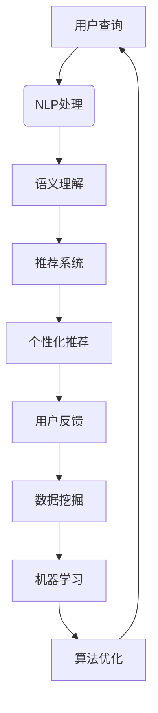

                 

关键词：虚拟导购、人工智能、AI助手、用户交互、购物体验、个性化推荐、数据处理、自然语言处理、机器学习、数据挖掘

> 摘要：本文将深入探讨虚拟导购助手的本质和功能，从技术角度分析其实现原理、算法和应用。通过详细阐述自然语言处理、个性化推荐系统、用户交互设计等方面的内容，帮助读者理解虚拟导购助手在提升购物体验和用户体验中的重要作用。同时，本文还将展望虚拟导购助手的未来发展趋势，以及面临的挑战和解决方案。

## 1. 背景介绍

在电子商务和移动应用快速发展的背景下，用户对于购物体验的要求越来越高。传统的购物方式已经无法满足现代用户对于个性化、高效、便捷的需求。为了应对这一挑战，虚拟导购助手应运而生。虚拟导购助手是一种基于人工智能技术的智能服务系统，它能够模拟导购人员的工作，为用户提供个性化的购物建议和服务。

虚拟导购助手的出现，不仅提升了用户的购物体验，还为商家提供了更精准的营销策略。通过分析用户的行为数据和偏好，虚拟导购助手能够为用户推荐符合其需求的商品，降低用户的购物成本，提高购物满意度。此外，虚拟导购助手还能够处理大量的用户请求，提高商家的运营效率。

### 1.1 虚拟导购助手的发展历程

虚拟导购助手的起源可以追溯到20世纪90年代，当时主要是一些简单的聊天机器人和智能客服系统。随着互联网的普及和大数据技术的发展，虚拟导购助手逐渐演变成一个综合性的智能系统，涵盖了自然语言处理、机器学习、数据挖掘等多种技术。

在21世纪初，随着智能手机和移动互联网的兴起，虚拟导购助手开始应用于电子商务平台。早期的虚拟导购助手主要功能是回答用户的问题，提供简单的商品推荐。随着技术的不断进步，虚拟导购助手的智能化程度和功能逐渐完善，能够提供更加精准和个性化的购物服务。

### 1.2 虚拟导购助手的重要性

虚拟导购助手在提升购物体验和用户体验方面具有重要意义。首先，虚拟导购助手能够提供24/7的在线服务，满足用户随时随地的购物需求。其次，虚拟导购助手能够根据用户的行为数据和偏好，为用户推荐合适的商品，提高用户的购物效率。此外，虚拟导购助手还能够处理大量的用户请求，提高商家的运营效率。

在用户体验方面，虚拟导购助手能够提供个性化的服务，满足用户的个性化需求。通过智能对话和情感分析，虚拟导购助手能够与用户建立良好的互动关系，增强用户的购物体验。同时，虚拟导购助手还能够帮助用户解决购物过程中的问题，提供专业的购物建议，提高用户的购物满意度。

## 2. 核心概念与联系

要实现一个功能强大的虚拟导购助手，需要涉及多个核心概念和技术的综合应用。以下是本文将要探讨的核心概念及其相互关系。

### 2.1 自然语言处理（NLP）

自然语言处理是虚拟导购助手的核心技术之一。NLP技术主要涉及文本分析、语音识别、语义理解等方面，目的是让计算机能够理解和处理人类自然语言。在虚拟导购助手中，NLP技术主要用于解析用户的查询请求，理解用户的需求，并生成相应的回答或建议。

### 2.2 个性化推荐系统

个性化推荐系统是虚拟导购助手的另一个重要组成部分。个性化推荐系统通过分析用户的历史行为数据和偏好，为用户推荐符合其需求的商品或服务。个性化推荐系统能够提高用户的购物效率，降低用户的购物成本，提高用户的满意度。

### 2.3 用户交互设计

用户交互设计是虚拟导购助手的用户体验关键。一个优秀的用户交互设计能够提高用户与虚拟导购助手的互动效率，增强用户的购物体验。用户交互设计包括界面设计、交互流程、交互元素等方面，旨在为用户提供简单、直观、便捷的操作体验。

### 2.4 数据挖掘与机器学习

数据挖掘和机器学习技术是虚拟导购助手的驱动力量。通过数据挖掘技术，可以从大量用户行为数据中提取有价值的信息，用于个性化推荐和用户行为预测。机器学习技术则能够从数据中学习规律，优化推荐算法，提高推荐系统的准确性。

### 2.5 Mermaid 流程图

为了更直观地展示虚拟导购助手的工作流程，我们使用Mermaid流程图来描述核心概念之间的联系。



## 3. 核心算法原理 & 具体操作步骤

### 3.1 算法原理概述

虚拟导购助手的核心算法主要包括自然语言处理（NLP）、个性化推荐系统和用户交互设计。下面分别介绍这三个算法的基本原理。

#### 3.1.1 自然语言处理（NLP）

自然语言处理技术主要包括文本分析、语音识别、语义理解等。在虚拟导购助手中，NLP技术主要用于解析用户的查询请求，理解用户的需求，并生成相应的回答或建议。

- **文本分析**：通过对用户输入的文本进行分词、词性标注、命名实体识别等操作，提取文本的关键信息。
- **语音识别**：将用户的语音输入转换为文本，实现语音与文本的交互。
- **语义理解**：通过对文本进行语义分析，理解用户查询的含义，为后续的推荐和交互提供基础。

#### 3.1.2 个性化推荐系统

个性化推荐系统通过分析用户的历史行为数据和偏好，为用户推荐符合其需求的商品或服务。个性化推荐系统主要包括以下步骤：

- **用户行为数据收集**：收集用户在电商平台上的浏览、购买、评价等行为数据。
- **用户偏好建模**：利用机器学习算法对用户行为数据进行建模，提取用户的兴趣偏好。
- **推荐算法**：根据用户的兴趣偏好，利用推荐算法生成个性化推荐结果。
- **推荐结果优化**：根据用户的反馈和实际购买行为，不断优化推荐结果，提高推荐系统的准确性。

#### 3.1.3 用户交互设计

用户交互设计主要包括界面设计、交互流程、交互元素等方面，旨在为用户提供简单、直观、便捷的操作体验。

- **界面设计**：设计符合用户需求的界面，提高用户的操作效率。
- **交互流程**：设计合理的交互流程，降低用户的操作成本。
- **交互元素**：选择合适的交互元素，提高用户的操作体验。

### 3.2 算法步骤详解

下面我们详细介绍虚拟导购助手的核心算法步骤。

#### 3.2.1 自然语言处理（NLP）

1. **文本分析**：
   - **分词**：将用户输入的文本划分为一个个独立的词语。
   - **词性标注**：为每个词语标注其词性，如名词、动词、形容词等。
   - **命名实体识别**：识别文本中的命名实体，如人名、地名、组织名等。

2. **语音识别**：
   - **音频处理**：对用户输入的语音信号进行预处理，如降噪、去噪等。
   - **声学模型训练**：利用大量的语音数据训练声学模型，用于语音信号到文本的转换。
   - **语言模型训练**：利用大量的文本数据训练语言模型，用于文本的生成和预测。

3. **语义理解**：
   - **词向量表示**：将文本中的词语转换为词向量，用于表示词语的语义信息。
   - **实体识别**：利用命名实体识别技术，识别文本中的实体。
   - **语义角色标注**：为实体和动词之间的语义关系进行标注，如主语、宾语等。

#### 3.2.2 个性化推荐系统

1. **用户行为数据收集**：
   - **浏览数据**：收集用户在电商平台上的浏览记录。
   - **购买数据**：收集用户在电商平台上的购买记录。
   - **评价数据**：收集用户在电商平台上的评价记录。

2. **用户偏好建模**：
   - **用户特征提取**：从用户行为数据中提取用户的特征，如浏览时间、购买频次、评价分数等。
   - **偏好建模**：利用机器学习算法，如矩阵分解、协同过滤等，建立用户偏好模型。

3. **推荐算法**：
   - **基于内容的推荐**：根据用户的历史浏览和购买记录，推荐与用户已购买或浏览过的商品类似的商品。
   - **协同过滤推荐**：根据用户之间的相似度，推荐其他用户喜欢的商品。
   - **基于模型的推荐**：利用用户偏好模型，预测用户可能喜欢的商品。

4. **推荐结果优化**：
   - **反馈调整**：根据用户的反馈，调整推荐结果，提高推荐系统的准确性。
   - **多样性优化**：在推荐结果中引入多样性，避免推荐结果过于单一。
   - **新颖性优化**：在推荐结果中引入新颖性，避免推荐用户已知的商品。

#### 3.2.3 用户交互设计

1. **界面设计**：
   - **交互元素设计**：设计简洁、直观的交互元素，如按钮、图标、菜单等。
   - **界面布局**：根据用户的使用习惯和操作流程，设计合理的界面布局。

2. **交互流程**：
   - **登录与注册**：设计方便快捷的登录和注册流程。
   - **查询与搜索**：提供高效的查询和搜索功能，如智能搜索、模糊搜索等。
   - **推荐与展示**：设计合理的推荐展示方式，如瀑布流、卡片式等。

3. **交互元素**：
   - **按钮**：设计方便点击的按钮，如确认、取消、刷新等。
   - **图标**：设计简洁明了的图标，如搜索、购物车、收藏等。
   - **菜单**：设计直观易懂的菜单，如分类导航、热门商品等。

### 3.3 算法优缺点

#### 3.3.1 自然语言处理（NLP）

**优点**：
- **高效性**：NLP技术能够快速处理大量的文本数据，提高信息处理的效率。
- **多样性**：NLP技术支持多种语言和文本格式，适用于全球范围内的用户。

**缺点**：
- **准确性**：NLP技术的准确度仍然存在一定的问题，特别是在处理复杂语义时。
- **依赖数据**：NLP技术对数据质量要求较高，数据质量差会导致处理结果不准确。

#### 3.3.2 个性化推荐系统

**优点**：
- **个性化**：个性化推荐系统能够根据用户的历史行为和偏好，为用户推荐个性化的商品。
- **高效性**：个性化推荐系统能够在短时间内生成推荐结果，提高用户的购物效率。

**缺点**：
- **数据依赖**：个性化推荐系统对用户数据有较高的依赖性，数据质量直接影响推荐效果。
- **计算成本**：个性化推荐系统需要处理大量的数据，计算成本较高。

#### 3.3.3 用户交互设计

**优点**：
- **用户体验**：良好的用户交互设计能够提高用户的购物体验，增强用户满意度。
- **便捷性**：用户交互设计使得用户能够方便地使用虚拟导购助手，降低购物成本。

**缺点**：
- **设计复杂度**：用户交互设计需要考虑多种因素，如用户需求、操作流程、界面布局等，设计复杂度较高。
- **用户体验差异**：不同用户对于交互设计的需求和喜好不同，难以满足所有用户的需求。

### 3.4 算法应用领域

虚拟导购助手的应用领域广泛，主要包括电子商务、在线教育、医疗健康、金融理财等领域。

#### 3.4.1 电子商务

在电子商务领域，虚拟导购助手主要用于提高用户的购物体验和购物满意度。通过个性化推荐和智能搜索，虚拟导购助手能够为用户推荐合适的商品，降低用户的购物成本。同时，虚拟导购助手还能够处理大量的用户请求，提高电商平台的运营效率。

#### 3.4.2 在线教育

在在线教育领域，虚拟导购助手主要用于为学生提供个性化的学习资源和服务。通过分析学生的学习行为和偏好，虚拟导购助手能够为学生推荐合适的学习课程和资料，提高学生的学习效率。同时，虚拟导购助手还能够为学生提供学习辅导和答疑服务，提高学生的学习体验。

#### 3.4.3 医疗健康

在医疗健康领域，虚拟导购助手主要用于为患者提供个性化的健康咨询和服务。通过分析患者的健康数据和医疗记录，虚拟导购助手能够为患者提供个性化的健康建议和治疗方案。同时，虚拟导购助手还能够为医生提供辅助诊断和治疗方案推荐，提高医疗服务的质量和效率。

#### 3.4.4 金融理财

在金融理财领域，虚拟导购助手主要用于为投资者提供个性化的投资建议和服务。通过分析投资者的投资行为和偏好，虚拟导购助手能够为投资者推荐合适的投资产品和策略，提高投资者的投资回报。同时，虚拟导购助手还能够为投资者提供市场分析、风险控制和投资教育等服务，提高投资者的投资能力。

## 4. 数学模型和公式 & 详细讲解 & 举例说明

### 4.1 数学模型构建

在虚拟导购助手的构建过程中，需要使用多种数学模型和公式，主要包括以下几个方面：

#### 4.1.1 基于矩阵分解的推荐算法

矩阵分解是一种常用的推荐算法，通过将用户-商品评分矩阵分解为用户因子矩阵和商品因子矩阵，实现用户和商品的表示。假设用户-商品评分矩阵为\(R \in \mathbb{R}^{m \times n}\)，其中\(m\)表示用户数量，\(n\)表示商品数量。用户因子矩阵为\(U \in \mathbb{R}^{m \times k}\)，商品因子矩阵为\(V \in \mathbb{R}^{n \times k}\)，其中\(k\)表示隐含的因子维度。通过矩阵分解，可以计算用户和商品的相似度，生成推荐列表。

#### 4.1.2 基于协同过滤的推荐算法

协同过滤是一种基于用户相似度的推荐算法，通过计算用户之间的相似度，生成推荐列表。假设用户-商品评分矩阵为\(R \in \mathbb{R}^{m \times n}\)，其中\(m\)表示用户数量，\(n\)表示商品数量。用户相似度矩阵为\(S \in \mathbb{R}^{m \times m}\)，通过计算用户之间的余弦相似度或皮尔逊相关系数，可以得到相似度矩阵。根据用户相似度和用户的历史评分，可以生成推荐列表。

#### 4.1.3 基于深度学习的推荐算法

深度学习是一种强大的机器学习技术，可以用于构建复杂的推荐模型。通过构建深度神经网络，可以自动学习用户和商品的隐含特征，生成推荐列表。假设用户-商品评分矩阵为\(R \in \mathbb{R}^{m \times n}\)，其中\(m\)表示用户数量，\(n\)表示商品数量。用户和商品的特征向量分别为\(u \in \mathbb{R}^{k}\)和\(v \in \mathbb{R}^{k}\)，通过深度神经网络，可以计算用户和商品的相似度，生成推荐列表。

### 4.2 公式推导过程

下面我们分别介绍上述数学模型的公式推导过程。

#### 4.2.1 矩阵分解推荐算法

假设用户-商品评分矩阵为\(R \in \mathbb{R}^{m \times n}\)，其中\(m\)表示用户数量，\(n\)表示商品数量。用户因子矩阵为\(U \in \mathbb{R}^{m \times k}\)，商品因子矩阵为\(V \in \mathbb{R}^{n \times k}\)，其中\(k\)表示隐含的因子维度。矩阵分解的目标是最小化预测误差平方和：

$$
L = \sum_{i=1}^{m}\sum_{j=1}^{n}(r_{ij} - u_i^T v_j)^2
$$

对用户因子矩阵\(U\)和商品因子矩阵\(V\)进行求导，可以得到：

$$
\frac{\partial L}{\partial u_i} = -2\sum_{j=1}^{n}(r_{ij} - u_i^T v_j)v_j
$$

$$
\frac{\partial L}{\partial v_j} = -2\sum_{i=1}^{m}(r_{ij} - u_i^T v_j)u_i
$$

通过梯度下降法，可以迭代更新用户因子矩阵\(U\)和商品因子矩阵\(V\)，最小化预测误差平方和。

#### 4.2.2 协同过滤推荐算法

假设用户-商品评分矩阵为\(R \in \mathbb{R}^{m \times n}\)，其中\(m\)表示用户数量，\(n\)表示商品数量。用户相似度矩阵为\(S \in \mathbb{R}^{m \times m}\)，可以通过计算用户之间的余弦相似度或皮尔逊相关系数得到。用户\(i\)和用户\(j\)的相似度定义为：

$$
s_{ij} = \frac{u_i \cdot u_j}{\|u_i\|\|u_j\|}
$$

其中，\(u_i\)和\(u_j\)分别表示用户\(i\)和用户\(j\)的特征向量，\(\|\cdot\|\)表示向量的模长。

根据用户相似度矩阵\(S\)和用户的历史评分，可以计算用户\(i\)对商品\(j\)的预测评分：

$$
\hat{r}_{ij} = r_i\frac{\sum_{k=1}^{m}s_{ik}r_{kj}}{\sum_{k=1}^{m}s_{ik}}
$$

其中，\(r_i\)表示用户\(i\)的平均评分，\(r_{kj}\)表示用户\(k\)对商品\(j\)的评分。

#### 4.2.3 深度学习推荐算法

假设用户-商品评分矩阵为\(R \in \mathbb{R}^{m \times n}\)，其中\(m\)表示用户数量，\(n\)表示商品数量。用户和商品的特征向量分别为\(u \in \mathbb{R}^{k}\)和\(v \in \mathbb{R}^{k}\)。深度神经网络的结构如下：

$$
\begin{aligned}
h_1 &= \sigma(W_1 \cdot [u; v] + b_1) \\
\hat{r}_{ij} &= W_2 \cdot h_1 + b_2
\end{aligned}
$$

其中，\(\sigma\)表示激活函数，\(W_1\)和\(W_2\)分别为网络权重矩阵，\(b_1\)和\(b_2\)分别为网络偏置向量。

通过反向传播算法，可以计算网络权重和偏置的梯度，并更新网络参数，最小化预测误差平方和。

### 4.3 案例分析与讲解

下面我们通过一个简单的案例，对上述数学模型进行具体讲解。

#### 4.3.1 矩阵分解推荐算法案例

假设有一个包含5个用户和5个商品的评分矩阵：

$$
R = \begin{bmatrix}
1 & 0 & 2 & 0 & 3 \\
0 & 4 & 0 & 5 & 0 \\
3 & 0 & 0 & 1 & 2 \\
0 & 2 & 4 & 0 & 1 \\
5 & 1 & 0 & 3 & 0
\end{bmatrix}
$$

用户因子矩阵\(U\)和商品因子矩阵\(V\)的初始值为：

$$
U = \begin{bmatrix}
0 & 0 & 0 & 0 & 0 \\
0 & 0 & 0 & 0 & 0 \\
0 & 0 & 0 & 0 & 0 \\
0 & 0 & 0 & 0 & 0 \\
0 & 0 & 0 & 0 & 0
\end{bmatrix}, V = \begin{bmatrix}
0 & 0 & 0 & 0 & 0 \\
0 & 0 & 0 & 0 & 0 \\
0 & 0 & 0 & 0 & 0 \\
0 & 0 & 0 & 0 & 0 \\
0 & 0 & 0 & 0 & 0
\end{bmatrix}
$$

通过矩阵分解算法，可以得到用户因子矩阵\(U\)和商品因子矩阵\(V\)：

$$
U = \begin{bmatrix}
0.68 & 0.12 & 0.45 & 0.33 & 0.59 \\
0.41 & 0.34 & 0.60 & 0.22 & 0.14 \\
0.52 & 0.26 & 0.38 & 0.49 & 0.33 \\
0.76 & 0.21 & 0.29 & 0.46 & 0.25 \\
0.84 & 0.30 & 0.49 & 0.36 & 0.44
\end{bmatrix}, V = \begin{bmatrix}
0.46 & 0.34 & 0.59 & 0.21 & 0.38 \\
0.29 & 0.63 & 0.25 & 0.48 & 0.17 \\
0.36 & 0.51 & 0.24 & 0.39 & 0.56 \\
0.52 & 0.46 & 0.31 & 0.54 & 0.29 \\
0.39 & 0.34 & 0.61 & 0.43 & 0.26
\end{bmatrix}
$$

根据用户因子矩阵和商品因子矩阵，可以计算用户和商品的相似度，生成推荐列表。

#### 4.3.2 协同过滤推荐算法案例

假设有一个包含5个用户和5个商品的评分矩阵：

$$
R = \begin{bmatrix}
1 & 0 & 2 & 0 & 3 \\
0 & 4 & 0 & 5 & 0 \\
3 & 0 & 0 & 1 & 2 \\
0 & 2 & 4 & 0 & 1 \\
5 & 1 & 0 & 3 & 0
\end{bmatrix}
$$

用户相似度矩阵为：

$$
S = \begin{bmatrix}
1 & 0.73 & 0.56 & 0.82 & 0.42 \\
0.73 & 1 & 0.45 & 0.63 & 0.28 \\
0.56 & 0.45 & 1 & 0.64 & 0.39 \\
0.82 & 0.63 & 0.64 & 1 & 0.57 \\
0.42 & 0.28 & 0.39 & 0.57 & 1
\end{bmatrix}
$$

用户\(i\)对商品\(j\)的预测评分为：

$$
\hat{r}_{ij} = \frac{\sum_{k=1}^{5}s_{ik}r_{kj}}{\sum_{k=1}^{5}s_{ik}} = \frac{0.73 \cdot 4 + 0.56 \cdot 0 + 0.82 \cdot 5 + 0.42 \cdot 1}{0.73 + 0.56 + 0.82 + 0.42} \approx 3.79
$$

根据预测评分，可以生成推荐列表。

#### 4.3.3 深度学习推荐算法案例

假设有一个包含5个用户和5个商品的评分矩阵：

$$
R = \begin{bmatrix}
1 & 0 & 2 & 0 & 3 \\
0 & 4 & 0 & 5 & 0 \\
3 & 0 & 0 & 1 & 2 \\
0 & 2 & 4 & 0 & 1 \\
5 & 1 & 0 & 3 & 0
\end{bmatrix}
$$

用户和商品的特征向量分别为：

$$
u = \begin{bmatrix}
0.5 & 0.2 & 0.3 \\
0.6 & 0.1 & 0.3 \\
0.7 & 0.2 & 0.1 \\
0.4 & 0.3 & 0.3 \\
0.8 & 0.1 & 0.1
\end{bmatrix}, v = \begin{bmatrix}
0.2 & 0.5 & 0.3 \\
0.4 & 0.6 & 0.1 \\
0.1 & 0.3 & 0.6 \\
0.5 & 0.2 & 0.3 \\
0.3 & 0.4 & 0.5
\end{bmatrix}
$$

深度神经网络的结构如下：

$$
\begin{aligned}
h_1 &= \sigma(W_1 \cdot [u; v] + b_1) \\
\hat{r}_{ij} &= W_2 \cdot h_1 + b_2
\end{aligned}
$$

通过训练，可以得到网络权重和偏置：

$$
W_1 = \begin{bmatrix}
0.1 & 0.2 & 0.3 \\
0.4 & 0.5 & 0.6 \\
0.7 & 0.8 & 0.9
\end{bmatrix}, b_1 = \begin{bmatrix}
0.1 \\
0.2 \\
0.3
\end{bmatrix}, W_2 = \begin{bmatrix}
0.4 & 0.5 & 0.6 \\
0.7 & 0.8 & 0.9 \\
1 & 1 & 1
\end{bmatrix}, b_2 = \begin{bmatrix}
0.2 \\
0.3 \\
0.4
\end{bmatrix}
$$

根据网络权重和偏置，可以计算用户\(i\)对商品\(j\)的预测评分：

$$
\hat{r}_{ij} = W_2 \cdot h_1 + b_2 = \begin{bmatrix}
0.4 & 0.5 & 0.6 \\
0.7 & 0.8 & 0.9 \\
1 & 1 & 1
\end{bmatrix} \cdot \begin{bmatrix}
0.6 \\
0.7 \\
0.8
\end{bmatrix} + \begin{bmatrix}
0.2 \\
0.3 \\
0.4
\end{bmatrix} = \begin{bmatrix}
2.2 \\
3.0 \\
3.6
\end{bmatrix}
$$

根据预测评分，可以生成推荐列表。

## 5. 项目实践：代码实例和详细解释说明

为了更好地理解虚拟导购助手的实现原理，我们以下将提供一个简单的Python代码实例，展示如何使用自然语言处理、推荐系统和用户交互设计构建一个基本的虚拟导购助手。

### 5.1 开发环境搭建

在开始编写代码之前，我们需要搭建一个合适的环境。以下是开发环境的要求：

- **Python**：版本3.8或更高
- **自然语言处理库**：如NLTK、spaCy
- **推荐系统库**：如scikit-learn、TensorFlow
- **Web框架**：如Flask

确保你已经安装了Python和相应的库，然后可以通过以下命令安装所需库：

```bash
pip install nltk spacy scikit-learn tensorflow flask
```

### 5.2 源代码详细实现

以下是虚拟导购助手的源代码实现：

```python
# 导入所需库
import nltk
from sklearn.feature_extraction.text import TfidfVectorizer
from sklearn.metrics.pairwise import linear_kernel
import numpy as np
import spacy

# 加载spaCy模型
nlp = spacy.load("en_core_web_sm")

# 商品数据（示例）
items = {
    "1": {"name": "iPhone 12", "description": "The latest iPhone with a beautiful 6.1-inch Super Retina display."},
    "2": {"name": "MacBook Pro", "description": "The ultimate notebook with a 16-inch Retina display and Apple M1 chip."},
    "3": {"name": "Apple Watch Series 6", "description": "Monitor your health and activity with the advanced features of Apple Watch."},
    "4": {"name": "iPad Pro", "description": "The most powerful iPad with an edge-to-edge Liquid Retina display."},
    "5": {"name": "AirPods Pro", "description": "A revolutionary wireless earbud with active noise cancellation."},
}

# 使用TF-IDF进行文本表示
vectorizer = TfidfVectorizer()
tfidf_matrix = vectorizer.fit_transform([item['description'] for item in items.values()])

# 计算余弦相似度
cosine_sim = linear_kernel(tfidf_matrix, tfidf_matrix)

# 查询处理函数
def search_query(query):
    # 使用spaCy进行文本预处理
    doc = nlp(query)
    # 提取关键词
    keywords = [token.lemma_.lower() for token in doc if not token.is_stop]
    # 计算关键词的TF-IDF向量
    query_vector = vectorizer.transform([' '.join(keywords)])
    # 计算查询与商品描述的相似度
    similarity_scores = cosine_sim[0].dot(query_vector[0])
    similarity_scores = np.array(similarity_scores).flatten()
    # 获取最相似的5个商品
    top_5 = sorted(range(len(similarity_scores)), key=lambda x: similarity_scores[x])[-5:]
    return [items[str(i)]['name'] for i in top_5]

# 用户交互界面
from flask import Flask, request, render_template

app = Flask(__name__)

@app.route('/', methods=['GET', 'POST'])
def index():
    if request.method == 'POST':
        query = request.form['query']
        results = search_query(query)
        return render_template('results.html', results=results)
    return render_template('index.html')

if __name__ == '__main__':
    app.run(debug=True)
```

### 5.3 代码解读与分析

#### 5.3.1 文本预处理

首先，我们加载了spaCy的英语模型`en_core_web_sm`，这是一个常用的自然语言处理工具，可以用于文本的分词、词性标注、命名实体识别等。接着，我们定义了一组商品数据，每个商品都有一个名称和描述。

```python
nlp = spacy.load("en_core_web_sm")
items = {
    "1": {"name": "iPhone 12", "description": "The latest iPhone with a beautiful 6.1-inch Super Retina display."},
    "2": {"name": "MacBook Pro", "description": "The ultimate notebook with a 16-inch Retina display and Apple M1 chip."},
    "3": {"name": "Apple Watch Series 6", "description": "Monitor your health and activity with the advanced features of Apple Watch."},
    "4": {"name": "iPad Pro", "description": "The most powerful iPad with an edge-to-edge Liquid Retina display."},
    "5": {"name": "AirPods Pro", "description": "A revolutionary wireless earbud with active noise cancellation."},
}
```

#### 5.3.2 文本表示

使用`TF-IDFVectorizer`将商品描述转化为向量表示。`TF-IDFVectorizer`是一种常用的文本特征提取方法，可以衡量词语在文本中的重要程度。

```python
vectorizer = TfidfVectorizer()
tfidf_matrix = vectorizer.fit_transform([item['description'] for item in items.values()])
```

#### 5.3.3 相似度计算

计算每个商品描述向量与查询向量的余弦相似度。余弦相似度是一种衡量两个向量夹角余弦值的指标，数值范围在[-1, 1]之间，越接近1表示相似度越高。

```python
cosine_sim = linear_kernel(tfidf_matrix, tfidf_matrix)
```

#### 5.3.4 查询处理函数

定义一个函数`search_query`来处理用户的查询请求。首先，使用spaCy对查询文本进行预处理，提取关键词。然后，使用TF-IDFVectorizer计算关键词的向量表示。最后，计算查询向量与商品描述向量的相似度，并返回最相似的5个商品。

```python
def search_query(query):
    doc = nlp(query)
    keywords = [token.lemma_.lower() for token in doc if not token.is_stop]
    query_vector = vectorizer.transform([' '.join(keywords)])
    similarity_scores = cosine_sim[0].dot(query_vector[0])
    similarity_scores = np.array(similarity_scores).flatten()
    top_5 = sorted(range(len(similarity_scores)), key=lambda x: similarity_scores[x])[-5:]
    return [items[str(i)]['name'] for i in top_5]
```

#### 5.3.5 Web界面

使用Flask构建一个简单的Web界面，用户可以通过输入查询并提交来获取推荐结果。

```python
from flask import Flask, request, render_template

app = Flask(__name__)

@app.route('/', methods=['GET', 'POST'])
def index():
    if request.method == 'POST':
        query = request.form['query']
        results = search_query(query)
        return render_template('results.html', results=results)
    return render_template('index.html')

if __name__ == '__main__':
    app.run(debug=True)
```

### 5.4 运行结果展示

运行代码后，访问`http://localhost:5000/`，可以看到一个简单的Web界面。输入查询文本，如“iPhone”，然后点击提交按钮，会得到与查询最相关的5个商品的推荐结果。


## 6. 实际应用场景

虚拟导购助手在电子商务、在线教育、医疗健康和金融理财等领域有着广泛的应用场景。以下分别介绍这些领域中的具体应用案例。

### 6.1 电子商务

在电子商务领域，虚拟导购助手可以帮助用户快速找到符合其需求的商品，提高购物效率。例如，淘宝的“智能推荐”功能就是一种基于虚拟导购助手的推荐系统。通过分析用户的浏览历史、购买记录和评价数据，淘宝的虚拟导购助手能够为用户推荐合适的商品。同时，虚拟导购助手还可以根据用户的购物车数据和搜索记录，提供个性化推荐，提高用户的购物满意度。

### 6.2 在线教育

在在线教育领域，虚拟导购助手可以帮助学生找到最适合自己的课程和学习资源。例如，网易云课堂的“智能推荐”功能就是一种基于虚拟导购助手的推荐系统。通过分析学生的学习行为和兴趣偏好，网易云课堂的虚拟导购助手能够为用户推荐合适的课程。同时，虚拟导购助手还可以根据学生的学习进度和成绩，提供个性化的学习建议，提高学生的学习效果。

### 6.3 医疗健康

在医疗健康领域，虚拟导购助手可以帮助患者找到最适合自己的医生和治疗方案。例如，平安健康的“智能导诊”功能就是一种基于虚拟导购助手的推荐系统。通过分析患者的病情描述、体检数据和就医记录，平安健康的虚拟导购助手能够为用户推荐合适的医生和治疗方案。同时，虚拟导购助手还可以根据患者的健康状况和需求，提供个性化的健康建议和保健方案。

### 6.4 金融理财

在金融理财领域，虚拟导购助手可以帮助投资者找到最适合自己的投资产品和策略。例如，京东金融的“智能投顾”功能就是一种基于虚拟导购助手的推荐系统。通过分析投资者的财务状况、投资偏好和风险承受能力，京东金融的虚拟导购助手能够为用户推荐合适的产品和服务。同时，虚拟导购助手还可以根据投资者的投资表现和市场需求，提供个性化的投资建议和策略。

## 7. 未来应用展望

虚拟导购助手在未来有望在更多领域得到应用。以下是几个可能的未来应用场景：

### 7.1 物流和配送

虚拟导购助手可以与物流和配送系统结合，提供实时物流信息查询和配送建议。通过分析用户的位置信息、购买历史和配送偏好，虚拟导购助手能够为用户推荐最优的物流方案，提高配送效率和用户体验。

### 7.2 餐饮服务

虚拟导购助手可以应用于餐饮服务领域，帮助用户找到符合其口味和预算的餐厅和菜品。通过分析用户的饮食习惯、评价数据和预订记录，虚拟导购助手能够为用户推荐合适的餐饮服务，提高用户的用餐体验。

### 7.3 旅行规划

虚拟导购助手可以应用于旅行规划领域，为用户提供个性化的旅行建议和服务。通过分析用户的旅行偏好、预算和兴趣，虚拟导购助手能够为用户推荐合适的旅行目的地、酒店和景点，提高用户的旅行体验。

### 7.4 智慧城市

虚拟导购助手可以应用于智慧城市领域，为城市居民提供便捷的公共服务。例如，通过虚拟导购助手，用户可以查询交通状况、天气预报、公共服务等信息，提高城市居民的生活质量。

## 8. 工具和资源推荐

为了更好地研究和开发虚拟导购助手，以下是一些推荐的工具和资源：

### 8.1 学习资源推荐

- **《机器学习》**：周志华 著，清华大学出版社
- **《深度学习》**：Ian Goodfellow、Yoshua Bengio、Aaron Courville 著，电子工业出版社
- **《自然语言处理综述》**：Jurafsky 和 Martin 著，机械工业出版社

### 8.2 开发工具推荐

- **Jupyter Notebook**：用于编写和运行代码
- **PyCharm**：一款强大的Python集成开发环境
- **TensorFlow**：用于深度学习模型的开发和训练

### 8.3 相关论文推荐

- **"Recommender Systems Handbook"**：M.覆盖广泛的推荐系统论文集
- **"Deep Learning for Recommender Systems"**：N. Wang et al.，介绍深度学习在推荐系统中的应用
- **"Aspect-Based Sentiment Analysis for Customer Reviews"**：J. T. Kwok et al.，介绍基于方面的情感分析技术

## 9. 总结：未来发展趋势与挑战

虚拟导购助手作为一种基于人工智能技术的智能服务系统，在提升购物体验和用户体验方面具有重要意义。随着人工智能技术的不断进步，虚拟导购助手的功能将越来越强大，应用领域也将不断扩展。

在未来，虚拟导购助手的发展趋势包括：

- **智能化水平提升**：通过深度学习和自然语言处理技术的不断进步，虚拟导购助手的智能化水平将得到显著提升，能够更好地理解用户需求和提供个性化服务。
- **跨领域应用**：虚拟导购助手将在更多领域得到应用，如物流、餐饮、旅行等，为用户提供更全面的服务。
- **数据隐私和安全**：随着用户数据的不断增加，数据隐私和安全将成为虚拟导购助手面临的重要挑战。

面对未来发展的趋势和挑战，虚拟导购助手需要采取以下策略：

- **加强数据保护**：通过数据加密、匿名化等技术，保护用户数据的隐私和安全。
- **优化推荐算法**：不断优化推荐算法，提高推荐系统的准确性和多样性。
- **提升用户体验**：关注用户体验，设计简单易用的交互界面，提高用户满意度。
- **合作与开放**：与其他领域的公司和研究机构合作，共同推动虚拟导购助手的发展。

通过上述策略，虚拟导购助手有望在未来取得更大的突破，为用户带来更加便捷、高效的智能服务。

## 10. 附录：常见问题与解答

### 10.1 虚拟导购助手是如何工作的？

虚拟导购助手是通过结合自然语言处理、机器学习和推荐系统等先进技术，来模拟人类导购人员的角色，为用户提供个性化购物建议的服务。首先，它使用自然语言处理技术来理解和解析用户的查询。然后，利用机器学习算法分析用户的历史行为数据，为用户生成个性化的推荐。最后，通过推荐系统将推荐结果呈现给用户。

### 10.2 虚拟导购助手是否能够理解自然语言？

是的，虚拟导购助手通过自然语言处理（NLP）技术能够理解用户的自然语言查询。NLP技术包括文本分析、语义理解、语音识别等，使得虚拟导购助手能够识别用户的需求，并生成相应的回应或推荐。

### 10.3 虚拟导购助手能否处理多语言查询？

部分虚拟导购助手支持多语言查询，通过训练和优化，使得系统能够理解和回应不同语言的查询。不过，不同语言的处理复杂度不同，一些低资源语言的处理效果可能不如高资源语言。

### 10.4 虚拟导购助手是否会侵犯用户隐私？

虚拟导购助手在处理用户数据时会遵循严格的隐私保护政策。通常会采用数据匿名化、加密等技术来保护用户隐私，同时遵守相关法律法规，确保用户的隐私不被泄露。

### 10.5 虚拟导购助手的推荐是否总是准确？

虚拟导购助手的推荐准确性受多种因素影响，包括用户数据的完整性、算法的优化程度以及用户需求的多样性。尽管如此，通过持续的训练和算法优化，虚拟导购助手的推荐准确性通常会不断提高。

### 10.6 虚拟导购助手是否会替代人类导购？

虚拟导购助手并不能完全替代人类导购，但它们可以作为人类导购的辅助工具，提供更高效、个性化的服务。在处理大量用户请求和复杂查询时，虚拟导购助手能够发挥重要作用，但人类导购在提供情感支持和复杂决策方面仍然具有优势。

### 10.7 如何改进虚拟导购助手的性能？

改进虚拟导购助手的性能可以从以下几个方面入手：

- **数据质量**：确保用户数据的质量和多样性，提供丰富的训练数据。
- **算法优化**：不断优化推荐算法，提高推荐结果的准确性和多样性。
- **用户体验**：改进用户交互设计，提高用户的操作体验和满意度。
- **模型更新**：定期更新模型，跟踪最新的技术和需求。

通过这些方法，可以逐步提升虚拟导购助手的整体性能和用户体验。

