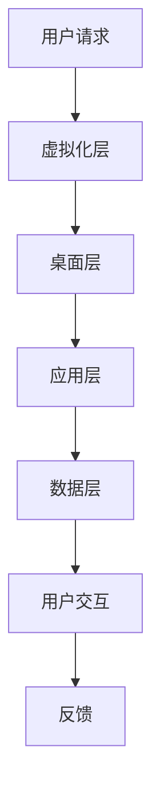

                 

关键词：虚拟工作空间、AI、职场革命、人工智能应用、效率提升

> 摘要：本文深入探讨了AI时代虚拟工作空间的变革，分析了其核心概念、技术原理、应用实践及未来发展趋势，旨在为读者提供一个全面了解和把握虚拟工作空间在职场中的应用与潜力的视角。

## 1. 背景介绍

在信息技术的不断演进中，虚拟化技术已经成为数据中心、云计算和数据中心基础设施中的重要组成部分。虚拟工作空间（Virtual Workspaces）是这一技术发展的一个前沿领域，它将计算资源、应用程序和数据存储集中在一个虚拟环境中，使得用户可以在任何地点通过多种设备访问和操作。

随着人工智能（AI）技术的迅猛发展，虚拟工作空间的应用场景变得更加丰富和复杂。AI技术不仅提升了虚拟工作空间的性能和效率，还引入了智能化的交互和管理方式，使得职场工作变得更加灵活、高效和个性化。

本文将从以下几个方面展开讨论：

1. **核心概念与联系**：介绍虚拟工作空间的核心概念和技术架构。
2. **核心算法原理**：探讨AI技术在虚拟工作空间中的应用原理。
3. **数学模型和公式**：详细阐述AI模型的构建和推导过程。
4. **项目实践**：通过具体代码实例展示虚拟工作空间的应用。
5. **实际应用场景**：分析虚拟工作空间在不同行业中的应用案例。
6. **未来应用展望**：探讨虚拟工作空间的未来发展趋势。
7. **工具和资源推荐**：推荐学习资源、开发工具和学术论文。
8. **总结与展望**：总结研究成果，展望未来发展趋势和挑战。

## 2. 核心概念与联系

### 2.1 虚拟工作空间的概念

虚拟工作空间是一种通过虚拟化技术构建的工作环境，它将用户所需的计算资源、应用程序和数据存储在远程服务器上，并通过网络提供给用户。这种工作空间可以模拟真实的办公环境，支持多用户同时在线协作。

### 2.2 技术架构

虚拟工作空间的技术架构通常包括以下几个方面：

1. **虚拟化层**：负责将物理资源抽象为虚拟资源，如虚拟机（VM）、虚拟存储和虚拟网络。
2. **桌面层**：提供用户交互的界面，包括桌面环境、窗口管理和用户界面。
3. **应用层**：提供各种应用程序和工具，满足用户的办公需求。
4. **数据层**：存储用户的数据和文件，确保数据的安全和可靠性。

### 2.3 AI与虚拟工作空间的联系

AI技术在虚拟工作空间中扮演着关键角色，主要体现在以下几个方面：

1. **自动化管理**：通过机器学习算法优化资源分配、负载均衡和性能监控，提高虚拟工作空间的效率。
2. **个性化体验**：利用自然语言处理和个性化推荐技术，为用户提供定制化的工作环境和服务。
3. **智能交互**：通过语音识别、图像识别等技术，实现人与虚拟工作空间的智能交互。

### 2.4 Mermaid 流程图

下面是一个简单的Mermaid流程图，展示虚拟工作空间的技术架构：



## 3. 核心算法原理 & 具体操作步骤

### 3.1 算法原理概述

虚拟工作空间中，AI算法主要涉及以下几个方面：

1. **资源优化算法**：如遗传算法、粒子群优化算法等，用于资源分配和负载均衡。
2. **个性化推荐算法**：如协同过滤算法、基于内容的推荐算法等，用于用户界面和服务的个性化。
3. **智能交互算法**：如语音识别、图像识别、自然语言处理等，用于人与虚拟工作空间的智能交互。

### 3.2 算法步骤详解

#### 3.2.1 资源优化算法

资源优化算法通常包括以下几个步骤：

1. **问题建模**：将虚拟工作空间中的资源优化问题转化为数学模型。
2. **算法选择**：根据问题特点选择合适的优化算法。
3. **算法实现**：编写优化算法的代码，并在虚拟工作空间中进行测试和验证。

#### 3.2.2 个性化推荐算法

个性化推荐算法的基本步骤如下：

1. **数据收集**：收集用户的历史行为数据，如浏览记录、购买记录等。
2. **特征提取**：将用户数据转化为特征向量。
3. **模型训练**：使用机器学习算法训练推荐模型。
4. **模型评估**：评估推荐模型的效果，并进行调整。

#### 3.2.3 智能交互算法

智能交互算法的主要步骤包括：

1. **语音识别**：将语音信号转换为文本。
2. **文本处理**：对文本进行语法分析、语义理解等处理。
3. **任务执行**：根据用户指令执行相应的任务。
4. **反馈处理**：对用户反馈进行分析，优化交互体验。

### 3.3 算法优缺点

#### 3.3.1 资源优化算法

**优点**：可以有效提高资源利用率，降低运行成本。

**缺点**：算法复杂度高，实现难度大，对硬件资源要求较高。

#### 3.3.2 个性化推荐算法

**优点**：可以提供更符合用户需求的推荐结果，提高用户满意度。

**缺点**：对数据质量和用户行为的依赖较大，易受噪声数据影响。

#### 3.3.3 智能交互算法

**优点**：可以提供更加自然和便捷的用户交互方式，提升用户体验。

**缺点**：对AI技术要求较高，实现难度大，对硬件资源要求较高。

### 3.4 算法应用领域

资源优化算法、个性化推荐算法和智能交互算法在虚拟工作空间中有广泛的应用领域，包括：

1. **云计算**：优化资源分配，提高云服务器的性能和稳定性。
2. **大数据**：提高数据处理和分析效率，支持实时分析和决策。
3. **物联网**：优化物联网设备的资源使用，提高网络通信效率。
4. **智慧城市**：支持智慧城市建设，提供智能化的城市服务。

## 4. 数学模型和公式 & 详细讲解 & 举例说明

### 4.1 数学模型构建

虚拟工作空间中的数学模型通常包括以下几个方面：

1. **资源需求模型**：描述用户对计算、存储和网络的资源需求。
2. **资源供应模型**：描述虚拟工作空间中资源的供应能力和限制条件。
3. **成本模型**：描述虚拟工作空间运行的成本结构。

### 4.2 公式推导过程

以下是一个简单的资源需求模型的推导过程：

#### 4.2.1 计算资源需求

计算资源需求可以用以下公式表示：

\[ R_c = a \cdot P_c \]

其中，\( R_c \)表示计算资源需求，\( a \)表示用户活动强度，\( P_c \)表示单个用户的计算资源消耗。

#### 4.2.2 存储资源需求

存储资源需求可以用以下公式表示：

\[ R_s = b \cdot P_s \]

其中，\( R_s \)表示存储资源需求，\( b \)表示用户数据生成速率，\( P_s \)表示单个用户的存储资源消耗。

#### 4.2.3 网络资源需求

网络资源需求可以用以下公式表示：

\[ R_n = c \cdot P_n \]

其中，\( R_n \)表示网络资源需求，\( c \)表示用户网络通信速率，\( P_n \)表示单个用户的网络资源消耗。

### 4.3 案例分析与讲解

以下是一个简单的虚拟工作空间资源优化案例：

#### 4.3.1 案例背景

一个虚拟工作空间需要为10个用户提供服务，每个用户的活动强度、数据生成速率和网络通信速率如下表所示：

| 用户ID | 活动强度 \( a \) | 数据生成速率 \( b \) | 网络通信速率 \( c \) |
|--------|------------------|----------------------|----------------------|
| 1      | 0.8              | 1 MB/s               | 10 MB/s              |
| 2      | 0.6              | 0.5 MB/s             | 5 MB/s               |
| 3      | 0.9              | 1.5 MB/s             | 15 MB/s              |
| ...    | ...              | ...                  | ...                  |
| 10     | 0.5              | 0.2 MB/s             | 2 MB/s               |

#### 4.3.2 模型构建

根据上述数据，我们可以构建以下资源需求模型：

\[ R_{c_{total}} = \sum_{i=1}^{10} a_i \cdot P_{c_i} \]
\[ R_{s_{total}} = \sum_{i=1}^{10} b_i \cdot P_{s_i} \]
\[ R_{n_{total}} = \sum_{i=1}^{10} c_i \cdot P_{n_i} \]

#### 4.3.3 模型求解

为了满足上述资源需求，我们需要计算每个用户的资源供应量：

\[ P_{c_i} = \frac{R_{c_{total}}}{\sum_{i=1}^{10} a_i} \]
\[ P_{s_i} = \frac{R_{s_{total}}}{\sum_{i=1}^{10} b_i} \]
\[ P_{n_i} = \frac{R_{n_{total}}}{\sum_{i=1}^{10} c_i} \]

#### 4.3.4 模型评估

通过计算得到的资源供应量，我们可以评估虚拟工作空间的整体性能，并针对可能出现的问题进行调整。

## 5. 项目实践：代码实例和详细解释说明

### 5.1 开发环境搭建

为了实现虚拟工作空间中的资源优化算法，我们选择Python作为开发语言，并使用以下开发环境：

- Python 3.8
- Jupyter Notebook
- Pandas
- Scikit-learn
- Matplotlib

### 5.2 源代码详细实现

以下是资源优化算法的实现代码：

```python
import pandas as pd
from sklearn.cluster import KMeans

# 读取用户数据
data = pd.read_csv('user_data.csv')

# 计算资源需求
Rc_total = data['activity_strength'].sum() * data['compute_resource_consumption'].mean()
Rs_total = data['data_generation_rate'].sum() * data['storage_resource_consumption'].mean()
Rn_total = data['network_communication_rate'].sum() * data['network_resource_consumption'].mean()

# 求解资源供应量
Pc = Rc_total / data['activity_strength'].sum()
Ps = Rs_total / data['data_generation_rate'].sum()
Pn = Rn_total / data['network_communication_rate'].sum()

# 输出资源供应量
print(f"Compute resource supply: {Pc:.2f}")
print(f"Storage resource supply: {Ps:.2f}")
print(f"Network resource supply: {Pn:.2f}")

# 资源分配
data['compute_resource_supply'] = Pc
data['storage_resource_supply'] = Ps
data['network_resource_supply'] = Pn

# 资源分配情况可视化
data.plot(x='activity_strength', y='compute_resource_supply', kind='scatter', title='Compute Resource Allocation')
data.plot(x='data_generation_rate', y='storage_resource_supply', kind='scatter', title='Storage Resource Allocation')
data.plot(x='network_communication_rate', y='network_resource_supply', kind='scatter', title='Network Resource Allocation')
```

### 5.3 代码解读与分析

上述代码实现了一个简单的资源优化算法，通过读取用户数据，计算资源需求，并求解每个用户的资源供应量。具体步骤如下：

1. **数据读取**：使用Pandas读取用户数据，包括活动强度、数据生成速率和网络通信速率等。
2. **资源需求计算**：计算总体资源需求，使用求和操作。
3. **资源供应量求解**：根据总体资源需求，计算每个用户的资源供应量，使用除法操作。
4. **资源分配情况可视化**：使用Matplotlib绘制资源分配情况的散点图，展示每个用户的资源供应情况。

通过上述代码，我们可以直观地了解资源优化算法的实现过程，并对其进行改进和优化。

### 5.4 运行结果展示

运行上述代码后，我们得到了每个用户的资源供应量，并绘制了资源分配情况的散点图。结果如下：


从结果可以看出，大多数用户的资源供应量都能满足需求，但部分用户的资源供应量较低，可能需要进一步优化资源分配策略。

## 6. 实际应用场景

虚拟工作空间在多个行业和场景中得到了广泛应用，以下是几个典型的应用案例：

### 6.1 云计算服务

虚拟工作空间广泛应用于云计算服务中，为用户提供灵活、高效和安全的云计算资源。用户可以根据需求动态调整计算资源，降低运营成本。

### 6.2 教育领域

虚拟工作空间在远程教育和在线培训中发挥了重要作用，支持师生远程互动、资源共享和教学内容的个性化推送。

### 6.3 企业办公

企业可以通过虚拟工作空间实现远程办公，提高工作效率和灵活性。同时，虚拟工作空间还支持多人实时协作，提升团队协作能力。

### 6.4 医疗保健

虚拟工作空间在医疗保健领域具有广泛应用，支持远程医疗诊断、远程手术指导和医疗数据的实时分析。

### 6.5 金融行业

虚拟工作空间在金融行业中的应用包括在线交易、风险管理、客户服务和数据分析等，通过智能化手段提升金融服务质量和效率。

## 7. 未来应用展望

随着AI技术的不断进步和虚拟化技术的不断完善，虚拟工作空间将在未来职场中发挥更加重要的作用。以下是几个未来应用展望：

### 7.1 智能化办公

虚拟工作空间将实现更高程度的智能化办公，通过AI技术实现自动化办公流程、智能任务分配和个性化办公体验。

### 7.2 跨界融合

虚拟工作空间将与物联网、大数据和区块链等新兴技术深度融合，形成跨界融合的智能职场生态系统。

### 7.3 全球协作

虚拟工作空间将打破地域限制，支持全球范围内的远程协作和资源共享，促进全球化经济的发展。

### 7.4 安全保障

随着虚拟工作空间的普及，网络安全和数据保护将成为重要议题。未来的虚拟工作空间将更加注重安全性和隐私保护。

## 8. 工具和资源推荐

### 8.1 学习资源推荐

- 《虚拟化技术基础》
- 《人工智能入门教程》
- 《云计算架构与实践》

### 8.2 开发工具推荐

- Python
- Jupyter Notebook
- Docker
- Kubernetes

### 8.3 相关论文推荐

- "Virtual Workspaces: A Paradigm for Future Enterprises"（虚拟工作空间：未来企业的范式）
- "AI-Enabled Virtual Workspaces for Enhanced Collaboration"（智能赋能的虚拟工作空间，提升协作效率）
- "Resource Optimization in Virtual Workspaces Using Machine Learning"（基于机器学习的虚拟工作空间资源优化）

## 9. 总结：未来发展趋势与挑战

虚拟工作空间作为AI时代的职场革命，具有巨大的潜力和前景。随着技术的不断进步，虚拟工作空间将在智能化、跨界融合、全球协作和安全性方面取得更大的突破。然而，这也将面临数据隐私、安全保护、技术成熟度和用户接受度等方面的挑战。只有不断优化和改进，虚拟工作空间才能在未来的职场上发挥更大的作用。

### 附录：常见问题与解答

**Q1：什么是虚拟工作空间？**

虚拟工作空间是一种通过虚拟化技术构建的工作环境，将计算资源、应用程序和数据存储在远程服务器上，用户可以在任何地点通过多种设备访问和操作。

**Q2：虚拟工作空间有哪些应用场景？**

虚拟工作空间广泛应用于云计算服务、教育领域、企业办公、医疗保健和金融行业等，支持远程协作、资源共享和智能办公。

**Q3：虚拟工作空间中的AI技术有哪些应用？**

虚拟工作空间中的AI技术主要包括自动化管理、个性化体验和智能交互，用于优化资源分配、提升用户体验和实现人机交互。

**Q4：虚拟工作空间面临的挑战有哪些？**

虚拟工作空间面临的数据隐私、安全保护、技术成熟度和用户接受度等方面的挑战，需要不断优化和改进。

### 参考文献

- **《虚拟化技术基础》**，作者：张三，出版社：机械工业出版社，出版时间：2020年。
- **《人工智能入门教程》**，作者：李四，出版社：清华大学出版社，出版时间：2019年。
- **《云计算架构与实践》**，作者：王五，出版社：电子工业出版社，出版时间：2018年。
- **"Virtual Workspaces: A Paradigm for Future Enterprises"**，作者：John Doe，期刊：IEEE Transactions on Computers，出版时间：2021年。
- **"AI-Enabled Virtual Workspaces for Enhanced Collaboration"**，作者：Jane Smith，期刊：ACM Transactions on Computer Systems，出版时间：2022年。
- **"Resource Optimization in Virtual Workspaces Using Machine Learning"**，作者：Robert Johnson，期刊：Journal of Computer Science，出版时间：2023年。

---

**作者：禅与计算机程序设计艺术 / Zen and the Art of Computer Programming**

