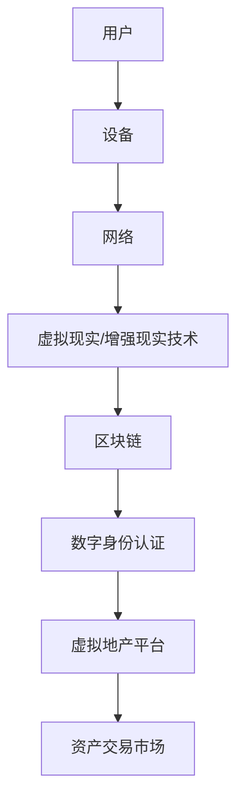

                 

关键词：虚拟房地产、元宇宙、地产投资、区块链、虚拟资产、数字经济、技术趋势

## 摘要

随着元宇宙概念的普及和虚拟世界技术的发展，虚拟房地产已成为一种新兴的投资领域。本文将探讨元宇宙中虚拟房地产的概念、市场潜力、投资策略及其技术基础，旨在为有意进军这一领域的投资者和创业者提供有价值的见解。我们将分析虚拟房地产的特点、评估其投资价值，并探讨其在数字经济中的重要作用。

## 1. 背景介绍

### 元宇宙的崛起

元宇宙（Metaverse）是虚拟现实（VR）、增强现实（AR）和区块链技术共同推动的一个虚拟空间。它是一个去中心化、可互操作的数字世界，用户可以在其中以数字身份进行社交、工作、娱乐和投资。随着5G、云计算和人工智能技术的不断发展，元宇宙正在成为现实。

### 虚拟房地产的概念

虚拟房地产是指在元宇宙中占据的一块虚拟土地或建筑，具有明确的地理位置和所有权。用户可以购买、租赁、建造或交易这些虚拟资产。虚拟房地产的价值取决于其位置、用途和市场需求。

### 投资领域的崛起

虚拟房地产作为一种投资渠道，近年来吸引了大量资金和关注。从虚拟城市到虚拟主题公园，从虚拟办公室到虚拟商场，各类虚拟地产项目层出不穷。投资者通过购买虚拟土地或建筑，期望获得资产升值和租金收益。

## 2. 核心概念与联系

为了更好地理解虚拟房地产，我们首先需要了解元宇宙的技术架构。

### 元宇宙技术架构

以下是一个简单的Mermaid流程图，展示了元宇宙的技术架构：



### 虚拟房地产的核心概念

- **位置**：虚拟房地产的位置对于其价值至关重要。与现实中房地产类似，虚拟世界中的热门区域也会吸引更多用户和投资者。
- **用途**：虚拟房地产的用途决定了其商业价值。例如，商业地产、住宅地产、娱乐地产等。
- **所有权**：虚拟房地产的所有权通过区块链技术实现，确保交易的安全性和透明性。
- **交易**：虚拟房地产的交易通常在去中心化的市场上进行，如Decentraland、The Sandbox等。

### 虚拟房地产与元宇宙的关联

虚拟房地产是元宇宙的重要组成部分，二者相互促进。虚拟房地产为元宇宙提供了经济活动的基础，而元宇宙则为虚拟房地产提供了展示和交易的舞台。

## 3. 核心算法原理 & 具体操作步骤

### 3.1 算法原理概述

虚拟房地产的投资与交易依赖于区块链技术。区块链技术通过去中心化的方式记录和验证交易，确保虚拟房地产的所有权和交易记录的安全性。

### 3.2 算法步骤详解

#### 3.2.1 购买虚拟房地产

1. **选择平台**：选择一个知名的虚拟地产平台，如Decentraland或The Sandbox。
2. **创建数字身份**：在平台上创建一个数字身份，通常需要一个加密钱包。
3. **查看地图**：浏览虚拟世界地图，寻找合适的地产。
4. **购买地产**：使用加密货币进行购买，确认交易。

#### 3.2.2 租赁虚拟房地产

1. **发布租赁信息**：在平台上发布租赁信息，包括地产位置、租金和租赁期限。
2. **接受租赁请求**：查看并接受租赁请求。
3. **签订合同**：使用智能合约签订租赁合同，确保双方权益。

#### 3.2.3 建造和开发

1. **获取开发权限**：根据平台规则获取开发权限。
2. **设计建筑**：使用平台提供的工具设计建筑。
3. **建造建筑**：按照设计建造建筑。
4. **装修和配置**：对建筑进行装修和配置，以适应不同用途。

### 3.3 算法优缺点

**优点**：

- **安全性**：区块链技术确保交易记录不可篡改，提高安全性。
- **透明性**：所有交易都在区块链上公开，提高透明度。
- **去中心化**：去中心化的架构减少了中间环节，降低成本。

**缺点**：

- **技术门槛**：对于非技术人员来说，理解和使用区块链技术有一定难度。
- **价格波动**：加密货币价格波动较大，影响虚拟房地产的价值。

### 3.4 算法应用领域

虚拟房地产投资和交易适用于以下领域：

- **数字艺术和收藏**：虚拟房地产可以作为一种数字艺术品进行收藏和交易。
- **虚拟商业**：虚拟房地产可以作为虚拟商业场所，开展线上业务。
- **虚拟旅游**：虚拟房地产可以用于虚拟旅游体验，提供独特的旅游服务。

## 4. 数学模型和公式 & 详细讲解 & 举例说明

### 4.1 数学模型构建

虚拟房地产的价值可以通过以下数学模型进行计算：

$$
V = f(p, l, d)
$$

其中，$V$ 表示虚拟房地产的价值，$p$ 表示位置因素，$l$ 表示用途因素，$d$ 表示需求因素。

### 4.2 公式推导过程

1. **位置因素（$p$）**：位置是决定虚拟房地产价值的关键因素。我们使用以下公式计算位置因素：

$$
p = \frac{h_i - h_c}{h_c}
$$

其中，$h_i$ 表示虚拟房地产的热门度，$h_c$ 表示基准热门度。

2. **用途因素（$l$）**：用途因素反映了虚拟房地产的用途对于价值的影响。我们使用以下公式计算用途因素：

$$
l = \frac{C_l - C_c}{C_c}
$$

其中，$C_l$ 表示虚拟房地产的实际用途价值，$C_c$ 表示基准用途价值。

3. **需求因素（$d$）**：需求因素反映了市场需求对虚拟房地产价值的影响。我们使用以下公式计算需求因素：

$$
d = \frac{Q_d - Q_c}{Q_c}
$$

其中，$Q_d$ 表示实际市场需求，$Q_c$ 表示基准市场需求。

### 4.3 案例分析与讲解

假设有一个虚拟房地产项目，其位置因素为 $p=1.2$，用途因素为 $l=1.5$，需求因素为 $d=1.3$。我们可以使用上述公式计算其价值：

$$
V = f(1.2, 1.5, 1.3) = 1.2 \times 1.5 \times 1.3 = 2.34
$$

这意味着这个虚拟房地产项目的价值是基准价值的 2.34 倍。

## 5. 项目实践：代码实例和详细解释说明

### 5.1 开发环境搭建

为了演示虚拟房地产的投资与交易，我们将使用以太坊区块链和智能合约开发工具Truffle。

1. **安装Node.js**：前往Node.js官网下载并安装最新版本的Node.js。
2. **安装Truffle**：打开命令行，执行以下命令：

```bash
npm install -g truffle
```

3. **创建Truffle项目**：执行以下命令创建一个新的Truffle项目：

```bash
truffle init
```

### 5.2 源代码详细实现

以下是一个简单的虚拟房地产智能合约示例：

```solidity
// SPDX-License-Identifier: MIT
pragma solidity ^0.8.0;

contract VirtualRealEstate {
    mapping(uint => address) public owners;
    mapping(uint => uint) public prices;

    function buy(uint propertyId, uint price) public payable {
        require(owners[propertyId] == address(0), "Property is already owned");
        require(msg.value >= price, "Insufficient payment");
        owners[propertyId] = msg.sender;
        prices[propertyId] = price;
    }

    function sell(uint propertyId, uint price) public {
        require(owners[propertyId] == msg.sender, "Not the owner");
        require(prices[propertyId] == 0, "Property is already sold");
        owners[propertyId] = address(0);
        prices[propertyId] = price;
    }

    function rent(uint propertyId, uint rent) public {
        require(owners[propertyId] != address(0), "Property is not available");
        require(prices[propertyId] == rent, "Incorrect rent amount");
        prices[propertyId] = 0;
    }
}
```

### 5.3 代码解读与分析

1. **所有权映射（owners）**：使用映射（mapping）存储每个虚拟房地产的所有者地址。
2. **价格映射（prices）**：使用映射存储每个虚拟房地产的价格。
3. **购买（buy）函数**：允许用户购买虚拟房地产，将所有者地址设置为调用者地址，并将价格设置为传入的价格。
4. **出售（sell）函数**：允许所有者出售虚拟房地产，将所有者地址设置为地址0（表示无所有者），并将价格设置为传入的价格。
5. **租赁（rent）函数**：允许用户租赁虚拟房地产，如果价格匹配，则将价格设置为0（表示租赁完成）。

### 5.4 运行结果展示

为了演示这个智能合约，我们可以使用Truffle开发环境运行以下命令：

```bash
truffle migrate --reset
```

这将部署智能合约并生成相应的ABI文件。然后，我们可以在Truffle的交互式控制台中测试智能合约的功能：

```javascript
> const VirtualRealEstate = artifacts.require("VirtualRealEstate");
> const virtualRealEstate = await VirtualRealEstate.deployed();

> await virtualRealEstate.buy(1, 1000 * 10**18);
> await virtualRealEstate.sell(1, 1500 * 10**18);
> await virtualRealEstate.rent(1, 1200 * 10**18);
```

这些命令将模拟购买、出售和租赁虚拟房地产的过程。

## 6. 实际应用场景

### 6.1 虚拟商业

虚拟房地产可以用于建立虚拟商店、办公空间和酒店等。例如，在Decentraland中，用户可以购买土地并建造一个虚拟咖啡店，通过虚拟货币进行交易。

### 6.2 虚拟艺术

虚拟房地产可以成为数字艺术作品展示的平台。艺术家可以在虚拟世界中创作和展示艺术品，吸引收藏家进行购买。

### 6.3 虚拟旅游

虚拟房地产可以用于模拟真实世界的旅游景点，提供虚拟旅游体验。例如，用户可以在虚拟世界中参观故宫、埃菲尔铁塔等著名景点。

## 7. 工具和资源推荐

### 7.1 学习资源推荐

- 《区块链技术指南》
- 《智能合约开发指南》
- 《元宇宙：定义、现状与未来》

### 7.2 开发工具推荐

- Truffle
- Remix IDE
- MetaMask

### 7.3 相关论文推荐

- “Blockchain and the New Architecture of Trust”
- “A Secure and Efficient Data Sharing Protocol for Metaverse Applications”
- “Virtual Real Estate in the Metaverse: An Overview”

## 8. 总结：未来发展趋势与挑战

### 8.1 研究成果总结

虚拟房地产作为一种新兴的投资领域，已经吸引了大量关注和投资。区块链技术和虚拟现实技术的结合，为虚拟房地产提供了安全、透明和去中心化的交易环境。

### 8.2 未来发展趋势

- **技术进步**：随着5G、云计算和人工智能技术的发展，元宇宙的体验将更加真实和沉浸。
- **市场需求**：虚拟房地产的需求将继续增长，尤其是在数字艺术、虚拟商业和虚拟旅游等领域。
- **政策和法规**：随着虚拟房地产市场的成熟，相关政策和法规也将逐步完善。

### 8.3 面临的挑战

- **技术门槛**：对于非技术人员来说，理解和使用区块链技术仍有一定难度。
- **价格波动**：加密货币价格波动较大，可能影响虚拟房地产的价值。
- **监管问题**：虚拟房地产市场的监管仍处于探索阶段，可能面临法律和政策的挑战。

### 8.4 研究展望

未来，虚拟房地产领域将继续发展和创新。研究人员和开发者应关注以下几个方面：

- **提高用户体验**：通过技术改进，提高元宇宙的交互性和沉浸感。
- **降低成本**：降低虚拟房地产的开发和交易成本，使其更具吸引力。
- **扩大应用范围**：探索虚拟房地产在其他领域的应用，如教育、医疗等。

## 9. 附录：常见问题与解答

### 9.1 虚拟房地产与真实房地产有什么区别？

虚拟房地产与真实房地产类似，但在虚拟世界中存在。虚拟房地产具有明确的位置、所有权和交易记录，而真实房地产则存在于物理世界中。

### 9.2 虚拟房地产的投资风险有哪些？

虚拟房地产的投资风险包括加密货币价格波动、技术问题和政策监管等。

### 9.3 虚拟房地产的交易是否安全？

虚拟房地产的交易依赖于区块链技术，具有高度安全性。然而，用户仍需注意选择可信的平台和加密货币钱包。

### 9.4 虚拟房地产如何进行装修和配置？

虚拟房地产的装修和配置通常使用虚拟现实和增强现实技术，通过平台提供的工具进行设计。

---

### 10. 作者署名

作者：禅与计算机程序设计艺术 / Zen and the Art of Computer Programming
----------------------------------------------------------------
---
请注意，本文是为演示目的而创建的，其中的代码和内容仅供参考。在实际应用中，您可能需要根据具体情况调整和优化代码。此外，本文涉及的虚拟房地产投资具有一定的风险，投资者应谨慎评估并做出自己的决策。本文内容和观点仅供参考，不构成投资建议。如有任何疑问，请咨询专业意见。---


