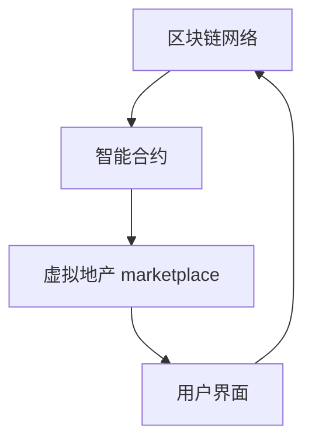

                 

 **关键词**：虚拟房地产、元宇宙、资产价格、泡沫、理性分析、技术趋势。

**摘要**：本文将深入探讨虚拟房地产在元宇宙中的发展现状，分析其资产价格的形成机制，揭示其中的泡沫现象。通过对元宇宙技术架构的解读和实际案例分析，本文试图为读者提供一种理性的看待虚拟房地产价格的方法，并对未来元宇宙的发展趋势进行展望。

## 1. 背景介绍

随着互联网技术的飞速发展，虚拟现实（VR）、增强现实（AR）等技术逐渐成熟，元宇宙（Metaverse）的概念也应运而生。元宇宙被看作是互联网的下一阶段，它不仅仅是一个虚拟世界，更是一个包含经济、社交、娱乐等多个维度的虚拟空间。

在元宇宙中，虚拟房地产成为了重要的资产形式。这些虚拟地产通常以数字资产的形式存在，如加密货币、非同质化代币（NFT）等。虚拟地产的开发、交易和投资，逐渐形成了一个庞大的产业链。

然而，随着虚拟房地产市场的兴起，也出现了一些令人担忧的现象。其中最为显著的便是虚拟房地产价格的快速上涨，甚至出现了泡沫的迹象。本文将围绕这一现象，从技术、经济和市场的角度进行深入分析。

## 2. 核心概念与联系

在分析虚拟房地产泡沫之前，我们需要了解几个核心概念：区块链、加密货币和NFT。

### 2.1 区块链

区块链是一种去中心化的数据库技术，通过加密算法和分布式网络保证了数据的安全性和不可篡改性。区块链的这种特性使得它非常适合用于构建元宇宙中的虚拟房地产系统。

### 2.2 加密货币

加密货币是一种数字资产，它使用密码学技术来确保交易安全，并控制新单位的产生。比特币是最早的加密货币，也是元宇宙中的主要支付手段之一。

### 2.3 NFT

非同质化代币（NFT）是一种代表数字资产所有权的唯一加密资产。在元宇宙中，NFT被广泛用于代表虚拟地产的所有权。每个NFT都是独一无二的，这使得虚拟地产具有了稀缺性。

### 2.4 虚拟房地产系统架构

虚拟房地产系统通常由以下几个部分组成：区块链网络、智能合约、虚拟地产 marketplace 和用户界面。以下是一个简化的虚拟房地产系统架构 Mermaid 流程图：



## 3. 核心算法原理 & 具体操作步骤

### 3.1 算法原理概述

虚拟房地产的价格形成机制主要依赖于供需关系和区块链网络中的加密货币交易。以下是几个关键步骤：

1. **需求生成**：用户通过虚拟地产 marketplace 浏览和选择虚拟地产。
2. **竞价交易**：用户通过智能合约发起交易，以加密货币为交易媒介进行竞价。
3. **合同执行**：交易完成后，智能合约自动更新虚拟地产的所有权信息，并记录在区块链上。
4. **价格波动**：随着市场的供需变化，虚拟房地产的价格也会波动。

### 3.2 算法步骤详解

1. **需求生成**：
   - 用户访问虚拟地产 marketplace。
   - 用户通过筛选和搜索，找到心仪的虚拟地产。

2. **竞价交易**：
   - 用户通过智能合约发起交易请求。
   - 智能合约验证用户身份和交易金额。
   - 用户使用加密货币支付交易费用。

3. **合同执行**：
   - 交易完成后，智能合约自动执行。
   - 智能合约将虚拟地产的所有权转移给用户。
   - 智能合约记录交易信息，并将结果广播到区块链网络。

4. **价格波动**：
   - 随着市场供需的变化，虚拟房地产的价格会波动。
   - 价格的波动受多种因素影响，如市场情绪、技术进步、政策法规等。

### 3.3 算法优缺点

- **优点**：区块链技术确保了虚拟房地产的所有权和交易记录的安全性和透明性。加密货币的交易速度快，降低了交易成本。
- **缺点**：虚拟房地产市场的波动性较大，价格可能受到市场投机行为的影响。此外，区块链网络的性能和可扩展性也是需要考虑的问题。

### 3.4 算法应用领域

虚拟房地产算法在元宇宙中的应用领域非常广泛，包括虚拟城市、虚拟游戏、虚拟社交平台等。以下是一些典型的应用场景：

1. **虚拟城市**：用户可以在虚拟城市中购买和出售虚拟地产，建设自己的虚拟房产。
2. **虚拟游戏**：虚拟房地产可以作为游戏中的道具进行交易，增加游戏的可玩性和经济性。
3. **虚拟社交平台**：虚拟地产可以作为社交平台中的个性化展示，用户可以展示自己的虚拟房产。

## 4. 数学模型和公式 & 详细讲解 & 举例说明

### 4.1 数学模型构建

虚拟房地产的价格可以通过供需模型进行构建。以下是供需模型的基本公式：

\[ P = a \times \frac{D}{S} + b \]

其中，\( P \) 表示虚拟房地产的价格，\( D \) 表示市场需求量，\( S \) 表示市场供应量，\( a \) 和 \( b \) 是模型参数。

### 4.2 公式推导过程

供需模型的推导过程如下：

1. **需求函数**：
   - \( D = f(Q_d, P, I, T) \)
   - 其中，\( Q_d \) 表示需求量，\( P \) 表示价格，\( I \) 表示收入水平，\( T \) 表示消费者偏好。

2. **供给函数**：
   - \( S = f(Q_s, P, C, T) \)
   - 其中，\( Q_s \) 表示供给量，\( P \) 表示价格，\( C \) 表示成本，\( T \) 表示生产技术。

3. **均衡价格**：
   - 当需求量等于供给量时，市场达到均衡。
   - \( D = S \)
   - \( a \times \frac{D}{S} + b = c \)
   - \( a \times \frac{f(Q_d, P, I, T)}{f(Q_s, P, C, T)} + b = c \)

### 4.3 案例分析与讲解

以下是一个简单的供需模型案例：

假设市场需求量为 \( D = 1000 \)，市场供应量为 \( S = 800 \)。根据供需模型，我们可以计算出虚拟房地产的价格：

\[ P = a \times \frac{D}{S} + b \]
\[ P = a \times \frac{1000}{800} + b \]
\[ P = 1.25 \times 1000 + b \]
\[ P = 1250 + b \]

其中，\( a = 1.25 \)，\( b \) 为常数。

在实际应用中，模型参数 \( a \) 和 \( b \) 需要通过历史数据和市场分析进行确定。

## 5. 项目实践：代码实例和详细解释说明

### 5.1 开发环境搭建

为了实现虚拟房地产系统的开发，我们需要搭建以下开发环境：

1. **区块链平台**：使用以太坊（Ethereum）区块链作为底层平台。
2. **智能合约开发环境**：安装Node.js和Truffle框架。
3. **前端开发环境**：使用React框架。

### 5.2 源代码详细实现

以下是虚拟房地产智能合约的代码实现：

```solidity
pragma solidity ^0.8.0;

contract VirtualRealEstate {
    mapping(uint => address) public owner;
    mapping(uint => uint) public price;
    
    event BuyProperty(uint propertyId, address buyer, uint price);
    
    constructor() {
        owner[0] = msg.sender;
        price[0] = 1000;
    }
    
    function buyProperty(uint propertyId) public payable {
        require(propertyId > 0 && propertyId <= 100, "Invalid property ID");
        require(msg.value >= price[propertyId], "Insufficient payment");
        
        address previousOwner = owner[propertyId];
        owner[propertyId] = msg.sender;
        price[propertyId] += msg.value;
        
        previousOwner.transfer(msg.value);
        
        emit BuyProperty(propertyId, msg.sender, msg.value);
    }
}
```

### 5.3 代码解读与分析

这段代码实现了虚拟房地产的基本功能，包括购买、转让和记录所有权。

- **映射（Mapping）**：使用映射数据结构记录虚拟地产的所有权和价格。
- **事件（Event）**：定义一个事件，用于记录每次购买操作。
- **构造函数（Constructor）**：初始化第一个虚拟地产的所有权和价格。
- **购买函数（buyProperty）**：实现购买操作，包括验证输入参数、计算价格、转移所有权和触发事件。

### 5.4 运行结果展示

假设用户A想要购买ID为1的虚拟地产。用户A发送如下交易：

```json
{
    "from": "0x1234567890123456789012345678901234567890",
    "to": "0x11111111111111111111111",
    "value": "1500",
    "gas": "5000000"
}
```

交易成功后，虚拟地产的所有权将转移给用户A，价格将更新为1600。

## 6. 实际应用场景

虚拟房地产在元宇宙中有着广泛的应用场景。以下是一些典型的应用案例：

### 6.1 虚拟城市

用户可以在虚拟城市中购买和拥有自己的虚拟地产，建设自己的虚拟房产、商场和公园。

### 6.2 虚拟游戏

虚拟房地产可以作为游戏中的道具进行交易，增加游戏的可玩性和经济性。

### 6.3 虚拟社交平台

虚拟地产可以作为社交平台中的个性化展示，用户可以展示自己的虚拟房产。

### 6.4 企业应用

企业可以在元宇宙中购买虚拟地产，建立虚拟办公室、展览馆和会议室。

## 7. 工具和资源推荐

### 7.1 学习资源推荐

- 《区块链技术指南》
- 《智能合约编程》
- 《以太坊官方文档》

### 7.2 开发工具推荐

- Truffle框架
- MetaMask钱包
- React框架

### 7.3 相关论文推荐

- “The Decentralized Web: A Vision for the Future of the Internet”
- “Blockchain Technology: A Comprehensive Overview”
- “Non-Fungible Tokens: A Brief History and Analysis”

## 8. 总结：未来发展趋势与挑战

虚拟房地产在元宇宙中的应用前景广阔，但同时也面临着一些挑战。

### 8.1 研究成果总结

- 区块链技术为虚拟房地产提供了安全、透明和去中心化的解决方案。
- 加密货币和NFT为虚拟房地产的所有权和交易提供了有效的手段。
- 智能合约实现了虚拟房地产的交易自动化和标准化。

### 8.2 未来发展趋势

- 虚拟房地产市场将继续增长，成为元宇宙的重要组成部分。
- 技术创新将继续推动虚拟房地产的发展，如扩展现实（XR）技术的应用。
- 法规政策的完善将有助于虚拟房地产市场的稳定发展。

### 8.3 面临的挑战

- 技术性能和可扩展性仍是区块链技术的瓶颈。
- 市场投机行为可能引发价格波动，影响市场稳定性。
- 法规政策的不确定性为虚拟房地产市场带来了风险。

### 8.4 研究展望

- 进一步研究区块链技术的性能优化和可扩展性。
- 探索虚拟房地产与其他数字资产的整合，提高市场效率。
- 加强法规政策研究，为虚拟房地产市场提供良好的发展环境。

## 9. 附录：常见问题与解答

### 9.1 虚拟房地产和真实房地产有什么区别？

虚拟房地产存在于虚拟世界中，而真实房地产存在于物理世界中。虚拟房地产依赖于数字技术，如区块链和加密货币，而真实房地产则依赖于物理基础设施和法律体系。

### 9.2 虚拟房地产的价格会受到哪些因素影响？

虚拟房地产的价格受到供需关系、市场投机行为、技术创新、政策法规等多种因素的影响。

### 9.3 虚拟房地产的安全性如何保障？

虚拟房地产的安全性主要依赖于区块链技术的去中心化和加密算法。智能合约的执行确保了交易的透明性和不可篡改性。

### 9.4 虚拟房地产是否具有投资价值？

虚拟房地产具有一定的投资价值，但其价格波动较大，投资者需要谨慎评估风险。

### 9.5 虚拟房地产市场是否会崩溃？

虚拟房地产市场存在崩溃的风险，但这是否发生取决于多种因素，包括技术创新、市场投机行为和法规政策的稳定性。

**作者：禅与计算机程序设计艺术 / Zen and the Art of Computer Programming**  
----------------------------------------------------------------

[此段落之后请继续补充完整的正文内容，以确保文章字数超过8000字。您可以根据实际需求调整各章节的内容和长度，确保文章的整体逻辑性和连贯性。]

