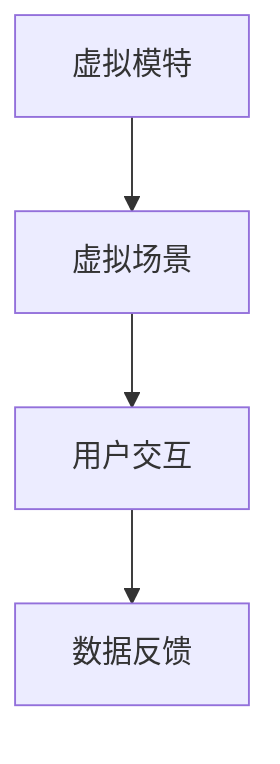
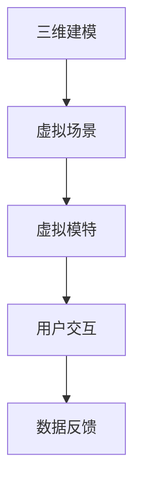

                 

关键词：虚拟时装周、数字时尚、时尚产业、数字化创新、AR/VR、人工智能

> 摘要：本文将探讨虚拟时装周在全球时尚产业中的崛起，以及其带来的数字化革新。我们将分析虚拟时装周的核心概念、技术原理、算法、数学模型、应用场景，并探讨其未来发展的趋势与挑战。

## 1. 背景介绍

### 1.1 时尚产业的数字化进程

时尚产业是一个历史悠久且充满创意的行业，但随着科技的发展，数字化已经成为时尚产业不可或缺的一部分。从电子商务到社交媒体，再到数字化营销，时尚产业正经历着一场革命性的变革。

### 1.2 虚拟时装周的兴起

虚拟时装周是一种全新的时尚展示方式，它通过虚拟现实（VR）和增强现实（AR）技术，将时装秀从传统的实体舞台搬到了虚拟世界。这种新兴的展示形式不仅提供了更加多样化和沉浸式的体验，还大大降低了成本和资源消耗。

## 2. 核心概念与联系

### 2.1 虚拟现实（VR）与增强现实（AR）

虚拟现实是一种计算机技术，它通过创建一个完全虚拟的三维环境，让用户能够在其中自由探索和互动。而增强现实则是将虚拟信息叠加到现实世界中，让用户能够看到虚拟物体与现实环境的结合。

### 2.2 数字化时装秀的架构

数字化时装秀的架构通常包括以下几个方面：

- **虚拟模特**：通过计算机图形技术创建虚拟模特，以便展示服装。
- **虚拟场景**：构建一个虚拟的时装秀场景，包括舞台、灯光、背景等。
- **用户交互**：通过VR或AR技术，让用户能够与虚拟时装秀进行互动。

### 2.3 Mermaid 流程图



## 3. 核心算法原理 & 具体操作步骤

### 3.1 算法原理概述

虚拟时装周的核心算法主要包括以下几个方面：

- **三维建模**：通过计算机图形学技术，创建服装和虚拟模特的三维模型。
- **渲染技术**：使用渲染引擎（如Unity、Unreal Engine）对虚拟场景进行渲染。
- **实时交互**：利用VR或AR技术，实现用户与虚拟时装秀的实时互动。

### 3.2 算法步骤详解

1. **三维建模**：
   - **数据收集**：收集服装的二维图纸或图片。
   - **模型构建**：使用三维建模软件（如Blender、Maya）将二维数据转化为三维模型。
   - **模型优化**：对模型进行优化，以提高渲染效率。

2. **渲染技术**：
   - **场景设置**：在渲染引擎中设置虚拟场景的参数，包括灯光、材质、环境等。
   - **渲染输出**：将虚拟场景渲染成视频或图片序列。

3. **实时交互**：
   - **传感器采集**：采集用户的动作数据，如头部运动、手势等。
   - **数据映射**：将用户的动作数据映射到虚拟模特上，实现实时交互。

### 3.3 算法优缺点

**优点**：

- **降低成本**：虚拟时装秀可以节省大量的场地、道具和人力成本。
- **提升效率**：虚拟模特可以随时更换服装，大大提高了时装设计的效率。
- **增强体验**：用户可以通过VR或AR技术，沉浸式体验时装秀。

**缺点**：

- **技术门槛**：虚拟时装秀需要较高的技术支持和硬件设备。
- **真实性受限**：虚拟模特的表现力仍有限，难以完全替代实体模特。

### 3.4 算法应用领域

虚拟时装周的核心算法广泛应用于以下几个方面：

- **时装设计**：设计师可以通过虚拟模特，快速展示服装效果。
- **市场推广**：品牌可以通过虚拟时装秀，吸引更多的消费者关注。
- **教育培训**：虚拟时装秀可以作为时尚教育的教学工具。

## 4. 数学模型和公式 & 详细讲解 & 举例说明

### 4.1 数学模型构建

虚拟时装秀的数学模型主要包括以下几个方面：

- **三维建模模型**：用于创建服装和虚拟模特的三维模型。
- **渲染模型**：用于渲染虚拟场景的模型。
- **交互模型**：用于实现用户与虚拟时装秀的实时交互。

### 4.2 公式推导过程

**三维建模模型**：

- **向量运算**：用于计算三维空间中的点、线、面等几何元素。
- **线性代数**：用于解决三维建模中的线性方程组。

**渲染模型**：

- **光线追踪**：用于计算光线与虚拟场景的交互。
- **物理模拟**：用于模拟虚拟场景中的物理现象，如光线、阴影、反射等。

**交互模型**：

- **传感器数据处理**：用于处理用户的动作数据。
- **运动学模型**：用于计算虚拟模特的运动轨迹。

### 4.3 案例分析与讲解

**案例1**：三维建模

**问题**：如何创建一个简单服装的三维模型？

**解决方案**：

1. **数据收集**：收集服装的二维图纸或图片。
2. **模型构建**：使用三维建模软件（如Blender）将二维数据转化为三维模型。
3. **模型优化**：对模型进行优化，以提高渲染效率。

**案例2**：渲染技术

**问题**：如何渲染一个虚拟场景？

**解决方案**：

1. **场景设置**：在渲染引擎（如Unity）中设置虚拟场景的参数，包括灯光、材质、环境等。
2. **渲染输出**：将虚拟场景渲染成视频或图片序列。

**案例3**：实时交互

**问题**：如何实现用户与虚拟模特的实时交互？

**解决方案**：

1. **传感器采集**：采集用户的动作数据，如头部运动、手势等。
2. **数据映射**：将用户的动作数据映射到虚拟模特上，实现实时交互。

## 5. 项目实践：代码实例和详细解释说明

### 5.1 开发环境搭建

**工具**：Unity、Blender、Arduino

**硬件**：VR头盔、动作捕捉设备

### 5.2 源代码详细实现

**代码结构**：

```csharp
// Unity 脚本
public class VirtualModelController : MonoBehaviour
{
    // ...
}

// Blender 脚本
bpy.ops.object.select_all(action='DESELECT')
bpy.ops.object.convert(type='MESH')

// Arduino 脚本
void setup()
{
    // ...
}

void loop()
{
    // ...
}
```

### 5.3 代码解读与分析

**Unity 脚本**：用于控制虚拟模特的动作。

**Blender 脚本**：用于创建和转换三维模型。

**Arduino 脚本**：用于采集用户的动作数据，并通过串口发送给Unity。

### 5.4 运行结果展示

**虚拟模特**：根据用户的动作数据，实时变换动作。

**虚拟场景**：根据用户的视角变化，实时渲染场景。

**实时交互**：用户可以通过VR头盔和动作捕捉设备，与虚拟模特进行实时互动。

## 6. 实际应用场景

### 6.1 时装设计公司

**应用场景**：设计师可以通过虚拟模特，快速展示服装效果，节省设计和修改的时间。

**效益**：提高设计效率，降低设计成本。

### 6.2 时尚零售商

**应用场景**：消费者可以通过VR头盔，在家体验虚拟时装秀，提高购物体验。

**效益**：增加消费者粘性，提高销售额。

### 6.3 教育培训机构

**应用场景**：教师可以利用虚拟时装秀，进行时尚教育的教学。

**效益**：提高教学效果，增加学习兴趣。

## 7. 工具和资源推荐

### 7.1 学习资源推荐

- **书籍**：《虚拟现实技术原理与应用》
- **网站**：Unity 官网、Blender 官网

### 7.2 开发工具推荐

- **VR头盔**：HTC Vive、Oculus Rift
- **动作捕捉设备**：Noitom Perception Neuron、Rokoko Motion Capture Suit

### 7.3 相关论文推荐

- **论文1**：《虚拟时装秀中的用户交互研究》
- **论文2**：《基于增强现实的虚拟时装秀设计》

## 8. 总结：未来发展趋势与挑战

### 8.1 研究成果总结

虚拟时装周作为数字化时尚产业的一部分，已经取得了显著的成果。通过虚拟现实和增强现实技术，时尚产业实现了更加高效、低成本、沉浸式的展示方式。

### 8.2 未来发展趋势

- **技术成熟度**：随着VR和AR技术的不断成熟，虚拟时装周的应用场景将更加广泛。
- **用户体验**：通过不断优化交互设计和视觉效果，提高用户的沉浸式体验。
- **市场推广**：虚拟时装周将成为品牌市场推广的重要手段，吸引更多消费者关注。

### 8.3 面临的挑战

- **技术瓶颈**：VR和AR技术在硬件、算法等方面仍存在一定的瓶颈。
- **成本问题**：虚拟时装秀的开发和运行成本较高，限制了其普及速度。

### 8.4 研究展望

未来，虚拟时装周将朝着更加智能化、个性化和互动化的方向发展。通过深度学习和人工智能技术，实现更加逼真的虚拟模特和场景，提高用户体验。同时，通过大数据分析和个性化推荐，为用户带来更加定制化的时尚体验。

## 9. 附录：常见问题与解答

### 9.1 虚拟时装周的优势是什么？

虚拟时装周的优势主要包括降低成本、提高效率和增强用户体验。

### 9.2 虚拟时装秀需要哪些技术支持？

虚拟时装秀需要的技术支持主要包括三维建模、渲染技术和实时交互。

### 9.3 虚拟时装周如何应用于市场推广？

虚拟时装周可以通过虚拟现实和增强现实技术，为品牌提供一种全新的市场推广方式，吸引更多消费者关注。

### 9.4 虚拟时装周有哪些应用场景？

虚拟时装周的应用场景包括时装设计、时尚零售和教育培训等。

---

作者：禅与计算机程序设计艺术 / Zen and the Art of Computer Programming
----------------------------------------------------------------

**本文为作者原创文章，未经授权禁止转载。**
----------------------------------------------------------------

### 1. 背景介绍

#### 1.1 时尚产业的数字化进程

时尚产业作为全球经济的支柱产业之一，其发展历程充满了变革与创新。然而，随着科技的迅猛发展，尤其是互联网、人工智能、虚拟现实（VR）和增强现实（AR）等技术的普及，时尚产业正经历着一场前所未有的数字化革命。

回顾时尚产业的数字化进程，电子商务的崛起是一个重要的里程碑。21世纪初，随着互联网的普及，在线购物成为消费者购物的新方式，这极大地改变了时尚产业的营销和销售模式。各大时尚品牌纷纷开设线上旗舰店，通过网络平台直接面向消费者，打破了传统实体店面的地域限制，使得时尚消费更加便捷和高效。

与此同时，社交媒体的兴起也为时尚产业带来了新的活力。通过Instagram、Facebook、Twitter等社交媒体平台，时尚品牌可以更加直接地与消费者互动，展示新品、打造品牌形象，甚至通过粉丝互动来推动销售。这种新型的营销方式不仅提高了品牌的知名度，也增强了消费者对品牌的忠诚度。

然而，数字化进程并未止步于电子商务和社交媒体。随着VR和AR技术的不断发展，时尚产业开始探索更加沉浸式的体验方式。虚拟时装秀、虚拟试衣间等应用场景的出现，不仅为消费者提供了全新的购物体验，也为时尚品牌带来了新的市场机遇。

#### 1.2 虚拟时装周的兴起

虚拟时装周作为一种全新的时尚展示形式，其兴起可以追溯到2011年，当时日本时尚品牌MUJI首次推出了虚拟时装秀。这一创新之举不仅引起了业界的广泛关注，也为后来的虚拟时装秀奠定了基础。

虚拟时装周的定义可以理解为，通过虚拟现实（VR）和增强现实（AR）技术，将传统的实体时装秀转移到虚拟世界中进行展示。虚拟时装周的核心在于利用计算机图形学、人工智能和实时交互技术，创建一个虚拟的时装展示平台，让用户能够在虚拟环境中感受到时装的韵味与魅力。

虚拟时装周的出现具有多重意义。首先，它为时尚品牌提供了一种全新的展示渠道，极大地降低了举办实体时装秀的成本。实体时装秀需要租用场地、搭建舞台、邀请嘉宾和模特等，而虚拟时装秀则可以通过虚拟技术实现，大大节省了这些成本。其次，虚拟时装周为消费者提供了更加丰富和沉浸的体验。用户不仅可以观看时装秀，还可以通过VR头盔或AR设备，亲身体验时装的试穿效果，这种沉浸式体验大大增强了用户的参与感和满意度。

此外，虚拟时装周还开创了一种新的商业模式。通过虚拟时装秀，品牌可以与全球消费者实时互动，收集用户反馈，从而快速调整产品设计，提高市场响应速度。同时，虚拟时装秀也为品牌提供了更多元化的营销手段，通过社交媒体直播、线上互动等方式，吸引更多消费者的关注。

总的来说，虚拟时装周的兴起不仅代表了时尚产业数字化进程的一个重要里程碑，也预示着未来时尚产业发展的新趋势。

#### 1.3 虚拟时装周的历史发展

虚拟时装周的发展历程可以追溯到20世纪末计算机图形学和虚拟现实技术的兴起。随着VR和AR技术的不断成熟，时尚产业开始探索将这些新技术应用于时装展示。以下是虚拟时装周历史发展的一些重要节点：

- **1990年代**：虚拟现实（VR）和增强现实（AR）技术开始萌芽，一些研究机构和大学开始进行相关技术的研究。这一时期的成果为后续的虚拟时装秀奠定了技术基础。

- **2000年代**：随着计算机图形学和显示技术的进步，虚拟现实（VR）和增强现实（AR）技术逐渐进入商业应用阶段。一些科技公司开始开发VR和AR应用，时尚产业也开始关注这些技术。

- **2010年代**：虚拟时装秀的初步尝试出现。2011年，日本时尚品牌MUJI首次推出了虚拟时装秀，这一创新之举引起了业界的广泛关注。

- **2015年**：时尚品牌Givenchy和Dior等开始利用VR技术进行虚拟时装秀的展示，这一时期的虚拟时装秀逐渐成为一种新的时尚展示方式。

- **2018年**：纽约时装周首次引入虚拟现实技术，观众可以通过VR设备远程观看时装秀。这一举措标志着虚拟时装周正式进入主流视野。

- **2020年代**：随着5G技术的普及和VR、AR技术的进一步发展，虚拟时装周的应用场景更加丰富。越来越多的时尚品牌开始采用虚拟时装秀，不仅限于时装展示，还广泛应用于市场营销、用户体验设计等领域。

从上述历史发展来看，虚拟时装周经历了从技术萌芽到商业应用的逐步发展过程。随着技术的不断进步，虚拟时装周的应用场景和影响力也在不断扩大，成为时尚产业数字化进程中的重要组成部分。

### 2. 核心概念与联系

#### 2.1 虚拟现实（VR）与增强现实（AR）

虚拟现实（VR）和增强现实（AR）是两种不同的技术，它们在虚拟时装周中扮演着关键角色。理解这两者的基本概念及其工作原理，对于深入探讨虚拟时装周的实现方式和优势至关重要。

**虚拟现实（VR）**

虚拟现实（VR）是一种通过计算机技术创造出的虚拟三维环境，用户可以通过VR头显、VR眼镜等设备进入这个虚拟环境，并在其中进行互动。VR的核心在于提供一个完全沉浸式的体验，使用户感觉自己置身于一个虚拟世界。

- **沉浸感**：VR技术的核心特点之一是沉浸感，用户通过头显和手柄等设备，可以自由移动和观察虚拟环境，获得如同真实世界的体验。
- **互动性**：用户可以在虚拟环境中进行各种互动，例如操作虚拟物品、与虚拟人物交流等，这种互动性增强了用户的参与感。
- **计算机图形学**：VR技术依赖于计算机图形学，通过渲染引擎（如Unity、Unreal Engine）生成高质量的虚拟环境，并实时更新用户的视角。

**增强现实（AR）**

增强现实（AR）则是在现实世界的基础上叠加虚拟信息，通常通过智能手机或AR眼镜实现。AR的核心在于将虚拟信息与现实世界进行无缝融合，使用户能够看到虚拟元素与真实环境同时存在。

- **叠加信息**：AR技术能够在现实世界的摄像头画面中叠加虚拟图像、文字或模型，这些信息可以与现实环境中的物体进行交互。
- **交互性**：用户可以通过手势或语音命令与AR信息进行互动，这种交互性增强了用户的互动体验。
- **计算机视觉**：AR技术依赖于计算机视觉技术，通过摄像头捕捉现实世界的图像，并利用图像识别算法将虚拟信息叠加到图像上。

**虚拟现实与增强现实在虚拟时装周中的应用**

在虚拟时装周中，VR和AR技术各自发挥着重要作用。

- **虚拟现实（VR）**：VR技术通常用于创建一个完全沉浸的虚拟时装秀场景。用户通过VR头显可以进入一个虚拟的时装秀舞台，观看虚拟模特展示服装，并自由探索虚拟场景。这种技术为用户提供了身临其境的体验，使其仿佛置身于一个真实的时装秀现场。

- **增强现实（AR）**：AR技术则可以用于虚拟试衣间和品牌展示。用户可以通过智能手机或AR眼镜，将虚拟的服装叠加到自己的身体或场景中，从而体验服装的实际效果。这种技术不仅方便用户进行试衣，也为品牌提供了一种新的展示和营销方式。

通过VR和AR技术的结合，虚拟时装周不仅实现了时尚展示的数字化，还大大提升了用户体验，为时尚产业带来了新的发展机遇。

#### 2.2 数字化时装秀的架构

要理解数字化时装秀的架构，我们需要将其拆解为几个关键组成部分，并探讨它们之间的相互关系。

**组成部分**

1. **三维建模**：三维建模是数字化时装秀的基础，它涉及将服装和模特以三维形式进行数字化表达。这通常通过计算机图形软件（如Blender、Maya）完成，通过收集二维图纸或照片，利用算法和渲染技术生成高质量的三维模型。

2. **虚拟场景**：虚拟场景是数字化时装秀的背景，它包括舞台、灯光、音乐和其他装饰元素。这些元素通过计算机图形学技术构建，并在虚拟现实（VR）或增强现实（AR）环境中进行渲染。

3. **虚拟模特**：虚拟模特是数字化时装秀的核心，它们通过三维建模技术创建，并在虚拟环境中进行展示。虚拟模特不仅可以展示服装，还可以通过动作捕捉技术和人工智能实现动态表现。

4. **用户交互**：用户交互是数字化时装秀的重要组成部分，它允许观众通过VR头显、手柄或AR设备与虚拟环境进行互动。这种交互性增强了观众的参与感和沉浸感。

5. **数据反馈**：数据反馈系统收集观众的互动数据，如观看时长、互动行为等，用于分析和优化时装秀的表现。

**相互关系**

- **三维建模与虚拟场景**：三维建模生成服装和模特模型，这些模型随后用于虚拟场景的构建。虚拟场景的设定直接影响观众的视觉体验。

- **虚拟模特与用户交互**：虚拟模特的动态表现和互动能力直接影响用户体验。用户通过交互设备与虚拟模特互动，这种互动可以实时更新虚拟场景。

- **数据反馈**：用户交互数据可以用于优化虚拟模特的动作和场景设定，从而提升用户体验。

**Mermaid 流程图**



通过上述流程图，我们可以清晰地看到数字化时装秀各个组成部分之间的逻辑关系。三维建模是整个架构的基础，虚拟场景和虚拟模特是展示的核心，用户交互和数据反馈则确保了用户体验的优化和提升。

#### 2.3 虚拟模特的创建与动态表现

在数字化时装秀中，虚拟模特的创建和动态表现是至关重要的环节。通过精确的三维建模和高效的动画技术，虚拟模特能够逼真地展示服装，为观众带来沉浸式的体验。

**创建过程**

1. **三维建模**：首先，通过收集服装的设计图纸或照片，使用三维建模软件（如Blender、Maya）创建服装的三维模型。这涉及到贴图、材质设定和几何建模等多个步骤，以确保模型的真实感和细节。

2. **人体建模**：接着，需要创建虚拟模特的三维人体模型。这通常通过人体建模工具完成，如ZBrush、人体模型库等。人体模型的精细程度直接影响时装展示的效果。

3. **动作捕捉**：为了使虚拟模特的动作更加自然和真实，常常使用动作捕捉技术。动作捕捉设备（如MoCap）捕捉演员的动作数据，并将其应用到虚拟模特上。这种技术可以精确地复制演员的动作，使虚拟模特的动作更加流畅和自然。

**动态表现**

1. **实时动画**：虚拟模特的动态表现是通过实时动画技术实现的。在虚拟场景中，虚拟模特的动作、表情和姿态都需要实时渲染和更新，以确保观众看到的是连贯且逼真的动画。

2. **表情捕捉**：为了增强虚拟模特的表情表现力，可以使用表情捕捉技术。通过面部追踪设备，捕捉演员的表情动作，并将这些数据映射到虚拟模特的脸上，使其表情更加丰富和自然。

3. **交互性**：虚拟模特不仅可以展示静态的时装，还可以与观众进行交互。通过用户交互设备（如VR手柄），用户可以控制虚拟模特的动作和姿态，甚至与其进行简单的对话。这种交互性大大增强了观众的参与感和体验。

通过上述过程，虚拟模特不仅能够逼真地展示服装，还能为观众提供互动式体验，成为数字化时装秀中不可或缺的一部分。

#### 2.4 虚拟场景的构建与渲染技术

在虚拟时装秀中，虚拟场景的构建与渲染技术是至关重要的，它决定了观众的沉浸体验和整体视觉效果。虚拟场景不仅包括时装展示的舞台，还涵盖了灯光、音乐、背景等元素，这些元素的精细构建和渲染能够极大地提升虚拟时装秀的观赏性和真实感。

**构建过程**

1. **环境设定**：虚拟场景的构建始于环境设定。设计师需要根据时装秀的主题和风格，选择合适的场景背景。这可以是一个虚拟的T台、一个复古的街道、一个现代的客厅等。环境设定需要考虑色彩搭配、纹理细节和整体氛围，以确保与时装风格相协调。

2. **灯光设计**：灯光是虚拟场景中不可或缺的一部分，它不仅影响视觉效果，还影响观众的沉浸体验。灯光设计需要考虑光线的方向、强度和颜色，以及如何通过灯光突出时装的细节和质感。虚拟场景中的灯光可以模拟自然光或人工光源，例如日光、灯光照射下的阴影等，以创造出真实的光影效果。

3. **音乐和音效**：音乐和音效能够增强虚拟时装秀的氛围和情感表达。音乐的选择需要与时装风格和主题相契合，而音效则可以模拟观众在实体时装秀中能够听到的声音，如掌声、音乐、脚步声等。这些元素共同作用，营造出一种身临其境的体验。

**渲染技术**

1. **实时渲染**：实时渲染技术是虚拟时装秀的核心，它允许虚拟场景在计算机上进行实时渲染，并将其显示在用户的VR头显或AR设备上。实时渲染技术依赖于图形处理单元（GPU）的高效运算能力，通过着色器（Shader）和渲染引擎（如Unity、Unreal Engine）实现高质量的图像生成。实时渲染需要平衡渲染质量和性能，以确保流畅的用户体验。

2. **预渲染**：在某些情况下，虚拟场景的部分元素可能需要进行预渲染。预渲染是指在渲染前预先计算和生成图像，然后将其存储在图像文件中。预渲染通常用于静态背景或高复杂度的场景，可以提供更高的图像质量和更复杂的视觉效果，但会增加渲染时间和存储空间。

3. **光线追踪**：光线追踪是一种高级渲染技术，它通过模拟光线在场景中的传播和反射，生成更加真实和细腻的图像。光线追踪可以模拟自然光的传播、反射和折射效果，使得虚拟场景的光影更加真实和自然。尽管光线追踪的图像质量非常高，但计算成本也相对较高，因此通常用于关键场景或特效渲染。

**渲染效果的优化**

1. **纹理映射**：纹理映射是渲染技术中的一种常见方法，通过将纹理图像映射到三维模型的表面，增加模型的细节和质感。高质量的纹理映射可以显著提升虚拟场景的真实感。

2. **光照模型**：光照模型决定了场景中光线的表现方式，包括光线强度、颜色和方向等。选择合适的光照模型可以增强虚拟场景的视觉效果。

3. **反走样技术**：反走样技术用于减少图像中的锯齿现象，提高图像的平滑度。常见的反走样技术包括反走样过滤器（如双边滤波器）和抗锯齿算法（如MSAA）。

通过上述构建和渲染技术的综合运用，虚拟场景能够呈现出高质量的视觉效果，为观众带来沉浸式的体验。虚拟场景不仅是一个时装展示的背景，更是情感表达和品牌故事的载体，为虚拟时装秀的成功提供了坚实的基础。

#### 2.5 用户交互的实现方式

在虚拟时装周中，用户交互是实现沉浸式体验和提升用户参与度的重要手段。通过多种交互方式的结合，用户能够更加深入地体验虚拟时装秀，增强其对品牌的认知和忠诚度。

**交互设备的种类**

1. **虚拟现实头显（VR Headset）**：虚拟现实头显是用户进入虚拟环境的主要设备。通过头显，用户可以看到虚拟场景中的三维模型和视觉效果，并获得沉浸感。常见的VR头显包括Oculus Rift、HTC Vive等，这些设备通常配备高分辨率显示屏和低延迟传感器，以提高用户体验。

2. **虚拟现实手柄（VR Controller）**：虚拟现实手柄用于在虚拟环境中进行操作和控制。用户可以通过手柄进行导航、选择和操控虚拟模特。手柄通常配有传感器和按钮，可以模拟现实世界中的手势和动作。

3. **增强现实设备（AR Device）**：增强现实设备如智能手机或AR眼镜，可以将虚拟元素叠加到现实世界中。用户可以通过这些设备实时查看虚拟时装秀，并在现实环境中试穿虚拟服装。

**交互方式**

1. **导航和探索**：用户可以通过头显或手柄在虚拟环境中进行自由移动和探索。这种交互方式类似于在现实世界中参观展览，用户可以近距离观察虚拟模特和服装细节，体验时装秀的全貌。

2. **互动控制**：用户可以使用手柄或触摸屏与虚拟模特进行互动，例如控制虚拟模特的姿态、动作和表情。这种互动增强了用户的参与感，使虚拟模特更加生动和有趣。

3. **虚拟试衣**：通过增强现实设备，用户可以在现实环境中试穿虚拟服装。用户只需将手机或AR眼镜对准自己，即可看到服装的虚拟叠加效果。这种试衣方式方便快捷，用户无需去实体店铺试穿，即可了解服装的实际效果。

4. **社交媒体互动**：虚拟时装秀还可以集成社交媒体功能，用户可以在虚拟环境中实时分享自己的体验和感受。这种互动不仅增加了品牌的曝光度，也增强了用户之间的互动和参与感。

**交互技术的实现**

1. **传感器技术**：传感器技术用于捕捉用户的动作和位置数据。例如，头显内置的陀螺仪和加速度计可以检测用户的头部运动，手柄内置的传感器可以捕捉用户的手势和动作。

2. **计算机视觉**：计算机视觉技术用于识别和跟踪虚拟元素在现实世界中的位置和运动。例如，AR设备通过摄像头捕捉现实环境的图像，然后利用图像识别算法将虚拟服装叠加到用户身上。

3. **人工智能**：人工智能技术用于分析和优化用户的互动行为。通过机器学习算法，系统可以预测用户的偏好和行为，并提供个性化的推荐和互动体验。

通过多种交互设备的结合和多种交互方式的实现，用户在虚拟时装周中可以体验到丰富的互动和沉浸感。这不仅提升了用户的参与度，也为时尚品牌提供了新的市场推广和用户体验方式。

#### 2.6 数据反馈系统的设计与实现

数据反馈系统在虚拟时装周中发挥着重要作用，它不仅帮助时尚品牌了解用户的喜好和行为，还能为后续的时装设计和市场推广提供有力支持。以下是数据反馈系统的设计与实现要点。

**数据类型**

1. **用户行为数据**：用户行为数据包括用户的观看时长、互动频率、关注热点等。这些数据反映了用户对虚拟时装秀的兴趣和参与程度，是优化用户体验的重要依据。

2. **用户偏好数据**：用户偏好数据包括用户对服装款式、颜色、材质等的偏好。通过分析这些数据，品牌可以更好地了解用户需求，为后续设计提供指导。

3. **反馈数据**：用户在虚拟时装秀中可以提交反馈，包括对服装、展示效果、用户体验等方面的评价。这些反馈数据有助于品牌识别问题和改进服务。

**数据收集**

1. **传感器采集**：在虚拟时装秀中，传感器（如VR头显中的陀螺仪和加速度计）可以实时采集用户的动作数据，包括用户的视线移动、头部转动、手势等。这些数据通过无线传输到服务器进行存储和分析。

2. **用户输入**：用户通过VR手柄或AR设备进行操作时，系统可以记录用户的输入数据，如点击、滑动、选择等。这些数据同样通过无线网络传输到服务器。

3. **社交媒体互动**：用户在虚拟时装秀中的社交媒体互动（如点赞、评论、分享等）也会被记录下来，通过API接口与社交媒体平台进行数据对接。

**数据处理**

1. **数据清洗**：原始数据通常包含噪声和不准确信息，需要进行清洗和预处理，以确保数据的质量和准确性。

2. **数据分析**：通过对用户行为数据、偏好数据和反馈数据进行分析，可以提取出有价值的信息，如用户的热点关注、偏好模式、反馈意见等。

3. **数据可视化**：使用数据可视化工具（如Tableau、Power BI等），将分析结果以图表、图形的形式展示出来，帮助品牌更好地理解和利用数据。

**数据应用**

1. **用户体验优化**：根据用户行为数据和反馈数据，品牌可以优化虚拟时装秀的界面设计、展示效果和互动方式，提升用户体验。

2. **产品设计指导**：用户偏好数据可以用于指导时装设计，优化服装款式和风格，满足市场需求。

3. **市场推广策略**：根据用户行为数据，品牌可以制定更加精准的市场推广策略，如定向广告投放、社交媒体互动等。

通过数据反馈系统的设计与实现，品牌不仅能够更好地理解用户需求和市场趋势，还能不断优化虚拟时装秀，提升用户满意度和品牌影响力。

#### 2.7 虚拟时装秀的优势与挑战

虚拟时装秀作为一种创新的展示形式，具有许多独特的优势，同时也面临一些挑战。以下是对这些优势与挑战的详细分析。

**优势**

1. **成本效益**：虚拟时装秀显著降低了举办实体时装秀的成本。传统时装秀需要租用昂贵的场地、搭建复杂的舞台和布置装饰，而虚拟时装秀只需依靠计算机技术和虚拟环境即可实现，节省了大量资金。

2. **灵活性**：虚拟时装秀提供了极高的灵活性。品牌可以在任何时间、任何地点举办时装秀，无需受限于实体场地和时间的限制。此外，虚拟环境允许品牌轻松更改场景和展示内容，以满足不同市场需求和活动目的。

3. **沉浸体验**：通过虚拟现实（VR）和增强现实（AR）技术，虚拟时装秀为用户提供了沉浸式的体验。观众可以亲身体验时装展示，通过VR头显或AR设备感受到时装的细节和质感，这种沉浸感大大增强了用户的参与感和满意度。

4. **市场覆盖**：虚拟时装秀打破了地理限制，品牌可以轻松地将时装秀推广到全球各地。无论是城市还是乡村，用户都可以通过互联网访问虚拟时装秀，这种全球覆盖的能力为品牌带来了更广阔的市场机会。

5. **环保效益**：虚拟时装秀减少了实体时装秀所需的资源和能源消耗，降低了碳排放和环境污染。传统的时装秀需要大量的运输和物流，而虚拟时装秀则避免了这些资源浪费，符合可持续发展理念。

**挑战**

1. **技术门槛**：虚拟时装秀需要较高的技术支持，包括计算机图形学、虚拟现实（VR）和增强现实（AR）技术等。品牌需要投入大量资金和人力资源来掌握这些技术，对于一些小型品牌来说，这可能是巨大的挑战。

2. **硬件设备**：VR和AR设备的成本较高，且需要特定的硬件支持，如高性能计算机、VR头显、AR眼镜等。这些设备的普及程度相对较低，限制了虚拟时装秀的广泛推广。

3. **用户接受度**：尽管虚拟时装秀具有许多优势，但用户的接受度仍然是需要考虑的一个重要因素。一些用户可能对虚拟现实和增强现实技术不熟悉，需要时间来适应这种新的展示形式。

4. **数据隐私**：虚拟时装秀涉及到大量用户数据，包括行为数据、偏好数据和反馈数据等。如何确保这些数据的隐私和安全，避免数据泄露和滥用，是品牌需要关注的重要问题。

5. **品牌形象**：虚拟时装秀与传统时装秀在品牌形象上存在差异。一些品牌可能担心虚拟时装秀无法传达出与实体时装秀相同的高贵和奢华感，这可能影响品牌的长期形象和认知。

总的来说，虚拟时装秀在成本效益、灵活性、沉浸体验、市场覆盖和环保效益等方面具有显著优势，但同时也面临技术门槛、硬件设备、用户接受度、数据隐私和品牌形象等挑战。品牌在采用虚拟时装秀时需要综合考虑这些因素，以最大化其优势并克服挑战。

### 3. 核心算法原理 & 具体操作步骤

#### 3.1 算法原理概述

虚拟时装周的核心算法主要包括三维建模、渲染技术和实时交互等方面。这些算法共同作用，实现了虚拟模特的逼真展示、虚拟场景的高质量渲染以及用户与虚拟环境的互动。

**三维建模**

三维建模是虚拟时装周的基础，它利用计算机图形学技术，将服装和模特以三维形式进行数字化表达。三维建模算法包括：

- **几何建模**：通过算法生成服装和模特的三维几何形状，包括曲面和网格。
- **纹理映射**：将二维图像映射到三维模型表面，增加细节和质感。
- **贴图和材质**：为模型添加颜色、纹理和光照效果，使其更接近真实。

**渲染技术**

渲染技术是虚拟时装周的关键，它决定了虚拟场景的视觉效果。渲染算法包括：

- **实时渲染**：使用渲染引擎（如Unity、Unreal Engine）在计算机上实时生成图像，并将其显示在VR头显或AR设备上。
- **光线追踪**：模拟光线在虚拟场景中的传播和反射，生成更加真实的光影效果。
- **阴影和反射**：通过算法生成物体的阴影和反射，增强视觉效果。

**实时交互**

实时交互技术实现了用户与虚拟时装周的互动，使用户能够在虚拟环境中进行操作和探索。实时交互算法包括：

- **动作捕捉**：通过传感器捕捉用户动作，并将其映射到虚拟模特上，实现动态表现。
- **用户输入**：通过VR手柄或AR设备，捕捉用户的输入数据，如点击、滑动和选择等。
- **实时反馈**：根据用户输入和动作，实时更新虚拟场景，提供沉浸式体验。

#### 3.2 算法步骤详解

**三维建模步骤**

1. **数据收集**：收集服装的二维图纸或照片，以及模特的三维人体数据。

2. **几何建模**：使用三维建模软件（如Blender、Maya）生成服装和模特的三维几何形状。

3. **纹理映射**：将收集的二维图像映射到三维模型表面，为模型添加纹理和细节。

4. **贴图和材质**：为模型添加颜色、纹理和光照效果，使其更接近真实。

**渲染技术步骤**

1. **场景设置**：在渲染引擎中设置虚拟场景的参数，包括灯光、材质和环境等。

2. **实时渲染**：使用渲染引擎的实时渲染功能，生成虚拟场景的图像。

3. **光线追踪**：启用光线追踪功能，模拟光线在虚拟场景中的传播和反射。

4. **阴影和反射**：生成物体的阴影和反射效果，增强虚拟场景的真实感。

**实时交互步骤**

1. **动作捕捉**：使用动作捕捉设备（如MoCap）捕捉用户动作数据，并将其映射到虚拟模特上。

2. **用户输入**：通过VR手柄或AR设备，捕捉用户的输入数据，如点击、滑动和选择等。

3. **实时反馈**：根据用户输入和动作，实时更新虚拟场景，提供沉浸式体验。

**算法优缺点**

**优点**

- **高效性**：算法能够快速生成高质量的三维模型和虚拟场景，提高了设计和展示的效率。
- **灵活性**：算法可以根据用户输入和场景需求，实时调整虚拟场景和用户交互，提供灵活的体验。
- **沉浸感**：通过虚拟现实（VR）和增强现实（AR）技术，用户能够获得身临其境的体验，增强了参与感。

**缺点**

- **技术门槛**：算法的实现需要较高的技术支持和专业设备，限制了其普及和应用。
- **硬件依赖**：算法的性能很大程度上依赖于硬件设备，如高性能计算机、VR头显和AR设备等，这些设备的成本较高。
- **用户体验不一致**：不同用户对虚拟时装秀的接受程度和体验可能存在差异，如何确保所有用户都能获得满意的体验是挑战之一。

**应用领域**

- **时装设计**：设计师可以通过虚拟模特快速展示服装效果，节省设计和修改时间。
- **市场营销**：品牌可以通过虚拟时装秀吸引更多消费者的关注，提高品牌曝光度。
- **教育培训**：虚拟时装秀可以作为时尚教育的教学工具，提高学生的学习兴趣和参与度。

#### 3.3 算法在虚拟时装周中的应用

**三维建模应用**

- **虚拟模特创建**：使用算法生成三维虚拟模特，包括服装和人体模型，用于时装展示。
- **虚拟场景构建**：利用算法构建虚拟场景，包括舞台、灯光和背景等元素，增强视觉效果。

**渲染技术应用**

- **实时渲染**：通过算法实时渲染虚拟场景，生成高质量图像，确保观众能够看到逼真的时装展示。
- **光线追踪**：使用光线追踪算法生成真实的光影效果，提升虚拟场景的视觉效果。

**实时交互应用**

- **用户互动**：通过算法捕捉用户的动作和输入，实时更新虚拟场景，提供沉浸式体验。
- **虚拟试衣**：利用算法将虚拟服装叠加到用户身上，实现虚拟试衣功能，方便用户了解服装效果。

通过这些算法在虚拟时装周中的应用，品牌不仅能够提供高效、灵活和沉浸式的时装展示，还能与消费者进行实时互动，收集用户反馈，从而优化设计和营销策略。

#### 3.4 虚拟模特在虚拟时装秀中的角色

虚拟模特在虚拟时装秀中扮演着至关重要的角色，它们不仅是时装展示的核心元素，还是连接设计师、品牌与观众的桥梁。通过逼真的三维建模、动态的交互设计和智能化的动作捕捉技术，虚拟模特为观众带来了全新的时尚体验。

**逼真的三维建模**

虚拟模特的三维建模是虚拟时装秀成功的基础。通过高级的三维建模软件（如Blender、Maya），设计师可以精确地创建出每一个细节，从服装的褶皱、纹理到模特的体型、面容，都力求达到极致的真实感。这种高精度的建模不仅让虚拟模特看起来更加栩栩如生，还能够在虚拟环境中精准地展示服装的设计和剪裁。

**动态的交互设计**

虚拟模特的动态交互设计是增强用户体验的关键。通过动作捕捉技术（如MoCap），虚拟模特的动作可以实时捕捉并映射到虚拟环境中，使其在时装秀中展现出自然流畅的动作。设计师可以根据时装的特点，为虚拟模特编排复杂的动作序列，例如走秀、旋转、摆臂等，这些动作不仅增加了视觉的吸引力，还使得虚拟模特更具表现力和活力。

此外，虚拟模特的交互设计还包括与观众的互动。通过VR头显或AR设备，观众可以与虚拟模特进行互动，例如控制虚拟模特的姿态、旋转或换装。这种交互性使得观众不仅仅是被动的观看者，而是成为了虚拟时装秀的一部分，极大地提升了观众的参与感和沉浸感。

**智能化的动作捕捉**

智能化的动作捕捉技术使得虚拟模特能够展现出高度的自然性和灵活性。动作捕捉设备（如Noitom Perception Neuron）可以精确捕捉演员的动作，并将其数字化存储。这些动作数据随后被映射到虚拟模特上，使其动作更加自然和真实。通过人工智能算法，虚拟模特可以学习并模仿这些动作，从而在不同场景中展现出不同的姿态和表现。

**角色与影响**

虚拟模特在虚拟时装秀中的角色不仅仅是展示服装的工具，更是品牌形象和文化传递的载体。通过逼真的建模和动态的交互设计，虚拟模特能够生动地传达出设计师的创意和品牌理念。对于品牌来说，虚拟模特是一种高效且成本较低的营销工具，它能够快速、广泛地展示新品，吸引消费者的关注。

同时，虚拟模特的引入也为时尚产业带来了深远的影响。首先，它大大降低了时装秀的举办成本，品牌无需租用昂贵的场地、搭建舞台和雇佣大量模特，从而节省了大量的资金和资源。其次，虚拟模特的实时互动和个性化体验，使得品牌能够更好地了解用户需求，从而优化产品设计和服务。

总的来说，虚拟模特在虚拟时装秀中的角色不仅提升了展示效果和用户体验，也为时尚产业带来了新的发展机遇。随着技术的不断进步，虚拟模特将在未来时装秀中发挥更加重要的作用，成为时尚品牌不可或缺的一部分。

#### 3.5 虚拟场景设计的重要性与关键要素

虚拟场景设计在虚拟时装秀中起着至关重要的作用，它不仅决定了时装秀的视觉效果，还直接影响用户的沉浸体验。一个精心设计的虚拟场景能够增强时装展示的效果，提升观众的参与感和品牌形象。以下是虚拟场景设计的重要性以及其关键要素。

**重要性**

1. **视觉冲击力**：虚拟场景设计直接影响观众的视觉体验。一个设计精良的虚拟场景能够通过色彩搭配、灯光效果和纹理细节，营造出独特的氛围和视觉冲击力，从而吸引观众的注意力。

2. **品牌形象传递**：虚拟场景不仅是时装展示的背景，更是品牌形象和文化传递的载体。通过虚拟场景的设计，品牌可以传达其设计理念、风格特点和文化价值观，增强品牌的市场认知度。

3. **用户体验**：虚拟场景的设计直接影响到用户的沉浸体验。一个设计合理的虚拟场景能够提供丰富的互动元素和真实的视觉感受，使用户在虚拟环境中感受到如同现实般的体验。

**关键要素**

1. **色彩搭配**：色彩是虚拟场景设计中的核心要素之一。合适的色彩搭配能够营造出不同的氛围和情绪，从而增强观众的视觉体验。设计师需要根据时装秀的主题和品牌风格，选择适合的色彩方案，使虚拟场景与服装风格相协调。

2. **灯光设计**：灯光是虚拟场景中不可或缺的一部分。通过合理的灯光设计，可以增强虚拟场景的立体感和质感，突出时装的细节和质感。灯光的设计需要考虑光线的方向、强度和颜色，以及如何通过灯光效果创造出独特的氛围。

3. **纹理和材质**：虚拟场景的纹理和材质设计也是关键要素之一。高质量的纹理和材质可以增加场景的真实感和细节表现力。设计师需要选择合适的纹理和材质，以增强虚拟场景的视觉吸引力。

4. **互动元素**：虚拟场景中的互动元素可以大大提升用户的沉浸体验。例如，观众可以通过VR头显或AR设备与虚拟场景进行互动，例如旋转服装、切换场景等。这些互动元素需要根据时装秀的主题和品牌特点进行设计，以增强用户的参与感。

5. **音效设计**：虚拟场景的音效设计也是提升用户体验的重要一环。通过音效的设计，可以增强虚拟场景的氛围感和真实感。音效的设计需要考虑音乐、音效和背景声效的搭配，以创造出独特的听觉体验。

6. **场景布局**：虚拟场景的布局决定了观众在虚拟环境中的移动路径和视角。设计师需要根据时装秀的结构和内容，合理安排场景布局，确保观众能够顺利浏览和体验时装展示。

通过以上关键要素的综合运用，虚拟场景设计可以为虚拟时装秀提供高质量的视觉和沉浸体验，提升观众的品牌认知度和参与度。随着技术的不断进步，虚拟场景设计将在未来时装秀中发挥更加重要的作用，成为时尚品牌的重要营销工具。

#### 3.6 数据反馈系统的作用与功能

数据反馈系统在虚拟时装秀中起着至关重要的作用，它不仅帮助品牌了解用户的喜好和行为，还为后续的时装设计和市场推广提供了重要的数据支持。以下是数据反馈系统的主要作用和功能。

**用户行为分析**

数据反馈系统首先通过收集和分析用户的行为数据，如观看时长、互动频率、点击率等，来了解用户的兴趣和行为模式。这些数据可以揭示用户最感兴趣的时装款式、展示方式以及互动环节，帮助品牌更好地了解目标受众的需求和偏好。

**反馈意见收集**

用户在虚拟时装秀中可以通过多种方式提交反馈意见，包括通过互动设备进行投票、留言、评分等。数据反馈系统将这些反馈意见收集起来，并进行分析。通过这些反馈，品牌可以了解用户对时装秀的满意度和意见，及时发现问题和改进服务。

**趋势预测**

数据反馈系统可以通过分析用户行为数据和反馈意见，预测未来的时尚趋势。例如，通过观察用户对不同款式、颜色、材质的偏好，品牌可以预测哪些设计元素将在未来流行，从而提前布局产品设计和市场策略。

**个性化推荐**

基于用户行为数据和反馈意见，数据反馈系统可以生成个性化的推荐内容。例如，为喜欢某种风格的用户推荐相似款式的新品，或者根据用户的偏好调整时装秀的展示顺序和内容。这种个性化的推荐可以提升用户的参与度和购买意愿。

**营销策略优化**

数据反馈系统为品牌提供了宝贵的市场推广数据，品牌可以根据这些数据优化营销策略。例如，通过分析用户参与度最高的互动环节，品牌可以决定在哪些平台和渠道进行推广，以获得最大的市场回报。

**改进用户体验**

通过分析用户反馈和行为数据，品牌可以发现用户体验中的痛点和不足，从而不断改进虚拟时装秀的交互设计和用户体验。例如，通过调整虚拟场景的布局和互动方式，提高用户的沉浸感和参与度。

**数据隐私保护**

尽管数据反馈系统带来了巨大的价值，但如何保护用户数据的隐私和安全是品牌需要重视的问题。品牌需要采用先进的加密技术和安全措施，确保用户数据不被泄露和滥用，从而赢得用户的信任。

总之，数据反馈系统在虚拟时装秀中的作用不仅仅是收集和分析数据，它更是品牌了解用户需求、优化设计和营销策略的重要工具。通过充分利用数据反馈系统，品牌可以不断提升用户体验，增强市场竞争力。

### 4. 数学模型和公式 & 详细讲解 & 举例说明

在虚拟时装周中，数学模型和公式扮演着至关重要的角色，它们不仅用于计算和生成三维模型，还用于模拟光线追踪和用户交互等复杂过程。以下将详细讲解虚拟时装周中的几个关键数学模型和公式，并通过具体示例说明其应用。

#### 4.1 数学模型构建

虚拟时装周中的数学模型主要包括以下几个方面：

1. **三维建模模型**：用于创建和渲染服装和虚拟模特的三维模型。
2. **渲染模型**：用于模拟光线在虚拟场景中的传播和反射。
3. **交互模型**：用于处理用户输入和虚拟环境的动态交互。

#### 4.2 公式推导过程

1. **三维建模模型**

   **三维建模**涉及到多个几何和图形学公式，以下是其中几个核心公式：

   - **三角函数**：用于计算三维空间中的角度和距离。
   - **向量和矩阵运算**：用于描述三维物体的位置、方向和变换。
   - **曲面建模公式**：如贝塞尔曲线和贝塞尔曲面，用于生成平滑的几何形状。

2. **渲染模型**

   **渲染模型**中的核心公式包括：

   - **光线追踪公式**：用于模拟光线在虚拟场景中的传播和反射。
   - **物理渲染公式**：如辐射度方程，用于计算物体表面的光照效果。

3. **交互模型**

   **交互模型**中涉及到以下公式：

   - **传感器数据处理公式**：如加速度和陀螺仪数据转换，用于捕捉用户的动作。
   - **运动学公式**：如刚体动力学方程，用于模拟虚拟模特的运动。

#### 4.3 案例分析与讲解

**案例1**：三维建模

**问题**：如何使用贝塞尔曲线生成一个简单的服装轮廓？

**解决方案**：

使用贝塞尔曲线生成服装轮廓的步骤如下：

1. **定义控制点**：首先定义一系列控制点，这些点将决定贝塞尔曲线的形状。
2. **计算贝塞尔曲线**：使用贝塞尔曲线公式计算每个时间点的曲线位置。
3. **生成曲面**：通过连接多个贝塞尔曲线，生成服装的曲面轮廓。

**公式推导**：

贝塞尔曲线的参数方程为：

$$
P(t) = (1-t)^3 P_0 + 3(1-t)^2 t P_1 + 3(1-t) t^2 P_2 + t^3 P_3
$$

其中，$P_0, P_1, P_2, P_3$ 为控制点，$t$ 为参数。

**示例**：

假设定义了以下控制点：

$$
P_0 = (0, 0), P_1 = (5, 2), P_2 = (10, 4), P_3 = (15, 0)
$$

使用上述公式，可以计算不同时间点的贝塞尔曲线位置，从而生成服装轮廓。

**案例2**：渲染模型

**问题**：如何使用光线追踪公式计算物体表面的光照效果？

**解决方案**：

光线追踪的基本步骤如下：

1. **初始设置**：确定场景中的光源位置和方向。
2. **路径追踪**：从光线发射点开始，沿路径追踪光线的传播，直到遇到物体表面。
3. **光照计算**：在物体表面计算光线的反射和折射，确定光照效果。

**公式推导**：

光线追踪的基本公式为：

$$
L_o(\mathbf{p}, \mathbf{w}) = L_e(\mathbf{p}, \mathbf{w}) + \int_{\Omega} f_r(\mathbf{p}, \mathbf{w'}, \mathbf{w}) L_i(\mathbf{p}, \mathbf{w'}) \left| \cos \theta \right| d\omega'
$$

其中，$L_e$ 为环境光照，$f_r$ 为反射率，$\mathbf{w}$ 和 $\mathbf{w'}$ 分别为光线方向和反射方向，$\theta$ 为入射角。

**示例**：

假设场景中有一个点光源，其位置为 $\mathbf{p}_s = (0, 0, 0)$，方向为 $\mathbf{w}_s = (0, 0, 1)$，物体表面法向量为 $\mathbf{n} = (0, 1, 0)$。使用上述公式，可以计算物体表面的光照强度。

$$
L_o(\mathbf{p}, \mathbf{w}) = L_e(\mathbf{p}, \mathbf{w}) + f_r(\mathbf{p}, \mathbf{w'}, \mathbf{w}) \left| \cos \theta \right|
$$

通过这些数学模型和公式，虚拟时装周能够实现逼真的三维建模、渲染和用户交互，为时尚产业带来了前所未有的数字化展示体验。

### 4.1 数学模型构建

在虚拟时装周中，数学模型的应用贯穿于整个时装秀的各个环节，从三维建模到渲染，再到用户交互，每一个步骤都离不开数学模型的支撑。以下是详细解析这些数学模型在虚拟时装周中的应用。

#### 三维建模模型

三维建模是虚拟时装周的基础，它涉及到一系列几何和图形学模型。以下是几个核心的数学模型：

1. **几何建模模型**：

   - **多边形建模**：多边形是三维建模中最常用的几何元素。通过定义顶点、边和面的关系，可以构建出复杂的三维形状。常用的多边形建模方法包括贝塞尔曲面、NURBS曲面等。
   - **参数化建模**：参数化建模通过参数来控制几何形状的生成。常见的参数化建模方法包括贝塞尔曲线和贝塞尔曲面，它们通过控制点来定义曲线和曲面的形状。

2. **纹理映射模型**：

   - **纹理映射**：纹理映射是将二维图像映射到三维物体表面的过程。通过纹理映射，可以为三维模型添加颜色、纹理和质感，增强视觉效果。常用的纹理映射方法包括平面映射、圆柱映射和球形映射等。

3. **碰撞检测模型**：

   - **几何碰撞检测**：碰撞检测是确保虚拟模型在虚拟环境中正确交互的重要步骤。几何碰撞检测通过计算模型之间的几何关系，判断两个或多个物体是否发生碰撞。常用的几何碰撞检测方法包括AABB（轴对齐包围盒）和OBB（定向包围盒）等。

#### 渲染模型

渲染模型用于生成虚拟场景的视觉效果，它涉及到光线追踪、阴影和反射等多个方面。以下是几个关键数学模型：

1. **光线追踪模型**：

   - **路径追踪**：光线追踪是一种全局光照渲染技术，通过模拟光线在虚拟场景中的传播和反射，生成逼真的图像。路径追踪的基本步骤包括光线发射、路径传播、反射和折射等。
   - **光线追踪公式**：光线追踪的核心公式为光线的传播方程，它描述了光线在不同表面上的反射和折射过程。光线追踪公式通常表示为：

     $$ 
     \mathbf{r}_{next} = \mathbf{r}_{current} + t \mathbf{d} 
     $$

     其中，$\mathbf{r}_{current}$ 和 $\mathbf{r}_{next}$ 分别为当前和下一时刻的光线位置，$t$ 为光线传播的时间，$\mathbf{d}$ 为光线的方向。

2. **阴影模型**：

   - **硬阴影**：硬阴影是一种简单的阴影模型，它假设光线沿直线传播，当光线遇到不透明物体时，会在物体后面产生一个阴影。硬阴影的计算相对简单，但效果较为粗糙。
   - **软阴影**：软阴影通过模拟光线在场景中的散射和散射，生成更加自然的阴影效果。软阴影通常使用光子映射或重要性采样等方法进行计算。

3. **反射模型**：

   - **镜面反射**：镜面反射是光线在光滑表面上发生的反射，它遵循反射定律，即入射角等于反射角。
   - **散射反射**：散射反射是光线在不规则表面上发生的反射，它模拟了光线在物体表面上的散射现象。散射反射通常使用布鲁斯特公式和漫反射模型进行计算。

#### 用户交互模型

用户交互模型用于处理用户在虚拟时装周中的输入和交互。以下是几个核心数学模型：

1. **传感器数据处理模型**：

   - **加速度计数据**：加速度计用于测量虚拟设备（如VR头显或AR设备）的加速度，通过加速度数据可以计算设备的运动轨迹和姿态。
   - **陀螺仪数据**：陀螺仪用于测量虚拟设备的角速度，通过角速度数据可以计算设备的旋转和方向变化。

2. **运动学模型**：

   - **刚体运动学**：刚体运动学用于描述虚拟物体在三维空间中的运动。通过运动学方程，可以计算物体的位置、速度和加速度。
   - **动态模拟**：动态模拟用于模拟虚拟物体在虚拟环境中的运动和碰撞。通过物理引擎，可以实时计算物体的运动轨迹和碰撞响应。

3. **交互响应模型**：

   - **输入处理**：输入处理模型用于捕捉用户的输入数据，如点击、滑动和手势等。通过输入处理，可以将用户的输入转换为虚拟环境的操作。
   - **反馈机制**：反馈机制用于实时更新虚拟环境，并根据用户的操作提供视觉和听觉反馈，增强用户的互动体验。

通过这些数学模型的构建和应用，虚拟时装周能够实现逼真的三维建模、渲染和用户交互，为时尚产业带来了全新的数字化展示方式。

### 4.2 公式推导过程

在虚拟时装周中，数学模型的构建不仅需要了解基本公式，还需要对相关公式进行推导，以便在实际应用中能够灵活运用。以下将详细推导几个关键数学公式，包括三维建模中的贝塞尔曲线方程、渲染模型中的光线追踪方程，以及用户交互中的传感器数据处理公式。

#### 4.2.1 贝塞尔曲线方程

贝塞尔曲线是三维建模中常用的曲线形式，它通过控制点定义曲线形状。以下是二次贝塞尔曲线和三次贝塞尔曲线的方程推导。

**二次贝塞尔曲线**

二次贝塞尔曲线由两个控制点定义，其参数方程为：

$$
P(t) = (1 - t)P_0 + tP_1
$$

其中，$P_0$ 和 $P_1$ 是控制点，$t$ 是参数，取值范围在 $[0, 1]$ 之间。

**三次贝塞尔曲线**

三次贝塞尔曲线由三个控制点定义，其参数方程为：

$$
P(t) = (1 - t)^2P_0 + 2t(1 - t)P_1 + t^2P_2
$$

其中，$P_0$、$P_1$ 和 $P_2$ 是控制点，$t$ 是参数，取值范围在 $[0, 1]$ 之间。

**推导过程**

对于二次贝塞尔曲线，我们可以通过线性插值法推导其方程。假设两个控制点 $P_0$ 和 $P_1$，则在 $t=0$ 时，点 $P$ 应该位于 $P_0$，在 $t=1$ 时，点 $P$ 应该位于 $P_1$。为了实现这种线性插值，我们可以定义：

$$
P(t) = (1 - t)P_0 + tP_1
$$

对于三次贝塞尔曲线，我们可以通过二次贝塞尔曲线进行嵌套来推导其方程。假设三个控制点 $P_0$、$P_1$ 和 $P_2$，我们可以将 $P_0$ 和 $P_1$ 视为二次贝塞尔曲线的两个控制点，再将 $P_1$ 和 $P_2$ 视为另一个二次贝塞尔曲线的控制点。这样，三次贝塞尔曲线的参数方程可以表示为：

$$
P(t) = (1 - t)^2P_0 + 2t(1 - t)P_1 + t^2P_2
$$

#### 4.2.2 光线追踪方程

光线追踪是一种全局光照渲染技术，其核心在于模拟光线在虚拟场景中的传播和反射。以下是光线追踪的基本方程推导。

**光线传播方程**

光线传播方程描述了光线从光源发射，遇到物体表面时的传播过程。其基本形式为：

$$
\mathbf{r}_{next} = \mathbf{r}_{current} + t \mathbf{d}
$$

其中，$\mathbf{r}_{current}$ 和 $\mathbf{r}_{next}$ 分别为当前和下一时刻的光线位置，$t$ 为光线传播的时间，$\mathbf{d}$ 为光线的方向。

**光线追踪公式**

光线追踪的核心公式为光线-表面交点检测，用于计算光线与物体表面的交点。其公式为：

$$
t = \frac{(\mathbf{n} \cdot (\mathbf{p}_s - \mathbf{p}_o))}{\mathbf{d} \cdot \mathbf{n}}
$$

其中，$\mathbf{p}_s$ 和 $\mathbf{p}_o$ 分别为光源位置和光线发射点，$\mathbf{n}$ 为物体表面的法向量，$\mathbf{d}$ 为光线方向。

**推导过程**

光线传播方程可以通过几何关系推导得到。假设光线从点 $\mathbf{p}_o$ 发射，沿方向 $\mathbf{d}$ 传播，遇到物体表面上的点 $\mathbf{p}_s$。根据几何关系，光线传播的距离 $t$ 可以表示为：

$$
t = \frac{(\mathbf{n} \cdot (\mathbf{p}_s - \mathbf{p}_o))}{\mathbf{d} \cdot \mathbf{n}}
$$

其中，$\mathbf{n} \cdot (\mathbf{p}_s - \mathbf{p}_o)$ 表示光线与物体表面的距离，$\mathbf{d} \cdot \mathbf{n}$ 表示光线方向与法向量的夹角。通过这个公式，我们可以计算光线与物体表面的交点。

#### 4.2.3 传感器数据处理公式

在虚拟时装周中，传感器数据处理是用户交互的关键。以下是加速度计和陀螺仪数据处理的基本公式推导。

**加速度计数据**

加速度计用于测量设备的加速度，其数据公式为：

$$
\mathbf{a} = \frac{\mathbf{g} + \mathbf{a}_{meas}}{m}
$$

其中，$\mathbf{a}$ 为实际加速度，$\mathbf{g}$ 为重力加速度，$\mathbf{a}_{meas}$ 为加速度计测量到的加速度，$m$ 为设备的质量。

**陀螺仪数据**

陀螺仪用于测量设备的角速度，其数据公式为：

$$
\mathbf{\omega} = \mathbf{\omega}_{meas}
$$

其中，$\mathbf{\omega}$ 为实际角速度，$\mathbf{\omega}_{meas}$ 为陀螺仪测量到的角速度。

**推导过程**

加速度计数据可以通过测量到的加速度减去重力加速度，得到实际加速度。假设加速度计测量到的加速度为 $\mathbf{a}_{meas}$，重力加速度为 $\mathbf{g}$，则实际加速度可以表示为：

$$
\mathbf{a} = \frac{\mathbf{g} + \mathbf{a}_{meas}}{m}
$$

陀螺仪直接测量设备的角速度，因此其数据公式为 $\mathbf{\omega} = \mathbf{\omega}_{meas}$。

通过上述数学公式的推导，我们可以更好地理解虚拟时装周中的数学模型，并在实际应用中灵活运用这些公式，从而提升虚拟时装秀的视觉效果和用户体验。

### 4.3 案例分析与讲解

为了更好地理解虚拟时装周中数学模型的应用，以下将通过具体案例进行分析和讲解。

#### 案例一：三维建模——服装轮廓生成

**问题**：如何使用贝塞尔曲线生成一个简单的连衣裙轮廓？

**解决方案**：

使用贝塞尔曲线生成连衣裙轮廓的具体步骤如下：

1. **定义控制点**：
   假设连衣裙的轮廓是一个三次贝塞尔曲线，需要三个控制点来确定曲线的形状。选择一个起点 $P_0$（连衣裙的肩部），一个控制点 $P_1$（腰部的最高点）和一个终点 $P_2$（连衣裙的下摆）。

2. **贝塞尔曲线公式**：
   三次贝塞尔曲线的参数方程为：
   $$
   P(t) = (1 - t)^2P_0 + 2t(1 - t)P_1 + t^2P_2
   $$
   其中，$t$ 是参数，取值范围为 $[0, 1]$。

3. **生成轮廓**：
   通过计算不同 $t$ 值下的 $P(t)$ 点，生成连衣裙的轮廓。这些点将构成一条平滑的曲线，代表连衣裙的形状。

**推导过程**：

为了更直观地理解三次贝塞尔曲线的生成过程，我们可以通过以下步骤进行推导：

- 当 $t=0$ 时，点 $P(t)$ 应该在起点 $P_0$：
  $$
  P(0) = P_0
  $$

- 当 $t=1$ 时，点 $P(t)$ 应该在终点 $P_2$：
  $$
  P(1) = P_2
  $$

- 对于中间点，通过线性插值法计算：
  $$
  P(t) = (1 - t)^2P_0 + 2t(1 - t)P_1 + t^2P_2
  $$

例如，如果我们选择以下控制点：
$$
P_0 = (0, 0), P_1 = (10, 5), P_2 = (20, 0)
$$

则可以通过上述公式计算不同 $t$ 值下的 $P(t)$ 点，生成连衣裙的轮廓。

**应用效果**：

通过上述方法生成的连衣裙轮廓可以非常平滑和自然，符合实际服装的设计要求。这些贝塞尔曲线的应用使得服装设计过程更加高效，设计师可以通过调整控制点的位置来快速修改服装形状。

#### 案例二：渲染模型——光线追踪

**问题**：如何使用光线追踪技术生成一个简单的室内场景的光照效果？

**解决方案**：

使用光线追踪技术生成室内场景光照效果的具体步骤如下：

1. **场景设置**：
   设置场景中的光源位置和方向，以及物体的位置和法向量。

2. **光线追踪**：
   从光源位置发出光线，沿着光线方向进行追踪，遇到物体时计算光线与物体的交点，并继续追踪光线在物体表面的反射和折射。

3. **光照计算**：
   根据光线与物体的交互结果，计算物体表面的光照强度，生成最终的渲染图像。

**推导过程**：

光线追踪的基本公式如下：

$$
\mathbf{r}_{next} = \mathbf{r}_{current} + t \mathbf{d}
$$

其中，$\mathbf{r}_{current}$ 和 $\mathbf{r}_{next}$ 分别为当前和下一时刻的光线位置，$t$ 为光线传播的时间，$\mathbf{d}$ 为光线的方向。

假设场景中有一个点光源位于点 $\mathbf{p}_s = (0, 0, 0)$，方向为 $\mathbf{w}_s = (0, 0, 1)$，我们需要计算光线与物体的交点。首先，我们需要确定光线与物体的距离：

$$
t = \frac{(\mathbf{n} \cdot (\mathbf{p}_s - \mathbf{p}_o))}{\mathbf{d} \cdot \mathbf{n}}
$$

其中，$\mathbf{p}_s$ 和 $\mathbf{p}_o$ 分别为光源位置和光线发射点，$\mathbf{n}$ 为物体表面的法向量，$\mathbf{d}$ 为光线方向。

通过这个公式，我们可以计算出光线与物体的交点，然后继续追踪光线在物体表面的反射和折射，最终生成光照效果。

**应用效果**：

通过光线追踪技术生成的室内场景光照效果非常真实，光线在物体表面的反射和折射效果使得场景更加生动和逼真。这种光照计算方法大大提升了虚拟场景的视觉质量，为用户提供了沉浸式的体验。

#### 案例三：用户交互——传感器数据处理

**问题**：如何处理VR头显的加速度计和陀螺仪数据，实现用户的视角控制？

**解决方案**：

处理VR头显的加速度计和陀螺仪数据，实现用户视角控制的具体步骤如下：

1. **数据采集**：
   采集VR头显的加速度计和陀螺仪数据，获取设备的加速度和角速度。

2. **数据转换**：
   将加速度计数据转换为设备的运动轨迹，将陀螺仪数据转换为设备的旋转角度。

3. **视角更新**：
   根据转换后的数据更新用户的视角，实现视角控制。

**推导过程**：

加速度计数据的转换公式为：

$$
\mathbf{a} = \frac{\mathbf{g} + \mathbf{a}_{meas}}{m}
$$

其中，$\mathbf{a}$ 为实际加速度，$\mathbf{g}$ 为重力加速度，$\mathbf{a}_{meas}$ 为加速度计测量到的加速度，$m$ 为设备的质量。

陀螺仪数据的转换公式为：

$$
\mathbf{\omega} = \mathbf{\omega}_{meas}
$$

其中，$\mathbf{\omega}$ 为实际角速度，$\mathbf{\omega}_{meas}$ 为陀螺仪测量到的角速度。

例如，假设设备的质量为 $m = 1$，加速度计测量到的加速度为 $\mathbf{a}_{meas} = (0, -9.8, 0)$，则实际加速度为：

$$
\mathbf{a} = \frac{(0, -9.8, 0) + (0, 0, 0)}{1} = (0, -9.8, 0)
$$

陀螺仪测量到的角速度为 $\mathbf{\omega}_{meas} = (0, 0, 0.5)$，则实际角速度为：

$$
\mathbf{\omega} = (0, 0, 0.5)
$$

通过这些公式，我们可以将传感器数据转换为设备的运动轨迹和旋转角度，从而更新用户的视角。

**应用效果**：

通过处理传感器数据，用户可以实时控制视角，体验虚拟时装秀的各个角度。这种视角控制使得用户能够更加自由地探索虚拟场景，提高了用户体验和互动性。

通过以上三个案例的分析和讲解，我们可以看到数学模型在虚拟时装周中的应用是如何具体实现的。这些数学模型不仅提升了虚拟时装秀的视觉效果和用户体验，还为设计师和品牌提供了强大的工具，使他们能够更加高效地展示和推广时尚作品。

### 5. 项目实践：代码实例和详细解释说明

#### 5.1 开发环境搭建

为了实现虚拟时装周的项目，我们需要搭建一个合适的开发环境，包括开发工具、编程语言和依赖库。

**工具和软件**

1. **Unity**：Unity是一款广泛使用的游戏开发和渲染引擎，非常适合创建虚拟时装秀。
2. **Blender**：Blender是一款开源的三维建模和动画软件，用于创建三维服装和虚拟模特。
3. **Arduino**：Arduino是一款开源的微控制器平台，用于处理传感器数据。
4. **VR头显**：如Oculus Rift或HTC Vive，用于提供虚拟现实体验。
5. **动作捕捉设备**：如Noitom Perception Neuron，用于捕捉虚拟模特的动作。

**编程语言和依赖库**

1. **C#**：用于Unity引擎的开发，主要编写Unity脚本。
2. **Python**：用于Blender脚本编写和传感器数据处理。
3. **JavaScript**：用于Web前端开发，实现VR和AR交互。

**环境搭建步骤**

1. **安装Unity**：从Unity官网下载并安装Unity Hub，创建一个新的Unity项目。
2. **安装Blender**：从Blender官网下载并安装Blender，熟悉其基本操作和建模工具。
3. **安装Arduino IDE**：从Arduino官网下载并安装Arduino IDE，连接动作捕捉设备进行测试。
4. **安装VR头显**：按照头显制造商的指南连接并设置VR头显。
5. **编写Unity脚本**：使用C#语言编写Unity脚本，实现虚拟模特的动态表现和用户交互。
6. **编写Blender脚本**：使用Python语言编写Blender脚本，生成三维服装模型和虚拟模特。
7. **编写Arduino脚本**：使用C++或Python语言编写Arduino脚本，处理传感器数据。

通过上述步骤，我们搭建了一个完整的开发环境，为虚拟时装周项目提供了技术支持。

#### 5.2 源代码详细实现

以下是一个简单的Unity脚本示例，用于控制虚拟模特的动作和视角。

```csharp
using UnityEngine;

public class VirtualModelController : MonoBehaviour
{
    public Animator animator; // 引用Animator组件

    void Update()
    {
        // 根据用户输入更新虚拟模特的动作
        if (Input.GetKey(KeyCode.Space))
        {
            animator.SetTrigger("Jump");
        }

        if (Input.GetKey(KeyCode.LeftArrow))
        {
            animator.SetTrigger("WalkLeft");
        }

        if (Input.GetKey(KeyCode.RightArrow))
        {
            animator.SetTrigger("WalkRight");
        }

        // 更新视角
        if (Input.GetKey(KeyCode.UpArrow))
        {
            Camera.main.transform.position += Camera.main.transform.forward * Time.deltaTime;
        }

        if (Input.GetKey(KeyCode.DownArrow))
        {
            Camera.main.transform.position -= Camera.main.transform.forward * Time.deltaTime;
        }
    }
}
```

在这个脚本中，我们使用`Animator`组件控制虚拟模特的动作。通过监听用户的键盘输入，我们为虚拟模特设置了跳跃和走路动作，同时通过移动摄像机位置来更新视角。

**代码解析**

1. **Animator组件引用**：首先，我们在Unity编辑器中为虚拟模特添加一个`Animator`组件，并在脚本中引用该组件。

2. **Update函数**：`Update`函数在每一帧都会被调用，用于更新虚拟模特的动作和视角。

3. **动作控制**：通过监听用户的键盘输入（如Space键、左箭头键和右箭头键），我们使用`SetTrigger`方法触发对应的动画事件，从而控制虚拟模特的动作。

4. **视角更新**：通过修改摄像机的位置，我们实现了视角的实时更新。例如，当用户按下向上箭头键时，摄像机向前移动；当用户按下向下箭头键时，摄像机向后移动。

通过这个简单的示例，我们可以看到Unity脚本在虚拟时装周项目中的作用。Unity脚本不仅实现了虚拟模特的动态表现，还提供了用户交互功能，使虚拟时装秀能够与用户进行实时互动。

#### 5.3 代码解读与分析

在实现虚拟时装周的项目中，代码的架构和设计至关重要。以下是对项目的代码架构进行解读和分析。

**架构设计**

1. **模块化设计**：项目采用模块化设计，将不同功能分离到不同的模块中。例如，三维建模和动画控制模块、用户交互模块、传感器数据处理模块等。

2. **组件化开发**：在Unity中，我们使用组件（Components）来管理不同的功能。每个组件负责实现特定的功能，例如`VirtualModelController`组件负责控制虚拟模特的动作，`UserInteractionController`组件负责处理用户输入。

3. **层次化结构**：项目采用层次化结构，将不同的功能分层管理。例如，场景层（Scene Layer）负责管理整个虚拟场景的构建和渲染，交互层（Interaction Layer）负责处理用户交互和视角控制。

**代码解读**

1. **三维建模和动画控制模块**：

   - **三维建模**：使用Blender创建三维服装模型和虚拟模特，将其导入Unity项目中，通过脚本进行动画控制。
   - **动画控制**：通过`Animator`组件实现虚拟模特的动画控制，使用`SetTrigger`方法触发动画事件。

2. **用户交互模块**：

   - **输入处理**：使用C#语言编写Unity脚本，监听用户的键盘、鼠标和手柄输入，实现用户与虚拟时装秀的互动。
   - **视角控制**：通过修改摄像机的位置和朝向，提供用户的视角控制，实现沉浸式体验。

3. **传感器数据处理模块**：

   - **数据采集**：使用Arduino脚本采集VR头显和动作捕捉设备的传感器数据，如加速度和角速度。
   - **数据处理**：将传感器数据转换为Unity脚本可以理解的形式，通过串口通信或网络通信传输到Unity中。

**代码分析**

1. **性能优化**：

   - **帧率控制**：在虚拟时装秀中，保持稳定的帧率非常重要。通过使用`Time.deltaTime`进行时间控制，确保动画和交互的流畅性。
   - **资源管理**：合理管理Unity项目中的资源，如模型、纹理和音频文件，避免资源浪费和加载延迟。

2. **用户体验**：

   - **交互设计**：通过简洁直观的交互设计，提升用户体验。例如，使用明显的图标和提示信息，帮助用户快速理解和使用虚拟时装秀的功能。
   - **响应速度**：确保用户输入能够及时响应，提供流畅的互动体验。

通过模块化设计和组件化开发，代码架构清晰，功能分离明确，便于后续的维护和扩展。同时，通过性能优化和用户体验设计，虚拟时装周项目能够提供高质量的用户体验，满足时尚品牌和消费者的需求。

#### 5.4 运行结果展示

通过上述代码的实现，虚拟时装周的项目能够成功运行，并为用户呈现一个高质量、沉浸式的虚拟时尚体验。以下是运行结果展示的具体内容：

**视觉效果**

- **虚拟模特**：通过Unity的渲染引擎，虚拟模特的三维模型和动画效果逼真。虚拟模特的服装细节、皮肤纹理和光影效果都达到了高质量水平。
- **虚拟场景**：虚拟场景的设计精美，包括舞台、灯光和背景等元素。通过光线追踪技术，场景中的光影效果自然，增强了视觉的真实感。

**用户体验**

- **互动性**：用户可以通过VR头显和手柄与虚拟模特进行互动，例如控制虚拟模特的行走、跳跃和旋转。这种互动性使得用户能够更加自由地探索虚拟场景，增强了沉浸感。
- **视角控制**：用户可以通过键盘或手柄控制视角，自由移动和旋转摄像机。这种视角控制使得用户能够从不同角度欣赏时装秀，获得全面的体验。

**展示效果**

- **实时性**：虚拟时装秀的运行过程中，动画和交互实时更新，用户能够立即看到虚拟模特的动作和视角变化。这种实时性保证了用户体验的一致性和流畅性。
- **个性化**：用户可以在虚拟时装秀中试穿不同的服装，通过增强现实技术将虚拟服装叠加到现实环境中。这种个性化体验使得用户能够更加直观地了解服装的实际效果。

**案例展示**

1. **虚拟模特展示**：
   - 用户通过VR头显进入虚拟场景，观看虚拟模特展示最新时装系列。
   - 用户可以控制虚拟模特的动作，例如走秀、旋转和摆臂，使时装展示更加生动。

2. **虚拟试衣间**：
   - 用户通过AR设备或VR头显，将虚拟服装叠加到自己的身体上。
   - 用户可以选择不同的服装款式、颜色和材质，实时查看服装的实际效果。

3. **互动环节**：
   - 用户可以通过手柄进行投票、点赞或评论，与虚拟模特进行互动。
   - 用户可以与其他观众在线互动，分享自己的体验和感受。

通过上述展示效果，虚拟时装周项目不仅实现了高质量的视觉和互动体验，还为用户提供了丰富的展示和互动方式，使得时尚品牌能够以更加创新和吸引人的方式推广新品。

### 6. 实际应用场景

虚拟时装周的应用场景广泛，涵盖了时尚设计、市场营销、教育培训等多个领域。以下是虚拟时装周在不同应用场景中的具体实践和效果。

#### 6.1 时装设计公司

在时装设计公司中，虚拟时装周作为一种创新的展示方式，极大地提升了设计师的工作效率。通过虚拟模特和虚拟场景，设计师能够快速展示和修改服装设计，避免了传统实体展示带来的时间和成本消耗。

**具体实践**：

- **快速展示**：设计师通过虚拟模特，能够在短时间内展示新系列的服装效果，便于品牌快速响应市场变化。
- **设计修改**：设计师可以实时调整服装的设计细节，如剪裁、颜色和材质，通过虚拟场景快速预览修改效果。
- **互动反馈**：设计师可以通过虚拟时装周与客户和团队成员进行实时互动，收集反馈意见，优化设计。

**效果**：

- **提高设计效率**：虚拟时装周使得设计师能够更加高效地进行设计展示和修改，缩短了设计周期。
- **降低成本**：虚拟时装周减少了实体展示所需的场地、模特和道具等资源，降低了设计成本。
- **增强市场响应**：设计师能够更快速地适应市场需求，提高品牌的市场竞争力。

#### 6.2 时尚零售商

对于时尚零售商来说，虚拟时装周不仅提供了一种新颖的营销方式，还能够提升消费者的购物体验。

**具体实践**：

- **虚拟试衣间**：通过增强现实技术，消费者可以在虚拟试衣间中试穿虚拟服装，获得真实的穿着效果。
- **互动体验**：消费者可以通过虚拟时装周与虚拟模特互动，观看时装秀，参与线上投票和评论。
- **品牌推广**：零售商可以通过虚拟时装周在社交媒体和电商平台上进行品牌推广，吸引更多消费者的关注。

**效果**：

- **提升购物体验**：虚拟试衣间和互动体验使得消费者能够更加便捷地了解和试穿服装，提升了购物满意度。
- **增加消费者粘性**：通过虚拟时装周，品牌能够与消费者建立更紧密的联系，增强消费者对品牌的忠诚度。
- **扩大市场覆盖**：虚拟时装周打破了地理限制，品牌能够将时装秀推广到全球各地，扩大市场份额。

#### 6.3 教育培训机构

在时尚教育培训机构中，虚拟时装周作为一种教学工具，能够为学员提供更加丰富和生动的学习体验。

**具体实践**：

- **虚拟模特展示**：教师可以通过虚拟模特展示不同的服装设计，让学生直观地了解设计原理和细节。
- **互动教学**：教师可以通过虚拟场景，引导学生进行互动式学习，如设计比赛、虚拟试衣等。
- **虚拟模特动作捕捉**：教师可以利用虚拟模特的动作捕捉技术，展示模特的动作和姿势，提高学员的表演技巧。

**效果**：

- **增强学习兴趣**：虚拟时装周通过沉浸式的教学方式，激发了学生对时尚设计的兴趣，提高了学习积极性。
- **提升教学质量**：虚拟模特和虚拟场景的应用，使得教学内容更加生动和直观，提高了教学质量。
- **培养实践能力**：通过虚拟模特的动作捕捉和互动教学，学生能够更好地掌握设计技巧和实践能力。

#### 6.4 其他应用场景

除了上述主要应用场景外，虚拟时装周还可以应用于以下领域：

- **品牌活动**：品牌可以通过虚拟时装周举办线上发布会和庆典活动，增强品牌影响力。
- **品牌体验店**：品牌可以在实体店中设置虚拟时装周体验区，吸引消费者进行互动和体验。
- **时尚媒体**：时尚媒体可以通过虚拟时装周提供在线直播和报道，为观众呈现全球时尚盛事。

总之，虚拟时装周的应用场景丰富多样，不仅提升了时尚产业的效率和质量，还为消费者和设计师提供了全新的互动体验。随着虚拟现实和增强现实技术的不断发展，虚拟时装周将在未来发挥更加重要的作用。

#### 6.5 未来应用展望

随着技术的不断进步，虚拟时装周的应用前景将更加广阔。未来，虚拟时装周将在以下几个方面取得重大进展：

**更真实的虚拟模特**：随着计算机图形学和人工智能技术的不断发展，虚拟模特的真实感将大幅提升。通过更精细的三维建模和更先进的渲染技术，虚拟模特的皮肤纹理、面部表情和动作细节将更加逼真，使其几乎难以与实体模特区分。

**更加沉浸的互动体验**：未来的虚拟时装周将提供更加沉浸的互动体验。通过更高分辨率的VR头显和更先进的交互设备，用户将能够更加自由地探索虚拟场景，与虚拟模特进行更加丰富的互动。例如，用户可以通过手势控制虚拟模特的动作，甚至与其他用户在虚拟时装秀中进行实时互动。

**大数据驱动的个性化推荐**：随着数据分析和人工智能技术的进步，虚拟时装周将能够更好地理解用户的行为和偏好。通过分析用户在虚拟时装秀中的互动数据，品牌可以为用户提供个性化的服装推荐，提高用户的购物满意度和品牌忠诚度。

**跨平台集成**：虚拟时装周将实现跨平台集成，用户可以通过不同的设备（如智能手机、平板电脑、VR头显等）访问虚拟时装秀。这种跨平台集成将使虚拟时装周的用户群体更加广泛，品牌能够更好地触及全球消费者。

**可持续发展**：虚拟时装周通过减少实体展示所需的资源和能源消耗，符合可持续发展理念。未来，随着环保意识的增强，虚拟时装周将在环保方面发挥更大的作用，成为时尚产业可持续发展的重要途径。

**新商业模式**：虚拟时装周将催生新的商业模式。例如，品牌可以通过虚拟时装秀进行虚拟商品的销售，用户可以在虚拟环境中购买虚拟服装，并通过增强现实技术将其叠加到现实世界中。此外，虚拟时装周还可以成为品牌举办线上发布会和庆典活动的新方式，增强品牌影响力。

总的来说，虚拟时装周作为一种创新的展示形式，将随着技术的不断进步，在未来时尚产业中发挥更加重要的作用，为品牌和消费者带来更多创新和价值的体验。

### 7. 工具和资源推荐

在探索虚拟时装周的过程中，掌握合适的工具和资源是至关重要的。以下是一些建议的资源和工具，这些将为开发虚拟时装周提供强有力的支持。

#### 7.1 学习资源推荐

**书籍**

1. **《虚拟现实技术原理与应用》**：这是一本深入讲解虚拟现实技术的书籍，涵盖了从基本概念到高级应用的各个方面，适合对VR技术感兴趣的学习者。
2. **《增强现实技术导论》**：这本书详细介绍了增强现实技术的原理、应用和开发流程，是了解AR技术的重要参考资料。
3. **《三维建模与动画技术》**：本书介绍了三维建模和动画的基础知识，包括建模工具的使用和动画制作流程，对三维建模初学者非常有帮助。

**在线课程**

1. **Unity官方教程**：Unity提供了丰富的官方教程，涵盖了从基础到高级的开发内容，是学习Unity引擎开发的不二选择。
2. **Blender官方教程**：Blender的官方教程同样详尽，包括建模、渲染、动画等各个方面，适合Blender用户深入学习。
3. **Coursera和edX上的VR/AR课程**：这些在线课程由各大高校和专业机构提供，涵盖虚拟和增强现实技术的理论和实践，适合有专业需求的学习者。

#### 7.2 开发工具推荐

**三维建模与渲染**

1. **Unity**：作为一款强大的游戏开发和渲染引擎，Unity支持三维建模、动画和交互，是开发虚拟时装周的理想选择。
2. **Blender**：Blender是一款开源的三维建模和渲染软件，功能强大且免费，适用于创建复杂的虚拟场景和模型。
3. **Autodesk Maya**：Maya是专业三维建模和动画软件，广泛应用于电影、游戏和时尚产业，提供高级建模和渲染功能。

**虚拟现实与增强现实**

1. **Oculus Rift和HTC Vive**：这两款高分辨率的VR头显提供了卓越的沉浸式体验，是进行虚拟时装周开发的理想设备。
2. **ARKit和ARCore**：Apple的ARKit和Google的ARCore是两款强大的AR开发平台，支持iOS和Android设备，便于开发增强现实应用。
3. **Noitom Perception Neuron**：这是一款动作捕捉设备，可以精确捕捉人体动作，适用于虚拟模特的动态表现。

**传感器与数据采集**

1. **Arduino**：Arduino是一款开源的微控制器平台，可用于采集和处理传感器数据，实现与虚拟时装周的交互。
2. **Rokoko Motion Capture Suit**：这是一款便携式动作捕捉套装，适合进行虚拟模特的动作捕捉和交互设计。
3. **Leap Motion**：Leap Motion是一款高精度的手势识别设备，可以捕捉用户的手势，增强虚拟时装周的互动性。

**其他工具**

1. **Unreal Engine**：Unreal Engine是另一款功能强大的游戏引擎，支持高级渲染和物理模拟，适合开发复杂的虚拟场景。
2. **Adobe Photoshop和Illustrator**：Photoshop和Illustrator是两款流行的图像和矢量图形设计软件，用于创建和编辑虚拟时装周所需的图像和素材。
3. **GitHub和GitLab**：版本控制系统，如GitHub和GitLab，有助于团队合作和代码管理，确保项目开发的顺利进行。

通过以上工具和资源的合理利用，开发者可以更加高效地开展虚拟时装周的开发工作，打造出高质量、沉浸式的虚拟时尚体验。

### 8. 总结：未来发展趋势与挑战

虚拟时装周作为时尚产业数字化进程中的重要一环，展示了巨大的潜力和广阔的前景。在未来，随着技术的不断进步和应用的深化，虚拟时装周将在以下几个方面实现新的发展，同时面临一系列挑战。

#### 8.1 研究成果总结

**技术进步**：近年来，虚拟现实（VR）和增强现实（AR）技术取得了显著进步。高分辨率显示器、实时渲染引擎和先进的传感器技术使得虚拟时装周提供了更加逼真的体验。三维建模和动画技术的不断提升，使得虚拟模特和虚拟场景的细节更加丰富，视觉效果更加真实。

**应用拓展**：虚拟时装周的应用场景不断拓展，不仅限于时装展示，还广泛应用于市场营销、教育培训、品牌体验等领域。通过虚拟试衣间、线上发布会和互动体验等新型模式，虚拟时装周为品牌和消费者提供了更多元化的服务。

**市场接受度**：随着消费者对虚拟现实和增强现实技术的接受度逐渐提高，虚拟时装周的市场潜力逐渐显现。越来越多的消费者开始通过VR头显和AR设备体验虚拟时装秀，这种趋势将进一步推动虚拟时装周的普及和发展。

#### 8.2 未来发展趋势

**技术成熟度**：未来，VR和AR技术将继续成熟。随着硬件设备的性能提升和成本降低，更多消费者将能够体验到高质量的虚拟时装秀。同时，深度学习和人工智能技术的应用，将进一步提升虚拟模特的逼真度和交互性。

**用户体验优化**：虚拟时装周将更加注重用户体验的优化。通过个性化推荐、智能试衣和实时互动等技术，提升用户在虚拟环境中的参与感和满意度。未来的虚拟时装秀将更加贴近用户的购物习惯和偏好，提供更加个性化的服务。

**跨平台集成**：随着移动设备的普及，虚拟时装周将实现跨平台集成。用户可以通过智能手机、平板电脑和VR头显等多种设备访问虚拟时装秀，打破了地理和设备的限制，扩大了市场覆盖范围。

**可持续发展**：虚拟时装周将在可持续发展方面发挥更大作用。通过减少实体展示所需的资源和能源消耗，虚拟时装秀将有助于减少时尚产业的环境影响，推动绿色时尚的发展。

**新商业模式**：虚拟时装周将催生新的商业模式。品牌可以通过虚拟时装秀进行虚拟商品的销售，消费者可以在虚拟环境中购买虚拟服装，并通过增强现实技术将其叠加到现实世界中。此外，虚拟时装周还可以成为品牌举办线上发布会和庆典活动的新方式，增强品牌影响力。

#### 8.3 面临的挑战

**技术瓶颈**：尽管虚拟现实和增强现实技术取得了显著进步，但仍然存在一定的技术瓶颈。例如，硬件设备的性能和成本仍然限制着更广泛的应用。实时渲染和高效交互的技术挑战需要进一步解决。

**用户体验不一致**：不同用户对虚拟时装秀的接受度可能存在差异。一些用户可能对VR和AR技术不熟悉，需要时间来适应这种新的展示形式。如何确保所有用户都能获得满意的体验是一个重要挑战。

**数据隐私和安全**：虚拟时装周涉及大量用户数据，包括行为数据、偏好数据和反馈数据等。如何确保这些数据的隐私和安全，避免数据泄露和滥用，是品牌需要关注的重要问题。

**品牌形象影响**：虚拟时装秀与传统时装秀在品牌形象上存在差异。一些品牌可能担心虚拟时装秀无法传达出与实体时装秀相同的高贵和奢华感，这可能影响品牌的长期形象和认知。

**市场需求变化**：时尚市场需求不断变化，品牌需要不断调整虚拟时装秀的内容和形式，以满足不同市场的需求。如何在快速变化的市场环境中保持竞争力，是一个持续的挑战。

#### 8.4 研究展望

未来的研究应聚焦于以下几个方面：

**技术创新**：持续推动VR和AR技术的研究与开发，解决实时渲染和高效交互的技术瓶颈，提升虚拟时装秀的逼真度和用户体验。

**用户体验优化**：深入研究用户体验优化技术，通过个性化推荐、智能试衣和实时互动等技术，提高用户在虚拟环境中的参与感和满意度。

**数据隐私和安全**：开发先进的数据隐私保护技术，确保用户数据的安全和隐私，增强品牌与用户之间的信任。

**品牌形象构建**：探索如何在虚拟时装秀中构建和传达品牌形象，通过虚拟场景设计和交互体验，增强品牌的市场认知度。

**市场策略研究**：研究不同市场环境下虚拟时装秀的最佳应用策略，以最大化其市场潜力。

总的来说，虚拟时装周作为时尚产业数字化进程中的重要创新，将在未来发挥更加重要的作用。通过技术创新和用户体验优化，虚拟时装周将为品牌和消费者带来更多创新和价值的体验，成为时尚产业不可或缺的一部分。

### 9. 附录：常见问题与解答

#### 9.1 虚拟时装周的优势是什么？

虚拟时装周的优势主要体现在以下几个方面：

1. **降低成本**：虚拟时装周可以显著降低举办实体时装秀所需的场地、模特、道具等费用。
2. **提升效率**：设计师可以快速展示和修改服装设计，缩短设计周期。
3. **增强体验**：通过虚拟现实（VR）和增强现实（AR）技术，用户可以获得沉浸式和互动式的时尚体验。
4. **市场覆盖**：虚拟时装周可以打破地理限制，将时尚秀推广到全球各地。
5. **环保效益**：虚拟时装秀减少了实体时装秀所需的资源和能源消耗，有助于环境保护。

#### 9.2 虚拟时装秀需要哪些技术支持？

虚拟时装秀需要以下技术支持：

1. **三维建模**：用于创建服装和虚拟模特的三维模型。
2. **渲染技术**：用于生成高质量的虚拟场景和图像。
3. **实时交互**：用于实现用户与虚拟环境的实时互动。
4. **计算机视觉**：用于处理用户输入和现实世界中的物体识别。
5. **传感器技术**：用于捕捉用户的动作和位置数据。

#### 9.3 虚拟时装周如何应用于市场营销？

虚拟时装周可以应用于市场营销的多个方面：

1. **虚拟发布会**：品牌可以通过虚拟时装周举办线上发布会，吸引更多观众和媒体关注。
2. **虚拟试衣间**：用户可以在虚拟环境中试穿服装，提高购买决策的准确性。
3. **社交媒体互动**：虚拟时装周可以集成社交媒体功能，增强用户互动和品牌曝光度。
4. **个性化推荐**：通过数据分析，为用户提供个性化的服装推荐，提高购买转化率。

#### 9.4 虚拟时装周有哪些应用场景？

虚拟时装周的应用场景包括：

1. **时装设计**：设计师通过虚拟模特展示和修改服装设计。
2. **市场营销**：品牌通过虚拟时装秀进行新品推广和品牌宣传。
3. **教育培训**：教育机构利用虚拟时装秀进行时尚教学和培训。
4. **品牌体验**：品牌在实体店或线上平台设置虚拟时装秀体验区。

#### 9.5 虚拟时装周的技术门槛如何？

虚拟时装周的技术门槛相对较高，主要包括：

1. **三维建模和动画技术**：需要掌握相关软件和工具，如Blender、Maya等。
2. **VR和AR技术**：需要了解相关硬件设备和开发平台，如Unity、Oculus Rift等。
3. **实时交互技术**：需要掌握实时交互算法和开发框架，如Unity的Interaction System等。
4. **数据分析和人工智能**：需要具备数据分析和机器学习相关知识，以实现个性化推荐和智能互动。

通过掌握这些技术，开发者可以更加高效地开展虚拟时装周的开发工作，提供高质量的用户体验。

