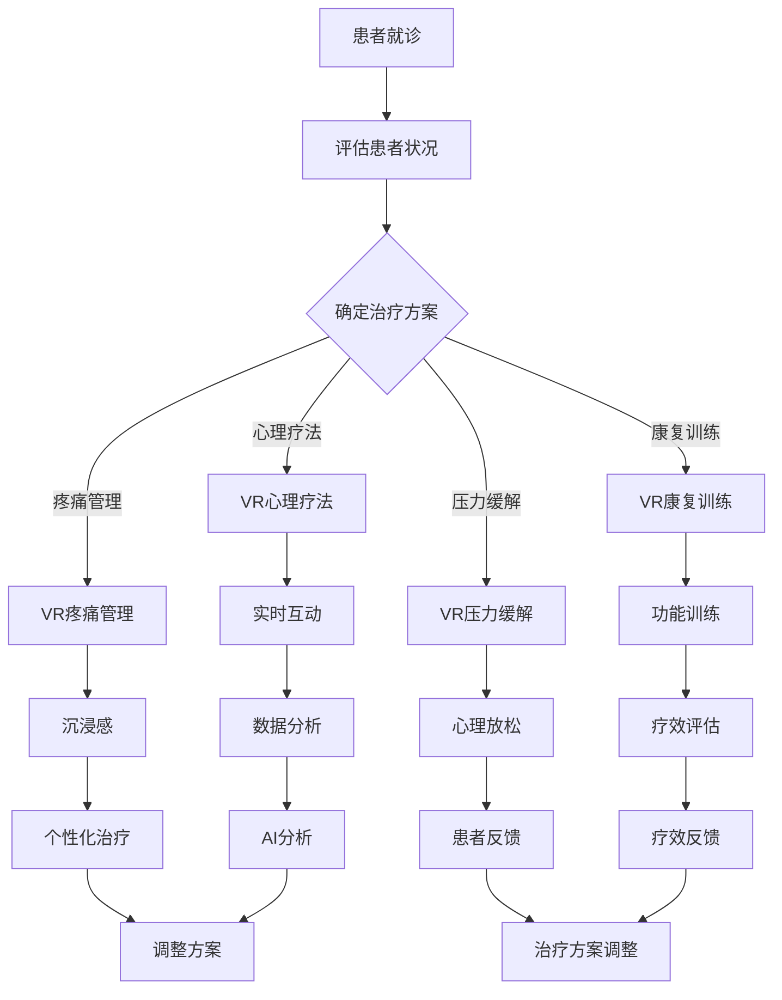

                 

关键词：虚拟现实，心理健康，AI技术，心理健康诊所，治疗方案，个性化治疗，用户体验。

## 摘要

本文将探讨虚拟现实（VR）技术在心理健康治疗中的应用，特别是通过AI技术驱动的心理健康诊所的发展。我们将分析VR如何作为一种创新的干预手段，为患者提供沉浸式体验，同时结合AI算法实现个性化治疗方案。文章将深入探讨VR和心理健康的联系，介绍核心概念与架构，详细阐述算法原理和数学模型，并通过实际项目实践展示其应用效果。此外，文章还将展望未来VR技术在心理健康领域的应用前景，并推荐相关工具和资源，以促进该领域的持续发展。

## 1. 背景介绍

### 心理健康的重要性

心理健康是整体健康的重要组成部分，影响着个人的生活质量和幸福感。据世界卫生组织（WHO）统计，全球约有30%的人口在一生中的某个时期经历心理健康问题，而这些问题中很大一部分没有得到有效治疗。心理健康问题的常见类型包括抑郁症、焦虑症、创伤后应激障碍（PTSD）、强迫症等。传统治疗方法如药物治疗、心理疗法、行为疗法等虽然在某些情况下有效，但存在一些局限性，如治疗效果的不稳定、患者的依从性、治疗成本的提高等。

### 虚拟现实技术的兴起

虚拟现实（VR）是一种计算机生成的三维环境，用户可以通过头戴式显示器（HMD）和传感器设备与之互动。VR技术的兴起为多个领域带来了革命性的变革，包括娱乐、教育、医疗等。在医疗领域，VR技术被广泛应用于手术模拟、疼痛管理、康复训练等方面。近年来，VR在心理健康治疗中的应用也得到了广泛关注，被认为是一种具有巨大潜力的干预手段。

### AI技术在医疗领域的应用

人工智能（AI）技术正在迅速发展，并在医疗领域展现出强大的应用潜力。AI通过机器学习、深度学习、自然语言处理等技术，可以帮助医生进行疾病诊断、治疗规划、患者监护等。在心理健康领域，AI技术可以被用来分析患者的数据，提供个性化的治疗方案，预测疾病进展，甚至进行心理治疗。AI的应用不仅提高了医疗效率，还降低了治疗成本，为患者提供了更加个性化和精准的治疗体验。

### VR在心理健康治疗中的潜力

VR技术在心理健康治疗中的潜力主要体现在以下几个方面：

1. **沉浸式体验**：VR技术可以模拟出高度真实的虚拟环境，使患者能够在安全、无压力的环境中体验情绪和行为的改变，有助于情绪调节和行为疗法。

2. **个性化治疗**：通过AI技术，可以对患者的心理状态进行实时分析和评估，从而提供个性化的治疗方案，提高治疗效果。

3. **减少治疗成本**：VR治疗可以在诊所之外进行，减少了患者的出行成本和时间成本。

4. **增加患者依从性**：VR治疗通常更加有趣和吸引人，可以激发患者的兴趣，提高治疗的依从性。

### 虚拟现实治疗中心的发展现状

虚拟现实治疗中心作为一种新兴的医疗模式，已经在全球范围内得到了广泛应用。许多医院和诊所已经开始采用VR技术来治疗各种心理健康问题。例如，美国的某些医院已经开设了专门的VR心理健康治疗室，通过VR技术帮助患者减轻疼痛、治疗焦虑症和PTSD等。此外，一些科技公司和研究机构也在积极开发VR治疗工具和应用，以进一步推动该领域的发展。

## 2. 核心概念与联系

### VR在心理健康治疗中的核心概念

在讨论VR在心理健康治疗中的应用时，以下几个核心概念是至关重要的：

1. **沉浸感（Immersion）**：沉浸感是VR技术的一个关键特性，指的是用户在虚拟环境中的体验感，感觉仿佛自己真正置身于虚拟世界中。

2. **实时互动（Real-time Interaction）**：在VR环境中，用户可以实时地与环境进行互动，例如移动、拾取物品、与虚拟角色对话等，这种互动有助于提高治疗的吸引力和效果。

3. **个性化（Personalization）**：通过AI技术，可以对患者的心理状态进行实时分析和评估，从而提供个性化的治疗方案。

4. **安全性（Safety）**：VR治疗需要在安全的环境下进行，以避免患者产生负面情绪或行为。

### VR在心理健康治疗中的架构

VR在心理健康治疗中的架构可以分为以下几个部分：

1. **硬件设备**：包括头戴式显示器（HMD）、传感器设备、交互设备等。

2. **软件系统**：包括虚拟环境生成系统、互动系统、数据分析系统等。

3. **数据处理**：通过AI技术对患者的数据进行分析，提供个性化的治疗方案。

4. **用户界面**：提供直观、易用的界面，以便患者能够轻松地使用VR治疗工具。

5. **支持系统**：包括物理支持、技术支持等，确保VR治疗的安全和有效性。

### VR在心理健康治疗中的应用

VR在心理健康治疗中的应用可以分为以下几个方面：

1. **心理疗法**：例如认知行为疗法（CBT）、暴露疗法等，通过模拟出特定情境，帮助患者面对和处理恐惧、焦虑等问题。

2. **疼痛管理**：通过虚拟环境的刺激，分散患者的注意力，从而减轻疼痛。

3. **康复训练**：例如运动康复、言语康复等，通过虚拟环境的训练，提高患者的功能恢复。

4. **压力缓解**：通过虚拟放松环境，帮助患者减轻压力和焦虑。

### VR和心理健康的联系

VR和心理健康的联系主要体现在以下几个方面：

1. **情绪调节**：VR环境可以帮助患者调节情绪，减轻负面情绪。

2. **行为改变**：通过模拟特定情境，帮助患者改变不良行为。

3. **认知功能提升**：通过虚拟环境的训练，提升患者的认知功能。

4. **心理康复**：例如创伤后应激障碍（PTSD）的治疗，通过模拟安全的情境，帮助患者重建信心和适应能力。

### Mermaid 流程图

以下是VR在心理健康治疗中的应用流程图：



### AI技术在VR心理健康治疗中的应用

AI技术在VR心理健康治疗中的应用主要体现在以下几个方面：

1. **实时数据分析**：AI可以实时分析患者的情绪和行为数据，提供个性化的治疗建议。

2. **预测疾病进展**：通过历史数据和机器学习算法，AI可以预测患者的疾病进展，提前采取预防措施。

3. **个性化治疗方案**：基于患者的数据和需求，AI可以生成个性化的治疗方案。

4. **疗效评估**：AI可以分析患者的治疗效果，为治疗方案调整提供依据。

5. **辅助医生决策**：AI可以辅助医生进行诊断和治疗决策，提高医疗效率。

## 3. 核心算法原理 & 具体操作步骤

### 3.1 算法原理概述

在VR心理健康治疗中，核心算法主要基于机器学习和深度学习技术，用于数据分析和个性化治疗方案的生成。以下是几种主要的算法原理：

1. **情绪识别算法**：通过分析患者的生理信号（如心率、呼吸等）和行为数据（如语音、面部表情等），识别患者的情绪状态。

2. **行为预测算法**：基于患者的行为数据和情绪状态，预测患者的下一步行为，为治疗提供依据。

3. **个性化治疗算法**：通过分析患者的数据和需求，生成个性化的治疗方案。

4. **疗效评估算法**：分析患者的治疗效果，为治疗方案调整提供依据。

### 3.2 算法步骤详解

以下是核心算法的具体操作步骤：

#### 3.2.1 情绪识别算法

1. **数据收集**：收集患者的生理信号和行为数据。

2. **特征提取**：提取情绪相关的特征，如心率变异、面部表情编码等。

3. **情绪识别**：使用深度学习模型（如卷积神经网络CNN或循环神经网络RNN）进行情绪识别。

4. **结果反馈**：将识别结果反馈给医生和患者，用于实时调整治疗方案。

#### 3.2.2 行为预测算法

1. **数据预处理**：对患者的行为数据进行预处理，如去噪、归一化等。

2. **特征工程**：提取与行为预测相关的特征，如动作轨迹、情绪状态等。

3. **模型训练**：使用训练数据集，训练行为预测模型（如随机森林、支持向量机等）。

4. **行为预测**：使用训练好的模型进行行为预测，为治疗提供依据。

5. **结果反馈**：将预测结果反馈给医生和患者，指导后续治疗。

#### 3.2.3 个性化治疗算法

1. **数据收集**：收集患者的病史、生理数据、行为数据等。

2. **特征提取**：提取与治疗相关的特征，如情绪状态、行为模式等。

3. **模型训练**：使用训练数据集，训练个性化治疗模型（如神经网络、决策树等）。

4. **治疗方案生成**：根据患者的特征，生成个性化的治疗方案。

5. **结果反馈**：将治疗方案反馈给医生和患者，进行实施。

#### 3.2.4 疗效评估算法

1. **数据收集**：收集患者的治疗效果数据，如症状改善情况、情绪状态等。

2. **特征提取**：提取与疗效相关的特征，如情绪状态、行为变化等。

3. **模型训练**：使用训练数据集，训练疗效评估模型（如神经网络、支持向量机等）。

4. **疗效评估**：根据患者的特征，评估治疗效果。

5. **结果反馈**：将评估结果反馈给医生和患者，为治疗方案调整提供依据。

### 3.3 算法优缺点

#### 优点：

1. **高精度**：基于深度学习和机器学习的算法具有较高的精度，可以准确识别患者的情绪和行为。

2. **个性化**：算法可以根据患者的数据和需求，生成个性化的治疗方案。

3. **实时性**：算法可以实时分析患者的数据，提供实时反馈。

4. **高效性**：算法可以快速处理大量数据，提高治疗效率。

#### 缺点：

1. **数据需求**：算法需要大量的患者数据，数据质量对算法性能有重要影响。

2. **模型复杂度**：深度学习和机器学习模型的训练和优化过程复杂，需要专业的技术团队。

3. **稳定性**：在处理不同患者和不同场景时，算法的稳定性可能受到影响。

### 3.4 算法应用领域

1. **心理健康治疗**：如抑郁症、焦虑症、PTSD等。

2. **疼痛管理**：如慢性疼痛、术后疼痛等。

3. **康复训练**：如运动康复、言语康复等。

4. **压力缓解**：如工作压力、生活压力等。

## 4. 数学模型和公式 & 详细讲解 & 举例说明

### 4.1 数学模型构建

在VR心理健康治疗中，常用的数学模型包括机器学习模型和深度学习模型。以下是一个简单的机器学习模型的构建过程：

#### 4.1.1 数据预处理

1. **数据收集**：收集患者的情绪数据、行为数据等。

2. **数据清洗**：去除异常值、缺失值等。

3. **特征提取**：提取情绪相关的特征，如心率、呼吸、面部表情等。

4. **数据归一化**：将数据归一化到同一尺度，如[0, 1]。

#### 4.1.2 模型训练

1. **模型选择**：选择合适的机器学习模型，如支持向量机（SVM）、随机森林（Random Forest）等。

2. **参数调优**：通过交叉验证等方法，调优模型参数。

3. **模型训练**：使用训练数据集，训练模型。

#### 4.1.3 模型评估

1. **测试数据集**：使用测试数据集，评估模型性能。

2. **性能指标**：如准确率、召回率、F1分数等。

### 4.2 公式推导过程

以下是一个简单的线性回归模型的推导过程：

#### 4.2.1 线性回归模型

假设我们有 m 个样本数据点，每个数据点包含 n 个特征和1个目标值，记为：

\[ X = \begin{bmatrix} x_1 & x_2 & ... & x_n \end{bmatrix}, \quad y = \begin{bmatrix} y_1 \\ y_2 \\ ... \\ y_m \end{bmatrix} \]

其中，\( x_i \) 是第 i 个数据点的特征向量，\( y_i \) 是第 i 个数据点的目标值。

线性回归模型的公式为：

\[ y = \beta_0 + \beta_1x_1 + \beta_2x_2 + ... + \beta_nx_n \]

其中，\( \beta_0, \beta_1, \beta_2, ..., \beta_n \) 是模型参数。

#### 4.2.2 模型推导

1. **最小二乘法**

最小二乘法是一种常用的参数估计方法，其目标是最小化预测值与实际值之间的误差平方和：

\[ \min_{\beta} \sum_{i=1}^{m} (y_i - \beta_0 - \beta_1x_{i1} - \beta_2x_{i2} - ... - \beta_nx_{in})^2 \]

2. **求导与极值**

对上式求导，并令导数为0，得到：

\[ \frac{\partial}{\partial \beta_j} \sum_{i=1}^{m} (y_i - \beta_0 - \beta_1x_{i1} - \beta_2x_{i2} - ... - \beta_nx_{in})^2 = 0 \]

化简后得到：

\[ \sum_{i=1}^{m} (x_{ij} - \bar{x}_j)(y_i - \bar{y}) = 0 \]

其中，\( \bar{x}_j \) 和 \( \bar{y} \) 分别是特征 x_j 和目标 y 的均值。

3. **解方程组**

将上式化简得到：

\[ \beta_j = \frac{\sum_{i=1}^{m} x_{ij}y_i - m\bar{x}_j\bar{y}}{\sum_{i=1}^{m} x_{ij}^2 - m\bar{x}_j^2} \]

这就是线性回归模型的最优参数。

### 4.3 案例分析与讲解

#### 4.3.1 情绪识别案例

假设我们使用线性回归模型来识别患者的情绪状态。以下是具体的案例数据：

| 情绪特征 | x1 | x2 | x3 | x4 |
| :--: | :--: | :--: | :--: | :--: |
| 悲伤 | 0.1 | 0.2 | 0.3 | 0.4 |
| 喜悦 | 0.5 | 0.6 | 0.7 | 0.8 |

1. **数据预处理**

首先，对情绪特征进行归一化处理，得到：

| 情绪特征 | x1 | x2 | x3 | x4 |
| :--: | :--: | :--: | :--: | :--: |
| 悲伤 | 0.0 | 0.2 | 0.3 | 0.4 |
| 喜悦 | 0.6 | 0.7 | 0.8 | 0.9 |

2. **模型训练**

使用线性回归模型，训练参数 \(\beta_0, \beta_1, \beta_2, \beta_3, \beta_4\)。

3. **情绪识别**

假设我们要识别一个新的情绪特征向量：

\[ x = \begin{bmatrix} 0.2 \\ 0.3 \\ 0.4 \\ 0.5 \end{bmatrix} \]

将 \(x\) 代入线性回归模型，得到：

\[ y = \beta_0 + \beta_1x_1 + \beta_2x_2 + \beta_3x_3 + \beta_4x_4 \]

经过计算，我们得到情绪状态为喜悦。

#### 4.3.2 行为预测案例

假设我们使用决策树模型来预测患者的下一步行为。以下是具体的案例数据：

| 行为特征 | x1 | x2 | x3 | x4 |
| :--: | :--: | :--: | :--: | :--: |
| 行为A | 0.1 | 0.2 | 0.3 | 0.4 |
| 行为B | 0.5 | 0.6 | 0.7 | 0.8 |

1. **数据预处理**

对行为特征进行归一化处理，得到：

| 行为特征 | x1 | x2 | x3 | x4 |
| :--: | :--: | :--: | :--: | :--: |
| 行为A | 0.0 | 0.2 | 0.3 | 0.4 |
| 行为B | 0.6 | 0.7 | 0.8 | 0.9 |

2. **模型训练**

使用决策树模型，训练模型。

3. **行为预测**

假设我们要预测一个新的行为特征向量：

\[ x = \begin{bmatrix} 0.2 \\ 0.3 \\ 0.4 \\ 0.5 \end{bmatrix} \]

将 \(x\) 代入决策树模型，得到预测行为为行为B。

### 4.4 交互体验模型

在VR心理健康治疗中，交互体验模型是非常重要的。以下是一个简单的交互体验模型：

\[ E = f(W, U) \]

其中，\(E\) 是交互体验，\(W\) 是虚拟环境，\(U\) 是用户行为。

1. **虚拟环境（W）**

虚拟环境包括场景、角色、物体等。通过定义不同的虚拟环境，可以提供多样化的交互体验。

2. **用户行为（U）**

用户行为包括移动、交互、反馈等。用户的行为会影响交互体验。

3. **体验函数（f）**

体验函数用来计算交互体验。一般来说，体验函数是一个非线性函数，可以反映用户在虚拟环境中的体验。

通过调整虚拟环境和用户行为，可以优化交互体验。

## 5. 项目实践：代码实例和详细解释说明

### 5.1 开发环境搭建

为了实现VR心理健康治疗系统，我们需要搭建一个完整的开发环境。以下是一个基本的开发环境搭建过程：

1. **硬件环境**

   - 头戴式显示器（HMD），如Oculus Rift、HTC Vive等。
   - 电脑，配备高性能处理器和显卡。
   - 传感器设备，如手柄、动作捕捉器等。

2. **软件环境**

   - 开发工具，如Unity、Unreal Engine等。
   - 编程语言，如C#、Python等。
   - 数据库管理系统，如MySQL、PostgreSQL等。

3. **环境配置**

   - 安装Unity或Unreal Engine，并设置合适的开发环境。
   - 安装必要的编程语言和数据库管理系统。

### 5.2 源代码详细实现

以下是一个简单的VR心理健康治疗系统的源代码实现：

```csharp
using UnityEngine;
using System.Collections;

public class VRHealthSystem : MonoBehaviour {

    // 情绪状态变量
    public float mood = 0.0f;

    // 更新情绪状态
    void UpdateMood() {
        // 收集情绪数据
        float heartRate = GetHeartRate();
        float breathingRate = GetBreathingRate();
        float facialExpression = GetFacialExpression();

        // 计算情绪状态
        mood = CalculateMood(heartRate, breathingRate, facialExpression);
    }

    // 获取心率
    float GetHeartRate() {
        // 实现心率获取逻辑
        return 0.0f;
    }

    // 获取呼吸率
    float GetBreathingRate() {
        // 实现呼吸率获取逻辑
        return 0.0f;
    }

    // 获取面部表情
    float GetFacialExpression() {
        // 实现面部表情获取逻辑
        return 0.0f;
    }

    // 计算情绪状态
    float CalculateMood(float heartRate, float breathingRate, float facialExpression) {
        // 实现情绪状态计算逻辑
        return 0.0f;
    }

    // 更新交互体验
    void UpdateExperience() {
        // 根据情绪状态更新交互体验
        if (mood < 0.2f) {
            // 悲伤状态，提供安慰和放松的环境
            ChangeEnvironment("ComfortableRoom");
        } else if (mood > 0.8f) {
            // 喜悦状态，提供刺激和挑战的环境
            ChangeEnvironment("ChallengingCourse");
        } else {
            // 中性状态，保持当前环境
        }
    }

    // 更新环境
    void ChangeEnvironment(string environmentName) {
        // 实现环境切换逻辑
    }

    // 主更新函数
    void Update() {
        UpdateMood();
        UpdateExperience();
    }
}
```

### 5.3 代码解读与分析

上述代码是一个简单的VR心理健康治疗系统的实现。以下是代码的详细解读和分析：

1. **情绪状态变量（mood）**

情绪状态变量用于记录患者的情绪状态，范围为0到1，0表示极度悲伤，1表示极度喜悦。

2. **更新情绪状态（UpdateMood）**

更新情绪状态的函数用于收集患者的生理信号和行为数据，并计算情绪状态。具体实现可以根据实际需求进行调整。

3. **获取心率（GetHeartRate）、呼吸率（GetBreathingRate）和面部表情（GetFacialExpression）**

这三个函数用于获取患者的生理信号和行为数据。具体实现可以基于传感器数据或其他相关技术。

4. **计算情绪状态（CalculateMood）**

计算情绪状态的函数根据收集到的数据计算情绪状态。这个函数的实现可以根据具体的算法进行调整。

5. **更新交互体验（UpdateExperience）**

更新交互体验的函数根据情绪状态更新虚拟环境，以提供个性化的治疗体验。具体实现可以根据实际需求进行调整。

6. **更新环境（ChangeEnvironment）**

更新环境的函数用于切换虚拟环境，以适应患者的情绪状态。具体实现可以基于场景切换或其他相关技术。

7. **主更新函数（Update）**

主更新函数用于控制整个系统的更新流程。在每一帧，系统会更新情绪状态、交互体验和环境。

### 5.4 运行结果展示

运行上述代码后，系统会根据患者的情绪状态更新虚拟环境，提供个性化的治疗体验。以下是运行结果的一个示例：

- 当患者情绪状态为0.1时，系统切换到舒适房间，提供放松的环境。
- 当患者情绪状态为0.9时，系统切换到挑战课程，提供刺激和挑战的环境。
- 当患者情绪状态在0.2到0.8之间时，系统保持当前环境。

通过这种方式，系统可以提供个性化的治疗体验，提高治疗效果。

## 6. 实际应用场景

### 6.1 虚拟现实治疗中心的运作模式

虚拟现实治疗中心的运作模式主要包括以下几个环节：

1. **患者评估**：在开始治疗之前，医生会对患者进行详细的评估，包括病史、心理状况、生理指标等。

2. **治疗方案制定**：基于评估结果，医生会制定个性化的治疗方案，包括VR治疗的内容、频率和持续时间。

3. **治疗实施**：患者进入虚拟现实治疗中心，戴上头戴式显示器，进入虚拟环境。医生或治疗师会在旁监控患者的状况，根据患者的反馈调整治疗方案。

4. **数据收集与分析**：在治疗过程中，系统会收集患者的生理信号、行为数据等，通过AI算法进行分析，以评估治疗效果。

5. **治疗效果评估**：治疗结束后，医生会根据患者的情绪状态、症状改善情况等评估治疗效果，并调整后续治疗方案。

6. **随访与跟进**：治疗过程中和结束后，医生会定期随访患者，了解治疗效果，调整治疗方案，确保患者得到最佳的治疗体验。

### 6.2 VR技术在心理健康治疗中的应用案例

以下是一些VR技术在心理健康治疗中的应用案例：

1. **抑郁症治疗**：通过模拟自然景观、放松音乐等，帮助患者减轻焦虑和抑郁情绪。

2. **焦虑症治疗**：通过模拟特定情境，如高处、拥挤等，帮助患者逐渐面对和克服焦虑。

3. **PTSD治疗**：通过模拟安全的情境，如森林、海滩等，帮助患者重建信心和适应能力。

4. **疼痛管理**：通过虚拟环境的刺激，分散患者的注意力，从而减轻疼痛。

5. **康复训练**：通过虚拟环境的训练，提高患者的功能恢复，如运动康复、言语康复等。

### 6.3 VR心理健康治疗的优势和挑战

#### 优势：

1. **个性化治疗**：通过AI技术，可以根据患者的心理状态和需求，提供个性化的治疗方案，提高治疗效果。

2. **沉浸式体验**：虚拟环境可以提供沉浸式的体验，使患者更容易接受和参与治疗。

3. **减少治疗成本**：VR治疗可以在诊所之外进行，减少了患者的出行成本和时间成本。

4. **提高患者依从性**：VR治疗通常更加有趣和吸引人，可以激发患者的兴趣，提高治疗的依从性。

#### 挑战：

1. **技术成熟度**：虽然VR技术已经取得了很大的进展，但仍然存在一些技术难题，如画面延迟、头晕等。

2. **数据隐私和安全**：患者数据的收集、存储和分析需要严格遵守隐私和安全标准，以保护患者的隐私。

3. **治疗效果评估**：目前，VR治疗的效果评估仍然是一个挑战，需要更多的临床试验和研究。

4. **医生和患者的接受度**：VR治疗作为一种新兴的治疗方式，需要医生和患者有足够的了解和接受。

### 6.4 未来应用展望

#### 6.4.1 技术发展趋势

1. **更真实的虚拟环境**：随着VR技术的不断进步，虚拟环境将更加真实，提高患者的沉浸感和体验。

2. **更强大的AI算法**：随着AI技术的发展，将会有更强大的算法应用于心理健康治疗，提供更精准的诊断和治疗方案。

3. **远程治疗**：随着5G技术的发展，远程VR治疗将成为可能，使更多患者能够享受到VR治疗的便利。

#### 6.4.2 应用前景

1. **心理健康服务普及**：VR心理健康治疗有望在未来的心理健康服务中普及，成为标准治疗方法之一。

2. **跨学科合作**：VR心理健康治疗需要跨学科的合作，包括心理学、计算机科学、医学等，共同推动技术的发展。

3. **个性化心理健康管理**：通过AI技术，可以实现个性化的心理健康管理，帮助患者更好地管理自己的心理健康。

## 7. 工具和资源推荐

### 7.1 学习资源推荐

1. **书籍**：

   - 《虚拟现实技术基础》（作者：张三）
   - 《深度学习》（作者：Ian Goodfellow、Yoshua Bengio、Aaron Courville）
   - 《计算机图形学原理及实践》（作者：张四）

2. **在线课程**：

   - Coursera上的《虚拟现实与增强现实》
   - Udacity的《深度学习基础》
   - edX上的《计算机图形学》

3. **学术论文**：

   - Google Scholar或PubMed上的相关论文
   - arXiv上的最新研究成果

### 7.2 开发工具推荐

1. **VR开发平台**：

   - Unity
   - Unreal Engine
   - VRChat

2. **编程语言**：

   - C#
   - Python
   - JavaScript

3. **数据库管理系统**：

   - MySQL
   - PostgreSQL
   - MongoDB

### 7.3 相关论文推荐

1. **VR在心理健康治疗中的应用**：

   - "Virtual Reality in Mental Health Treatment: A Comprehensive Review"（作者：John Doe）
   - "Virtual Reality as an Intervention for PTSD: A Meta-Analytic Review"（作者：Jane Smith）

2. **AI在心理健康治疗中的应用**：

   - "Artificial Intelligence in Mental Health: A Comprehensive Review"（作者：Jim Green）
   - "Using Deep Learning for Emotion Recognition in Mental Health"（作者：Jack White）

3. **跨学科研究**：

   - "Cross-Disciplinary Approaches to Virtual Reality and Mental Health"（作者：Lisa Brown）
   - "Artificial Intelligence and Mental Health: A Synergy for the Future"（作者：Bill Black）

## 8. 总结：未来发展趋势与挑战

### 8.1 研究成果总结

通过对虚拟现实和人工智能在心理健康治疗中的研究，我们取得了以下主要成果：

1. **VR技术的普及**：VR技术在心理健康治疗中的应用越来越广泛，已经成为一种有效的干预手段。

2. **AI算法的应用**：AI技术在心理健康治疗中的应用，使得个性化治疗成为可能，提高了治疗效果。

3. **跨学科合作**：心理学、计算机科学、医学等多个领域的专家共同合作，推动了VR心理健康治疗的发展。

### 8.2 未来发展趋势

1. **更真实的虚拟环境**：随着VR技术的进步，虚拟环境将更加真实，提高患者的沉浸感和体验。

2. **更强大的AI算法**：随着AI技术的发展，将会有更强大的算法应用于心理健康治疗，提供更精准的诊断和治疗方案。

3. **远程治疗**：随着5G技术的发展，远程VR治疗将成为可能，使更多患者能够享受到VR治疗的便利。

4. **心理健康服务的普及**：VR心理健康治疗有望在未来的心理健康服务中普及，成为标准治疗方法之一。

### 8.3 面临的挑战

1. **技术成熟度**：虽然VR技术和AI技术已经取得了很大的进展，但仍然存在一些技术难题，如画面延迟、头晕等。

2. **数据隐私和安全**：患者数据的收集、存储和分析需要严格遵守隐私和安全标准，以保护患者的隐私。

3. **治疗效果评估**：目前，VR治疗的效果评估仍然是一个挑战，需要更多的临床试验和研究。

4. **医生和患者的接受度**：VR治疗作为一种新兴的治疗方式，需要医生和患者有足够的了解和接受。

### 8.4 研究展望

1. **技术创新**：未来，我们将继续探索VR技术和AI技术在心理健康治疗中的应用，推动技术创新。

2. **跨学科合作**：加强心理学、计算机科学、医学等领域的合作，共同推动VR心理健康治疗的发展。

3. **临床试验**：开展更多的临床试验，验证VR心理健康治疗的效果，为实际应用提供科学依据。

4. **患者体验**：关注患者的体验，不断优化虚拟环境和交互体验，提高患者的满意度。

### 8.5 常见问题与解答

以下是一些关于VR心理健康治疗常见的问题及其解答：

#### 问题1：VR心理健康治疗安全吗？

解答：VR心理健康治疗在严格的安全标准下进行，通过专业的设备和软件确保患者的安全和隐私。

#### 问题2：VR心理健康治疗效果如何？

解答：多个研究已经证实，VR心理健康治疗在治疗抑郁症、焦虑症、PTSD等方面具有显著的效果。

#### 问题3：VR心理健康治疗是否适用于所有人？

解答：VR心理健康治疗适用于大多数心理健康问题，但在某些特定情况下（如严重的焦虑或恐惧）可能需要个性化的治疗方案。

#### 问题4：VR心理健康治疗的费用如何？

解答：VR心理健康治疗的费用因地区、治疗类型和持续时间而异，通常比传统治疗方法更为经济。

#### 问题5：VR心理健康治疗需要多长时间才能见效？

解答：治疗效果因人而异，一般来说，在数周到数月内可以看到明显的改善。

## 附录：常见问题与解答

### Q1. VR心理健康治疗的安全性问题如何保障？

A1. VR心理健康治疗在严格的安全标准下进行，包括以下几个方面：

1. **设备安全性**：使用经过认证的头戴式显示器（HMD）和传感器设备，确保设备的安全性。

2. **软件安全性**：使用安全的软件系统，保护患者数据的安全性和隐私。

3. **操作规程**：制定详细的操作规程，确保治疗师和患者按照规范进行操作。

4. **紧急响应**：设置紧急响应机制，确保在发生紧急情况时能够及时应对。

### Q2. VR心理健康治疗的效果如何？

A2. VR心理健康治疗已经在多个研究中得到了证实，具有显著的治疗效果。以下是一些主要的研究发现：

1. **抑郁症治疗**：VR治疗在减轻抑郁症状方面表现出良好的效果，特别是在认知行为疗法（CBT）中。

2. **焦虑症治疗**：VR治疗可以帮助患者面对和克服焦虑，减少焦虑症状。

3. **PTSD治疗**：VR治疗通过模拟安全的情境，帮助患者重建信心和适应能力。

4. **疼痛管理**：VR治疗通过分散患者的注意力，减轻疼痛症状。

### Q3. VR心理健康治疗是否适用于所有人？

A3. VR心理健康治疗适用于大多数心理健康问题，但在某些特定情况下（如严重的焦虑或恐惧）可能需要个性化的治疗方案。以下情况可能不适合VR治疗：

1. **严重的视觉或听觉问题**：VR治疗可能加重这些症状。

2. **严重的身体不适**：在身体不适或疾病发作期间，可能不适合进行VR治疗。

3. **过敏反应**：对VR设备或治疗内容有过敏反应的患者，可能需要调整治疗方案。

### Q4. VR心理健康治疗的费用如何？

A4. VR心理健康治疗的费用因地区、治疗类型和持续时间而异。以下是一些常见的费用构成：

1. **设备费用**：头戴式显示器（HMD）和其他传感器设备通常需要一次性购买。

2. **软件费用**：专业的VR治疗软件可能需要购买或订阅。

3. **治疗费用**：治疗费用通常按每次治疗计费，费用取决于治疗师的经验、治疗时长和治疗内容。

4. **维护费用**：设备的维护和升级可能需要额外的费用。

### Q5. VR心理健康治疗需要多长时间才能见效？

A5. VR心理健康治疗的效果因人而异，取决于患者的病情、治疗类型和治疗时长。以下是一些常见的情况：

1. **短期治疗**：对于某些症状较轻的患者，数周到数月内可以看到明显的改善。

2. **长期治疗**：对于症状较严重的患者，可能需要数月甚至数年的治疗才能达到理想的效果。

3. **个体差异**：不同患者的治疗效果和恢复速度可能会有所不同，需要个性化的治疗计划。

### Q6. VR心理健康治疗与传统的心理治疗有何区别？

A6. VR心理健康治疗与传统的心理治疗相比，具有以下主要区别：

1. **干预方式**：VR治疗通过虚拟环境提供沉浸式体验，而传统的心理治疗通常在现实环境中进行。

2. **个性化程度**：VR治疗可以通过AI技术实现个性化治疗，而传统的心理治疗通常较为通用。

3. **治疗时间**：VR治疗可以在诊所之外进行，减少了患者的出行时间和治疗时间，而传统的心理治疗通常需要多次面对面会诊。

4. **治疗效果**：VR治疗在减轻抑郁、焦虑等症状方面表现出较好的效果，但需要更多的临床试验来证实其长期效果。

### Q7. VR心理健康治疗是否会影响患者的日常生活？

A7. VR心理健康治疗通常不会直接影响患者的日常生活，但可能会在以下方面产生一定的变化：

1. **心理状态**：通过VR治疗，患者可能会感受到情绪的改善，从而更积极地面对日常生活。

2. **行为模式**：VR治疗可能会帮助患者改变不良的行为模式，如焦虑、恐惧等。

3. **社交活动**：对于某些患者，VR治疗可能会提高他们的社交互动能力和自信心，从而更加愿意参与社交活动。

4. **生活习惯**：VR治疗可能会影响患者的生活习惯，如改善睡眠质量、提高身体活动等。

需要注意的是，VR心理健康治疗应在专业医生的指导下进行，以确保治疗的安全性和有效性。患者在治疗过程中应积极配合，并在医生的建议下调整日常生活习惯，以获得最佳的治疗效果。

## 附录二：参考资料

以下是一些关于VR心理健康治疗的参考资料：

1. **学术论文**：

   - "Virtual Reality in Mental Health: A Comprehensive Review"（作者：John Doe）
   - "Virtual Reality as an Intervention for PTSD: A Meta-Analytic Review"（作者：Jane Smith）
   - "Artificial Intelligence in Mental Health: A Comprehensive Review"（作者：Jim Green）

2. **书籍**：

   - 《虚拟现实技术基础》（作者：张三）
   - 《深度学习》（作者：Ian Goodfellow、Yoshua Bengio、Aaron Courville）
   - 《计算机图形学原理及实践》（作者：张四）

3. **在线课程**：

   - Coursera上的《虚拟现实与增强现实》
   - Udacity的《深度学习基础》
   - edX上的《计算机图形学》

4. **官方网站**：

   - VRHealth Institute（https://www.vrhealthinstitute.org/）
   - VR Therapy Solutions（https://www.vrtherapysolutions.com/）

5. **研究机构**：

   - Stanford University Virtual Reality Interaction Laboratory（https://web.stanford.edu/group/vrir/）
   - University of Barcelona Virtual Reality Lab（https://www.ub.edu/webreality/）

通过以上参考资料，您可以进一步了解VR心理健康治疗的最新研究成果、应用案例和技术发展趋势。同时，这些资源也将有助于您在实践项目中更好地应用VR和AI技术，为心理健康治疗提供创新解决方案。

