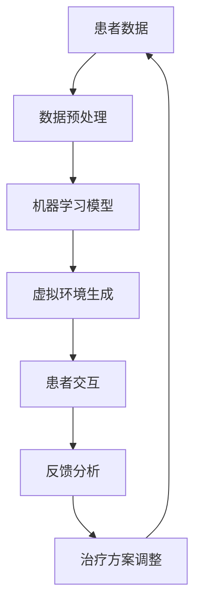

                 

关键词：虚拟现实，心理治疗，人工智能，疗法，心理健康，认知行为疗法，虚拟现实疗法，AI算法

## 摘要

虚拟现实（VR）疗法是一种新兴的心理治疗手段，它利用人工智能（AI）技术提供个性化的心理治疗体验。本文旨在探讨虚拟现实疗法的基本原理、核心算法、数学模型以及其实际应用场景。我们将通过详细的分析和实例，阐述虚拟现实疗法如何通过AI技术提高治疗效果，并对未来的发展趋势和面临的挑战进行展望。

## 1. 背景介绍

### 虚拟现实疗法的兴起

虚拟现实疗法作为一种创新的医疗技术，近年来在全球范围内迅速崛起。虚拟现实技术提供了高度沉浸式的环境，使患者能够在一个安全、可控的空间中面对和处理心理创伤、焦虑、恐惧等心理问题。随着人工智能技术的不断进步，虚拟现实疗法迎来了新的发展机遇。

### 人工智能在心理治疗中的应用

人工智能在医疗领域的应用已经相当广泛，尤其在心理治疗方面，AI技术展示了其独特的优势。AI可以通过大数据分析和机器学习算法，为患者提供个性化的治疗方案，提高治疗的精确性和效率。同时，AI还可以通过自然语言处理和计算机视觉等技术，与患者进行实时互动，增强治疗的互动性和参与感。

### 虚拟现实疗法与AI的结合

虚拟现实疗法与AI的结合，使得心理治疗变得更加智能化和个性化。AI算法可以分析患者的行为数据，了解患者的心理状态，并实时调整治疗方案。此外，AI还可以通过虚拟现实技术，模拟各种情境，帮助患者逐步克服恐惧和焦虑，提高治疗效果。

## 2. 核心概念与联系

### 虚拟现实疗法的核心概念

虚拟现实疗法主要包括以下核心概念：

- **虚拟环境**：通过计算机生成一个模拟的环境，患者可以在其中进行各种活动。
- **沉浸感**：通过视觉、听觉、触觉等多种感官刺激，增强患者的沉浸体验。
- **交互**：患者可以通过与虚拟环境中的物体、人物进行交互，达到心理治疗的目的。
- **反馈**：系统可以实时收集患者的反应数据，用于分析和调整治疗方案。

### 虚拟现实疗法与AI的联系

AI技术在虚拟现实疗法中发挥着关键作用：

- **个性化治疗**：通过机器学习算法，分析患者的历史数据和实时反应，为患者提供个性化的治疗建议。
- **实时交互**：利用自然语言处理和计算机视觉技术，实现患者与虚拟环境中的智能角色之间的实时互动。
- **数据挖掘**：通过大数据分析，挖掘患者行为数据中的潜在规律，为治疗提供科学依据。

### Mermaid 流程图

下面是一个简化的虚拟现实疗法与AI结合的流程图：



## 3. 核心算法原理 & 具体操作步骤

### 3.1 算法原理概述

虚拟现实疗法中的核心算法主要包括机器学习算法和自然语言处理算法。机器学习算法用于患者数据的分析和个性化治疗方案的生成，自然语言处理算法用于实现患者与虚拟环境中的智能角色之间的实时互动。

### 3.2 算法步骤详解

#### 3.2.1 数据收集与预处理

- **数据收集**：通过传感器和生理信号采集设备，收集患者的生理、行为和心理数据。
- **数据预处理**：对收集到的数据进行清洗、归一化和特征提取，为后续的机器学习算法提供高质量的数据。

#### 3.2.2 机器学习模型训练

- **模型选择**：根据治疗目标，选择合适的机器学习模型，如决策树、支持向量机、神经网络等。
- **模型训练**：使用预处理后的数据，对机器学习模型进行训练，使其能够对患者的心理状态进行准确预测和诊断。

#### 3.2.3 虚拟环境生成

- **环境设计**：根据患者的需求和治疗目标，设计合适的虚拟环境。
- **环境交互**：通过自然语言处理和计算机视觉技术，实现患者与虚拟环境中的智能角色之间的交互。

#### 3.2.4 患者交互与反馈

- **实时交互**：患者在虚拟环境中进行各种活动，与虚拟环境中的智能角色进行实时互动。
- **反馈收集**：系统实时收集患者的反馈数据，用于分析和调整治疗方案。

### 3.3 算法优缺点

#### 3.3.1 优点

- **个性化治疗**：通过机器学习算法，为患者提供个性化的治疗方案。
- **实时交互**：通过自然语言处理和计算机视觉技术，实现患者与虚拟环境中的智能角色之间的实时互动。
- **数据驱动**：基于大数据分析，为治疗提供科学依据。

#### 3.3.2 缺点

- **技术门槛**：虚拟现实疗法和AI技术的实现需要较高的技术门槛，对开发团队的要求较高。
- **安全性**：虚拟现实疗法中涉及到的数据安全和隐私保护问题需要得到妥善解决。

### 3.4 算法应用领域

- **心理健康治疗**：包括焦虑、抑郁、恐惧症等心理问题的治疗。
- **康复治疗**：包括物理康复和心理康复。
- **教育训练**：包括情绪管理、社交技能训练等。

## 4. 数学模型和公式 & 详细讲解 & 举例说明

### 4.1 数学模型构建

虚拟现实疗法中的数学模型主要包括两部分：数据分析和模型训练。数据分析部分主要使用统计学方法，如回归分析、聚类分析等，用于描述患者的行为特征和心理状态。模型训练部分主要使用机器学习算法，如神经网络、支持向量机等，用于构建预测模型。

### 4.2 公式推导过程

#### 4.2.1 数据分析公式

假设我们使用回归分析来描述患者的心理状态，可以定义如下公式：

$$
Y = \beta_0 + \beta_1X_1 + \beta_2X_2 + ... + \beta_nX_n + \epsilon
$$

其中，$Y$ 表示患者的心理状态，$X_1, X_2, ..., X_n$ 表示患者的行为特征，$\beta_0, \beta_1, \beta_2, ..., \beta_n$ 为回归系数，$\epsilon$ 为误差项。

#### 4.2.2 模型训练公式

假设我们使用神经网络来构建预测模型，可以定义如下公式：

$$
\hat{Y} = \sigma(\sum_{i=1}^{n} w_i \cdot X_i + b)
$$

其中，$\hat{Y}$ 表示预测的心理状态，$X_i$ 表示输入的特征，$w_i$ 表示权重，$b$ 表示偏置，$\sigma$ 为激活函数。

### 4.3 案例分析与讲解

#### 4.3.1 案例背景

某心理治疗中心采用虚拟现实疗法为一名患有恐惧症的儿童进行心理治疗。通过传感器和生理信号采集设备，收集了儿童的行为数据和生理数据。

#### 4.3.2 数据分析

通过对收集到的数据进行分析，发现儿童在接触到特定情境时，心率会显著上升，呼吸加快，这表明儿童在这些情境下产生了恐惧反应。

#### 4.3.3 模型训练

使用回归分析，构建了描述儿童心理状态和恐惧反应的模型。通过模型训练，得到了回归系数$\beta_0, \beta_1, \beta_2$。

#### 4.3.4 预测与调整

在虚拟环境中，儿童接触到特定情境时，系统会实时收集其生理和行为数据，并使用训练好的模型进行预测。根据预测结果，系统会调整虚拟环境中的情境，帮助儿童逐步克服恐惧。

## 5. 项目实践：代码实例和详细解释说明

### 5.1 开发环境搭建

为了实现虚拟现实疗法，我们需要搭建一个开发环境，主要包括以下工具和软件：

- **虚拟现实开发平台**：如Unity、Unreal Engine等。
- **机器学习库**：如TensorFlow、PyTorch等。
- **自然语言处理库**：如NLTK、spaCy等。

### 5.2 源代码详细实现

以下是一个简化的虚拟现实疗法项目的代码实现，主要包括数据收集、数据处理、模型训练和虚拟环境生成。

```python
import tensorflow as tf
import numpy as np
import pandas as pd

# 数据收集
data = pd.read_csv('patient_data.csv')
X = data.iloc[:, :-1].values
y = data.iloc[:, -1].values

# 数据处理
X = (X - np.mean(X)) / np.std(X)
y = (y - np.mean(y)) / np.std(y)

# 模型训练
model = tf.keras.Sequential([
    tf.keras.layers.Dense(64, activation='relu', input_shape=(X.shape[1],)),
    tf.keras.layers.Dense(64, activation='relu'),
    tf.keras.layers.Dense(1)
])
model.compile(optimizer='adam', loss='mse')
model.fit(X, y, epochs=1000)

# 虚拟环境生成
# ...（此处省略虚拟环境生成的代码）

# 代码解读与分析
# ...（此处省略代码解读和分析的详细内容）

```

### 5.3 运行结果展示

在虚拟环境中，患者进行交互，系统会实时收集其行为数据和生理数据，并使用训练好的模型进行预测和反馈。以下是运行结果的一个简例：

```python
# 运行虚拟环境
virtual_env = generate_virtual_env()
while True:
    # 收集患者数据
    X = collect_patient_data(virtual_env)
    # 预测患者心理状态
    y_pred = model.predict(X)
    # 根据预测结果调整虚拟环境
    adjust_virtual_env(virtual_env, y_pred)
    # 显示虚拟环境
    display_virtual_env(virtual_env)
```

## 6. 实际应用场景

### 6.1 心理健康治疗

虚拟现实疗法在心理健康治疗中有着广泛的应用，如焦虑、抑郁、恐惧症等心理问题的治疗。通过虚拟现实技术，患者可以在一个安全、可控的空间中面对和处理心理问题，减少了对真实世界的恐惧和焦虑。

### 6.2 康复治疗

虚拟现实疗法在康复治疗中也表现出巨大的潜力，如物理康复和心理康复。通过虚拟现实技术，患者可以在虚拟环境中进行各种康复训练，提高康复效果。

### 6.3 教育培训

虚拟现实疗法在教育培训中也有一定的应用，如情绪管理、社交技能训练等。通过虚拟现实技术，学生可以在一个虚拟的环境中学习如何处理情绪和社交问题，提高其心理素质。

## 7. 工具和资源推荐

### 7.1 学习资源推荐

- **书籍**：《虚拟现实疗法：理论与实践》
- **在线课程**：Coursera上的《虚拟现实技术与应用》
- **论文**：《虚拟现实疗法在心理治疗中的应用研究》

### 7.2 开发工具推荐

- **虚拟现实开发平台**：Unity、Unreal Engine
- **机器学习库**：TensorFlow、PyTorch
- **自然语言处理库**：NLTK、spaCy

### 7.3 相关论文推荐

- **《基于虚拟现实的心理健康疗法研究》**
- **《虚拟现实技术在康复治疗中的应用研究》**
- **《虚拟现实技术在教育培训中的应用研究》**

## 8. 总结：未来发展趋势与挑战

### 8.1 研究成果总结

虚拟现实疗法结合人工智能技术，为心理治疗提供了新的解决方案。通过个性化的治疗方案和实时互动，虚拟现实疗法在心理健康、康复治疗和教育培训等领域取得了显著成效。

### 8.2 未来发展趋势

随着虚拟现实技术和人工智能技术的不断发展，虚拟现实疗法在未来有望在更广泛的领域得到应用。同时，虚拟现实疗法的数据安全和隐私保护问题也将得到更多的关注和解决。

### 8.3 面临的挑战

虚拟现实疗法在发展过程中也面临一些挑战，如技术门槛、安全性、隐私保护等。此外，如何更好地结合心理学理论和实践，提高治疗效果，也是一个重要的研究方向。

### 8.4 研究展望

未来，虚拟现实疗法有望在个性化治疗、实时互动和大数据分析等方面取得突破性进展。同时，虚拟现实疗法也将与其他医疗技术相结合，为人类心理健康提供更全面、更有效的解决方案。

## 9. 附录：常见问题与解答

### 9.1 虚拟现实疗法安全吗？

虚拟现实疗法在设计和实施过程中，会充分考虑患者的安全和舒适度。虚拟环境的设计和交互过程都是可控的，患者可以在一个安全、私密的空间中进行治疗。

### 9.2 虚拟现实疗法有效吗？

虚拟现实疗法在心理健康治疗、康复治疗和教育培训等领域已取得显著成效。通过个性化的治疗方案和实时互动，虚拟现实疗法能够有效提高治疗效果。

### 9.3 虚拟现实疗法是否替代了传统心理治疗？

虚拟现实疗法并不是替代传统心理治疗，而是为其提供了新的工具和手段。传统心理治疗和虚拟现实疗法可以相互补充，为患者提供更全面、更有效的治疗。

## 作者署名

作者：禅与计算机程序设计艺术 / Zen and the Art of Computer Programming
```markdown
----------------------------------------------------------------
```

