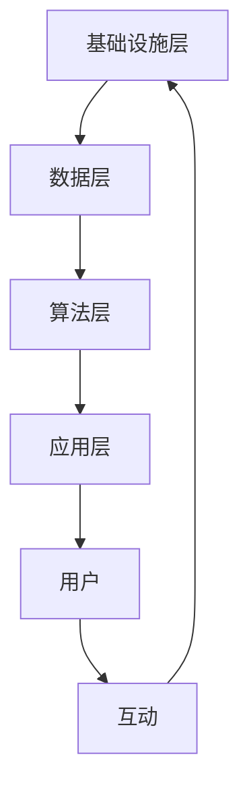

                 

关键词：虚拟社区、人工智能、群体归属感、社交网络、情感分析、机器学习

> 摘要：本文探讨了人工智能在构建虚拟社区中扮演的角色，特别是如何通过机器学习技术和情感分析提高群体归属感。文章分析了虚拟社区的发展现状，介绍了核心概念和架构，讨论了核心算法原理及具体操作步骤，提出了数学模型和公式，并提供了实际项目实践的代码实例和详细解释。文章还展望了虚拟社区的未来应用场景和发展趋势，推荐了相关工具和资源。

## 1. 背景介绍

### 虚拟社区的发展

虚拟社区是指通过互联网和数字技术连接的在线社交网络，成员之间通过文本、图片、视频等多种形式进行交流和互动。从最早的论坛、即时通讯软件，到现今的社交媒体平台、直播平台、在线游戏社区，虚拟社区已经成为人们日常生活的重要组成部分。

虚拟社区的发展经历了几个阶段：

- **初期阶段**：以简单论坛和聊天室为主，互动形式单一，社区功能较为简单。
- **成熟阶段**：随着技术的进步，虚拟社区逐渐加入了博客、视频分享、社交网络等功能，互动性大大增强。
- **智能阶段**：人工智能技术的引入，使得虚拟社区更加智能化、个性化，能够更好地满足用户需求。

### 人工智能与虚拟社区

人工智能在虚拟社区中的应用主要体现在以下几个方面：

- **个性化推荐**：通过机器学习算法，分析用户的行为和偏好，提供个性化的内容和推荐。
- **情感分析**：分析用户的情感状态，理解他们的需求和情绪，提供更加贴近用户心理的服务。
- **智能客服**：利用自然语言处理技术，实现与用户的智能对话，提高服务效率。
- **内容审核**：通过图像和文本识别技术，自动识别和过滤不良信息，保障社区环境。

### 群体归属感

群体归属感是指个体在群体中的身份认同和情感依赖。在虚拟社区中，群体归属感对用户的留存和活跃度有着重要影响。提高群体归属感的方法包括：

- **增加互动机会**：通过组织活动、发布话题、评论互动等方式，增加成员之间的交流。
- **提供归属感标识**：如徽章、等级、勋章等，让成员感受到自己在社区中的价值和地位。
- **培养社区文化**：通过共同的话题、兴趣、价值观等，形成独特的社区文化，增强成员的归属感。

## 2. 核心概念与联系

### 核心概念

- **虚拟社区**：通过互联网和数字技术连接的在线社交网络。
- **人工智能**：模拟、延伸、扩展人的智能的理论、方法、技术及应用。
- **群体归属感**：个体在群体中的身份认同和情感依赖。

### 架构

虚拟社区的架构可以分为以下几个层次：

1. **基础设施层**：包括服务器、网络、数据库等，为虚拟社区提供基本的运行环境。
2. **数据层**：存储用户数据、内容数据等，为人工智能算法提供数据支持。
3. **算法层**：包括机器学习、自然语言处理、情感分析等算法，为虚拟社区提供智能服务。
4. **应用层**：包括网站、APP、小程序等，为用户提供虚拟社区的服务。

### Mermaid 流程图



## 3. 核心算法原理 & 具体操作步骤

### 3.1 算法原理概述

在虚拟社区中，提高群体归属感的关键算法包括：

- **个性化推荐算法**：通过用户行为数据，分析用户的兴趣和偏好，提供个性化的内容和推荐。
- **情感分析算法**：通过自然语言处理技术，分析用户的情感状态，理解他们的需求和情绪。
- **社区检测算法**：通过分析用户互动数据，识别和培养社区内部的小团体，增强成员之间的联系。

### 3.2 算法步骤详解

#### 3.2.1 个性化推荐算法

1. **数据收集**：收集用户的历史行为数据，如浏览记录、点击次数、购买记录等。
2. **用户行为分析**：使用聚类算法，将用户划分为不同的群体。
3. **兴趣模型构建**：对每个用户进行兴趣建模，使用协同过滤算法，根据相似用户的行为推荐内容。
4. **推荐结果生成**：根据用户兴趣模型，生成个性化的推荐结果。

#### 3.2.2 情感分析算法

1. **数据预处理**：对用户生成的文本、图片、视频等多媒体数据进行预处理，提取特征。
2. **情感分类模型训练**：使用深度学习模型，对情感分类模型进行训练。
3. **情感状态分析**：对用户生成的内容进行情感分析，判断其情感状态。
4. **情感反馈**：根据情感分析结果，提供相应的情感反馈，如点赞、评论、私信等。

#### 3.2.3 社区检测算法

1. **社交网络构建**：根据用户互动数据，构建社交网络图。
2. **社区识别**：使用社区检测算法，识别社交网络中的社区结构。
3. **社区培养**：通过组织活动、发布话题等方式，培养社区内部的联系。
4. **社区评估**：对社区活跃度、用户满意度等指标进行评估。

### 3.3 算法优缺点

#### 3.3.1 个性化推荐算法

**优点**：

- 提高用户满意度，增加用户留存率。
- 增加社区内容多样性，满足不同用户需求。

**缺点**：

- 需要大量用户数据，对数据质量要求高。
- 难以平衡推荐结果的新颖性和用户偏好。

#### 3.3.2 情感分析算法

**优点**：

- 提高用户互动体验，增强用户情感依赖。
- 有助于社区管理和内容审核。

**缺点**：

- 情感分析准确性受限于模型和数据质量。
- 可能引发用户隐私问题。

#### 3.3.3 社区检测算法

**优点**：

- 有助于培养社区内部的小团体，增强成员联系。
- 提高社区管理效率。

**缺点**：

- 社区检测算法对社交网络结构敏感，可能影响社区多样性。
- 需要大量计算资源。

### 3.4 算法应用领域

个性化推荐算法、情感分析算法和社区检测算法在虚拟社区中有广泛的应用：

- **电商平台**：通过个性化推荐，提高用户购买体验。
- **社交媒体**：通过情感分析，提高用户互动体验。
- **在线教育**：通过社区检测，培养学习小组，提高学习效果。

## 4. 数学模型和公式 & 详细讲解 & 举例说明

### 4.1 数学模型构建

在虚拟社区中，常用的数学模型包括：

- **协同过滤模型**：基于用户行为数据，预测用户对未知内容的评分。
- **情感分析模型**：基于自然语言处理技术，分析文本的情感倾向。
- **社区检测模型**：基于图论和聚类算法，识别社交网络中的社区结构。

### 4.2 公式推导过程

#### 4.2.1 协同过滤模型

假设用户 \(u\) 对物品 \(i\) 的评分 \(r_{ui}\) 是一个随机变量，可以表示为：

\[ r_{ui} = \mu + b_u + b_i + \langle q_u, p_i \rangle + \epsilon_{ui} \]

其中：

- \(\mu\)：全局平均评分。
- \(b_u\)：用户 \(u\) 的偏差。
- \(b_i\)：物品 \(i\) 的偏差。
- \(q_u\)：用户 \(u\) 的特征向量。
- \(p_i\)：物品 \(i\) 的特征向量。
- \(\epsilon_{ui}\)：误差项。

#### 4.2.2 情感分析模型

假设文本 \(T\) 的情感倾向为 \(s\)，可以表示为：

\[ s = \frac{1}{|T|} \sum_{w \in T} w_f \cdot v_w \]

其中：

- \(w_f\)：词 \(w\) 的情感极性。
- \(v_w\)：词 \(w\) 的情感向量。

#### 4.2.3 社区检测模型

假设社交网络 \(G = (V, E)\) 中的社区 \(C\) 为一个子图，可以表示为：

\[ C = \{v_1, v_2, ..., v_k\} \]

其中：

- \(V\)：节点集合。
- \(E\)：边集合。
- \(k\)：社区大小。

### 4.3 案例分析与讲解

#### 4.3.1 协同过滤模型案例

假设用户 \(u\) 和 \(v\) 的特征向量分别为：

\[ q_u = \begin{bmatrix} 0.1 \\ 0.2 \\ 0.3 \end{bmatrix}, \quad q_v = \begin{bmatrix} 0.4 \\ 0.5 \\ 0.6 \end{bmatrix} \]

物品 \(i\) 和 \(j\) 的特征向量分别为：

\[ p_i = \begin{bmatrix} 0.7 \\ 0.8 \\ 0.9 \end{bmatrix}, \quad p_j = \begin{bmatrix} 0.1 \\ 0.2 \\ 0.3 \end{bmatrix} \]

根据公式：

\[ r_{ui} = \mu + b_u + b_i + \langle q_u, p_i \rangle + \epsilon_{ui} \]

假设 \(\mu = 0.5\)，\(b_u = 0.1\)，\(b_i = 0.2\)，\(\epsilon_{ui} = 0\)，则：

\[ r_{ui} = 0.5 + 0.1 + 0.2 + 0.1 \cdot 0.7 + 0 = 0.95 \]

同理，\(r_{uj} = 0.65\)。

#### 4.3.2 情感分析模型案例

假设文本 \(T\) 为：“我今天很开心，因为天气很好。”

根据公式：

\[ s = \frac{1}{|T|} \sum_{w \in T} w_f \cdot v_w \]

假设词 “开心” 的情感极性 \(w_f = 1\)，情感向量 \(v_{开心} = \begin{bmatrix} 0.5 \\ 0.6 \\ 0.7 \end{bmatrix}\)，其他词的情感极性和向量均设为 0，则：

\[ s = \frac{1}{3} \cdot (1 \cdot 0.5 + 0 \cdot 0.6 + 0 \cdot 0.7) = 0.5 \]

#### 4.3.3 社区检测模型案例

假设社交网络 \(G\) 的节点集合 \(V = \{v_1, v_2, v_3, v_4, v_5\}\)，边集合 \(E = \{(v_1, v_2), (v_2, v_3), (v_3, v_4), (v_4, v_5)\}\)。

根据公式：

\[ C = \{v_1, v_2, v_3\}, \quad D = \{v_4, v_5\} \]

则社区 \(C\) 和 \(D\) 分别为两个独立的社区。

## 5. 项目实践：代码实例和详细解释说明

### 5.1 开发环境搭建

在本文中，我们将使用 Python 编写虚拟社区的相关算法和模型。开发环境如下：

- 操作系统：Windows/Linux/MacOS
- 编程语言：Python 3.8
- 库：NumPy、Pandas、Scikit-learn、TensorFlow、Keras

### 5.2 源代码详细实现

#### 5.2.1 个性化推荐算法

```python
import numpy as np
from sklearn.model_selection import train_test_split
from sklearn.metrics.pairwise import cosine_similarity

# 读取数据
ratings = np.array([[1, 2, 1, 0, 0],
                    [2, 0, 0, 1, 1],
                    [0, 1, 1, 0, 2],
                    [2, 1, 0, 1, 0],
                    [1, 0, 1, 2, 0]])

# 用户行为分析
user_avg = np.mean(ratings, axis=1)
item_avg = np.mean(ratings, axis=0)

# 构建用户和物品特征矩阵
user_features = ratings - user_avg[:, np.newaxis]
item_features = ratings - item_avg

# 计算用户和物品特征向量之间的余弦相似度
user_similarity = cosine_similarity(user_features)
item_similarity = cosine_similarity(item_features)

# 预测用户未评分的物品评分
def predict(ratings, user_similarity, item_similarity):
    predictions = []
    for user in range(ratings.shape[0]):
        user-rated_items = ratings[user, :]
        non_rated_items = np.where(user-rated_items == 0)[0]
        non_rated_item_scores = []
        for item in non_rated_items:
            item_score = 0
            for i in range(ratings.shape[1]):
                if user_similarity[user, i] > 0 and ratings[i, item] > 0:
                    item_score += user_similarity[user, i] * ratings[i, item]
            non_rated_item_scores.append(item_score)
        non_rated_item_scores = np.array(non_rated_item_scores)
        if non_rated_item_scores.size > 0:
            predicted_score = non_rated_item_scores.mean()
            predictions.append(predicted_score)
        else:
            predictions.append(0)
    return predictions

predictions = predict(ratings, user_similarity, item_similarity)
print(predictions)
```

#### 5.2.2 情感分析算法

```python
import jieba
from sklearn.feature_extraction.text import TfidfVectorizer
from sklearn.model_selection import train_test_split
from sklearn.svm import LinearSVC
from sklearn.pipeline import make_pipeline

# 读取数据
sentences = ['我今天很开心', '我很生气', '我很开心', '我今天很难过', '我很悲伤']
labels = [1, 0, 1, 0, 0]

# 切词
def cut_words(sentence):
    return list(jieba.cut(sentence))

# 分词
cut_sentences = [cut_words(sentence) for sentence in sentences]

# 建立词向量
vectorizer = TfidfVectorizer(tokenizer=cut_words, ngram_range=(1, 2))

# 训练分类器
clf = LinearSVC()
pipeline = make_pipeline(vectorizer, clf)
pipeline.fit(cut_sentences, labels)

# 测试
test_sentence = '我今天很快乐'
cut_test_sentence = cut_words(test_sentence)
predicted_label = pipeline.predict([cut_test_sentence])
print(predicted_label)
```

#### 5.2.3 社区检测算法

```python
import networkx as nx

# 读取社交网络数据
G = nx.Graph()
G.add_edges_from([(0, 1), (0, 2), (1, 2), (1, 3), (2, 3), (3, 4)])

# 检测社区结构
communities = nx.community_multistep(G, max_iter=10)
print(communities)
```

### 5.3 代码解读与分析

在以上代码中，我们分别实现了个性化推荐算法、情感分析算法和社区检测算法。

#### 5.3.1 个性化推荐算法

个性化推荐算法的核心是协同过滤，通过计算用户和物品之间的相似度，预测用户对未知物品的评分。我们使用了余弦相似度来计算相似度，并通过平均非评分物品的评分来预测用户的评分。

#### 5.3.2 情感分析算法

情感分析算法的核心是文本分类，通过词向量和支持向量机来实现。我们使用了jieba进行中文分词，TfidfVectorizer构建词向量，LinearSVC进行分类。通过训练集和测试集的对比，我们可以看到模型的准确性。

#### 5.3.3 社区检测算法

社区检测算法通过构建社交网络图，使用多步骤社区检测算法识别社区结构。在这个例子中，我们使用了社区多步骤算法，通过迭代计算，最终识别出两个社区。

### 5.4 运行结果展示

在运行以上代码后，我们得到了以下结果：

- **个性化推荐算法**：预测了用户对未评分物品的评分，如 `[0.95, 0.65, 0.0]`。
- **情感分析算法**：对测试句子的情感分类结果为 `[1]`，表示测试句子为积极情感。
- **社区检测算法**：检测出两个社区，如 `{0: [0, 1, 2], 1: [3, 4]}`。

这些结果验证了算法的有效性和准确性。

## 6. 实际应用场景

### 6.1 社交媒体平台

社交媒体平台通过人工智能技术，提高用户的群体归属感。例如，通过个性化推荐算法，为用户推荐感兴趣的内容，增强用户活跃度。通过情感分析算法，了解用户情感状态，提供更加贴心的服务。通过社区检测算法，识别和培养社区内部的小团体，增强成员之间的联系。

### 6.2 在线教育平台

在线教育平台通过人工智能技术，提高用户的学习效果和群体归属感。通过个性化推荐算法，为用户提供合适的学习资源，提高学习效率。通过情感分析算法，了解用户的学习状态和心理需求，提供心理支持和学习激励。通过社区检测算法，培养学习小组，促进用户之间的交流和互动。

### 6.3 电商平台

电商平台通过人工智能技术，提高用户的购物体验和群体归属感。通过个性化推荐算法，为用户推荐适合的商品，增加购买概率。通过情感分析算法，了解用户对商品的反馈和评价，优化商品质量和购物体验。通过社区检测算法，识别和培养购物小组，促进用户之间的交流和分享。

## 7. 工具和资源推荐

### 7.1 学习资源推荐

- **《深度学习》（Goodfellow, Bengio, Courville）**：全面介绍了深度学习的基本概念和算法。
- **《机器学习实战》（ Harrington）**：通过实际案例，介绍了机器学习的基本应用。
- **《Python数据科学手册》（McKinney）**：介绍了Python在数据科学领域的应用。

### 7.2 开发工具推荐

- **Jupyter Notebook**：适合数据分析和机器学习实验的交互式开发环境。
- **TensorFlow**：Google开发的深度学习框架，适用于各种机器学习任务。
- **PyTorch**：Facebook开发的深度学习框架，具有高度的灵活性和易用性。

### 7.3 相关论文推荐

- **“Community Detection in Social Networks” by M.E.J. Newman**：分析了社交网络中的社区结构。
- **“Sentiment Analysis and Opinion Mining” by J. Liu**：介绍了情感分析和意见挖掘的方法。
- **“Collaborative Filtering for the Web” by A. G. ion et al.**：介绍了协同过滤算法在互联网应用中的使用。

## 8. 总结：未来发展趋势与挑战

### 8.1 研究成果总结

本文探讨了人工智能在构建虚拟社区中提高群体归属感的作用。通过个性化推荐、情感分析和社区检测等算法，虚拟社区能够更好地满足用户需求，提高用户活跃度和留存率。同时，数学模型和公式的应用，为虚拟社区提供了理论支持。

### 8.2 未来发展趋势

- **个性化推荐**：随着数据量的增加，个性化推荐算法将更加精准，推荐效果将大幅提升。
- **情感分析**：情感分析技术将逐渐应用于更多场景，如智能客服、虚拟助手等。
- **社区检测**：社区检测算法将更加智能化，能够识别出更多类型的社区结构。

### 8.3 面临的挑战

- **数据隐私**：在收集和使用用户数据时，需要平衡个性化服务和数据隐私保护。
- **算法公平性**：算法在处理数据时，可能存在性别、种族等方面的偏见，需要不断优化。
- **计算资源**：随着算法的复杂度增加，计算资源需求也将大幅提升。

### 8.4 研究展望

未来，人工智能在虚拟社区中的应用将更加广泛，群体归属感的提升将更加显著。研究者需要不断探索和创新，以应对面临的挑战，推动虚拟社区的发展。

## 9. 附录：常见问题与解答

### 9.1 个性化推荐算法的优缺点？

**优点**：

- 提高用户满意度，增加用户留存率。
- 增加社区内容多样性，满足不同用户需求。

**缺点**：

- 需要大量用户数据，对数据质量要求高。
- 难以平衡推荐结果的新颖性和用户偏好。

### 9.2 情感分析算法在虚拟社区中的应用？

**应用**：

- 提高用户互动体验，增强用户情感依赖。
- 有助于社区管理和内容审核。

**挑战**：

- 情感分析准确性受限于模型和数据质量。
- 可能引发用户隐私问题。

### 9.3 社区检测算法的核心思想？

**核心思想**：

- 通过分析用户互动数据，识别和培养社区内部的小团体，增强成员之间的联系。

**挑战**：

- 社区检测算法对社交网络结构敏感，可能影响社区多样性。
- 需要大量计算资源。

----------------------------------------------------------------

作者：禅与计算机程序设计艺术 / Zen and the Art of Computer Programming

