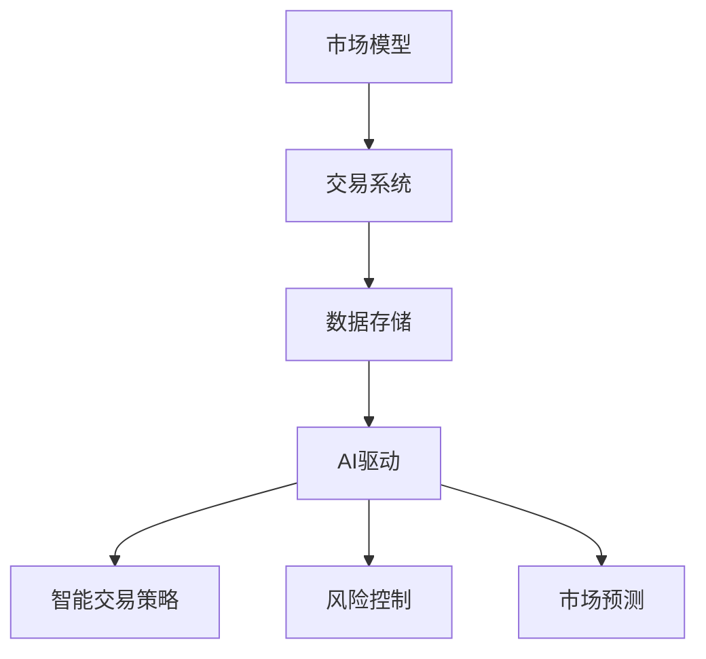

                 

关键词：虚拟经济模拟、AI驱动、价值交换、实验设计、算法、模型、实践

> 摘要：本文探讨了虚拟经济模拟器编程的核心概念、算法原理及其在新型价值交换实验设计中的应用。通过阐述数学模型、具体操作步骤及项目实践，深入解析了该领域的技术挑战和发展前景。

## 1. 背景介绍

在数字化时代，虚拟经济逐渐成为现代经济的重要组成部分。虚拟经济模拟器作为一种工具，不仅可以模拟真实市场环境，还能为研究者提供实验平台，探索新兴的经济模型和算法。而随着人工智能（AI）技术的发展，虚拟经济模拟器的能力得到了进一步提升。AI不仅可以优化模拟器的运行效率，还能在价值交换实验设计中提供智能化支持。

本文旨在探讨虚拟经济模拟器编程中的核心技术和应用，尤其是AI驱动的价值交换实验设计。通过深入研究算法原理、数学模型、项目实践等，旨在为从事虚拟经济研究的技术人员和研究者提供有价值的参考。

## 2. 核心概念与联系

### 2.1 虚拟经济模拟器

虚拟经济模拟器是一种通过计算机模拟真实市场交易活动的系统。它通常包括以下组件：

- **市场模型**：定义市场的规则和运行机制，如供求关系、价格波动等。
- **交易系统**：实现买卖双方的交易行为，包括订单匹配、交易清算等。
- **数据存储**：记录市场交易数据，用于分析和模型验证。

### 2.2 AI驱动

在虚拟经济模拟器中引入AI，可以使其具备自我学习、优化和决策能力。AI驱动的虚拟经济模拟器通常包括以下功能：

- **智能交易策略**：根据历史数据和实时信息，自动调整交易策略。
- **风险控制**：通过机器学习算法，识别潜在风险并采取相应措施。
- **市场预测**：利用深度学习模型，预测市场趋势和价格变化。

### 2.3 价值交换实验设计

价值交换实验设计是虚拟经济模拟器的重要应用领域。它通过构建不同的市场场景，探索新型价值交换模式。关键概念包括：

- **实验场景**：设计不同的市场环境，如供需平衡、市场失衡等。
- **参与者**：模拟不同类型的参与者，如理性人、投机者、市场操纵者等。
- **价值度量**：通过实验，度量不同市场参与者的价值贡献。

### 2.4 Mermaid 流程图

下面是一个简化的虚拟经济模拟器架构的 Mermaid 流程图：



## 3. 核心算法原理 & 具体操作步骤

### 3.1 算法原理概述

虚拟经济模拟器的核心算法包括市场模型算法、交易系统算法和AI驱动算法。以下分别介绍这些算法的原理：

- **市场模型算法**：基于供需关系和市场规则，模拟市场价格和交易量的变化。
- **交易系统算法**：实现订单匹配、交易清算等交易行为，确保市场的有序运行。
- **AI驱动算法**：利用机器学习和深度学习模型，实现智能交易策略、风险控制和市场预测。

### 3.2 算法步骤详解

#### 3.2.1 市场模型算法

1. **初始化**：设置初始市场参数，如价格、交易量等。
2. **模拟运行**：根据市场规则，更新市场价格和交易量。
3. **数据记录**：记录每次价格和交易量的变化，用于后续分析和验证。

#### 3.2.2 交易系统算法

1. **订单生成**：根据市场模型，生成买卖双方的订单。
2. **订单匹配**：根据订单的价格和数量，匹配交易对手。
3. **交易清算**：完成交易后，进行资金和商品转移。

#### 3.2.3 AI驱动算法

1. **数据采集**：收集历史市场数据和实时交易数据。
2. **模型训练**：利用历史数据，训练智能交易策略、风险控制和市场预测模型。
3. **模型应用**：根据实时数据，调整交易策略和风险控制措施。

### 3.3 算法优缺点

#### 3.3.1 优点

- **高效性**：AI驱动算法能够快速处理大量市场数据，提高模拟效率。
- **智能化**：智能交易策略和风险控制能够提高市场的稳定性和交易成功率。
- **适应性**：AI驱动算法能够根据市场变化，动态调整策略，适应不同市场环境。

#### 3.3.2 缺点

- **计算成本**：AI驱动算法需要大量的计算资源，可能会增加模拟器的运行成本。
- **数据依赖**：AI驱动算法的性能依赖于数据的质量和数量，数据不足或质量差可能导致算法失效。
- **模型风险**：模型训练过程中可能会引入偏差，导致预测不准确。

### 3.4 算法应用领域

虚拟经济模拟器和AI驱动算法在多个领域具有广泛应用：

- **金融市场研究**：用于模拟股票、期货、外汇等金融市场的运行机制。
- **货币政策模拟**：用于研究不同货币政策对经济的影响。
- **风险评估**：用于识别和预测市场风险，为金融机构提供风险管理工具。
- **市场预测**：用于预测市场趋势和价格变化，为投资者提供参考。

## 4. 数学模型和公式 & 详细讲解 & 举例说明

### 4.1 数学模型构建

在虚拟经济模拟中，常用的数学模型包括供求模型、价格波动模型和交易模型。以下是一个简化的供求模型：

$$
Q_d = Q_{d0} - b(P - P_0)
$$

$$
Q_s = Q_{s0} + a(P - P_0)
$$

其中，$Q_d$ 和 $Q_s$ 分别表示需求量和供给量，$P$ 表示市场价格，$a$ 和 $b$ 为参数。

### 4.2 公式推导过程

供求模型的推导基于以下假设：

- **线性需求**：需求量与价格呈线性关系。
- **线性供给**：供给量与价格也呈线性关系。

这些假设使得供求模型简单易用，但实际市场可能更为复杂。

### 4.3 案例分析与讲解

以下是一个具体的案例：

假设初始价格为1000，需求量为10000，供给量为5000。根据供求模型，可以计算不同价格下的需求量和供给量。

| 价格 (P) | 需求量 (Q_d) | 供给量 (Q_s) |
| :------: | :----------: | :----------: |
|  1000    |     10000    |     5000     |
|  1100    |      9000    |      6000     |
|  1200    |      8000    |      7000     |
|  1300    |      7000    |      8000     |
|  1400    |      6000    |      9000     |

通过这个案例，我们可以看到价格对供需量的影响。

## 5. 项目实践：代码实例和详细解释说明

### 5.1 开发环境搭建

为了实现虚拟经济模拟器，我们需要搭建一个开发环境。以下是一个简单的环境搭建步骤：

1. **安装Python**：Python是一种广泛应用于数据科学和机器学习的编程语言。
2. **安装Jupyter Notebook**：Jupyter Notebook是一个交互式的开发环境，方便编写和运行代码。
3. **安装相关库**：如 NumPy、Pandas、Matplotlib 等，用于数据处理和可视化。

### 5.2 源代码详细实现

以下是虚拟经济模拟器的核心代码：

```python
import numpy as np
import matplotlib.pyplot as plt

# 初始化参数
P0 = 1000  # 初始价格
Qd0 = 10000  # 初始需求量
Qs0 = 5000  # 初始供给量
a = 0.1  # 供给弹性
b = 0.05  # 需求弹性

# 供求模型函数
def supply_demand(P):
    Qd = Qd0 - b * (P - P0)
    Qs = Qs0 + a * (P - P0)
    return Qd, Qs

# 模拟运行
prices = np.linspace(800, 1200, 100)
Qds, Qss = [supply_demand(P) for P in prices]

# 数据可视化
plt.plot(prices, Qds, label='Demand')
plt.plot(prices, Qss, label='Supply')
plt.xlabel('Price')
plt.ylabel('Quantity')
plt.legend()
plt.show()
```

### 5.3 代码解读与分析

上述代码首先初始化参数，然后定义了供求模型函数，通过迭代计算不同价格下的需求和供给量。最后，使用 Matplotlib 进行数据可视化。

### 5.4 运行结果展示

运行代码后，我们可以得到不同价格下的需求和供给量，并通过图表展示。

## 6. 实际应用场景

虚拟经济模拟器和AI驱动算法在多个实际应用场景中具有重要价值：

- **金融市场监管**：用于监测和预测市场风险，为监管机构提供决策支持。
- **投资策略研究**：用于模拟不同投资策略的运行效果，为投资者提供参考。
- **政策评估**：用于模拟不同政策的实施效果，为政府制定经济政策提供依据。
- **供应链管理**：用于优化供应链运行效率，降低成本。

### 6.4 未来应用展望

随着AI技术的不断进步，虚拟经济模拟器的应用前景将更加广阔。未来可能的发展方向包括：

- **更高精度的模型**：结合更多数据和更先进的算法，提高模拟精度。
- **跨领域应用**：将虚拟经济模拟器应用于其他领域，如能源市场、房地产市场等。
- **智能化增强**：进一步优化AI驱动算法，实现更智能的市场预测和交易策略。

## 7. 工具和资源推荐

### 7.1 学习资源推荐

- **《深度学习》**：由Ian Goodfellow、Yoshua Bengio和Aaron Courville所著，是深度学习领域的经典教材。
- **《Python数据科学手册》**：由Jake VanderPlas所著，详细介绍Python在数据科学中的应用。
- **《金融市场技术分析》**：由John J. Murphy所著，涵盖金融市场的技术分析方法和应用。

### 7.2 开发工具推荐

- **Jupyter Notebook**：一个交互式的开发环境，方便编写和运行代码。
- **TensorFlow**：一个开源的深度学习框架，适用于AI驱动的虚拟经济模拟器。
- **Matplotlib**：一个数据可视化库，用于展示模拟结果。

### 7.3 相关论文推荐

- **"Deep Learning for Financial Market Prediction"**：探讨深度学习在金融市场预测中的应用。
- **"A Survey on Virtual Reality Applications in Economics"**：综述虚拟现实在经济研究中的应用。
- **"AI-Driven Market Forecasting: A Comparative Study"**：比较不同AI算法在市场预测中的效果。

## 8. 总结：未来发展趋势与挑战

虚拟经济模拟器和AI驱动算法在未来的发展中将面临以下挑战：

- **数据质量和多样性**：数据质量和多样性直接影响模型的效果。
- **算法解释性**：提高算法的解释性，使其更易于理解和使用。
- **跨领域整合**：实现跨领域的数据整合和模型融合。

同时，随着技术的不断进步，虚拟经济模拟器和AI驱动算法将在更多领域发挥作用，推动经济研究和社会发展。

## 9. 附录：常见问题与解答

### 9.1 虚拟经济模拟器的用途是什么？

虚拟经济模拟器主要用于模拟市场运行机制，探索新兴经济模型，为金融监管、投资策略研究等提供支持。

### 9.2 AI驱动算法如何提高模拟器的性能？

AI驱动算法通过自我学习和优化，提高市场预测的准确性，降低风险，提高交易策略的适应性。

### 9.3 虚拟经济模拟器对实际市场的影响？

虚拟经济模拟器可以作为研究工具，帮助理解市场运行机制，为政策制定和风险管理提供参考。

### 9.4 虚拟经济模拟器的局限性是什么？

虚拟经济模拟器依赖于数据质量和模型假设，可能无法完全反映实际市场的复杂性。

---

本文从虚拟经济模拟器的基本概念、核心算法原理、数学模型、项目实践等多个角度，全面探讨了AI驱动的虚拟经济模拟器在新型价值交换实验设计中的应用。通过深入分析和案例实践，展示了该领域的广阔前景和潜在挑战。未来，随着技术的不断进步，虚拟经济模拟器和AI驱动算法将在更多领域发挥重要作用，为经济研究和社会发展提供新的工具和方法。

### 作者署名

> 作者：禅与计算机程序设计艺术 / Zen and the Art of Computer Programming

通过本文的撰写，我们不仅回顾了虚拟经济模拟器和AI驱动的核心概念和算法原理，还通过具体的项目实践展示了其应用价值。本文旨在为从事虚拟经济研究的技术人员和研究者提供有价值的参考，推动该领域的发展和创新。

---

感谢您选择本文，希望它能为您的学习和研究带来启发和帮助。如果您有任何问题或建议，欢迎随时在评论区留言。祝您阅读愉快！

