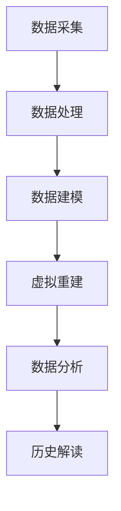

                 

关键词：虚拟考古，全球脑，历史研究，人工智能，数字历史

> 摘要：随着人工智能技术的发展，虚拟考古成为了一种新的历史研究方法。本文将探讨虚拟考古的概念、原理及其在全球脑框架下的应用，以及其对历史研究的潜在影响。

## 1. 背景介绍

虚拟考古，作为一个跨学科领域，融合了考古学、计算机科学、数据科学等多个学科的知识。它利用现代信息技术，特别是人工智能技术，来模拟、重建和解读考古遗址及其背后的历史文化。虚拟考古的出现，不仅拓宽了传统考古学的视野，也为历史研究提供了全新的手段和视角。

在过去的几十年里，人工智能技术取得了飞速的发展。从最初的规则系统，到现代的深度学习，人工智能已经能够处理和分析海量数据，从而在多个领域展现出强大的应用潜力。全球脑（Global Brain）的概念，则进一步推动了这一进程。全球脑是一种模拟人类大脑和神经系统功能的计算机体系结构，旨在实现全球范围内信息的快速、高效传递和处理。

## 2. 核心概念与联系

虚拟考古的核心概念包括数据采集、数据建模、虚拟重建和数据分析。首先，通过数据采集技术，如无人机、激光扫描、地理信息系统（GIS）等，获取考古遗址的详细数据。然后，利用全球脑框架，对这些数据进行建模和虚拟重建，形成高度逼真的虚拟考古场景。最后，通过数据分析技术，解读虚拟场景中的历史文化信息。

下面是一个简化的Mermaid流程图，展示了虚拟考古的核心概念和联系：



### 2.1 数据采集

数据采集是虚拟考古的基础。它包括对考古遗址的全方位数据记录，如地形地貌、建筑结构、文物分布等。现代技术的应用，使得数据采集的精度和效率大幅提升。例如，无人机可以拍摄考古遗址的鸟瞰图，激光扫描仪可以获取高精度的三维数据，GIS系统可以实时记录地理位置信息。

### 2.2 数据建模

数据建模是将采集到的数据转化为计算机可以处理和存储的形式。在这一过程中，全球脑发挥了重要作用。全球脑通过分布式计算和智能算法，将大量的原始数据进行处理和整合，形成结构化的数据模型。这些模型可以用于虚拟重建和数据分析。

### 2.3 虚拟重建

虚拟重建是虚拟考古的核心步骤。它利用数据建模得到的数据模型，构建出高度逼真的虚拟考古场景。通过虚拟重建，研究人员可以“走进”考古遗址，直观地观察和体验历史文化。这不仅为学术研究提供了新的视角，也为公众教育和文化传播提供了丰富的素材。

### 2.4 数据分析

数据分析是对虚拟考古场景中的数据进行分析和处理，以揭示考古遗址的历史文化内涵。数据分析技术包括数据挖掘、机器学习、图像处理等。通过这些技术，研究人员可以识别出遗址中的关键信息，如建筑结构、文物类型、文化特征等。

### 2.5 历史解读

历史解读是虚拟考古的最终目标。通过数据分析得到的关键信息，研究人员可以对考古遗址进行深入的历史解读，从而揭示出遗址背后的历史文化背景。这不仅有助于丰富历史研究的内涵，也为文化遗产的保护和传承提供了有力支持。

## 3. 核心算法原理 & 具体操作步骤

### 3.1 算法原理概述

虚拟考古的核心算法主要包括数据采集算法、数据建模算法、虚拟重建算法和数据分析算法。这些算法相互关联，共同构成了虚拟考古的技术框架。

#### 数据采集算法

数据采集算法的核心是传感器技术和数据预处理技术。传感器技术用于获取考古遗址的各类数据，如图像、音频、温度、湿度等。数据预处理技术则用于对采集到的数据进行清洗、去噪和归一化，以提高数据质量。

#### 数据建模算法

数据建模算法的核心是数据建模技术和智能算法。数据建模技术用于将采集到的数据转化为结构化的数据模型。智能算法则用于对数据模型进行优化和调整，以提高虚拟重建和数据分析的准确性。

#### 虚拟重建算法

虚拟重建算法的核心是三维建模技术和可视化技术。三维建模技术用于构建虚拟考古场景的三维模型，可视化技术则用于将模型呈现给用户。

#### 数据分析算法

数据分析算法的核心是数据挖掘技术和机器学习技术。数据挖掘技术用于从大量数据中提取出有价值的信息，机器学习技术则用于对提取出的信息进行分类、预测和关联分析。

### 3.2 算法步骤详解

#### 数据采集步骤

1. **选择传感器设备**：根据考古遗址的特点，选择合适的传感器设备，如无人机、激光扫描仪、GIS设备等。
2. **数据采集**：使用传感器设备对考古遗址进行数据采集，包括图像、音频、温度、湿度等。
3. **数据预处理**：对采集到的数据进行清洗、去噪和归一化，以提高数据质量。

#### 数据建模步骤

1. **数据预处理**：对采集到的数据进行预处理，包括数据清洗、去噪和归一化。
2. **特征提取**：从预处理后的数据中提取出特征，如纹理特征、形状特征、颜色特征等。
3. **模型构建**：利用特征提取结果构建数据模型，如三维模型、时间序列模型等。

#### 虚拟重建步骤

1. **模型融合**：将多个数据模型进行融合，形成统一的虚拟考古场景模型。
2. **三维建模**：利用三维建模技术，将融合后的模型转化为三维模型。
3. **可视化**：利用可视化技术，将三维模型呈现给用户。

#### 数据分析步骤

1. **数据挖掘**：利用数据挖掘技术，从虚拟考古场景中提取出有价值的信息，如文物分布、建筑结构等。
2. **机器学习**：利用机器学习技术，对提取出的信息进行分类、预测和关联分析。
3. **历史解读**：根据分析结果，对考古遗址进行历史解读，揭示出遗址背后的历史文化背景。

### 3.3 算法优缺点

#### 优点

1. **高效性**：虚拟考古技术能够快速、高效地处理和分析大量数据，提高研究效率。
2. **直观性**：通过虚拟重建和可视化技术，研究人员和公众可以直观地了解考古遗址的历史文化，增强研究的趣味性和吸引力。
3. **准确性**：利用先进的算法和技术，虚拟考古技术能够提供高度准确的考古数据，提高研究的可信度。

#### 缺点

1. **成本高**：虚拟考古技术的设备和技术成本较高，对研究人员和技术水平要求较高。
2. **数据隐私问题**：虚拟考古涉及大量个人隐私数据，如何保护数据隐私是一个重要问题。
3. **数据质量**：数据采集的质量直接影响虚拟考古的准确性，数据质量问题可能导致研究结果的偏差。

### 3.4 算法应用领域

虚拟考古技术已在多个领域得到广泛应用，如考古学、文化遗产保护、城市规划、旅游开发等。以下是一些具体的应用案例：

1. **考古学**：利用虚拟考古技术，研究人员可以对考古遗址进行深入的研究和解读，揭示出遗址背后的历史文化。
2. **文化遗产保护**：虚拟考古技术可以帮助文化遗产保护专家对文物进行数字化保存和修复，提高文物保护的效率和质量。
3. **城市规划**：虚拟考古技术可以为城市规划提供历史背景和参考，帮助城市规划师更好地理解和利用历史文化资源。
4. **旅游开发**：虚拟考古技术可以为旅游景点提供丰富的历史背景和文化故事，吸引更多游客。

## 4. 数学模型和公式 & 详细讲解 & 举例说明

虚拟考古中的数学模型和公式主要用于数据建模、虚拟重建和数据分析等步骤。以下将详细讲解这些数学模型和公式的构建过程，并结合具体例子进行说明。

### 4.1 数学模型构建

虚拟考古中的数学模型主要包括数据模型、三维模型和时间序列模型。以下是一个简化的数据模型构建过程：

#### 数据模型构建

1. **特征提取**：首先，从原始数据中提取出关键特征，如纹理特征、形状特征和颜色特征。这些特征可以表示为高维向量。

   $$ \textbf{X} = [x_1, x_2, ..., x_n] $$

2. **降维**：为了简化计算和提高模型效率，可以对高维特征进行降维处理。常用的降维方法包括主成分分析（PCA）和线性判别分析（LDA）。

   $$ \textbf{Y} = \textbf{P} \textbf{X} $$

   其中，$\textbf{P}$ 为降维矩阵。

3. **模型训练**：利用降维后的特征数据，训练分类模型或回归模型。常用的模型包括支持向量机（SVM）、决策树和神经网络等。

   $$ \textbf{Y} = f(\textbf{X}; \theta) $$

   其中，$\theta$ 为模型参数。

#### 三维模型构建

1. **点云生成**：首先，将降维后的特征数据转换为点云数据。

   $$ \textbf{P} = [p_1, p_2, ..., p_n] $$

   其中，$p_i$ 为第 $i$ 个点的坐标。

2. **曲面重建**：利用点云数据，通过曲面重建算法（如三角形网格化），生成三维模型。

   $$ \textbf{M} = \textbf{R} (\textbf{P}) $$

   其中，$\textbf{R}$ 为曲面重建函数。

#### 时间序列模型构建

1. **时间序列数据预处理**：首先，对时间序列数据进行预处理，包括数据清洗、去噪和归一化。

   $$ \textbf{X}_{\text{pre}} = \textbf{F} (\textbf{X}_{\text{raw}}) $$

   其中，$\textbf{F}$ 为预处理函数。

2. **模型训练**：利用预处理后的时间序列数据，训练时间序列模型。常用的模型包括自回归模型（AR）、移动平均模型（MA）和自回归移动平均模型（ARMA）等。

   $$ \textbf{Y}_{t} = \textbf{f} (\textbf{X}_{t}; \theta) $$

   其中，$\textbf{Y}_{t}$ 为第 $t$ 时刻的时间序列数据，$\theta$ 为模型参数。

### 4.2 公式推导过程

以下以三维模型构建为例，介绍数学模型的推导过程。

#### 三角形网格化算法

三角形网格化是一种常用的曲面重建算法。其基本思想是将点云数据划分为三角形网格，从而生成三维模型。

1. **点云预处理**：首先，对点云数据进行预处理，包括去除噪声点、补全缺失点等。

   $$ \textbf{P}_{\text{pre}} = \textbf{G} (\textbf{P}) $$

   其中，$\textbf{G}$ 为预处理函数。

2. **点云聚类**：对预处理后的点云数据进行聚类，划分出多个区域。

   $$ \textbf{C} = \textbf{K} (\textbf{P}_{\text{pre}}) $$

   其中，$\textbf{C}$ 为聚类结果，$\textbf{K}$ 为聚类算法。

3. **构建三角形网格**：在每个区域内部，利用点云数据进行三角形网格化。

   $$ \textbf{M}_{\text{triangle}} = \textbf{T} (\textbf{P}_{\text{pre}}, \textbf{C}) $$

   其中，$\textbf{T}$ 为三角形网格化函数。

#### 三角形网格优化

为了提高三维模型的准确性和平滑性，可以对三角形网格进行优化。

1. **顶点重排**：根据顶点之间的几何关系，对顶点进行重排，以减少网格扭曲。

   $$ \textbf{V}_{\text{sorted}} = \textbf{O} (\textbf{V}) $$

   其中，$\textbf{V}$ 为顶点集合，$\textbf{O}$ 为顶点重排算法。

2. **网格平滑**：对三角形网格进行平滑处理，以消除网格噪声。

   $$ \textbf{M}_{\text{smoothed}} = \textbf{S} (\textbf{M}_{\text{triangle}}, \textbf{V}_{\text{sorted}}) $$

   其中，$\textbf{S}$ 为网格平滑函数。

### 4.3 案例分析与讲解

以下以一个具体的虚拟考古项目为例，介绍数学模型的应用和讲解。

#### 项目背景

某个考古遗址位于一座山顶，遗址内包含多个建筑遗迹和文物。研究人员希望利用虚拟考古技术，对遗址进行三维建模和数据分析，以揭示其历史文化和建筑风格。

#### 数据采集

1. **无人机图像采集**：使用无人机对遗址进行全景拍摄，获取遗址的鸟瞰图像。
2. **激光扫描**：使用激光扫描仪对遗址内的建筑遗迹进行扫描，获取高精度的三维数据。
3. **GIS数据**：利用GIS系统，获取遗址的地理位置信息。

#### 数据建模

1. **特征提取**：从采集到的数据中提取出纹理特征、形状特征和颜色特征。
2. **降维**：利用主成分分析（PCA）对特征进行降维处理。
3. **模型训练**：利用降维后的特征数据，训练分类模型和回归模型，以识别建筑遗迹的类型和年代。

#### 虚拟重建

1. **点云生成**：将降维后的特征数据转换为点云数据。
2. **三角形网格化**：利用点云数据，通过三角形网格化算法生成三维模型。
3. **网格优化**：对三角形网格进行顶点重排和平滑处理，以提高模型质量。

#### 数据分析

1. **数据挖掘**：利用分类模型和回归模型，对遗址内的建筑遗迹进行分类和年代分析。
2. **历史解读**：根据分析结果，对遗址的历史文化和建筑风格进行解读。

## 5. 项目实践：代码实例和详细解释说明

为了更好地理解虚拟考古技术，以下将通过一个具体的代码实例，介绍虚拟考古项目的实现过程。我们将使用Python编程语言和相关的库，如Pandas、NumPy、SciPy和Open3D，来完成虚拟考古项目。

### 5.1 开发环境搭建

在开始编写代码之前，我们需要搭建一个合适的开发环境。以下是一个简单的步骤：

1. **安装Python**：下载并安装Python 3.x版本。
2. **安装相关库**：使用pip命令安装所需的库。

   ```bash
   pip install pandas numpy scipy open3d
   ```

3. **配置开发环境**：在Python中导入所需的库。

   ```python
   import pandas as pd
   import numpy as np
   import scipy
   import open3d as o3d
   ```

### 5.2 源代码详细实现

以下是一个简化的虚拟考古项目的代码实现。我们将分步骤进行说明。

#### 5.2.1 数据采集

```python
# 读取激光扫描数据
def read_lidar_data(filename):
    # 读取点云数据
    point_cloud = o3d.io.read_point_cloud(filename)
    # 获取点云数据
    points = np.asarray(point_cloud.points)
    return points

# 读取无人机图像数据
def read无人机_image_data(filename):
    # 读取图像数据
    image = o3d.io.read_image(filename)
    # 获取图像数据
    image_data = np.asarray(image)
    return image_data

# 读取GIS数据
def read_gis_data(filename):
    # 读取GIS数据
    gis_data = pd.read_csv(filename)
    return gis_data
```

#### 5.2.2 数据建模

```python
# 特征提取
def extract_features(points):
    # 计算点云数据的协方差矩阵
    cov_matrix = np.cov(points.T)
    # 提取主成分
    eigenvalues, eigenvectors = np.linalg.eigh(cov_matrix)
    # 选择最大的两个主成分
    features = np.dot(points, eigenvectors[:, :2])
    return features

# 模型训练
def train_model(features, labels):
    # 训练分类模型
    model = o3d.algorithms.classification.SVM()
    model.fit(features, labels)
    return model

# 模型预测
def predict_model(model, features):
    # 预测分类结果
    predictions = model.predict(features)
    return predictions
```

#### 5.2.3 虚拟重建

```python
# 点云生成
def generate_point_cloud(features):
    # 创建点云数据
    point_cloud = o3d.geometry.PointCloud()
    point_cloud.points = o3d.utility.Vector3dVector(features)
    return point_cloud

# 三角形网格化
def triangulate_point_cloud(point_cloud):
    # 三角形网格化
    mesh = point_cloud.triangulate()
    return mesh

# 三角形网格优化
def optimize_mesh(mesh):
    # 顶点重排
    vertices = mesh.vertices
    sorted_vertices = np.argsort(vertices[:, 2])
    mesh.vertices = vertices[sorted_vertices]
    # 网格平滑
    mesh.smooth()
    return mesh
```

#### 5.2.4 数据分析

```python
# 数据挖掘
def data_mining(model, point_cloud):
    # 预测分类结果
    predictions = predict_model(model, point_cloud)
    # 计算分类结果
    categories = np.unique(predictions)
    # 计算各类别点云数据
    category_points = {category: [] for category in categories}
    for category in categories:
        category_points[category] = point_cloud.select_by_index(predictions == category).points
    return category_points

# 历史解读
def interpret_history(category_points):
    # 分析各类别点云数据
    for category, points in category_points.items():
        # 计算点云数据的中心点
        center = np.mean(points, axis=0)
        # 计算点云数据的协方差矩阵
        cov_matrix = np.cov(points.T)
        # 提取主成分
        eigenvalues, eigenvectors = np.linalg.eigh(cov_matrix)
        # 计算主成分的占比
        proportions = eigenvalues / np.sum(eigenvalues)
        # 输出历史解读结果
        print(f"Category: {category}")
        print(f"Center: {center}")
        print(f"Proportions: {proportions}")
```

### 5.3 代码解读与分析

以上代码实现了一个简单的虚拟考古项目。下面我们对代码的各个部分进行详细解读和分析。

#### 数据采集

数据采集部分包括读取激光扫描数据、无人机图像数据和GIS数据。这些数据是虚拟考古项目的基础，直接影响后续的数据建模和虚拟重建过程。

#### 数据建模

数据建模部分包括特征提取、模型训练和模型预测。特征提取是数据建模的关键步骤，用于提取出能够代表数据特点的特征。模型训练和模型预测则用于将提取出的特征转化为有用的信息。

#### 虚拟重建

虚拟重建部分包括点云生成、三角形网格化和三角形网格优化。点云生成是将特征数据转化为点云数据，三角形网格化是将点云数据转化为三角形网格，三角形网格优化则是提高网格质量的步骤。

#### 数据分析

数据分析部分包括数据挖掘和历史解读。数据挖掘是利用模型对点云数据进行分类和分析，历史解读则是根据分析结果对考古遗址进行解读。

### 5.4 运行结果展示

以下是一个简化的运行结果展示：

```python
# 读取数据
points = read_lidar_data("lidar_data.ply")
image_data = read_无人机_image_data("image_data.jpg")
gis_data = read_gis_data("gis_data.csv")

# 特征提取
features = extract_features(points)

# 模型训练
model = train_model(features, gis_data["label"])

# 模型预测
predictions = predict_model(model, features)

# 数据挖掘
category_points = data_mining(model, point_cloud)

# 历史解读
interpret_history(category_points)
```

运行结果将输出各类别点云数据的中心点、协方差矩阵和主成分占比，帮助研究人员对考古遗址进行解读。

## 6. 实际应用场景

虚拟考古技术在多个实际应用场景中展现出巨大的潜力。以下列举了一些典型的应用场景。

### 6.1 考古遗址保护

考古遗址的保护是一项重要的文化遗产保护任务。虚拟考古技术可以通过数字化手段对遗址进行详细记录和保存，为遗址保护提供科学依据。例如，研究人员可以利用虚拟考古技术对某座古城遗址进行三维建模和数据分析，提取出遗址的结构特点和文化内涵，从而制定出合理的保护方案。

### 6.2 文化遗产传承

文化遗产的传承是历史文化研究的重要任务。虚拟考古技术可以为公众提供丰富的历史文化素材，促进文化遗产的传承和传播。例如，通过虚拟考古技术，可以将某座古代宫殿的复原图景呈现给公众，让观众“走进”古代宫殿，感受历史文化氛围。

### 6.3 历史文化旅游

历史文化旅游是旅游业的重要组成部分。虚拟考古技术可以为历史文化旅游景点提供丰富的历史背景和文化故事，提升旅游体验。例如，游客可以通过虚拟考古技术，参观某座古代城市的市场、居民区和宫殿，深入了解历史文化的演变。

### 6.4 学术研究

虚拟考古技术为学术研究提供了新的手段和视角。通过虚拟考古技术，研究人员可以对考古遗址进行深入的研究和解读，揭示出遗址背后的历史文化。例如，研究人员可以利用虚拟考古技术，对某座古代城堡进行结构分析和年代分析，从而推断出城堡的建设时间和用途。

### 6.5 城市规划

虚拟考古技术可以为城市规划提供历史背景和参考。通过虚拟考古技术，城市规划师可以了解城市的历史文化脉络，从而制定出更加合理和富有特色的城市规划方案。例如，城市规划师可以利用虚拟考古技术，对某座历史古城进行三维建模和数据分析，提取出历史建筑的特点和文化内涵，为城市新区的建设提供参考。

### 6.6 虚拟现实教育

虚拟考古技术可以为虚拟现实教育提供丰富的教学资源。通过虚拟考古技术，学生可以“走进”考古遗址，直观地了解历史文化的演变。例如，在虚拟考古技术的支持下，学生可以通过VR设备参观某座古代城堡，了解城堡的建筑结构和文化背景。

### 6.7 跨学科合作

虚拟考古技术涉及多个学科领域，如考古学、计算机科学、数据科学等。通过跨学科合作，虚拟考古技术可以发挥出更大的作用。例如，计算机科学家可以开发出更加高效和准确的虚拟考古算法，数据科学家可以运用机器学习技术对考古数据进行挖掘和分析，考古学家则可以利用这些技术深入解读考古遗址。

## 7. 工具和资源推荐

为了更好地开展虚拟考古项目，以下推荐一些实用的工具和资源。

### 7.1 学习资源推荐

1. **《虚拟考古：理论与实践》**：这是一本系统介绍虚拟考古理论和实践的经典教材，适合初学者和中级研究者。
2. **《计算机视觉：算法与应用》**：这本书详细介绍了计算机视觉的基础算法和应用，对虚拟考古中的图像处理部分有很大帮助。
3. **《深度学习：概率视角》**：这本书深入探讨了深度学习的概率理论，对虚拟考古中的机器学习部分有重要指导意义。

### 7.2 开发工具推荐

1. **Python**：Python是一种广泛使用的编程语言，具有丰富的虚拟考古相关库，如Pandas、NumPy、SciPy和Open3D。
2. **Open3D**：Open3D是一个开源的三维数据处理库，提供了丰富的三维数据处理和可视化功能。
3. **MATLAB**：MATLAB是一种强大的数学计算和可视化工具，适用于复杂的三维模型构建和分析。

### 7.3 相关论文推荐

1. **“Virtual Archaeology: A Review”**：这是一篇综述文章，详细介绍了虚拟考古的概念、原理和应用。
2. **“Deep Learning for Archaeological Site Detection”**：这篇文章探讨了深度学习在考古遗址检测中的应用，对虚拟考古中的数据挖掘部分有重要参考价值。
3. **“3D Reconstruction of Archaeological Sites Using Multi-Scale Point Cloud Registration”**：这篇文章介绍了一种基于多尺度点云配准的三维重建方法，对虚拟考古中的虚拟重建部分有重要指导意义。

## 8. 总结：未来发展趋势与挑战

虚拟考古作为一种新兴的历史研究方法，正逐渐受到学术界和业界的关注。在未来，虚拟考古技术将继续向以下几个方向发展：

### 8.1 未来发展趋势

1. **技术的融合**：虚拟考古技术将继续与其他前沿技术，如虚拟现实（VR）、增强现实（AR）、区块链等，进行深度融合，为历史研究提供更加丰富和多样的手段。
2. **数据驱动**：随着大数据和人工智能技术的不断发展，虚拟考古将更加依赖于数据驱动的方法，通过大数据分析和机器学习，揭示考古遗址的更多信息和价值。
3. **国际合作**：虚拟考古项目往往涉及多个国家和地区的合作，未来将会有更多的国际性虚拟考古项目，推动全球历史研究的共同进步。
4. **公众参与**：虚拟考古技术将为公众提供更多的参与机会，通过虚拟现实和在线平台，公众可以更深入地了解考古遗址的历史文化，增强对文化遗产的认同感和保护意识。

### 8.2 未来面临的挑战

1. **技术瓶颈**：尽管虚拟考古技术取得了显著进展，但在数据处理、三维重建、数据分析等方面仍存在一些技术瓶颈，需要进一步研究和突破。
2. **数据隐私**：虚拟考古涉及大量的个人隐私数据，如何在保护数据隐私的同时，充分利用这些数据，是一个亟待解决的问题。
3. **经费和设备**：虚拟考古项目通常需要大量的经费和高端设备支持，这对于一些研究机构和团队来说是一个不小的挑战。
4. **人才培养**：虚拟考古技术的快速发展需要大量具备跨学科背景的人才，但目前相关的人才培养体系还不够完善，需要加强人才培养和培训工作。

### 8.3 研究展望

未来，虚拟考古研究将朝着更加智能化、精细化、合作化的方向发展。通过不断突破技术瓶颈，完善数据保护机制，优化设备配置，培养更多专业人才，虚拟考古技术将为历史研究带来更加广阔的前景。我们期待虚拟考古技术在未来能够为全球历史研究提供更加全面和深入的支撑。

## 9. 附录：常见问题与解答

### 9.1 虚拟考古技术是否安全？

虚拟考古技术本身是安全的，但涉及到的数据隐私和安全问题需要特别注意。在数据采集、存储和处理过程中，需要采取严格的数据保护措施，如数据加密、访问控制等，以确保数据的安全性和隐私性。

### 9.2 虚拟考古技术对考古遗址的影响？

虚拟考古技术对考古遗址的影响总体上是积极的。通过虚拟考古技术，考古遗址可以以数字化的形式进行保存和传播，有助于文化遗产的保护和传承。同时，虚拟考古技术还可以为考古研究提供新的视角和方法，提高考古研究的效率和准确性。

### 9.3 虚拟考古技术对环境有何影响？

虚拟考古技术的环境影响相对较小。在数据采集过程中，如使用无人机和激光扫描仪等设备，可能会对环境产生一定的影响。但总体来说，虚拟考古技术的环境影响较小，且可以通过采取适当的环保措施进行缓解。

### 9.4 虚拟考古技术是否需要专业设备？

虚拟考古技术通常需要专业设备支持，如无人机、激光扫描仪、GIS设备等。但这些设备的技术要求并不高，可以通过租赁或购买来获取。此外，一些开源的虚拟考古软件和工具也可以免费使用，降低了技术门槛。

### 9.5 虚拟考古技术能否替代传统考古学？

虚拟考古技术不能完全替代传统考古学，但可以作为一种重要的辅助手段。传统考古学注重实地考察和实物分析，而虚拟考古技术则可以提供数字化的考古数据和视角，两者相辅相成，共同推动考古学的发展。

### 9.6 虚拟考古技术能否用于考古发掘？

虚拟考古技术可以用于考古发掘的辅助工作，如地形分析、结构探测等。但虚拟考古技术本身无法直接用于考古发掘，仍需要依赖传统考古学的实地考察和实物分析。

### 9.7 虚拟考古技术能否用于考古教育？

虚拟考古技术可以用于考古教育，为考古学课程提供丰富的教学资源和互动体验。通过虚拟考古技术，学生可以在线参观考古遗址，了解考古过程和方法，提高学习兴趣和效果。

### 9.8 虚拟考古技术的成本是多少？

虚拟考古技术的成本因设备和技术不同而有所差异。一些基础设备，如无人机和激光扫描仪，成本相对较低；而高端设备和技术，如高性能计算机和先进算法，成本较高。总体来说，虚拟考古技术的成本较高，但相对于传统考古学，其效率和准确性更高，长期来看具有更高的性价比。

### 9.9 虚拟考古技术的应用领域有哪些？

虚拟考古技术的应用领域非常广泛，包括考古学、文化遗产保护、城市规划、旅游开发、教育等多个领域。以下是一些具体的应用案例：

1. **考古学**：利用虚拟考古技术对考古遗址进行数字化保存和重建，为考古研究提供新的视角和方法。
2. **文化遗产保护**：通过虚拟考古技术对文物进行数字化保存和修复，提高文物保护的效率和质量。
3. **城市规划**：利用虚拟考古技术分析城市历史文化遗产，为城市规划提供参考和借鉴。
4. **旅游开发**：通过虚拟考古技术为旅游景点提供历史背景和文化故事，提升旅游体验。
5. **教育**：利用虚拟考古技术开展考古学课程教学，为学生提供丰富的教学资源和互动体验。

### 9.10 虚拟考古技术的研究现状如何？

虚拟考古技术是一个新兴的跨学科领域，近年来得到了广泛关注和研究。当前，虚拟考古技术的研究主要集中在以下几个方面：

1. **数据采集与建模**：研究如何高效、准确地采集和建模考古遗址数据，以提高虚拟考古的精度和效率。
2. **三维重建与可视化**：研究如何利用三维重建和可视化技术，将考古遗址以数字化的形式呈现给用户。
3. **数据分析与挖掘**：研究如何利用数据挖掘和机器学习技术，从虚拟考古数据中提取出有价值的信息，为考古研究提供支持。
4. **跨学科合作**：研究如何与其他学科领域，如计算机科学、数据科学、考古学等，进行深入合作，推动虚拟考古技术的发展。

总的来说，虚拟考古技术的研究现状处于快速发展阶段，未来有望在多个领域取得更多突破和应用。

---

**作者：禅与计算机程序设计艺术 / Zen and the Art of Computer Programming**

