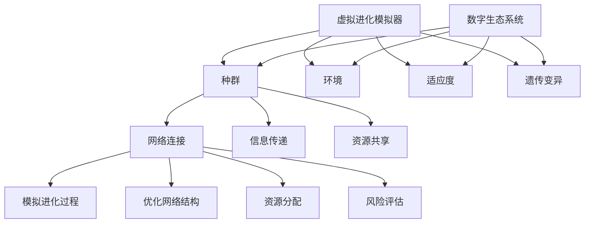

                 

 关键词：虚拟进化模拟器，AI驱动，数字生态系统，模拟实验，模型构建，算法原理，数学模型，项目实践，应用场景，未来展望

> 摘要：本文将探讨虚拟进化模拟器的概念及其在数字生态系统中的重要作用。通过介绍核心概念、算法原理、数学模型及项目实践，本文旨在为读者提供一个全面而深入的视角，了解虚拟进化模拟器的工作机制和实际应用。同时，本文还将展望未来发展趋势与面临的挑战。

## 1. 背景介绍

虚拟进化模拟器（Virtual Evolution Simulator，简称VES）是一种通过计算机模拟实现生物进化过程的工具。它通过模拟不同种群在特定环境中的竞争、适应和进化过程，为研究者提供了观察和理解自然选择、遗传变异等现象的平台。在过去的几十年中，虚拟进化模拟器的发展取得了显著进步，尤其在人工智能（AI）技术的推动下，其模拟精度和效率得到了极大提升。

随着数字化转型的不断深化，数字生态系统（Digital Ecosystem）的概念逐渐被广泛接受。数字生态系统是由多种数字实体（如应用程序、服务、设备等）组成的复杂网络，通过智能连接和协同工作，实现信息的快速传递和资源的共享。在这个背景下，虚拟进化模拟器作为一项关键技术，可以在数字生态系统中发挥重要作用，帮助企业和组织更好地理解和优化其运营模式。

本文旨在通过介绍虚拟进化模拟器的基本概念、核心算法、数学模型和实际应用，为读者提供一个全面而深入的视角，以了解其在数字生态系统中的应用潜力和发展前景。

## 2. 核心概念与联系

### 2.1 虚拟进化模拟器的基本概念

虚拟进化模拟器是一种通过计算机模拟实现生物进化过程的工具，其核心概念包括：

- **种群（Population）**：模拟中的个体集合，每个个体代表一个可能的解决方案。
- **环境（Environment）**：模拟中的外部因素，如资源、竞争、障碍等。
- **适应度（Fitness）**：个体在特定环境下的生存能力或适应度。
- **遗传变异（Genetic Variation）**：个体通过遗传和变异机制产生新的解决方案。

### 2.2 数字生态系统的基本概念

数字生态系统是由多种数字实体组成的复杂网络，其核心概念包括：

- **数字实体（Digital Entities）**：如应用程序、服务、设备等。
- **网络连接（Network Connection）**：实体之间的相互联系和协作。
- **信息传递（Information Transfer）**：数据在系统中的流动和共享。
- **资源共享（Resource Sharing）**：实体之间的资源共享和协同工作。

### 2.3 虚拟进化模拟器与数字生态系统的联系

虚拟进化模拟器与数字生态系统之间存在密切的联系。具体而言，虚拟进化模拟器可以通过以下方式与数字生态系统相结合：

- **模拟进化过程**：模拟生物进化过程，为数字生态系统的优化提供参考。
- **优化网络结构**：通过模拟种群竞争和适应过程，优化数字生态系统中的网络连接。
- **资源分配**：利用虚拟进化模拟器优化资源分配策略，提高数字生态系统的效率。
- **风险评估**：通过模拟不同环境条件下的进化过程，评估数字生态系统中的风险。

### 2.4 Mermaid 流程图

以下是一个简化的Mermaid流程图，展示虚拟进化模拟器与数字生态系统的核心概念和联系：



## 3. 核心算法原理 & 具体操作步骤

### 3.1 算法原理概述

虚拟进化模拟器通常基于遗传算法（Genetic Algorithm，GA）或其他进化算法进行设计。遗传算法是一种基于自然选择和遗传变异原理的搜索算法，通过模拟生物进化过程来寻找最优解。以下是遗传算法的基本原理：

- **初始化种群**：随机生成一组初始解，每个解表示一个可能的解决方案。
- **适应度评估**：评估每个解的适应度，适应度越高表示解的质量越好。
- **选择**：根据适应度选择优秀的解进行繁殖。
- **交叉**：选择两个优秀解进行交叉操作，生成新的解。
- **变异**：对部分解进行变异操作，增加种群的多样性。
- **迭代**：重复上述步骤，逐步优化解的质量。

### 3.2 算法步骤详解

以下是虚拟进化模拟器的具体操作步骤：

#### 步骤1：初始化种群

随机生成一组初始解，每个解表示一个可能的解决方案。初始种群的规模和结构可以根据具体问题进行调整。

#### 步骤2：适应度评估

评估每个解的适应度，适应度可以通过目标函数进行计算。适应度越高表示解的质量越好。

#### 步骤3：选择

根据适应度选择优秀的解进行繁殖。选择操作可以通过轮盘赌、锦标赛选择等方法进行。

#### 步骤4：交叉

选择两个优秀解进行交叉操作，生成新的解。交叉操作可以通过单点交叉、多点交叉、统一交叉等方法进行。

#### 步骤5：变异

对部分解进行变异操作，增加种群的多样性。变异操作可以通过随机变异、均匀变异等方法进行。

#### 步骤6：迭代

重复上述步骤，逐步优化解的质量。迭代次数可以根据问题的复杂度和计算资源进行调整。

### 3.3 算法优缺点

#### 优点

- **通用性**：遗传算法是一种通用的搜索算法，可以应用于各种优化问题。
- **鲁棒性**：遗传算法对初始解和参数设置的要求较低，具有较强的鲁棒性。
- **并行性**：遗传算法可以采用并行计算技术，提高计算效率。

#### 缺点

- **收敛速度较慢**：遗传算法在初期阶段可能需要较长的迭代次数才能收敛。
- **局部最优**：遗传算法容易陷入局部最优，难以找到全局最优解。
- **计算资源消耗较大**：遗传算法的计算资源消耗较大，尤其是对于大规模问题。

### 3.4 算法应用领域

遗传算法在虚拟进化模拟器中具有广泛的应用领域，包括：

- **组合优化问题**：如旅行商问题、多目标优化问题等。
- **参数优化问题**：如神经网络权重优化、控制系统参数优化等。
- **自适应系统设计**：如自适应滤波器、自适应控制系统等。

## 4. 数学模型和公式 & 详细讲解 & 举例说明

### 4.1 数学模型构建

虚拟进化模拟器中的数学模型主要包括适应度函数、交叉操作、变异操作等。以下是这些模型的基本构建过程：

#### 4.1.1 适应度函数

适应度函数用于评估个体在特定环境下的适应度，常用的适应度函数包括线性函数、指数函数、对数函数等。例如，以下是一个简单的线性适应度函数：

$$
f(x) = w_1 \cdot x_1 + w_2 \cdot x_2 + \cdots + w_n \cdot x_n
$$

其中，$w_1, w_2, \cdots, w_n$ 是权重系数，$x_1, x_2, \cdots, x_n$ 是个体的特征值。

#### 4.1.2 交叉操作

交叉操作用于生成新的个体，常用的交叉操作包括单点交叉、多点交叉、统一交叉等。以下是一个简单的单点交叉操作：

$$
crossover(p_1, p_2) \rightarrow c_1, c_2
$$

其中，$p_1, p_2$ 是参与交叉的个体，$c_1, c_2$ 是交叉后生成的新个体。交叉点 $k$ 可以随机选择，例如：

$$
k = \text{rand}(1, n)
$$

#### 4.1.3 变异操作

变异操作用于增加种群的多样性，常用的变异操作包括随机变异、均匀变异等。以下是一个简单的随机变异操作：

$$
mutate(x) \rightarrow x'
$$

其中，$x$ 是变异前的个体，$x'$ 是变异后生成的新个体。变异概率 $p_m$ 可以根据具体问题进行调整，例如：

$$
p_m = \text{rand}(0, 1)
$$

### 4.2 公式推导过程

以下是一个简单的遗传算法迭代过程的推导过程：

#### 步骤1：初始化种群

$$
P_0 = \{x_1, x_2, \cdots, x_n\}
$$

其中，$x_i$ 是第 $i$ 个初始个体。

#### 步骤2：适应度评估

$$
f(x_1), f(x_2), \cdots, f(x_n)
$$

#### 步骤3：选择

$$
s_1, s_2, \cdots, s_n = \text{select}(P_0, f(P_0))
$$

其中，$s_i$ 是第 $i$ 个选择后的个体。

#### 步骤4：交叉

$$
c_1, c_2, \cdots, c_n = \text{crossover}(s_1, s_2, \cdots, s_n)
$$

#### 步骤5：变异

$$
m_1, m_2, \cdots, m_n = \text{mutate}(c_1, c_2, \cdots, c_n)
$$

#### 步骤6：更新种群

$$
P_1 = \{m_1, m_2, \cdots, m_n\}
$$

#### 步骤7：迭代

$$
P_{i+1} = P_i \rightarrow \text{ repeat steps 2-6}
$$

### 4.3 案例分析与讲解

以下是一个简单的虚拟进化模拟器案例，用于优化一条旅行路线。假设有 $n$ 个城市，每个城市之间的距离可以用一个矩阵表示。我们的目标是找到一条总距离最短的旅行路线。

#### 步骤1：初始化种群

随机生成 $m$ 条旅行路线，每条路线由 $n$ 个城市按顺序排列组成。

#### 步骤2：适应度评估

计算每条旅行路线的总距离，适应度函数为：

$$
f(r) = \sum_{i=1}^{n} d(r_i, r_{i+1})
$$

其中，$r$ 是旅行路线，$d(r_i, r_{i+1})$ 是城市 $r_i$ 和 $r_{i+1}$ 之间的距离。

#### 步骤3：选择

使用轮盘赌选择方法，根据适应度大小选择 $m$ 条最优路线。

#### 步骤4：交叉

对选择的路线进行交叉操作，生成新的路线。

#### 步骤5：变异

对交叉后的路线进行变异操作，增加种群的多样性。

#### 步骤6：更新种群

将变异后的路线作为新的种群。

#### 步骤7：迭代

重复上述步骤，直到找到最优路线或达到迭代次数限制。

## 5. 项目实践：代码实例和详细解释说明

### 5.1 开发环境搭建

为了实践虚拟进化模拟器，我们需要搭建一个开发环境。以下是搭建环境的基本步骤：

#### 步骤1：安装Python

首先，我们需要安装Python。可以从Python官方网站下载安装程序并安装。安装过程中请确保选择添加Python到系统环境变量。

#### 步骤2：安装依赖库

安装Python后，我们需要安装一些依赖库，如NumPy、Pandas、matplotlib等。可以使用pip命令进行安装：

```shell
pip install numpy pandas matplotlib
```

#### 步骤3：创建项目目录

在计算机上创建一个项目目录，例如：

```shell
mkdir virtual_evolution_simulator
cd virtual_evolution_simulator
```

#### 步骤4：编写代码

在项目目录中创建一个名为`main.py`的Python文件，用于编写虚拟进化模拟器的代码。

### 5.2 源代码详细实现

以下是一个简单的虚拟进化模拟器的Python代码实现：

```python
import numpy as np
import pandas as pd
import matplotlib.pyplot as plt

# 参数设置
n = 10           # 城市数量
m = 100          # 种群规模
max_iterations = 1000  # 最大迭代次数
crossover_rate = 0.8   # 交叉率
mutation_rate = 0.05  # 变异率

# 初始化种群
population = np.random.permutation(n)

# 适应度评估
def fitness_function(route):
    total_distance = 0
    for i in range(len(route) - 1):
        total_distance += distance(route[i], route[i + 1])
    return 1 / total_distance

# 交叉操作
def crossover(parent1, parent2):
    child1 = parent1.copy()
    child2 = parent2.copy()
    crossover_point = np.random.randint(1, n - 1)
    child1[crossover_point:], child2[crossover_point:] = child2[crossover_point:], child1[crossover_point:]
    return child1, child2

# 变异操作
def mutate(route):
    for i in range(len(route)):
        if np.random.random() < mutation_rate:
            route[i] = np.random.randint(0, n)
    return route

# 主函数
def main():
    best_route = None
    best_fitness = float('inf')
    for iteration in range(max_iterations):
        # 计算适应度
        fitness_values = [fitness_function(route) for route in population]

        # 更新最佳路线
        if min(fitness_values) < best_fitness:
            best_fitness = min(fitness_values)
            best_route = population[fitness_values.index(min(fitness_values))]

        # 交叉和变异
        for i in range(m // 2):
            parent1, parent2 = population[np.random.choice(m, 2, replace=False)]
            child1, child2 = crossover(parent1, parent2)
            population[i] = mutate(child1)
            population[i + m // 2] = mutate(child2)

        # 绘制迭代过程
        if iteration % 100 == 0:
            plt.scatter(*zip(*[route for route, _ in enumerate(population)]), c=fitness_values)
            plt.xlabel('Iteration')
            plt.ylabel('Fitness')
            plt.title(f'Iteration {iteration}')
            plt.show()

    print(f'Best route: {best_route}')
    print(f'Best fitness: {best_fitness}')

if __name__ == '__main__':
    main()
```

### 5.3 代码解读与分析

#### 5.3.1 参数设置

首先，我们设置了虚拟进化模拟器的一些基本参数，如城市数量（n）、种群规模（m）、最大迭代次数（max_iterations）、交叉率（crossover_rate）和变异率（mutation_rate）。

#### 5.3.2 初始化种群

初始化种群的方法是随机生成一个包含n个元素的列表，每个元素表示一个城市的编号。

#### 5.3.3 适应度评估

适应度评估函数计算每条旅行路线的总距离，并返回其倒数作为适应度值。适应度值越小表示路线越优。

#### 5.3.4 交叉操作

交叉操作用于生成新的路线。在这个例子中，我们使用单点交叉操作，从两个父代路线中随机选择一个交叉点，将交叉点后的部分交换。

#### 5.3.5 变异操作

变异操作用于增加种群的多样性。在这个例子中，我们使用随机变异操作，以一定的概率将每个城市的编号替换为另一个随机编号。

#### 5.3.6 主函数

主函数实现虚拟进化模拟器的核心逻辑。首先，我们初始化种群并计算适应度值。然后，我们通过循环进行迭代，每次迭代执行选择、交叉和变异操作。在每个迭代中，我们更新最佳路线和最佳适应度值。最后，我们绘制迭代过程中的种群适应度分布。

### 5.4 运行结果展示

运行上述代码后，我们将看到一系列的图形，展示每次迭代过程中种群适应度分布的变化。最终，我们将得到最佳路线和最佳适应度值。

## 6. 实际应用场景

虚拟进化模拟器在数字生态系统中的应用场景广泛，以下是一些典型的应用场景：

### 6.1 资源优化

在数字生态系统中，资源优化是一个关键问题。虚拟进化模拟器可以通过模拟种群竞争和适应过程，优化资源分配策略。例如，在一个云平台中，虚拟进化模拟器可以模拟不同虚拟机实例的竞争和适应，优化资源分配，提高系统的效率。

### 6.2 网络优化

数字生态系统中的网络连接复杂且动态变化。虚拟进化模拟器可以帮助优化网络结构，提高网络的可靠性和性能。例如，在物联网（IoT）系统中，虚拟进化模拟器可以模拟不同传感器节点的连接和协作，优化网络拓扑结构，提高数据传输的效率和稳定性。

### 6.3 风险评估

数字生态系统中的风险识别和评估至关重要。虚拟进化模拟器可以通过模拟不同环境条件下的进化过程，评估数字生态系统中的潜在风险。例如，在金融行业中，虚拟进化模拟器可以模拟市场波动对投资组合的影响，评估投资风险。

### 6.4 未来应用展望

随着人工智能和虚拟进化模拟器的不断发展，其应用场景将更加广泛。未来，虚拟进化模拟器可能在以下领域发挥重要作用：

- **智能城市**：虚拟进化模拟器可以帮助优化城市规划、交通管理、能源分配等方面。
- **智慧医疗**：虚拟进化模拟器可以用于疾病预测、治疗方案优化等。
- **智能制造**：虚拟进化模拟器可以帮助优化生产流程、资源分配，提高制造效率。

## 7. 工具和资源推荐

为了更好地了解和应用虚拟进化模拟器，以下是一些建议的学习资源和开发工具：

### 7.1 学习资源推荐

- **《遗传算法原理与应用》**：详细介绍了遗传算法的基本原理和应用案例。
- **《虚拟进化模拟器：从理论到实践》**：提供了虚拟进化模拟器的完整实现方法和案例分析。

### 7.2 开发工具推荐

- **Python**：一种广泛使用的编程语言，适用于开发虚拟进化模拟器。
- **NumPy**：用于高效计算和数值处理的库。
- **Pandas**：用于数据处理和分析的库。
- **matplotlib**：用于绘制图形和可视化数据的库。

### 7.3 相关论文推荐

- **“Genetic Algorithms for the Traveling Salesman Problem”**：介绍了遗传算法在旅行商问题中的应用。
- **“Virtual Evolution Simulators for Digital Ecosystems”**：探讨了虚拟进化模拟器在数字生态系统中的应用前景。

## 8. 总结：未来发展趋势与挑战

虚拟进化模拟器作为一种新兴技术，在数字生态系统中具有广泛的应用前景。然而，随着技术的发展和应用场景的扩大，虚拟进化模拟器也面临着一系列挑战：

### 8.1 研究成果总结

- **模拟精度**：随着模拟精度的提高，虚拟进化模拟器在复杂系统中的应用能力不断增强。
- **计算效率**：通过优化算法和并行计算技术，虚拟进化模拟器的计算效率得到显著提升。
- **应用场景**：虚拟进化模拟器在资源优化、网络优化、风险评估等领域得到广泛应用。

### 8.2 未来发展趋势

- **人工智能融合**：将人工智能技术融入虚拟进化模拟器，提高其自适应性和智能化水平。
- **跨领域应用**：拓展虚拟进化模拟器在不同领域的应用，如智能城市、智慧医疗、智能制造等。
- **开源生态**：构建虚拟进化模拟器的开源生态系统，促进技术的创新和发展。

### 8.3 面临的挑战

- **计算资源**：随着模拟规模的扩大，计算资源需求不断增加，对硬件设施提出更高要求。
- **算法优化**：优化虚拟进化模拟器的算法，提高其收敛速度和优化效果。
- **数据隐私**：在应用虚拟进化模拟器的过程中，保护用户隐私和数据安全成为重要挑战。

### 8.4 研究展望

未来，虚拟进化模拟器将继续在数字生态系统中发挥重要作用。通过不断创新和优化，虚拟进化模拟器有望成为一项关键技术，为各行各业提供更高效、更智能的解决方案。

## 9. 附录：常见问题与解答

### 9.1 什么是虚拟进化模拟器？

虚拟进化模拟器是一种通过计算机模拟实现生物进化过程的工具，用于研究自然选择、遗传变异等现象。

### 9.2 虚拟进化模拟器有哪些应用领域？

虚拟进化模拟器广泛应用于资源优化、网络优化、风险评估等领域，如在数字生态系统中优化资源分配、网络结构和风险评估等。

### 9.3 虚拟进化模拟器与遗传算法有什么关系？

虚拟进化模拟器通常基于遗传算法进行设计，通过模拟生物进化过程来寻找最优解。

### 9.4 如何搭建虚拟进化模拟器开发环境？

搭建虚拟进化模拟器开发环境主要包括安装Python、依赖库和创建项目目录等。

### 9.5 虚拟进化模拟器有哪些优缺点？

虚拟进化模拟器的优点包括通用性、鲁棒性和并行性，缺点包括收敛速度较慢、局部最优和计算资源消耗较大。

