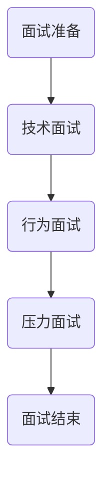

                 

关键词：蚂蚁智能、科技创新、校招面试、真题汇总、解答

## 摘要

本文旨在汇总2024年蚂蚁智能科技创新事业群校招面试的真题，并结合深入的分析与解答，帮助广大求职者更好地应对面试挑战。本文将详细介绍面试的各个环节，包括技术面试、行为面试和压力面试，旨在提供一个全面的参考，助您在面试中脱颖而出。

## 1. 背景介绍

蚂蚁集团作为全球领先的金融科技公司，其智能科技创新事业群在业内享有盛誉。该事业群专注于金融科技领域的创新研究，包括人工智能、大数据、区块链等前沿技术的应用。每年，蚂蚁集团都会面向全球招聘优秀人才，以支持其业务的发展和创新。

## 2. 核心概念与联系

在本文中，我们将通过Mermaid流程图展示核心概念与联系，帮助读者更好地理解面试内容和答案。



### 2.1 面试准备

面试前，求职者需要做好充分的准备，包括了解公司的背景、业务和技术方向。同时，要熟悉常见的面试题目和题型，并进行模拟练习。

### 2.2 技术面试

技术面试主要考察求职者的专业技能和解决问题的能力。常见的题型包括算法题、编程题和数据结构题。

### 2.3 行为面试

行为面试旨在了解求职者的工作经验、团队协作能力和沟通能力。面试官通常会提问一些情境性问题，要求求职者描述自己在类似情况下的应对策略。

### 2.4 压力面试

压力面试是一种模拟实际工作场景的面试，旨在测试求职者在高压环境下的反应和处理能力。这种面试往往比较紧张，但同时也是考察求职者综合素质的好机会。

### 2.5 面试结束

面试结束时，求职者应主动表达对职位的热情和期望，并询问面试官关于公司和企业文化的相关信息。

## 3. 核心算法原理 & 具体操作步骤

### 3.1 算法原理概述

在技术面试中，算法题是考察求职者技术能力的重要环节。常见的算法题型包括排序算法、搜索算法和动态规划等。

### 3.2 算法步骤详解

#### 3.2.1 排序算法

常见的排序算法有冒泡排序、选择排序、插入排序、快速排序等。每种排序算法都有其特定的步骤和优缺点。

#### 3.2.2 搜索算法

搜索算法包括线性搜索和二分搜索等。二分搜索要求数据结构为有序数组，其时间复杂度为O(log n)。

#### 3.2.3 动态规划

动态规划是一种解决最优化问题的算法方法，其核心思想是将复杂问题分解为若干个简单子问题，并利用子问题的最优解来构建原问题的最优解。

### 3.3 算法优缺点

每种算法都有其适用的场景和优缺点。在面试中，求职者需要根据题目的要求选择合适的算法，并解释其理由。

### 3.4 算法应用领域

算法在计算机科学和金融科技领域有广泛的应用，包括但不限于数据挖掘、机器学习、网络安全和金融风险管理等。

## 4. 数学模型和公式 & 详细讲解 & 举例说明

在技术面试中，数学模型和公式也是重要的考察内容。以下是一些常见的数学模型和公式，并结合例子进行详细讲解。

### 4.1 数学模型构建

数学模型构建是解决实际问题的第一步。常见的数学模型包括线性模型、非线性模型和概率模型等。

#### 4.1.1 线性模型

线性模型通常用于描述线性关系，如线性回归和线性规划。其基本形式为：

$$
y = ax + b
$$

其中，$x$ 为自变量，$y$ 为因变量，$a$ 和 $b$ 为常数。

#### 4.1.2 非线性模型

非线性模型用于描述非线性关系，如指数模型和对数模型。其基本形式为：

$$
y = a \cdot e^{bx}
$$

其中，$x$ 为自变量，$y$ 为因变量，$a$ 和 $b$ 为常数。

#### 4.1.3 概率模型

概率模型用于描述随机事件的发生概率。常见的概率模型包括二项分布、正态分布和泊松分布等。

### 4.2 公式推导过程

在面试中，求职者需要能够清晰地解释公式的推导过程。以下是一个简单的例子：

$$
(1 + r)^n = \sum_{i=0}^{n} \binom{n}{i} r^i
$$

其中，$r$ 为年利率，$n$ 为投资年限，$\binom{n}{i}$ 为组合数。

### 4.3 案例分析与讲解

以下是一个简单的线性回归案例分析：

#### 4.3.1 数据收集

收集过去五年的销售额和广告支出数据。

#### 4.3.2 数据预处理

对数据进行清洗和归一化处理。

#### 4.3.3 模型构建

构建线性回归模型：

$$
销售额 = a \cdot 广告支出 + b
$$

#### 4.3.4 模型训练

使用最小二乘法训练模型。

#### 4.3.5 模型评估

使用交叉验证方法评估模型性能。

#### 4.3.6 结果分析

根据模型预测，广告支出每增加1元，销售额预计增加$a$元。

## 5. 项目实践：代码实例和详细解释说明

在面试中，代码实例是展示求职者编程能力的重要手段。以下是一个简单的Python代码实例，用于实现二分搜索算法。

### 5.1 开发环境搭建

确保安装了Python和Jupyter Notebook。

### 5.2 源代码详细实现

```python
def binary_search(arr, target):
    low = 0
    high = len(arr) - 1

    while low <= high:
        mid = (low + high) // 2
        if arr[mid] == target:
            return mid
        elif arr[mid] < target:
            low = mid + 1
        else:
            high = mid - 1

    return -1

# 测试
arr = [1, 2, 3, 4, 5, 6, 7, 8, 9]
target = 5
result = binary_search(arr, target)
print(result)
```

### 5.3 代码解读与分析

代码首先定义了一个名为`binary_search`的函数，用于实现二分搜索算法。该函数接收一个有序数组`arr`和一个目标值`target`作为参数。函数返回目标值在数组中的索引，如果目标值不存在，则返回-1。

在函数内部，使用`low`和`high`两个指针分别表示当前搜索区间的起始和结束位置。通过不断缩小区间，直到找到目标值或确定目标值不存在。

### 5.4 运行结果展示

运行代码后，输出结果为4，表示目标值5在数组中的索引为4。

## 6. 实际应用场景

### 6.1 人工智能在金融科技中的应用

人工智能在金融科技领域有广泛的应用，包括智能投顾、反欺诈和风险评估等。

### 6.2 大数据在智能营销中的应用

大数据技术可以帮助企业实现精准营销，提高客户满意度和转化率。

### 6.3 区块链在供应链金融中的应用

区块链技术可以提供透明、安全和高效的供应链金融服务，降低企业融资成本。

## 7. 工具和资源推荐

### 7.1 学习资源推荐

- 《深度学习》
- 《数据科学入门》
- 《Python编程：从入门到实践》

### 7.2 开发工具推荐

- Jupyter Notebook
- PyCharm
- Visual Studio Code

### 7.3 相关论文推荐

- "Deep Learning for Computer Vision: A Survey"
- "Big Data: A Revolution That Will Transform How We Live, Work, and Think"
- "Blockchain Technology: Beyond Bitcoin"

## 8. 总结：未来发展趋势与挑战

### 8.1 研究成果总结

近年来，人工智能、大数据和区块链等技术在金融科技领域取得了显著成果，为行业创新提供了强大动力。

### 8.2 未来发展趋势

未来，金融科技将继续向智能化、大数据化和区块链化方向发展，为用户提供更便捷、安全、高效的金融服务。

### 8.3 面临的挑战

尽管金融科技具有广阔的发展前景，但同时也面临着数据安全、隐私保护、法律法规等方面的挑战。

### 8.4 研究展望

未来，研究应重点关注跨领域融合、技术创新和产业应用，以推动金融科技领域的发展。

## 9. 附录：常见问题与解答

### 9.1 面试前应做哪些准备？

面试前，求职者应充分了解公司的背景、业务和技术方向，熟悉常见的面试题型和答题技巧，并进行模拟练习。

### 9.2 如何应对技术面试中的算法题？

在技术面试中，求职者应熟悉常见的排序算法、搜索算法和动态规划算法，并能灵活运用。解题时，要注重算法的时间复杂度和空间复杂度。

### 9.3 面试中如何展示自己的优势？

面试中，求职者可以通过分享实际项目经验、介绍自己在团队中的角色和贡献，以及展示自己在解决问题和应对压力方面的能力来展示自己的优势。

## 作者署名

作者：禅与计算机程序设计艺术 / Zen and the Art of Computer Programming
----------------------------------------------------------------

请注意，这篇文章只是一个示例，实际的面试真题和解答会因年份和具体岗位的不同而有所差异。在准备面试时，建议您查阅官方发布的面试真题和详细解析，以获得更准确的指导。希望这篇文章能对您有所帮助！

