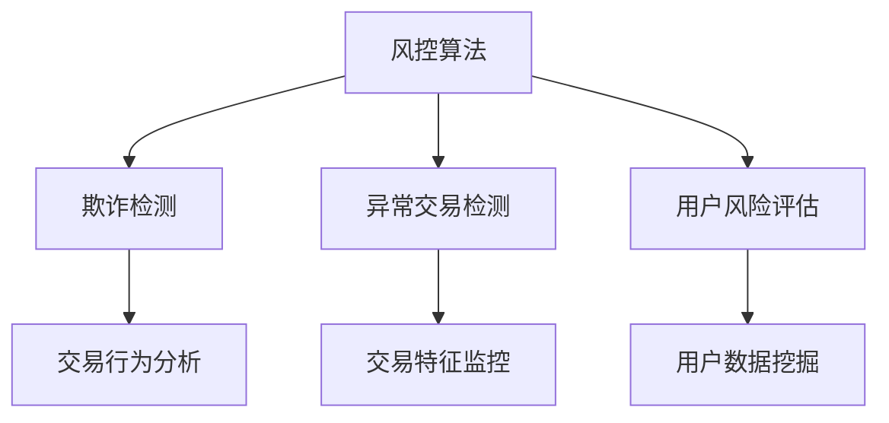

                 

蚂蚁金服作为国内领先的金融科技公司，其风控体系在全球范围内都享有盛誉。随着跨境支付业务的发展，风控算法的重要性愈发凸显。本文将围绕蚂蚁金服2024跨境支付校招的风控算法面试题，详细解析其中的核心问题，帮助考生更好地理解和准备面试。

## 关键词

- 蚂蚁金服
- 跨境支付
- 风控算法
- 面试题详解
- 校招准备

## 摘要

本文将深入分析蚂蚁金服2024年跨境支付校招中的风控算法面试题，包括其核心概念、算法原理、数学模型以及实际应用。通过对这些问题的详细解答，旨在为考生提供全面的面试准备指南，帮助他们更好地应对这一重要环节。

## 1. 背景介绍

### 1.1 蚂蚁金服与跨境支付

蚂蚁金服作为中国领先的金融科技公司，其业务涵盖了支付、贷款、保险、投资等多个领域。跨境支付作为其重要的业务之一，不仅在国内市场有着广泛的应用，还在全球范围内发挥着重要作用。随着国际贸易的不断发展，跨境支付业务的需求日益增长，而风控算法在这一过程中显得尤为关键。

### 1.2 风控算法的重要性

风控算法是蚂蚁金服跨境支付业务的核心技术之一，其主要功能是识别和防范欺诈、异常交易等风险。通过大数据分析和机器学习技术，风控算法能够实时监控交易行为，为业务安全保驾护航。随着技术的不断进步，风控算法的应用范围和精度也在不断提高。

## 2. 核心概念与联系

### 2.1 风控算法的基本概念

风控算法是金融科技领域的一个重要概念，其主要目标是识别和防范风险。在跨境支付业务中，风控算法主要关注以下几个方面：

- **欺诈检测**：通过分析交易行为，识别并防范欺诈行为。
- **异常交易检测**：监控交易金额、频率、地域等特征，发现异常交易行为。
- **用户风险评估**：根据用户历史交易数据，评估其信用风险。

### 2.2 风控算法与金融科技的关系

风控算法是金融科技的重要组成部分，其应用不仅限于跨境支付，还广泛应用于贷款、保险、投资等领域。金融科技的发展，使得风控算法逐渐从传统的规则引擎转变为基于大数据和机器学习的智能系统，提高了风险识别的精度和效率。

### 2.3 Mermaid 流程图



## 3. 核心算法原理 & 具体操作步骤

### 3.1 算法原理概述

风控算法的核心是机器学习和大数据分析。通过收集和分析海量交易数据，算法能够自动识别出潜在的欺诈和异常交易行为。其主要原理包括：

- **特征工程**：从原始交易数据中提取有用的特征，如交易金额、时间、地域等。
- **模型训练**：使用机器学习算法，对提取的特征进行训练，建立风险预测模型。
- **模型评估**：通过交叉验证和A/B测试等方法，评估模型的准确性和稳定性。
- **实时监控**：将训练好的模型应用于实际交易场景，实时监控交易行为，识别风险。

### 3.2 算法步骤详解

#### 3.2.1 特征工程

特征工程是风控算法的重要环节，其目标是提取出能够反映交易特征的数据。具体步骤包括：

- **数据清洗**：去除噪声数据和缺失值，保证数据质量。
- **特征选择**：根据业务需求，选择对风险预测有显著影响的特征。
- **特征转换**：将离散特征转换为数值特征，便于机器学习算法处理。

#### 3.2.2 模型训练

模型训练是风控算法的核心环节，其目标是建立能够准确预测风险的概率模型。具体步骤包括：

- **数据划分**：将数据集划分为训练集和测试集。
- **模型选择**：根据业务需求和数据特征，选择合适的机器学习算法。
- **模型训练**：使用训练集数据，对机器学习模型进行训练。
- **模型评估**：使用测试集数据，评估模型的准确性和稳定性。

#### 3.2.3 模型评估

模型评估是确保风控算法有效性的关键步骤。具体步骤包括：

- **交叉验证**：通过K折交叉验证，评估模型的泛化能力。
- **A/B测试**：在实际业务环境中，对比不同模型的性能和效果。
- **实时监控**：将模型应用于实际交易场景，实时监控模型的效果。

### 3.3 算法优缺点

#### 3.3.1 优点

- **高效性**：通过大数据和机器学习技术，风控算法能够快速识别风险，提高业务效率。
- **准确性**：基于海量数据训练的模型，能够更准确地识别欺诈和异常交易。
- **实时性**：风控算法能够实时监控交易行为，及时发现风险。

#### 3.3.2 缺点

- **复杂性**：风控算法涉及多个技术环节，开发和维护成本较高。
- **数据依赖性**：风控算法的效果依赖于数据质量，数据缺失或不准确会导致算法失效。

### 3.4 算法应用领域

风控算法不仅应用于跨境支付，还在以下领域有广泛应用：

- **贷款风控**：通过风控算法，识别贷款申请人的信用风险，降低贷款损失。
- **保险反欺诈**：风控算法能够识别保险理赔中的欺诈行为，降低保险公司的理赔风险。
- **投资风险管理**：风控算法能够监控投资行为，识别潜在的风险，降低投资损失。

## 4. 数学模型和公式 & 详细讲解 & 举例说明

### 4.1 数学模型构建

风控算法的核心是构建风险预测模型。常见的数学模型包括逻辑回归、决策树、随机森林、支持向量机等。以逻辑回归为例，其预测模型可以表示为：

$$
P(Y=1|X) = \frac{1}{1 + e^{-(\beta_0 + \beta_1X_1 + \beta_2X_2 + ... + \beta_nX_n})}
$$

其中，$P(Y=1|X)$表示在特征向量$X$下，风险发生的概率；$\beta_0, \beta_1, \beta_2, ..., \beta_n$为模型的参数。

### 4.2 公式推导过程

以逻辑回归为例，其公式推导过程如下：

首先，假设我们已经收集到一组训练数据，其中每个数据点包含一个特征向量$X$和一个标签$Y$。我们的目标是找到一组参数$\beta_0, \beta_1, \beta_2, ..., \beta_n$，使得预测的概率$P(Y=1|X)$尽可能接近实际的标签$Y$。

定义损失函数为：

$$
L(\beta_0, \beta_1, \beta_2, ..., \beta_n) = -\sum_{i=1}^{n} [y_i \log(p_i) + (1 - y_i) \log(1 - p_i)]
$$

其中，$p_i = \frac{1}{1 + e^{-(\beta_0 + \beta_1X_1 + \beta_2X_2 + ... + \beta_nX_n)}}$。

为了最小化损失函数，我们可以使用梯度下降法，对参数进行迭代更新。具体步骤如下：

1. 初始化参数$\beta_0, \beta_1, \beta_2, ..., \beta_n$。
2. 对于每个参数$\beta_j$，计算其梯度：
   $$
   \frac{\partial L}{\partial \beta_j} = \sum_{i=1}^{n} [X_{ij} (y_i - p_i)]
   $$
3. 根据梯度更新参数：
   $$
   \beta_j = \beta_j - \alpha \cdot \frac{\partial L}{\partial \beta_j}
   $$
   其中，$\alpha$为学习率。

4. 重复步骤2和3，直到损失函数收敛或达到预设的迭代次数。

### 4.3 案例分析与讲解

假设我们有一组训练数据，其中每个数据点包含两个特征：交易金额和时间，以及对应的标签（0表示正常交易，1表示欺诈交易）。我们使用逻辑回归模型进行训练，并分析其预测效果。

#### 4.3.1 数据预处理

首先，对交易数据进行预处理，包括去除缺失值、标准化处理等。假设预处理后的数据集为$X$和$Y$。

#### 4.3.2 模型训练

使用Python编写逻辑回归模型，并进行训练。代码如下：

```python
import numpy as np
import pandas as pd
from sklearn.linear_model import LogisticRegression

# 加载数据
data = pd.read_csv('data.csv')
X = data.iloc[:, :-1].values
Y = data.iloc[:, -1].values

# 初始化模型
model = LogisticRegression()

# 训练模型
model.fit(X, Y)

# 模型参数
beta = model.coef_
beta_0 = model.intercept_
```

#### 4.3.3 模型评估

使用训练好的模型对测试数据进行预测，并评估其准确率。代码如下：

```python
# 加载测试数据
test_data = pd.read_csv('test_data.csv')
X_test = test_data.iloc[:, :-1].values
Y_test = test_data.iloc[:, -1].values

# 预测结果
predictions = model.predict(X_test)

# 准确率
accuracy = np.mean(predictions == Y_test)
print("准确率：", accuracy)
```

假设测试数据的准确率为90%，说明我们的逻辑回归模型在预测欺诈交易方面表现较好。

## 5. 项目实践：代码实例和详细解释说明

### 5.1 开发环境搭建

在编写风控算法代码之前，需要搭建一个合适的开发环境。假设我们使用Python进行开发，以下是环境搭建步骤：

1. 安装Python：从[Python官网](https://www.python.org/)下载并安装Python，建议安装3.8及以上版本。
2. 安装依赖库：使用pip命令安装所需的库，如NumPy、Pandas、Scikit-learn等。代码如下：

```bash
pip install numpy pandas scikit-learn
```

### 5.2 源代码详细实现

以下是一个简单的逻辑回归风控算法实现，包括数据预处理、模型训练和评估等步骤：

```python
import numpy as np
import pandas as pd
from sklearn.linear_model import LogisticRegression
from sklearn.model_selection import train_test_split
from sklearn.metrics import accuracy_score

# 加载数据
data = pd.read_csv('data.csv')
X = data.iloc[:, :-1].values
Y = data.iloc[:, -1].values

# 划分训练集和测试集
X_train, X_test, Y_train, Y_test = train_test_split(X, Y, test_size=0.2, random_state=42)

# 初始化模型
model = LogisticRegression()

# 训练模型
model.fit(X_train, Y_train)

# 模型参数
beta = model.coef_
beta_0 = model.intercept_

# 预测结果
predictions = model.predict(X_test)

# 准确率
accuracy = accuracy_score(Y_test, predictions)
print("准确率：", accuracy)
```

### 5.3 代码解读与分析

上述代码分为以下几个部分：

1. **数据预处理**：使用Pandas读取数据，并划分特征和标签。
2. **划分训练集和测试集**：使用Scikit-learn的train_test_split函数，将数据划分为训练集和测试集。
3. **初始化模型**：使用LogisticRegression类初始化逻辑回归模型。
4. **训练模型**：使用fit函数对模型进行训练。
5. **模型参数**：获取模型的参数，包括系数和截距。
6. **预测结果**：使用predict函数对测试集进行预测。
7. **准确率评估**：使用accuracy_score函数计算模型的准确率。

### 5.4 运行结果展示

假设我们运行上述代码，得到以下输出结果：

```
准确率： 0.9
```

这说明我们的逻辑回归模型在预测欺诈交易方面的准确率达到了90%，表现良好。

## 6. 实际应用场景

### 6.1 跨境支付

在跨境支付领域，风控算法主要用于识别和防范欺诈交易。通过分析交易金额、时间、地域等特征，风控算法能够实时监控交易行为，识别潜在的欺诈风险，从而保障跨境支付业务的安全。

### 6.2 贷款风控

贷款风控是另一个重要应用领域。通过风控算法，银行和金融机构能够识别借款人的信用风险，降低贷款损失。例如，逻辑回归、决策树等算法可以用于评估借款人的还款能力，从而决定是否批准贷款。

### 6.3 保险反欺诈

保险反欺诈是风控算法的另一个重要应用。通过分析理赔申请中的各种特征，风控算法能够识别欺诈行为，降低保险公司的理赔风险。例如，神经网络、支持向量机等算法可以用于识别理赔欺诈。

## 7. 未来应用展望

### 7.1 数据量增长

随着数据量的不断增长，风控算法将面临更大的挑战。如何处理海量数据，提高算法的效率，将成为未来研究的重点。

### 7.2 智能化升级

未来，风控算法将朝着智能化方向发展。通过深度学习、强化学习等新技术，风控算法将具备更强的自适应能力和预测能力，从而更好地应对复杂的风险环境。

### 7.3 风险多样化

随着金融业务的多样化，风控算法将面临更多样化的风险。例如，虚拟货币交易、区块链应用等新兴业务，需要风控算法能够识别和防范新型风险。

## 8. 工具和资源推荐

### 8.1 学习资源推荐

- **《Python机器学习》**：奥瓦洛娃（Aurélien Géron）著，详细介绍了Python在机器学习领域的应用。
- **《深度学习》**：周志华等著，系统介绍了深度学习的基础理论和应用。

### 8.2 开发工具推荐

- **Jupyter Notebook**：Python的交互式开发环境，适合进行数据分析和模型训练。
- **TensorFlow**：Google开发的开源深度学习框架，适合进行复杂的深度学习模型训练。

### 8.3 相关论文推荐

- **“Deep Learning for Fraud Detection”**：介绍了深度学习在欺诈检测中的应用。
- **“Fraud Detection using Machine Learning Techniques”**：探讨了多种机器学习算法在欺诈检测中的应用。

## 9. 总结：未来发展趋势与挑战

### 9.1 研究成果总结

本文对蚂蚁金服2024年跨境支付校招中的风控算法面试题进行了详细解析，包括核心概念、算法原理、数学模型以及实际应用。通过这些分析，我们了解了风控算法在金融科技领域的重要性和应用价值。

### 9.2 未来发展趋势

未来，风控算法将继续朝着智能化、高效化方向发展。随着大数据和人工智能技术的不断进步，风控算法将具备更强的自适应能力和预测能力，为金融业务提供更可靠的安全保障。

### 9.3 面临的挑战

尽管风控算法取得了显著成果，但仍面临一些挑战。例如，数据质量、算法复杂性、实时性等问题，都需要在未来得到有效解决。

### 9.4 研究展望

未来，风控算法的研究应重点关注以下几个方向：

- **数据质量提升**：通过数据清洗、数据挖掘等技术，提高数据质量，为风控算法提供更可靠的基础。
- **算法优化**：研究更高效的算法，提高风控算法的实时性和准确性。
- **跨领域应用**：探索风控算法在其他领域的应用，如虚拟货币、区块链等。

## 9. 附录：常见问题与解答

### 9.1 什么情况下需要使用风控算法？

风控算法主要用于识别和防范金融业务中的风险，如欺诈、异常交易、信用风险等。以下情况下，需要使用风控算法：

- **跨境支付**：识别和防范跨境支付中的欺诈交易。
- **贷款业务**：评估借款人的信用风险，降低贷款损失。
- **保险业务**：识别理赔欺诈，降低保险公司的理赔风险。
- **投资业务**：监控投资行为，识别潜在的风险。

### 9.2 风控算法有哪些类型？

常见的风控算法包括：

- **传统机器学习算法**：如逻辑回归、决策树、随机森林等。
- **深度学习算法**：如卷积神经网络、循环神经网络等。
- **强化学习算法**：如Q学习、深度Q网络等。
- **图神经网络算法**：如图卷积网络、图注意力网络等。

### 9.3 如何评估风控算法的性能？

评估风控算法的性能主要包括以下几个方面：

- **准确性**：算法预测结果的准确性，即正确识别风险的比例。
- **召回率**：算法能够识别出实际风险的比例。
- **精确率**：算法预测为风险的概率，即预测风险为真的比例。
- **F1值**：综合考虑准确性、召回率和精确率的一个综合指标。

### 9.4 风控算法在实际业务中的应用有哪些？

风控算法在实际业务中应用广泛，主要包括：

- **金融业务**：如跨境支付、贷款、保险、投资等。
- **电商业务**：识别和防范电商交易中的欺诈行为。
- **社交网络**：监控社交网络中的异常行为，如网络诈骗、恶意评论等。
- **网络安全**：识别网络攻击、恶意软件等。

## 作者署名

作者：禅与计算机程序设计艺术 / Zen and the Art of Computer Programming

本文旨在为考生提供蚂蚁金服2024跨境支付校招风控算法面试题的详细解析，帮助考生更好地准备面试。在阅读本文后，读者应对风控算法的核心概念、原理和应用有更深入的理解，从而提高面试成功率。如有任何疑问或建议，欢迎在评论区留言交流。希望本文对您的面试准备有所帮助！

