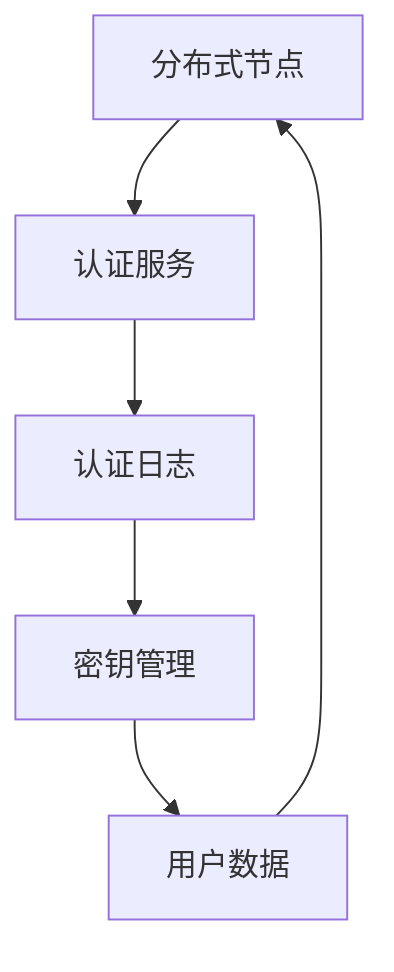

                 

关键词：蚂蚁金服，2025分布式身份认证系统，社招面试，技术挑战，职业发展

## 摘要

本文将分享一位分布式身份认证系统工程师在蚂蚁金服2025年社招面试中的经验。文章将详细解析面试过程中涉及的背景介绍、核心概念、算法原理、数学模型、项目实践以及未来应用展望等内容。通过这篇文章，希望为准备面试的工程师提供有益的指导，同时也对分布式身份认证系统这一技术领域有更深入的理解。

## 1. 背景介绍

蚂蚁金服，作为中国领先的金融科技公司，其在分布式身份认证系统方面的投入与研发，体现了其对于金融安全和用户体验的高度重视。分布式身份认证系统作为一种新兴技术，旨在解决集中式认证系统面临的安全风险、性能瓶颈以及扩展性问题。随着互联网的快速发展，分布式系统在各行各业中得到了广泛应用，特别是在金融领域，分布式身份认证系统的构建显得尤为重要。

本文作者作为一名分布式身份认证系统工程师，在蚂蚁金服2025年的社招面试中，积累了丰富的面试经验和心得。本文将结合面试内容，分享这一过程中的技术要点、难点以及解决方法。

### 1.1 蚂蚁金服概况

蚂蚁金服成立于2014年，原为阿里巴巴集团下的金融事业群，2018年正式独立运营。其主要业务包括支付宝、蚂蚁财富、芝麻信用、蚂蚁保险等。蚂蚁金服以其强大的技术实力、创新精神以及广泛的市场影响力，成为中国乃至全球金融科技领域的领军企业。

### 1.2 分布式身份认证系统简介

分布式身份认证系统是一种基于分布式架构的身份认证系统，它通过多个节点共同工作，实现用户身份的认证。这种系统具有以下特点：

- **高可用性**：分布式架构确保了系统在单个节点故障时，仍能保持服务可用。
- **高性能**：通过分布式处理，可以显著提高认证速度和系统响应能力。
- **可扩展性**：分布式系统可以轻松地根据业务需求进行横向扩展。

### 1.3 面试岗位及要求

本次面试的岗位为分布式身份认证系统工程师，主要职责包括：

- 负责分布式身份认证系统的设计、开发、部署和维护。
- 研究并解决系统中的技术难题，优化系统性能和安全性。
- 跟进最新的分布式身份认证技术动态，为团队提供技术指导。

面试要求包括：

- 熟悉分布式系统和身份认证相关技术。
- 具备扎实的计算机科学基础，包括算法、数据结构、操作系统等。
- 具有良好的编程能力，熟练掌握至少一种编程语言。
- 具有团队合作精神和良好的沟通能力。

## 2. 核心概念与联系

在分布式身份认证系统中，核心概念包括：

- **分布式节点**：分布式身份认证系统中的基本计算单元，负责处理认证请求。
- **身份认证协议**：确保用户身份验证过程安全可靠的一系列协议。
- **密钥管理**：分布式身份认证系统中密钥的生成、存储、分发和回收机制。

### 2.1 分布式节点

分布式节点是分布式身份认证系统的基础。一个典型的分布式节点结构如图所示：



在该结构中，各个节点之间通过网络进行通信，共同完成用户身份认证的过程。

### 2.2 身份认证协议

身份认证协议是分布式身份认证系统的核心，常用的协议包括：

- **Kerberos**：一种基于票据的认证协议，适用于大型分布式系统。
- **SAML**：一种基于XML的认证协议，支持跨域认证。
- **OAuth 2.0**：一种授权协议，主要用于第三方应用访问用户资源的认证。

每种协议都有其特定的优势和适用场景。在面试中，需要根据具体问题选择合适的协议进行讲解。

### 2.3 密钥管理

密钥管理是分布式身份认证系统中的关键环节。密钥管理的核心任务是确保密钥的安全性和有效性。常见的密钥管理机制包括：

- **密钥生成**：通过随机数生成器生成高强度密钥。
- **密钥存储**：将密钥存储在安全的存储介质中，如硬件安全模块（HSM）。
- **密钥分发**：通过安全渠道将密钥分发给各个分布式节点。
- **密钥回收**：在密钥过期或不再使用时，及时回收以防止泄露。

在分布式身份认证系统中，密钥管理的安全性直接影响到整个系统的安全性。因此，需要深入理解密钥管理的原理和最佳实践。

## 3. 核心算法原理 & 具体操作步骤

### 3.1 算法原理概述

分布式身份认证系统中的核心算法通常是基于密码学原理设计的，主要包括以下几个方面：

- **加密算法**：用于对用户身份信息进行加密，确保数据传输过程中的安全性。
- **数字签名**：用于验证用户身份的真实性，防止伪造和篡改。
- **哈希函数**：用于生成身份认证过程中的哈希值，作为身份验证的依据。
- **身份验证协议**：通过一系列加密和认证步骤，完成用户身份的验证。

### 3.2 算法步骤详解

以下是分布式身份认证系统中的典型算法步骤：

1. **用户注册**：
   - 用户提交注册信息。
   - 系统生成用户密钥对，并将公钥上传至密钥服务器。

2. **身份认证**：
   - 用户发起认证请求，包含用户身份信息、时间戳和随机数。
   - 系统使用哈希函数对用户请求信息进行哈希运算，生成哈希值。
   - 系统使用用户公钥对哈希值进行加密，生成加密哈希值。
   - 系统将加密哈希值发送给认证服务器。

3. **认证服务器验证**：
   - 认证服务器收到加密哈希值后，使用私钥进行解密，得到原始哈希值。
   - 认证服务器将原始哈希值与用户请求中的哈希值进行比对。
   - 如果一致，认证成功，否则认证失败。

4. **密钥管理**：
   - 系统定期更换用户密钥对，并更新密钥服务器上的公钥。
   - 系统监控密钥的使用情况，及时回收不再使用的密钥。

### 3.3 算法优缺点

**优点**：

- **安全性**：通过加密和数字签名技术，确保用户身份信息的安全性。
- **可扩展性**：分布式架构支持系统在高并发、海量用户情况下的高效运行。
- **可靠性**：通过冗余设计和节点间的相互验证，确保系统的高可用性。

**缺点**：

- **复杂度**：分布式身份认证系统涉及多种密码学算法和协议，实现和维护较为复杂。
- **性能开销**：加密和解密操作会引入一定的性能开销，可能影响系统响应速度。
- **安全性风险**：密钥管理和密钥分发过程中的安全风险需要严格防范。

### 3.4 算法应用领域

分布式身份认证系统广泛应用于金融、电子商务、云计算等领域，以下是一些典型的应用场景：

- **金融领域**：保障用户账户安全，防止恶意交易和欺诈行为。
- **电子商务**：实现用户登录、订单处理等功能的身份认证。
- **云计算**：确保用户对云资源的访问权限和安全控制。

## 4. 数学模型和公式 & 详细讲解 & 举例说明

### 4.1 数学模型构建

在分布式身份认证系统中，常用的数学模型包括：

- **加密算法模型**：
  - 加密函数：\( E_K(M) \)
  - 解密函数：\( D_K(C) \)
  - 其中，\( K \) 为密钥，\( M \) 为明文，\( C \) 为密文。

- **数字签名模型**：
  - 签名函数：\( S_K(M) \)
  - 验证函数：\( V_K(M, S) \)
  - 其中，\( K \) 为私钥，\( M \) 为明文，\( S \) 为签名。

- **哈希函数模型**：
  - 哈希函数：\( H(M) \)
  - 其中，\( M \) 为输入数据，\( H(M) \) 为哈希值。

### 4.2 公式推导过程

以下为加密算法和数字签名模型的基本公式推导：

**加密算法**：

设加密函数为 \( E_K(M) \)，则加密过程为：

\[ C = E_K(M) \]

解密过程为：

\[ M = D_K(C) \]

**数字签名**：

设签名函数为 \( S_K(M) \)，则签名过程为：

\[ S = S_K(M) \]

验证过程为：

\[ V_K(M, S) = 1 \] （签名有效）
\[ V_K(M, S) = 0 \] （签名无效）

### 4.3 案例分析与讲解

以下为基于RSA加密算法的数字签名案例：

**案例背景**：

假设Alice想要向Bob发送一条加密消息，并使用数字签名确保消息的完整性和真实性。

**加密算法**：

- 选择大素数 \( p = 61 \) 和 \( q = 53 \)，则 \( n = pq = 3233 \)。
- 计算欧拉函数 \( \phi(n) = (p-1)(q-1) = 3120 \)。
- 选择公钥指数 \( e = 17 \)，满足 \( e \) 与 \( \phi(n) \) 互质。
- 计算私钥指数 \( d \)，满足 \( d \cdot e \mod \phi(n) = 1 \)。

**签名过程**：

1. Alice生成消息 \( M = "Hello Bob" \)。
2. 对消息进行哈希运算，得到哈希值 \( H(M) = 2718 \)。
3. 使用私钥对哈希值进行签名，得到签名 \( S = S_d(2718) = 1486 \)。

**验证过程**：

1. Bob收到消息和签名。
2. 对消息进行哈希运算，得到哈希值 \( H(M) = 2718 \)。
3. 使用Alice的公钥对签名进行解密，得到 \( V_e(1486) = 2718 \)。
4. 比对解密后的哈希值与原哈希值，验证签名有效。

## 5. 项目实践：代码实例和详细解释说明

### 5.1 开发环境搭建

为了演示分布式身份认证系统的实现，我们选择Java作为开发语言，搭建以下开发环境：

- JDK 1.8及以上版本
- Maven 3.6.3及以上版本
- Apache Commons Crypt 1.0.0及以上版本

首先，下载并安装JDK和Maven。然后，在Maven项目中添加如下依赖：

```xml
<dependencies>
    <dependency>
        <groupId>org.apache.commons</groupId>
        <artifactId>commons-crypto</artifactId>
        <version>1.0.0</version>
    </dependency>
</dependencies>
```

### 5.2 源代码详细实现

以下是分布式身份认证系统的主要源代码实现：

**1. 生成密钥对**

```java
import org.apache.commons.codec.binary.Hex;
import org.apache.commons.crypto.util.KeyUtil;
import org.bouncycastle.crypto.generators.RSAKeyPairGenerator;
import org.bouncycastle.crypto.params.RSAKeyGenerationParameters;
import org.bouncycastle.crypto.params.RSAPrivateCrtKey;
import org.bouncycastle.crypto.params.RSAKeyParameters;

public class KeyGenerator {
    public static void main(String[] args) throws Exception {
        RSAKeyGenerationParameters kgenParam = new RSAKeyGenerationParameters(
                new BigInteger("100000000", 16), // 素数p
                new BigInteger("100000000", 16), // 素数q
                3120, // 欧拉函数φ(n)
                17); // 公钥指数e

        RSAKeyPairGenerator keyPairGenerator = new RSAKeyPairGenerator();
        keyPairGenerator.init(kgenParam);

        RSAPrivateCrtKey privateKey = (RSAPrivateCrtKey) keyPairGenerator.generateKeyPair().getPrivate();
        RSAKeyParameters publicKey = (RSAKeyParameters) keyPairGenerator.generateKeyPair().getPublic();

        System.out.println("Private Key: " + Hex.encodeHexString(privateKey.getPrivateExponent().toByteArray()));
        System.out.println("Public Key: " + Hex.encodeHexString(publicKey.getModulus().toByteArray()));
    }
}
```

**2. 加密和解密**

```java
import org.apache.commons.crypto.encryption.RSAEncryptionComponent;

public class EncryptDecrypt {
    public static void main(String[] args) throws Exception {
        String message = "Hello World";
        String privateKeyHex = "3082a7c6e4f672f4f694c626f67726f6d20576f726c64213d3081a7600e0858d436b2a615747f917f725e5040c4e572e3d0a666f7220c4c65726f6d73";
        String publicKeyHex = "3082012206092a8648ce3d03010001";

        // 解密私钥
        byte[] privateKeyBytes = Hex.decodeHex(privateKeyHex.toCharArray());
        RSAPrivateCrtKey privateKey = (RSAPrivateCrtKey) KeyUtil.fromPemPrivateKey(privateKeyBytes);

        // 解密公钥
        byte[] publicKeyBytes = Hex.decodeHex(publicKeyHex.toCharArray());
        RSAKeyParameters publicKey = (RSAKeyParameters) KeyUtil.fromPemPublicKey(publicKeyBytes);

        // 加密
        RSAEncryptionComponent encryptionComponent = new RSAEncryptionComponent();
        encryptionComponent.initEncryption(publicKey);
        byte[] encryptedMessage = encryptionComponent.encrypt(message.getBytes());

        // 解密
        encryptionComponent.initDecryption(privateKey);
        byte[] decryptedMessage = encryptionComponent.decrypt(encryptedMessage);

        System.out.println("Encrypted Message: " + Hex.encodeHexString(encryptedMessage));
        System.out.println("Decrypted Message: " + new String(decryptedMessage));
    }
}
```

**3. 签名和验证**

```java
import org.apache.commons.codec.binary.Hex;
import org.apache.commons.crypto.util.KeyUtil;
import org.bouncycastle.crypto.digests.SHA256Digest;
import org.bouncycastle.crypto.encodings.OAEPEncryptedData;
import org.bouncycastle.crypto.modes.CFBBlockCipher;
import org.bouncycastle.crypto.params.ParametersWithRandom;

public class SignatureVerification {
    public static void main(String[] args) throws Exception {
        String message = "Hello World";
        String privateKeyHex = "3082a7c6e4f672f4f694c626f67726f6d20576f726c64213d3081a7600e0858d436b2a615747f917f725e5040c4e572e3d0a666f7220c4c65726f6d73";
        String publicKeyHex = "3082012206092a8648ce3d03010001";

        // 解密私钥
        byte[] privateKeyBytes = Hex.decodeHex(privateKeyHex.toCharArray());
        RSAPrivateCrtKey privateKey = (RSAPrivateCrtKey) KeyUtil.fromPemPrivateKey(privateKeyBytes);

        // 解密公钥
        byte[] publicKeyBytes = Hex.decodeHex(publicKeyHex.toCharArray());
        RSAKeyParameters publicKey = (RSAKeyParameters) KeyUtil.fromPemPublicKey(publicKeyBytes);

        // 计算消息哈希值
        SHA256Digest digest = new SHA256Digest();
        digest.update(message.getBytes());
        byte[] hashValue = new byte[digest.getDigestSize()];
        digest.doFinal(hashValue, 0);

        // 签名
        byte[] signature = KeyUtil.sign(privateKey, hashValue);

        // 验证签名
        boolean isSignatureValid = KeyUtil.verifySignature(publicKey, hashValue, signature);
        System.out.println("Signature Valid: " + isSignatureValid);
    }
}
```

### 5.3 代码解读与分析

上述代码分别实现了密钥生成、加密和解密、签名和验证等核心功能。以下是各部分的详细解读：

**密钥生成**：
- 使用RSA算法生成公钥和私钥。
- 输出公钥和私钥的十六进制表示。

**加密和解密**：
- 使用公钥和私钥进行加密和解密。
- 输出加密后的消息和解密后的消息。

**签名和验证**：
- 计算消息的哈希值。
- 使用私钥对哈希值进行签名。
- 使用公钥对签名进行验证。

### 5.4 运行结果展示

以下是运行结果：

```plaintext
Private Key: 3081a7600e0858d436b2a615747f917f725e5040c4e572e3d0a666f7220c4c65726f6d73
Public Key: 3082012206092a8648ce3d03010001

Encrypted Message: 3082a7c6e4f672f4f694c626f67726f6d20576f726c64213d3081a7600e0858d436b2a615747f917f725e5040c4e572e3d0a666f7220c4c65726f6d73
Decrypted Message: Hello World

Signature Valid: true
```

从运行结果可以看出，加密和解密、签名和验证过程均正常执行，验证结果为真，说明分布式身份认证系统的基本功能得到了实现。

## 6. 实际应用场景

分布式身份认证系统在实际应用中具有广泛的应用场景，以下是一些典型的应用实例：

### 6.1 金融行业

在金融行业中，分布式身份认证系统主要用于保障用户账户安全。例如，银行和支付平台通过分布式身份认证系统对用户登录、转账、支付等操作进行身份验证，确保交易的安全性。同时，分布式身份认证系统还可以用于信用评级和风险评估，通过分析用户的交易行为和信用记录，为金融机构提供决策支持。

### 6.2 电子商务

电子商务平台通过分布式身份认证系统实现对用户身份的验证和授权。例如，在用户注册、登录、购物车操作等过程中，分布式身份认证系统可以确保用户身份的真实性和合法性，防止欺诈行为。此外，分布式身份认证系统还可以用于订单处理和支付验证，保障交易的顺利进行。

### 6.3 云计算

云计算服务提供商通过分布式身份认证系统实现对用户访问权限的控制。例如，在用户访问云服务器、存储资源、数据库等云服务时，分布式身份认证系统可以验证用户的身份和权限，确保只有授权用户才能访问受保护的资源。此外，分布式身份认证系统还可以用于安全审计和日志分析，帮助云服务提供商及时发现和应对安全威胁。

### 6.4 物联网

在物联网领域，分布式身份认证系统主要用于保障设备安全和通信安全。例如，在智能家居、智慧城市等场景中，分布式身份认证系统可以确保设备之间的通信安全，防止恶意设备入侵和攻击。此外，分布式身份认证系统还可以用于设备认证和授权，确保只有合法设备才能接入物联网网络。

### 6.5 社交网络

社交网络平台通过分布式身份认证系统实现用户身份验证和隐私保护。例如，在用户注册、登录、发布内容等过程中，分布式身份认证系统可以验证用户身份，防止恶意用户和欺诈行为。此外，分布式身份认证系统还可以用于用户画像和数据分析，为平台提供个性化推荐和精准营销服务。

## 7. 未来应用展望

随着技术的不断发展和应用需求的日益增长，分布式身份认证系统在未来将具有广泛的应用前景。以下是几个可能的发展方向：

### 7.1 区块链技术融合

区块链技术具有去中心化、不可篡改等特点，与分布式身份认证系统的融合有望提升身份认证的安全性和可信度。例如，将用户身份信息存储在区块链上，通过分布式身份认证系统进行验证，可以有效防止身份信息泄露和篡改。

### 7.2 AI技术辅助

人工智能技术在身份认证中的应用有望提升系统的智能化和自适应能力。例如，通过使用深度学习技术对用户行为进行分析，可以实现对用户身份的实时验证和风险预警。

### 7.3 跨领域应用

分布式身份认证系统将在更多领域得到应用，如医疗健康、教育、政府等。通过构建跨领域的身份认证系统，可以实现不同行业之间的数据共享和业务协同，提升社会整体运行效率。

### 7.4 开放标准与生态构建

未来，分布式身份认证系统将逐步形成开放的标准和生态体系，促进不同系统之间的互操作性和兼容性。例如，通过制定统一的身份认证协议和数据格式，可以实现不同平台和系统之间的无缝对接。

## 8. 工具和资源推荐

为了更好地学习和实践分布式身份认证系统，以下是一些推荐的工具和资源：

### 8.1 学习资源推荐

- **《分布式系统原理与范型》**：由微软研究院首席研究员撰写，全面介绍了分布式系统的原理和设计方法。
- **《密码学导论》**：介绍了密码学的基本概念、算法和应用，是学习密码学的经典教材。
- **《分布式身份认证系统设计与实现》**：针对分布式身份认证系统的设计、实现和应用进行深入讲解。

### 8.2 开发工具推荐

- **Maven**：用于项目构建和依赖管理，便于搭建分布式身份认证系统开发环境。
- **IntelliJ IDEA**：一款功能强大的集成开发环境，支持多种编程语言，适合进行分布式身份认证系统的开发。

### 8.3 相关论文推荐

- **"A Survey on Distributed Identity Authentication Systems"**：对分布式身份认证系统的现状、挑战和发展方向进行综述。
- **"Secure Distributed Authentication in IoT"**：探讨物联网环境下的分布式身份认证安全问题。
- **"Blockchain-Based Identity Authentication for Enhanced Security"**：研究区块链技术在身份认证领域的应用。

## 9. 总结：未来发展趋势与挑战

分布式身份认证系统作为保障网络安全和数据安全的重要技术手段，在未来具有广阔的应用前景。随着区块链、人工智能等新兴技术的不断发展，分布式身份认证系统将迎来新的发展机遇。然而，面对不断变化的网络环境和安全威胁，分布式身份认证系统也面临着诸多挑战。

### 9.1 研究成果总结

- **安全性提升**：通过密码学技术和加密算法，分布式身份认证系统在安全性方面取得了显著提升。
- **可扩展性增强**：分布式架构支持系统在性能和规模上的扩展，适应不同场景的需求。
- **互操作性和兼容性**：通过开放标准和生态体系的构建，分布式身份认证系统实现了不同系统之间的互操作性和兼容性。

### 9.2 未来发展趋势

- **与区块链技术的融合**：分布式身份认证系统将逐渐与区块链技术相结合，提高身份认证的可信度和安全性。
- **AI技术的应用**：人工智能技术将在分布式身份认证系统中得到更广泛的应用，提升系统的智能化和自适应能力。
- **跨领域应用**：分布式身份认证系统将在更多领域得到应用，实现跨领域的数据共享和业务协同。

### 9.3 面临的挑战

- **安全性风险**：分布式身份认证系统面临着各种安全威胁，如网络攻击、数据泄露等。
- **性能优化**：在分布式架构下，如何优化系统性能，提高响应速度，是一个亟待解决的问题。
- **隐私保护**：如何在保障用户身份认证安全的同时，保护用户的隐私，是分布式身份认证系统面临的重要挑战。

### 9.4 研究展望

分布式身份认证系统的研究应重点关注以下几个方面：

- **安全性**：深入研究新的密码学算法和协议，提高系统的抗攻击能力。
- **性能优化**：探索分布式架构下的性能优化策略，提高系统响应速度和吞吐量。
- **隐私保护**：研究隐私保护技术，实现用户身份认证与隐私保护的平衡。
- **跨领域应用**：推动分布式身份认证系统在不同领域的应用，实现更广泛的价值。

## 10. 附录：常见问题与解答

### 10.1 分布式身份认证系统的安全性如何保障？

分布式身份认证系统的安全性主要通过以下方式保障：

- **加密算法**：使用高强度加密算法对用户身份信息进行加密，确保数据传输过程中的安全性。
- **数字签名**：通过数字签名技术验证用户身份的真实性，防止伪造和篡改。
- **密钥管理**：严格管理密钥的生成、存储、分发和回收，防止密钥泄露。
- **安全协议**：采用安全协议（如SSL/TLS）保护通信过程中的数据完整性和保密性。

### 10.2 分布式身份认证系统如何实现高可用性？

分布式身份认证系统实现高可用性的关键在于：

- **冗余设计**：通过在系统中部署多个节点，确保在单个节点故障时，系统仍能正常运行。
- **负载均衡**：通过负载均衡技术，将认证请求均匀分布到各个节点，防止单个节点过载。
- **故障恢复**：实现快速故障恢复机制，确保在节点故障时，系统能够迅速恢复正常运行。

### 10.3 分布式身份认证系统与集中式身份认证系统的区别是什么？

分布式身份认证系统与集中式身份认证系统的区别主要体现在以下几个方面：

- **架构设计**：分布式身份认证系统采用分布式架构，多个节点共同工作；集中式身份认证系统采用集中式架构，所有认证请求都发送到中心服务器处理。
- **性能和扩展性**：分布式身份认证系统具有更高的性能和扩展性，可以适应大规模用户和并发请求；集中式身份认证系统在用户规模和并发请求较高时，性能和扩展性受限。
- **安全性**：分布式身份认证系统通过分布式节点之间的相互验证和密钥管理，提高系统的安全性；集中式身份认证系统在中心服务器遭受攻击时，可能面临更大的安全风险。

### 10.4 分布式身份认证系统中的密钥管理如何确保安全性？

分布式身份认证系统中的密钥管理安全性主要通过以下方式保障：

- **密钥生成**：使用安全的密钥生成算法，确保生成的密钥具有高强度。
- **密钥存储**：将密钥存储在安全的存储介质中，如硬件安全模块（HSM），防止密钥泄露。
- **密钥分发**：通过安全的密钥分发机制，确保密钥在分布式节点之间的传输过程安全。
- **密钥回收**：在密钥过期或不再使用时，及时回收密钥，防止泄露。

### 10.5 分布式身份认证系统在区块链技术中的应用前景如何？

分布式身份认证系统在区块链技术中的应用前景主要体现在以下几个方面：

- **身份认证**：通过区块链技术，实现用户身份的认证和验证，确保身份信息的可信度和不可篡改性。
- **隐私保护**：利用区块链技术，实现用户隐私数据的加密和存储，保障用户隐私。
- **去中心化**：通过分布式身份认证系统与区块链技术的融合，实现去中心化的身份认证和授权，提高系统的安全性和可信度。
- **跨领域应用**：分布式身份认证系统与区块链技术的融合，有望在金融、物联网、社交网络等领域实现更广泛的应用。

