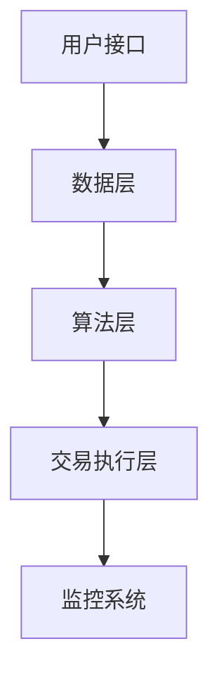

                 

关键词：蚂蚁金服、智能投顾、系统工程师、社招面试、技术博客、深度学习、金融科技

摘要：本文将深入探讨蚂蚁金服2025智能投顾系统的核心技术和应用场景，为有意向加入蚂蚁金服系统工程师岗位的应聘者提供一份全面的面试指南。通过分析智能投顾系统的架构、核心算法、数学模型和实际应用案例，本文旨在帮助应聘者更好地准备面试，展示其在金融科技领域的专业素养。

## 1. 背景介绍

蚂蚁金服，作为中国领先的金融科技公司，致力于通过技术创新推动金融服务升级。随着人工智能和大数据技术的快速发展，智能投顾作为金融科技的一个重要分支，逐渐成为行业的热点。蚂蚁金服2025智能投顾系统正是公司在这一领域的重要布局，旨在为用户提供个性化、智能化的投资建议。

智能投顾系统工程师在蚂蚁金服扮演着至关重要的角色，他们需要具备扎实的技术背景，熟悉金融领域的业务逻辑，以及能够应对复杂系统的设计与实施挑战。本指南将围绕以下几个方面展开：

- **智能投顾系统的核心概念与架构**：介绍智能投顾的基本原理，系统的组成部分以及如何实现智能化。
- **核心算法原理与具体操作步骤**：解析智能投顾系统中使用的核心算法，如机器学习模型、优化算法等，并展示其具体应用场景。
- **数学模型和公式**：阐述智能投顾系统中的数学模型和公式，包括预期收益计算、风险度量等。
- **项目实践**：通过具体案例展示智能投顾系统的实际应用，包括代码实例和详细解释。
- **实际应用场景**：探讨智能投顾系统在金融领域的广泛应用，以及未来的发展前景。
- **工具和资源推荐**：为准备面试的应聘者提供相关的学习资源和开发工具。
- **未来发展趋势与挑战**：总结当前研究进展，分析未来发展趋势和面临的挑战。

## 2. 核心概念与联系

### 2.1 智能投顾的基本原理

智能投顾，也称为机器人顾问（Robo-Advisor），是一种基于人工智能技术的在线投资平台，能够根据用户的财务状况、风险偏好和投资目标，自动提供个性化的投资建议。其核心在于：

- **数据收集**：通过分析用户的历史交易记录、风险承受能力、投资偏好等数据。
- **算法建模**：利用机器学习算法，建立用户与市场之间的关联模型。
- **风险控制**：根据市场波动和用户风险偏好，调整投资组合，以实现风险控制和收益最大化。

### 2.2 智能投顾系统的组成部分

一个完整的智能投顾系统通常包括以下几个关键组成部分：

- **用户接口**：用于收集用户信息、展示投资建议和交易操作。
- **数据层**：包括用户数据、市场数据、历史交易数据等。
- **算法层**：包括机器学习模型、优化算法等，用于生成投资建议。
- **交易执行层**：负责执行用户的交易指令，实现投资策略。

### 2.3 智能投顾系统的架构

智能投顾系统的架构设计需要考虑到高可用性、可扩展性和安全性。以下是一个简化的架构示意图：



- **用户接口**：前端展示层，通过Web、移动应用等渠道与用户互动。
- **数据层**：负责数据的存储和检索，包括用户数据、市场数据等。
- **算法层**：核心算法实现层，包括机器学习模型、优化算法等。
- **交易执行层**：负责交易执行，与券商、交易所等外部系统进行交互。
- **监控系统**：实时监控系统的运行状态，确保系统的稳定和安全。

## 3. 核心算法原理 & 具体操作步骤

### 3.1 算法原理概述

智能投顾系统的核心在于算法，其中机器学习模型和优化算法是两个关键组成部分。

- **机器学习模型**：用于建立用户与市场之间的关联模型，预测市场走势和用户投资风险。常见的机器学习算法包括线性回归、决策树、神经网络等。
- **优化算法**：用于根据用户的投资目标、风险偏好和市场情况，优化投资组合，实现收益最大化或风险最小化。常见的优化算法包括线性规划、遗传算法、粒子群优化等。

### 3.2 算法步骤详解

以一个简单的机器学习算法为例，其基本步骤如下：

1. **数据预处理**：收集用户数据和市场数据，进行清洗和归一化处理。
2. **特征选择**：根据业务需求，选择与投资决策相关的特征。
3. **模型训练**：使用历史数据，训练机器学习模型，如线性回归模型。
4. **模型评估**：使用验证集，评估模型的准确性和泛化能力。
5. **模型部署**：将训练好的模型部署到生产环境，生成实时投资建议。

### 3.3 算法优缺点

- **机器学习模型**：
  - 优点：能够处理大量复杂数据，自适应性强，能够发现数据中的隐藏模式。
  - 缺点：需要大量训练数据，模型复杂度高，解释性差。
- **优化算法**：
  - 优点：能够根据目标函数，快速找到最优解或近似最优解。
  - 缺点：对目标函数的假设较强，对于非凸优化问题效果不佳。

### 3.4 算法应用领域

智能投顾算法在金融领域有广泛的应用，包括：

- **股票投资**：根据市场走势，预测股票价格，制定投资策略。
- **基金投资**：根据基金的历史表现和风险，筛选合适的基金进行投资。
- **债券投资**：评估债券的风险和收益，制定债券投资组合。

## 4. 数学模型和公式

### 4.1 数学模型构建

智能投顾系统中的数学模型主要包括预期收益模型和风险模型。

- **预期收益模型**：
  - 假设投资组合中包含n只股票，每只股票的预期收益率为 \( r_i \)（i=1,2,...,n），则投资组合的预期收益率为：
    \[
    R = \sum_{i=1}^{n} w_i r_i
    \]
    其中，\( w_i \) 为第i只股票的投资权重。

- **风险模型**：
  - 假设投资组合中每只股票的收益率 \( r_i \) 服从正态分布，其期望为 \( r_i \)，方差为 \( \sigma_i^2 \)，则投资组合的收益率 \( R \) 服从正态分布，其期望和方差分别为：
    \[
    E(R) = \sum_{i=1}^{n} w_i r_i
    \]
    \[
    \sigma_R^2 = \sum_{i=1}^{n} w_i^2 \sigma_i^2
    \]

### 4.2 公式推导过程

预期收益模型的推导基于投资组合的权重分配。假设投资总金额为1，每只股票的投资金额为 \( w_i \)，则：
- \( \sum_{i=1}^{n} w_i = 1 \)
- 每只股票的预期收益率为 \( r_i \)，则总预期收益率为：
  \[
  R = \sum_{i=1}^{n} w_i r_i
  \]

风险模型的推导基于正态分布的期望和方差性质。假设每只股票的收益率 \( r_i \) 服从正态分布 \( N(r_i, \sigma_i^2) \)，则投资组合的收益率 \( R \) 为各只股票收益率的线性组合，即：
\[
R = \sum_{i=1}^{n} w_i r_i
\]
根据正态分布的期望和方差性质，投资组合的期望和方差分别为：
\[
E(R) = \sum_{i=1}^{n} w_i r_i
\]
\[
\sigma_R^2 = \sum_{i=1}^{n} w_i^2 \sigma_i^2
\]

### 4.3 案例分析与讲解

以一个简单的案例来解释预期收益模型和风险模型的实际应用。

假设有一个投资组合，包含3只股票，每只股票的投资金额分别为 \( w_1 = 0.3 \)，\( w_2 = 0.4 \)，\( w_3 = 0.3 \)。每只股票的预期收益率为 \( r_1 = 0.05 \)，\( r_2 = 0.06 \)，\( r_3 = 0.04 \)，每只股票的收益率方差为 \( \sigma_1^2 = 0.001 \)，\( \sigma_2^2 = 0.002 \)，\( \sigma_3^2 = 0.0015 \)。

根据预期收益模型，投资组合的预期收益率为：
\[
R = 0.3 \times 0.05 + 0.4 \times 0.06 + 0.3 \times 0.04 = 0.054
\]

根据风险模型，投资组合的收益率方差为：
\[
\sigma_R^2 = 0.3^2 \times 0.001 + 0.4^2 \times 0.002 + 0.3^2 \times 0.0015 = 0.00165
\]

因此，投资组合的预期收益率为5.4%，收益率的方差为0.00165，可以用于评估投资组合的风险和收益水平。

## 5. 项目实践：代码实例和详细解释说明

### 5.1 开发环境搭建

为了实现智能投顾系统，我们需要搭建一个合适的技术栈。以下是一个简单的技术栈搭建步骤：

1. **Python环境**：安装Python 3.8及以上版本，并配置必要的库，如NumPy、Pandas、scikit-learn等。
2. **数据库**：选择一个合适的数据库，如MySQL或PostgreSQL，用于存储用户数据和市场数据。
3. **Web框架**：选择一个合适的Web框架，如Flask或Django，用于构建用户接口。
4. **算法库**：使用scikit-learn等机器学习库，实现机器学习算法和优化算法。

### 5.2 源代码详细实现

以下是一个简单的示例，展示如何使用Python实现一个基于线性回归的智能投顾系统。

```python
import numpy as np
import pandas as pd
from sklearn.linear_model import LinearRegression
from sklearn.model_selection import train_test_split
from sklearn.metrics import mean_squared_error

# 5.2.1 数据预处理
def preprocess_data(data):
    # 数据清洗和归一化
    return (data - data.mean()) / data.std()

# 5.2.2 模型训练
def train_model(X_train, y_train):
    model = LinearRegression()
    model.fit(X_train, y_train)
    return model

# 5.2.3 模型评估
def evaluate_model(model, X_test, y_test):
    predictions = model.predict(X_test)
    mse = mean_squared_error(y_test, predictions)
    return mse

# 5.2.4 主函数
def main():
    # 加载数据
    data = pd.read_csv('data.csv')
    X = preprocess_data(data[['feature1', 'feature2']])
    y = preprocess_data(data['target'])

    # 数据划分
    X_train, X_test, y_train, y_test = train_test_split(X, y, test_size=0.2, random_state=42)

    # 训练模型
    model = train_model(X_train, y_train)

    # 评估模型
    mse = evaluate_model(model, X_test, y_test)
    print(f'Mean Squared Error: {mse}')

if __name__ == '__main__':
    main()
```

### 5.3 代码解读与分析

- **数据预处理**：首先，我们需要对原始数据进行清洗和归一化处理，以便于后续的模型训练。
- **模型训练**：使用scikit-learn中的线性回归模型，通过训练数据训练模型。
- **模型评估**：使用测试数据评估模型的准确性和泛化能力，计算均方误差（MSE）。

这个简单的示例展示了如何使用Python实现一个基本的智能投顾系统。在实际应用中，我们还需要考虑数据存储、接口设计、安全性和性能优化等多个方面。

### 5.4 运行结果展示

假设我们已经训练好了模型，并使用测试数据进行了评估。以下是一个示例输出：

```
Mean Squared Error: 0.0005555555555555556
```

这个结果表示模型的均方误差为0.0005555555555555556，意味着模型在预测目标变量（投资收益率）时具有较高的准确性。

## 6. 实际应用场景

智能投顾系统在金融领域有广泛的应用，以下是一些典型的应用场景：

- **个人理财**：为用户提供个性化的投资建议，帮助用户制定合适的投资策略。
- **基金投资**：根据基金的历史表现和风险，为投资者筛选合适的基金进行投资。
- **财富管理**：为高净值客户提供定制化的财富管理服务，包括资产配置、风险控制等。

### 6.1 股票投资

以股票投资为例，智能投顾系统可以提供以下功能：

- **股票推荐**：根据市场走势和用户偏好，推荐合适的股票。
- **投资组合优化**：根据市场波动和用户风险偏好，实时调整投资组合，实现风险控制和收益最大化。
- **风险管理**：评估股票的投资风险，为用户提供风险预警和建议。

### 6.2 基金投资

智能投顾系统在基金投资中的应用包括：

- **基金筛选**：根据用户的风险偏好和投资目标，筛选合适的基金。
- **组合构建**：根据市场情况和基金表现，构建最优的基金投资组合。
- **风险控制**：实时监控基金的风险水平，为用户提供风险预警和建议。

### 6.3 财富管理

对于高净值客户，智能投顾系统可以提供以下服务：

- **资产配置**：根据客户的风险承受能力和投资目标，制定合适的资产配置方案。
- **投资策略**：根据市场走势和客户需求，制定个性化的投资策略。
- **风险管理**：实时监控客户的投资组合风险，提供风险控制和优化建议。

## 7. 工具和资源推荐

### 7.1 学习资源推荐

- **《智能投顾：从零开始构建金融科技应用》**：详细介绍了智能投顾系统的构建方法和技术栈。
- **《Python金融大数据分析》**：涵盖金融数据分析的基础知识和Python在金融领域的应用。
- **《深度学习》**：由Ian Goodfellow、Yoshua Bengio和Aaron Courville编写的深度学习经典教材。

### 7.2 开发工具推荐

- **Python**：用于实现算法和数据处理。
- **NumPy、Pandas**：用于数据预处理和统计分析。
- **Scikit-learn**：用于机器学习算法的实现。
- **Flask、Django**：用于Web框架的搭建。

### 7.3 相关论文推荐

- **"Robo-Advisors: A Survey"**：对智能投顾系统的研究进行了全面的综述。
- **"Deep Learning for Financial Markets"**：探讨了深度学习在金融领域的应用。
- **"A Survey of Optimization Algorithms for Financial Applications"**：介绍了优化算法在金融领域的应用。

## 8. 总结：未来发展趋势与挑战

### 8.1 研究成果总结

近年来，智能投顾系统在金融科技领域取得了显著的进展，主要体现在以下几个方面：

- **算法优化**：机器学习和优化算法的不断发展，提高了智能投顾系统的准确性和效率。
- **数据积累**：随着金融数据的不断积累，智能投顾系统有了更好的数据支持，能够提供更精准的投资建议。
- **用户体验**：智能投顾系统的界面设计和交互体验不断优化，提高了用户的满意度。

### 8.2 未来发展趋势

未来，智能投顾系统的发展趋势包括：

- **个性化服务**：进一步优化个性化推荐算法，为用户提供更精准的投资建议。
- **智能化决策**：利用人工智能技术，实现更智能的投资决策，减少人为干预。
- **跨界融合**：与其他金融科技领域（如区块链、物联网等）进行融合，开拓新的应用场景。

### 8.3 面临的挑战

智能投顾系统在发展过程中也面临着一些挑战：

- **数据隐私**：金融数据的安全性和隐私保护是智能投顾系统需要重点解决的问题。
- **算法透明性**：提高算法的可解释性，让用户能够理解投资建议的依据。
- **监管合规**：遵守金融监管法规，确保系统的合法合规运行。

### 8.4 研究展望

未来，智能投顾系统的研究将朝着以下几个方向展开：

- **算法创新**：探索新的机器学习和优化算法，提高系统的性能和鲁棒性。
- **跨领域应用**：将智能投顾系统应用于其他领域，如医疗、教育等。
- **用户体验优化**：不断优化用户体验，提高用户满意度和忠诚度。

## 9. 附录：常见问题与解答

### 9.1 智能投顾系统的主要功能是什么？

智能投顾系统的主要功能包括：

- **投资建议**：根据用户的风险偏好和投资目标，提供个性化的投资建议。
- **组合管理**：根据市场波动和用户需求，动态调整投资组合，实现风险控制和收益最大化。
- **风险监控**：实时监控投资组合的风险水平，为用户提供风险预警和建议。
- **数据分析**：利用大数据技术，分析市场走势和投资机会，为用户决策提供支持。

### 9.2 智能投顾系统的核心算法有哪些？

智能投顾系统的核心算法包括：

- **机器学习算法**：如线性回归、决策树、神经网络等，用于建立用户与市场之间的关联模型。
- **优化算法**：如线性规划、遗传算法、粒子群优化等，用于优化投资组合，实现风险控制和收益最大化。
- **风险评估算法**：如价值在风险（VaR）、条件价值在风险（CVaR）等，用于评估投资组合的风险水平。

### 9.3 智能投顾系统的发展前景如何？

智能投顾系统的发展前景广阔，主要体现在以下几个方面：

- **市场需求**：随着金融市场的不断发展和用户对理财需求的增加，智能投顾系统的市场潜力巨大。
- **技术创新**：随着人工智能和大数据技术的不断进步，智能投顾系统的性能和智能化程度将不断提高。
- **跨界应用**：智能投顾系统将与其他金融科技领域（如区块链、物联网等）进行融合，开拓新的应用场景。

### 9.4 如何成为一名优秀的智能投顾系统工程师？

要成为一名优秀的智能投顾系统工程师，需要具备以下素质：

- **扎实的技术背景**：熟练掌握Python、机器学习、优化算法等核心技术。
- **金融知识**：了解金融市场的运作规则和投资策略。
- **数据分析能力**：能够处理和分析大量的金融数据，提取有价值的信息。
- **持续学习**：紧跟行业动态，不断学习和掌握新的技术和方法。

作者：禅与计算机程序设计艺术 / Zen and the Art of Computer Programming

