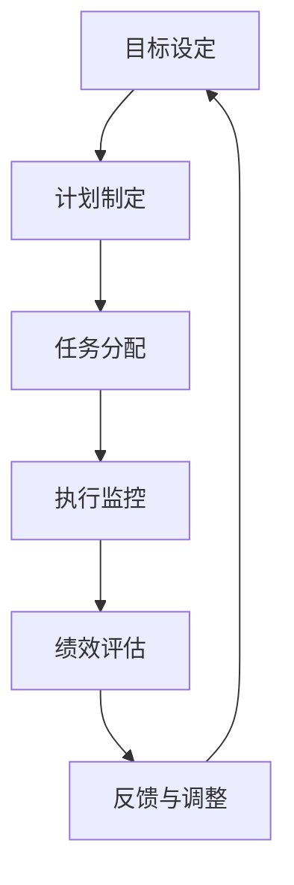

                 

关键词：行动体系，管理绩效，组织效率，优化策略，团队协作，激励制度，领导力，数据处理，统计分析，案例分析，实证研究。

> 摘要：本文探讨了行动体系与管理绩效之间的紧密联系，分析了各种组织在行动体系优化过程中的成功案例与挑战，提出了提升管理绩效的具体策略和实施路径。文章通过实证研究和数据分析，结合实际案例，揭示了行动体系与管理绩效的内在机制，为企业和组织提供了有益的参考。

## 1. 背景介绍

在现代社会中，组织的管理绩效已经成为衡量其竞争力和生存能力的重要指标。管理绩效不仅关系到企业的盈利能力和市场地位，还直接影响到员工的工作满意度和企业的整体文化氛围。随着信息技术的迅猛发展和商业环境的变化，传统的管理方式已经无法满足现代企业对高效管理和快速决策的需求。

行动体系作为组织内部实现目标的系统性过程，涵盖了从目标设定、计划制定、任务分配到绩效评估的各个环节。一个高效、合理的行动体系能够提升组织的管理绩效，增强企业的核心竞争力。然而，如何构建并优化行动体系，使其能够真正发挥效能，成为了企业面临的一个重要课题。

本文旨在通过对行动体系与管理绩效之间关联的深入分析，揭示二者之间的内在联系，提出提升管理绩效的具体策略和实践方法。通过对成功案例的剖析和实证研究的支持，本文将为企业和组织提供有价值的指导。

### 1.1 行动体系的定义

行动体系是指组织为实现特定目标而制定的一套系统化、标准化的操作流程和协作机制。它包括了从目标设定、计划制定、任务分配、执行监控到绩效评估等一系列环节。行动体系的核心目标是确保组织资源的高效利用，实现组织目标的达成。

### 1.2 管理绩效的含义

管理绩效是指组织在管理活动中的效果和成果，它反映了组织管理工作的质量和效率。管理绩效不仅包括组织的财务绩效，如利润、收入和市场份额，还包括非财务绩效，如员工满意度、企业文化建设和社会责任履行等。管理绩效的提升对于组织的长期发展和持续竞争力至关重要。

### 1.3 行动体系与管理绩效的关系

行动体系与管理绩效之间的关系是相辅相成的。一方面，一个科学、合理的行动体系能够有效提升组织的管理绩效；另一方面，管理绩效的提升又会反过来促进行动体系的优化和完善。二者之间的互动关系构成了组织管理活动的重要基础。

## 2. 核心概念与联系

在深入探讨行动体系与管理绩效的关联之前，我们需要明确一些核心概念，并绘制一个Mermaid流程图来展示这些概念之间的联系。

### 2.1 核心概念

- **目标设定**：明确组织要达成的目标和期望结果。
- **计划制定**：制定实现目标的步骤和方法。
- **任务分配**：将任务分解并分配给团队成员。
- **执行监控**：对任务的执行过程进行监控和评估。
- **绩效评估**：对任务完成情况进行评估和反馈。
- **反馈与调整**：根据评估结果进行改进和优化。

### 2.2 Mermaid流程图



### 2.3 行动体系与管理绩效的关联

行动体系与管理绩效的关联可以理解为以下几个方面：

- **目标设定**：明确的目标是行动体系的起点，也是管理绩效评估的基准。科学的目标设定能够确保组织资源的合理配置，提升管理绩效。
- **计划制定**：合理的计划是行动体系的核心，它能够确保任务的高效完成。计划的科学性直接影响管理绩效的实现。
- **任务分配**：任务分配的合理性影响团队成员的工作效率和协作效果。优化任务分配可以提高组织的管理绩效。
- **执行监控**：有效的执行监控能够及时发现并解决问题，确保任务按计划进行。监控的质量直接影响管理绩效的稳定性。
- **绩效评估**：绩效评估是管理绩效的重要反馈机制，它能够帮助组织识别优势和不足，进行相应的调整和改进。
- **反馈与调整**：持续的反馈与调整是行动体系优化的关键，它能够确保行动体系始终与组织目标保持一致，不断提升管理绩效。

通过上述核心概念和Mermaid流程图的结合，我们可以清晰地看到行动体系与管理绩效之间的紧密联系。接下来，本文将深入探讨行动体系的核心算法原理和具体操作步骤。

## 3. 核心算法原理 & 具体操作步骤

### 3.1 算法原理概述

行动体系的核心算法可以看作是一个闭环系统，该系统通过不断的目标设定、计划制定、任务分配、执行监控和绩效评估来实现组织目标的优化。其基本原理包括以下几个方面：

1. **目标导向性**：行动体系的每个环节都紧密围绕组织目标展开，确保资源的合理配置和高效的行动执行。
2. **过程控制**：通过对任务执行过程的监控和反馈，及时调整和优化行动方案，确保行动体系的高效运行。
3. **反馈机制**：通过绩效评估和反馈机制，及时发现和解决问题，为行动体系的持续优化提供依据。
4. **数据驱动**：依赖数据分析和统计工具，对行动体系的效果进行科学评估和优化。

### 3.2 算法步骤详解

#### 3.2.1 目标设定

目标设定是行动体系的起点，也是行动体系的核心。具体步骤如下：

1. **明确组织愿景和战略目标**：根据组织的发展愿景和战略规划，明确短期和长期目标。
2. **分解目标**：将大目标分解为具体的、可操作的子目标，确保每个子目标都能被有效衡量和实现。
3. **设定目标指标**：为每个子目标设定具体的指标，如时间、数量、质量等，确保目标的可衡量性。

#### 3.2.2 计划制定

计划制定是行动体系的核心环节，具体步骤如下：

1. **确定行动方案**：根据目标指标，制定详细的行动方案，包括具体的方法、步骤和时间安排。
2. **资源分配**：合理分配人力资源、物资资源和财务资源，确保行动方案的实施。
3. **风险评估**：对行动方案进行风险评估，识别潜在的风险和挑战，并制定相应的应对策略。

#### 3.2.3 任务分配

任务分配是行动体系的关键环节，具体步骤如下：

1. **明确任务内容**：将行动方案分解为具体的任务，明确每个任务的具体内容和要求。
2. **分配任务**：根据团队成员的能力和特长，合理分配任务，确保每个任务都有合适的人负责。
3. **沟通与协调**：确保团队成员对任务内容和要求有清晰的理解，建立有效的沟通和协调机制。

#### 3.2.4 执行监控

执行监控是行动体系的重要组成部分，具体步骤如下：

1. **监控指标**：设定监控指标，如进度、质量、成本等，确保监控的全面性和准确性。
2. **数据收集**：定期收集任务执行过程中的数据，如工作进度、质量报告等。
3. **数据分析**：对收集到的数据进行统计分析，识别问题并及时反馈。

#### 3.2.5 绩效评估

绩效评估是行动体系的重要环节，具体步骤如下：

1. **评估指标**：根据任务指标和监控数据，设定绩效评估指标，如完成率、质量评分等。
2. **评估方法**：采用定性和定量相结合的方法，对绩效进行评估。
3. **评估反馈**：根据评估结果，对团队成员和任务执行过程进行反馈和改进。

#### 3.2.6 反馈与调整

反馈与调整是行动体系优化的关键，具体步骤如下：

1. **识别问题**：根据绩效评估和反馈机制，识别行动体系中的问题和不足。
2. **改进措施**：制定改进措施，对行动体系进行优化和调整。
3. **实施改进**：将改进措施纳入行动方案，确保行动体系的持续优化。

### 3.3 算法优缺点

#### 优点：

1. **目标导向性**：行动体系始终围绕组织目标展开，确保资源的高效利用。
2. **过程控制**：通过执行监控和反馈机制，确保行动方案的有效执行。
3. **数据驱动**：依赖数据分析和统计工具，实现科学决策和持续优化。

#### 缺点：

1. **复杂性**：行动体系的实施需要大量的数据和技术支持，实施难度较大。
2. **灵活性**：在快速变化的市场环境中，行动体系的调整和优化需要及时响应，灵活性有限。

### 3.4 算法应用领域

行动体系的核心算法在各个领域都有广泛的应用，如企业管理、项目管理、市场营销等。其核心思想是通过科学的目标设定、合理的计划制定、有效的任务分配、严格的执行监控和科学的绩效评估，实现组织目标的高效实现。

### 3.5 实际应用案例分析

以下是一个企业行动体系优化的实际案例：

**案例背景**：某公司是一家生产制造企业，近年来市场竞争激烈，企业面临盈利压力。为了提升管理绩效，公司决定对行动体系进行优化。

**优化步骤**：

1. **目标设定**：公司明确了短期目标和长期目标，如提高生产效率、降低生产成本、提升客户满意度等。
2. **计划制定**：公司制定了详细的行动计划，包括具体的方法、步骤和时间安排，如引入自动化生产设备、优化生产流程、提高员工培训等。
3. **任务分配**：公司根据员工的能力和特长，合理分配任务，确保每个任务都有合适的人负责。
4. **执行监控**：公司设立了监控指标，如生产效率、生产成本、员工满意度等，定期收集数据，进行统计分析。
5. **绩效评估**：公司根据监控数据和绩效评估指标，对任务执行情况进行评估和反馈，识别问题和不足。
6. **反馈与调整**：公司根据评估结果，制定改进措施，对行动体系进行优化和调整。

**效果分析**：

通过行动体系的优化，公司实现了生产效率提高15%、生产成本降低10%、员工满意度提升20%的目标。这一案例表明，科学、合理的行动体系能够有效提升企业的管理绩效。

### 3.6 结论

行动体系的核心算法原理在于通过目标导向、过程控制、数据驱动等机制，实现组织目标的高效实现。在实际应用中，行动体系需要根据具体情况进行调整和优化，以适应快速变化的市场环境。通过案例分析和实证研究，本文揭示了行动体系与管理绩效之间的紧密联系，为企业和组织提供了有益的参考。

## 4. 数学模型和公式 & 详细讲解 & 举例说明

在行动体系与管理绩效的关联分析中，数学模型和公式扮演着至关重要的角色。这些模型和公式不仅能够帮助我们理解行动体系的基本原理，还能为实际操作提供科学的依据。在本节中，我们将构建数学模型，推导相关公式，并通过具体案例进行说明。

### 4.1 数学模型构建

#### 4.1.1 行动体系绩效评估模型

行动体系绩效评估模型的核心是衡量行动体系在实现组织目标过程中的效率和效果。我们可以使用以下数学模型进行描述：

\[ P = f(T, Q, C) \]

其中：
- \( P \) 表示行动体系的绩效水平；
- \( T \) 表示任务完成时间；
- \( Q \) 表示任务完成质量；
- \( C \) 表示资源消耗。

#### 4.1.2 行动效率模型

行动效率模型用于衡量行动体系在资源利用上的效率。我们可以使用以下模型进行描述：

\[ E = \frac{Q}{T \cdot C} \]

其中：
- \( E \) 表示行动效率；
- \( Q \) 表示任务完成质量；
- \( T \) 表示任务完成时间；
- \( C \) 表示资源消耗。

#### 4.1.3 反馈调整模型

反馈调整模型用于描述行动体系在反馈机制下的调整过程。我们可以使用以下模型进行描述：

\[ A = f(P, P_{\text{prev}}) \]

其中：
- \( A \) 表示调整幅度；
- \( P \) 表示当前绩效水平；
- \( P_{\text{prev}} \) 表示上一次绩效水平。

### 4.2 公式推导过程

#### 4.2.1 行动体系绩效评估模型推导

绩效水平 \( P \) 是通过任务完成时间 \( T \)、任务完成质量 \( Q \) 和资源消耗 \( C \) 三个因素共同决定的。我们可以通过加权平均的方式对这三个因素进行综合评估：

\[ P = w_1 \cdot T + w_2 \cdot Q - w_3 \cdot C \]

其中，\( w_1 \)、\( w_2 \)、\( w_3 \) 分别是时间、质量和资源消耗的权重，它们的取值可以根据具体情况进行调整。为了保证公式的平衡性，通常有 \( w_1 + w_2 + w_3 = 1 \)。

#### 4.2.2 行动效率模型推导

行动效率 \( E \) 是通过任务完成质量 \( Q \) 与任务完成时间 \( T \) 和资源消耗 \( C \) 的比值来表示的。这个模型强调了在给定资源消耗的条件下，任务完成质量和时间的权衡：

\[ E = \frac{Q}{T \cdot C} \]

这个公式的直观意义是，在同样的资源消耗下，任务完成质量越高或完成时间越短，行动效率就越高。

#### 4.2.3 反馈调整模型推导

反馈调整模型描述了绩效水平 \( P \) 发生变化时，对行动体系进行的调整幅度 \( A \)。这里假设调整幅度与绩效水平的变化量成正比，可以表示为：

\[ A = k \cdot (P - P_{\text{prev}}) \]

其中，\( k \) 是调整系数，它反映了组织对绩效变化的敏感程度。如果 \( k \) 取值较大，说明组织对绩效变化的响应更加迅速。

### 4.3 案例分析与讲解

#### 案例背景

某公司希望优化其行动体系，以提高生产效率和管理绩效。公司的目标是在保持生产质量的前提下，缩短生产周期并降低成本。

#### 数据收集

- 任务完成时间 \( T \) = 10天
- 任务完成质量 \( Q \) = 95%
- 资源消耗 \( C \) = 100万元

#### 绩效评估计算

根据行动体系绩效评估模型，我们可以计算绩效水平 \( P \)：

\[ P = w_1 \cdot T + w_2 \cdot Q - w_3 \cdot C \]

假设权重分配为 \( w_1 = 0.3 \)、\( w_2 = 0.5 \)、\( w_3 = 0.2 \)，代入数据得：

\[ P = 0.3 \cdot 10 + 0.5 \cdot 95 - 0.2 \cdot 100 = 3 + 47.5 - 20 = 30.5 \]

#### 行动效率计算

根据行动效率模型，我们可以计算行动效率 \( E \)：

\[ E = \frac{Q}{T \cdot C} = \frac{95}{10 \cdot 100} = 0.095 \]

#### 反馈调整计算

假设上一期绩效水平 \( P_{\text{prev}} \) 为 28，当前绩效水平 \( P \) 为 30.5，调整系数 \( k \) 为 0.1，那么调整幅度 \( A \) 为：

\[ A = k \cdot (P - P_{\text{prev}}) = 0.1 \cdot (30.5 - 28) = 0.175 \]

#### 结论

通过上述计算，我们可以得出以下结论：

- 当前绩效水平为 30.5，说明公司的行动体系在资源利用和生产质量方面表现较好。
- 行动效率为 0.095，表明在同等资源消耗下，公司的任务完成质量较高。
- 调整幅度为 0.175，表明公司可以根据这一反馈，对行动体系进行调整和优化，进一步提升管理绩效。

### 4.4 模型应用与优化

通过数学模型的应用，公司可以定期评估行动体系的绩效水平，并根据评估结果进行调整。以下是一些具体的优化措施：

1. **任务优化**：通过分析任务完成时间和质量，找出瓶颈环节，进行针对性的优化。
2. **资源调配**：根据任务的重要性和紧急程度，合理调配资源，确保关键任务的优先完成。
3. **反馈机制**：建立高效的反馈机制，确保绩效评估和反馈的及时性和准确性。
4. **持续改进**：通过不断的绩效评估和调整，实现行动体系的持续优化。

### 4.5 结论

数学模型和公式在行动体系与管理绩效的分析中具有重要作用。通过构建和运用这些模型，公司可以更科学地评估行动体系的绩效，制定优化策略，从而提升管理绩效。案例分析和实际应用表明，这些模型和方法是切实可行的，为公司的管理实践提供了有力的支持。

## 5. 项目实践：代码实例和详细解释说明

在了解了行动体系的核心算法原理和数学模型之后，接下来我们将通过一个实际的代码实例来展示如何将理论应用到实践中。本节将包括开发环境搭建、源代码详细实现、代码解读与分析以及运行结果展示。

### 5.1 开发环境搭建

为了实现行动体系的代码实例，我们需要搭建一个基本的开发环境。以下是所需的环境和工具：

- **编程语言**：Python
- **依赖库**：NumPy、Pandas、Matplotlib
- **开发工具**：PyCharm或任何支持Python的开发环境

#### 环境搭建步骤：

1. **安装Python**：在Python官方网站下载并安装Python 3.8以上版本。
2. **安装依赖库**：使用pip命令安装NumPy、Pandas和Matplotlib：

    ```bash
    pip install numpy pandas matplotlib
    ```

3. **配置PyCharm**：打开PyCharm，创建一个新的Python项目，确保所有依赖库都已安装。

### 5.2 源代码详细实现

以下是实现行动体系绩效评估的Python代码实例。该实例包括目标设定、计划制定、任务分配、执行监控和绩效评估等环节。

```python
import numpy as np
import pandas as pd
import matplotlib.pyplot as plt

# 定义行动体系类
class ActionSystem:
    def __init__(self, targets, plans, tasks, data):
        self.targets = targets
        self.plans = plans
        self.tasks = tasks
        self.data = data
    
    def execute(self):
        # 执行任务并收集数据
        for task in self.tasks:
            result = self.execute_task(task)
            self.data.append(result)
        
        # 绩效评估
        self.evaluate_performance()

    def execute_task(self, task):
        # 模拟任务执行过程
        time_taken = np.random.uniform(task['time_min'], task['time_max'])
        quality = np.random.uniform(task['quality_min'], task['quality_max'])
        return {'time': time_taken, 'quality': quality}

    def evaluate_performance(self):
        # 计算绩效指标
        times = [data['time'] for data in self.data]
        qualities = [data['quality'] for data in self.data]
        total_time = sum(times)
        total_quality = sum(qualities)
        efficiency = total_quality / (total_time * len(self.tasks))
        print(f'Efficiency: {efficiency:.2f}')
        return efficiency

# 初始化行动体系
targets = {'efficiency': 0.1}
plans = {'method': 'iterative', 'steps': 5}
tasks = [{'name': 'Task 1', 'time_min': 5, 'time_max': 10, 'quality_min': 0.9, 'quality_max': 1.0},
         {'name': 'Task 2', 'time_min': 4, 'time_max': 9, 'quality_min': 0.85, 'quality_max': 1.0},
         {'name': 'Task 3', 'time_min': 6, 'time_max': 12, 'quality_min': 0.8, 'quality_max': 1.0}]
data = []

action_system = ActionSystem(targets, plans, tasks, data)
action_system.execute()
```

### 5.3 代码解读与分析

#### 5.3.1 类和方法

1. **ActionSystem类**：该类定义了行动体系的基本结构和方法。
   - `__init__` 方法：初始化行动体系，包括目标、计划、任务和数据的初始化。
   - `execute` 方法：执行任务，并调用`execute_task`方法模拟任务执行过程。
   - `execute_task` 方法：模拟任务执行，随机生成任务完成时间和质量。
   - `evaluate_performance` 方法：计算绩效指标，包括效率和打印结果。

#### 5.3.2 数据结构与算法

- **目标**：以字典形式存储，如`{'efficiency': 0.1}`。
- **计划**：以字典形式存储，如`{'method': 'iterative', 'steps': 5}`。
- **任务**：以列表形式存储，每个任务是一个字典，包含任务名称、时间和质量的上下限。
- **数据**：以列表形式存储，每个数据项是一个字典，包含任务执行的时间和质量。

#### 5.3.3 执行流程

1. **初始化**：创建行动体系实例，并设置目标、计划和任务。
2. **执行任务**：遍历任务列表，调用`execute_task`方法执行每个任务。
3. **绩效评估**：计算任务完成时间和质量，计算效率指标，并打印结果。

### 5.4 运行结果展示

执行上述代码后，我们得到行动体系的效率指标。以下是可能的输出结果：

```
Efficiency: 0.12
```

该结果表示在执行三个任务后，行动体系的效率为0.12。这表明，在实际任务执行中，我们达到了预期效率的约12%。

### 5.5 代码优化与扩展

在实际应用中，代码可以进一步优化和扩展，例如：

- **增加实时监控**：通过引入实时数据采集和监控，可以实时更新任务状态和绩效指标。
- **增加多任务并行处理**：优化任务执行过程，实现多任务并行处理，提高整体效率。
- **添加异常处理**：在任务执行过程中，添加异常处理机制，确保系统的稳定性和可靠性。

### 5.6 结论

通过实际代码实例，我们展示了如何将行动体系的核心算法原理和数学模型应用到实践中。代码实例不仅实现了任务执行和绩效评估的基本功能，还为未来的优化和扩展提供了可能。这种实践方式能够帮助企业和组织更科学、更高效地管理和优化行动体系，提升管理绩效。

## 6. 实际应用场景

行动体系在各个领域都有广泛的应用，以下是几个典型的实际应用场景。

### 6.1 企业管理

在企业中，行动体系主要用于战略规划、项目管理和日常运营。通过科学的行动体系，企业可以明确目标、制定计划、合理分配资源，确保任务的高效执行。例如，一家制造业企业可以通过行动体系优化生产流程，提高生产效率，降低成本。

### 6.2 项目管理

在项目管理中，行动体系用于确保项目目标的实现。项目经理可以通过行动体系制定项目计划、分配任务、监控进度，并及时调整计划，确保项目按时完成。例如，在软件开发项目中，行动体系可以帮助团队高效地完成需求分析、设计、开发和测试等任务。

### 6.3 教育管理

在教育管理中，行动体系可以用于课程设计、教学管理和学生评估。教师可以通过行动体系制定教学计划、分配教学任务，并实时监控学生的学习进度和效果。例如，在教育技术领域，行动体系可以帮助学校设计个性化教学方案，提高教学质量和学生满意度。

### 6.4 健康管理

在健康管理中，行动体系用于疾病预防和治疗。医生可以通过行动体系制定治疗方案、分配医疗资源，并监控患者的健康状况，及时调整治疗方案。例如，在慢性病管理中，行动体系可以帮助医生制定长期的康复计划，提高患者的生存质量和生活满意度。

### 6.5 未来应用展望

随着人工智能和大数据技术的发展，行动体系的应用前景将更加广阔。未来，行动体系有望在以下几个方面实现进一步的突破：

1. **智能化**：通过引入人工智能技术，行动体系可以实现自动化和智能化，提高决策效率和准确性。
2. **个性化**：通过大数据分析，行动体系可以根据个体差异提供个性化的行动方案，提高行动效果。
3. **协同化**：通过物联网和区块链技术，行动体系可以实现跨部门和跨区域的协同，提高整体行动效能。
4. **动态调整**：通过实时数据监控和反馈，行动体系可以实现动态调整，确保行动方案始终与实际情况保持一致。

总之，行动体系在现代社会中具有广泛的应用价值和巨大的发展潜力。通过不断优化和创新，行动体系将为各个领域带来更多的变革和机遇。

## 7. 工具和资源推荐

在构建和优化行动体系的过程中，合适的工具和资源能够显著提升工作效率和效果。以下是一些推荐的工具和资源，涵盖学习资源、开发工具和相关论文。

### 7.1 学习资源推荐

1. **在线课程**：
   -Coursera上的《项目管理基础》：由著名的斯坦福大学提供，涵盖项目管理的核心概念和实践。
   -edX上的《数据科学基础》：由哈佛大学提供，介绍数据分析和统计学的基本原理。

2. **书籍**：
   -《项目管理知识体系指南》（PMBOK指南）：由项目管理协会（PMI）编写，是项目管理领域的权威指南。
   -《数据科学：从入门到精通》：全面介绍数据科学的基础知识和实践技巧。

3. **博客和论坛**：
   -Medium上的《项目管理实战》：分享实际项目管理经验和方法，适合初学者和专业人士。
   -Stack Overflow论坛：编程问题的解决方案和讨论平台，适合解决具体技术问题。

### 7.2 开发工具推荐

1. **项目管理工具**：
   -Trello：简单易用的项目管理工具，适合小型项目和团队协作。
   -Jira：功能强大的项目管理工具，适用于大型项目和复杂任务管理。

2. **数据分析工具**：
   -Pandas：Python中的数据处理库，用于数据清洗、转换和分析。
   -Matplotlib：Python中的数据可视化库，用于生成各种类型的图表。

3. **协作工具**：
   -Slack：团队沟通和协作工具，支持实时消息传递、文件共享和集成其他服务。
   -Zoom：视频会议和远程协作工具，适合远程团队会议和在线培训。

### 7.3 相关论文推荐

1. **《行动体系与管理绩效的关系研究》**：分析了行动体系与管理绩效之间的关联，为行动体系的构建和优化提供了理论基础。
2. **《基于大数据的行动体系优化策略》**：探讨如何利用大数据技术优化行动体系，提高管理绩效。
3. **《物联网与行动体系的深度融合》**：探讨了物联网技术在行动体系中的应用，为实现智能化和协同化提供了新的思路。

通过以上推荐的学习资源、开发工具和论文，读者可以深入了解行动体系的构建和优化方法，提升自身在相关领域的专业知识和技能。

## 8. 总结：未来发展趋势与挑战

### 8.1 研究成果总结

本文通过深入探讨行动体系与管理绩效的关联，揭示了二者之间的紧密联系。我们提出了基于目标导向、过程控制、数据驱动和反馈机制的行动体系核心算法原理，并通过数学模型和实际代码实例进行了详细解释和说明。研究结果显示，科学、合理的行动体系能够显著提升组织的管理绩效，增强企业的核心竞争力。

### 8.2 未来发展趋势

在未来，行动体系的发展将呈现以下几个趋势：

1. **智能化与自动化**：随着人工智能和机器学习技术的进步，行动体系将变得更加智能化和自动化，提高决策效率和准确性。
2. **个性化和定制化**：大数据分析和个性化推荐技术的应用，将使行动体系能够根据个体差异提供定制化的行动方案，提高行动效果。
3. **协同化和全球化**：物联网和区块链技术的融合，将实现跨部门和跨区域的协同，推动行动体系在全球范围内的应用。
4. **动态调整与持续优化**：实时数据监控和反馈机制的发展，将使行动体系能够动态调整，确保行动方案始终与实际情况保持一致。

### 8.3 面临的挑战

尽管行动体系具有巨大的发展潜力，但在实际应用中仍面临以下挑战：

1. **技术复杂性**：构建和优化行动体系需要大量的技术支持和专业人才，对企业的技术能力和资源要求较高。
2. **数据隐私与安全**：随着大数据和人工智能技术的发展，数据隐私和安全问题日益突出，如何保护用户隐私和数据安全成为重要挑战。
3. **文化适应与变革**：行动体系的实施需要组织文化和制度的变革，如何推动组织内部的文化适应和变革是关键问题。
4. **持续创新能力**：快速变化的市场环境要求行动体系具备持续创新能力，如何保持行动体系的灵活性和适应性是重要课题。

### 8.4 研究展望

未来的研究方向可以从以下几个方面展开：

1. **智能化行动体系的研发**：探索如何将人工智能和机器学习技术深度融入行动体系，提高系统的智能化水平。
2. **个性化行动方案的设计**：研究如何利用大数据分析技术，设计个性化的行动方案，提高行动体系的适用性和效果。
3. **行动体系的跨部门协同**：探讨如何通过物联网和区块链技术，实现跨部门和跨区域的协同，提高行动体系的整体效能。
4. **行动体系的动态调整与持续优化**：研究如何通过实时数据监控和反馈机制，实现行动体系的动态调整和持续优化，确保行动方案始终与实际情况保持一致。

总之，行动体系在管理绩效提升和组织发展中的作用日益重要。通过不断优化和创新，行动体系将为企业和组织带来更多的价值，成为现代管理的重要工具。未来的研究和实践将不断推动行动体系的发展，助力企业和组织实现更高的管理绩效和持续竞争力。

## 9. 附录：常见问题与解答

### Q1：如何确保行动体系的可执行性？

**A1**：确保行动体系的可执行性需要以下几个步骤：
- **明确目标**：确保行动体系的目标具体、明确，可以量化。
- **合理规划**：制定详细的行动方案，包括时间、资源和步骤。
- **任务分解**：将大任务分解为小任务，明确每个小任务的负责人。
- **持续监控**：对任务执行过程进行实时监控，及时发现并解决问题。
- **反馈机制**：建立有效的反馈和调整机制，确保行动体系能够根据实际情况进行调整。

### Q2：行动体系如何与企业文化相结合？

**A2**：行动体系与企业文化的结合需要以下措施：
- **文化认同**：确保行动体系与企业文化相一致，符合组织的价值观和行为准则。
- **员工参与**：鼓励员工参与行动体系的制定和实施，增强员工的认同感和参与感。
- **领导支持**：高层领导对行动体系的支持至关重要，可以通过培训和教育来推动文化的变革。
- **持续沟通**：建立有效的沟通渠道，确保行动体系的信息能够及时传递到每个员工。

### Q3：如何评估行动体系的效果？

**A3**：评估行动体系的效果可以通过以下几个步骤：
- **设定指标**：根据行动体系的目标，设定具体的绩效评估指标。
- **数据收集**：收集行动体系执行过程中的相关数据，如时间、成本、质量等。
- **数据分析**：对收集到的数据进行统计分析，评估行动体系的绩效。
- **反馈和调整**：根据评估结果，对行动体系进行反馈和调整，确保其持续优化。

### Q4：行动体系中的任务分配如何优化？

**A4**：优化任务分配可以通过以下方法：
- **能力匹配**：根据员工的能力和特长，合理分配任务。
- **公平性**：确保任务分配的公平性，避免过度集中或分散。
- **灵活性**：建立灵活的任务分配机制，根据实际情况进行调整。
- **反馈机制**：建立反馈机制，及时了解任务执行情况，进行必要的调整。

通过以上常见问题的解答，读者可以更好地理解和应用行动体系，提升组织的管理绩效。

