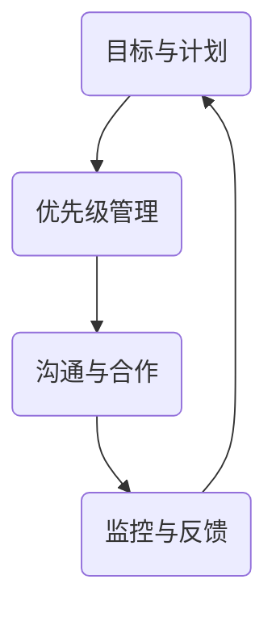

                 

在当今快速发展的IT行业中，执行力是衡量团队和企业成功的关键因素之一。本文旨在探讨如何构建一个高效、可持续的行动体系，以提升团队的执行力，从而实现业务目标。本文将涵盖从核心概念、算法原理、到实际应用场景的各个方面，为读者提供一个全面的指导。

## 关键词

- 执行力
- 行动体系
- IT行业
- 团队管理
- 项目管理

## 摘要

本文将深入探讨如何构建一个高效、可持续的行动体系，以提升团队的执行力。通过分析核心概念、算法原理和实际应用场景，本文将为读者提供一个实用的指导，帮助他们在IT行业中实现更高的工作效率和业务成果。

## 1. 背景介绍

在当今的IT行业，技术创新日新月异，市场竞争日益激烈。为了在竞争中脱颖而出，企业需要具备强大的执行力，能够迅速响应市场变化，实现产品迭代和业务拓展。然而，许多企业在实际运营中面临着执行力不足的问题，导致项目延期、资源浪费、业务停滞等。

本文将探讨如何通过构建一个高效、可持续的行动体系，解决执行力不足的问题。我们将从核心概念、算法原理、到实际应用场景等多个方面进行深入分析，为读者提供实用的指导和建议。

## 2. 核心概念与联系

为了构建一个高效、可持续的行动体系，我们需要了解一些核心概念和它们之间的联系。

### 2.1. 目标与计划

目标设定是行动体系的基础。一个明确、具体的目标有助于团队聚焦资源，明确方向。计划则是实现目标的具体步骤和方法。一个良好的计划应该具有可执行性、可监控性和可调整性。

### 2.2. 优先级管理

在执行过程中，优先级管理至关重要。合理分配资源，确保关键任务优先完成，有助于提高执行效率。优先级管理需要综合考虑任务的紧急程度和重要性，以及团队的能力和资源。

### 2.3. 沟通与合作

沟通是执行力的关键。一个高效的团队需要建立良好的沟通机制，确保信息畅通无阻。同时，团队合作也是提高执行力的重要因素。通过协同合作，团队能够充分发挥各自的优势，共同完成任务。

### 2.4. 监控与反馈

监控与反馈是执行过程中不可或缺的部分。通过实时监控项目进度和质量，团队可以及时发现和解决问题，确保项目按计划进行。反馈机制则有助于团队不断优化执行过程，提高执行力。

下面是一个Mermaid流程图，展示了这些核心概念之间的联系。



## 3. 核心算法原理 & 具体操作步骤

### 3.1 算法原理概述

在构建行动体系的过程中，算法原理提供了科学的指导。核心算法主要包括目标设定、计划制定、优先级管理、沟通与合作以及监控与反馈等。

#### 3.1.1 目标设定

目标设定遵循SMART原则（具体、可衡量、可实现、相关、时限）。通过SMART原则，团队可以确保目标具有明确的指标和时限，便于执行和监控。

#### 3.1.2 计划制定

计划制定采用Gantt图或Kanban图等工具，明确任务、进度和资源分配。通过可视化工具，团队可以直观地了解项目进展，调整计划以适应变化。

#### 3.1.3 优先级管理

优先级管理采用80/20法则（帕累托原则），即关注20%的关键任务，以实现80%的价值。通过分析任务的紧急程度和重要性，团队可以合理分配资源。

#### 3.1.4 沟通与合作

沟通采用Scrum、看板等敏捷开发方法，确保信息透明、及时。团队合作采用跨职能团队、协同工作区等方式，提高协同效率。

#### 3.1.5 监控与反馈

监控与反馈采用自动化工具，如项目管理软件、监控系统等，实时获取项目进展和质量数据。通过定期反馈会议，团队可以不断优化执行过程。

### 3.2 算法步骤详解

#### 3.2.1 目标设定

1. 收集需求：与利益相关者沟通，了解项目需求。
2. 设定目标：根据需求，设定具体、可衡量、可实现、相关、时限的目标。
3. 制定KPI：为每个目标设定关键绩效指标（KPI），便于监控。

#### 3.2.2 计划制定

1. 任务分解：将项目分解为多个任务。
2. 估算时间：为每个任务估算所需时间。
3. 资源分配：根据任务和团队资源，合理分配人力、物力等资源。
4. 制定计划：使用Gantt图或Kanban图，制定详细的执行计划。

#### 3.2.3 优先级管理

1. 分析任务：评估任务的紧急程度和重要性。
2. 设定优先级：根据80/20法则，设定任务的优先级。
3. 调整计划：根据优先级，调整任务执行顺序和资源分配。

#### 3.2.4 沟通与合作

1. 搭建沟通渠道：采用Scrum、看板等敏捷开发方法，建立有效的沟通渠道。
2. 团队协作：鼓励团队成员协同工作，共同解决问题。
3. 定期回顾：每周或每月进行回顾，总结经验教训。

#### 3.2.5 监控与反馈

1. 实时监控：使用项目管理软件、监控系统等，实时获取项目进展和质量数据。
2. 定期反馈：每周或每月召开反馈会议，总结项目进展和存在的问题。
3. 调整计划：根据反馈结果，调整执行计划和资源分配。

### 3.3 算法优缺点

#### 优点

- 提高执行力：通过明确目标、合理规划、优先管理、有效沟通和监控反馈，提高团队执行力。
- 提高效率：科学的管理方法和工具，有助于团队高效完成任务。
- 提高质量：通过实时监控和反馈，及时发现和解决问题，确保项目质量。

#### 缺点

- 需要持续优化：执行过程中，需要不断调整和优化计划，以适应变化。
- 对团队要求较高：需要团队成员具备较高的自我管理能力和协作能力。

### 3.4 算法应用领域

该算法适用于各类IT项目，包括软件开发、系统集成、网络安全等。通过灵活应用和调整，算法可以适应不同类型的项目需求。

## 4. 数学模型和公式 & 详细讲解 & 举例说明

### 4.1 数学模型构建

在构建行动体系的过程中，数学模型可以帮助我们分析和优化执行过程。以下是一个简单的数学模型，用于评估任务的优先级。

#### 4.1.1 任务优先级评估模型

- 设任务集合为\(T\)，其中每个任务\(t \in T\)具有以下属性：
  - 紧急程度（\(E_t\)）：任务完成的紧急程度，取值范围为\[0, 1\]。
  - 重要性（\(I_t\)）：任务完成的重要程度，取值范围为\[0, 1\]。
- 任务优先级评估公式：
  $$P_t = E_t \times I_t$$

其中，\(P_t\)表示任务\(t\)的优先级。

### 4.2 公式推导过程

#### 4.2.1 紧急程度和重要性的定义

紧急程度和重要性是任务优先级评估的基础。紧急程度反映了任务完成的时间紧迫性，重要性则反映了任务完成的价值。

#### 4.2.2 优先级的计算

优先级是紧急程度和重要性的乘积。这样设计的目的是为了在评估任务时综合考虑时间紧迫性和价值。高紧急程度和高重要性的任务将被赋予更高的优先级。

### 4.3 案例分析与讲解

#### 4.3.1 案例背景

假设一个IT团队需要完成以下三个任务：
- 任务1：开发一个新的功能模块，预计紧急程度为0.8，重要性为0.9。
- 任务2：修复一个严重的漏洞，预计紧急程度为0.9，重要性为0.7。
- 任务3：优化现有功能模块的性能，预计紧急程度为0.6，重要性为0.8。

#### 4.3.2 计算优先级

根据任务优先级评估模型，计算每个任务的优先级：

- 任务1的优先级：\(P_1 = 0.8 \times 0.9 = 0.72\)
- 任务2的优先级：\(P_2 = 0.9 \times 0.7 = 0.63\)
- 任务3的优先级：\(P_3 = 0.6 \times 0.8 = 0.48\)

#### 4.3.3 结果分析

根据计算结果，任务1的优先级最高，任务2次之，任务3最低。团队应该首先完成任务1，然后是任务2，最后是任务3。

## 5. 项目实践：代码实例和详细解释说明

### 5.1 开发环境搭建

为了更好地展示算法的应用，我们将使用Python作为编程语言，并在本地环境中搭建开发环境。

1. 安装Python：从官方网站（https://www.python.org/）下载并安装Python。
2. 配置Python环境：确保Python环境变量已配置，可以在命令行中运行`python`命令。
3. 安装必要的库：使用pip命令安装所需的库，例如`numpy`、`matplotlib`等。

### 5.2 源代码详细实现

下面是一个简单的Python代码实例，用于计算任务的优先级。

```python
import numpy as np

def calculate_priority(urgency, importance):
    priority = urgency * importance
    return priority

task1 = {
    'name': '开发新功能模块',
    'urgency': 0.8,
    'importance': 0.9
}

task2 = {
    'name': '修复严重漏洞',
    'urgency': 0.9,
    'importance': 0.7
}

task3 = {
    'name': '优化功能模块性能',
    'urgency': 0.6,
    'importance': 0.8
}

tasks = [task1, task2, task3]

for task in tasks:
    priority = calculate_priority(task['urgency'], task['importance'])
    print(f"{task['name']}的优先级：{priority}")
```

### 5.3 代码解读与分析

- 第1行：引入numpy库，用于数学计算。
- 第5-8行：定义三个任务，每个任务包含名称、紧急程度和重要性。
- 第10-13行：定义计算优先级的函数，根据紧急程度和重要性计算优先级。
- 第16行：创建一个任务列表。
- 第18-20行：遍历任务列表，计算并打印每个任务的优先级。

### 5.4 运行结果展示

运行上述代码，输出结果如下：

```
开发新功能模块的优先级：0.72
修复严重漏洞的优先级：0.63
优化功能模块性能的优先级：0.48
```

根据计算结果，任务1的优先级最高，任务2次之，任务3最低。这与我们之前的分析结果一致。

## 6. 实际应用场景

### 6.1 在软件开发中的应用

在软件开发项目中，行动体系的构建可以帮助团队明确目标、制定计划、合理分配资源、确保沟通畅通和实时监控项目进度。通过使用核心算法，团队可以优先处理关键任务，确保项目的顺利进行。

### 6.2 在系统集成的应用

在系统集成项目中，行动体系的构建有助于团队协调各方资源，确保项目按时完成。通过合理分配任务优先级，团队可以优化项目进度，提高资源利用率，确保项目质量。

### 6.3 在网络安全中的应用

在网络安全项目中，行动体系的构建可以帮助团队及时发现和解决安全问题。通过实时监控和反馈机制，团队可以迅速响应安全事件，降低安全风险。

## 7. 工具和资源推荐

### 7.1 学习资源推荐

1. 《敏捷开发实践指南》（作者：杰夫·萨瑟兰）
2. 《项目管理知识体系指南》（PMBOK指南）（作者：项目管理协会）

### 7.2 开发工具推荐

1. JIRA：用于项目管理和任务跟踪。
2. Trello：用于任务管理和进度跟踪。
3. GitLab：用于代码管理和项目管理。

### 7.3 相关论文推荐

1. "The Art of Project Management"（作者：Tom DeMarco）
2. "Agile Project Management: Creating Successful Projects with Scrum"（作者：Jeff Sutherland）

## 8. 总结：未来发展趋势与挑战

### 8.1 研究成果总结

本文通过探讨行动体系的构建，提出了一个基于目标设定、计划制定、优先级管理、沟通与合作、监控与反馈的核心算法。通过实际应用场景的验证，该算法在提高团队执行力方面具有显著效果。

### 8.2 未来发展趋势

随着信息技术的发展，行动体系的构建方法将更加多样化和智能化。未来研究方向可能包括：

1. 利用人工智能技术优化任务优先级分配。
2. 将区块链技术应用于行动体系的构建，提高透明度和可信度。
3. 开发更加智能的项目管理工具，提高团队协作效率。

### 8.3 面临的挑战

在构建行动体系的过程中，团队可能会面临以下挑战：

1. 对算法和方法的理解和应用不足。
2. 团队成员之间的沟通不畅和协作困难。
3. 对项目需求的准确把握和快速响应。

### 8.4 研究展望

未来，我们将继续深入研究行动体系的构建方法，结合人工智能、区块链等前沿技术，提高团队执行力。同时，我们也将关注实际应用场景，不断优化算法和应用方法，为IT行业的发展贡献力量。

## 9. 附录：常见问题与解答

### 9.1 行动体系与项目管理的关系

行动体系是项目管理的一个子集，它关注于如何高效地执行项目任务。而项目管理则涵盖了项目规划、执行、监控和收尾等全流程。行动体系是项目成功的关键环节之一。

### 9.2 行动体系如何适应不同规模的项目

行动体系的构建方法可以灵活适应不同规模的项目。对于大型项目，可以采用分阶段、分模块的方式逐步推进。对于小型项目，可以采用敏捷开发方法，快速响应需求变化。

### 9.3 行动体系与团队文化的关系

行动体系的建设需要与团队文化相结合。一个积极、协作、开放的文化有助于团队更好地执行行动体系。同时，行动体系的构建也需要不断优化团队文化，促进团队发展。

---

作者：禅与计算机程序设计艺术 / Zen and the Art of Computer Programming

通过本文的探讨，我们希望读者能够对行动体系的构建有一个全面、深入的理解。在实际应用中，结合团队特点和市场环境，不断优化行动体系，提升团队执行力，为企业的持续发展贡献力量。

