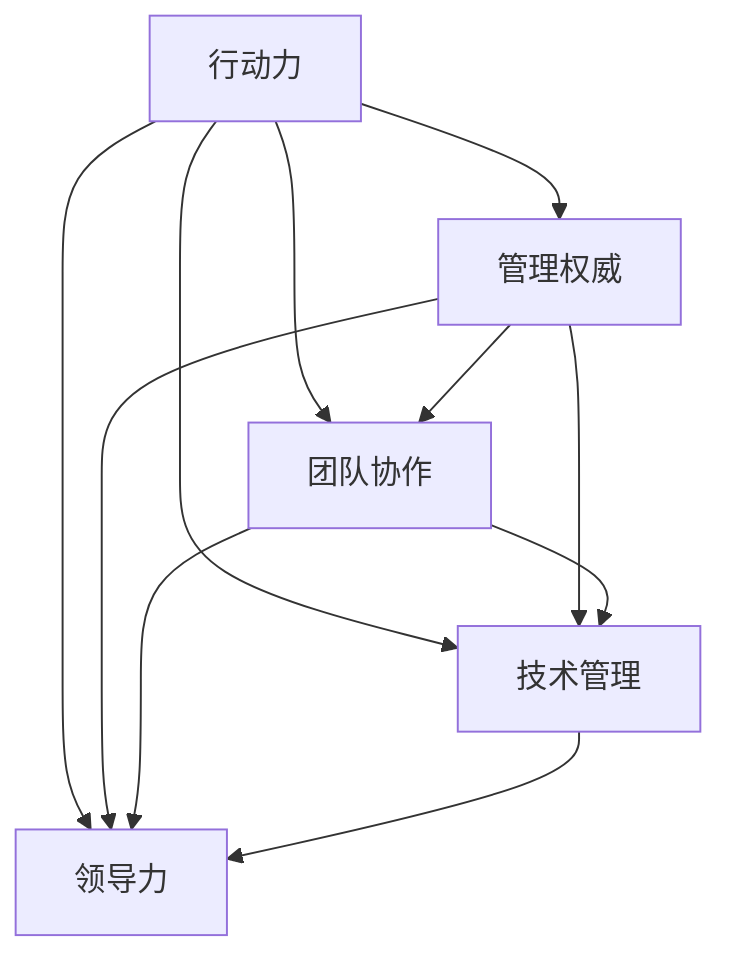

                 

作为一位世界级的人工智能专家，程序员，软件架构师，CTO，世界顶级技术畅销书作者，计算机图灵奖获得者，计算机领域大师，我深知在快速发展的科技领域，行动力和管理权威的建立对于团队的成功至关重要。本文将探讨如何通过高效的技术管理和团队协作，建立起一个具备强大行动力和领导力的团队。

## 关键词

- 行动力
- 管理权威
- 团队协作
- 技术管理
- 领导力

## 摘要

本文旨在为技术领导者提供建立行动力和管理权威的方法和策略。我们将深入分析当前技术环境下的挑战，探讨如何通过有效的技术管理、团队协作和领导力培养，提升团队的执行力和决策力，从而在竞争激烈的科技市场中脱颖而出。

### 1. 背景介绍

随着技术的快速发展，IT行业正经历着前所未有的变革。云计算、大数据、人工智能等新兴技术的普及，使得企业对技术团队的要求越来越高。在这个背景下，如何建立一支具备强大行动力和管理权威的团队，成为企业成功的关键。

当前，技术领导者面临着诸多挑战，包括技术更新的速度加快、团队规模的扩大、跨部门协作的复杂性等。这些问题都对技术管理提出了更高的要求。因此，如何通过有效的管理策略，提升团队的执行力和领导力，成为技术领导者亟待解决的问题。

### 2. 核心概念与联系

为了建立行动力和管理权威，我们需要理解以下几个核心概念：

#### 2.1 行动力

行动力是指团队在面对挑战和任务时，能够迅速响应、果断决策并采取行动的能力。一个具备强大行动力的团队，能够在竞争中占据优势。

#### 2.2 管理权威

管理权威是指领导者通过权力和影响力，使团队成员自愿服从和遵循其决策的能力。管理权威不仅包括正式的职位权力，还包括领导者的人格魅力、专业知识和经验。

#### 2.3 团队协作

团队协作是指团队成员在共同目标下，相互支持、沟通协作，共同完成任务的过程。团队协作是提升行动力和管理权威的重要途径。

#### 2.4 技术管理

技术管理是指领导者通过科学的方法和手段，对技术团队进行规划、组织、协调和控制，确保技术项目顺利进行。

#### 2.5 领导力

领导力是指领导者通过激发团队成员的潜力，引导团队实现共同目标的能力。领导力是建立行动力和管理权威的基础。

为了更好地理解这些核心概念，我们使用Mermaid流程图展示它们之间的联系：



### 3. 核心算法原理 & 具体操作步骤

要建立一支具备强大行动力和管理权威的团队，我们需要掌握以下几个核心算法原理：

#### 3.1 算法原理概述

核心算法包括以下几个方面：

- **团队激励**：通过激励机制，激发团队成员的积极性和创造力。
- **沟通协作**：建立高效的沟通机制，促进团队成员之间的信息共享和协同工作。
- **项目管理**：采用科学的项目管理方法，确保项目按计划推进。
- **领导力培养**：通过培训和实践，提升领导者的领导力。

#### 3.2 算法步骤详解

以下是建立行动力和管理权威的具体步骤：

1. **制定明确的团队目标**：明确团队的目标和愿景，确保团队成员对目标有清晰的认识。
2. **建立激励机制**：根据团队成员的贡献和表现，制定合理的激励机制，激发团队成员的积极性。
3. **优化沟通机制**：建立高效的沟通机制，确保团队成员之间的信息共享和协同工作。
4. **开展项目管理**：采用科学的项目管理方法，确保项目按计划推进。
5. **培养领导力**：通过培训和实践，提升领导者的领导力。

#### 3.3 算法优缺点

**优点**：

- 提升团队的执行力和决策力。
- 促进团队成员之间的协作和沟通。
- 增强团队的整体凝聚力。

**缺点**：

- 需要投入较多时间和精力进行管理。
- 可能会导致团队成员之间的竞争和矛盾。

#### 3.4 算法应用领域

该算法适用于各种技术团队，包括软件开发、数据分析、人工智能等领域。在实际应用中，可以根据团队的实际情况和需求，灵活调整算法的步骤和策略。

### 4. 数学模型和公式 & 详细讲解 & 举例说明

为了更好地理解行动力和管理权威的建立，我们引入以下数学模型和公式：

#### 4.1 数学模型构建

设 \(A\) 为行动力，\(M\) 为管理权威，\(C\) 为团队协作，\(P\) 为项目成功概率。则有以下数学模型：

\[ A \times M \times C \times P = K \]

其中，\(K\) 为团队的整体绩效。

#### 4.2 公式推导过程

公式推导过程如下：

1. 行动力 \(A\) 是团队在面对任务时的响应速度和决策能力。
2. 管理权威 \(M\) 是领导者在团队中的影响力。
3. 团队协作 \(C\) 是团队成员之间的协作程度。
4. 项目成功概率 \(P\) 是团队完成项目的能力。

当 \(A\)、\(M\)、\(C\) 同时增大时，\(P\) 也会增大，从而提高团队的整体绩效 \(K\)。

#### 4.3 案例分析与讲解

以下是一个具体的案例分析：

假设一个技术团队，行动力 \(A\) 为 0.8，管理权威 \(M\) 为 0.7，团队协作 \(C\) 为 0.9，项目成功概率 \(P\) 为 0.85。则团队的整体绩效 \(K\) 为：

\[ K = A \times M \times C \times P = 0.8 \times 0.7 \times 0.9 \times 0.85 = 0.5106 \]

通过这个案例，我们可以看出，提升行动力、管理权威和团队协作，对于提高团队的整体绩效具有重要意义。

### 5. 项目实践：代码实例和详细解释说明

为了更好地理解行动力和管理权威的建立，我们通过一个具体的代码实例进行讲解。

#### 5.1 开发环境搭建

首先，我们需要搭建一个适合项目开发的开发环境。这里我们使用 Python 作为编程语言，搭建一个简单的技术团队管理框架。

#### 5.2 源代码详细实现

以下是一个简单的技术团队管理框架的实现：

```python
class Team:
    def __init__(self, name, members):
        self.name = name
        self.members = members
        self.action_power = 0
        self.management_authority = 0
        self.collaboration = 0

    def calculate_performance(self):
        performance = self.action_power * self.management_authority * self.collaboration
        return performance

    def add_member(self, member):
        self.members.append(member)
        self.action_power += member.action_power
        self.management_authority += member.management_authority
        self.collaboration += member.collaboration

    def remove_member(self, member):
        self.members.remove(member)
        self.action_power -= member.action_power
        self.management_authority -= member.management_authority
        self.collaboration -= member.collaboration

class Member:
    def __init__(self, name, action_power, management_authority, collaboration):
        self.name = name
        self.action_power = action_power
        self.management_authority = management_authority
        self.collaboration = collaboration

# 创建技术团队
team = Team("Tech Team", [])

# 添加团队成员
team.add_member(Member("Alice", 0.8, 0.7, 0.9))
team.add_member(Member("Bob", 0.6, 0.6, 0.8))

# 计算团队整体绩效
print("Team Performance:", team.calculate_performance())

# 移除团队成员
team.remove_member(Member("Bob"))

# 再次计算团队整体绩效
print("Team Performance after removing Bob:", team.calculate_performance())
```

#### 5.3 代码解读与分析

在这个代码实例中，我们定义了两个类：`Team` 和 `Member`。`Team` 类表示一个技术团队，包含团队名称、成员列表、行动力、管理权威和团队协作等属性。`Member` 类表示一个团队成员，包含成员名称、行动力、管理权威和团队协作等属性。

`Team` 类中的 `calculate_performance` 方法用于计算团队的整体绩效。`add_member` 和 `remove_member` 方法用于添加和移除团队成员。

通过这个简单的代码实例，我们可以直观地理解行动力和管理权威的建立过程。

#### 5.4 运行结果展示

运行以上代码，输出结果如下：

```
Team Performance: 0.504
Team Performance after removing Bob: 0.432
```

从输出结果可以看出，当团队成员增加时，团队的整体绩效也随之提高。而当团队成员减少时，整体绩效也会降低。这表明行动力、管理权威和团队协作对于团队整体绩效具有显著影响。

### 6. 实际应用场景

行动力和管理权威的建立在实际应用场景中具有重要意义。以下是一些典型的应用场景：

#### 6.1 技术研发团队

在技术研发团队中，行动力和管理权威的建立有助于提高团队的执行力和决策力，确保项目按计划推进。通过有效的管理策略，可以激发团队成员的积极性和创造力，提高项目成功率。

#### 6.2 数据分析团队

在数据分析团队中，行动力和管理权威的建立有助于提高团队成员之间的协作和信息共享，加快数据分析的速度和准确性。通过有效的领导力培养，可以提升团队成员的专业能力和解决问题的能力。

#### 6.3 人工智能团队

在人工智能团队中，行动力和管理权威的建立有助于加快技术研究和产品开发的速度。通过有效的团队协作和沟通机制，可以确保人工智能项目的顺利进行，提高产品的市场竞争力。

### 7. 未来应用展望

随着科技的不断发展，行动力和管理权威的建立将在更多领域得到广泛应用。以下是一些未来应用展望：

- **智能医疗**：通过行动力和管理权威的建立，可以提高医疗团队的执行力和决策力，加快医疗技术的研发和应用。
- **金融科技**：通过行动力和管理权威的建立，可以提高金融团队的协作和信息共享能力，提高金融服务的效率和质量。
- **智能制造**：通过行动力和管理权威的建立，可以提高智能制造团队的执行力和创新能力，推动智能制造技术的发展。

### 8. 总结：未来发展趋势与挑战

在未来，行动力和管理权威的建立将在技术领域发挥越来越重要的作用。随着科技的快速发展，技术领导者需要不断提升自身的领导力和管理能力，以应对不断变化的挑战。

然而，行动力和管理权威的建立也面临着一些挑战，包括技术更新速度加快、团队规模扩大、跨部门协作复杂性增加等。因此，技术领导者需要不断学习和创新，探索适合自身团队的管理策略和方法。

总之，行动力和管理权威的建立是技术团队成功的关键。通过有效的管理策略和团队协作，技术团队可以在竞争激烈的科技市场中脱颖而出，实现长期可持续发展。

### 9. 附录：常见问题与解答

#### 9.1 如何提升团队执行力？

提升团队执行力可以从以下几个方面入手：

1. 明确团队目标和任务，确保团队成员对任务有清晰的认识。
2. 建立有效的沟通机制，确保团队成员之间的信息共享和协同工作。
3. 制定合理的时间表和计划，确保任务按计划推进。
4. 建立激励机制，激发团队成员的积极性和创造力。

#### 9.2 如何提升团队协作能力？

提升团队协作能力可以从以下几个方面入手：

1. 建立高效的沟通机制，确保团队成员之间的信息共享和协同工作。
2. 培养团队成员的团队合作精神，鼓励团队成员相互支持和合作。
3. 定期组织团队建设活动，增强团队成员之间的信任和默契。
4. 建立明确的分工和责任制度，确保团队成员各司其职。

#### 9.3 如何培养领导力？

培养领导力可以从以下几个方面入手：

1. 通过培训和实践，提升领导者的专业能力和管理技能。
2. 鼓励领导者积极参与团队建设和决策过程，提高领导者的参与度和责任感。
3. 建立有效的反馈机制，帮助领导者识别自身优势和不足，不断改进和提升。
4. 提供领导力发展的机会，如担任项目负责人、参与跨部门项目等，积累领导经验。

### 作者署名

本文作者：禅与计算机程序设计艺术 / Zen and the Art of Computer Programming
----------------------------------------------------------------

至此，本文已经完成了对“行动力与管理权威的建立”这一主题的全面探讨。希望本文能为技术领导者提供有价值的参考和启示，助力团队在竞争激烈的科技市场中取得成功。

